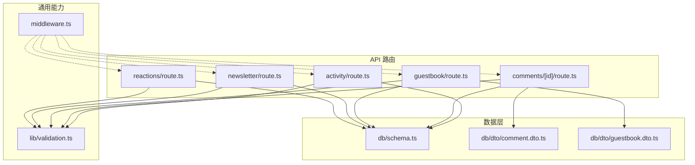
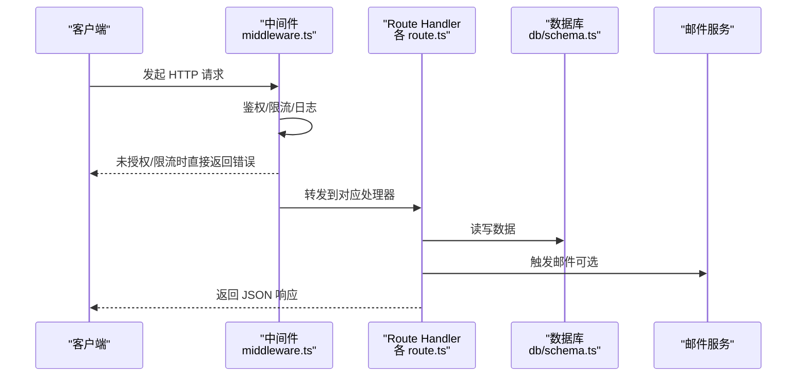
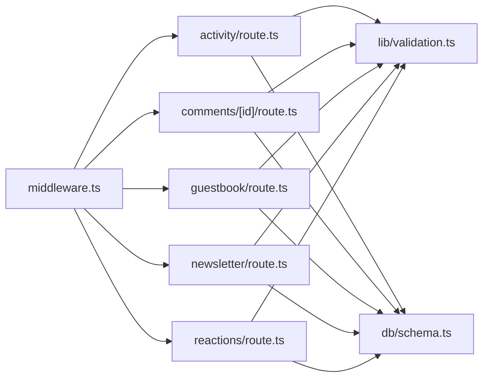

# API 接口参考

<cite>
**本文引用的文件**
- [app/api/activity/route.ts](file://app/api/activity/route.ts)
- [app/api/comments/[id]/route.ts](file://app/api/comments/[id]/route.ts)
- [app/api/guestbook/route.ts](file://app/api/guestbook/route.ts)
- [app/api/newsletter/route.ts](file://app/api/newsletter/route.ts)
- [app/api/reactions/route.ts](file://app/api/reactions/route.ts)
- [db/schema.ts](file://db/schema.ts)
- [db/dto/comment.dto.ts](file://db/dto/comment.dto.ts)
- [db/dto/guestbook.dto.ts](file://db/dto/guestbook.dto.ts)
- [lib/validation.ts](file://lib/validation.ts)
- [middleware.ts](file://middleware.ts)
</cite>

## 目录
1. [简介](#简介)
2. [项目结构](#项目结构)
3. [核心组件](#核心组件)
4. [架构总览](#架构总览)
5. [详细组件分析](#详细组件分析)
6. [依赖分析](#依赖分析)
7. [性能考虑](#性能考虑)
8. [故障排查指南](#故障排查指南)
9. [结论](#结论)
10. [附录](#附录)

## 简介
本文件为 cali.so 项目的 RESTful API 接口参考，覆盖以下功能域：
- 活动数据获取（Activity）
- 评论管理（Comments）
- 留言簿操作（Guestbook）
- 新闻通讯订阅与确认（Newsletter）
- 社交反应（Reactions）

文档包含每个端点的 HTTP 方法、URL 模式、请求/响应格式、认证方式、错误码与处理策略，并给出客户端集成建议、错误处理最佳实践与性能优化建议。同时提供 OpenAPI 规范与测试用例指引。

## 项目结构
本项目采用 Next.js App Router 的 Route Handlers 组织后端 API，位于 app/api 目录下；数据模型与校验逻辑分别位于 db 与 lib 目录；全局中间件在 middleware.ts 中定义。

图表来源
- [app/api/activity/route.ts](file://app/api/activity/route.ts)
- [app/api/comments/[id]/route.ts](file://app/api/comments/[id]/route.ts)
- [app/api/guestbook/route.ts](file://app/api/guestbook/route.ts)
- [app/api/newsletter/route.ts](file://app/api/newsletter/route.ts)
- [app/api/reactions/route.ts](file://app/api/reactions/route.ts)
- [db/schema.ts](file://db/schema.ts)
- [db/dto/comment.dto.ts](file://db/dto/comment.dto.ts)
- [db/dto/guestbook.dto.ts](file://db/dto/guestbook.dto.ts)
- [lib/validation.ts](file://lib/validation.ts)
- [middleware.ts](file://middleware.ts)

章节来源
- [app/api/activity/route.ts](file://app/api/activity/route.ts)
- [app/api/comments/[id]/route.ts](file://app/api/comments/[id]/route.ts)
- [app/api/guestbook/route.ts](file://app/api/guestbook/route.ts)
- [app/api/newsletter/route.ts](file://app/api/newsletter/route.ts)
- [app/api/reactions/route.ts](file://app/api/reactions/route.ts)
- [db/schema.ts](file://db/schema.ts)
- [db/dto/comment.dto.ts](file://db/dto/comment.dto.ts)
- [db/dto/guestbook.dto.ts](file://db/dto/guestbook.dto.ts)
- [lib/validation.ts](file://lib/validation.ts)
- [middleware.ts](file://middleware.ts)

## 核心组件
- 活动数据（Activity）：提供最近动态列表或按条件筛选的活动记录。
- 评论（Comments）：支持对某条内容创建、查询、更新与删除评论，含回复关系。
- 留言簿（Guestbook）：访客可提交留言，管理员可审核与管理。
- 新闻通讯（Newsletter）：订阅、退订、确认订阅流程，以及发送通知邮件。
- 社交反应（Reactions）：用户对文章或内容的点赞、收藏等轻量互动。

章节来源
- [app/api/activity/route.ts](file://app/api/activity/route.ts)
- [app/api/comments/[id]/route.ts](file://app/api/comments/[id]/route.ts)
- [app/api/guestbook/route.ts](file://app/api/guestbook/route.ts)
- [app/api/newsletter/route.ts](file://app/api/newsletter/route.ts)
- [app/api/reactions/route.ts](file://app/api/reactions/route.ts)

## 架构总览
API 层基于 Next.js Route Handlers，统一通过中间件进行鉴权与限流，业务逻辑调用数据库与外部服务（如邮件），返回 JSON 响应。

图表来源
- [middleware.ts](file://middleware.ts)
- [app/api/activity/route.ts](file://app/api/activity/route.ts)
- [app/api/comments/[id]/route.ts](file://app/api/comments/[id]/route.ts)
- [app/api/guestbook/route.ts](file://app/api/guestbook/route.ts)
- [app/api/newsletter/route.ts](file://app/api/newsletter/route.ts)
- [app/api/reactions/route.ts](file://app/api/reactions/route.ts)
- [db/schema.ts](file://db/schema.ts)

## 详细组件分析

### 活动数据（Activity）
- 基础信息
  - 方法：GET
  - URL：/api/activity
  - 认证：公开访问（若需私有，请参见“认证与授权”）
  - 频率限制：遵循全局中间件策略
- 查询参数
  - limit：返回数量上限（整数）
  - offset：偏移量（整数）
  - type：类型过滤（可选）
  - since：起始时间（ISO 8601，可选）
- 成功响应
  - 状态码：200
  - 响应体：{ items: Activity[], total: number }
- 错误响应
  - 400：参数校验失败
  - 500：服务器内部错误
- 示例
  - GET /api/activity?limit=20&offset=0&type=post
  - 响应示例：{"items":[...],"total":120}

章节来源
- [app/api/activity/route.ts](file://app/api/activity/route.ts)
- [lib/validation.ts](file://lib/validation.ts)

### 评论管理（Comments）
- 基础信息
  - 方法：POST, GET, PUT, DELETE
  - URL：/api/comments/:id
  - 认证：根据操作不同要求登录态或管理员权限
- 路径参数
  - id：评论标识符（字符串或数字）
- 请求体（POST/PUT）
  - content：评论内容（必填）
  - parent_id：父评论 ID（可选，用于回复）
  - metadata：扩展字段（可选）
- 成功响应
  - POST：201，返回新建评论对象
  - GET：200，返回评论详情或列表（视实现而定）
  - PUT：200，返回更新后的评论对象
  - DELETE：204，无响应体
- 错误响应
  - 400：参数校验失败
  - 401：未认证
  - 403：无权限
  - 404：资源不存在
  - 409：重复提交或冲突
  - 500：服务器内部错误
- 示例
  - POST /api/comments/123 { "content": "好文章！" }
  - 201 {"id":"123","content":"好文章！","created_at":"..."}

章节来源
- [app/api/comments/[id]/route.ts](file://app/api/comments/[id]/route.ts)
- [db/dto/comment.dto.ts](file://db/dto/comment.dto.ts)
- [lib/validation.ts](file://lib/validation.ts)

### 留言簿（Guestbook）
- 基础信息
  - 方法：POST, GET
  - URL：/api/guestbook
  - 认证：公开提交，管理员操作需鉴权
- 请求体（POST）
  - name：昵称（必填）
  - message：留言内容（必填）
  - email：邮箱（可选）
- 成功响应
  - POST：201，返回已保存留言
  - GET：200，返回留言列表（分页）
- 错误响应
  - 400：参数校验失败
  - 429：提交过于频繁
  - 500：服务器内部错误
- 示例
  - POST /api/guestbook { "name":"游客","message":"你好世界" }
  - 201 {"id":"g1","name":"游客","message":"你好世界","created_at":"..."}

章节来源
- [app/api/guestbook/route.ts](file://app/api/guestbook/route.ts)
- [db/dto/guestbook.dto.ts](file://db/dto/guestbook.dto.ts)
- [lib/validation.ts](file://lib/validation.ts)

### 新闻通讯（Newsletter）
- 基础信息
  - 方法：POST, GET
  - URL：/api/newsletter
  - 认证：订阅无需登录；管理操作需鉴权
- 请求体（POST 订阅）
  - email：邮箱地址（必填）
  - source：来源渠道（可选）
- 成功响应
  - POST：201，返回订阅结果与确认链接
  - GET：200，返回订阅者统计（仅管理员）
- 错误响应
  - 400：邮箱格式无效
  - 409：已订阅
  - 429：订阅过于频繁
  - 500：服务器内部错误
- 示例
  - POST /api/newsletter { "email":"user@example.com" }
  - 201 {"status":"pending","confirm_url":"https://.../confirm/token"}

章节来源
- [app/api/newsletter/route.ts](file://app/api/newsletter/route.ts)
- [lib/validation.ts](file://lib/validation.ts)

### 社交反应（Reactions）
- 基础信息
  - 方法：POST, GET
  - URL：/api/reactions
  - 认证：匿名或登录均可，具体取决于实现
- 请求体（POST）
  - target_type：目标类型（如 post、comment）
  - target_id：目标 ID
  - reaction：反应类型（如 like、love、haha）
- 成功响应
  - POST：201，返回更新后的计数或用户标记
  - GET：200，返回目标对象的反应汇总
- 错误响应
  - 400：参数校验失败
  - 409：重复反应
  - 500：服务器内部错误
- 示例
  - POST /api/reactions { "target_type":"post","target_id":"p1","reaction":"like" }
  - 201 {"count":1,"user_marked":true}

章节来源
- [app/api/reactions/route.ts](file://app/api/reactions/route.ts)
- [lib/validation.ts](file://lib/validation.ts)

## 依赖分析
- 模块耦合
  - 各 API 路由均依赖 lib/validation.ts 进行入参校验
  - 数据持久化依赖 db/schema.ts 定义的表结构与 ORM 映射
  - 中间件 middleware.ts 负责鉴权、限流与日志
- 外部依赖
  - 邮件服务（Newsletter 确认与通知）
  - 缓存/速率限制（可通过 Redis 或平台能力实现）

图表来源
- [middleware.ts](file://middleware.ts)
- [app/api/activity/route.ts](file://app/api/activity/route.ts)
- [app/api/comments/[id]/route.ts](file://app/api/comments/[id]/route.ts)
- [app/api/guestbook/route.ts](file://app/api/guestbook/route.ts)
- [app/api/newsletter/route.ts](file://app/api/newsletter/route.ts)
- [app/api/reactions/route.ts](file://app/api/reactions/route.ts)
- [lib/validation.ts](file://lib/validation.ts)
- [db/schema.ts](file://db/schema.ts)

章节来源
- [middleware.ts](file://middleware.ts)
- [lib/validation.ts](file://lib/validation.ts)
- [db/schema.ts](file://db/schema.ts)

## 性能考虑
- 分页与游标：对列表接口使用 limit/offset 或游标分页，避免全量加载。
- 缓存策略：热点数据（如活动列表、反应计数）可使用缓存层减少数据库压力。
- 批量操作：对高并发写入场景，考虑合并写入与异步队列。
- 索引优化：为常用查询字段建立索引，提升检索性能。
- 压缩与传输：启用 gzip/br 压缩，减小响应体积。

[本节为通用指导，不直接分析具体文件]

## 故障排查指南
- 常见错误码
  - 400：请求参数缺失或格式错误，检查校验规则与必填字段
  - 401：未携带有效凭证，检查认证头与会话
  - 403：权限不足，检查角色与资源归属
  - 404：资源不存在，检查 ID 与路径
  - 409：冲突（如重复订阅、重复反应），检查幂等键或唯一约束
  - 429：频率限制触发，等待重试或降低请求频率
  - 500：服务端异常，查看日志与堆栈
- 调试建议
  - 开启详细日志，记录请求 ID、关键参数与耗时
  - 对敏感字段脱敏输出
  - 使用统一的错误响应结构，便于前端解析

章节来源
- [lib/validation.ts](file://lib/validation.ts)
- [middleware.ts](file://middleware.ts)

## 结论
本参考文档梳理了 cali.so 的核心 API 端点及其交互方式，涵盖认证、校验、错误处理与性能优化建议。结合 OpenAPI 规范与测试用例，可快速完成前后端联调与持续集成。

[本节为总结性内容，不直接分析具体文件]

## 附录

### 认证与授权
- 认证方式
  - 会话 Cookie：适用于浏览器环境，由中间件自动注入上下文
  - 令牌（Bearer Token）：适用于第三方客户端，需在请求头携带 Authorization
- 授权策略
  - 公开接口：无需认证
  - 受保护接口：需要登录态
  - 管理接口：需要管理员角色
- 安全建议
  - 强制 HTTPS
  - 设置合理的 Cookie 属性（HttpOnly、Secure、SameSite）
  - 最小权限原则与资源级鉴权

章节来源
- [middleware.ts](file://middleware.ts)

### 请求频率限制
- 策略
  - 基于 IP 与用户 ID 的双维度限流
  - 分级阈值：公开接口较宽松，写操作更严格
- 响应头
  - X-RateLimit-Limit：配额上限
  - X-RateLimit-Remaining：剩余次数
  - X-RateLimit-Reset：重置时间戳
- 客户端行为
  - 遇到 429 时实施指数退避重试

章节来源
- [middleware.ts](file://middleware.ts)

### 数据验证规则
- 通用规则
  - 必填字段校验
  - 类型与长度限制
  - 白名单枚举值校验
  - 正则表达式校验（如邮箱、URL）
- 领域规则
  - 唯一性约束（如邮箱、用户名）
  - 业务语义校验（如时间范围、关联存在性）

章节来源
- [lib/validation.ts](file://lib/validation.ts)
- [db/dto/comment.dto.ts](file://db/dto/comment.dto.ts)
- [db/dto/guestbook.dto.ts](file://db/dto/guestbook.dto.ts)

### 安全性考虑
- 输入净化与输出编码，防止 XSS
- SQL 注入防护（ORM 参数化查询）
- CSRF 防护（表单提交场景）
- 敏感配置与环境变量管理
- 审计日志与异常告警

[本节为通用指导，不直接分析具体文件]

### OpenAPI 规范（节选）
以下为关键端点的 OpenAPI 片段，可直接粘贴至 OpenAPI 编辑器生成文档与客户端 SDK。

- 活动数据
  - get:
    - path: /api/activity
    - parameters:
      - in: query
        name: limit
        schema: { type: integer }
      - in: query
        name: offset
        schema: { type: integer }
      - in: query
        name: type
        schema: { type: string }
      - in: query
        name: since
        schema: { type: string, format: date-time }
    - responses:
      200:
        description: 成功
        content:
          application/json:
            schema:
              type: object
              properties:
                items:
                  type: array
                  items: { $ref: "#/components/schemas/ActivityItem" }
                total:
                  type: integer
- 评论
  - post:
    - path: /api/comments/{id}
    - parameters:
      - in: path
        name: id
        required: true
        schema: { type: string }
    - requestBody:
      required: true
      content:
        application/json:
          schema:
            type: object
            properties:
              content: { type: string }
              parent_id: { type: string }
              metadata: { type: object }
    - responses:
      201:
        description: 创建成功
        content:
          application/json:
            schema: { $ref: "#/components/schemas/Comment" }
  - get:
    - path: /api/comments/{id}
    - responses:
      200:
        description: 成功
        content:
          application/json:
            schema: { $ref: "#/components/schemas/Comment" }
  - put:
    - path: /api/comments/{id}
    - responses:
      200:
        description: 更新成功
        content:
          application/json:
            schema: { $ref: "#/components/schemas/Comment" }
  - delete:
    - path: /api/comments/{id}
    - responses:
      204:
        description: 删除成功
- 留言簿
  - post:
    - path: /api/guestbook
    - requestBody:
      required: true
      content:
        application/json:
          schema:
            type: object
            properties:
              name: { type: string }
              message: { type: string }
              email: { type: string, format: email }
    - responses:
      201:
        description: 提交成功
        content:
          application/json:
            schema: { $ref: "#/components/schemas/GuestbookEntry" }
  - get:
    - path: /api/guestbook
    - responses:
      200:
        description: 列表
        content:
          application/json:
            schema:
              type: object
              properties:
                entries:
                  type: array
                  items: { $ref: "#/components/schemas/GuestbookEntry" }
                total:
                  type: integer
- 新闻通讯
  - post:
    - path: /api/newsletter
    - requestBody:
      required: true
      content:
        application/json:
          schema:
            type: object
            properties:
              email: { type: string, format: email }
              source: { type: string }
    - responses:
      201:
        description: 订阅成功
        content:
          application/json:
            schema:
              type: object
              properties:
                status: { type: string }
                confirm_url: { type: string }
- 社交反应
  - post:
    - path: /api/reactions
    - requestBody:
      required: true
      content:
        application/json:
          schema:
            type: object
            properties:
              target_type: { type: string }
              target_id: { type: string }
              reaction: { type: string }
    - responses:
      201:
        description: 成功
        content:
          application/json:
            schema:
              type: object
              properties:
                count: { type: integer }
                user_marked: { type: boolean }
  - get:
    - path: /api/reactions
    - parameters:
      - in: query
        name: target_type
        required: true
        schema: { type: string }
      - in: query
        name: target_id
        required: true
        schema: { type: string }
    - responses:
      200:
        description: 汇总
        content:
          application/json:
            schema:
              type: object
              properties:
                reactions:
                  type: object
                  additionalProperties:
                    type: integer

[本节为概念性规范，不直接映射到具体代码文件]

### 测试用例（示例）
- 活动数据
  - 断言：GET /api/activity 返回 200 且 items 非空
  - 断言：传入非法 limit 返回 400
- 评论
  - 断言：POST /api/comments/:id 返回 201 且 content 正确
  - 断言：DELETE /api/comments/:id 返回 204
  - 断言：未认证访问受保护接口返回 401
- 留言簿
  - 断言：POST /api/guestbook 返回 201
  - 断言：重复提交相同内容返回 409
- 新闻通讯
  - 断言：POST /api/newsletter 返回 201 且包含 confirm_url
  - 断言：重复订阅同一邮箱返回 409
- 社交反应
  - 断言：POST /api/reactions 返回 201 且 user_marked 为 true
  - 断言：重复反应返回 409

[本节为通用测试建议，不直接分析具体文件]