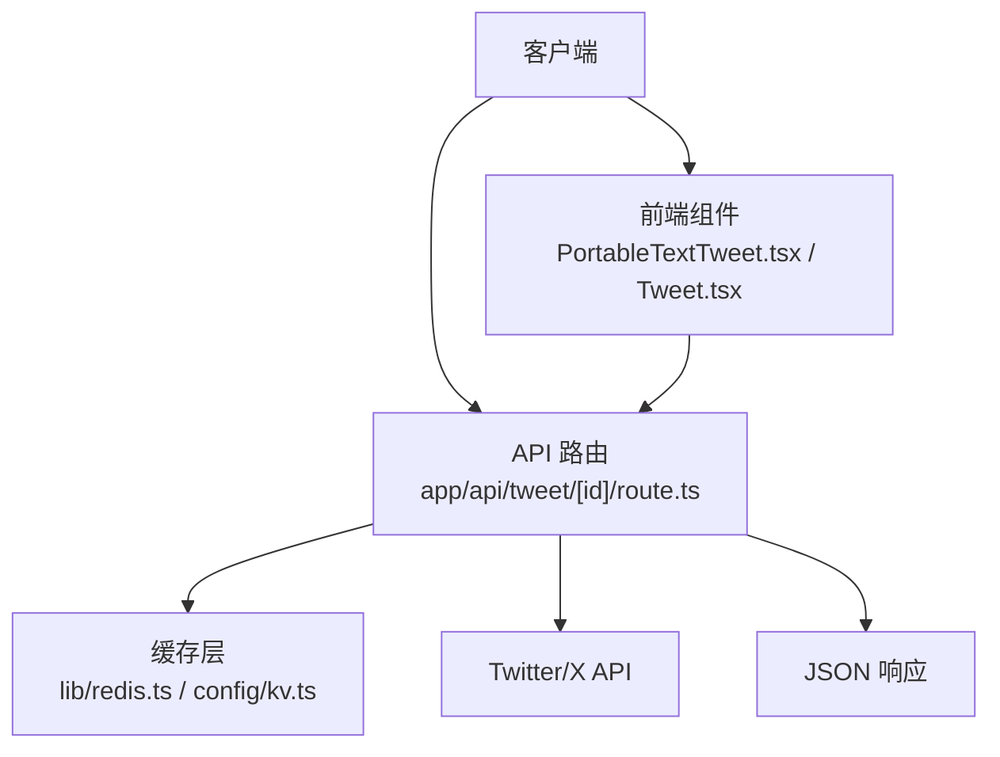
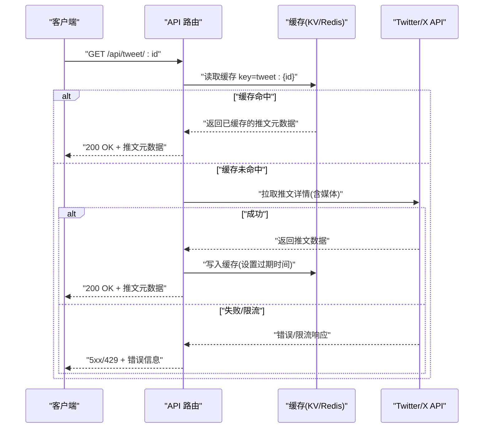
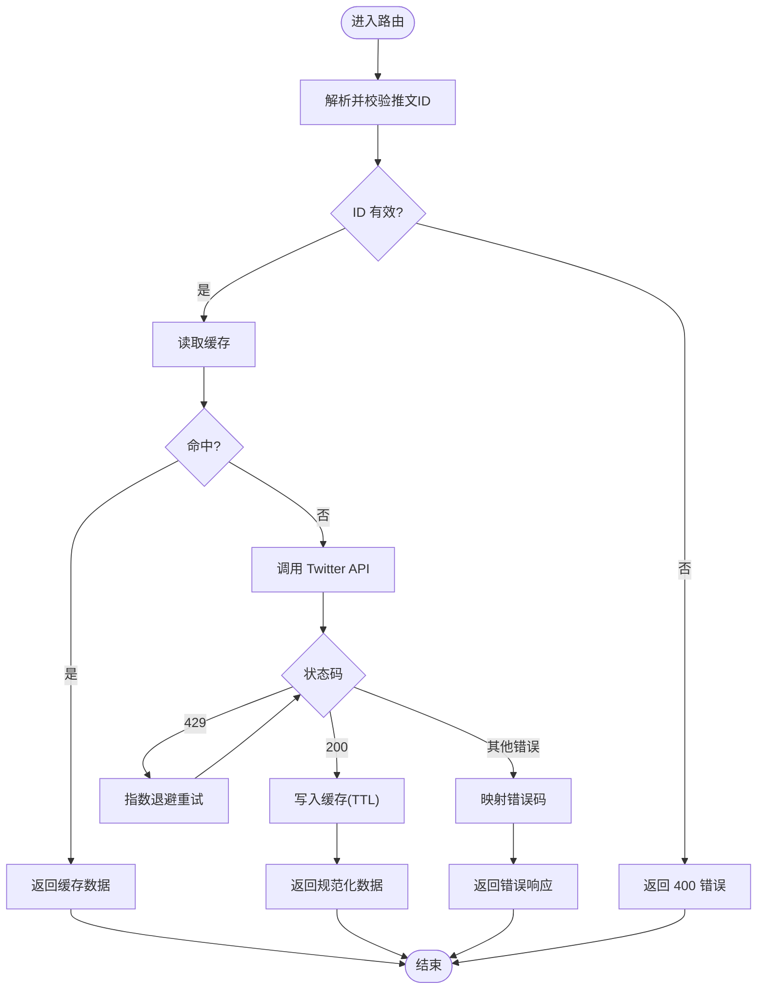
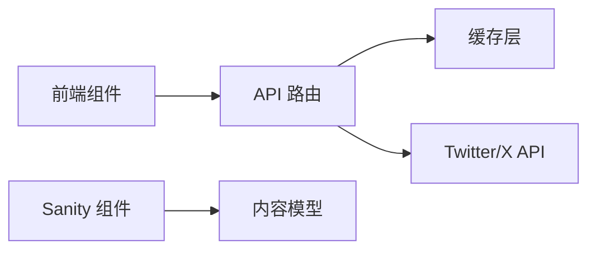

# Twitter 集成 API

<cite>
**本文引用的文件**   
- [app/api/tweet/[id]/route.ts](file://app/api/tweet/%5Bid%5D/route.ts)
- [components/portable-text/PortableTextTweet.tsx](file://components/portable-text/PortableTextTweet.tsx)
- [sanity/components/Tweet.tsx](file://sanity/components/Tweet.tsx)
- [lib/redis.ts](file://lib/redis.ts)
- [config/kv.ts](file://config/kv.ts)
</cite>

## 目录
1. [简介](#简介)
2. [项目结构](#项目结构)
3. [核心组件](#核心组件)
4. [架构总览](#架构总览)
5. [详细组件分析](#详细组件分析)
6. [依赖关系分析](#依赖关系分析)
7. [性能考虑](#性能考虑)
8. [故障排查指南](#故障排查指南)
9. [结论](#结论)
10. [附录](#附录)

## 简介
本文件为“Twitter 集成 API”的完整接口文档，聚焦于推文嵌入与预览功能的后端能力。内容涵盖：
- 获取推文信息、生成预览卡片的数据结构与字段说明
- 缓存策略（KV/Redis）与 CDN 集成建议
- Twitter API 调用封装、错误重试机制与限流处理
- 安全考虑、内容过滤与版权保护
- 请求/响应示例与常见错误码

该实现基于 Next.js App Router 的后端路由，结合本地 KV/Redis 缓存，提供稳定的推文元数据与富媒体预览服务。

## 项目结构
与 Twitter 集成相关的代码主要分布在以下位置：
- 后端 API 路由：app/api/tweet/[id]/route.ts
- 前端渲染组件（用于文章内嵌）：components/portable-text/PortableTextTweet.tsx
- Sanity 编辑器组件（用于内容创作）：sanity/components/Tweet.tsx
- 缓存层：lib/redis.ts、config/kv.ts

图表来源
- [app/api/tweet/[id]/route.ts](file://app/api/tweet/%5Bid%5D/route.ts)
- [lib/redis.ts](file://lib/redis.ts)
- [config/kv.ts](file://config/kv.ts)
- [components/portable-text/PortableTextTweet.tsx](file://components/portable-text/PortableTextTweet.tsx)
- [sanity/components/Tweet.tsx](file://sanity/components/Tweet.tsx)

章节来源
- [app/api/tweet/[id]/route.ts](file://app/api/tweet/%5Bid%5D/route.ts)
- [components/portable-text/PortableTextTweet.tsx](file://components/portable-text/PortableTextTweet.tsx)
- [sanity/components/Tweet.tsx](file://sanity/components/Tweet.tsx)
- [lib/redis.ts](file://lib/redis.ts)
- [config/kv.ts](file://config/kv.ts)

## 核心组件
- API 路由：负责解析推文 ID、查询缓存、调用 Twitter API、返回统一 JSON 响应。
- 前端组件：在博客或文章中渲染推文预览卡片，支持点击跳转至原推。
- 缓存层：提供键值存储能力，用于缓存推文元数据与图片资源，降低外部 API 压力。

章节来源
- [app/api/tweet/[id]/route.ts](file://app/api/tweet/%5Bid%5D/route.ts)
- [components/portable-text/PortableTextTweet.tsx](file://components/portable-text/PortableTextTweet.tsx)
- [sanity/components/Tweet.tsx](file://sanity/components/Tweet.tsx)
- [lib/redis.ts](file://lib/redis.ts)
- [config/kv.ts](file://config/kv.ts)

## 架构总览
下图展示了从客户端到 Twitter API 的端到端流程，包括缓存命中与未命中的分支路径。

图表来源
- [app/api/tweet/[id]/route.ts](file://app/api/tweet/%5Bid%5D/route.ts)
- [lib/redis.ts](file://lib/redis.ts)
- [config/kv.ts](file://config/kv.ts)

## 详细组件分析

### API 路由：获取推文信息与生成预览
- 功能职责
  - 解析 URL 参数 id（推文 ID）
  - 优先从缓存读取；未命中则调用 Twitter API
  - 将结果标准化为统一的 JSON 结构并返回
  - 对异常进行捕获与错误码映射
- 关键流程
  - 参数校验：确保 id 存在且格式合法
  - 缓存读取：使用唯一 key（如 tweet:{id}）
  - 外部调用：封装 Twitter API 请求，处理网络错误、鉴权失败、限流等
  - 缓存写入：设置合理的 TTL，避免频繁刷新
  - 响应构造：包含标题、摘要、作者、发布时间、缩略图、视频封面等
- 错误处理
  - 400：参数缺失或非法
  - 404：推文不存在或不可见
  - 429：Twitter 限流
  - 5xx：上游服务错误或超时
- 限流与重试
  - 针对 429 实施指数退避重试（最多 N 次）
  - 全局速率限制器可基于 IP 或用户维度控制
  - 熔断降级：连续失败时快速返回缓存或默认占位

图表来源
- [app/api/tweet/[id]/route.ts](file://app/api/tweet/%5Bid%5D/route.ts)

章节来源
- [app/api/tweet/[id]/route.ts](file://app/api/tweet/%5Bid%5D/route.ts)

### 前端组件：文章内嵌推文预览
- 功能职责
  - 在文章内容中渲染推文预览卡片
  - 通过 API 路由获取元数据，展示标题、摘要、缩略图
  - 点击跳转到原始推文页面
- 交互流程
  - 组件挂载时发起请求获取推文元数据
  - 若加载失败，显示降级占位或隐藏卡片
  - 支持懒加载与骨架屏以提升体验
- 样式与适配
  - 移动端自适应布局
  - 图片懒加载与尺寸优化

章节来源
- [components/portable-text/PortableTextTweet.tsx](file://components/portable-text/PortableTextTweet.tsx)

### Sanity 编辑器组件：内容创作时的推文插入
- 功能职责
  - 在 Sanity 编辑器中插入推文引用
  - 提供预览面板，便于编辑者确认内容
- 数据绑定
  - 将推文 ID 持久化到内容模型
  - 发布后由前端组件渲染

章节来源
- [sanity/components/Tweet.tsx](file://sanity/components/Tweet.tsx)

### 缓存层：KV/Redis 集成
- 功能职责
  - 提供统一的读写接口
  - 支持 TTL 与命名空间隔离
- 设计要点
  - 键名规范：tweet:{id}
  - 过期策略：根据推文热度与更新频率设定 TTL
  - 一致性：写后失效或短 TTL 保证时效性
  - 降级：缓存不可用时直接回源

章节来源
- [lib/redis.ts](file://lib/redis.ts)
- [config/kv.ts](file://config/kv.ts)

## 依赖关系分析
- 模块耦合
  - API 路由依赖缓存层与 Twitter API
  - 前端组件依赖 API 路由
  - Sanity 组件仅依赖内容模型，不直接访问外部 API
- 外部依赖
  - Twitter/X API：受鉴权与限流约束
  - 缓存系统：KV/Redis，需配置连接参数与密钥

图表来源
- [app/api/tweet/[id]/route.ts](file://app/api/tweet/%5Bid%5D/route.ts)
- [lib/redis.ts](file://lib/redis.ts)
- [config/kv.ts](file://config/kv.ts)
- [components/portable-text/PortableTextTweet.tsx](file://components/portable-text/PortableTextTweet.tsx)
- [sanity/components/Tweet.tsx](file://sanity/components/Tweet.tsx)

章节来源
- [app/api/tweet/[id]/route.ts](file://app/api/tweet/%5Bid%5D/route.ts)
- [lib/redis.ts](file://lib/redis.ts)
- [config/kv.ts](file://config/kv.ts)
- [components/portable-text/PortableTextTweet.tsx](file://components/portable-text/PortableTextTweet.tsx)
- [sanity/components/Tweet.tsx](file://sanity/components/Tweet.tsx)

## 性能考虑
- 缓存命中率
  - 合理设置 TTL，热点推文延长缓存时间
  - 预取与预热：对高频推文提前写入缓存
- 图片与媒体
  - 使用 CDN 加速静态资源
  - 按需缩放与压缩，减少带宽
- 并发与限流
  - 对 Twitter API 调用进行并发控制
  - 客户端侧重试与退避，避免雪崩
- 监控与指标
  - 记录缓存命中/未命中比率
  - 统计上游 API 延迟与错误率

[本节为通用指导，无需列出具体文件来源]

## 故障排查指南
- 常见问题
  - 400：检查推文 ID 是否有效
  - 404：推文可能已被删除或设为私密
  - 429：Twitter 限流，等待并重试
  - 5xx：上游服务异常，查看日志与重试次数
- 定位步骤
  - 查看缓存键是否存在与过期时间
  - 检查 Twitter API 鉴权与配额
  - 观察重试与退避策略是否生效
- 恢复措施
  - 清理异常缓存条目
  - 调整 TTL 与重试上限
  - 启用降级模式，返回占位内容

章节来源
- [app/api/tweet/[id]/route.ts](file://app/api/tweet/%5Bid%5D/route.ts)

## 结论
本 Twitter 集成 API 以简洁的路由为核心，结合缓存层与稳健的错误处理，提供稳定高效的推文元数据与预览能力。通过限流、重试与 CDN 优化，可在高并发场景下保持良好性能与可用性。建议在上线前完善监控告警与安全策略，确保合规与版权保护。

[本节为总结性内容，无需列出具体文件来源]

## 附录

### 接口定义
- 方法：GET
- 路径：/api/tweet/:id
- 路径参数
  - id：字符串，推文 ID（必填）
- 查询参数
  - 无（如需扩展可按需添加）
- 成功响应（200）
  - 字段说明
    - id：推文 ID
    - title：推文标题或首行摘要
    - summary：推文正文摘要（截断）
    - author：作者名称
    - avatar_url：作者头像地址
    - created_at：发布时间（ISO 8601）
    - media_type：媒体类型（image/video/none）
    - thumbnail_url：缩略图地址
    - video_cover_url：视频封面地址（当 media_type=video）
    - url：推文原始链接
    - lang：语言代码
    - reply_count：回复数
    - retweet_count：转发数
    - like_count：点赞数
    - view_count：播放/浏览数（如有）
- 错误响应
  - 400：参数缺失或非法
  - 404：推文不存在或不可见
  - 429：限流
  - 5xx：上游错误或超时

章节来源
- [app/api/tweet/[id]/route.ts](file://app/api/tweet/%5Bid%5D/route.ts)

### 请求与响应示例
- 请求示例
  - GET /api/tweet/1234567890123456789
- 成功响应示例（简化）
  - {
      "id": "1234567890123456789",
      "title": "示例推文标题",
      "summary": "这是一条示例推文的摘要...",
      "author": "用户名",
      "avatar_url": "https://pbs.twimg.com/profile_images/...jpg",
      "created_at": "2024-01-01T12:00:00Z",
      "media_type": "image",
      "thumbnail_url": "https://pbs.twimg.com/media/...jpg",
      "url": "https://twitter.com/user/status/1234567890123456789",
      "lang": "zh-CN",
      "reply_count": 10,
      "retweet_count": 5,
      "like_count": 100,
      "view_count": 1000
    }
- 失败响应示例（429）
  - {
      "error": "rate_limited",
      "message": "Twitter API 限流，请稍后再试",
      "retry_after_seconds": 60
    }

章节来源
- [app/api/tweet/[id]/route.ts](file://app/api/tweet/%5Bid%5D/route.ts)

### 缓存策略与 CDN 集成
- 缓存键
  - tweet:{id}
- TTL 建议
  - 普通推文：5–15 分钟
  - 热点推文：30–60 分钟
- CDN 建议
  - 将缩略图与视频封面托管至 CDN
  - 开启浏览器缓存与 Gzip/Brotli 压缩
  - 使用版本化文件名或查询参数进行缓存失效

章节来源
- [lib/redis.ts](file://lib/redis.ts)
- [config/kv.ts](file://config/kv.ts)

### 安全、内容过滤与版权保护
- 安全
  - 输入校验：严格校验推文 ID 格式
  - 鉴权：Twitter API 凭据应通过环境变量管理
  - 速率限制：服务端限流与客户端重试退避
- 内容过滤
  - 敏感词与违规内容检测
  - 媒体白名单与域名校验
- 版权保护
  - 仅展示必要元数据与缩略图
  - 禁止下载与二次分发
  - 遵循平台使用条款与版权声明

章节来源
- [app/api/tweet/[id]/route.ts](file://app/api/tweet/%5Bid%5D/route.ts)