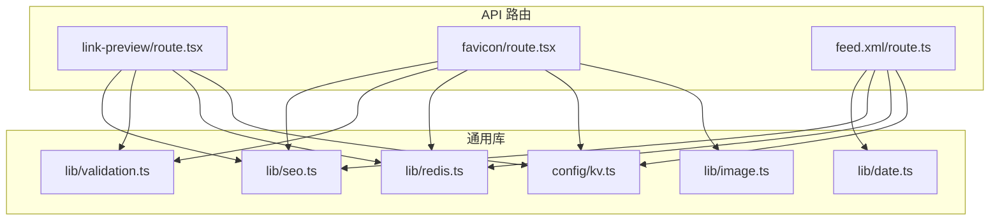
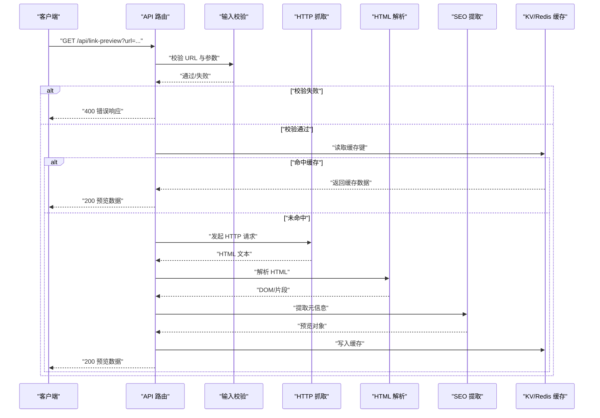
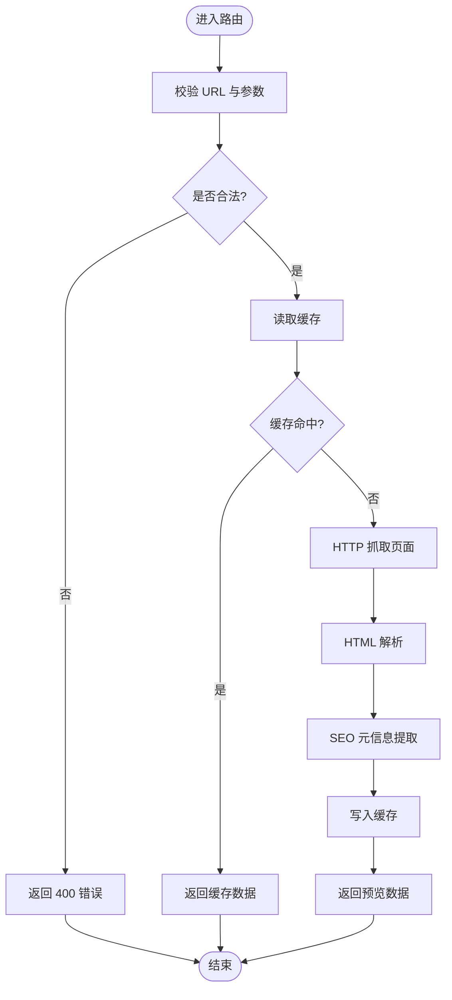
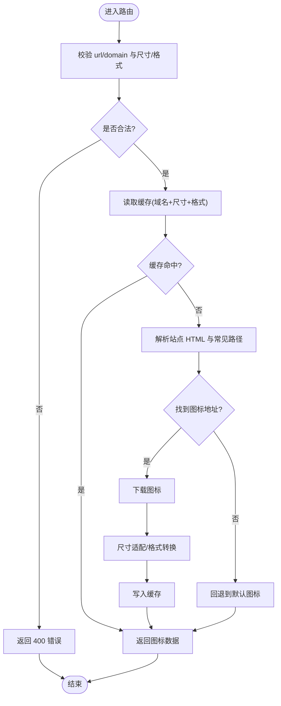
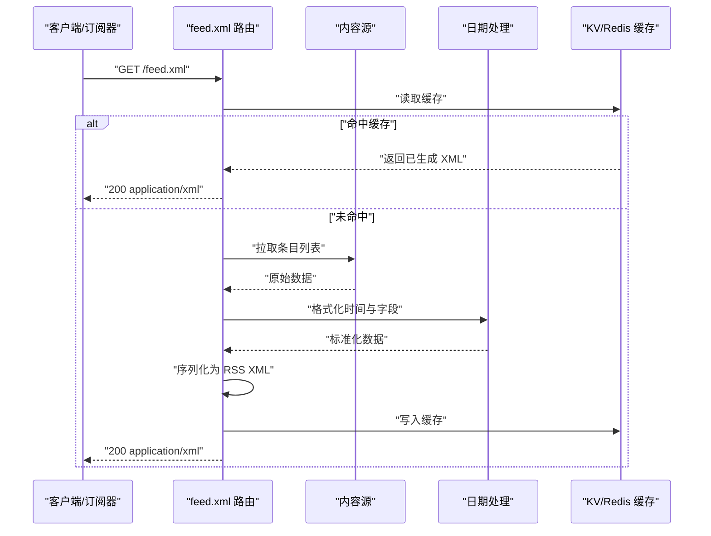
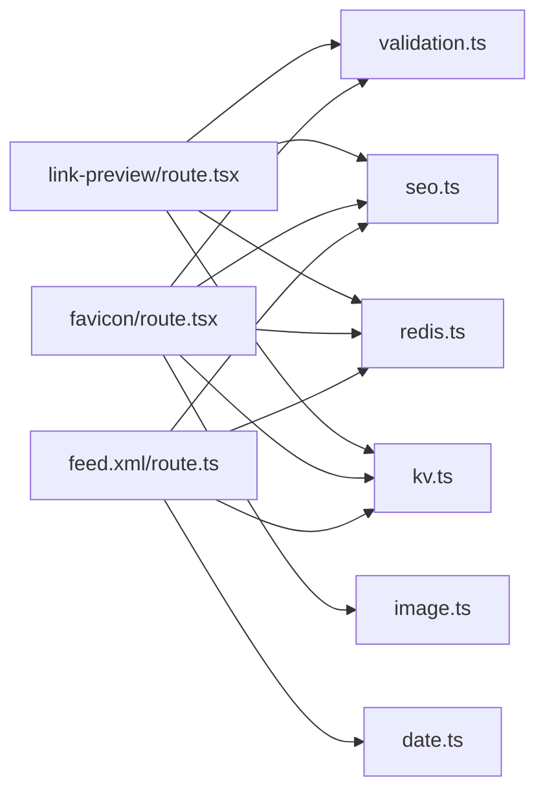

# 工具类 API

<cite>
**本文引用的文件**   
- [app/api/link-preview/route.tsx](file://app/api/link-preview/route.tsx)
- [app/api/favicon/route.tsx](file://app/api/favicon/route.tsx)
- [app/(main)/feed.xml/route.ts](file://app/(main)/feed.xml/route.ts)
- [lib/seo.ts](file://lib/seo.ts)
- [lib/date.ts](file://lib/date.ts)
- [lib/validation.ts](file://lib/validation.ts)
- [lib/image.ts](file://lib/image.ts)
- [lib/redis.ts](file://lib/redis.ts)
- [config/kv.ts](file://config/kv.ts)
</cite>

## 目录
1. [简介](#简介)
2. [项目结构](#项目结构)
3. [核心组件](#核心组件)
4. [架构总览](#架构总览)
5. [详细组件分析](#详细组件分析)
6. [依赖关系分析](#依赖关系分析)
7. [性能考虑](#性能考虑)
8. [故障排查指南](#故障排查指南)
9. [结论](#结论)
10. [附录](#附录)

## 简介
本文件面向“工具类 API”，聚焦以下辅助能力：
- 网站链接预览生成：抓取目标网页、解析 HTML、提取元信息（标题、描述、图片等），返回结构化预览数据。
- Favicon 获取与适配：从目标站点自动发现并返回 favicon，支持多格式与尺寸适配，并提供缓存策略。
- RSS feed 生成：按站点内容聚合生成标准 RSS 输出，包含内容格式化与时间戳处理。

文档将覆盖接口定义、数据处理流程、错误处理、性能优化、安全与输入校验、以及集成示例。

## 项目结构
与工具类 API 相关的入口位于 Next.js App Router 的 API 路由与静态资源路由中：
- 链接预览：app/api/link-preview/route.tsx
- Favicon：app/api/favicon/route.tsx
- RSS Feed：app/(main)/feed.xml/route.ts
- 通用库：SEO 元信息、日期处理、验证、图像、缓存等

图表来源
- [app/api/link-preview/route.tsx](file://app/api/link-preview/route.tsx)
- [app/api/favicon/route.tsx](file://app/api/favicon/route.tsx)
- [app/(main)/feed.xml/route.ts](file://app/(main)/feed.xml/route.ts)
- [lib/seo.ts](file://lib/seo.ts)
- [lib/date.ts](file://lib/date.ts)
- [lib/validation.ts](file://lib/validation.ts)
- [lib/image.ts](file://lib/image.ts)
- [lib/redis.ts](file://lib/redis.ts)
- [config/kv.ts](file://config/kv.ts)

章节来源
- [app/api/link-preview/route.tsx](file://app/api/link-preview/route.tsx)
- [app/api/favicon/route.tsx](file://app/api/favicon/route.tsx)
- [app/(main)/feed.xml/route.ts](file://app/(main)/feed.xml/route.ts)
- [lib/seo.ts](file://lib/seo.ts)
- [lib/date.ts](file://lib/date.ts)
- [lib/validation.ts](file://lib/validation.ts)
- [lib/image.ts](file://lib/image.ts)
- [lib/redis.ts](file://lib/redis.ts)
- [config/kv.ts](file://config/kv.ts)

## 核心组件
- 链接预览生成器
  - 职责：接收 URL，进行输入校验、网络抓取、HTML 解析、元信息提取、结果缓存与响应。
  - 关键依赖：URL 校验、HTTP 客户端、HTML 解析器、SEO 元信息提取、KV/Redis 缓存。
- Favicon 服务
  - 职责：根据域名或 URL 定位 favicon 源地址，支持多种格式与尺寸，提供缓存与回退逻辑。
  - 关键依赖：URL 规范化、HTML 解析、图像路径解析、缓存。
- RSS Feed 生成器
  - 职责：聚合站点内容，构建符合 RSS 规范的 XML，处理标题、摘要、链接、发布时间等字段。
  - 关键依赖：内容源、日期格式化、XML 序列化、缓存。

章节来源
- [app/api/link-preview/route.tsx](file://app/api/link-preview/route.tsx)
- [app/api/favicon/route.tsx](file://app/api/favicon/route.tsx)
- [app/(main)/feed.xml/route.ts](file://app/(main)/feed.xml/route.ts)
- [lib/seo.ts](file://lib/seo.ts)
- [lib/date.ts](file://lib/date.ts)
- [lib/validation.ts](file://lib/validation.ts)
- [lib/image.ts](file://lib/image.ts)
- [lib/redis.ts](file://lib/redis.ts)
- [config/kv.ts](file://config/kv.ts)

## 架构总览
整体采用“路由层 + 工具库”的分层设计：
- 路由层负责请求解析、参数校验、调用业务逻辑、设置响应头与缓存控制。
- 工具库封装通用能力：SEO 元信息提取、日期处理、输入验证、图像与缓存。

图表来源
- [app/api/link-preview/route.tsx](file://app/api/link-preview/route.tsx)
- [lib/validation.ts](file://lib/validation.ts)
- [lib/seo.ts](file://lib/seo.ts)
- [lib/redis.ts](file://lib/redis.ts)
- [config/kv.ts](file://config/kv.ts)

## 详细组件分析

### 链接预览接口
- 端点
  - 方法：GET
  - 路径：/api/link-preview
  - 查询参数：url（必填）
- 行为说明
  - 输入校验：检查 URL 合法性、协议白名单、长度限制等。
  - 缓存策略：以 url 为键，在 KV/Redis 中缓存预览结果；可配置过期时间。
  - 抓取与解析：使用 HTTP 客户端获取页面，解析 HTML，提取 title、description、og:image、canonical 等元信息。
  - 响应体：包含标题、描述、主图、链接、站点名称等字段。
- 错误处理
  - 参数非法：返回 400。
  - 网络异常/超时：返回 502/504。
  - 解析失败：返回 422 或降级返回部分可用字段。
- 安全与输入验证
  - 仅允许 http/https 协议。
  - 禁止内网地址与私有段。
  - 限制最大重定向次数与响应体大小。
- 性能优化
  - 缓存命中优先。
  - 并发抓取限流与超时控制。
  - 可选压缩与最小化 HTML 解析。
- 集成示例
  - 前端直接 GET 该接口，展示卡片式预览。
  - 服务端批量生成时，先查缓存再按需抓取。

章节来源
- [app/api/link-preview/route.tsx](file://app/api/link-preview/route.tsx)
- [lib/validation.ts](file://lib/validation.ts)
- [lib/seo.ts](file://lib/seo.ts)
- [lib/redis.ts](file://lib/redis.ts)
- [config/kv.ts](file://config/kv.ts)

#### 流程图：链接预览处理

图表来源
- [app/api/link-preview/route.tsx](file://app/api/link-preview/route.tsx)
- [lib/validation.ts](file://lib/validation.ts)
- [lib/seo.ts](file://lib/seo.ts)
- [lib/redis.ts](file://lib/redis.ts)
- [config/kv.ts](file://config/kv.ts)

### Favicon 接口
- 端点
  - 方法：GET
  - 路径：/api/favicon
  - 查询参数：url 或 domain（二选一）
- 行为说明
  - 输入校验：校验 url/domain 合法性。
  - 发现策略：优先从 HTML 的 link[rel="icon"]、apple-touch-icon、Open Graph image 等标签推断；若缺失，回退到 /.well-known/apple-touch-icon.png、/favicon.ico、/favicon.svg 等常见路径。
  - 格式与尺寸：支持 .ico、.png、.svg、.webp 等；可按需返回不同尺寸（如 16x16、32x32、48x48、180x180）。
  - 缓存策略：对每个“域名+尺寸+格式”组合进行缓存，减少重复抓取。
- 错误处理
  - 参数非法：返回 400。
  - 无法找到图标：返回 404 或默认占位图标。
  - 网络异常：返回 502/504。
- 安全与输入验证
  - 仅允许 http/https。
  - 禁止内网地址与私有段。
  - 限制重定向次数与响应体大小。
- 性能优化
  - 多级缓存：内存/本地 + KV/Redis。
  - 尺寸裁剪与格式转换（必要时）。
  - 并发抓取限流与超时控制。
- 集成示例
  - 前端传入 url，后端返回指定尺寸的 favicon 二进制或 base64。
  - 服务端批量任务中，先查缓存再按需下载与转换。

章节来源
- [app/api/favicon/route.tsx](file://app/api/favicon/route.tsx)
- [lib/validation.ts](file://lib/validation.ts)
- [lib/seo.ts](file://lib/seo.ts)
- [lib/image.ts](file://lib/image.ts)
- [lib/redis.ts](file://lib/redis.ts)
- [config/kv.ts](file://config/kv.ts)

#### 流程图：Favicon 发现与返回

图表来源
- [app/api/favicon/route.tsx](file://app/api/favicon/route.tsx)
- [lib/validation.ts](file://lib/validation.ts)
- [lib/seo.ts](file://lib/seo.ts)
- [lib/image.ts](file://lib/image.ts)
- [lib/redis.ts](file://lib/redis.ts)
- [config/kv.ts](file://config/kv.ts)

### RSS Feed 接口
- 端点
  - 方法：GET
  - 路径：/feed.xml
- 行为说明
  - 内容聚合：从内容源（如博客文章、项目列表等）拉取条目。
  - 字段映射：title、link、description、pubDate、guid、author、category 等。
  - 时间戳处理：统一转换为 RFC 2822 或 ISO 8601 字符串，确保时区一致。
  - 内容格式化：摘要截断、HTML 清理、转义特殊字符。
  - 缓存策略：对完整 XML 或条目集合进行缓存，缩短生成时间。
- 错误处理
  - 数据源不可用：返回 502/504 或空 feed。
  - 序列化失败：返回 500。
- 性能优化
  - 增量更新：仅重新生成变更条目。
  - 分页/限制：限制返回条目数量。
  - 并行拉取：对多个数据源并发获取。
- 集成示例
  - 订阅器定期请求 /feed.xml，解析 XML 并渲染。
  - 服务端定时任务预生成 feed 并缓存。

章节来源
- [app/(main)/feed.xml/route.ts](file://app/(main)/feed.xml/route.ts)
- [lib/date.ts](file://lib/date.ts)
- [lib/redis.ts](file://lib/redis.ts)
- [config/kv.ts](file://config/kv.ts)

#### 序列图：RSS 生成流程

图表来源
- [app/(main)/feed.xml/route.ts](file://app/(main)/feed.xml/route.ts)
- [lib/date.ts](file://lib/date.ts)
- [lib/redis.ts](file://lib/redis.ts)
- [config/kv.ts](file://config/kv.ts)

## 依赖关系分析
- 路由层依赖
  - 输入校验：lib/validation.ts
  - SEO 元信息：lib/seo.ts
  - 日期处理：lib/date.ts
  - 图像处理：lib/image.ts
  - 缓存：lib/redis.ts、config/kv.ts
- 耦合与内聚
  - 各路由相对独立，复用通用库，内聚性良好。
  - 缓存抽象在 lib/redis.ts 与 config/kv.ts，便于替换存储后端。
- 外部依赖
  - HTTP 客户端、HTML 解析器、图像转换库、RSS 序列化库。

图表来源
- [app/api/link-preview/route.tsx](file://app/api/link-preview/route.tsx)
- [app/api/favicon/route.tsx](file://app/api/favicon/route.tsx)
- [app/(main)/feed.xml/route.ts](file://app/(main)/feed.xml/route.ts)
- [lib/validation.ts](file://lib/validation.ts)
- [lib/seo.ts](file://lib/seo.ts)
- [lib/date.ts](file://lib/date.ts)
- [lib/image.ts](file://lib/image.ts)
- [lib/redis.ts](file://lib/redis.ts)
- [config/kv.ts](file://config/kv.ts)

章节来源
- [app/api/link-preview/route.tsx](file://app/api/link-preview/route.tsx)
- [app/api/favicon/route.tsx](file://app/api/favicon/route.tsx)
- [app/(main)/feed.xml/route.ts](file://app/(main)/feed.xml/route.ts)
- [lib/validation.ts](file://lib/validation.ts)
- [lib/seo.ts](file://lib/seo.ts)
- [lib/date.ts](file://lib/date.ts)
- [lib/image.ts](file://lib/image.ts)
- [lib/redis.ts](file://lib/redis.ts)
- [config/kv.ts](file://config/kv.ts)

## 性能考虑
- 缓存分层
  - 首层：进程内内存缓存（短 TTL）。
  - 次层：KV/Redis（跨实例共享）。
  - 三级：浏览器/CDN 缓存（合理设置 Cache-Control）。
- 抓取与解析
  - 连接池与并发上限控制。
  - 超时与重试策略（指数退避）。
  - 限制响应体大小，避免大页面拖慢。
- 图像处理
  - 按需缩放与格式转换，避免全量处理。
  - 缓存转换后的产物。
- RSS 生成
  - 增量更新与条目去重。
  - 预生成与定时刷新。
- 资源清理
  - 及时关闭网络连接与流。
  - 释放临时文件与内存占用。

## 故障排查指南
- 常见问题
  - 链接预览返回空或字段缺失：检查 HTML 是否包含必要 meta 标签；确认解析器配置。
  - Favicon 找不到：确认站点是否存在常见路径；检查重定向与跨域限制。
  - RSS 时间错乱：统一时区与格式；检查源数据时间戳有效性。
- 日志与监控
  - 记录关键步骤耗时（抓取、解析、缓存读写）。
  - 统计命中率与错误率。
- 恢复策略
  - 降级：当外部依赖不可用时，返回部分可用数据或默认值。
  - 熔断：对不稳定站点快速失败，避免雪崩。

章节来源
- [app/api/link-preview/route.tsx](file://app/api/link-preview/route.tsx)
- [app/api/favicon/route.tsx](file://app/api/favicon/route.tsx)
- [app/(main)/feed.xml/route.ts](file://app/(main)/feed.xml/route.ts)
- [lib/redis.ts](file://lib/redis.ts)
- [config/kv.ts](file://config/kv.ts)

## 结论
本工具类 API 围绕“链接预览、Favicon、RSS”三大能力，采用清晰的分层与通用库复用，具备完善的输入校验、缓存策略、错误处理与性能优化方案。建议在生产环境结合监控与告警，持续优化命中率与稳定性。

## 附录
- 集成建议
  - 前端：统一封装三个接口的调用，增加重试与降级逻辑。
  - 服务端：批量任务中使用缓存键前缀与命名规范，避免冲突。
- 扩展方向
  - 支持更多 Open Graph 与 Twitter Card 字段。
  - 为 Favicon 提供 WebP/AVIF 自适应。
  - RSS 支持 Atom 与 JSON Feed 变体。