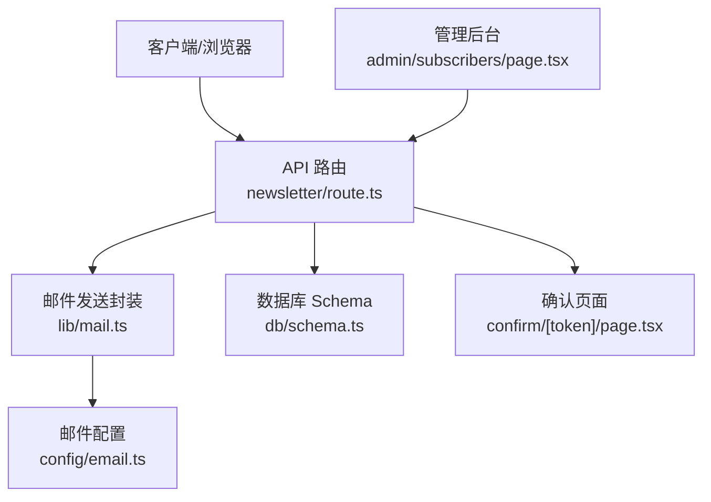
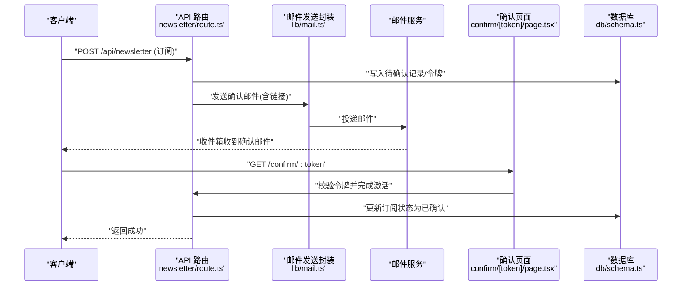
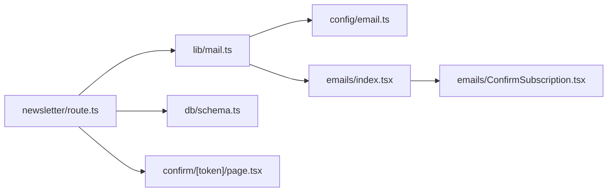

# 新闻通讯 API

<cite>
**本文引用的文件**   
- [app/api/newsletter/route.ts](file://app/api/newsletter/route.ts)
- [emails/ConfirmSubscription.tsx](file://emails/ConfirmSubscription.tsx)
- [emails/index.tsx](file://emails/index.tsx)
- [lib/mail.ts](file://lib/mail.ts)
- [config/email.ts](file://config/email.ts)
- [db/schema.ts](file://db/schema.ts)
- [app/(main)/confirm/[token]/page.tsx](file://app/(main)/confirm/[token]/page.tsx)
- [app/admin/subscribers/page.tsx](file://app/admin/subscribers/page.tsx)
</cite>

## 目录
1. [简介](#简介)
2. [项目结构](#项目结构)
3. [核心组件](#核心组件)
4. [架构总览](#架构总览)
5. [详细组件分析](#详细组件分析)
6. [依赖分析](#依赖分析)
7. [性能考虑](#性能考虑)
8. [故障排查指南](#故障排查指南)
9. [结论](#结论)
10. [附录](#附录)

## 简介
本文件为“新闻通讯”模块的接口与实现文档，覆盖订阅者管理、双确认订阅流程、邮箱验证、批量操作、订阅偏好设置、退订管理、邮件发送集成、模板渲染与送达率跟踪，以及 GDPR 合规性与用户同意管理机制。读者可据此理解从前端到后端、再到邮件服务与数据库的完整数据流与调用链。

## 项目结构
该功能围绕 Next.js App Router 的 API Route 组织：
- 订阅入口：API 路由处理订阅请求与状态查询
- 确认页面：基于 token 的双确认落地页
- 邮件模板：React 邮件模板与统一发送封装
- 配置与存储：邮件服务配置、数据库 schema 定义
- 管理后台：订阅者列表与管理界面（概念性说明）

图表来源
- [app/api/newsletter/route.ts](file://app/api/newsletter/route.ts)
- [lib/mail.ts](file://lib/mail.ts)
- [config/email.ts](file://config/email.ts)
- [db/schema.ts](file://db/schema.ts)
- [app/(main)/confirm/[token]/page.tsx](file://app/(main)/confirm/[token]/page.tsx)
- [app/admin/subscribers/page.tsx](file://app/admin/subscribers/page.tsx)

章节来源
- [app/api/newsletter/route.ts](file://app/api/newsletter/route.ts)
- [emails/ConfirmSubscription.tsx](file://emails/ConfirmSubscription.tsx)
- [emails/index.tsx](file://emails/index.tsx)
- [lib/mail.ts](file://lib/mail.ts)
- [config/email.ts](file://config/email.ts)
- [db/schema.ts](file://db/schema.ts)
- [app/(main)/confirm/[token]/page.tsx](file://app/(main)/confirm/[token]/page.tsx)
- [app/admin/subscribers/page.tsx](file://app/admin/subscribers/page.tsx)

## 核心组件
- 订阅 API 路由：提供订阅注册、状态查询、退订等能力；负责生成并持久化确认令牌、触发确认邮件、更新订阅状态。
- 确认页面：接收 URL 中的 token，校验后完成最终订阅激活。
- 邮件发送封装：统一调用外部邮件服务，支持模板渲染与元数据记录（用于送达率统计）。
- 邮件模板：使用 React 组件渲染 HTML 邮件内容，包含确认链接与个性化信息。
- 配置：集中管理邮件服务凭据、发件人、域名等环境变量。
- 数据模型：定义订阅者表结构与字段约束，确保唯一性与审计字段。

章节来源
- [app/api/newsletter/route.ts](file://app/api/newsletter/route.ts)
- [emails/ConfirmSubscription.tsx](file://emails/ConfirmSubscription.tsx)
- [emails/index.tsx](file://emails/index.tsx)
- [lib/mail.ts](file://lib/mail.ts)
- [config/email.ts](file://config/email.ts)
- [db/schema.ts](file://db/schema.ts)

## 架构总览
下图展示了订阅全流程的关键交互：客户端发起订阅，服务端生成确认令牌并发送确认邮件；用户点击确认后，服务端完成最终激活。

图表来源
- [app/api/newsletter/route.ts](file://app/api/newsletter/route.ts)
- [emails/ConfirmSubscription.tsx](file://emails/ConfirmSubscription.tsx)
- [emails/index.tsx](file://emails/index.tsx)
- [lib/mail.ts](file://lib/mail.ts)
- [config/email.ts](file://config/email.ts)
- [app/(main)/confirm/[token]/page.tsx](file://app/(main)/confirm/[token]/page.tsx)
- [db/schema.ts](file://db/schema.ts)

## 详细组件分析

### 订阅 API 路由（newsletter/route.ts）
职责
- 接收订阅请求，校验邮箱格式与必填字段
- 生成一次性确认令牌，写入数据库
- 触发确认邮件发送
- 提供状态查询与退订能力（如 GET/DELETE）
- 返回统一的 JSON 响应

关键流程
- 输入校验：邮箱、可选偏好字段
- 幂等处理：重复订阅时返回现有状态或提示
- 令牌生命周期：过期策略与刷新机制
- 错误码：参数错误、重复订阅、内部错误等

请求示例（路径参考）
- POST /api/newsletter
- GET /api/newsletter?email=...
- DELETE /api/newsletter?email=...

响应示例（路径参考）
- { status, message, data }

章节来源
- [app/api/newsletter/route.ts](file://app/api/newsletter/route.ts)

### 确认页面（confirm/[token]/page.tsx）
职责
- 解析 URL 中的 token
- 校验令牌有效性（存在、未过期、未被使用）
- 将对应订阅记录标记为已确认
- 渲染成功/失败页面

安全要点
- 令牌仅一次有效
- 防重放与并发保护
- 最小权限访问

章节来源
- [app/(main)/confirm/[token]/page.tsx](file://app/(main)/confirm/[token]/page.tsx)

### 邮件发送封装（lib/mail.ts）
职责
- 统一封装邮件发送逻辑
- 选择模板、渲染变量、构建主题与正文
- 记录发送元数据（用于送达率统计）
- 重试与失败回调

与模板集成
- 通过 emails/index.tsx 聚合模板
- 使用 emails/ConfirmSubscription.tsx 渲染确认邮件

章节来源
- [lib/mail.ts](file://lib/mail.ts)
- [emails/index.tsx](file://emails/index.tsx)
- [emails/ConfirmSubscription.tsx](file://emails/ConfirmSubscription.tsx)

### 邮件模板（emails/ConfirmSubscription.tsx）
职责
- 渲染确认邮件 HTML
- 注入动态变量（姓名、确认链接、有效期等）
- 遵循可访问性与移动端适配最佳实践

章节来源
- [emails/ConfirmSubscription.tsx](file://emails/ConfirmSubscription.tsx)

### 邮件配置（config/email.ts）
职责
- 集中管理发件人地址、SMTP/第三方服务凭据、域名、回退策略
- 暴露给 lib/mail.ts 使用

章节来源
- [config/email.ts](file://config/email.ts)

### 数据模型（db/schema.ts）
职责
- 定义订阅者表结构（邮箱、状态、令牌、时间戳、偏好等）
- 约束唯一性与索引，保障查询性能
- 审计字段（创建/更新时间）

章节来源
- [db/schema.ts](file://db/schema.ts)

### 管理后台（admin/subscribers/page.tsx）
职责（概念性）
- 展示订阅者列表
- 支持批量导出、批量退订、按状态筛选
- 查看送达率与打开率指标（若集成）

章节来源
- [app/admin/subscribers/page.tsx](file://app/admin/subscribers/page.tsx)

## 依赖分析
- API 路由依赖：
  - 邮件发送封装（lib/mail.ts）
  - 邮件配置（config/email.ts）
  - 数据库 Schema（db/schema.ts）
  - 确认页面（confirm/[token]/page.tsx）
- 邮件系统依赖：
  - 模板聚合（emails/index.tsx）
  - 具体模板（emails/ConfirmSubscription.tsx）

图表来源
- [app/api/newsletter/route.ts](file://app/api/newsletter/route.ts)
- [lib/mail.ts](file://lib/mail.ts)
- [config/email.ts](file://config/email.ts)
- [db/schema.ts](file://db/schema.ts)
- [emails/index.tsx](file://emails/index.tsx)
- [emails/ConfirmSubscription.tsx](file://emails/ConfirmSubscription.tsx)
- [app/(main)/confirm/[token]/page.tsx](file://app/(main)/confirm/[token]/page.tsx)

## 性能考虑
- 令牌生成与校验应使用高效哈希与索引优化
- 邮件发送采用异步队列或任务调度，避免阻塞主线程
- 批量操作建议分页与限流，防止数据库压力过大
- 对高频查询（如状态检查）增加缓存层（如 Redis）
- 模板渲染尽量复用实例，减少对象分配

## 故障排查指南
常见问题
- 邮箱格式无效：检查输入校验逻辑与错误消息
- 重复订阅：确认幂等处理与返回码
- 令牌失效：检查过期策略与是否已被使用
- 邮件未送达：核对邮件配置、模板变量、第三方服务状态
- 数据库异常：检查连接、事务与约束冲突

定位步骤
- 查看 API 日志与错误堆栈
- 检查邮件发送元数据与回执
- 核对数据库记录状态与索引
- 复现确认流程并观察网络请求

章节来源
- [app/api/newsletter/route.ts](file://app/api/newsletter/route.ts)
- [lib/mail.ts](file://lib/mail.ts)
- [config/email.ts](file://config/email.ts)
- [db/schema.ts](file://db/schema.ts)

## 结论
本模块实现了完整的订阅双确认流程，涵盖 API、模板、配置与数据模型，具备可扩展的管理后台与追踪能力。建议在后续迭代中完善批量操作、偏好管理与送达率统计，并持续强化隐私与合规控制。

## 附录

### 接口清单与行为说明
- 订阅注册
  - 方法：POST
  - 路径：/api/newsletter
  - 请求体：邮箱、可选偏好字段
  - 响应：状态、消息、数据（如令牌 ID）
- 订阅状态查询
  - 方法：GET
  - 路径：/api/newsletter?email=...
  - 响应：当前状态（待确认/已确认/已退订）、时间戳
- 退订
  - 方法：DELETE
  - 路径：/api/newsletter?email=...
  - 响应：状态、消息
- 确认订阅
  - 方法：GET
  - 路径：/confirm/:token
  - 响应：成功/失败页面（HTML）

章节来源
- [app/api/newsletter/route.ts](file://app/api/newsletter/route.ts)
- [app/(main)/confirm/[token]/page.tsx](file://app/(main)/confirm/[token]/page.tsx)

### 订阅数据结构（字段说明）
- 邮箱：唯一标识，用于去重与通知
- 状态：待确认/已确认/已退订
- 令牌：一次性确认令牌，带过期时间
- 偏好：主题分类、频率等（可选）
- 审计：创建时间、更新时间

章节来源
- [db/schema.ts](file://db/schema.ts)

### 邮箱验证与双确认机制
- 邮箱格式校验在 API 层进行
- 首次提交写入“待确认”记录并生成令牌
- 发送确认邮件，用户点击链接完成最终激活
- 令牌仅一次有效，防止重放

章节来源
- [app/api/newsletter/route.ts](file://app/api/newsletter/route.ts)
- [emails/ConfirmSubscription.tsx](file://emails/ConfirmSubscription.tsx)
- [emails/index.tsx](file://emails/index.tsx)
- [lib/mail.ts](file://lib/mail.ts)

### 批量操作与订阅偏好
- 批量导入：CSV/JSON 上传，逐条校验与去重
- 批量退订：按条件筛选后执行退订
- 偏好设置：在订阅表单或管理后台维护，影响推送内容与频率

章节来源
- [app/admin/subscribers/page.tsx](file://app/admin/subscribers/page.tsx)

### 退订管理
- 提供退订链接与 API
- 退订后立即更新状态，停止后续推送
- 保留退订记录以满足审计与合规要求

章节来源
- [app/api/newsletter/route.ts](file://app/api/newsletter/route.ts)

### 邮件发送集成、模板渲染与送达率跟踪
- 发送封装统一处理模板渲染与发送
- 模板使用 React 组件，便于维护与国际化
- 记录发送元数据（ID、时间、状态），用于送达率与打开率统计

章节来源
- [lib/mail.ts](file://lib/mail.ts)
- [emails/index.tsx](file://emails/index.tsx)
- [emails/ConfirmSubscription.tsx](file://emails/ConfirmSubscription.tsx)

### GDPR 合规、数据隐私与用户同意管理
- 明确收集目的与范围，最小化数据
- 获取明确同意（双确认即体现）
- 提供撤回同意（退订）与删除数据的途径
- 数据留存策略与审计日志
- 跨境传输与第三方共享披露

章节来源
- [app/api/newsletter/route.ts](file://app/api/newsletter/route.ts)
- [db/schema.ts](file://db/schema.ts)