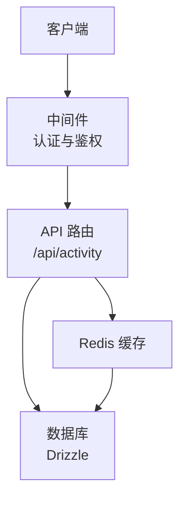
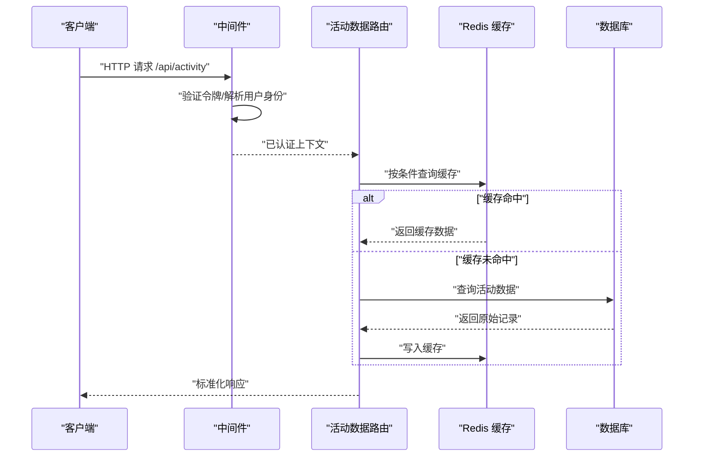
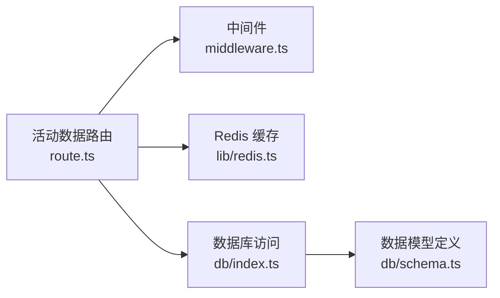

# 活动数据 API

<cite>
**本文引用的文件**   
- [app/api/activity/route.ts](file://app/api/activity/route.ts)
- [middleware.ts](file://middleware.ts)
- [lib/redis.ts](file://lib/redis.ts)
- [db/index.ts](file://db/index.ts)
- [db/schema.ts](file://db/schema.ts)
</cite>

## 目录
1. [简介](#简介)
2. [项目结构](#项目结构)
3. [核心组件](#核心组件)
4. [架构总览](#架构总览)
5. [详细组件分析](#详细组件分析)
6. [依赖关系分析](#依赖关系分析)
7. [性能考虑](#性能考虑)
8. [故障排查指南](#故障排查指南)
9. [结论](#结论)
10. [附录](#附录)

## 简介
本文件为“活动数据 API”的接口文档，聚焦于获取用户活动数据的 RESTful 端点。该 API 用于查询用户的最近活动、浏览历史等数据，提供统一的请求与响应格式说明、认证与权限控制策略、错误处理规范以及客户端集成建议。

## 项目结构
本项目采用 Next.js App Router 组织后端路由，活动数据相关的路由位于 app/api/activity/route.ts；认证与鉴权通过中间件统一处理；缓存层使用 Redis；持久化存储基于数据库（Drizzle）。

**图示来源**
- [app/api/activity/route.ts](file://app/api/activity/route.ts)
- [middleware.ts](file://middleware.ts)
- [lib/redis.ts](file://lib/redis.ts)
- [db/index.ts](file://db/index.ts)

**章节来源**
- [app/api/activity/route.ts](file://app/api/activity/route.ts)
- [middleware.ts](file://middleware.ts)
- [lib/redis.ts](file://lib/redis.ts)
- [db/index.ts](file://db/index.ts)

## 核心组件
- 活动数据 API 路由：负责接收请求、校验参数、读取缓存或数据库、返回结构化响应。
- 认证与鉴权中间件：验证访问令牌、解析当前用户身份、执行权限检查。
- 缓存层：对热点活动数据进行缓存，降低数据库压力。
- 数据访问层：封装数据库查询逻辑，保证数据一致性与可维护性。

**章节来源**
- [app/api/activity/route.ts](file://app/api/activity/route.ts)
- [middleware.ts](file://middleware.ts)
- [lib/redis.ts](file://lib/redis.ts)
- [db/index.ts](file://db/index.ts)

## 架构总览
活动数据 API 的整体调用流程如下：客户端发起请求，中间件完成认证与鉴权后交由路由处理；路由优先从缓存读取，未命中则查询数据库并回填缓存；最终将标准化的活动数据返回给客户端。

**图示来源**
- [app/api/activity/route.ts](file://app/api/activity/route.ts)
- [middleware.ts](file://middleware.ts)
- [lib/redis.ts](file://lib/redis.ts)
- [db/index.ts](file://db/index.ts)

## 详细组件分析

### 活动数据 API 路由
- 端点路径：/api/activity
- HTTP 方法：GET
- 认证要求：需要有效的访问令牌（由中间件校验）
- 权限控制：仅允许本人访问其活动数据
- 查询参数：
  - user_id：可选，限定特定用户（管理员场景）
  - type：可选，过滤活动类型（如浏览、点赞、评论等）
  - start_time：可选，起始时间（ISO 8601）
  - end_time：可选，结束时间（ISO 8601）
  - page：可选，页码（默认 1）
  - page_size：可选，每页条数（默认 20，最大 100）
- 响应体字段：
  - code：业务状态码（整数）
  - message：提示信息（字符串）
  - data：
    - items：活动记录数组
      - id：活动唯一标识（字符串）
      - user_id：用户标识（字符串）
      - type：活动类型（字符串）
      - target_type：目标类型（字符串，如 post、comment）
      - target_id：目标标识（字符串）
      - created_at：创建时间（ISO 8601）
      - meta：扩展元数据（对象，可选）
    - total：总数（整数）
    - page：当前页（整数）
    - page_size：每页条数（整数）
- 示例请求：
  - GET /api/activity?type=visit&start_time=2024-01-01T00:00:00Z&page=1&page_size=20
- 示例响应：
  - {
      "code": 0,
      "message": "ok",
      "data": {
        "items": [
          {
            "id": "act_001",
            "user_id": "u_001",
            "type": "visit",
            "target_type": "post",
            "target_id": "p_123",
            "created_at": "2024-06-01T12:34:56Z",
            "meta": {}
          }
        ],
        "total": 100,
        "page": 1,
        "page_size": 20
      }
    }

**章节来源**
- [app/api/activity/route.ts](file://app/api/activity/route.ts)

### 认证与鉴权中间件
- 功能职责：
  - 校验请求头中的访问令牌
  - 解析当前用户身份
  - 根据角色与资源进行权限判断
- 失败行为：
  - 未携带令牌或令牌无效：返回 401 未授权
  - 无权限访问：返回 403 禁止访问
- 成功行为：
  - 将用户上下文注入后续路由处理

**章节来源**
- [middleware.ts](file://middleware.ts)

### 缓存层（Redis）
- 作用：缓存活动数据查询结果，提升读取性能
- 键设计：按查询条件生成稳定键（包含 user_id、type、时间范围、分页参数）
- 过期策略：设置合理 TTL，避免脏读
- 一致性：写操作后主动失效相关缓存键

**章节来源**
- [lib/redis.ts](file://lib/redis.ts)

### 数据访问层（数据库）
- 作用：封装活动数据的增删改查
- 索引建议：在 user_id、type、created_at 上建立索引以优化查询
- 事务与一致性：批量写入时使用事务确保一致性

**章节来源**
- [db/index.ts](file://db/index.ts)
- [db/schema.ts](file://db/schema.ts)

## 依赖关系分析
活动数据 API 的依赖关系如下：

**图示来源**
- [app/api/activity/route.ts](file://app/api/activity/route.ts)
- [middleware.ts](file://middleware.ts)
- [lib/redis.ts](file://lib/redis.ts)
- [db/index.ts](file://db/index.ts)
- [db/schema.ts](file://db/schema.ts)

**章节来源**
- [app/api/activity/route.ts](file://app/api/activity/route.ts)
- [middleware.ts](file://middleware.ts)
- [lib/redis.ts](file://lib/redis.ts)
- [db/index.ts](file://db/index.ts)
- [db/schema.ts](file://db/schema.ts)

## 性能考虑
- 缓存命中率：合理设置缓存键与 TTL，减少重复查询
- 分页限制：限制 page_size 最大值，防止大结果集导致内存与带宽压力
- 索引优化：针对高频查询字段建立索引，缩短查询延迟
- 超时与重试：对外部依赖（Redis、DB）设置超时与重试策略，提高稳定性

[本节为通用指导，不直接分析具体文件]

## 故障排查指南
- 401 未授权：检查请求头是否携带有效令牌，确认中间件配置是否正确
- 403 禁止访问：确认当前用户是否有权限访问指定资源
- 500 服务器错误：查看服务端日志，定位数据库连接、缓存异常或业务逻辑错误
- 缓存不一致：在写操作后主动失效相关缓存键，必要时强制刷新缓存

**章节来源**
- [middleware.ts](file://middleware.ts)
- [lib/redis.ts](file://lib/redis.ts)
- [db/index.ts](file://db/index.ts)

## 结论
活动数据 API 通过中间件实现统一的认证与鉴权，结合 Redis 缓存与数据库访问层，提供高效、稳定的用户活动数据查询能力。遵循本文档的接口规范与最佳实践，可实现可靠的客户端集成与良好的用户体验。

[本节为总结性内容，不直接分析具体文件]

## 附录

### 客户端集成示例（概念性步骤）
- 初始化 HTTP 客户端，设置基础 URL 与公共请求头（含访问令牌）
- 构造查询参数（type、时间范围、分页），发送 GET 请求至 /api/activity
- 解析响应体，提取 data.items 渲染列表，处理分页与加载状态
- 错误处理：捕获 401/403/500 等状态码，给出友好提示与重试机制

[本节为概念性指导，不直接分析具体文件]