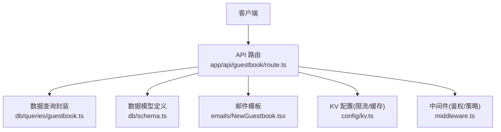
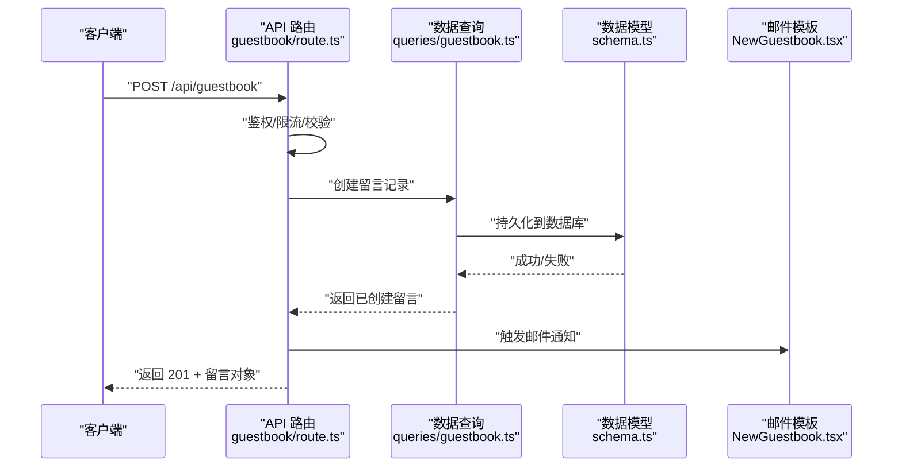
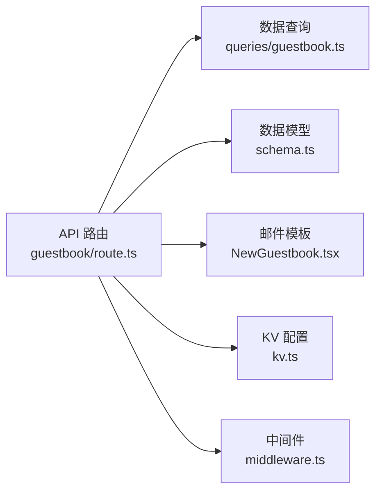

# 留言簿 API

<cite>
**本文引用的文件**
- [app/api/guestbook/route.ts](file://app/api/guestbook/route.ts)
- [db/schema.ts](file://db/schema.ts)
- [db/queries/guestbook.ts](file://db/queries/guestbook.ts)
- [emails/NewGuestbook.tsx](file://emails/NewGuestbook.tsx)
- [lib/validation.ts](file://lib/validation.ts)
- [config/kv.ts](file://config/kv.ts)
- [middleware.ts](file://middleware.ts)
</cite>

## 目录
1. [简介](#简介)
2. [项目结构](#项目结构)
3. [核心组件](#核心组件)
4. [架构总览](#架构总览)
5. [详细组件分析](#详细组件分析)
6. [依赖关系分析](#依赖关系分析)
7. [性能考虑](#性能考虑)
8. [故障排查指南](#故障排查指南)
9. [结论](#结论)
10. [附录](#附录)

## 简介
本文件为“留言簿”功能的 API 接口文档，覆盖访客留言的完整 CRUD 操作：提交新留言、获取留言列表（支持分页、排序与搜索）、编辑留言、删除留言。文档同时说明数据结构、内容验证规则与安全过滤机制，并解释反垃圾邮件保护、内容审核、用户权限控制、邮件通知触发以及实时更新方案。

## 项目结构
留言簿功能在 Next.js App Router 中以 API Route 形式暴露，数据层基于 Drizzle ORM 与数据库 Schema，邮件模板位于 emails 目录，校验逻辑集中于 lib/validation.ts，KV 配置用于速率限制等能力，全局中间件用于鉴权与访问控制。

图表来源
- [app/api/guestbook/route.ts](file://app/api/guestbook/route.ts)
- [db/queries/guestbook.ts](file://db/queries/guestbook.ts)
- [db/schema.ts](file://db/schema.ts)
- [emails/NewGuestbook.tsx](file://emails/NewGuestbook.tsx)
- [config/kv.ts](file://config/kv.ts)
- [middleware.ts](file://middleware.ts)

章节来源
- [app/api/guestbook/route.ts](file://app/api/guestbook/route.ts)
- [db/schema.ts](file://db/schema.ts)
- [db/queries/guestbook.ts](file://db/queries/guestbook.ts)
- [emails/NewGuestbook.tsx](file://emails/NewGuestbook.tsx)
- [lib/validation.ts](file://lib/validation.ts)
- [config/kv.ts](file://config/kv.ts)
- [middleware.ts](file://middleware.ts)

## 核心组件
- API 路由：提供 RESTful 端点，处理请求参数、鉴权、校验、调用数据层、返回响应。
- 数据模型：定义留言表结构与字段约束。
- 数据查询：封装增删改查、分页、排序、搜索等数据库操作。
- 邮件通知：在新留言或回复时触发邮件发送。
- 校验工具：统一输入校验与内容清洗。
- KV 配置：用于速率限制、缓存键等。
- 中间件：集中鉴权与访问控制策略。

章节来源
- [app/api/guestbook/route.ts](file://app/api/guestbook/route.ts)
- [db/schema.ts](file://db/schema.ts)
- [db/queries/guestbook.ts](file://db/queries/guestbook.ts)
- [emails/NewGuestbook.tsx](file://emails/NewGuestbook.tsx)
- [lib/validation.ts](file://lib/validation.ts)
- [config/kv.ts](file://config/kv.ts)
- [middleware.ts](file://middleware.ts)

## 架构总览
以下序列图展示“提交新留言”的典型流程：客户端发起请求，API 路由进行鉴权与校验，写入数据库，随后触发邮件通知。

图表来源
- [app/api/guestbook/route.ts](file://app/api/guestbook/route.ts)
- [db/queries/guestbook.ts](file://db/queries/guestbook.ts)
- [db/schema.ts](file://db/schema.ts)
- [emails/NewGuestbook.tsx](file://emails/NewGuestbook.tsx)

## 详细组件分析

### 接口定义与行为
- 基础路径：/api/guestbook
- 方法
  - POST /api/guestbook：提交新留言
  - GET /api/guestbook：获取留言列表（分页、排序、搜索）
  - PATCH /api/guestbook：编辑留言（需携带 id 与必要权限）
  - DELETE /api/guestbook：删除留言（需携带 id 与必要权限）

请求头
- Content-Type: application/json（JSON 请求体）
- Authorization: Bearer <token>（受保护操作需要）

通用响应格式
- 成功：{ code, data }
- 错误：{ code, message }

#### 提交新留言
- 方法：POST
- 路径：/api/guestbook
- 鉴权：可选（根据业务需求可允许匿名或仅登录用户）
- 请求体字段
  - name: string，必填，长度范围由校验器决定
  - email: string，可选，邮箱格式校验
  - website: string，可选，URL 格式校验
  - content: string，必填，最大长度由校验器决定
  - avatar_url: string，可选，URL 格式校验
- 响应体
  - 201 Created：返回新建留言对象
  - 400 Bad Request：参数校验失败
  - 401 Unauthorized：未授权（若启用鉴权）
  - 429 Too Many Requests：触发限流
  - 500 Internal Server Error：服务器错误

示例请求
- 请求体
  - {
      "name": "张三",
      "email": "zhangsan@example.com",
      "website": "https://example.com",
      "content": "这是一条测试留言",
      "avatar_url": "https://example.com/avatar.png"
    }
- 响应体
  - {
      "code": 0,
      "data": {
        "id": "uuid-or-int",
        "name": "张三",
        "email": "zhangsan@example.com",
        "website": "https://example.com",
        "content": "这是一条测试留言",
        "avatar_url": "https://example.com/avatar.png",
        "created_at": "2024-01-01T00:00:00Z",
        "updated_at": "2024-01-01T00:00:00Z"
      }
    }

#### 获取留言列表
- 方法：GET
- 路径：/api/guestbook
- 查询参数
  - page: number，默认 1
  - per_page: number，默认 20，最大建议不超过 100
  - sort_by: string，默认 created_at，可选值包括 created_at、updated_at、name
  - order: string，默认 desc，可选 asc/desc
  - q: string，可选，关键词搜索（对 name、content 等字段模糊匹配）
- 响应体
  - 200 OK：{ code, data: { items, total, page, per_page } }

示例请求
- GET /api/guestbook?page=1&per_page=20&sort_by=created_at&order=desc&q=测试
- 响应体
  - {
      "code": 0,
      "data": {
        "items": [ /* 留言数组 */ ],
        "total": 123,
        "page": 1,
        "per_page": 20
      }
    }

#### 编辑留言
- 方法：PATCH
- 路径：/api/guestbook
- 鉴权：必须（仅作者或管理员）
- 请求体字段
  - id: string/int，必填，目标留言标识
  - name: string，可选
  - email: string，可选
  - website: string，可选
  - content: string，可选
  - avatar_url: string，可选
- 响应体
  - 200 OK：返回更新后的留言对象
  - 404 Not Found：留言不存在
  - 403 Forbidden：无权限
  - 400 Bad Request：参数校验失败

示例请求
- 请求体
  - {
      "id": "target-id",
      "content": "已更新的留言内容"
    }
- 响应体
  - {
      "code": 0,
      "data": {
        "id": "target-id",
        "content": "已更新的留言内容",
        "updated_at": "2024-01-01T00:00:00Z"
      }
    }

#### 删除留言
- 方法：DELETE
- 路径：/api/guestbook
- 鉴权：必须（仅作者或管理员）
- 请求体字段
  - id: string/int，必填，目标留言标识
- 响应体
  - 200 OK：{ code, message: "删除成功" }
  - 404 Not Found：留言不存在
  - 403 Forbidden：无权限

示例请求
- 请求体
  - { "id": "target-id" }
- 响应体
  - { "code": 0, "message": "删除成功" }

章节来源
- [app/api/guestbook/route.ts](file://app/api/guestbook/route.ts)
- [db/queries/guestbook.ts](file://db/queries/guestbook.ts)
- [db/schema.ts](file://db/schema.ts)
- [emails/NewGuestbook.tsx](file://emails/NewGuestbook.tsx)
- [lib/validation.ts](file://lib/validation.ts)
- [config/kv.ts](file://config/kv.ts)
- [middleware.ts](file://middleware.ts)

### 数据结构与验证规则
- 字段类型与约束
  - id: 主键，自动生成
  - name: 字符串，必填，最小/最大长度由校验器定义
  - email: 字符串，可选，邮箱格式校验
  - website: 字符串，可选，URL 格式校验
  - content: 字符串，必填，最大长度由校验器定义
  - avatar_url: 字符串，可选，URL 格式校验
  - created_at: 时间戳，自动填充
  - updated_at: 时间戳，自动更新
- 内容验证
  - 使用统一校验器进行字段存在性、长度、格式校验
  - 敏感词与恶意脚本过滤在入库前执行
- 安全过滤
  - 输入清洗：去除危险标签与事件处理器
  - 输出转义：渲染时对内容进行 HTML 转义
  - 速率限制：基于 IP 或用户 ID 的 KV 计数，防止滥用

章节来源
- [db/schema.ts](file://db/schema.ts)
- [lib/validation.ts](file://lib/validation.ts)

### 分页、排序与搜索
- 分页
  - page：页码，从 1 开始
  - per_page：每页数量，上限由服务端限制
- 排序
  - sort_by：支持按创建时间、更新时间、名称排序
  - order：asc 升序，desc 降序
- 搜索
  - q：关键词，对 name、content 等字段进行模糊匹配
  - 注意：大数据量下建议使用全文索引或搜索引擎优化

章节来源
- [db/queries/guestbook.ts](file://db/queries/guestbook.ts)

### 反垃圾邮件与内容审核
- 反垃圾
  - 验证码：集成第三方服务（如 reCAPTCHA/hCaptcha），在提交前校验
  - 速率限制：通过 KV 统计同一 IP/用户的提交频率，超限返回 429
  - 黑名单：IP/域名/关键字黑名单拦截
- 内容审核
  - 预过滤：入库前对内容进行敏感词检测与脚本注入防护
  - 后审核：可选异步审核任务，标记可疑内容供人工复核

章节来源
- [config/kv.ts](file://config/kv.ts)
- [lib/validation.ts](file://lib/validation.ts)

### 用户权限控制
- 角色
  - 访客：可提交留言（若允许匿名）
  - 作者：可编辑/删除自己的留言
  - 管理员：可管理所有留言
- 鉴权
  - 使用中间件统一校验 Authorization 头与会话状态
  - 资源级权限：比较当前用户与留言 author_id 是否一致

章节来源
- [middleware.ts](file://middleware.ts)

### 邮件通知触发机制
- 触发时机
  - 新留言提交成功后，异步发送邮件通知
- 收件人
  - 站点管理员邮箱或订阅者列表
- 模板
  - 使用 NewGuestbook 模板渲染内容与链接

章节来源
- [emails/NewGuestbook.tsx](file://emails/NewGuestbook.tsx)

### 实时更新实现方式
- 推荐方案
  - Server-Sent Events（SSE）：服务端推送新留言事件至前端
  - WebSocket：双向通信，适合高并发场景
- 基本流程
  - 客户端建立连接
  - 服务端在新增/更新/删除留言后广播事件
  - 前端接收事件并增量更新 UI

[本节为概念性说明，不直接分析具体文件]

## 依赖关系分析

图表来源
- [app/api/guestbook/route.ts](file://app/api/guestbook/route.ts)
- [db/queries/guestbook.ts](file://db/queries/guestbook.ts)
- [db/schema.ts](file://db/schema.ts)
- [emails/NewGuestbook.tsx](file://emails/NewGuestbook.tsx)
- [config/kv.ts](file://config/kv.ts)
- [middleware.ts](file://middleware.ts)

章节来源
- [app/api/guestbook/route.ts](file://app/api/guestbook/route.ts)
- [db/queries/guestbook.ts](file://db/queries/guestbook.ts)
- [db/schema.ts](file://db/schema.ts)
- [emails/NewGuestbook.tsx](file://emails/NewGuestbook.tsx)
- [config/kv.ts](file://config/kv.ts)
- [middleware.ts](file://middleware.ts)

## 性能考虑
- 分页与索引
  - 对常用排序字段（created_at、updated_at、name）建立索引
  - 大结果集避免一次性加载，合理设置 per_page
- 缓存
  - 列表查询可使用 KV 或 Redis 缓存热点数据
  - 缓存失效策略：写操作后清除相关缓存
- 异步任务
  - 邮件发送、内容审核等耗时操作放入队列异步执行
- 限流
  - 基于 IP/用户维度的速率限制，防止滥用与暴力破解

[本节提供一般性指导，不直接分析具体文件]

## 故障排查指南
- 常见问题
  - 400 参数校验失败：检查必填字段、长度与格式
  - 401 未授权：确认 Authorization 头与会话有效
  - 403 无权限：确认当前用户是否为作者或管理员
  - 404 资源不存在：确认 id 是否正确
  - 429 限流：稍后再试或降低请求频率
  - 500 服务器错误：查看日志定位异常
- 调试建议
  - 开启详细日志，记录请求参数与错误堆栈
  - 使用 KV 监控限流计数与缓存命中率
  - 对邮件发送进行重试与失败告警

章节来源
- [app/api/guestbook/route.ts](file://app/api/guestbook/route.ts)
- [config/kv.ts](file://config/kv.ts)

## 结论
本留言簿 API 提供了完整的 CRUD 能力，并通过统一的校验、鉴权、限流与邮件通知机制保障安全性与可用性。结合分页、排序与搜索，可满足日常访客互动需求；通过 SSE/WebSocket 可实现实时体验。建议在大规模场景下引入缓存与异步任务队列，进一步提升性能与稳定性。

## 附录

### 错误码约定
- 0：成功
- 400：参数校验失败
- 401：未授权
- 403：无权限
- 404：资源不存在
- 429：请求过于频繁
- 500：服务器内部错误

### 请求/响应示例汇总
- 提交新留言
  - 请求体：包含 name、content 等字段
  - 响应体：返回新建留言对象
- 获取留言列表
  - 查询参数：page、per_page、sort_by、order、q
  - 响应体：包含 items、total、page、per_page
- 编辑留言
  - 请求体：包含 id 与待更新字段
  - 响应体：返回更新后的留言对象
- 删除留言
  - 请求体：包含 id
  - 响应体：返回成功消息

章节来源
- [app/api/guestbook/route.ts](file://app/api/guestbook/route.ts)
- [db/queries/guestbook.ts](file://db/queries/guestbook.ts)
- [db/schema.ts](file://db/schema.ts)
- [emails/NewGuestbook.tsx](file://emails/NewGuestbook.tsx)
- [lib/validation.ts](file://lib/validation.ts)
- [config/kv.ts](file://config/kv.ts)
- [middleware.ts](file://middleware.ts)