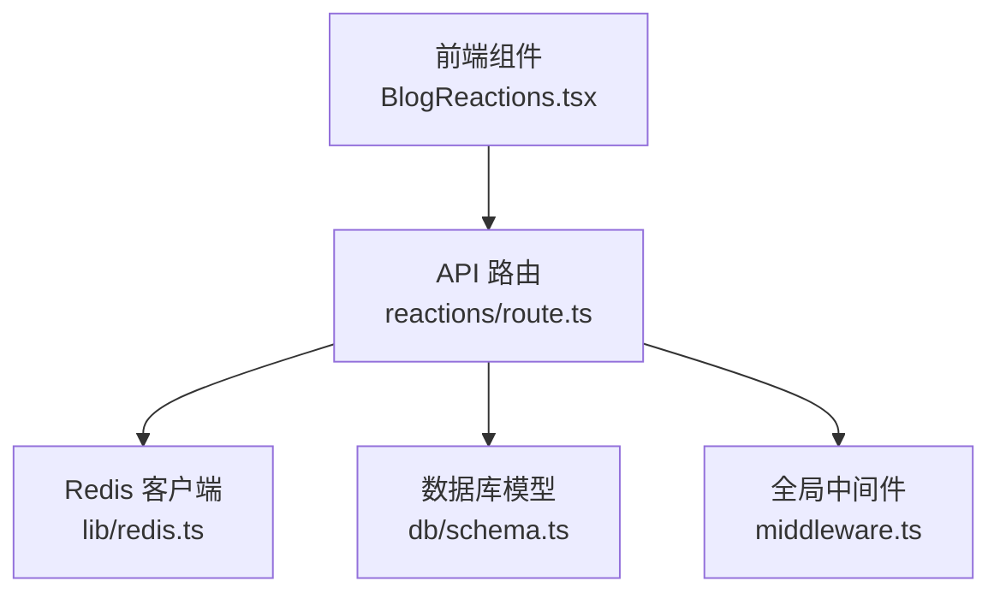
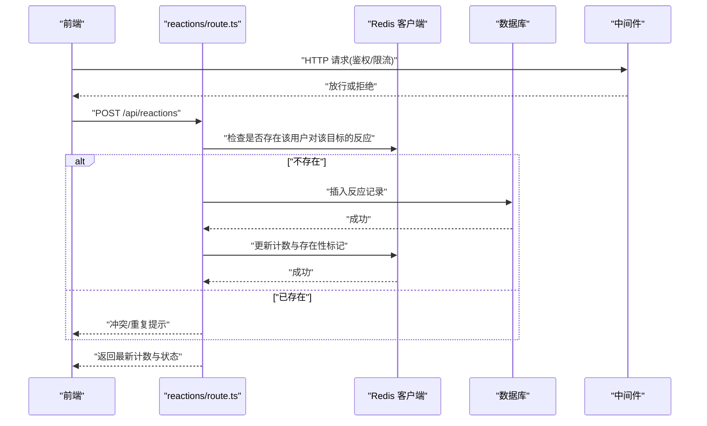
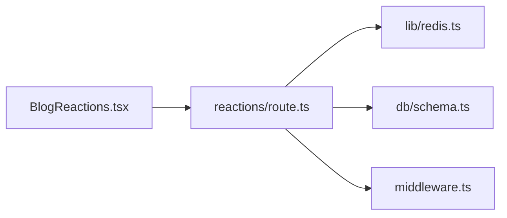

# 社交反应 API

<cite>
**本文引用的文件**
- [app/api/reactions/route.ts](file://app/api/reactions/route.ts)
- [app/(main)/blog/BlogReactions.tsx](file://app/(main)/blog/BlogReactions.tsx)
- [lib/redis.ts](file://lib/redis.ts)
- [db/schema.ts](file://db/schema.ts)
- [middleware.ts](file://middleware.ts)
</cite>

## 目录
1. [简介](#简介)
2. [项目结构](#项目结构)
3. [核心组件](#核心组件)
4. [架构总览](#架构总览)
5. [详细组件分析](#详细组件分析)
6. [依赖关系分析](#依赖关系分析)
7. [性能考虑](#性能考虑)
8. [故障排查指南](#故障排查指南)
9. [结论](#结论)
10. [附录](#附录)

## 简介
本文件为“社交反应 API”的完整接口文档，覆盖用户对内容的点赞、收藏、分享等互动行为。文档包含：
- 数据类型与计数统计
- 去重机制（同一用户在同一内容上对同一反应类型仅保留一次）
- 实时反应更新与并发处理
- 数据一致性保证
- 请求/响应示例
- 防刷、频率限制与异常检测
- 前端实时更新集成方案与 WebSocket 连接管理
- 性能优化建议与缓存策略配置

## 项目结构
本项目采用 Next.js App Router，后端 API 位于 app/api 下，反应相关接口在 reactions 路由中；前端交互组件位于 blog 模块下的 BlogReactions 组件；Redis 客户端封装于 lib/redis.ts；数据库模型定义在 db/schema.ts；全局中间件在 middleware.ts。

图表来源
- [app/api/reactions/route.ts](file://app/api/reactions/route.ts)
- [app/(main)/blog/BlogReactions.tsx](file://app/(main)/blog/BlogReactions.tsx)
- [lib/redis.ts](file://lib/redis.ts)
- [db/schema.ts](file://db/schema.ts)
- [middleware.ts](file://middleware.ts)

章节来源
- [app/api/reactions/route.ts](file://app/api/reactions/route.ts)
- [app/(main)/blog/BlogReactions.tsx](file://app/(main)/blog/BlogReactions.tsx)
- [lib/redis.ts](file://lib/redis.ts)
- [db/schema.ts](file://db/schema.ts)
- [middleware.ts](file://middleware.ts)

## 核心组件
- 反应 API 路由：提供创建、删除、查询反应及获取计数的能力，支持按目标对象与用户维度进行去重。
- 前端反应组件：负责触发点赞、收藏、分享等操作，并展示当前状态与计数。
- Redis 客户端：用于高频读写的缓存层，支撑计数聚合与快速判断是否已存在某用户的反应。
- 数据库模型：持久化存储反应记录，确保最终一致性与审计可追溯。
- 中间件：统一鉴权、限流与日志记录。

章节来源
- [app/api/reactions/route.ts](file://app/api/reactions/route.ts)
- [app/(main)/blog/BlogReactions.tsx](file://app/(main)/blog/BlogReactions.tsx)
- [lib/redis.ts](file://lib/redis.ts)
- [db/schema.ts](file://db/schema.ts)
- [middleware.ts](file://middleware.ts)

## 架构总览
整体流程：前端通过 REST 接口提交反应操作，API 路由校验参数与权限后，优先写入 Redis 以保障低延迟与高吞吐，随后异步或同步落库以保证一致性；读取路径优先从 Redis 返回计数与状态，未命中时回源数据库并回填缓存。

图表来源
- [app/api/reactions/route.ts](file://app/api/reactions/route.ts)
- [lib/redis.ts](file://lib/redis.ts)
- [db/schema.ts](file://db/schema.ts)
- [middleware.ts](file://middleware.ts)

## 详细组件分析

### 接口定义与协议
- 基础路径：/api/reactions
- 认证：由中间件统一处理，需在请求头携带会话令牌
- 通用错误码：
  - 400：参数校验失败
  - 401：未认证
  - 403：无权限
  - 409：重复反应（已存在）
  - 429：频率限制
  - 500：服务器内部错误

#### 创建反应
- 方法：POST
- 路径：/api/reactions
- 请求体字段：
  - targetId: string，目标对象唯一标识（如文章 ID）
  - targetType: enum，目标类型（例如 post）
  - reactionType: enum，反应类型（like、bookmark、share）
  - userId: string，操作者用户标识（由中间件注入或从会话解析）
- 响应体：
  - success: boolean
  - data: { count: number, isReacted: boolean }
  - message: string

章节来源
- [app/api/reactions/route.ts](file://app/api/reactions/route.ts)
- [middleware.ts](file://middleware.ts)

#### 删除反应
- 方法：DELETE
- 路径：/api/reactions
- 查询参数：
  - targetId: string
  - targetType: enum
  - reactionType: enum
  - userId: string
- 响应体：
  - success: boolean
  - data: { count: number, isReacted: boolean }
  - message: string

章节来源
- [app/api/reactions/route.ts](file://app/api/reactions/route.ts)

#### 查询计数与状态
- 方法：GET
- 路径：/api/reactions
- 查询参数：
  - targetId: string
  - targetType: enum
  - userId: string（可选，若提供则同时返回 isReacted）
- 响应体：
  - success: boolean
  - data: { counts: { like: number, bookmark: number, share: number }, isReacted?: boolean }
  - message: string

章节来源
- [app/api/reactions/route.ts](file://app/api/reactions/route.ts)

#### 批量查询（可选扩展）
- 方法：POST
- 路径：/api/reactions/batch
- 请求体：targets: Array<{ targetId, targetType }>
- 响应体：
  - success: boolean
  - data: Map<targetKey, { counts, isReacted? }>
  - message: string

说明：批量接口用于减少网络往返，适合列表页预取。

章节来源
- [app/api/reactions/route.ts](file://app/api/reactions/route.ts)

### 反应数据类型与计数统计
- 反应类型枚举：
  - like：点赞
  - bookmark：收藏
  - share：分享
- 计数统计：
  - 每个目标对象维护各反应类型的独立计数
  - 计数来源于数据库聚合，并通过 Redis 缓存加速读取
  - 去重规则：同一用户在同一目标对象上对同一反应类型仅保留一条记录

章节来源
- [db/schema.ts](file://db/schema.ts)
- [lib/redis.ts](file://lib/redis.ts)
- [app/api/reactions/route.ts](file://app/api/reactions/route.ts)

### 去重机制与一致性
- 去重键设计：
  - 用户维度 + 目标维度 + 反应类型 = 唯一约束
  - 使用数据库唯一索引与 Redis 存在性标记双重保障
- 一致性策略：
  - 写路径：先检查 Redis 是否存在，再写入数据库，成功后更新 Redis 计数
  - 读路径：优先从 Redis 读取计数与状态，未命中时回源数据库并回填缓存
  - 幂等性：重复提交相同反应将返回 409 冲突

章节来源
- [app/api/reactions/route.ts](file://app/api/reactions/route.ts)
- [db/schema.ts](file://db/schema.ts)
- [lib/redis.ts](file://lib/redis.ts)

### 并发处理与锁
- 并发安全：
  - 使用 Redis 分布式锁保护热点目标的计数更新
  - 数据库唯一索引防止重复记录
- 重试与退避：
  - 对短暂失败的 Redis 操作进行有限次重试与指数退避
  - 对数据库写入失败进行错误分类与告警

章节来源
- [app/api/reactions/route.ts](file://app/api/reactions/route.ts)
- [lib/redis.ts](file://lib/redis.ts)

### 防刷机制、频率限制与异常检测
- 频率限制：
  - 基于 IP 与用户 ID 的双维度限流，默认阈值可按环境配置
  - 超限返回 429，附带重试时间
- 异常检测：
  - 监控异常模式（短时间大量重复反应、异常来源 IP、异常 UA）
  - 自动封禁可疑来源并记录审计日志

章节来源
- [middleware.ts](file://middleware.ts)
- [app/api/reactions/route.ts](file://app/api/reactions/route.ts)

### 前端实时更新集成方案与 WebSocket 连接管理
- 事件推送：
  - 当反应计数变化时，服务端通过 WebSocket 广播目标对象的最新计数
  - 前端订阅频道：reactions:{targetId}
- 连接管理：
  - 断线重连：指数退避 + 最大重试次数
  - 心跳保活：定期 ping/pong
  - 状态同步：首次连接拉取当前计数，后续增量更新
- 降级策略：
  - 若 WebSocket 不可用，前端轮询 GET /api/reactions 保持 UI 一致

章节来源
- [app/api/reactions/route.ts](file://app/api/reactions/route.ts)
- [app/(main)/blog/BlogReactions.tsx](file://app/(main)/blog/BlogReactions.tsx)

### 请求/响应示例
以下为典型场景的请求与响应摘要（字段名与结构见接口定义）：

- 点赞成功
  - 请求：POST /api/reactions { targetId, targetType, reactionType: "like", userId }
  - 响应：{ success: true, data: { count: 12, isReacted: true }, message: "操作成功" }

- 重复点赞
  - 请求：同上
  - 响应：{ success: false, message: "已存在重复反应", code: 409 }

- 取消收藏
  - 请求：DELETE /api/reactions?targetId=...&reactionType=bookmark&userId=...
  - 响应：{ success: true, data: { count: 8, isReacted: false }, message: "操作成功" }

- 查询计数
  - 请求：GET /api/reactions?targetId=...&targetType=post&userId=...
  - 响应：{ success: true, data: { counts: { like: 12, bookmark: 8, share: 3 }, isReacted: true }, message: "查询成功" }

章节来源
- [app/api/reactions/route.ts](file://app/api/reactions/route.ts)

### 前端组件集成要点
- 状态管理：
  - 本地缓存当前计数与 isReacted，乐观更新 UI
  - 收到 WebSocket 事件后覆盖本地状态
- 错误处理：
  - 网络错误与 429 时显示友好提示并重试
  - 409 冲突时提示用户已存在反应
- 用户体验：
  - 点击反馈即时可见，后台静默同步
  - 批量加载时使用骨架屏提升感知性能

章节来源
- [app/(main)/blog/BlogReactions.tsx](file://app/(main)/blog/BlogReactions.tsx)

## 依赖关系分析

图表来源
- [app/api/reactions/route.ts](file://app/api/reactions/route.ts)
- [lib/redis.ts](file://lib/redis.ts)
- [db/schema.ts](file://db/schema.ts)
- [middleware.ts](file://middleware.ts)
- [app/(main)/blog/BlogReactions.tsx](file://app/(main)/blog/BlogReactions.tsx)

章节来源
- [app/api/reactions/route.ts](file://app/api/reactions/route.ts)
- [lib/redis.ts](file://lib/redis.ts)
- [db/schema.ts](file://db/schema.ts)
- [middleware.ts](file://middleware.ts)
- [app/(main)/blog/BlogReactions.tsx](file://app/(main)/blog/BlogReactions.tsx)

## 性能考虑
- 缓存策略：
  - 计数与存在性标记缓存至 Redis，TTL 按业务需求设置
  - 热点目标使用局部锁避免惊群效应
- 读写分离：
  - 读路径优先走缓存，写路径双写（Redis + DB）并保证顺序
- 批量接口：
  - 列表页使用批量查询减少往返
- 连接池与超时：
  - Redis 与数据库连接池合理配置，设置超时与重试上限
- 监控与告警：
  - 关键指标：QPS、P99 延迟、错误率、缓存命中率、锁等待时长

[本节为通用性能指导，不直接分析具体文件]

## 故障排查指南
- 常见问题定位：
  - 409 冲突：检查去重键是否正确，确认唯一索引生效
  - 429 限流：检查中间件阈值与来源 IP/用户分布
  - 计数不一致：核对 Redis 与数据库的一致性修复任务
- 日志与追踪：
  - 记录每次操作的 key、userId、targetId、reactionType、结果与耗时
  - 对异常路径输出堆栈与上下文
- 恢复策略：
  - 提供后台任务对热点目标进行计数重建与缓存预热

章节来源
- [app/api/reactions/route.ts](file://app/api/reactions/route.ts)
- [middleware.ts](file://middleware.ts)

## 结论
本社交反应 API 通过“Redis 缓存 + 数据库持久化 + 中间件鉴权限流”的组合，实现了高吞吐、低延迟且一致的互动体验。配合前端 WebSocket 实时更新与完善的防刷策略，可在大规模访问场景下保持稳定与可靠。

[本节为总结性内容，不直接分析具体文件]

## 附录
- 术语表：
  - 反应：用户对内容的互动行为（点赞、收藏、分享）
  - 去重：同一用户在同一目标上的同一反应类型仅保留一条记录
  - 一致性：缓存与数据库的最终一致
- 配置项建议：
  - 限流阈值：按环境区分开发/测试/生产
  - TTL：根据业务活跃度调整
  - 重试次数与退避间隔：依据外部服务稳定性设定

[本节为补充信息，不直接分析具体文件]