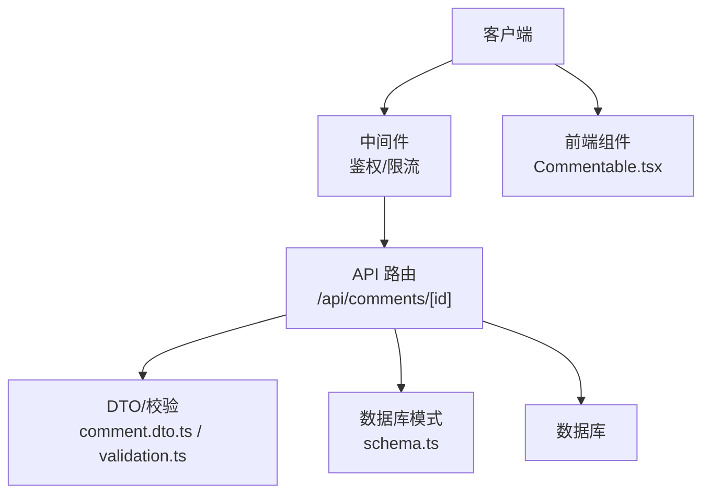
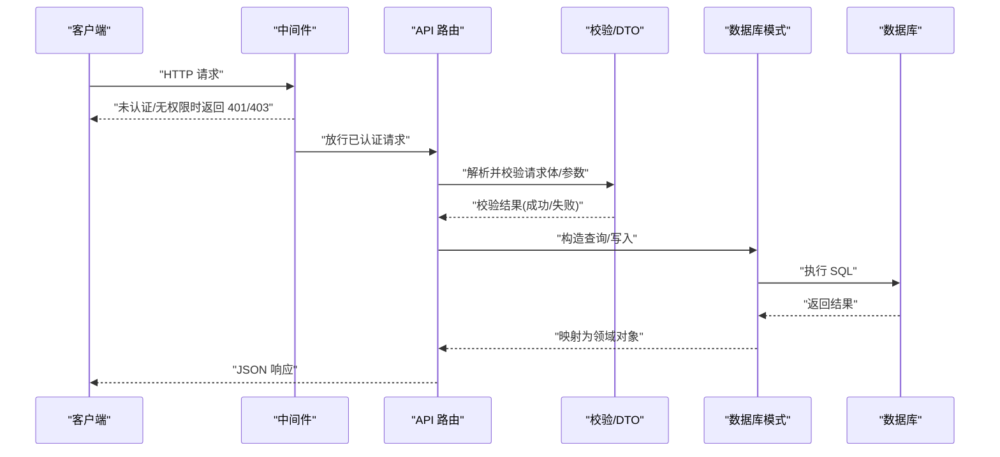
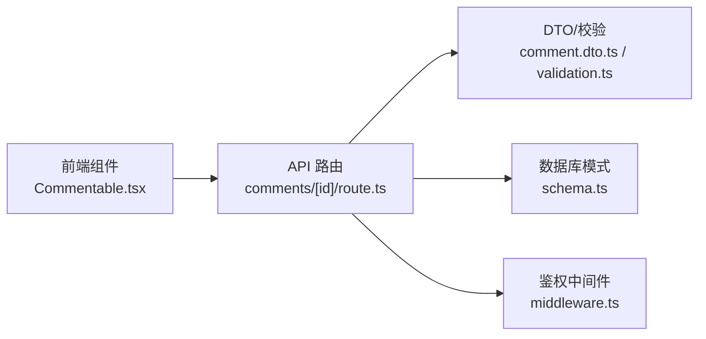

# 评论管理 API

<cite>
**本文引用的文件**   
- [app/api/comments/[id]/route.ts](file://app/api/comments/\[id\]/route.ts)
- [db/schema.ts](file://db/schema.ts)
- [db/dto/comment.dto.ts](file://db/dto/comment.dto.ts)
- [components/Commentable.tsx](file://components/Commentable.tsx)
- [lib/validation.ts](file://lib/validation.ts)
- [middleware.ts](file://middleware.ts)
</cite>

## 目录
1. [简介](#简介)
2. [项目结构](#项目结构)
3. [核心组件](#核心组件)
4. [架构总览](#架构总览)
5. [详细组件分析](#详细组件分析)
6. [依赖关系分析](#依赖关系分析)
7. [性能考虑](#性能考虑)
8. [故障排查指南](#故障排查指南)
9. [结论](#结论)
10. [附录](#附录)

## 简介
本文件为“评论管理 API”的完整接口文档，覆盖评论的增删改查、嵌套回复、状态管理与权限控制。文档包含数据模型与字段校验规则、请求与响应示例（成功与错误）、缓存策略、性能优化建议、安全性说明以及客户端集成指南。

## 项目结构
本项目采用 Next.js App Router 组织后端路由，评论相关的路由位于 app/api/comments/[id]/route.ts；数据模型定义在 db/schema.ts；DTO 与校验逻辑位于 db/dto/comment.dto.ts 与 lib/validation.ts；前端评论交互入口在 components/Commentable.tsx；全局鉴权中间件在 middleware.ts。

图表来源
- [app/api/comments/[id]/route.ts](file://app/api/comments/\[id\]/route.ts)
- [db/schema.ts](file://db/schema.ts)
- [db/dto/comment.dto.ts](file://db/dto/comment.dto.ts)
- [lib/validation.ts](file://lib/validation.ts)
- [components/Commentable.tsx](file://components/Commentable.tsx)
- [middleware.ts](file://middleware.ts)

章节来源
- [app/api/comments/[id]/route.ts](file://app/api/comments/\[id\]/route.ts)
- [db/schema.ts](file://db/schema.ts)
- [db/dto/comment.dto.ts](file://db/dto/comment.dto.ts)
- [lib/validation.ts](file://lib/validation.ts)
- [components/Commentable.tsx](file://components/Commentable.tsx)
- [middleware.ts](file://middleware.ts)

## 核心组件
- API 路由：提供评论的查询、创建、更新与删除能力，支持按资源 ID 访问。
- 数据模型：基于 Drizzle schema 定义的评论表结构，包含内容、作者、关联对象、父评论、状态等字段。
- DTO 与校验：对输入进行结构化校验与类型约束，确保入库数据一致性。
- 前端组件：封装评论展示与交互逻辑，调用 API 完成增删改查。
- 鉴权中间件：统一处理认证与授权，保护写操作端点。

章节来源
- [app/api/comments/[id]/route.ts](file://app/api/comments/\[id\]/route.ts)
- [db/schema.ts](file://db/schema.ts)
- [db/dto/comment.dto.ts](file://db/dto/comment.dto.ts)
- [lib/validation.ts](file://lib/validation.ts)
- [components/Commentable.tsx](file://components/Commentable.tsx)
- [middleware.ts](file://middleware.ts)

## 架构总览
评论 API 遵循 RESTful 风格，以资源为中心，通过路径参数标识目标评论或上下文资源。读写流程如下：

图表来源
- [app/api/comments/[id]/route.ts](file://app/api/comments/\[id\]/route.ts)
- [lib/validation.ts](file://lib/validation.ts)
- [db/schema.ts](file://db/schema.ts)
- [middleware.ts](file://middleware.ts)

## 详细组件分析

### 接口定义与行为
以下接口均基于 REST 约定，使用 JSON 作为数据交换格式。所有写操作需通过鉴权中间件。

- 获取评论列表
  - 方法：GET
  - 路径：/api/comments?targetId={targetId}&parentId={parentId}&page={page}&pageSize={pageSize}
  - 说明：按目标资源与父评论分页获取评论列表。支持按时间倒序排序。
  - 成功响应：{ comments: Comment[], total: number, page: number, pageSize: number }
  - 错误场景：参数缺失或非法、分页越界、数据库异常

- 创建新评论
  - 方法：POST
  - 路径：/api/comments
  - 请求体：{ targetId, parentId?, content, authorId }
  - 说明：可指定 parentId 实现嵌套回复。authorId 通常由服务端从会话中解析，避免伪造。
  - 成功响应：{ comment: Comment }
  - 错误场景：校验失败、重复提交、权限不足、数据库异常

- 更新评论内容
  - 方法：PATCH
  - 路径：/api/comments/{id}
  - 请求体：{ content? }
  - 说明：仅允许评论作者或管理员修改。
  - 成功响应：{ comment: Comment }
  - 错误场景：评论不存在、非本人/非管理员、校验失败、并发冲突

- 删除评论
  - 方法：DELETE
  - 路径：/api/comments/{id}
  - 说明：仅允许评论作者或管理员删除。软删除时标记状态为 deleted。
  - 成功响应：{ success: true }
  - 错误场景：评论不存在、非本人/非管理员、级联删除失败

- 获取单条评论详情
  - 方法：GET
  - 路径：/api/comments/{id}
  - 成功响应：{ comment: Comment }
  - 错误场景：评论不存在

- 获取子评论列表
  - 方法：GET
  - 路径：/api/comments/{id}/replies?page={page}&pageSize={pageSize}
  - 成功响应：{ replies: Comment[], total: number }
  - 错误场景：父评论不存在、分页参数非法

注意：以上路径与方法为规范约定，具体实现以路由文件为准。若实际路由存在差异，请以路由实现为准。

章节来源
- [app/api/comments/[id]/route.ts](file://app/api/comments/\[id\]/route.ts)

### 数据模型与字段校验
- 评论实体字段（参考 schema）
  - id：主键，唯一标识
  - targetId：关联的目标资源 ID（如文章、页面等）
  - parentId：父评论 ID，用于嵌套回复
  - content：评论内容文本
  - authorId：评论作者 ID
  - status：评论状态（例如 active、deleted、pending）
  - createdAt：创建时间
  - updatedAt：更新时间

- 字段校验规则（参考 DTO 与校验库）
  - targetId：必填，字符串，长度限制
  - parentId：可选，字符串，必须存在于评论表中
  - content：必填，字符串，最小/最大长度限制，禁止恶意脚本注入
  - authorId：服务端解析，不接受客户端直接传入
  - status：服务端维护，不允许客户端直接设置
  - 其他：时间戳由服务端生成

- 业务约束
  - 嵌套层级：建议限制最大深度（例如 3 层），防止过深嵌套导致渲染与查询性能问题
  - 幂等性：创建评论建议支持幂等键（如 clientRequestId），避免重复提交
  - 软删除：删除操作将 status 置为 deleted，不物理移除记录

章节来源
- [db/schema.ts](file://db/schema.ts)
- [db/dto/comment.dto.ts](file://db/dto/comment.dto.ts)
- [lib/validation.ts](file://lib/validation.ts)

### 权限控制机制
- 鉴权范围
  - 读操作：公开可读（可按需要改为仅登录可见）
  - 写操作：必须认证，且仅允许评论作者或管理员执行更新与删除
- 鉴权方式
  - 通过中间件统一拦截，校验会话/令牌有效性
  - 根据用户角色判断是否具备管理权限
- 常见错误码
  - 401：未认证
  - 403：无权限
  - 404：资源不存在
  - 422：请求体校验失败
  - 500：服务器内部错误

章节来源
- [middleware.ts](file://middleware.ts)
- [app/api/comments/[id]/route.ts](file://app/api/comments/\[id\]/route.ts)

### 嵌套评论支持
- 设计要点
  - 使用 parentId 建立父子关系
  - 查询时支持按 parentId 过滤，返回子评论树
  - 渲染时递归组装评论树，限制最大深度
- 性能建议
  - 批量加载子评论，减少 N+1 查询
  - 对热点评论树做缓存

章节来源
- [db/schema.ts](file://db/schema.ts)
- [components/Commentable.tsx](file://components/Commentable.tsx)

### 评论状态管理
- 状态枚举
  - active：正常显示
  - deleted：软删除
  - pending：待审核（可选）
- 状态流转
  - 创建默认 active 或 pending（取决于审核策略）
  - 删除置为 deleted
  - 审核通过后由 pending 转为 active

章节来源
- [db/schema.ts](file://db/schema.ts)

### 请求与响应示例
以下为通用示例，字段名与结构应与 DTO 和 schema 保持一致。

- 创建评论（成功）
  - 请求：POST /api/comments
  - 请求体：{ targetId: "post_123", parentId: null, content: "这是一条评论" }
  - 响应：{ comment: { id, targetId, parentId, content, authorId, status, createdAt, updatedAt } }

- 创建评论（校验失败）
  - 响应：{ error: "content 长度必须在 1-500 之间" }

- 更新评论（成功）
  - 请求：PATCH /api/comments/{id}
  - 请求体：{ content: "更新后的内容" }
  - 响应：{ comment: { ... } }

- 删除评论（成功）
  - 请求：DELETE /api/comments/{id}
  - 响应：{ success: true }

- 获取评论列表（成功）
  - 请求：GET /api/comments?targetId=post_123&page=1&pageSize=20
  - 响应：{ comments: [...], total: 100, page: 1, pageSize: 20 }

- 获取子评论（成功）
  - 请求：GET /api/comments/{parentId}/replies?page=1&pageSize=10
  - 响应：{ replies: [...], total: 30 }

- 错误场景（未认证）
  - 响应：{ error: "未认证" }，状态码 401

- 错误场景（无权限）
  - 响应：{ error: "无权限" }，状态码 403

- 错误场景（资源不存在）
  - 响应：{ error: "评论不存在" }，状态码 404

章节来源
- [db/dto/comment.dto.ts](file://db/dto/comment.dto.ts)
- [lib/validation.ts](file://lib/validation.ts)
- [app/api/comments/[id]/route.ts](file://app/api/comments/\[id\]/route.ts)

### 缓存策略与性能优化
- 缓存建议
  - 列表页：对热门资源的评论列表进行短期缓存（TTL 分钟级）
  - 详情与树：对高频访问的评论树进行缓存，失效策略包括评论变更事件触发
  - 子评论：按 parentId 维度缓存，便于局部刷新
- 查询优化
  - 分页：使用游标或基于时间的分页，避免深分页
  - 索引：为目标资源 ID、父评论 ID、状态、创建时间建立索引
  - 预取：在详情页预取首屏评论与少量子评论
- 前端优化
  - 乐观更新：创建/更新/删除先本地更新，再同步服务端
  - 增量加载：滚动加载下一页，避免一次性拉取大量数据

章节来源
- [components/Commentable.tsx](file://components/Commentable.tsx)
- [db/schema.ts](file://db/schema.ts)

### 安全性考虑
- 输入校验与清洗：严格校验 content 长度与字符集，过滤潜在 XSS 风险
- 身份与授权：写操作强制鉴权，服务端解析 authorId，拒绝客户端伪造
- 速率限制：对创建与删除接口实施限流，防止滥用
- 审计日志：记录关键操作的审计信息（作者、时间、IP）

章节来源
- [lib/validation.ts](file://lib/validation.ts)
- [middleware.ts](file://middleware.ts)

### 客户端集成指南
- 基础步骤
  - 初始化认证会话，确保携带有效令牌
  - 调用列表接口获取评论，分页加载
  - 创建评论时传递 targetId 与 content，必要时传 parentId
  - 更新/删除时携带评论 id，并确保当前用户有权限
- 错误处理
  - 捕获 401/403，引导用户重新登录或提示无权限
  - 捕获 422，展示字段级错误信息
  - 捕获 5xx，重试或降级到本地缓存
- 用户体验
  - 使用乐观更新提升交互流畅度
  - 对长评论进行截断与展开
  - 对嵌套评论限制展示层级，并提供“查看完整回复”入口

章节来源
- [components/Commentable.tsx](file://components/Commentable.tsx)
- [app/api/comments/[id]/route.ts](file://app/api/comments/\[id\]/route.ts)

## 依赖关系分析
评论 API 的关键依赖关系如下：

图表来源
- [app/api/comments/[id]/route.ts](file://app/api/comments/\[id\]/route.ts)
- [db/dto/comment.dto.ts](file://db/dto/comment.dto.ts)
- [lib/validation.ts](file://lib/validation.ts)
- [db/schema.ts](file://db/schema.ts)
- [middleware.ts](file://middleware.ts)
- [components/Commentable.tsx](file://components/Commentable.tsx)

章节来源
- [app/api/comments/[id]/route.ts](file://app/api/comments/\[id\]/route.ts)
- [db/dto/comment.dto.ts](file://db/dto/comment.dto.ts)
- [lib/validation.ts](file://lib/validation.ts)
- [db/schema.ts](file://db/schema.ts)
- [middleware.ts](file://middleware.ts)
- [components/Commentable.tsx](file://components/Commentable.tsx)

## 性能考虑
- 数据库层面
  - 针对 targetId、parentId、status、createdAt 建立复合索引
  - 使用分页与游标避免全表扫描
  - 对热点数据进行缓存，降低数据库压力
- 应用层面
  - 批处理与批量写入，减少事务开销
  - 异步任务处理邮件通知等非关键路径
- 前端层面
  - 虚拟列表渲染长评论树
  - 按需加载子评论，避免首屏过重

## 故障排查指南
- 常见问题
  - 401 未认证：检查令牌是否过期或会话无效
  - 403 无权限：确认当前用户是否为评论作者或管理员
  - 422 校验失败：检查 content 长度、targetId 格式、parentId 是否存在
  - 404 资源不存在：确认评论 id 是否正确
  - 500 服务器错误：查看服务端日志，定位数据库或中间件异常
- 调试建议
  - 开启详细日志，记录请求参数与响应体
  - 使用浏览器开发者工具检查网络请求与响应
  - 对复杂查询添加慢查询日志，定位性能瓶颈

章节来源
- [app/api/comments/[id]/route.ts](file://app/api/comments/\[id\]/route.ts)
- [lib/validation.ts](file://lib/validation.ts)
- [middleware.ts](file://middleware.ts)

## 结论
评论管理 API 围绕 RESTful 设计，结合严格的校验与鉴权，提供稳定的增删改查能力，并支持嵌套评论与状态管理。通过合理的缓存与索引策略，可在保证一致性的同时获得良好的性能表现。前端采用乐观更新与分页加载，提升用户体验。建议在上线前完善限流、审计与监控，确保系统的安全性与可观测性。

## 附录
- 术语
  - 软删除：将记录标记为删除状态而非物理删除
  - 幂等性：同一请求多次执行产生相同结果
  - 游标分页：基于上次读取位置的分页方式，避免深分页
- 最佳实践
  - 始终在服务端解析 authorId，拒绝客户端传入
  - 对敏感内容进行安全过滤与转义
  - 对写操作实施限流与防重放机制