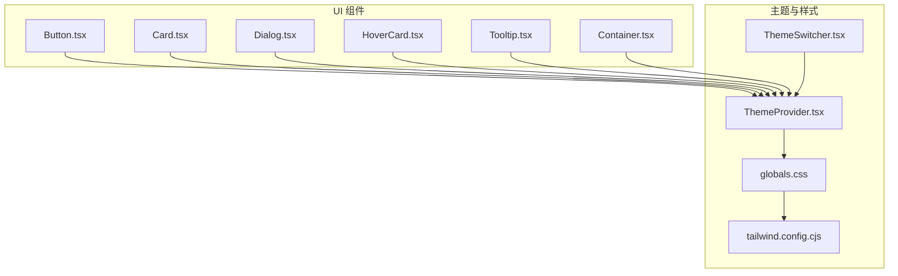
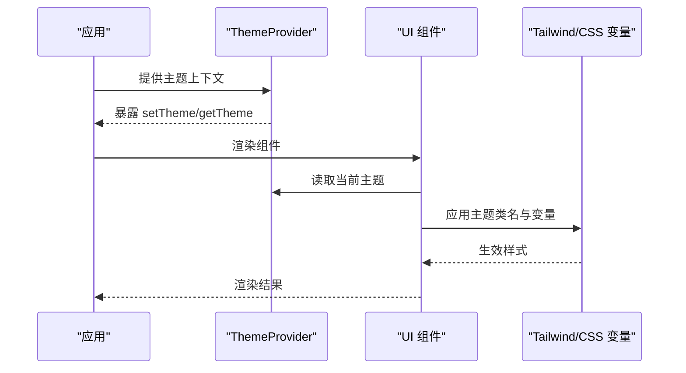
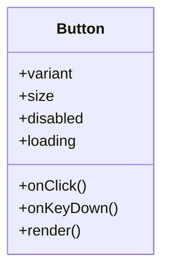
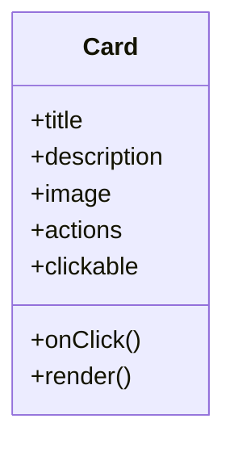
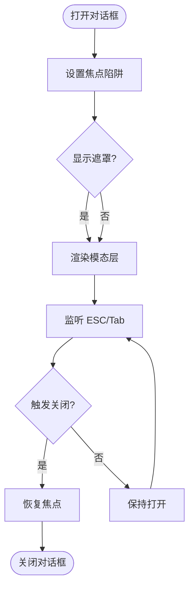
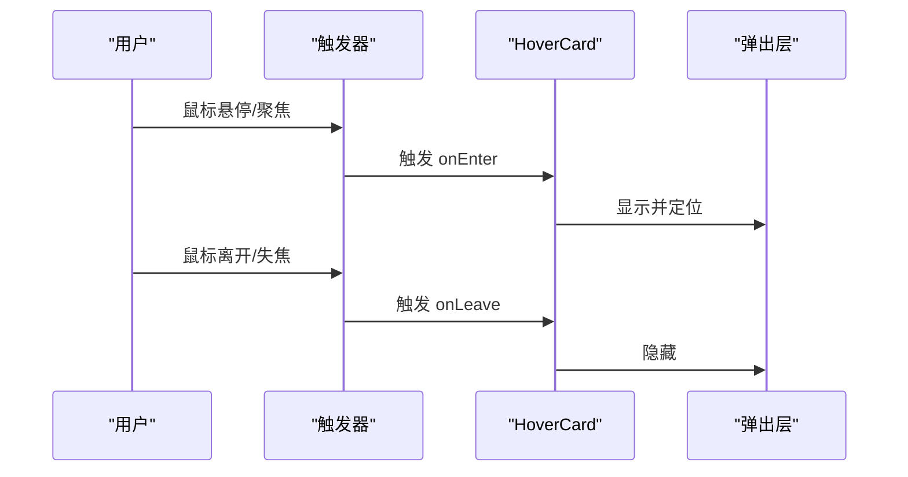
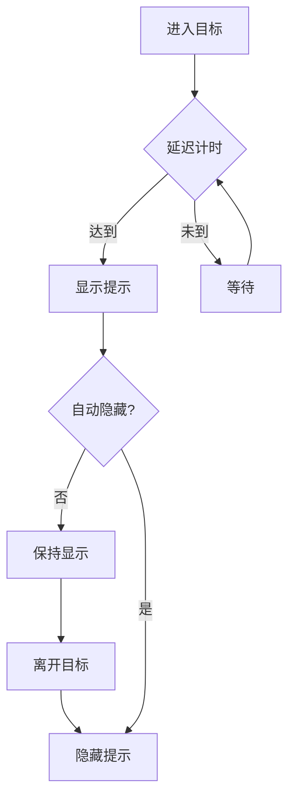
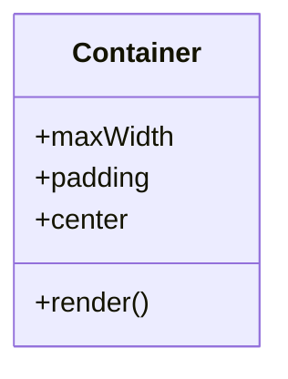
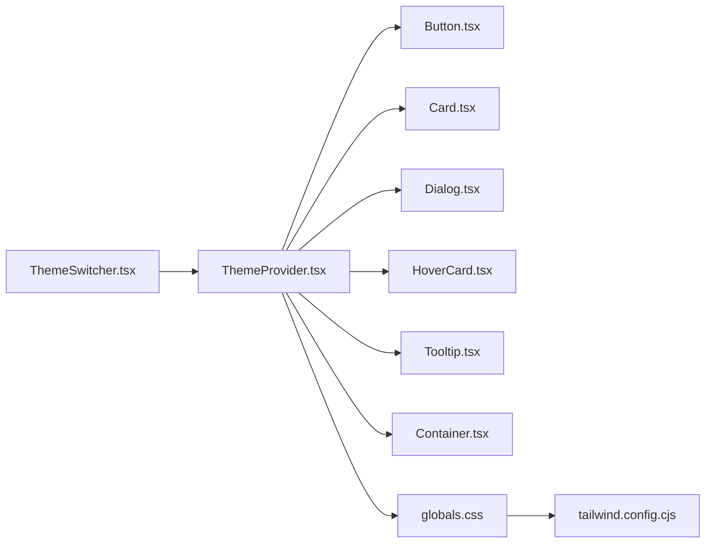

# UI 组件库

<cite>
**本文引用的文件**   
- [Button.tsx](file://components/ui/Button.tsx)
- [Card.tsx](file://components/ui/Card.tsx)
- [Dialog.tsx](file://components/ui/Dialog.tsx)
- [HoverCard.tsx](file://components/ui/HoverCard.tsx)
- [Tooltip.tsx](file://components/ui/Tooltip.tsx)
- [Container.tsx](file://components/ui/Container.tsx)
- [ThemeProvider.tsx](file://app/(main)/ThemeProvider.tsx)
- [ThemeSwitcher.tsx](file://app/(main)/ThemeSwitcher.tsx)
- [globals.css](file://app/globals.css)
- [tailwind.config.cjs](file://tailwind.config.cjs)
</cite>

## 目录
1. [简介](#简介)
2. [项目结构](#项目结构)
3. [核心组件](#核心组件)
4. [架构总览](#架构总览)
5. [详细组件分析](#详细组件分析)
6. [依赖关系分析](#依赖关系分析)
7. [性能考量](#性能考量)
8. [故障排查指南](#故障排查指南)
9. [结论](#结论)
10. [附录](#附录)

## 简介
本文件为 cali.so 项目的 UI 组件库文档，聚焦基础 UI 组件的设计原则、实现细节与使用模式。内容覆盖按钮、卡片、对话框、悬停卡片、工具提示等组件的属性配置、事件处理与样式定制；并说明响应式设计、可访问性支持与主题适配策略。文档提供组合模式、扩展方法与性能优化技巧，以及自定义主题、图标集成与动画效果的实践指导。

## 项目结构
UI 组件位于 components/ui 目录下，采用“按功能拆分”的组织方式：每个组件独立文件，便于复用与维护。全局样式与主题通过 app/globals.css 与 tailwind.config.cjs 管理，主题上下文由 app/(main)/ThemeProvider.tsx 提供，切换入口在 ThemeSwitcher.tsx。

图表来源
- [Button.tsx](file://components/ui/Button.tsx)
- [Card.tsx](file://components/ui/Card.tsx)
- [Dialog.tsx](file://components/ui/Dialog.tsx)
- [HoverCard.tsx](file://components/ui/HoverCard.tsx)
- [Tooltip.tsx](file://components/ui/Tooltip.tsx)
- [Container.tsx](file://components/ui/Container.tsx)
- [ThemeProvider.tsx](file://app/(main)/ThemeProvider.tsx)
- [ThemeSwitcher.tsx](file://app/(main)/ThemeSwitcher.tsx)
- [globals.css](file://app/globals.css)
- [tailwind.config.cjs](file://tailwind.config.cjs)

章节来源
- [Button.tsx](file://components/ui/Button.tsx)
- [Card.tsx](file://components/ui/Card.tsx)
- [Dialog.tsx](file://components/ui/Dialog.tsx)
- [HoverCard.tsx](file://components/ui/HoverCard.tsx)
- [Tooltip.tsx](file://components/ui/Tooltip.tsx)
- [Container.tsx](file://components/ui/Container.tsx)
- [ThemeProvider.tsx](file://app/(main)/ThemeProvider.tsx)
- [ThemeSwitcher.tsx](file://app/(main)/ThemeSwitcher.tsx)
- [globals.css](file://app/globals.css)
- [tailwind.config.cjs](file://tailwind.config.cjs)

## 核心组件
本节概述各组件的职责、属性约定、事件处理与样式定制要点，并提供最佳实践建议。

- 按钮 Button
  - 职责：触发操作的基础交互元素，支持多种视觉变体与尺寸。
  - 关键属性（示例）：类型 variant、尺寸 size、是否禁用 disabled、加载状态 loading、点击回调 onClick、额外类名 className。
  - 事件处理：onClick 中应进行表单校验或异步请求封装，避免重复提交。
  - 样式定制：通过 Tailwind 类名与 CSS 变量控制颜色、圆角、阴影与过渡。
  - 可访问性：确保键盘可达、焦点可见、ARIA 语义正确。
  - 组合模式：可与图标组合，形成带图标的按钮。
  - 性能：避免在渲染路径中进行昂贵计算，必要时 memo 化。

- 卡片 Card
  - 职责：承载一组相关内容的容器，常用于列表项或信息块。
  - 关键属性：标题 title、描述 description、图片 image、操作区 actions、是否可点击 clickable、点击回调 onClick、布局方向 direction、间距 spacing。
  - 样式定制：背景、边框、阴影、圆角、内边距可通过 props 或 className 调整。
  - 可访问性：若可点击，需具备 role="button" 与键盘事件支持。
  - 组合模式：与头像、标签、评分等子组件组合展示丰富信息。
  - 性能：大图懒加载，避免阻塞首屏。

- 对话框 Dialog
  - 职责：模态窗口用于确认、输入或展示重要信息。
  - 关键属性：打开状态 open、关闭回调 onClose、标题 title、内容 content、是否显示遮罩 showOverlay、阻止滚动 lockScroll、层级 zIndex。
  - 事件处理：ESC 关闭、点击遮罩关闭、焦点陷阱。
  - 样式定制：位置、尺寸、动画、阴影、圆角。
  - 可访问性：焦点管理、aria-modal、aria-labelledby、aria-describedby。
  - 组合模式：与表单、表格、富文本等组合。
  - 性能：按需渲染内容，避免不必要的重排。

- 悬停卡片 HoverCard
  - 职责：鼠标悬停时展示预览或补充信息。
  - 关键属性：触发器 trigger、弹出内容 popover、定位策略 placement、延迟 delay、是否跟随滚动 followScroll。
  - 事件处理：mouseenter/mouseleave、focus、blur。
  - 样式定制：背景、边框、阴影、圆角、过渡动画。
  - 可访问性：对键盘用户提供 hover 替代方案。
  - 性能：节流/防抖，避免频繁重绘。

- 工具提示 Tooltip
  - 职责：轻量提示文本，提升可用性。
  - 关键属性：文本 text、触发器 target、定位 placement、延迟 delay、是否自动隐藏 autoHide。
  - 事件处理：hover/focus 显示，离开隐藏。
  - 样式定制：字体大小、行高、背景色、圆角、阴影。
  - 可访问性：aria-label、role="tooltip"。
  - 性能：小体积 DOM，避免复杂嵌套。

- 容器 Container
  - 职责：统一页面内容宽度与对齐，提供响应式断点。
  - 关键属性：最大宽度 maxWidth、内边距 padding、水平居中 center。
  - 样式定制：通过 Tailwind 断点与间距系统。
  - 可访问性：合理字号与对比度。
  - 组合模式：包裹页面主体区域。

章节来源
- [Button.tsx](file://components/ui/Button.tsx)
- [Card.tsx](file://components/ui/Card.tsx)
- [Dialog.tsx](file://components/ui/Dialog.tsx)
- [HoverCard.tsx](file://components/ui/HoverCard.tsx)
- [Tooltip.tsx](file://components/ui/Tooltip.tsx)
- [Container.tsx](file://components/ui/Container.tsx)

## 架构总览
UI 组件以 React 函数组件为主，遵循“单一职责、最小 API、组合优先”的原则。主题通过 Context 注入，组件内部读取主题值并映射到 Tailwind 类名与 CSS 变量。全局样式集中在 globals.css，设计令牌（颜色、圆角、阴影、动效）在 tailwind.config.cjs 中定义。

图表来源
- [ThemeProvider.tsx](file://app/(main)/ThemeProvider.tsx)
- [globals.css](file://app/globals.css)
- [tailwind.config.cjs](file://tailwind.config.cjs)

## 详细组件分析

### 按钮 Button
- 设计原则
  - 清晰反馈：hover、active、disabled、loading 状态明确。
  - 一致性：统一的色彩体系、尺寸与圆角。
  - 可访问性：键盘可达、焦点可见、语义正确。
- 属性与事件
  - 属性：variant、size、disabled、loading、className、children。
  - 事件：onClick、onKeyDown（Enter/Space）。
- 样式定制
  - 通过 Tailwind 类名与 CSS 变量控制主色、强调色、中性色。
  - 过渡动画使用 ease-out，时长适中。
- 组合与扩展
  - 与图标组合：左/右图标插槽。
  - 扩展：添加 ghost、outline、danger 等变体。
- 性能
  - 避免在 onClick 中执行同步耗时任务。
  - 大列表中使用 key 稳定且唯一。

图表来源
- [Button.tsx](file://components/ui/Button.tsx)

章节来源
- [Button.tsx](file://components/ui/Button.tsx)

### 卡片 Card
- 设计原则
  - 信息层次：标题 > 描述 > 操作区。
  - 留白与呼吸感：合理的内边距与间距。
  - 可点击卡片：具备按钮语义与键盘行为。
- 属性与事件
  - 属性：title、description、image、actions、clickable、onClick、direction、spacing、className。
  - 事件：onClick、onKeyDown。
- 样式定制
  - 背景、边框、阴影、圆角、图片圆角与比例。
  - 响应式：移动端单列、桌面端多列网格。
- 组合与扩展
  - 与标签、评分、时间戳组合。
  - 扩展：增加骨架屏占位。
- 性能
  - 图片懒加载与占位图。
  - 列表虚拟化（大数据量场景）。

图表来源
- [Card.tsx](file://components/ui/Card.tsx)

章节来源
- [Card.tsx](file://components/ui/Card.tsx)

### 对话框 Dialog
- 设计原则
  - 明确意图：标题与内容简洁明了。
  - 安全退出：ESC、遮罩点击、返回键均可关闭。
  - 焦点管理：打开时聚焦首个可交互元素，关闭后恢复。
- 属性与事件
  - 属性：open、onClose、title、content、showOverlay、lockScroll、zIndex、className。
  - 事件：onOpenChange、onClose、onKeyDown。
- 样式定制
  - 位置（居中/顶部/底部）、尺寸（sm/md/lg）、动画（淡入/缩放）。
- 组合与扩展
  - 与表单、表格、富文本组合。
  - 扩展：全屏模式、分步向导。
- 性能
  - 按需渲染内容，避免初始挂载重型组件。
  - 使用 portal 渲染，减少层级影响。

图表来源
- [Dialog.tsx](file://components/ui/Dialog.tsx)

章节来源
- [Dialog.tsx](file://components/ui/Dialog.tsx)

### 悬停卡片 HoverCard
- 设计原则
  - 非侵入：仅在需要时出现，不遮挡主要内容。
  - 快速反馈：进入/离开延迟合理，避免闪烁。
- 属性与事件
  - 属性：trigger、popover、placement、delay、followScroll、className。
  - 事件：onMouseEnter、onMouseLeave、onFocus、onBlur。
- 样式定制
  - 背景、边框、阴影、圆角、过渡动画。
- 组合与扩展
  - 与链接、缩略图、用户头像组合。
  - 扩展：支持箭头指向、距离偏移。
- 性能
  - 节流/防抖，避免频繁重绘。
  - 使用 transform 与 opacity 做动画，避免布局抖动。

图表来源
- [HoverCard.tsx](file://components/ui/HoverCard.tsx)

章节来源
- [HoverCard.tsx](file://components/ui/HoverCard.tsx)

### 工具提示 Tooltip
- 设计原则
  - 简洁：仅展示必要信息。
  - 一致：统一的字体、行高与配色。
- 属性与事件
  - 属性：text、target、placement、delay、autoHide、className。
  - 事件：onShow、onHide。
- 样式定制
  - 背景、文字颜色、圆角、阴影、过渡。
- 组合与扩展
  - 与按钮、链接、图标组合。
  - 扩展：支持富文本与多行。
- 性能
  - 轻量 DOM，避免复杂嵌套。
  - 使用 requestAnimationFrame 优化定位。

图表来源
- [Tooltip.tsx](file://components/ui/Tooltip.tsx)

章节来源
- [Tooltip.tsx](file://components/ui/Tooltip.tsx)

### 容器 Container
- 设计原则
  - 统一宽度：在不同屏幕下保持一致的可视宽度。
  - 居中对齐：左右留白均衡。
- 属性与事件
  - 属性：maxWidth、padding、center、className。
- 样式定制
  - 通过 Tailwind 断点控制不同设备的宽度与间距。
- 组合与扩展
  - 作为页面主体区域的根容器。
  - 扩展：侧边栏、导航栏的容器。

图表来源
- [Container.tsx](file://components/ui/Container.tsx)

章节来源
- [Container.tsx](file://components/ui/Container.tsx)

## 依赖关系分析
- 组件间耦合
  - 低耦合：各组件独立，通过 props 通信。
  - 组合优先：复杂界面通过组合多个基础组件构建。
- 外部依赖
  - Tailwind CSS：样式原子化与主题映射。
  - CSS 变量：主题色、圆角、阴影、动效参数集中管理。
- 主题上下文
  - ThemeProvider 提供主题值，组件消费该值并映射到样式。
  - ThemeSwitcher 提供切换入口，更新主题状态。

图表来源
- [ThemeProvider.tsx](file://app/(main)/ThemeProvider.tsx)
- [ThemeSwitcher.tsx](file://app/(main)/ThemeSwitcher.tsx)
- [Button.tsx](file://components/ui/Button.tsx)
- [Card.tsx](file://components/ui/Card.tsx)
- [Dialog.tsx](file://components/ui/Dialog.tsx)
- [HoverCard.tsx](file://components/ui/HoverCard.tsx)
- [Tooltip.tsx](file://components/ui/Tooltip.tsx)
- [Container.tsx](file://components/ui/Container.tsx)
- [globals.css](file://app/globals.css)
- [tailwind.config.cjs](file://tailwind.config.cjs)

章节来源
- [ThemeProvider.tsx](file://app/(main)/ThemeProvider.tsx)
- [ThemeSwitcher.tsx](file://app/(main)/ThemeSwitcher.tsx)
- [globals.css](file://app/globals.css)
- [tailwind.config.cjs](file://tailwind.config.cjs)

## 性能考量
- 渲染优化
  - 使用 React.memo 包裹纯展示组件，减少不必要重渲染。
  - 列表虚拟化（长列表）与分页加载。
- 样式与动画
  - 使用 transform 与 opacity 做动画，避免布局抖动。
  - 限制动画复杂度与持续时间，保证流畅度。
- 资源加载
  - 图片懒加载与占位图，CDN 加速。
  - 按需引入第三方库，避免打包体积过大。
- 交互优化
  - 防抖/节流：搜索、滚动、悬停等高频事件。
  - 避免在 onClick 中执行同步耗时任务，使用异步与乐观更新。

[本节为通用性能建议，无需特定文件引用]

## 故障排查指南
- 主题未生效
  - 检查 ThemeProvider 是否在应用树顶层。
  - 确认 CSS 变量与 Tailwind 配置是否正确映射。
  - 查看浏览器开发者工具的样式面板，确认类名与变量值。
- 对话框焦点丢失
  - 确认焦点陷阱逻辑与 ESC 关闭事件绑定。
  - 检查 aria-modal、aria-labelledby、aria-describedby 是否设置。
- 悬停/提示错位
  - 检查定位策略与父级 transform/overflow 的影响。
  - 使用调试工具测量边界与偏移。
- 样式冲突
  - 检查 Tailwind 优先级与自定义 CSS 覆盖顺序。
  - 避免过度使用 !important，尽量通过类名组合解决。

章节来源
- [ThemeProvider.tsx](file://app/(main)/ThemeProvider.tsx)
- [Dialog.tsx](file://components/ui/Dialog.tsx)
- [HoverCard.tsx](file://components/ui/HoverCard.tsx)
- [Tooltip.tsx](file://components/ui/Tooltip.tsx)
- [globals.css](file://app/globals.css)
- [tailwind.config.cjs](file://tailwind.config.cjs)

## 结论
本 UI 组件库以 React 函数组件为核心，结合 Tailwind CSS 与 CSS 变量实现主题化与样式原子化。组件遵循可访问性与响应式设计原则，通过组合模式构建复杂界面。建议在项目中统一使用这些基础组件，并通过主题配置与扩展方法满足业务需求。

[本节为总结性内容，无需特定文件引用]

## 附录

### 主题与样式定制
- 主题上下文
  - 在应用根节点提供 ThemeProvider，确保所有组件可读取主题。
  - 使用 ThemeSwitcher 切换主题，更新全局状态。
- 设计令牌
  - 在 tailwind.config.cjs 中定义颜色、圆角、阴影、动效等令牌。
  - 在 globals.css 中声明 CSS 变量，供组件直接消费。
- 自定义主题
  - 新增主题色板与暗色模式映射。
  - 扩展组件默认样式，保持风格一致。

章节来源
- [ThemeProvider.tsx](file://app/(main)/ThemeProvider.tsx)
- [ThemeSwitcher.tsx](file://app/(main)/ThemeSwitcher.tsx)
- [globals.css](file://app/globals.css)
- [tailwind.config.cjs](file://tailwind.config.cjs)

### 图标集成
- 将 SVG 图标封装为 React 组件，统一命名与尺寸。
- 在按钮、卡片、工具提示等组件中通过插槽或属性传入图标。
- 使用 Tailwind 控制图标颜色与大小，确保与主题一致。

[本节为通用实践，无需特定文件引用]

### 动画效果
- 使用 CSS 过渡与关键帧，避免 JS 动画带来的性能问题。
- 为交互状态（hover、active、loading）添加微动画，提升反馈感。
- 控制动画时长与缓动函数，保持整体节奏一致。

[本节为通用实践，无需特定文件引用]