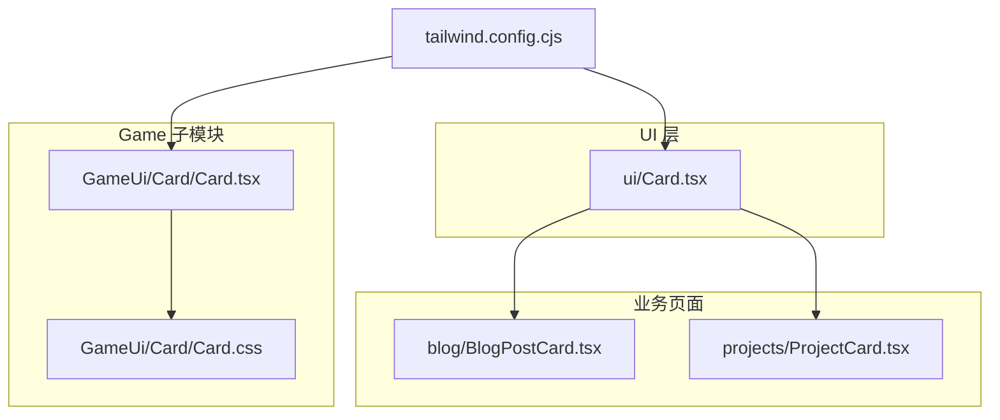
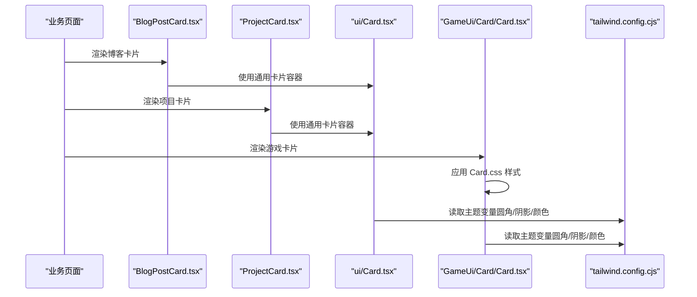
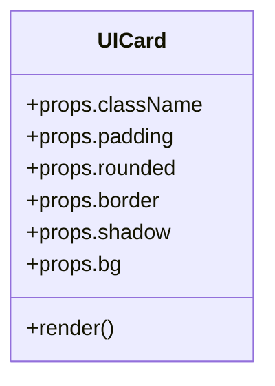
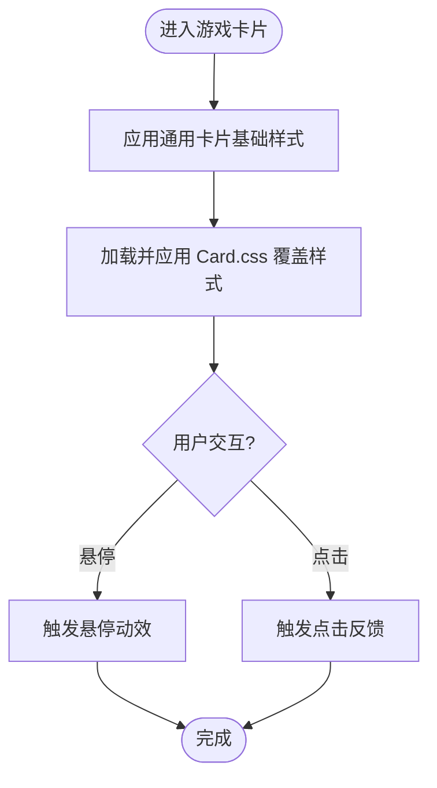
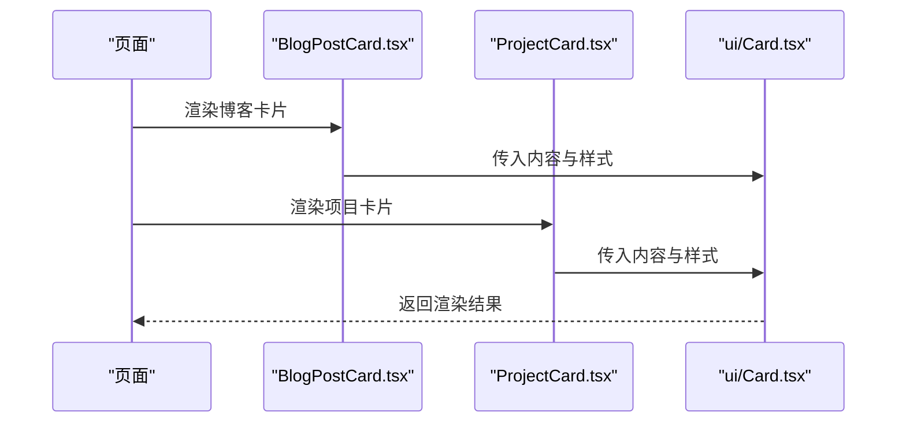
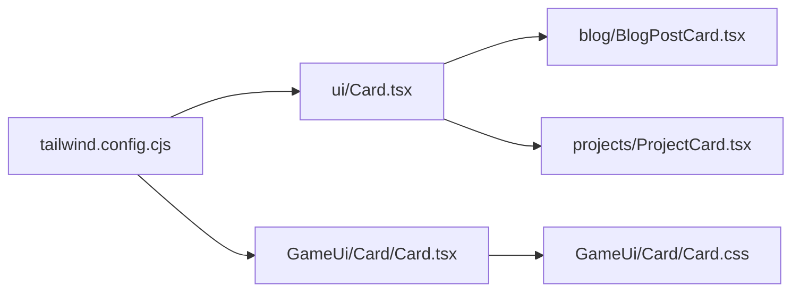

# 卡片组件 (Card)

<cite>
**本文引用的文件**   
- [components/ui/Card.tsx](file://components/ui/Card.tsx)
- [components/GameUi/Card/Card.tsx](file://components/GameUi/Card/Card.tsx)
- [components/GameUi/Card/Card.css](file://components/GameUi/Card/Card.css)
- [app/(main)/blog/BlogPostCard.tsx](file://app/(main)/blog/BlogPostCard.tsx)
- [app/(main)/projects/ProjectCard.tsx](file://app/(main)/projects/ProjectCard.tsx)
- [tailwind.config.cjs](file://tailwind.config.cjs)
</cite>

## 目录
1. [简介](#简介)
2. [项目结构](#项目结构)
3. [核心组件](#核心组件)
4. [架构总览](#架构总览)
5. [详细组件分析](#详细组件分析)
6. [依赖分析](#依赖分析)
7. [性能考虑](#性能考虑)
8. [故障排查指南](#故障排查指南)
9. [结论](#结论)
10. [附录](#附录)

## 简介
本文件为 cali.so 项目的“卡片组件（Card）”提供系统化文档，覆盖设计原则、实现细节、使用模式与最佳实践。重点说明：
- 布局结构与内容区域划分
- 边框样式配置（圆角、边框宽度与颜色）
- 阴影效果与背景色定制
- 内边距控制与间距系统
- 组合模式、嵌套使用与响应式适配
- 自定义样式、动画效果与可访问性支持

## 项目结构
本项目包含两套 Card 相关实现：
- 通用 UI 层卡片：位于 components/ui/Card.tsx，面向全站通用场景
- 游戏子模块卡片：位于 components/GameUi/Card/Card.tsx + Card.css，用于游戏页面内的卡片展示

此外，业务页面通过 BlogPostCard.tsx 与 ProjectCard.tsx 等组合使用这些基础卡片能力。

图表来源
- [components/ui/Card.tsx](file://components/ui/Card.tsx)
- [components/GameUi/Card/Card.tsx](file://components/GameUi/Card/Card.tsx)
- [components/GameUi/Card/Card.css](file://components/GameUi/Card/Card.css)
- [app/(main)/blog/BlogPostCard.tsx](file://app/(main)/blog/BlogPostCard.tsx)
- [app/(main)/projects/ProjectCard.tsx](file://app/(main)/projects/ProjectCard.tsx)
- [tailwind.config.cjs](file://tailwind.config.cjs)

章节来源
- [components/ui/Card.tsx](file://components/ui/Card.tsx)
- [components/GameUi/Card/Card.tsx](file://components/GameUi/Card/Card.tsx)
- [components/GameUi/Card/Card.css](file://components/GameUi/Card/Card.css)
- [app/(main)/blog/BlogPostCard.tsx](file://app/(main)/blog/BlogPostCard.tsx)
- [app/(main)/projects/ProjectCard.tsx](file://app/(main)/projects/ProjectCard.tsx)
- [tailwind.config.cjs](file://tailwind.config.cjs)

## 核心组件
- 通用 UI 卡片（components/ui/Card.tsx）
  - 职责：提供统一的容器语义、基础视觉风格（圆角、边框、阴影、背景）、内边距与交互态（如悬停）
  - 扩展点：通过 className 透传以覆盖默认样式；结合 Tailwind 工具类进行主题化
- 游戏卡片（components/GameUi/Card/Card.tsx + Card.css）
  - 职责：在游戏场景下复用卡片容器能力，并通过独立 CSS 文件强化或差异化样式
  - 扩展点：在 CSS 中定义游戏专属的阴影、边框、背景渐变等

章节来源
- [components/ui/Card.tsx](file://components/ui/Card.tsx)
- [components/GameUi/Card/Card.tsx](file://components/GameUi/Card/Card.tsx)
- [components/GameUi/Card/Card.css](file://components/GameUi/Card/Card.css)

## 架构总览
从调用关系看，业务页面通过组合基础卡片能力构建更复杂的卡片视图。Tailwind 配置提供全局主题变量（如圆角、阴影、颜色），被各卡片组件消费。

图表来源
- [app/(main)/blog/BlogPostCard.tsx](file://app/(main)/blog/BlogPostCard.tsx)
- [app/(main)/projects/ProjectCard.tsx](file://app/(main)/projects/ProjectCard.tsx)
- [components/ui/Card.tsx](file://components/ui/Card.tsx)
- [components/GameUi/Card/Card.tsx](file://components/GameUi/Card/Card.tsx)
- [tailwind.config.cjs](file://tailwind.config.cjs)

## 详细组件分析

### 通用 UI 卡片（components/ui/Card.tsx）
- 设计原则
  - 容器语义清晰：作为内容块级容器，承载标题、正文、操作区等
  - 视觉一致性：统一圆角、边框、阴影与背景，确保全站一致体验
  - 可扩展性：通过 props/className 暴露样式覆盖点，避免硬编码
- 布局结构
  - 外层容器：负责整体尺寸、圆角、边框、阴影、背景与内边距
  - 内容区域：由父组件传入的子节点构成，建议按“头部/主体/底部”三段式组织
- 边框与圆角
  - 圆角：通过主题变量或 Tailwind 工具类设置，保证在不同屏幕下的可读性与美观度
  - 边框：提供可选边框开关与粗细、颜色配置，便于区分层级
- 阴影与背景
  - 阴影：默认轻量阴影，悬停时可增强以提升交互反馈
  - 背景：支持浅色/深色主题切换，必要时提供半透明或渐变背景
- 内边距控制
  - 提供紧凑/标准/宽松三种内边距档位，适配不同密度信息展示
- 交互与可访问性
  - 悬停态：提升阴影或边框强调
  - 焦点可见：确保键盘导航时焦点环清晰
  - 语义标签：使用合适的容器元素，必要时添加 aria-* 属性

图表来源
- [components/ui/Card.tsx](file://components/ui/Card.tsx)

章节来源
- [components/ui/Card.tsx](file://components/ui/Card.tsx)

### 游戏卡片（components/GameUi/Card/Card.tsx + Card.css）
- 设计原则
  - 复用通用卡片能力，同时满足游戏场景的视觉差异
  - 将游戏专属样式与逻辑解耦到独立 CSS 文件，便于维护
- 布局结构
  - 沿用通用卡片的三段式结构，但可根据游戏内容调整比例与留白
- 样式策略
  - 通过 Card.css 覆盖或增强默认样式（如更强的阴影、霓虹边框、动态背景）
  - 利用 Tailwind 变量保持与全局主题的一致性
- 交互与动效
  - 悬停放大、发光边框、入场动画等，注意性能与可访问性（减少重排重绘）

图表来源
- [components/GameUi/Card/Card.tsx](file://components/GameUi/Card/Card.tsx)
- [components/GameUi/Card/Card.css](file://components/GameUi/Card/Card.css)

章节来源
- [components/GameUi/Card/Card.tsx](file://components/GameUi/Card/Card.tsx)
- [components/GameUi/Card/Card.css](file://components/GameUi/Card/Card.css)

### 业务卡片组合示例
- 博客卡片（app/(main)/blog/BlogPostCard.tsx）
  - 组合方式：基于通用卡片容器，嵌入文章摘要、封面图、标签与阅读时长等信息
  - 响应式：在小屏上减少内边距与字号，在大屏上增加留白与信息密度
- 项目卡片（app/(main)/projects/ProjectCard.tsx）
  - 组合方式：展示项目名称、描述、技术栈与外部链接
  - 交互：悬停高亮、点击跳转详情

图表来源
- [app/(main)/blog/BlogPostCard.tsx](file://app/(main)/blog/BlogPostCard.tsx)
- [app/(main)/projects/ProjectCard.tsx](file://app/(main)/projects/ProjectCard.tsx)
- [components/ui/Card.tsx](file://components/ui/Card.tsx)

章节来源
- [app/(main)/blog/BlogPostCard.tsx](file://app/(main)/blog/BlogPostCard.tsx)
- [app/(main)/projects/ProjectCard.tsx](file://app/(main)/projects/ProjectCard.tsx)
- [components/ui/Card.tsx](file://components/ui/Card.tsx)

## 依赖分析
- 主题依赖
  - tailwind.config.cjs 提供圆角、阴影、颜色等主题变量，被 ui/Card.tsx 与 GameUi/Card 共同消费
- 组件耦合
  - 业务卡片对通用卡片存在弱耦合（仅通过 props/className 传递样式与内容）
  - 游戏卡片对 Card.css 强耦合，但通过文件名与路径明确边界，易于替换与维护

图表来源
- [tailwind.config.cjs](file://tailwind.config.cjs)
- [components/ui/Card.tsx](file://components/ui/Card.tsx)
- [components/GameUi/Card/Card.tsx](file://components/GameUi/Card/Card.tsx)
- [components/GameUi/Card/Card.css](file://components/GameUi/Card/Card.css)
- [app/(main)/blog/BlogPostCard.tsx](file://app/(main)/blog/BlogPostCard.tsx)
- [app/(main)/projects/ProjectCard.tsx](file://app/(main)/projects/ProjectCard.tsx)

章节来源
- [tailwind.config.cjs](file://tailwind.config.cjs)
- [components/ui/Card.tsx](file://components/ui/Card.tsx)
- [components/GameUi/Card/Card.tsx](file://components/GameUi/Card/Card.tsx)
- [components/GameUi/Card/Card.css](file://components/GameUi/Card/Card.css)
- [app/(main)/blog/BlogPostCard.tsx](file://app/(main)/blog/BlogPostCard.tsx)
- [app/(main)/projects/ProjectCard.tsx](file://app/(main)/projects/ProjectCard.tsx)

## 性能考虑
- 避免过度阴影与复杂渐变，尤其在移动端，可减少 GPU 压力
- 合理使用 will-change 与 transform 提升动画性能，避免频繁触发布局
- 图片与媒体资源懒加载，降低首屏渲染时间
- 卡片列表采用虚拟滚动或分页，避免一次性渲染过多 DOM

[本节为通用指导，不直接分析具体文件]

## 故障排查指南
- 样式未生效
  - 检查是否被更高优先级的 className 覆盖
  - 确认 Tailwind 配置已正确引入且未被缓存干扰
- 阴影/圆角异常
  - 核对主题变量是否正确定义
  - 检查父容器 overflow 是否裁剪了阴影或圆角
- 交互无反馈
  - 确认事件绑定与状态更新逻辑
  - 检查焦点环与键盘可达性是否符合预期
- 游戏卡片样式错乱
  - 定位 Card.css 中的覆盖规则是否与通用样式冲突
  - 使用浏览器开发者工具逐条排查样式优先级

章节来源
- [components/GameUi/Card/Card.css](file://components/GameUi/Card/Card.css)
- [tailwind.config.cjs](file://tailwind.config.cjs)

## 结论
通用 UI 卡片与游戏卡片共同构成了 cali.so 的卡片体系。通过主题化与组合模式，既保证了全站一致的视觉语言，又满足了特定场景的差异化需求。遵循本文的设计原则与实践建议，可在保持可维护性的同时快速迭代卡片样式与交互。

[本节为总结性内容，不直接分析具体文件]

## 附录

### 使用模式与最佳实践
- 组合模式
  - 将卡片拆分为“头部/主体/底部”，便于复用与测试
  - 通过 props 控制显示/隐藏区块，避免条件渲染导致的样式不一致
- 嵌套使用
  - 卡片内再嵌套卡片时，注意层级阴影与边框的对比度，避免视觉混乱
- 响应式适配
  - 小屏减少内边距与字号，大屏增加留白与信息密度
  - 使用 Tailwind 断点控制布局与间距
- 自定义样式
  - 优先通过 className 与 Tailwind 工具类覆盖默认样式
  - 仅在必要时编写局部 CSS，并保持命名空间清晰
- 动画效果
  - 使用 transform 与 opacity 做过渡，避免触发布局抖动
  - 为动画提供 prefers-reduced-motion 降级方案
- 可访问性
  - 为可交互卡片添加 role="button" 与 tabindex="0"
  - 确保焦点可见，并提供足够的对比度

[本节为通用指导，不直接分析具体文件]