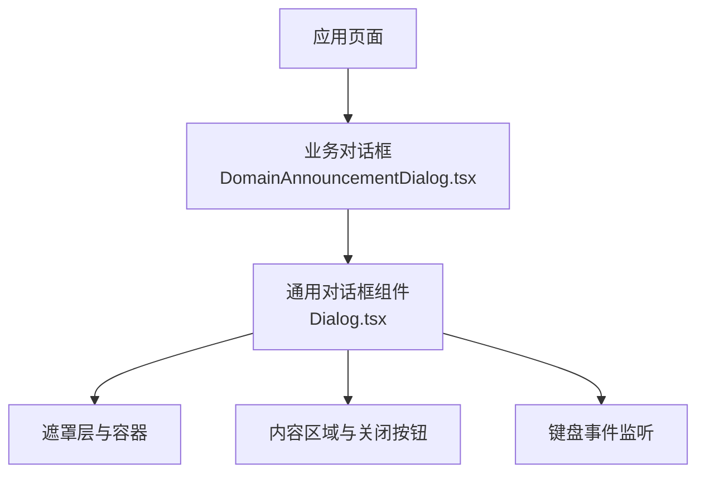
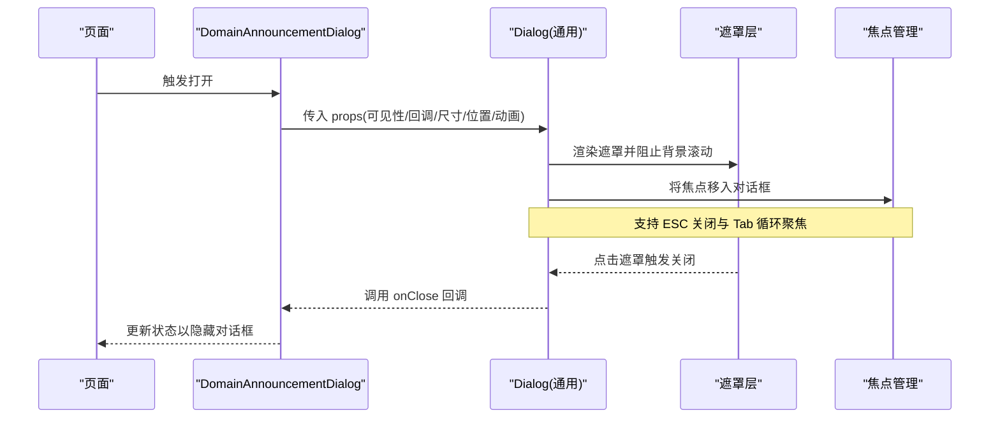
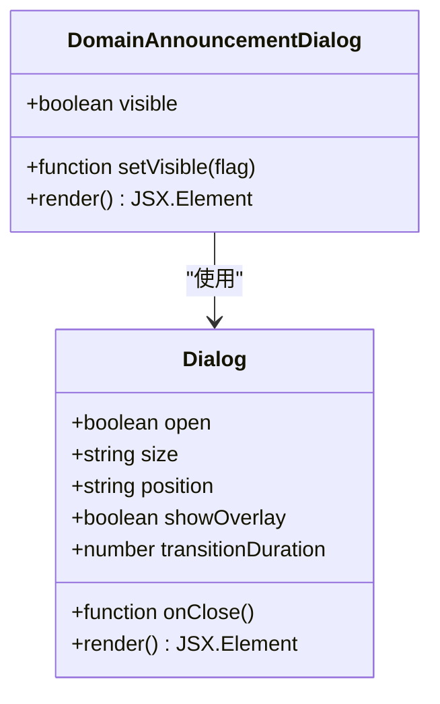
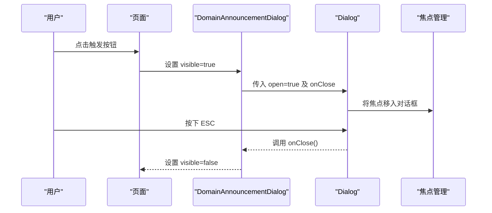
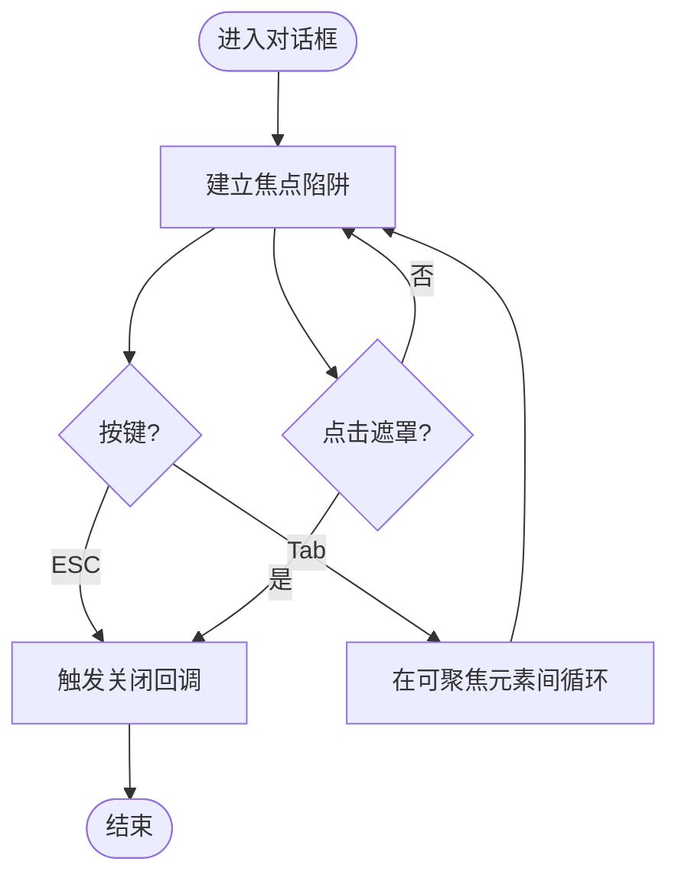
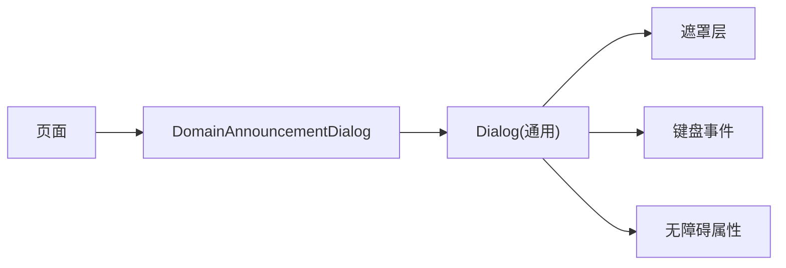

# 对话框组件 (Dialog)

<cite>
**本文引用的文件**   
- [components/ui/Dialog.tsx](file://components/ui/Dialog.tsx)
- [components/DomainAnnouncementDialog.tsx](file://components/DomainAnnouncementDialog.tsx)
</cite>

## 目录
1. [简介](#简介)
2. [项目结构](#项目结构)
3. [核心组件](#核心组件)
4. [架构总览](#架构总览)
5. [详细组件分析](#详细组件分析)
6. [依赖分析](#依赖分析)
7. [性能考虑](#性能考虑)
8. [故障排查指南](#故障排查指南)
9. [结论](#结论)
10. [附录](#附录)

## 简介
本文件为 cali.so 项目的对话框组件（Dialog）提供系统化文档，覆盖设计原则、实现细节与使用模式。重点说明：
- 触发方式与显示/隐藏逻辑
- 遮罩层处理与模态行为管理
- 尺寸配置、位置定位、动画过渡
- 键盘导航与焦点陷阱
- 嵌套使用与最佳实践
- 自定义样式、响应式设计与无障碍访问

## 项目结构
对话框相关代码位于 components 目录下，包含通用 UI 组件与业务示例组件：
- 通用对话框组件：components/ui/Dialog.tsx
- 业务示例：components/DomainAnnouncementDialog.tsx

图表来源
- [components/ui/Dialog.tsx](file://components/ui/Dialog.tsx)
- [components/DomainAnnouncementDialog.tsx](file://components/DomainAnnouncementDialog.tsx)

章节来源
- [components/ui/Dialog.tsx](file://components/ui/Dialog.tsx)
- [components/DomainAnnouncementDialog.tsx](file://components/DomainAnnouncementDialog.tsx)

## 核心组件
- Dialog.tsx：通用对话框实现，负责渲染遮罩、内容容器、关闭交互、键盘事件与可访问性属性。
- DomainAnnouncementDialog.tsx：基于通用 Dialog 的业务封装，演示如何组合尺寸、位置、动画与主题等特性。

章节来源
- [components/ui/Dialog.tsx](file://components/ui/Dialog.tsx)
- [components/DomainAnnouncementDialog.tsx](file://components/DomainAnnouncementDialog.tsx)

## 架构总览
下图展示从页面到对话框的调用关系与数据流：

图表来源
- [components/ui/Dialog.tsx](file://components/ui/Dialog.tsx)
- [components/DomainAnnouncementDialog.tsx](file://components/DomainAnnouncementDialog.tsx)

## 详细组件分析

### 通用对话框组件（Dialog.tsx）
职责与能力
- 渲染遮罩层与对话框容器，控制显示/隐藏
- 处理点击遮罩关闭、ESC 键关闭
- 管理焦点陷阱，确保 Tab 在对话框内循环
- 提供尺寸、位置、动画、可访问性等配置项
- 通过受控或半受控方式暴露 open/onClose 接口

关键实现要点
- 遮罩层：全屏覆盖，点击时触发关闭；必要时阻止背景滚动
- 内容区：居中或按位置配置对齐，支持最大宽度与响应式适配
- 动画：进入/退出过渡，避免布局抖动
- 键盘：捕获 ESC 关闭；Tab 在可聚焦元素间循环
- 无障碍：设置 role="dialog"、aria-modal、aria-labelledby 等属性

使用建议
- 始终提供明确的关闭入口（关闭按钮、遮罩点击、ESC）
- 对复杂表单或长内容，启用滚动锁定与合适的最大高度
- 为标题区域设置 aria-labelledby，提升屏幕阅读器体验

章节来源
- [components/ui/Dialog.tsx](file://components/ui/Dialog.tsx)

### 业务对话框（DomainAnnouncementDialog.tsx）
职责与能力
- 作为通用 Dialog 的示例封装，演示常用配置组合
- 根据业务需求设定默认尺寸、位置、动画与文案
- 在页面中按需触发显示，并通过回调同步状态

典型用法
- 在页面中维护一个布尔状态控制是否显示
- 将 open/onClose 透传给通用 Dialog
- 通过 props 调整尺寸、位置与动画时长

章节来源
- [components/DomainAnnouncementDialog.tsx](file://components/DomainAnnouncementDialog.tsx)

### 类图（组件关系）

图表来源
- [components/ui/Dialog.tsx](file://components/ui/Dialog.tsx)
- [components/DomainAnnouncementDialog.tsx](file://components/DomainAnnouncementDialog.tsx)

### 序列图（打开/关闭流程）

图表来源
- [components/ui/Dialog.tsx](file://components/ui/Dialog.tsx)
- [components/DomainAnnouncementDialog.tsx](file://components/DomainAnnouncementDialog.tsx)

### 流程图（键盘与遮罩交互）

图表来源
- [components/ui/Dialog.tsx](file://components/ui/Dialog.tsx)

## 依赖分析
- 组件耦合
  - 业务对话框依赖通用对话框，形成“封装+复用”的层次结构
  - 通用对话框内部关注交互与可访问性，尽量保持低耦合
- 外部依赖
  - 若使用第三方库（如 Radix UI），应遵循其 API 约定与无障碍规范
  - 若自实现，需自行保证键盘与焦点行为符合 WCAG 要求

图表来源
- [components/ui/Dialog.tsx](file://components/ui/Dialog.tsx)
- [components/DomainAnnouncementDialog.tsx](file://components/DomainAnnouncementDialog.tsx)

章节来源
- [components/ui/Dialog.tsx](file://components/ui/Dialog.tsx)
- [components/DomainAnnouncementDialog.tsx](file://components/DomainAnnouncementDialog.tsx)

## 性能考虑
- 延迟渲染：仅在需要时挂载对话框 DOM，减少首屏负担
- 动画优化：使用 GPU 加速的 transform/opacity 过渡，避免重排
- 滚动锁定：仅在对话框打开时禁用背景滚动，关闭后恢复
- 事件去抖：频繁开关场景下合并状态更新，避免多余重渲染

## 故障排查指南
常见问题与定位思路
- 无法关闭
  - 检查 onClose 是否正确透传与执行
  - 确认 ESC 事件是否被上层拦截
- 焦点丢失
  - 验证焦点陷阱是否生效，Tab 是否在对话框内循环
  - 检查动态插入的可聚焦元素是否纳入陷阱范围
- 遮罩不生效
  - 确认遮罩层级 z-index 高于页面内容
  - 检查点击事件冒泡是否被阻止
- 动画卡顿
  - 避免在动画期间进行大量计算或布局变更
  - 优先使用 transform/opacity 过渡

章节来源
- [components/ui/Dialog.tsx](file://components/ui/Dialog.tsx)
- [components/DomainAnnouncementDialog.tsx](file://components/DomainAnnouncementDialog.tsx)

## 结论
通用对话框组件提供了稳定的基础能力（遮罩、关闭、焦点陷阱、可访问性），业务对话框在此基础上进行配置化封装，便于在不同页面快速复用。遵循本文的使用建议与最佳实践，可获得一致的用户体验与良好的无障碍支持。

## 附录

### 使用示例与最佳实践
- 基本用法
  - 在页面中维护 open 状态，将 open/onClose 传递给通用对话框
  - 为标题区域设置 aria-labelledby，提升可读性
- 尺寸与位置
  - 小屏设备使用全宽或近全宽，大屏设备限制最大宽度
  - 根据内容类型选择居中或靠边定位
- 动画过渡
  - 使用短促平滑的进入/退出动画，避免过长等待
- 键盘导航
  - 确保 ESC 可关闭，Tab 在对话框内循环
- 嵌套对话框
  - 谨慎使用多层级对话框，必要时使用 Portal 或独立实例管理
- 自定义样式
  - 通过 className 或主题变量覆盖默认样式，保持与设计系统一致
- 响应式设计
  - 结合断点与容器查询，适配不同屏幕尺寸
- 无障碍访问
  - 设置 role="dialog"、aria-modal、aria-labelledby、aria-describedby 等属性
  - 确保颜色对比度与键盘可达性

章节来源
- [components/ui/Dialog.tsx](file://components/ui/Dialog.tsx)
- [components/DomainAnnouncementDialog.tsx](file://components/DomainAnnouncementDialog.tsx)