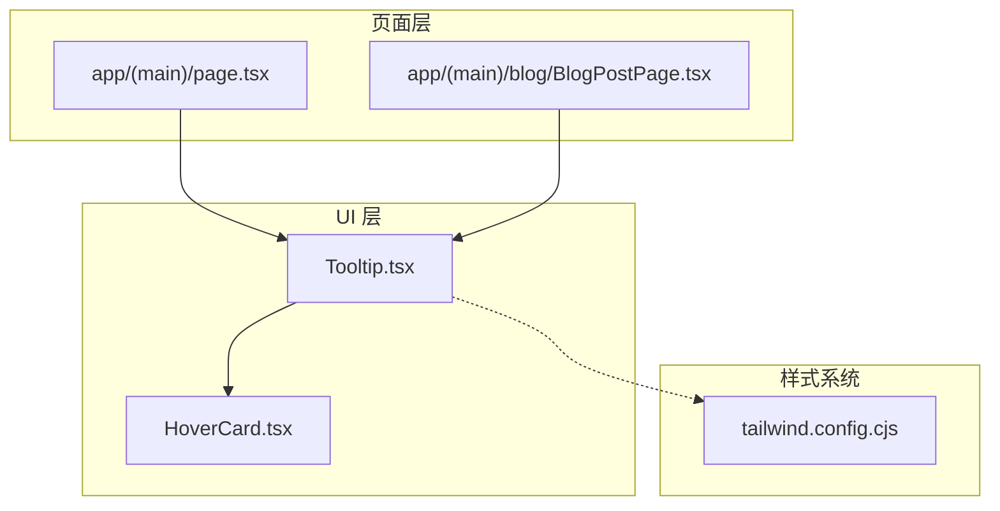
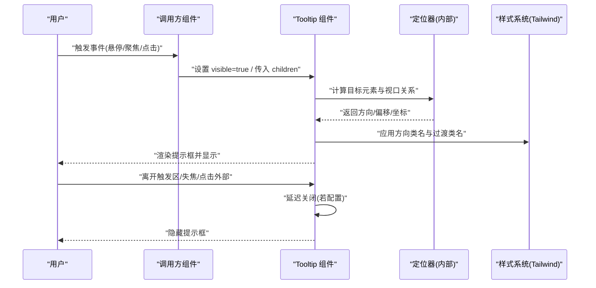
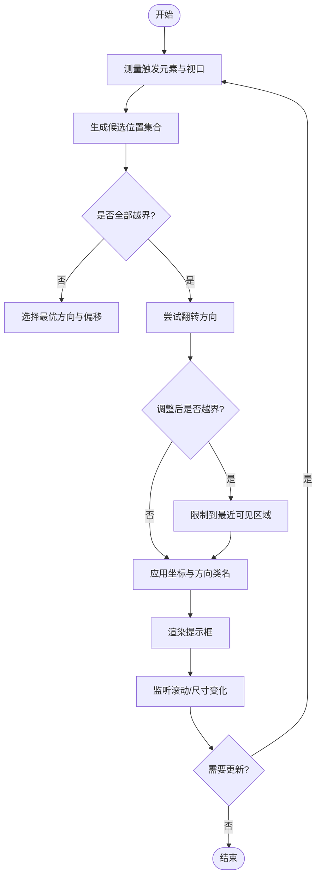
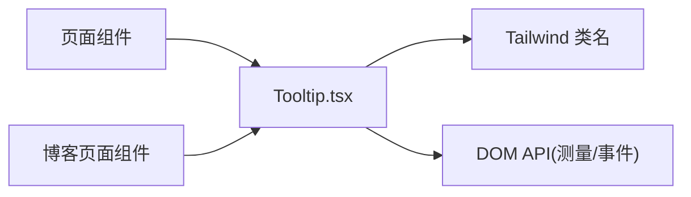

# 工具提示组件 (Tooltip)

<cite>
**本文引用的文件**   
- [components/ui/Tooltip.tsx](file://components/ui/Tooltip.tsx)
- [components/ui/HoverCard.tsx](file://components/ui/HoverCard.tsx)
- [app/(main)/page.tsx](file://app/(main)/page.tsx)
- [app/(main)/blog/BlogPostPage.tsx](file://app/(main)/blog/BlogPostPage.tsx)
- [tailwind.config.cjs](file://tailwind.config.cjs)
</cite>

## 目录
1. [简介](#简介)
2. [项目结构](#项目结构)
3. [核心组件](#核心组件)
4. [架构总览](#架构总览)
5. [详细组件分析](#详细组件分析)
6. [依赖分析](#依赖分析)
7. [性能考虑](#性能考虑)
8. [故障排查指南](#故障排查指南)
9. [结论](#结论)
10. [附录](#附录)

## 简介
本文件为 cali.so 项目的 Tooltip（工具提示）组件提供系统化文档，覆盖设计原则、实现细节与使用模式。重点说明触发条件、显示时机、定位算法、内容格式化、样式定制、方向配置、延迟控制、边界检测、滚动跟随、触摸设备支持，以及自定义样式、动画效果与可访问性实现的最佳实践。

## 项目结构
Tooltip 组件位于 UI 层，供页面与业务组件按需引入使用；HoverCard 作为参考实现，用于对比交互模型与定位策略。

图表来源
- [components/ui/Tooltip.tsx](file://components/ui/Tooltip.tsx)
- [components/ui/HoverCard.tsx](file://components/ui/HoverCard.tsx)
- [app/(main)/page.tsx](file://app/(main)/page.tsx)
- [app/(main)/blog/BlogPostPage.tsx](file://app/(main)/blog/BlogPostPage.tsx)
- [tailwind.config.cjs](file://tailwind.config.cjs)

章节来源
- [components/ui/Tooltip.tsx](file://components/ui/Tooltip.tsx)
- [components/ui/HoverCard.tsx](file://components/ui/HoverCard.tsx)
- [app/(main)/page.tsx](file://app/(main)/page.tsx)
- [app/(main)/blog/BlogPostPage.tsx](file://app/(main)/blog/BlogPostPage.tsx)
- [tailwind.config.cjs](file://tailwind.config.cjs)

## 核心组件
- Tooltip 组件：负责在用户交互（悬停、聚焦、点击等）时展示简短的辅助信息，具备方向、偏移、延迟、可见性状态管理与定位能力。
- HoverCard 组件：可作为 Tooltip 的定位与交互参考，提供类似“浮层”的显示逻辑与边界处理思路。

章节来源
- [components/ui/Tooltip.tsx](file://components/ui/Tooltip.tsx)
- [components/ui/HoverCard.tsx](file://components/ui/HoverCard.tsx)

## 架构总览
Tooltip 采用“受控 + 非受控”混合的状态管理模式：内部维护显示状态，同时暴露 props 以允许父级控制。定位计算基于触发元素与可视区域的关系，结合方向与偏移量进行最终坐标推导，并在滚动或窗口尺寸变化时更新位置。

图表来源
- [components/ui/Tooltip.tsx](file://components/ui/Tooltip.tsx)
- [tailwind.config.cjs](file://tailwind.config.cjs)

## 详细组件分析

### 设计原则
- 轻量与无侵入：Tooltip 仅包裹触发元素，不改变其布局。
- 可预测的交互：明确的触发条件与显隐时序，避免误触。
- 自适应定位：根据方向、偏移与边界自动调整，确保始终可见。
- 可访问性优先：键盘可达、语义正确、屏幕阅读器友好。
- 主题与样式解耦：通过 Tailwind 类名与 CSS 变量实现主题化。

章节来源
- [components/ui/Tooltip.tsx](file://components/ui/Tooltip.tsx)
- [tailwind.config.cjs](file://tailwind.config.cjs)

### 触发条件与显示时机
- 触发方式：悬停、聚焦、点击（可通过 props 组合启用）。
- 显示时机：进入触发区后按延迟阈值显示；离开时按延迟阈值隐藏。
- 防抖与节流：对频繁事件做节流，减少重排与重绘。

章节来源
- [components/ui/Tooltip.tsx](file://components/ui/Tooltip.tsx)

### 定位算法与边界检测
- 基础定位：基于触发元素的几何信息与视口尺寸，计算候选位置。
- 方向选择：根据可用空间与优先级选择上/下/左/右及其变体。
- 偏移与间距：支持相对触发元素的偏移与最小间距。
- 边界检测：当提示框超出视口时，自动翻转方向或调整偏移，保证完全可见。
- 滚动跟随：监听滚动事件，动态更新位置，避免脱离触发元素。

图表来源
- [components/ui/Tooltip.tsx](file://components/ui/Tooltip.tsx)

章节来源
- [components/ui/Tooltip.tsx](file://components/ui/Tooltip.tsx)

### 内容格式化与样式定制
- 内容格式：支持纯文本与富文本片段；建议将复杂内容放入子组件以提升可读性与复用性。
- 样式定制：通过 Tailwind 类名覆盖默认样式；推荐封装主题变量（颜色、圆角、阴影）以便全局切换。
- 动画效果：使用过渡类名实现淡入淡出与位移；避免过度动画影响性能。

章节来源
- [components/ui/Tooltip.tsx](file://components/ui/Tooltip.tsx)
- [tailwind.config.cjs](file://tailwind.config.cjs)

### 方向配置与延迟控制
- 方向：支持多方向与自动回退；可通过 props 指定首选方向。
- 延迟：分别配置显示与隐藏延迟，提升用户体验与稳定性。
- 层级：合理设置 z-index，避免被其他浮层遮挡。

章节来源
- [components/ui/Tooltip.tsx](file://components/ui/Tooltip.tsx)

### 触摸设备支持
- 触摸交互：在移动端，点击触发元素显示提示，点击空白处或再次点击隐藏。
- 手势兼容：避免与长按、滚动冲突；必要时禁用悬停行为。
- 焦点管理：保持键盘导航一致性，确保屏幕阅读器可用。

章节来源
- [components/ui/Tooltip.tsx](file://components/ui/Tooltip.tsx)

### 可访问性实现
- 语义标签：为触发元素与提示框添加合适的 ARIA 属性，如 aria-describedby、role="tooltip"。
- 键盘操作：支持 Tab 聚焦与 Esc 关闭。
- 读屏优化：提示内容简洁明确，避免过长文本。

章节来源
- [components/ui/Tooltip.tsx](file://components/ui/Tooltip.tsx)

### 使用示例与最佳实践
- 基本用法：将 Tooltip 包裹在按钮或链接周围，传入提示文本。
- 复杂内容：将富文本或图标组合放入 Tooltip 的子节点中。
- 主题适配：通过 Tailwind 类名或 CSS 变量统一风格。
- 性能优化：避免在 Tooltip 内放置重型组件；按需懒加载。
- 可测试性：为触发元素与提示框添加 data-testid，便于自动化测试。

章节来源
- [components/ui/Tooltip.tsx](file://components/ui/Tooltip.tsx)
- [app/(main)/page.tsx](file://app/(main)/page.tsx)
- [app/(main)/blog/BlogPostPage.tsx](file://app/(main)/blog/BlogPostPage.tsx)

## 依赖分析
- 组件耦合：Tooltip 与调用方组件松耦合，通过 props 传递配置；与样式系统通过类名解耦。
- 外部依赖：主要依赖浏览器 API（测量、事件、滚动），以及 Tailwind 提供的原子类。
- 潜在循环：Tooltip 不应直接依赖自身所在页面的路由或全局状态，避免循环引用。

图表来源
- [components/ui/Tooltip.tsx](file://components/ui/Tooltip.tsx)
- [tailwind.config.cjs](file://tailwind.config.cjs)
- [app/(main)/page.tsx](file://app/(main)/page.tsx)
- [app/(main)/blog/BlogPostPage.tsx](file://app/(main)/blog/BlogPostPage.tsx)

章节来源
- [components/ui/Tooltip.tsx](file://components/ui/Tooltip.tsx)
- [tailwind.config.cjs](file://tailwind.config.cjs)
- [app/(main)/page.tsx](file://app/(main)/page.tsx)
- [app/(main)/blog/BlogPostPage.tsx](file://app/(main)/blog/BlogPostPage.tsx)

## 性能考虑
- 事件节流：对 mousemove、scroll 等高频事件进行节流，降低重排开销。
- 按需渲染：仅在可见时挂载提示框内容，避免不必要的计算。
- 样式合并：尽量使用 Tailwind 原子类，减少自定义 CSS 体积。
- 内存管理：及时移除事件监听与定时器，防止泄漏。

[本节为通用指导，无需具体文件来源]

## 故障排查指南
- 提示框被遮挡：检查 z-index 与父容器 overflow 设置；确认定位容器是否为包含块。
- 滚动后错位：确认是否监听滚动事件并更新位置；检查父容器滚动而非 window 滚动。
- 移动端点击无效：确认点击事件冒泡未被阻止；检查触摸事件优先级。
- 样式未生效：核对 Tailwind 类名是否正确；确认构建配置已包含相关路径。
- 可访问性问题：验证 ARIA 属性与键盘导航是否符合预期。

章节来源
- [components/ui/Tooltip.tsx](file://components/ui/Tooltip.tsx)
- [tailwind.config.cjs](file://tailwind.config.cjs)

## 结论
Tooltip 组件在 cali.so 中以轻量、可定制、可访问为核心目标，结合精确的定位算法与良好的交互体验，满足多种场景需求。遵循本文档的设计原则与实践建议，可在项目中稳定复用并持续演进。

[本节为总结性内容，无需具体文件来源]

## 附录
- 与 HoverCard 的对比：HoverCard 提供更丰富的浮层交互，可作为 Tooltip 的扩展参考。
- 主题与样式：建议在 tailwind.config.cjs 中集中定义 Tooltip 的主题变量，便于全局切换。

章节来源
- [components/ui/HoverCard.tsx](file://components/ui/HoverCard.tsx)
- [tailwind.config.cjs](file://tailwind.config.cjs)