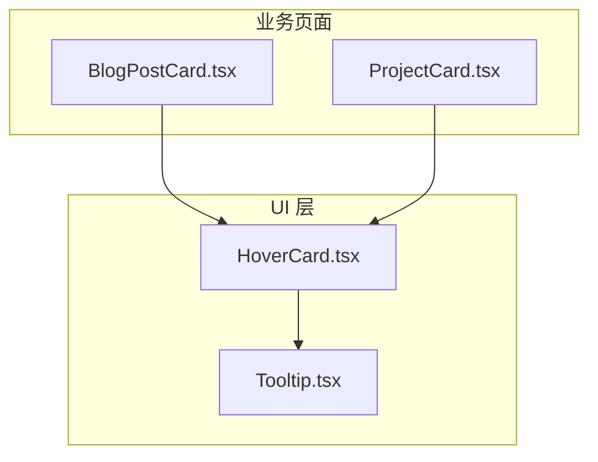
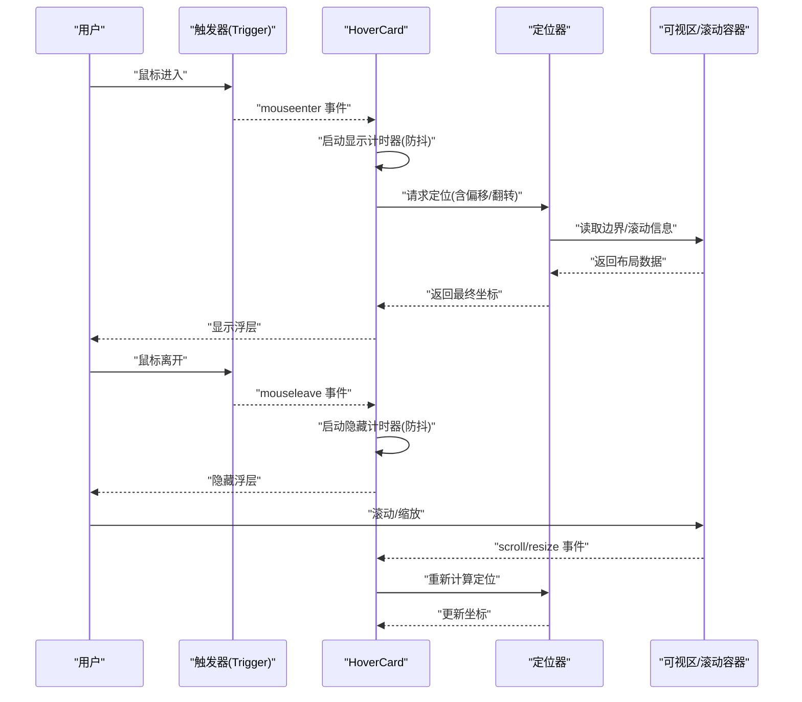
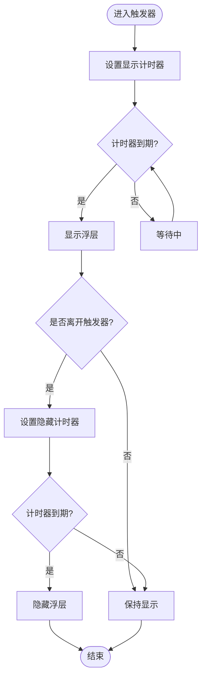
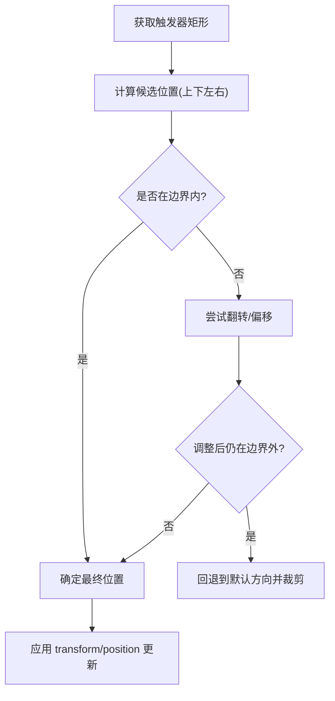
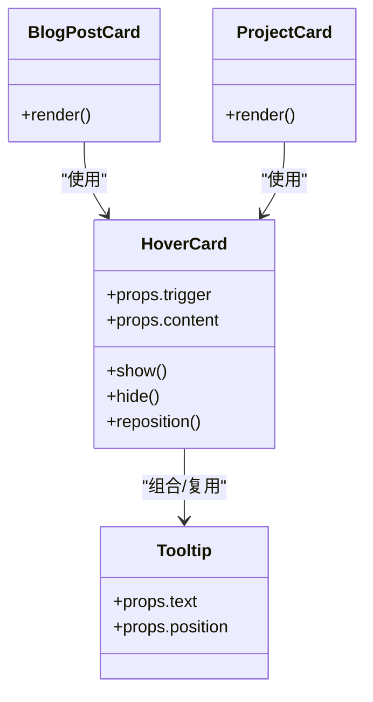

# 悬停卡片组件 (HoverCard)

<cite>
**本文引用的文件**   
- [HoverCard.tsx](file://components/ui/HoverCard.tsx)
- [Tooltip.tsx](file://components/ui/Tooltip.tsx)
- [BlogPostCard.tsx](file://app/(main)/blog/BlogPostCard.tsx)
- [ProjectCard.tsx](file://app/(main)/projects/ProjectCard.tsx)
</cite>

## 目录
1. [简介](#简介)
2. [项目结构](#项目结构)
3. [核心组件](#核心组件)
4. [架构总览](#架构总览)
5. [详细组件分析](#详细组件分析)
6. [依赖关系分析](#依赖关系分析)
7. [性能考量](#性能考量)
8. [故障排查指南](#故障排查指南)
9. [结论](#结论)
10. [附录](#附录)

## 简介
本文件为 cali.so 项目的悬停卡片组件 HoverCard 提供系统化文档。内容涵盖设计原则、实现细节与使用模式，重点解释触发机制、延迟显示逻辑、鼠标离开处理、内容渲染、定位策略、边界检测与滚动监听；并提供动画效果、层级管理、性能优化、自定义样式、响应式适配与可访问性支持的最佳实践。

## 项目结构
HoverCard 位于 UI 层，供业务页面中的卡片复用。典型调用方包括博客文章卡片与项目卡片等。

图表来源
- [HoverCard.tsx](file://components/ui/HoverCard.tsx)
- [Tooltip.tsx](file://components/ui/Tooltip.tsx)
- [BlogPostCard.tsx](file://app/(main)/blog/BlogPostCard.tsx)
- [ProjectCard.tsx](file://app/(main)/projects/ProjectCard.tsx)

章节来源
- [HoverCard.tsx](file://components/ui/HoverCard.tsx)
- [Tooltip.tsx](file://components/ui/Tooltip.tsx)
- [BlogPostCard.tsx](file://app/(main)/blog/BlogPostCard.tsx)
- [ProjectCard.tsx](file://app/(main)/projects/ProjectCard.tsx)

## 核心组件
- HoverCard：封装“触发器 + 浮层”的交互，负责事件绑定、延迟控制、定位与边界修正、滚动监听、可见性与层级管理。
- Tooltip：轻量提示浮层，可作为 HoverCard 的内容载体或内部子组件被复用。

章节来源
- [HoverCard.tsx](file://components/ui/HoverCard.tsx)
- [Tooltip.tsx](file://components/ui/Tooltip.tsx)

## 架构总览
HoverCard 采用“受控状态 + 事件驱动 + 定位计算”的架构：
- 触发器：包裹在 HoverCard 内部的任意元素（如按钮、链接、图片）。
- 浮层：根据触发器的位置与视口边界动态计算坐标，必要时进行翻转或偏移以避免溢出。
- 生命周期：进入触发区域后延时显示；移出时延时隐藏；滚动或窗口尺寸变化时重新计算定位。

图表来源
- [HoverCard.tsx](file://components/ui/HoverCard.tsx)
- [Tooltip.tsx](file://components/ui/Tooltip.tsx)

## 详细组件分析

### 触发机制与延迟显示
- 触发方式：基于 mouseenter/mouseleave 事件，避免冒泡导致的误判。
- 延迟显示：进入后通过定时器延迟显示，防止快速抖动导致闪烁。
- 延迟隐藏：离开后延迟隐藏，允许指针短暂移动到浮层上而不立即关闭。
- 互斥与清理：任一计时器触发时清理另一个，确保状态一致。

图表来源
- [HoverCard.tsx](file://components/ui/HoverCard.tsx)

章节来源
- [HoverCard.tsx](file://components/ui/HoverCard.tsx)

### 鼠标离开与浮层交互
- 离开触发器：启动隐藏计时器。
- 进入浮层：暂停隐藏计时器，保持显示。
- 离开浮层：恢复隐藏计时器，到期后隐藏。
- 点击外部：可选关闭（取决于实现），避免遮挡后续操作。

章节来源
- [HoverCard.tsx](file://components/ui/HoverCard.tsx)

### 内容渲染
- 插槽/子节点：触发器作为第一个子节点，浮层内容由 props 或第二个子节点传入。
- 条件渲染：仅在可见状态下挂载浮层 DOM，减少不必要的重排。
- 组合能力：可与 Tooltip 组合，承载富文本、图片、列表等复杂内容。

章节来源
- [HoverCard.tsx](file://components/ui/HoverCard.tsx)
- [Tooltip.tsx](file://components/ui/Tooltip.tsx)

### 定位策略与边界检测
- 定位基准：以触发器为参考点，计算相对父容器的偏移。
- 对齐策略：支持左/右/上/下对齐，以及自动翻转（flip）与偏移（offset）。
- 边界检测：检测浮层是否超出父容器或视口，必要时调整位置或方向。
- 滚动监听：监听滚动事件，实时修正浮层坐标，避免错位。

图表来源
- [HoverCard.tsx](file://components/ui/HoverCard.tsx)

章节来源
- [HoverCard.tsx](file://components/ui/HoverCard.tsx)

### 滚动监听与可见性
- 滚动监听：在父容器或 document 上监听滚动，触发重新定位。
- 节流优化：对滚动回调进行节流，降低高频重排开销。
- 可见性：结合 IntersectionObserver 或 visibilitychange，不可见时停止监听与定时任务。

章节来源
- [HoverCard.tsx](file://components/ui/HoverCard.tsx)

### 动画效果与层级管理
- 动画：入场淡入/位移，出场反向动画，时长与缓动可配置。
- 层级：浮层置于较高 z-index，避免被其他元素覆盖；同时考虑堆叠上下文影响。
- 过渡：使用 CSS transition 或框架内置动画方案，保证流畅度。

章节来源
- [HoverCard.tsx](file://components/ui/HoverCard.tsx)

### 可访问性支持
- 键盘导航：支持 Tab 聚焦触发器，Enter/Space 打开，Esc 关闭。
- 焦点管理：打开时将焦点移至浮层或保留在触发器（按交互约定），关闭时恢复焦点。
- 语义化：为触发器与浮层添加合适的 aria-* 属性，提升屏幕阅读器体验。

章节来源
- [HoverCard.tsx](file://components/ui/HoverCard.tsx)

### 使用示例与最佳实践
- 基本用法：将触发器与浮层内容分别作为子节点传入。
- 延迟参数：合理设置显示/隐藏延迟，平衡灵敏性与稳定性。
- 定位参数：指定对齐方向、偏移量与翻转策略，避免溢出。
- 样式定制：通过 className 或主题变量覆盖默认样式，保持与设计系统一致。
- 性能建议：避免在浮层内放置重型组件；按需懒加载内容。

章节来源
- [BlogPostCard.tsx](file://app/(main)/blog/BlogPostCard.tsx)
- [ProjectCard.tsx](file://app/(main)/projects/ProjectCard.tsx)
- [HoverCard.tsx](file://components/ui/HoverCard.tsx)

## 依赖关系分析
HoverCard 与 Tooltip 存在组合关系，业务卡片消费 HoverCard。

图表来源
- [HoverCard.tsx](file://components/ui/HoverCard.tsx)
- [Tooltip.tsx](file://components/ui/Tooltip.tsx)
- [BlogPostCard.tsx](file://app/(main)/blog/BlogPostCard.tsx)
- [ProjectCard.tsx](file://app/(main)/projects/ProjectCard.tsx)

章节来源
- [HoverCard.tsx](file://components/ui/HoverCard.tsx)
- [Tooltip.tsx](file://components/ui/Tooltip.tsx)
- [BlogPostCard.tsx](file://app/(main)/blog/BlogPostCard.tsx)
- [ProjectCard.tsx](file://app/(main)/projects/ProjectCard.tsx)

## 性能考量
- 事件节流：对 scroll、mousemove 等高频率事件进行节流/防抖。
- 最小化重排：批量更新样式，避免频繁读写布局属性。
- 惰性渲染：仅在可见时创建浮层 DOM，必要时懒加载内容。
- 内存管理：组件卸载时移除事件监听与计时器，防止泄漏。
- 动画优化：优先使用 transform/opacity 等合成属性，减少重绘。

[本节为通用指导，不直接分析具体文件]

## 故障排查指南
- 浮层错位：检查父容器是否为定位上下文；确认滚动监听是否正确附加。
- 无法显示：确认触发器是否可接收鼠标事件；检查 z-index 与堆叠上下文。
- 频繁闪烁：调整显示/隐藏延迟；确保计时器正确清理。
- 滚动后不跟随：验证滚动监听是否生效；检查节流阈值是否过大。
- 键盘不可用：核对 aria-* 与焦点管理逻辑是否符合无障碍规范。

章节来源
- [HoverCard.tsx](file://components/ui/HoverCard.tsx)

## 结论
HoverCard 通过清晰的触发与延迟机制、健壮的定位与边界检测、完善的滚动监听与层级管理，提供了稳定且高性能的悬停卡片体验。配合 Tooltip 的组合能力与良好的可访问性支持，可满足多种业务场景下的展示需求。遵循本文的使用建议与最佳实践，可在不同设备上获得一致的交互表现。

[本节为总结性内容，不直接分析具体文件]

## 附录
- 自定义样式：通过外层容器与浮层类名覆盖默认样式，保持与设计令牌一致。
- 响应式适配：在小屏设备限制浮层宽度，必要时切换为点击展开或底部弹出。
- 集成第三方库：如需更复杂的定位算法，可引入成熟库并在 HoverCard 中封装适配层。

[本节为补充说明，不直接分析具体文件]