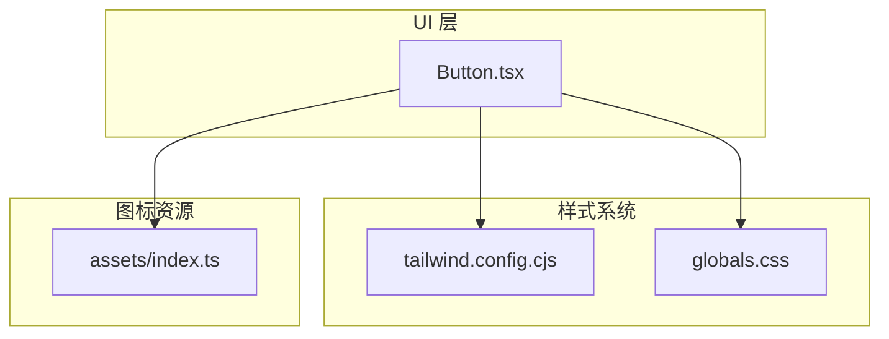
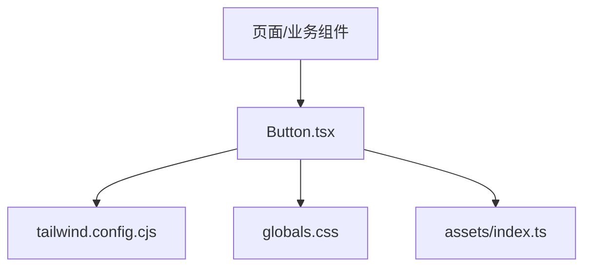
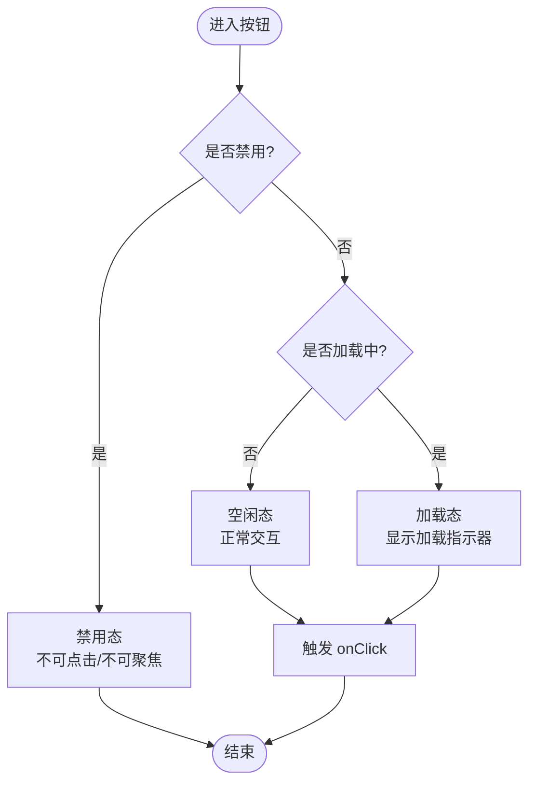
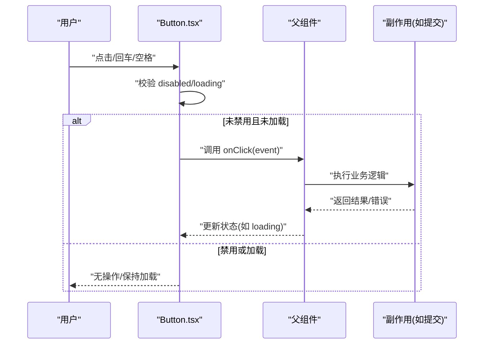
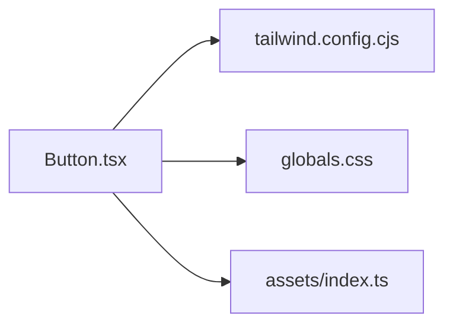

# 按钮组件 (Button)

<cite>
**本文引用的文件**   
- [components/ui/Button.tsx](file://components/ui/Button.tsx)
- [tailwind.config.cjs](file://tailwind.config.cjs)
- [app/globals.css](file://app/globals.css)
- [assets/index.ts](file://assets/index.ts)
</cite>

## 目录
1. [简介](#简介)
2. [项目结构](#项目结构)
3. [核心组件](#核心组件)
4. [架构总览](#架构总览)
5. [详细组件分析](#详细组件分析)
6. [依赖分析](#依赖分析)
7. [性能考虑](#性能考虑)
8. [故障排查指南](#故障排查指南)
9. [结论](#结论)
10. [附录](#附录)

## 简介
本文件为 cali.so 项目的 Button 组件提供系统化文档，涵盖设计原则、实现细节、使用模式与最佳实践。重点说明以下方面：
- 变体（primary、secondary、outline、ghost）
- 尺寸（sm、md、lg）
- 状态（loading、disabled）
- 样式定制、图标集成、事件处理与可访问性
- 组合模式、扩展方法与性能优化
- 自定义主题、动画效果与响应式适配

## 项目结构
Button 组件位于 UI 层，遵循“组件即模块”的组织方式；样式通过 Tailwind CSS 配置与全局样式协同管理；图标资源集中管理并通过索引导出，便于在按钮中按需引入。

图表来源
- [components/ui/Button.tsx](file://components/ui/Button.tsx)
- [tailwind.config.cjs](file://tailwind.config.cjs)
- [app/globals.css](file://app/globals.css)
- [assets/index.ts](file://assets/index.ts)

章节来源
- [components/ui/Button.tsx](file://components/ui/Button.tsx)
- [tailwind.config.cjs](file://tailwind.config.cjs)
- [app/globals.css](file://app/globals.css)
- [assets/index.ts](file://assets/index.ts)

## 核心组件
- 组件职责
  - 统一按钮的视觉风格与交互行为
  - 支持多种变体与尺寸
  - 内置 loading 与 disabled 状态
  - 提供无障碍属性与键盘导航支持
  - 允许传入图标与自定义内容
- 关键能力
  - 变体：primary、secondary、outline、ghost
  - 尺寸：sm、md、lg
  - 状态：loading、disabled
  - 事件：onClick、onKeyDown 等
  - 可访问性：role、aria-*、tabIndex
  - 样式：Tailwind 类名组合、CSS 变量/主题色
  - 图标：前后图标插槽或 props
- 典型用法
  - 基础按钮、带图标按钮、加载态按钮、禁用按钮
  - 组合使用：按钮组、工具栏、表单操作区
  - 响应式：在不同屏幕下切换尺寸或布局

章节来源
- [components/ui/Button.tsx](file://components/ui/Button.tsx)

## 架构总览
Button 组件作为原子级 UI 组件，向上被页面与业务组件消费，向下依赖样式系统与图标资源。整体关系如下：

图表来源
- [components/ui/Button.tsx](file://components/ui/Button.tsx)
- [tailwind.config.cjs](file://tailwind.config.cjs)
- [app/globals.css](file://app/globals.css)
- [assets/index.ts](file://assets/index.ts)

## 详细组件分析

### 设计与实现要点
- 设计原则
  - 一致性：统一的圆角、阴影、过渡与焦点环
  - 可感知：高对比度、清晰的 hover/focus/disabled/loading 反馈
  - 可组合：通过 props 组合出丰富场景
  - 可扩展：预留主题与样式覆盖点
- 实现策略
  - 基于 Tailwind 的类名拼接与条件渲染
  - 通过 props 控制变体、尺寸、状态与事件
  - 使用语义化标签与 ARIA 属性提升可访问性
  - 图标以独立组件形式注入，避免内联 SVG 污染

章节来源
- [components/ui/Button.tsx](file://components/ui/Button.tsx)
- [tailwind.config.cjs](file://tailwind.config.cjs)
- [app/globals.css](file://app/globals.css)

### 变体与尺寸矩阵
- 变体
  - primary：强调主操作，通常使用品牌主色
  - secondary：次级操作，弱化主色强度
  - outline：描边风格，适合并列操作
  - ghost：透明背景，用于轻量操作
- 尺寸
  - sm：紧凑空间或密集列表
  - md：默认尺寸
  - lg：突出重要操作或移动端易点击区域

章节来源
- [components/ui/Button.tsx](file://components/ui/Button.tsx)

### 状态处理流程
下图展示 loading 与 disabled 的状态流转与交互约束：

图表来源
- [components/ui/Button.tsx](file://components/ui/Button.tsx)

章节来源
- [components/ui/Button.tsx](file://components/ui/Button.tsx)

### 事件处理序列
下图描述一次点击从用户到回调的调用链：

图表来源
- [components/ui/Button.tsx](file://components/ui/Button.tsx)

章节来源
- [components/ui/Button.tsx](file://components/ui/Button.tsx)

### 可访问性与键盘交互
- 语义化标签：使用 button 元素确保原生语义
- 键盘支持：Enter/Space 触发点击，Tab 顺序合理
- 焦点可见：focus-visible 样式清晰
- ARIA 属性：aria-disabled、aria-busy、aria-label 等
- 颜色对比：满足 WCAG 对比度要求

章节来源
- [components/ui/Button.tsx](file://components/ui/Button.tsx)

### 图标集成
- 图标来源：集中管理于 assets 目录并通过索引导出
- 插入位置：前缀图标、后缀图标或纯图标按钮
- 尺寸匹配：根据按钮尺寸自动缩放或受控
- 无障碍：为纯图标按钮提供 aria-label

章节来源
- [components/ui/Button.tsx](file://components/ui/Button.tsx)
- [assets/index.ts](file://assets/index.ts)

### 样式定制与主题
- Tailwind 配置：通过 tailwind.config.cjs 定义颜色、圆角、阴影、字号等
- 全局样式：在 globals.css 中补充过渡、动画与全局变量
- 主题覆盖：通过 CSS 变量或 Tailwind 自定义类名进行覆盖
- 暗色模式：利用 Tailwind dark: 前缀或 CSS 媒体查询

章节来源
- [tailwind.config.cjs](file://tailwind.config.cjs)
- [app/globals.css](file://app/globals.css)

### 响应式与动效
- 响应式：按断点调整尺寸、间距与字体大小
- 动效：hover、active、focus、loading 转圈等过渡
- 性能：优先使用 transform/opacity 等合成属性

章节来源
- [components/ui/Button.tsx](file://components/ui/Button.tsx)
- [tailwind.config.cjs](file://tailwind.config.cjs)
- [app/globals.css](file://app/globals.css)

### 组合模式与扩展方法
- 组合模式
  - 按钮组：Primary + Secondary 并列
  - 工具栏：多个 Ghost/Outline 小按钮
  - 表单操作：Submit + Reset 组合
- 扩展方法
  - 新增变体：在组件内部维护映射表并扩展样式
  - 新增尺寸：在尺寸映射中添加新档位
  - 主题接入：将颜色/圆角/阴影纳入主题配置

章节来源
- [components/ui/Button.tsx](file://components/ui/Button.tsx)

## 依赖分析
- 直接依赖
  - 样式系统：Tailwind 配置与全局样式
  - 图标资源：assets 索引导出
- 间接依赖
  - 框架运行时：React/Next.js 事件与渲染
  - 浏览器特性：焦点管理、键盘事件、CSS 动画

图表来源
- [components/ui/Button.tsx](file://components/ui/Button.tsx)
- [tailwind.config.cjs](file://tailwind.config.cjs)
- [app/globals.css](file://app/globals.css)
- [assets/index.ts](file://assets/index.ts)

章节来源
- [components/ui/Button.tsx](file://components/ui/Button.tsx)
- [tailwind.config.cjs](file://tailwind.config.cjs)
- [app/globals.css](file://app/globals.css)
- [assets/index.ts](file://assets/index.ts)

## 性能考虑
- 减少重排重绘：仅变更必要类名，避免频繁 DOM 操作
- 合并样式计算：将变体/尺寸/状态的类名预计算
- 懒加载图标：仅在需要时引入对应图标组件
- 防抖节流：对高频事件（如滚动触发的加载）做节流
- 动画优化：使用 GPU 加速属性（transform、opacity）

[本节为通用指导，不直接分析具体文件]

## 故障排查指南
- 问题：点击无效
  - 检查 disabled/loading 状态是否阻止事件
  - 确认 onClick 是否正确透传
- 问题：键盘无法触发
  - 确认使用 button 元素与 Enter/Space 监听
  - 检查 tabIndex 与 focus 样式
- 问题：样式不生效
  - 核对 Tailwind 配置中的颜色/尺寸映射
  - 检查全局样式是否覆盖
- 问题：图标错位或尺寸异常
  - 确认图标组件尺寸与按钮尺寸匹配
  - 检查容器 flex 布局与对齐

章节来源
- [components/ui/Button.tsx](file://components/ui/Button.tsx)
- [tailwind.config.cjs](file://tailwind.config.cjs)
- [app/globals.css](file://app/globals.css)

## 结论
Button 组件通过清晰的变体/尺寸/状态模型、完善的可访问性与灵活的样式扩展点，为 cali.so 提供了稳定一致的交互基元。建议在实际使用中遵循本文的最佳实践，并结合主题与动效规范打造一致的用户体验。

[本节为总结性内容，不直接分析具体文件]

## 附录

### 快速参考清单
- 变体：primary、secondary、outline、ghost
- 尺寸：sm、md、lg
- 状态：loading、disabled
- 事件：onClick、onKeyDown
- 可访问性：button 语义、ARIA、焦点可见
- 样式：Tailwind 配置、全局样式、主题变量
- 图标：集中管理、按需引入、尺寸匹配

章节来源
- [components/ui/Button.tsx](file://components/ui/Button.tsx)
- [tailwind.config.cjs](file://tailwind.config.cjs)
- [app/globals.css](file://app/globals.css)
- [assets/index.ts](file://assets/index.ts)