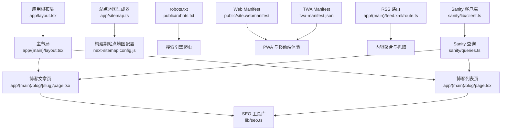
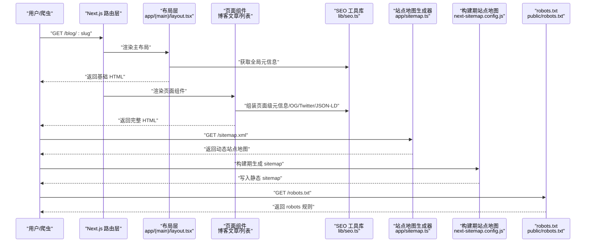
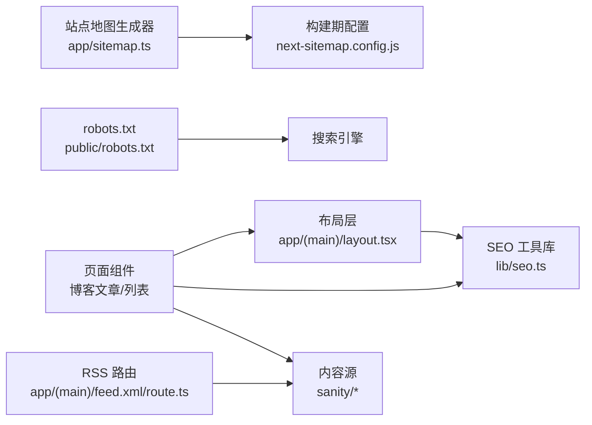

# SEO 优化策略

<cite>
**本文引用的文件**   
- [app/layout.tsx](file://app/layout.tsx)
- [app/(main)/layout.tsx](file://app/(main)/layout.tsx)
- [app/(main)/blog/[slug]/page.tsx](file://app/(main)/blog/[slug]/page.tsx)
- [app/(main)/blog/page.tsx](file://app/(main)/blog/page.tsx)
- [lib/seo.ts](file://lib/seo.ts)
- [app/sitemap.ts](file://app/sitemap.ts)
- [next-sitemap.config.js](file://next-sitemap.config.js)
- [public/robots.txt](file://public/robots.txt)
- [public/site.webmanifest](file://public/site.webmanifest)
- [twa-manifest.json](file://twa-manifest.json)
- [app/(main)/feed.xml/route.ts](file://app/(main)/feed.xml/route.ts)
- [sanity/queries.ts](file://sanity/queries.ts)
- [sanity/lib/client.ts](file://sanity/lib/client.ts)
- [package.json](file://package.json)
</cite>

## 目录
1. [简介](#简介)
2. [项目结构](#项目结构)
3. [核心组件](#核心组件)
4. [架构总览](#架构总览)
5. [详细组件分析](#详细组件分析)
6. [依赖关系分析](#依赖关系分析)
7. [性能考量](#性能考量)
8. [故障排查指南](#故障排查指南)
9. [结论](#结论)
10. [附录](#附录)

## 简介
本文件面向博客系统的搜索引擎优化（SEO）策略，覆盖以下关键主题：
- 动态 meta 标签生成与页面级元信息控制
- 结构化数据标记（JSON-LD）
- Sitemap 自动生成与 robots.txt 配置
- Open Graph 协议与 Twitter Card 的社交媒体分享优化
- Core Web Vitals 与移动端 SEO 最佳实践
- 监控与分析方案建议

本仓库基于 Next.js App Router，结合 Sanity CMS、RSS 订阅与站点地图构建工具，形成端到端的 SEO 能力。

## 项目结构
从 SEO 视角，本项目的相关组织方式如下：
- 应用根布局与主布局负责全局元信息与基础 SEO 设置
- 博客文章与列表页提供页面级元信息、Open Graph/Twitter Card 与结构化数据
- 站点地图通过运行时生成与构建期生成两种路径输出
- robots.txt 静态托管于 public 目录
- 社交媒体清单与 PWA 清单用于增强可发现性与移动体验
- RSS 订阅路由为内容分发与抓取提供补充入口

图表来源
- [app/layout.tsx](file://app/layout.tsx)
- [app/(main)/layout.tsx](file://app/(main)/layout.tsx)
- [app/(main)/blog/[slug]/page.tsx](file://app/(main)/blog/[slug]/page.tsx)
- [app/(main)/blog/page.tsx](file://app/(main)/blog/page.tsx)
- [lib/seo.ts](file://lib/seo.ts)
- [app/sitemap.ts](file://app/sitemap.ts)
- [next-sitemap.config.js](file://next-sitemap.config.js)
- [public/robots.txt](file://public/robots.txt)
- [public/site.webmanifest](file://public/site.webmanifest)
- [twa-manifest.json](file://twa-manifest.json)
- [app/(main)/feed.xml/route.ts](file://app/(main)/feed.xml/route.ts)
- [sanity/queries.ts](file://sanity/queries.ts)
- [sanity/lib/client.ts](file://sanity/lib/client.ts)

章节来源
- [app/layout.tsx](file://app/layout.tsx)
- [app/(main)/layout.tsx](file://app/(main)/layout.tsx)
- [app/(main)/blog/[slug]/page.tsx](file://app/(main)/blog/[slug]/page.tsx)
- [app/(main)/blog/page.tsx](file://app/(main)/blog/page.tsx)
- [lib/seo.ts](file://lib/seo.ts)
- [app/sitemap.ts](file://app/sitemap.ts)
- [next-sitemap.config.js](file://next-sitemap.config.js)
- [public/robots.txt](file://public/robots.txt)
- [public/site.webmanifest](file://public/site.webmanifest)
- [twa-manifest.json](file://twa-manifest.json)
- [app/(main)/feed.xml/route.ts](file://app/(main)/feed.xml/route.ts)
- [sanity/queries.ts](file://sanity/queries.ts)
- [sanity/lib/client.ts](file://sanity/lib/client.ts)

## 核心组件
- 动态元信息生成
  - 根布局与主布局集中注入基础元信息（语言、主题色、图标等），页面级组件按需覆盖标题、描述、OG/Twitter 卡片字段与 canonical 链接。
  - 参考路径：[app/layout.tsx](file://app/layout.tsx)、[app/(main)/layout.tsx](file://app/(main)/layout.tsx)、[app/(main)/blog/[slug]/page.tsx](file://app/(main)/blog/[slug]/page.tsx)、[app/(main)/blog/page.tsx](file://app/(main)/blog/page.tsx)、[lib/seo.ts](file://lib/seo.ts)。

- 结构化数据（JSON-LD）
  - 在文章页注入 Article/ArticleList 等 JSON-LD，提升搜索摘要与富结果展示效果。
  - 参考路径：[app/(main)/blog/[slug]/page.tsx](file://app/(main)/blog/[slug]/page.tsx)、[lib/seo.ts](file://lib/seo.ts)。

- 站点地图与 robots.txt
  - 使用运行时 sitemap 生成器与构建期 next-sitemap 配合，确保增量更新与全量构建均能产出最新 sitemap。
  - robots.txt 静态托管，控制爬虫抓取范围。
  - 参考路径：[app/sitemap.ts](file://app/sitemap.ts)、[next-sitemap.config.js](file://next-sitemap.config.js)、[public/robots.txt](file://public/robots.txt)。

- 社交媒体分享优化
  - Open Graph 与 Twitter Card 字段在页面级注入，统一由 SEO 工具函数组装。
  - 参考路径：[lib/seo.ts](file://lib/seo.ts)、[app/(main)/blog/[slug]/page.tsx](file://app/(main)/blog/[slug]/page.tsx)。

- 移动端与 PWA
  - site.webmanifest 与 twa-manifest.json 定义应用名称、启动图、主题色等，提升移动端可安装性与加载体验。
  - 参考路径：[public/site.webmanifest](file://public/site.webmanifest)、[twa-manifest.json](file://twa-manifest.json)。

- RSS 订阅
  - 通过 API Route 输出 RSS，便于内容分发与抓取。
  - 参考路径：[app/(main)/feed.xml/route.ts](file://app/(main)/feed.xml/route.ts)。

章节来源
- [app/layout.tsx](file://app/layout.tsx)
- [app/(main)/layout.tsx](file://app/(main)/layout.tsx)
- [app/(main)/blog/[slug]/page.tsx](file://app/(main)/blog/[slug]/page.tsx)
- [app/(main)/blog/page.tsx](file://app/(main)/blog/page.tsx)
- [lib/seo.ts](file://lib/seo.ts)
- [app/sitemap.ts](file://app/sitemap.ts)
- [next-sitemap.config.js](file://next-sitemap.config.js)
- [public/robots.txt](file://public/robots.txt)
- [public/site.webmanifest](file://public/site.webmanifest)
- [twa-manifest.json](file://twa-manifest.json)
- [app/(main)/feed.xml/route.ts](file://app/(main)/feed.xml/route.ts)

## 架构总览
下图展示了从请求到 SEO 资源产出的整体流程，包括元信息注入、结构化数据渲染、sitemap 生成与 robots.txt 访问。

图表来源
- [app/(main)/layout.tsx](file://app/(main)/layout.tsx)
- [app/(main)/blog/[slug]/page.tsx](file://app/(main)/blog/[slug]/page.tsx)
- [lib/seo.ts](file://lib/seo.ts)
- [app/sitemap.ts](file://app/sitemap.ts)
- [next-sitemap.config.js](file://next-sitemap.config.js)
- [public/robots.txt](file://public/robots.txt)

## 详细组件分析

### 动态 Meta 标签与页面级元信息
- 职责划分
  - 根布局与主布局：注入语言、主题色、图标、基础 OG 字段等全局元信息。
  - 页面组件：根据文章内容或列表上下文，动态设置标题、描述、canonical、OG 图片、Twitter Card 等。
- 实现要点
  - 使用统一的 SEO 工具函数集中处理字段拼接与校验，避免重复逻辑。
  - 对长标题/描述进行截断与转义，防止社交平台预览异常。
  - 为每个页面设置 canonical 链接，避免重复内容问题。
- 参考路径
  - [app/layout.tsx](file://app/layout.tsx)
  - [app/(main)/layout.tsx](file://app/(main)/layout.tsx)
  - [app/(main)/blog/[slug]/page.tsx](file://app/(main)/blog/[slug]/page.tsx)
  - [app/(main)/blog/page.tsx](file://app/(main)/blog/page.tsx)
  - [lib/seo.ts](file://lib/seo.ts)

章节来源
- [app/layout.tsx](file://app/layout.tsx)
- [app/(main)/layout.tsx](file://app/(main)/layout.tsx)
- [app/(main)/blog/[slug]/page.tsx](file://app/(main)/blog/[slug]/page.tsx)
- [app/(main)/blog/page.tsx](file://app/(main)/blog/page.tsx)
- [lib/seo.ts](file://lib/seo.ts)

### 结构化数据（JSON-LD）
- 目标
  - 为文章与列表页注入 Article、ArticleList 等结构化数据，提升搜索结果富摘要与知识图谱关联。
- 关键点
  - 包含必要字段：标题、作者、发布日期、修改日期、主要图片、URL 等。
  - 保持与页面可见内容一致，避免误导爬虫。
- 参考路径
  - [app/(main)/blog/[slug]/page.tsx](file://app/(main)/blog/[slug]/page.tsx)
  - [lib/seo.ts](file://lib/seo.ts)

章节来源
- [app/(main)/blog/[slug]/page.tsx](file://app/(main)/blog/[slug]/page.tsx)
- [lib/seo.ts](file://lib/seo.ts)

### Sitemap 自动生成与 robots.txt 配置
- 运行时 sitemap
  - 通过 app/sitemap.ts 在请求时生成，适合频繁更新的站点。
- 构建期 sitemap
  - 通过 next-sitemap.config.js 在构建阶段生成，适合稳定站点与 CDN 缓存。
- robots.txt
  - 静态托管于 public/robots.txt，控制爬虫抓取范围与优先级。
- 参考路径
  - [app/sitemap.ts](file://app/sitemap.ts)
  - [next-sitemap.config.js](file://next-sitemap.config.js)
  - [public/robots.txt](file://public/robots.txt)

章节来源
- [app/sitemap.ts](file://app/sitemap.ts)
- [next-sitemap.config.js](file://next-sitemap.config.js)
- [public/robots.txt](file://public/robots.txt)

### Open Graph 与 Twitter Card 优化
- 字段覆盖
  - og:title、og:description、og:image、og:url、og:type
  - twitter:card、twitter:title、twitter:description、twitter:image
- 最佳实践
  - 图片尺寸与大小控制在平台推荐范围内，优先提供高清大图。
  - 为不同页面定制差异化预览图与文案，提高点击率。
- 参考路径
  - [lib/seo.ts](file://lib/seo.ts)
  - [app/(main)/blog/[slug]/page.tsx](file://app/(main)/blog/[slug]/page.tsx)

章节来源
- [lib/seo.ts](file://lib/seo.ts)
- [app/(main)/blog/[slug]/page.tsx](file://app/(main)/blog/[slug]/page.tsx)

### 移动端 SEO 与 PWA 清单
- Web Manifest
  - 定义应用名称、启动画面、主题色、方向等，提升移动端可安装性与一致性。
- TWA Manifest
  - 针对 Android WebView 应用化场景，进一步优化体验。
- 参考路径
  - [public/site.webmanifest](file://public/site.webmanifest)
  - [twa-manifest.json](file://twa-manifest.json)

章节来源
- [public/site.webmanifest](file://public/site.webmanifest)
- [twa-manifest.json](file://twa-manifest.json)

### RSS 订阅路由
- 作用
  - 提供标准 RSS 输出，便于内容分发、抓取与第三方聚合。
- 实现
  - 通过 API Route 输出 XML 格式，包含最新文章条目。
- 参考路径
  - [app/(main)/feed.xml/route.ts](file://app/(main)/feed.xml/route.ts)

章节来源
- [app/(main)/feed.xml/route.ts](file://app/(main)/feed.xml/route.ts)

### 数据源集成（Sanity CMS）
- 查询与客户端
  - 使用 sanity/queries.ts 定义 GraphQL/Query 模板，sanity/lib/client.ts 初始化客户端。
- 与 SEO 的关系
  - 文章元信息（标题、描述、封面图、发布时间等）来源于 CMS，驱动页面级 SEO 字段生成。
- 参考路径
  - [sanity/queries.ts](file://sanity/queries.ts)
  - [sanity/lib/client.ts](file://sanity/lib/client.ts)
  - [app/(main)/blog/[slug]/page.tsx](file://app/(main)/blog/[slug]/page.tsx)
  - [app/(main)/blog/page.tsx](file://app/(main)/blog/page.tsx)

章节来源
- [sanity/queries.ts](file://sanity/queries.ts)
- [sanity/lib/client.ts](file://sanity/lib/client.ts)
- [app/(main)/blog/[slug]/page.tsx](file://app/(main)/blog/[slug]/page.tsx)
- [app/(main)/blog/page.tsx](file://app/(main)/blog/page.tsx)

## 依赖关系分析
- 模块耦合
  - 页面组件依赖布局层与 SEO 工具库；布局层依赖全局配置与主题。
  - sitemap 生成器依赖站点内容与构建期配置。
  - RSS 路由依赖内容数据源。
- 外部依赖
  - Sanity CMS 作为内容源。
  - next-sitemap 构建期站点地图生成。
  - 浏览器与社交平台的元信息解析器。

图表来源
- [app/(main)/layout.tsx](file://app/(main)/layout.tsx)
- [app/(main)/blog/[slug]/page.tsx](file://app/(main)/blog/[slug]/page.tsx)
- [app/(main)/blog/page.tsx](file://app/(main)/blog/page.tsx)
- [lib/seo.ts](file://lib/seo.ts)
- [app/sitemap.ts](file://app/sitemap.ts)
- [next-sitemap.config.js](file://next-sitemap.config.js)
- [public/robots.txt](file://public/robots.txt)
- [app/(main)/feed.xml/route.ts](file://app/(main)/feed.xml/route.ts)
- [sanity/queries.ts](file://sanity/queries.ts)
- [sanity/lib/client.ts](file://sanity/lib/client.ts)

章节来源
- [app/(main)/layout.tsx](file://app/(main)/layout.tsx)
- [app/(main)/blog/[slug]/page.tsx](file://app/(main)/blog/[slug]/page.tsx)
- [app/(main)/blog/page.tsx](file://app/(main)/blog/page.tsx)
- [lib/seo.ts](file://lib/seo.ts)
- [app/sitemap.ts](file://app/sitemap.ts)
- [next-sitemap.config.js](file://next-sitemap.config.js)
- [public/robots.txt](file://public/robots.txt)
- [app/(main)/feed.xml/route.ts](file://app/(main)/feed.xml/route.ts)
- [sanity/queries.ts](file://sanity/queries.ts)
- [sanity/lib/client.ts](file://sanity/lib/client.ts)

## 性能考量
- Core Web Vitals 改进建议
  - LCP（最大内容绘制）：优先加载首屏关键内容，预加载关键字体与图片，减少阻塞资源。
  - INP（交互到下次绘制）：拆分重型任务，避免长时间主线程占用，合理使用 Web Worker。
  - CLS（累积布局偏移）：为图片与嵌入内容预留尺寸，避免动态插入导致布局抖动。
- 资源优化
  - 启用图片自适应与懒加载，合理压缩与选择现代格式。
  - 使用 CDN 缓存静态资源与 sitemap，降低延迟。
- 移动端优化
  - 响应式设计与触摸友好交互，避免悬浮元素遮挡。
  - 最小化首屏体积，按需加载非关键脚本。

[本节为通用指导，不直接分析具体文件]

## 故障排查指南
- 常见问题定位
  - 元信息未生效：检查页面是否覆盖了布局层的默认值，确认 canonical 与 OG 字段是否正确注入。
  - 结构化数据错误：使用 Google Rich Results 测试工具验证 JSON-LD 结构与必填字段。
  - sitemap 未更新：确认运行时与构建期配置是否冲突，检查部署后是否重新生成。
  - robots.txt 被忽略：确认路径正确且未被中间件拦截，检查服务器头与缓存策略。
  - 社交平台预览异常：核对图片 URL 可达性、尺寸与 MIME 类型，必要时提供多分辨率图片。
- 参考路径
  - [app/(main)/blog/[slug]/page.tsx](file://app/(main)/blog/[slug]/page.tsx)
  - [lib/seo.ts](file://lib/seo.ts)
  - [app/sitemap.ts](file://app/sitemap.ts)
  - [next-sitemap.config.js](file://next-sitemap.config.js)
  - [public/robots.txt](file://public/robots.txt)

章节来源
- [app/(main)/blog/[slug]/page.tsx](file://app/(main)/blog/[slug]/page.tsx)
- [lib/seo.ts](file://lib/seo.ts)
- [app/sitemap.ts](file://app/sitemap.ts)
- [next-sitemap.config.js](file://next-sitemap.config.js)
- [public/robots.txt](file://public/robots.txt)

## 结论
本项目通过布局层与页面组件协同、SEO 工具函数统一封装、运行时与构建期双通道 sitemap、以及完善的 robots.txt 与社交媒体元信息，构建了完整的 SEO 体系。结合 Core Web Vitals 优化与移动端最佳实践，可显著提升搜索可见性与用户体验。建议在持续迭代中引入监控与自动化测试，保障 SEO 质量稳定。

[本节为总结性内容，不直接分析具体文件]

## 附录
- 常用 SEO 检查清单
  - 每页唯一 title 与 description
  - 正确的 canonical 链接
  - 有效的 OG/Twitter 字段与图片
  - 结构化数据通过验证
  - sitemap 与 robots.txt 可用
  - 移动端友好与 Core Web Vitals 达标
- 相关配置文件与包
  - 站点地图构建工具与依赖可在 package.json 中查看
  - 参考路径：[package.json](file://package.json)

章节来源
- [package.json](file://package.json)