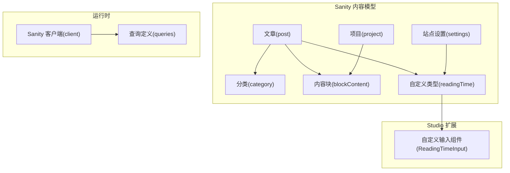
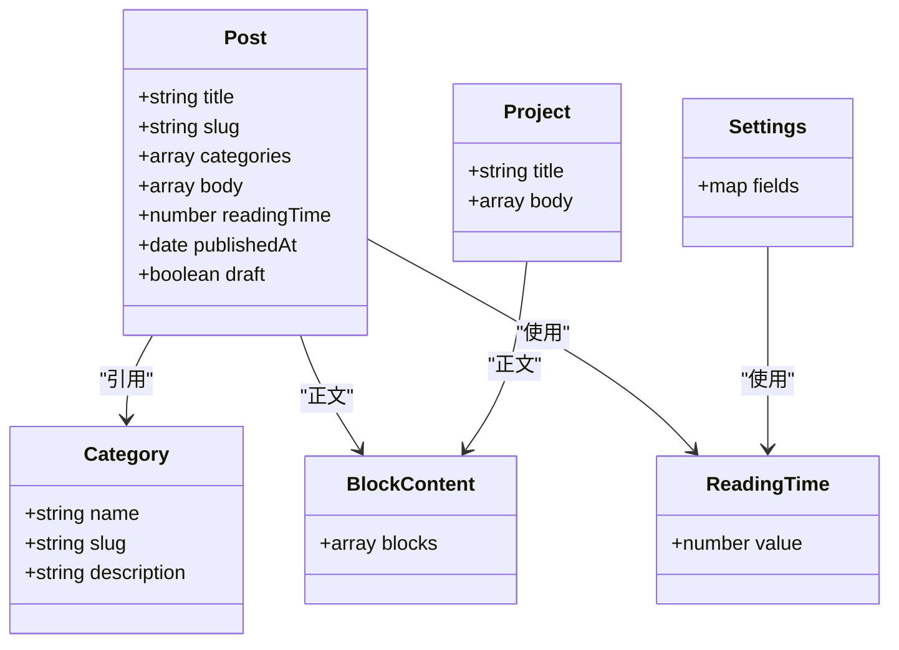
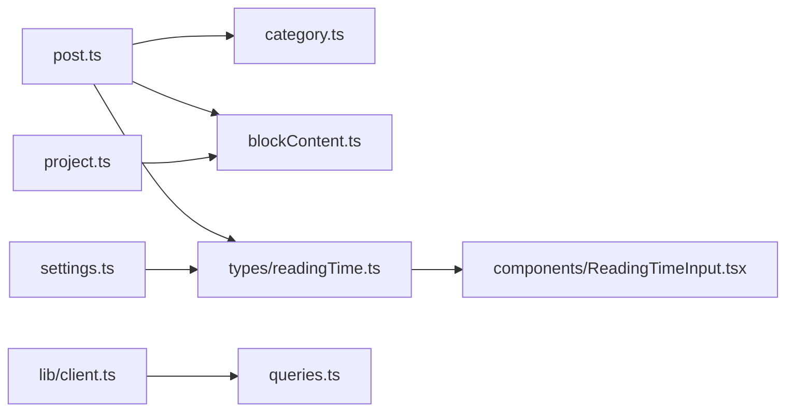

# 内容模型设计

<cite>
**本文引用的文件**   
- [sanity/schemas/post.ts](file://sanity/schemas/post.ts)
- [sanity/schemas/category.ts](file://sanity/schemas/category.ts)
- [sanity/schemas/blockContent.ts](file://sanity/schemas/blockContent.ts)
- [sanity/schemas/project.ts](file://sanity/schemas/project.ts)
- [sanity/schemas/settings.ts](file://sanity/schemas/settings.ts)
- [sanity/schemas/types/readingTime.ts](file://sanity/schemas/types/readingTime.ts)
- [sanity/schema.ts](file://sanity/schema.ts)
- [sanity/components/ReadingTimeInput.tsx](file://sanity/components/ReadingTimeInput.tsx)
- [sanity/lib/client.ts](file://sanity/lib/client.ts)
- [sanity/queries.ts](file://sanity/queries.ts)
</cite>

## 目录
1. [简介](#简介)
2. [项目结构](#项目结构)
3. [核心组件](#核心组件)
4. [架构总览](#架构总览)
5. [详细组件分析](#详细组件分析)
6. [依赖关系分析](#依赖关系分析)
7. [性能考虑](#性能考虑)
8. [故障排查指南](#故障排查指南)
9. [结论](#结论)
10. [附录](#附录)

## 简介
本文件面向博客系统的内容建模，聚焦于 Sanity CMS 中的文章、分类、内容块等核心数据模型。文档将解释字段类型、验证规则、默认值与关联关系，提供 schema 配置示例路径，说明如何扩展自定义字段类型，并给出版本管理、迁移策略与数据完整性约束的实践建议。同时包含最佳实践与性能优化建议，帮助团队在可扩展性与可维护性之间取得平衡。

## 项目结构
Sanity 相关内容集中在 sanity 目录下，其中 schemas 定义了所有文档类型（post、category、blockContent、project、settings），types 下存放自定义输入类型（如 readingTime），components 提供 Studio 侧的自定义输入组件，lib 和 queries 用于客户端查询与工具函数。schema.ts 负责汇总注册所有类型。

图表来源
- [sanity/schemas/post.ts](file://sanity/schemas/post.ts)
- [sanity/schemas/category.ts](file://sanity/schemas/category.ts)
- [sanity/schemas/blockContent.ts](file://sanity/schemas/blockContent.ts)
- [sanity/schemas/project.ts](file://sanity/schemas/project.ts)
- [sanity/schemas/settings.ts](file://sanity/schemas/settings.ts)
- [sanity/schemas/types/readingTime.ts](file://sanity/schemas/types/readingTime.ts)
- [sanity/components/ReadingTimeInput.tsx](file://sanity/components/ReadingTimeInput.tsx)
- [sanity/lib/client.ts](file://sanity/lib/client.ts)
- [sanity/queries.ts](file://sanity/queries.ts)

章节来源
- [sanity/schema.ts](file://sanity/schema.ts)

## 核心组件
本节概述各核心文档类型的职责与关键属性：

- 文章(post)
  - 标题、摘要、封面图、正文（Portable Text）、标签/分类引用、发布时间、状态、阅读时长等
  - 通过 slug 定位文章；正文使用 Portable Text 以支持富文本与内嵌媒体
  - 与分类(category)为多对一或一对多关系（取决于具体实现）
  - 与内容块(blockContent)通过 Portable Text 的 blocks 数组组合
  - 可选阅读时长字段由自定义类型 readingTime 提供

- 分类(category)
  - 名称、slug、描述等基础元信息
  - 被文章引用以实现内容组织

- 内容块(blockContent)
  - Portable Text 的基础块集合，通常包含段落、图片、代码块、列表等
  - 作为文章的正文载体，具备高度可扩展性

- 项目(project)
  - 项目展示所需的基本信息与正文（同样可使用 blockContent）

- 站点设置(settings)
  - 全局站点级配置项，常以单例文档形式存在
  - 可能包含主题、SEO、社交链接等

- 自定义类型 readingTime
  - 基于 number 的自定义输入类型，配合 Studio 自定义输入组件 ReadingTimeInput
  - 用于在编辑时直观地展示或计算阅读时长

章节来源
- [sanity/schemas/post.ts](file://sanity/schemas/post.ts)
- [sanity/schemas/category.ts](file://sanity/schemas/category.ts)
- [sanity/schemas/blockContent.ts](file://sanity/schemas/blockContent.ts)
- [sanity/schemas/project.ts](file://sanity/schemas/project.ts)
- [sanity/schemas/settings.ts](file://sanity/schemas/settings.ts)
- [sanity/schemas/types/readingTime.ts](file://sanity/schemas/types/readingTime.ts)
- [sanity/components/ReadingTimeInput.tsx](file://sanity/components/ReadingTimeInput.tsx)

## 架构总览
下图展示了内容模型之间的关系以及 Studio 与运行时的交互方式。

图表来源
- [sanity/schemas/post.ts](file://sanity/schemas/post.ts)
- [sanity/schemas/category.ts](file://sanity/schemas/category.ts)
- [sanity/schemas/blockContent.ts](file://sanity/schemas/blockContent.ts)
- [sanity/schemas/project.ts](file://sanity/schemas/project.ts)
- [sanity/schemas/settings.ts](file://sanity/schemas/settings.ts)
- [sanity/schemas/types/readingTime.ts](file://sanity/schemas/types/readingTime.ts)

## 详细组件分析

### 文章(post)模型
- 关键字段
  - 标题：字符串，必填
  - 摘要：字符串，可选
  - 封面图：图像对象，可选
  - 正文：Portable Text 数组，必填
  - 分类：引用到 category 文档，可为空或多选
  - 发布时间：日期时间，可选
  - 草稿状态：布尔，控制发布流程
  - 阅读时长：自定义类型 readingTime，数值型
- 验证与默认值
  - 标题与正文通常需要非空校验
  - 草稿状态默认 false
  - 阅读时长默认 0 或根据正文自动计算（若实现自动化）
- 关联关系
  - 与 category 为引用关系，便于按分类聚合文章
  - 与 blockContent 通过 Portable Text 组合
- 扩展点
  - 可在 post 上增加 SEO 字段（如 og:image、description）
  - 可增加作者、标签、系列等维度

章节来源
- [sanity/schemas/post.ts](file://sanity/schemas/post.ts)

### 分类(category)模型
- 关键字段
  - 名称：字符串，必填
  - 标识符(slug)：字符串，唯一且可读
  - 描述：字符串，可选
- 用途
  - 作为文章的组织维度，便于导航与筛选
- 注意事项
  - slug 需保持唯一，避免冲突
  - 建议在 Studio 中启用 slug 自动生成与校验

章节来源
- [sanity/schemas/category.ts](file://sanity/schemas/category.ts)

### 内容块(blockContent)模型
- 关键字段
  - blocks：Portable Text 数组，包含多种块类型（段落、图片、代码块、列表等）
- 特点
  - 高度灵活，适合长文与富媒体场景
  - 可通过新增块类型进行扩展
- 性能建议
  - 合理拆分大块内容，避免单次加载过大
  - 图片资源建议使用 CDN 与懒加载

章节来源
- [sanity/schemas/blockContent.ts](file://sanity/schemas/blockContent.ts)

### 项目(project)模型
- 关键字段
  - 标题：字符串
  - 正文：Portable Text 数组
- 用途
  - 展示项目详情，结构与文章类似但更简洁
- 扩展点
  - 可增加技术栈、链接、时间线等字段

章节来源
- [sanity/schemas/project.ts](file://sanity/schemas/project.ts)

### 站点设置(settings)模型
- 关键字段
  - 站点级配置项，通常为 map 结构，包含主题、SEO、社交链接等
- 模式
  - 一般以单例文档形式存在，便于集中管理
- 安全与权限
  - 敏感配置应限制访问权限

章节来源
- [sanity/schemas/settings.ts](file://sanity/schemas/settings.ts)

### 自定义类型 readingTime
- 类型定义
  - 基于 number 的自定义输入类型，用于表示阅读时长
- Studio 集成
  - 配套自定义输入组件 ReadingTimeInput，提升编辑体验
- 使用位置
  - 在 post 与 settings 中均可引用该类型

章节来源
- [sanity/schemas/types/readingTime.ts](file://sanity/schemas/types/readingTime.ts)
- [sanity/components/ReadingTimeInput.tsx](file://sanity/components/ReadingTimeInput.tsx)

### 自定义字段类型扩展指南
- 步骤概览
  - 在 types 目录下定义新的自定义类型（例如基于 string、number、object 等）
  - 在 components 目录下创建对应的 Studio 输入组件
  - 在 schema.ts 中注册新类型
  - 在需要的文档类型中引用该自定义类型
- 示例参考
  - 参考 readingTime 的类型与组件实现，复制并修改为新类型
- 注意事项
  - 确保输入组件与类型定义保持一致
  - 为复杂类型编写合理的默认值与校验逻辑

章节来源
- [sanity/schemas/types/readingTime.ts](file://sanity/schemas/types/readingTime.ts)
- [sanity/components/ReadingTimeInput.tsx](file://sanity/components/ReadingTimeInput.tsx)
- [sanity/schema.ts](file://sanity/schema.ts)

## 依赖关系分析
- 模块耦合
  - post 依赖 category 与 blockContent
  - project 依赖 blockContent
  - settings 与 post 均依赖 readingTime 类型
  - readingTime 类型依赖 ReadingTimeInput 组件
- 运行时依赖
  - 客户端通过 lib/client.ts 连接 Sanity
  - queries.ts 定义常用查询，供页面与服务端渲染使用

图表来源
- [sanity/schemas/post.ts](file://sanity/schemas/post.ts)
- [sanity/schemas/category.ts](file://sanity/schemas/category.ts)
- [sanity/schemas/blockContent.ts](file://sanity/schemas/blockContent.ts)
- [sanity/schemas/project.ts](file://sanity/schemas/project.ts)
- [sanity/schemas/settings.ts](file://sanity/schemas/settings.ts)
- [sanity/schemas/types/readingTime.ts](file://sanity/schemas/types/readingTime.ts)
- [sanity/components/ReadingTimeInput.tsx](file://sanity/components/ReadingTimeInput.tsx)
- [sanity/lib/client.ts](file://sanity/lib/client.ts)
- [sanity/queries.ts](file://sanity/queries.ts)

章节来源
- [sanity/schema.ts](file://sanity/schema.ts)
- [sanity/lib/client.ts](file://sanity/lib/client.ts)
- [sanity/queries.ts](file://sanity/queries.ts)

## 性能考虑
- 查询优化
  - 按需选择字段，避免一次性拉取大对象
  - 使用增量更新与缓存策略（结合 Next.js 缓存机制）
- 内容体积控制
  - 将大型正文拆分为多个文档或使用分页
  - 图片使用压缩与 CDN，并在前端懒加载
- 索引与过滤
  - 为高频过滤字段建立索引（如 slug、publishedAt）
  - 减少深层嵌套查询，尽量扁平化数据结构
- 构建期预取
  - 在静态生成阶段预取必要数据，降低运行时延迟

[本节为通用指导，不直接分析具体文件]

## 故障排查指南
- 常见问题
  - 字段缺失或未定义：检查 schema 注册与类型引用是否正确
  - 自定义输入组件不生效：确认组件路径与类型定义一致
  - 查询失败或超时：检查网络与客户端配置，必要时简化查询
- 调试建议
  - 在 Studio 中查看文档校验错误提示
  - 使用 Sanity CLI 检查 schema 一致性
  - 在浏览器控制台观察 GraphQL/REST 请求响应

章节来源
- [sanity/lib/client.ts](file://sanity/lib/client.ts)
- [sanity/queries.ts](file://sanity/queries.ts)

## 结论
通过对文章、分类、内容块、项目与站点设置的模型分析与关系梳理，并结合自定义类型 readingTime 的扩展实践，可以构建出高内聚、低耦合且易于演进的内容体系。遵循本文的最佳实践与性能建议，有助于提升编辑体验与前端渲染效率。

[本节为总结性内容，不直接分析具体文件]

## 附录
- 版本管理与迁移策略
  - 在 schema 变更时记录变更日志，确保向后兼容
  - 对已有数据进行批量迁移脚本处理，避免破坏性更新
  - 使用分支策略管理 schema 演进，合并前充分测试
- 数据完整性约束
  - 为关键字段添加必填与非空校验
  - 使用唯一性约束防止重复数据
  - 对外部引用进行存在性校验，避免悬空指针
- 内容建模最佳实践
  - 优先使用 Portable Text 表达富文本
  - 将可复用片段抽象为独立类型，提高复用率
  - 保持字段命名规范与语义清晰

[本节为概念性内容，不直接分析具体文件]