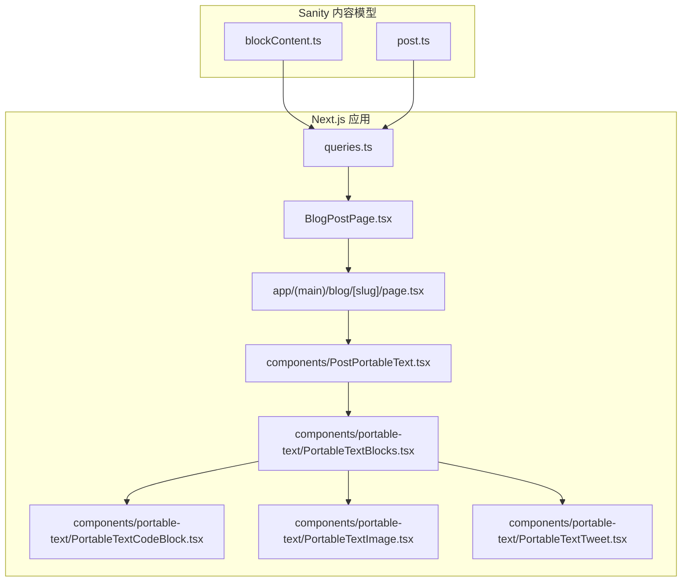
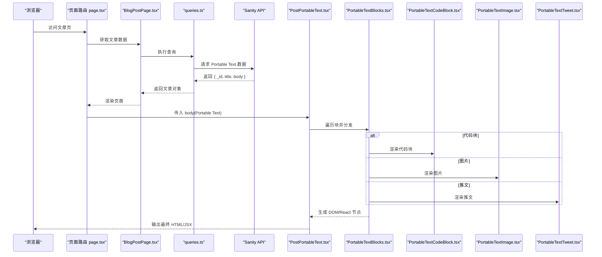
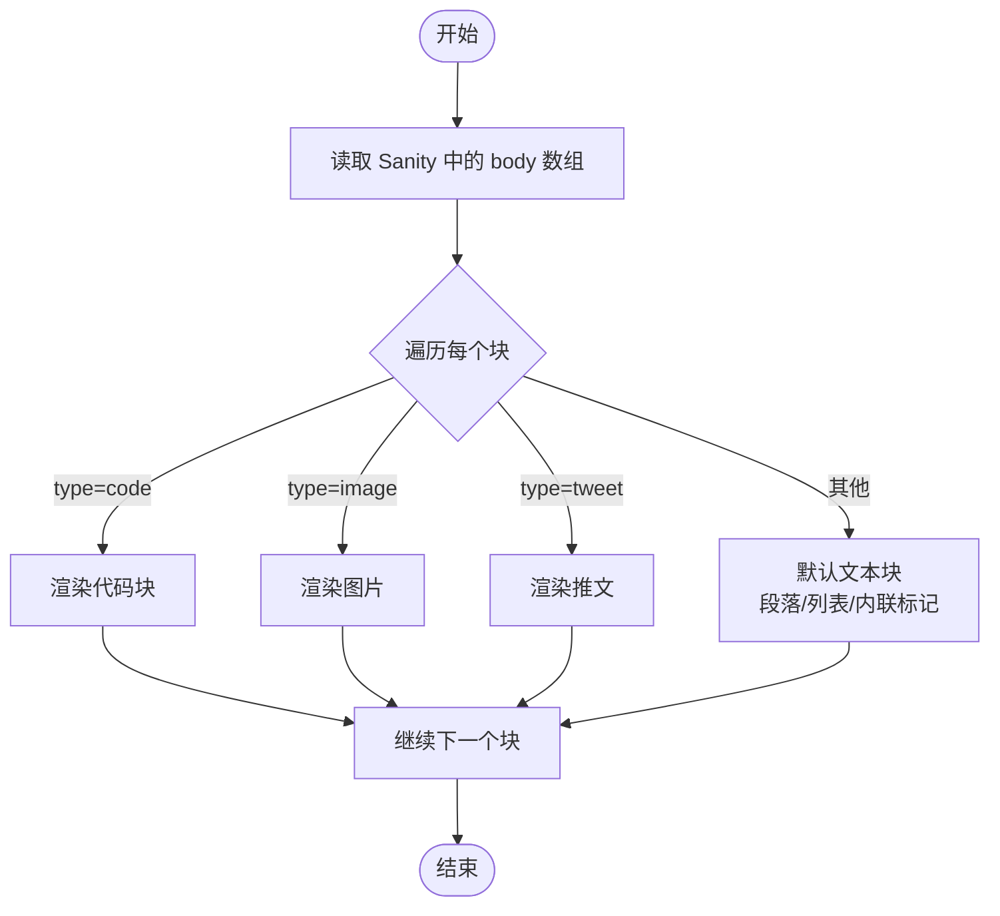
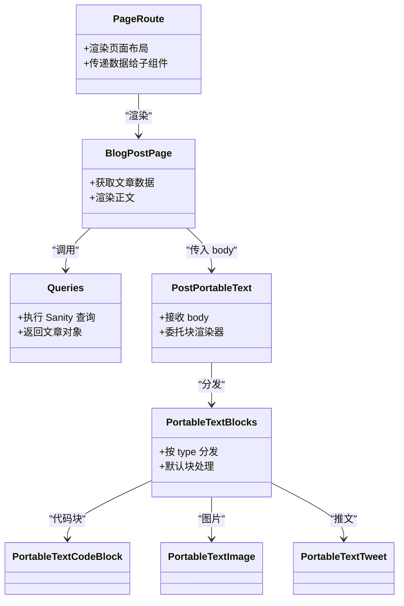
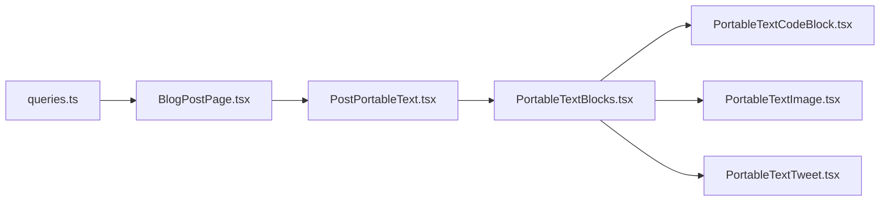

# Portable Text 核心渲染器

<cite>
**本文引用的文件**   
- [PostPortableText.tsx](file://components/PostPortableText.tsx)
- [PortableTextBlocks.tsx](file://components/portable-text/PortableTextBlocks.tsx)
- [PortableTextCodeBlock.tsx](file://components/portable-text/PortableTextCodeBlock.tsx)
- [PortableTextImage.tsx](file://components/portable-text/PortableTextImage.tsx)
- [PortableTextTweet.tsx](file://components/portable-text/PortableTextTweet.tsx)
- [blockContent.ts](file://sanity/schemas/blockContent.ts)
- [post.ts](file://sanity/schemas/post.ts)
- [queries.ts](file://sanity/queries.ts)
- [BlogPostPage.tsx](file://app/(main)/blog/BlogPostPage.tsx)
- [page.tsx](file://app/(main)/blog/[slug]/page.tsx)
</cite>

## 目录
1. [简介](#简介)
2. [项目结构](#项目结构)
3. [核心组件](#核心组件)
4. [架构总览](#架构总览)
5. [详细组件分析](#详细组件分析)
6. [依赖关系分析](#依赖关系分析)
7. [性能考虑](#性能考虑)
8. [故障排查指南](#故障排查指南)
9. [结论](#结论)
10. [附录](#附录)

## 简介
本文件面向使用 Sanity CMS 与 Next.js 的项目，系统化梳理 Portable Text 的核心渲染流程。内容涵盖：
- Portable Text 的数据结构与解析机制（文本块、内联标记、列表）
- 渲染器的配置项、样式定制与主题支持
- 性能优化策略、缓存机制与错误处理
- 具体使用示例与自定义渲染器开发指南
- 与 Sanity CMS 的集成方式与数据转换流程

## 项目结构
本项目将 Portable Text 的渲染逻辑集中在 components/portable-text 下，并通过 PostPortableText.tsx 作为页面级入口进行组合渲染；Sanity 侧通过 schemas 定义 blockContent 等类型，并在查询中拉取 Portable Text 数据，最终在页面中渲染。

图表来源
- [blockContent.ts](file://sanity/schemas/blockContent.ts)
- [post.ts](file://sanity/schemas/post.ts)
- [queries.ts](file://sanity/queries.ts)
- [BlogPostPage.tsx](file://app/(main)/blog/BlogPostPage.tsx)
- [page.tsx](file://app/(main)/blog/[slug]/page.tsx)
- [PostPortableText.tsx](file://components/PostPortableText.tsx)
- [PortableTextBlocks.tsx](file://components/portable-text/PortableTextBlocks.tsx)
- [PortableTextCodeBlock.tsx](file://components/portable-text/PortableTextCodeBlock.tsx)
- [PortableTextImage.tsx](file://components/portable-text/PortableTextImage.tsx)
- [PortableTextTweet.tsx](file://components/portable-text/PortableTextTweet.tsx)

章节来源
- [PostPortableText.tsx](file://components/PostPortableText.tsx)
- [PortableTextBlocks.tsx](file://components/portable-text/PortableTextBlocks.tsx)
- [PortableTextCodeBlock.tsx](file://components/portable-text/PortableTextCodeBlock.tsx)
- [PortableTextImage.tsx](file://components/portable-text/PortableTextImage.tsx)
- [PortableTextTweet.tsx](file://components/portable-text/PortableTextTweet.tsx)
- [blockContent.ts](file://sanity/schemas/blockContent.ts)
- [post.ts](file://sanity/schemas/post.ts)
- [queries.ts](file://sanity/queries.ts)
- [BlogPostPage.tsx](file://app/(main)/blog/BlogPostPage.tsx)
- [page.tsx](file://app/(main)/blog/[slug]/page.tsx)

## 核心组件
- PostPortableText.tsx：页面级组合器，负责接收来自 Sanity 的 Portable Text 数据并交由子组件完成渲染。
- PortableTextBlocks.tsx：Portable Text 的“块”渲染器，按块类型分发到对应渲染器（如代码块、图片、推文等）。
- PortableTextCodeBlock.tsx：代码块渲染器，通常结合语法高亮与复制功能。
- PortableTextImage.tsx：图片渲染器，负责图片尺寸、占位、懒加载与链接行为。
- PortableTextTweet.tsx：推文嵌入渲染器，负责安全嵌入与响应式布局。

章节来源
- [PostPortableText.tsx](file://components/PostPortableText.tsx)
- [PortableTextBlocks.tsx](file://components/portable-text/PortableTextBlocks.tsx)
- [PortableTextCodeBlock.tsx](file://components/portable-text/PortableTextCodeBlock.tsx)
- [PortableTextImage.tsx](file://components/portable-text/PortableTextImage.tsx)
- [PortableTextTweet.tsx](file://components/portable-text/PortableTextTweet.tsx)

## 架构总览
下图展示了从 Sanity 查询到前端渲染的关键路径，以及各组件间的调用关系。

图表来源
- [page.tsx](file://app/(main)/blog/[slug]/page.tsx)
- [BlogPostPage.tsx](file://app/(main)/blog/BlogPostPage.tsx)
- [queries.ts](file://sanity/queries.ts)
- [PostPortableText.tsx](file://components/PostPortableText.tsx)
- [PortableTextBlocks.tsx](file://components/portable-text/PortableTextBlocks.tsx)
- [PortableTextCodeBlock.tsx](file://components/portable-text/PortableTextCodeBlock.tsx)
- [PortableTextImage.tsx](file://components/portable-text/PortableTextImage.tsx)
- [PortableTextTweet.tsx](file://components/portable-text/PortableTextTweet.tsx)

## 详细组件分析

### 数据模型与解析机制
- 数据模型
  - Sanity 侧通过 blockContent 定义 Portable Text 的结构，包含段落、列表、内联标记、引用、图片、代码块等。
  - post 文档中包含 body 字段，类型为 blockContent[]，即 Portable Text 数组。
- 解析与渲染
  - 页面层通过 queries.ts 拉取 body 数据。
  - PostPortableText.tsx 将 body 传递给 PortableTextBlocks.tsx。
  - PortableTextBlocks.tsx 根据每个块的 type 分派到对应的渲染器（如 code、image、tweet 等），并对默认文本块进行段落、列表与内联标记的递归渲染。

图表来源
- [blockContent.ts](file://sanity/schemas/blockContent.ts)
- [post.ts](file://sanity/schemas/post.ts)
- [queries.ts](file://sanity/queries.ts)
- [PostPortableText.tsx](file://components/PostPortableText.tsx)
- [PortableTextBlocks.tsx](file://components/portable-text/PortableTextBlocks.tsx)

章节来源
- [blockContent.ts](file://sanity/schemas/blockContent.ts)
- [post.ts](file://sanity/schemas/post.ts)
- [queries.ts](file://sanity/queries.ts)
- [PostPortableText.tsx](file://components/PostPortableText.tsx)
- [PortableTextBlocks.tsx](file://components/portable-text/PortableTextBlocks.tsx)

### 文本块、内联标记与列表的处理逻辑
- 文本块
  - 默认块通常为段落，支持多行文本与换行。
  - 列表块支持有序/无序列表，内部可嵌套。
- 内联标记
  - 常见内联包括粗体、斜体、删除线、链接等。
  - 内联标记在段落或列表项中进行递归渲染，保持层级正确性。
- 列表
  - 列表项可包含多个文本块与内联标记。
  - 列表与文本块之间通过统一的渲染管线进行组合。

章节来源
- [PortableTextBlocks.tsx](file://components/portable-text/PortableTextBlocks.tsx)

### 代码块渲染器
- 职责
  - 解析代码语言、内容，提供语法高亮与可选的复制按钮。
  - 适配不同主题下的配色与字体。
- 关键点
  - 语言检测与映射
  - 高亮库集成与按需加载
  - 无障碍与键盘交互

章节来源
- [PortableTextCodeBlock.tsx](file://components/portable-text/PortableTextCodeBlock.tsx)

### 图片渲染器
- 职责
  - 根据图片元数据计算最佳尺寸、占位图与懒加载策略。
  - 支持点击放大、外链跳转等交互。
- 关键点
  - 响应式图片与格式选择
  - 占位与骨架屏
  - 跨域与 CDN 优化

章节来源
- [PortableTextImage.tsx](file://components/portable-text/PortableTextImage.tsx)

### 推文渲染器
- 职责
  - 安全地嵌入 Twitter/X 推文，处理加载失败与降级展示。
- 关键点
  - 第三方脚本异步加载
  - 主题适配与尺寸自适应
  - 错误边界与重试策略

章节来源
- [PortableTextTweet.tsx](file://components/portable-text/PortableTextTweet.tsx)

### 页面集成与数据流
- 页面路由 page.tsx 负责组装页面所需数据与布局。
- BlogPostPage.tsx 聚焦于文章详情，调用 queries.ts 获取 body 并交给 PostPortableText.tsx 渲染。
- 数据流遵循“查询 -> 组合 -> 渲染”的单向数据流。

图表来源
- [page.tsx](file://app/(main)/blog/[slug]/page.tsx)
- [BlogPostPage.tsx](file://app/(main)/blog/BlogPostPage.tsx)
- [queries.ts](file://sanity/queries.ts)
- [PostPortableText.tsx](file://components/PostPortableText.tsx)
- [PortableTextBlocks.tsx](file://components/portable-text/PortableTextBlocks.tsx)
- [PortableTextCodeBlock.tsx](file://components/portable-text/PortableTextCodeBlock.tsx)
- [PortableTextImage.tsx](file://components/portable-text/PortableTextImage.tsx)
- [PortableTextTweet.tsx](file://components/portable-text/PortableTextTweet.tsx)

章节来源
- [page.tsx](file://app/(main)/blog/[slug]/page.tsx)
- [BlogPostPage.tsx](file://app/(main)/blog/BlogPostPage.tsx)
- [queries.ts](file://sanity/queries.ts)
- [PostPortableText.tsx](file://components/PostPortableText.tsx)
- [PortableTextBlocks.tsx](file://components/portable-text/PortableTextBlocks.tsx)

## 依赖关系分析
- 模块耦合
  - PostPortableText.tsx 仅负责编排，低耦合。
  - PortableTextBlocks.tsx 是核心分发器，对各类渲染器有直接依赖。
  - 各渲染器相对独立，便于替换与扩展。
- 外部依赖
  - Sanity 客户端用于查询内容。
  - 第三方库（如高亮、图片优化、社交嵌入）按需引入。

图表来源
- [PostPortableText.tsx](file://components/PostPortableText.tsx)
- [PortableTextBlocks.tsx](file://components/portable-text/PortableTextBlocks.tsx)
- [PortableTextCodeBlock.tsx](file://components/portable-text/PortableTextCodeBlock.tsx)
- [PortableTextImage.tsx](file://components/portable-text/PortableTextImage.tsx)
- [PortableTextTweet.tsx](file://components/portable-text/PortableTextTweet.tsx)
- [queries.ts](file://sanity/queries.ts)
- [BlogPostPage.tsx](file://app/(main)/blog/BlogPostPage.tsx)

章节来源
- [PostPortableText.tsx](file://components/PostPortableText.tsx)
- [PortableTextBlocks.tsx](file://components/portable-text/PortableTextBlocks.tsx)
- [PortableTextCodeBlock.tsx](file://components/portable-text/PortableTextCodeBlock.tsx)
- [PortableTextImage.tsx](file://components/portable-text/PortableTextImage.tsx)
- [PortableTextTweet.tsx](file://components/portable-text/PortableTextTweet.tsx)
- [queries.ts](file://sanity/queries.ts)
- [BlogPostPage.tsx](file://app/(main)/blog/BlogPostPage.tsx)

## 性能考虑
- 渲染性能
  - 避免在渲染循环中创建闭包或大对象，减少重渲染。
  - 对长文内容进行分页或虚拟滚动（如需）。
- 资源加载
  - 图片懒加载与按需解码，优先使用现代格式与合适的尺寸。
  - 第三方脚本（如推文）延迟加载与错误降级。
- 缓存策略
  - 利用 Next.js 的构建时/运行时缓存与 ISR 提升首屏速度。
  - 对静态资源与查询结果设置合理缓存头。
- 主题与样式
  - 通过 CSS 变量或主题上下文统一样式，减少重复计算。
  - 按需注入高亮样式，避免全局污染。

[本节为通用指导，不直接分析具体文件]

## 故障排查指南
- 常见问题
  - 图片无法显示：检查图片 URL、CDN 权限与 CORS 配置。
  - 代码块无高亮：确认语言映射与高亮库是否正确加载。
  - 推文不渲染：检查网络环境、第三方脚本加载状态与错误边界。
- 调试建议
  - 在 PortableTextBlocks.tsx 的分发处打印块类型与关键属性，定位异常块。
  - 对渲染器增加错误边界，捕获并回退到友好提示。
  - 使用浏览器开发者工具的网络面板与性能面板分析瓶颈。

章节来源
- [PortableTextBlocks.tsx](file://components/portable-text/PortableTextBlocks.tsx)
- [PortableTextCodeBlock.tsx](file://components/portable-text/PortableTextCodeBlock.tsx)
- [PortableTextImage.tsx](file://components/portable-text/PortableTextImage.tsx)
- [PortableTextTweet.tsx](file://components/portable-text/PortableTextTweet.tsx)

## 结论
通过将 Portable Text 的渲染拆分为独立的块渲染器，并结合 Sanity 的内容模型与查询，本项目实现了灵活、可扩展且高性能的富文本渲染方案。后续可在不改动上层页面的前提下，持续扩展新的块类型与主题能力。

[本节为总结，不直接分析具体文件]

## 附录

### 配置选项与样式定制
- 配置项
  - 在 PostPortableText.tsx 或 PortableTextBlocks.tsx 中集中管理渲染器映射与默认配置。
  - 针对图片、代码块、推文等分别提供可选参数（如尺寸、主题、是否允许外链等）。
- 样式定制
  - 通过 CSS 类名或主题上下文控制排版、颜色与间距。
  - 为代码块与图片提供暗色/亮色两套样式。

章节来源
- [PostPortableText.tsx](file://components/PostPortableText.tsx)
- [PortableTextBlocks.tsx](file://components/portable-text/PortableTextBlocks.tsx)

### 自定义渲染器开发指南
- 步骤
  - 新增渲染器组件（例如 NewBlock.tsx），实现 props 接口与渲染逻辑。
  - 在 PortableTextBlocks.tsx 中添加新类型的分发分支。
  - 在 PostPortableText.tsx 中注册必要的上下文或配置。
- 注意事项
  - 保证可访问性与键盘交互。
  - 处理空值与异常输入，提供降级展示。
  - 避免阻塞主线程，必要时拆分异步任务。

章节来源
- [PortableTextBlocks.tsx](file://components/portable-text/PortableTextBlocks.tsx)
- [PostPortableText.tsx](file://components/PostPortableText.tsx)

### 与 Sanity CMS 的集成与数据转换
- 数据模型
  - blockContent.ts 定义 Portable Text 的结构。
  - post.ts 定义文章文档，其中 body 字段为 blockContent[]。
- 查询与转换
  - queries.ts 定义查询语句，拉取 body 数据。
  - 页面层将 body 直接传给渲染器，无需额外转换。
- 发布与预览
  - 在生产与预览模式下使用不同的 Sanity 客户端配置。
  - 结合 Next.js 的缓存策略提升性能。

章节来源
- [blockContent.ts](file://sanity/schemas/blockContent.ts)
- [post.ts](file://sanity/schemas/post.ts)
- [queries.ts](file://sanity/queries.ts)
- [BlogPostPage.tsx](file://app/(main)/blog/BlogPostPage.tsx)
- [page.tsx](file://app/(main)/blog/[slug]/page.tsx)