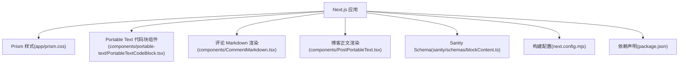
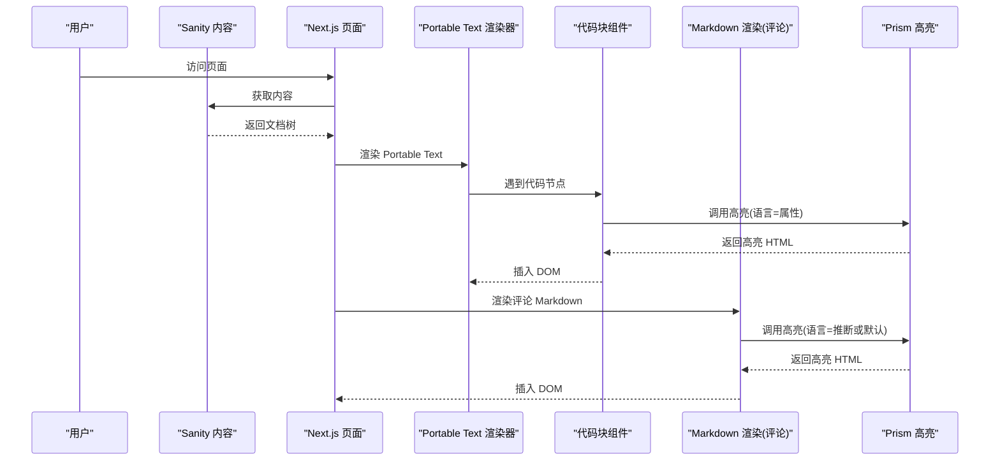
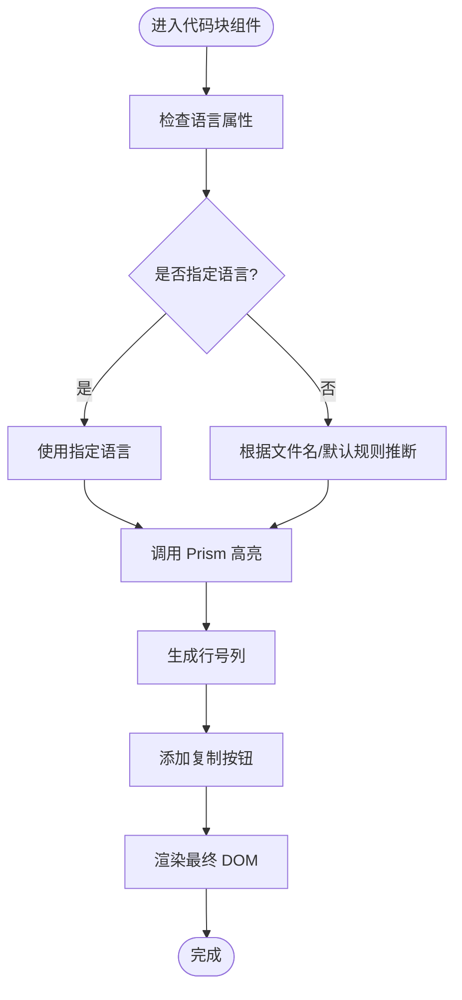
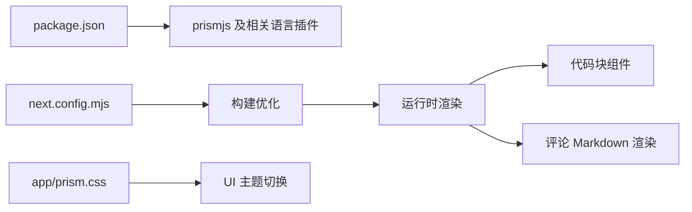

# 代码高亮系统

<cite>
**本文引用的文件**   
- [package.json](file://package.json)
- [next.config.mjs](file://next.config.mjs)
- [app/prism.css](file://app/prism.css)
- [components/portable-text/PortableTextCodeBlock.tsx](file://components/portable-text/PortableTextCodeBlock.tsx)
- [components/CommentMarkdown.tsx](file://components/CommentMarkdown.tsx)
- [components/PostPortableText.tsx](file://components/PostPortableText.tsx)
- [sanity/schemas/blockContent.ts](file://sanity/schemas/blockContent.ts)
</cite>

## 目录
1. [简介](#简介)
2. [项目结构](#项目结构)
3. [核心组件](#核心组件)
4. [架构总览](#架构总览)
5. [详细组件分析](#详细组件分析)
6. [依赖关系分析](#依赖关系分析)
7. [性能考虑](#性能考虑)
8. [故障排查指南](#故障排查指南)
9. [结论](#结论)
10. [附录](#附录)

## 简介
本文件面向“代码高亮系统”的集成与扩展，聚焦于在 Next.js + Sanity 的内容生态中，如何基于 Prism.js 实现：
- 语言检测与语法高亮
- 主题切换机制
- 代码块渲染流程（含行号、复制按钮）
- 自定义语言支持与主题定制
- 与编辑器（Sanity Portable Text）集成的最佳实践与安全考量
- 性能优化策略与可观测性建议

## 项目结构
本项目采用 Next.js App Router 组织页面与组件，内容通过 Sanity 管理。代码高亮相关的关键位置包括：
- 样式入口：应用级 Prism 主题样式
- 内容渲染：Portable Text 中的代码块渲染组件
- Markdown 评论渲染：评论区的 Markdown 解析与高亮
- 配置与依赖：Next.js 构建配置与包依赖声明

图表来源
- [app/prism.css](file://app/prism.css)
- [components/portable-text/PortableTextCodeBlock.tsx](file://components/portable-text/PortableTextCodeBlock.tsx)
- [components/CommentMarkdown.tsx](file://components/CommentMarkdown.tsx)
- [components/PostPortableText.tsx](file://components/PostPortableText.tsx)
- [sanity/schemas/blockContent.ts](file://sanity/schemas/blockContent.ts)
- [next.config.mjs](file://next.config.mjs)
- [package.json](file://package.json)

章节来源
- [app/prism.css](file://app/prism.css)
- [components/portable-text/PortableTextCodeBlock.tsx](file://components/portable-text/PortableTextCodeBlock.tsx)
- [components/CommentMarkdown.tsx](file://components/CommentMarkdown.tsx)
- [components/PostPortableText.tsx](file://components/PostPortableText.tsx)
- [sanity/schemas/blockContent.ts](file://sanity/schemas/blockContent.ts)
- [next.config.mjs](file://next.config.mjs)
- [package.json](file://package.json)

## 核心组件
- 代码块渲染组件：负责将 Portable Text 中的代码节点转换为带语言标识的代码块，并触发高亮、行号与复制功能。
- 评论 Markdown 渲染：对评论中的 Markdown 进行解析，并在客户端执行高亮。
- 博客正文渲染：在文章页渲染 Portable Text，复用代码块渲染逻辑。
- 主题样式：提供 Prism 主题 CSS，支持暗色/亮色主题切换。

章节来源
- [components/portable-text/PortableTextCodeBlock.tsx](file://components/portable-text/PortableTextCodeBlock.tsx)
- [components/CommentMarkdown.tsx](file://components/CommentMarkdown.tsx)
- [components/PostPortableText.tsx](file://components/PostPortableText.tsx)
- [app/prism.css](file://app/prism.css)

## 架构总览
整体数据流从内容源（Sanity）到前端渲染，再到 Prism 高亮与交互增强：

图表来源
- [components/portable-text/PortableTextCodeBlock.tsx](file://components/portable-text/PortableTextCodeBlock.tsx)
- [components/CommentMarkdown.tsx](file://components/CommentMarkdown.tsx)
- [components/PostPortableText.tsx](file://components/PostPortableText.tsx)

## 详细组件分析

### 代码块渲染组件（Portable Text）
职责
- 接收来自 Portable Text 的代码节点，提取语言标识与文本内容
- 在客户端调用 Prism 进行高亮
- 可选：注入行号与复制按钮
- 处理错误与降级（无语言时回退为纯文本）

关键流程
- 语言检测：优先使用节点属性中的语言；若为空则根据文件名后缀或默认规则推断
- 高亮时机：在组件挂载后执行，确保 Prism 已加载
- 行号生成：按换行符计数生成行号列
- 复制功能：点击复制按钮，将原始文本写入剪贴板并提供反馈

图表来源
- [components/portable-text/PortableTextCodeBlock.tsx](file://components/portable-text/PortableTextCodeBlock.tsx)

章节来源
- [components/portable-text/PortableTextCodeBlock.tsx](file://components/portable-text/PortableTextCodeBlock.tsx)

### 评论 Markdown 渲染
职责
- 解析评论中的 Markdown 片段
- 识别代码块并调用 Prism 高亮
- 保持安全过滤（仅允许安全的 HTML 标签）

注意
- 评论场景通常不携带显式语言，需依赖 Prism 的语言检测或设置默认语言
- 需要避免 XSS，确保只渲染白名单内的标签

章节来源
- [components/CommentMarkdown.tsx](file://components/CommentMarkdown.tsx)

### 博客正文渲染（Portable Text）
职责
- 在文章页渲染完整的 Portable Text 文档
- 复用代码块渲染组件，保证一致的高亮体验
- 与目录、反应等模块协作

章节来源
- [components/PostPortableText.tsx](file://components/PostPortableText.tsx)

### 主题样式与切换
职责
- 引入 Prism 主题 CSS
- 配合全局主题上下文（如 Tailwind 的 dark 模式）切换主题类名
- 提供暗色/亮色两套配色方案

章节来源
- [app/prism.css](file://app/prism.css)

## 依赖关系分析
- 构建与运行时依赖
  - package.json 中声明了 Prism 相关依赖（例如 prismjs 及可能的语言插件）
  - next.config.mjs 可能包含静态资源或字体优化配置，间接影响高亮渲染性能
- 运行时依赖
  - 代码块组件在客户端调用 Prism API
  - 评论 Markdown 渲染在客户端执行高亮
  - 主题样式由应用层引入并随主题切换生效

图表来源
- [package.json](file://package.json)
- [next.config.mjs](file://next.config.mjs)
- [components/portable-text/PortableTextCodeBlock.tsx](file://components/portable-text/PortableTextCodeBlock.tsx)
- [components/CommentMarkdown.tsx](file://components/CommentMarkdown.tsx)
- [app/prism.css](file://app/prism.css)

章节来源
- [package.json](file://package.json)
- [next.config.mjs](file://next.config.mjs)

## 性能考虑
- 按需加载语言
  - 仅引入实际使用的语言插件，减少首屏体积
- 延迟高亮
  - 在可见区域再触发高亮（IntersectionObserver），降低首屏计算成本
- 缓存结果
  - 对相同内容与语言的代码块缓存高亮结果，避免重复计算
- 合并与去重
  - 同一页面内重复代码块可共享高亮结果
- 样式与字体
  - 预加载主题字体，避免闪烁
- 服务端预处理
  - 对长文代码块在服务端预高亮，减少客户端压力（需权衡安全性与复杂度）

[本节为通用指导，无需具体文件引用]

## 故障排查指南
常见问题与定位方法
- 高亮未生效
  - 确认 Prism 已在客户端加载
  - 检查代码块是否带有正确的语言标识
  - 验证主题 CSS 是否正确引入
- 行号显示异常
  - 检查行号生成逻辑是否匹配换行符
  - 确认容器样式未破坏布局
- 复制失败
  - 检查浏览器权限与剪贴板 API 可用性
  - 在非 HTTPS 环境下可能出现限制
- 安全风险
  - 评论 Markdown 渲染需严格白名单过滤
  - 避免直接拼接不可信 HTML

章节来源
- [components/CommentMarkdown.tsx](file://components/CommentMarkdown.tsx)
- [components/portable-text/PortableTextCodeBlock.tsx](file://components/portable-text/PortableTextCodeBlock.tsx)

## 结论
通过在 Next.js 应用中集成 Prism.js，并结合 Portable Text 与 Markdown 渲染管线，可实现稳定、可扩展的代码高亮能力。围绕语言检测、主题切换、行号与复制功能的完善，以及按需加载与缓存优化，可在保证用户体验的同时兼顾性能与安全。建议在内容建模阶段明确语言字段，统一高亮行为，并通过测试覆盖常见边界情况。

[本节为总结性内容，无需具体文件引用]

## 附录

### 配置示例与扩展开发指南
- 启用特定语言
  - 在依赖中安装对应语言插件，并在代码块组件中按需导入
- 自定义语言
  - 参考 Prism 官方扩展方式，注册新的语言定义并在组件中使用
- 主题定制
  - 替换 app/prism.css 的主题样式，或通过 CSS 变量覆盖颜色
- 与编辑器集成（Sanity）
  - 在 blockContent 模式中为代码块增加语言字段，便于前端准确高亮
  - 校验与提示：在编辑器侧提供语言下拉选择与自动推断

章节来源
- [sanity/schemas/blockContent.ts](file://sanity/schemas/blockContent.ts)
- [components/portable-text/PortableTextCodeBlock.tsx](file://components/portable-text/PortableTextCodeBlock.tsx)
- [app/prism.css](file://app/prism.css)