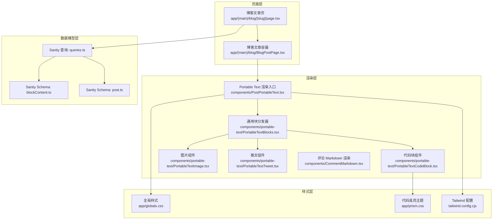
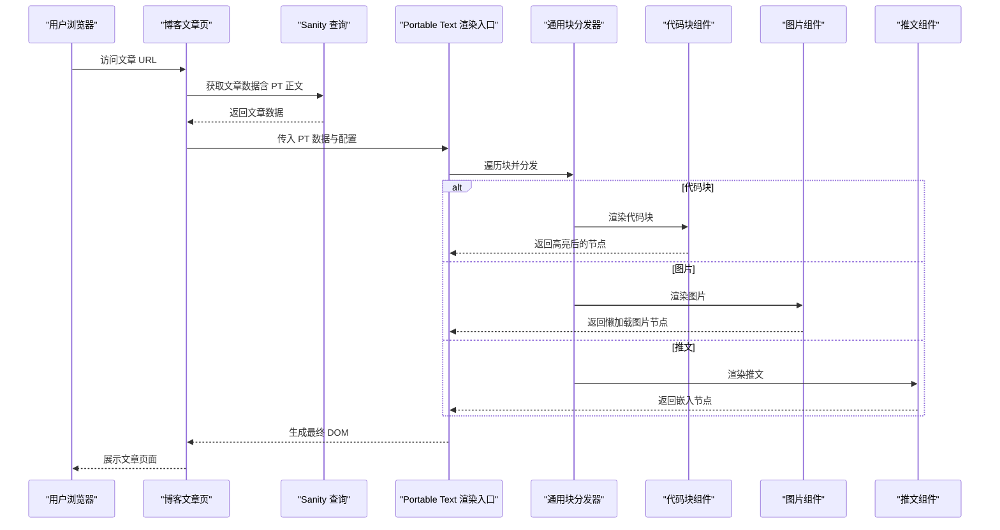
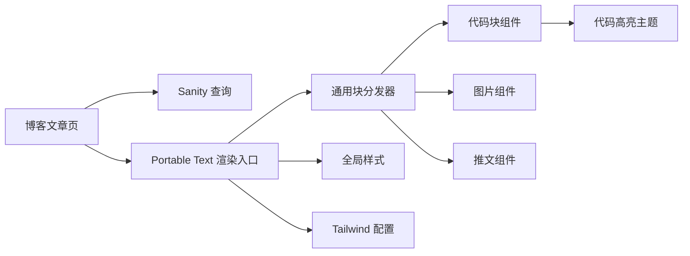

# 内容渲染引擎

<cite>
**本文引用的文件**   
- [PostPortableText.tsx](file://components/PostPortableText.tsx)
- [PortableTextBlocks.tsx](file://components/portable-text/PortableTextBlocks.tsx)
- [PortableTextCodeBlock.tsx](file://components/portable-text/PortableTextCodeBlock.tsx)
- [PortableTextImage.tsx](file://components/portable-text/PortableTextImage.tsx)
- [PortableTextTweet.tsx](file://components/portable-text/PortableTextTweet.tsx)
- [CommentMarkdown.tsx](file://components/CommentMarkdown.tsx)
- [blockContent.ts](file://sanity/schemas/blockContent.ts)
- [post.ts](file://sanity/schemas/post.ts)
- [queries.ts](file://sanity/queries.ts)
- [page.tsx](file://app/(main)/blog/[slug]/page.tsx)
- [BlogPostPage.tsx](file://app/(main)/blog/BlogPostPage.tsx)
- [prism.css](file://app/prism.css)
- [globals.css](file://app/globals.css)
- [tailwind.config.cjs](file://tailwind.config.cjs)
</cite>

## 目录
1. [简介](#简介)
2. [项目结构](#项目结构)
3. [核心组件](#核心组件)
4. [架构总览](#架构总览)
5. [详细组件分析](#详细组件分析)
6. [依赖关系分析](#依赖关系分析)
7. [性能考虑](#性能考虑)
8. [故障排查指南](#故障排查指南)
9. [结论](#结论)
10. [附录](#附录)

## 简介
本文件面向博客系统的内容渲染引擎，聚焦于 Portable Text（PT）格式的处理机制与扩展能力。文档覆盖以下主题：
- Markdown 到 HTML 的转换流程（评论场景）
- 富文本渲染与自定义块类型支持（代码块、图片、推文等）
- 代码高亮、图片懒加载、嵌入内容（如推文）的渲染逻辑
- 渲染性能优化策略与安全考量
- 可扩展性设计与主题定制方案
- 渲染器配置示例与自定义块类型的开发指南

## 项目结构
内容渲染相关的关键位置如下：
- 页面层：博客文章页负责获取数据并挂载渲染器
- 渲染层：Portable Text 渲染入口与各类自定义块组件
- 数据模型层：Sanity Schema 定义 PT 字段及自定义块类型
- 样式层：全局样式与代码高亮主题样式

图表来源
- [page.tsx](file://app/(main)/blog/[slug]/page.tsx)
- [BlogPostPage.tsx](file://app/(main)/blog/BlogPostPage.tsx)
- [PostPortableText.tsx](file://components/PostPortableText.tsx)
- [PortableTextBlocks.tsx](file://components/portable-text/PortableTextBlocks.tsx)
- [PortableTextCodeBlock.tsx](file://components/portable-text/PortableTextCodeBlock.tsx)
- [PortableTextImage.tsx](file://components/portable-text/PortableTextImage.tsx)
- [PortableTextTweet.tsx](file://components/portable-text/PortableTextTweet.tsx)
- [CommentMarkdown.tsx](file://components/CommentMarkdown.tsx)
- [blockContent.ts](file://sanity/schemas/blockContent.ts)
- [post.ts](file://sanity/schemas/post.ts)
- [queries.ts](file://sanity/queries.ts)
- [prism.css](file://app/prism.css)
- [globals.css](file://app/globals.css)
- [tailwind.config.cjs](file://tailwind.config.cjs)

章节来源
- [page.tsx](file://app/(main)/blog/[slug]/page.tsx)
- [BlogPostPage.tsx](file://app/(main)/blog/BlogPostPage.tsx)
- [PostPortableText.tsx](file://components/PostPortableText.tsx)
- [PortableTextBlocks.tsx](file://components/portable-text/PortableTextBlocks.tsx)
- [PortableTextCodeBlock.tsx](file://components/portable-text/PortableTextCodeBlock.tsx)
- [PortableTextImage.tsx](file://components/portable-text/PortableTextImage.tsx)
- [PortableTextTweet.tsx](file://components/portable-text/PortableTextTweet.tsx)
- [CommentMarkdown.tsx](file://components/CommentMarkdown.tsx)
- [blockContent.ts](file://sanity/schemas/blockContent.ts)
- [post.ts](file://sanity/schemas/post.ts)
- [queries.ts](file://sanity/queries.ts)
- [prism.css](file://app/prism.css)
- [globals.css](file://app/globals.css)
- [tailwind.config.cjs](file://tailwind.config.cjs)

## 核心组件
- 博客文章页：负责拉取文章内容与元信息，并将数据传递给渲染器。
- Portable Text 渲染入口：将 PT 数组转换为 React 节点树，注册自定义块渲染器。
- 通用块分发器：根据块的 type 路由到具体组件（如代码块、图片、推文）。
- 代码块组件：集成语法高亮库，按语言选择主题样式。
- 图片组件：实现响应式与懒加载，提供占位与错误处理。
- 推文组件：安全地嵌入第三方平台内容，避免阻塞主线程。
- 评论 Markdown 渲染：将 Markdown 字符串转换为 HTML，用于评论区。

章节来源
- [page.tsx](file://app/(main)/blog/[slug]/page.tsx)
- [BlogPostPage.tsx](file://app/(main)/blog/BlogPostPage.tsx)
- [PostPortableText.tsx](file://components/PostPortableText.tsx)
- [PortableTextBlocks.tsx](file://components/portable-text/PortableTextBlocks.tsx)
- [PortableTextCodeBlock.tsx](file://components/portable-text/PortableTextCodeBlock.tsx)
- [PortableTextImage.tsx](file://components/portable-text/PortableTextImage.tsx)
- [PortableTextTweet.tsx](file://components/portable-text/PortableTextTweet.tsx)
- [CommentMarkdown.tsx](file://components/CommentMarkdown.tsx)

## 架构总览
从数据到页面的端到端流程如下：
- 页面请求到达后，通过 Sanity 查询获取文章正文（PT 数组）及相关元信息。
- 渲染入口接收 PT 数据，构建 React 元素树，调用通用块分发器。
- 分发器依据块的 type 选择对应组件进行渲染。
- 各组件按需加载外部资源（如高亮样式、第三方脚本），并进行安全与性能优化。

图表来源
- [page.tsx](file://app/(main)/blog/[slug]/page.tsx)
- [queries.ts](file://sanity/queries.ts)
- [PostPortableText.tsx](file://components/PostPortableText.tsx)
- [PortableTextBlocks.tsx](file://components/portable-text/PortableTextBlocks.tsx)
- [PortableTextCodeBlock.tsx](file://components/portable-text/PortableTextCodeBlock.tsx)
- [PortableTextImage.tsx](file://components/portable-text/PortableTextImage.tsx)
- [PortableTextTweet.tsx](file://components/portable-text/PortableTextTweet.tsx)

## 详细组件分析

### Portable Text 渲染入口
职责：
- 接收 PT 数据与可选配置（如自定义块映射、链接行为、图片参数等）。
- 初始化渲染上下文，注册默认与自定义块渲染器。
- 将 PT 数组递归转换为 React 节点树。

关键点：
- 可注入自定义块映射以扩展渲染能力。
- 可统一处理段落、列表、引用等基础块。
- 可集中处理跨域链接、锚点跳转等交互。

章节来源
- [PostPortableText.tsx](file://components/PostPortableText.tsx)

### 通用块分发器
职责：
- 根据块的 type 字段路由到具体组件。
- 为未知类型提供降级渲染或警告提示。
- 传递 props 给子组件，包括键值、样式类名等。

关键点：
- 使用 type 作为唯一标识，便于扩展新块类型。
- 对缺失必要字段进行校验与回退。

章节来源
- [PortableTextBlocks.tsx](file://components/portable-text/PortableTextBlocks.tsx)

### 代码块组件
职责：
- 解析代码块的语言与内容。
- 调用语法高亮库进行着色。
- 应用主题样式并提供复制等功能（可选）。

关键点：
- 语言检测与回退策略。
- 按需引入高亮主题，减少首屏体积。
- 大段代码的分片与虚拟滚动（可选）。

章节来源
- [PortableTextCodeBlock.tsx](file://components/portable-text/PortableTextCodeBlock.tsx)
- [prism.css](file://app/prism.css)

### 图片组件
职责：
- 渲染图片节点，支持懒加载与响应式尺寸。
- 提供占位图与错误状态处理。
- 可选：缩略图预览、点击放大。

关键点：
- 使用原生 loading="lazy" 或 IntersectionObserver。
- 设置合适的宽高与占位以避免布局抖动。
- 对失败加载进行重试或降级显示。

章节来源
- [PortableTextImage.tsx](file://components/portable-text/PortableTextImage.tsx)

### 推文组件
职责：
- 安全地嵌入第三方推文内容。
- 异步加载第三方脚本，避免阻塞主线程。
- 提供错误与超时处理。

关键点：
- 使用沙箱 iframe 或官方 SDK。
- 控制脚本加载时机与缓存策略。
- 对不可用环境进行优雅降级。

章节来源
- [PortableTextTweet.tsx](file://components/portable-text/PortableTextTweet.tsx)

### 评论 Markdown 渲染
职责：
- 将 Markdown 字符串转换为 HTML。
- 过滤危险标签与属性，确保输出安全。
- 提供基础排版样式。

关键点：
- 白名单策略过滤不安全的 HTML。
- 限制外链与内联样式范围。
- 与评论输入校验配合，防止 XSS。

章节来源
- [CommentMarkdown.tsx](file://components/CommentMarkdown.tsx)

### 数据模型与查询
职责：
- 定义 PT 字段与自定义块类型（如代码块、图片、推文）。
- 提供文章查询，包含正文与元信息。

关键点：
- 在 Schema 中声明块的 type、字段约束与验证规则。
- 查询时仅拉取必要字段，减少传输开销。

章节来源
- [blockContent.ts](file://sanity/schemas/blockContent.ts)
- [post.ts](file://sanity/schemas/post.ts)
- [queries.ts](file://sanity/queries.ts)

## 依赖关系分析
- 页面层依赖查询层获取 PT 数据。
- 渲染入口依赖通用块分发器与各自定义块组件。
- 代码块组件依赖高亮主题样式。
- 全局样式与 Tailwind 配置影响整体视觉与响应式表现。

图表来源
- [page.tsx](file://app/(main)/blog/[slug]/page.tsx)
- [queries.ts](file://sanity/queries.ts)
- [PostPortableText.tsx](file://components/PostPortableText.tsx)
- [PortableTextBlocks.tsx](file://components/portable-text/PortableTextBlocks.tsx)
- [PortableTextCodeBlock.tsx](file://components/portable-text/PortableTextCodeBlock.tsx)
- [PortableTextImage.tsx](file://components/portable-text/PortableTextImage.tsx)
- [PortableTextTweet.tsx](file://components/portable-text/PortableTextTweet.tsx)
- [prism.css](file://app/prism.css)
- [globals.css](file://app/globals.css)
- [tailwind.config.cjs](file://tailwind.config.cjs)

章节来源
- [page.tsx](file://app/(main)/blog/[slug]/page.tsx)
- [queries.ts](file://sanity/queries.ts)
- [PostPortableText.tsx](file://components/PostPortableText.tsx)
- [PortableTextBlocks.tsx](file://components/portable-text/PortableTextBlocks.tsx)
- [PortableTextCodeBlock.tsx](file://components/portable-text/PortableTextCodeBlock.tsx)
- [PortableTextImage.tsx](file://components/portable-text/PortableTextImage.tsx)
- [PortableTextTweet.tsx](file://components/portable-text/PortableTextTweet.tsx)
- [prism.css](file://app/prism.css)
- [globals.css](file://app/globals.css)
- [tailwind.config.cjs](file://tailwind.config.cjs)

## 性能考虑
- 懒加载图片：优先使用原生 lazy 或 IntersectionObserver，避免首屏阻塞。
- 按需加载高亮主题：仅引入所需语言与主题，减小 CSS/JS 体积。
- 第三方脚本延迟：推文等外部内容异步加载，必要时使用骨架屏。
- 查询裁剪：只拉取必要字段，减少网络传输与序列化成本。
- 组件拆分与动态导入：对重型组件使用动态 import，降低初始包体。
- 缓存策略：合理设置 CDN 与浏览器缓存，复用静态资源。
- 渲染路径优化：避免不必要的重渲染，使用稳定 key 与 memoization。

[本节为通用指导，无需源码引用]

## 故障排查指南
- 图片无法加载：检查图片地址与 CORS 策略；确认懒加载触发条件；查看错误回调是否记录日志。
- 代码高亮异常：确认语言字段正确；检查高亮主题是否引入；核对类名是否与主题匹配。
- 推文不显示：确认第三方脚本加载成功；检查域名白名单与权限；提供降级占位。
- Markdown 渲染异常：检查输入是否被过滤；确认白名单配置；验证 HTML 结构完整性。
- 样式错乱：检查全局样式与 Tailwind 配置冲突；确认组件类名未被覆盖。

章节来源
- [PortableTextImage.tsx](file://components/portable-text/PortableTextImage.tsx)
- [PortableTextCodeBlock.tsx](file://components/portable-text/PortableTextCodeBlock.tsx)
- [PortableTextTweet.tsx](file://components/portable-text/PortableTextTweet.tsx)
- [CommentMarkdown.tsx](file://components/CommentMarkdown.tsx)
- [globals.css](file://app/globals.css)
- [tailwind.config.cjs](file://tailwind.config.cjs)

## 结论
本渲染引擎以 Portable Text 为核心，结合模块化组件与可扩展的块分发机制，实现了丰富的富文本渲染能力。通过合理的性能优化与安全策略，系统在可读性、安全性与可扩展性之间取得平衡。开发者可通过自定义块类型与样式覆盖快速适配业务需求。

[本节为总结，无需源码引用]

## 附录

### 渲染器配置示例
- 基本用法：将 PT 数据传入渲染入口，获得 React 节点树。
- 自定义块映射：在渲染入口注册新的 type 与组件映射。
- 图片参数：统一设置尺寸、占位与懒加载策略。
- 链接行为：统一处理外链打开方式与内部导航。

章节来源
- [PostPortableText.tsx](file://components/PostPortableText.tsx)

### 自定义块类型开发指南
步骤：
- 在 Schema 中新增块类型，定义字段与校验规则。
- 在 Studio 中为该块创建编辑器组件（可选）。
- 在前端渲染入口注册该 type 的渲染器。
- 编写对应的渲染组件，处理数据与交互。
- 添加必要的样式与测试用例。

章节来源
- [blockContent.ts](file://sanity/schemas/blockContent.ts)
- [PostPortableText.tsx](file://components/PostPortableText.tsx)
- [PortableTextBlocks.tsx](file://components/portable-text/PortableTextBlocks.tsx)

### 主题定制与样式覆盖方案
- 全局样式：在 globals.css 中定义基础排版与变量。
- 代码高亮主题：替换 prism.css 或引入新主题。
- Tailwind 配置：扩展颜色、字体、间距等设计令牌。
- 组件级样式：在组件中使用类名组合，避免全局污染。

章节来源
- [globals.css](file://app/globals.css)
- [prism.css](file://app/prism.css)
- [tailwind.config.cjs](file://tailwind.config.cjs)