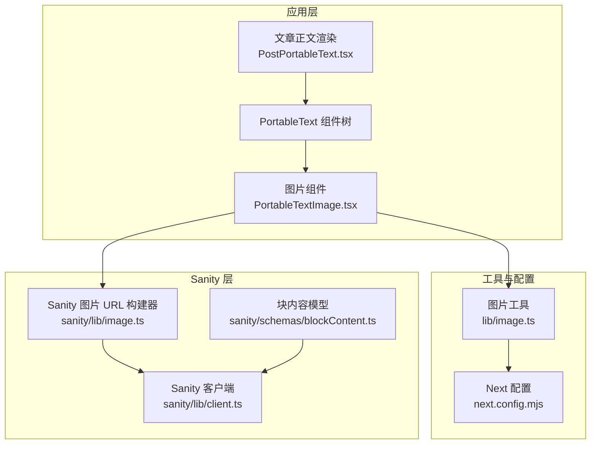
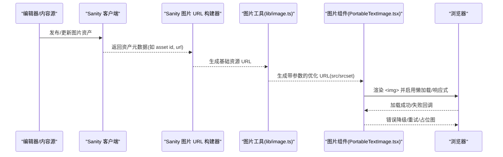
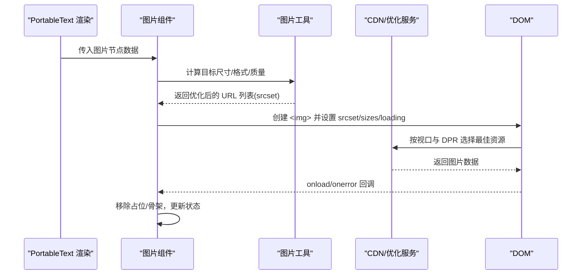
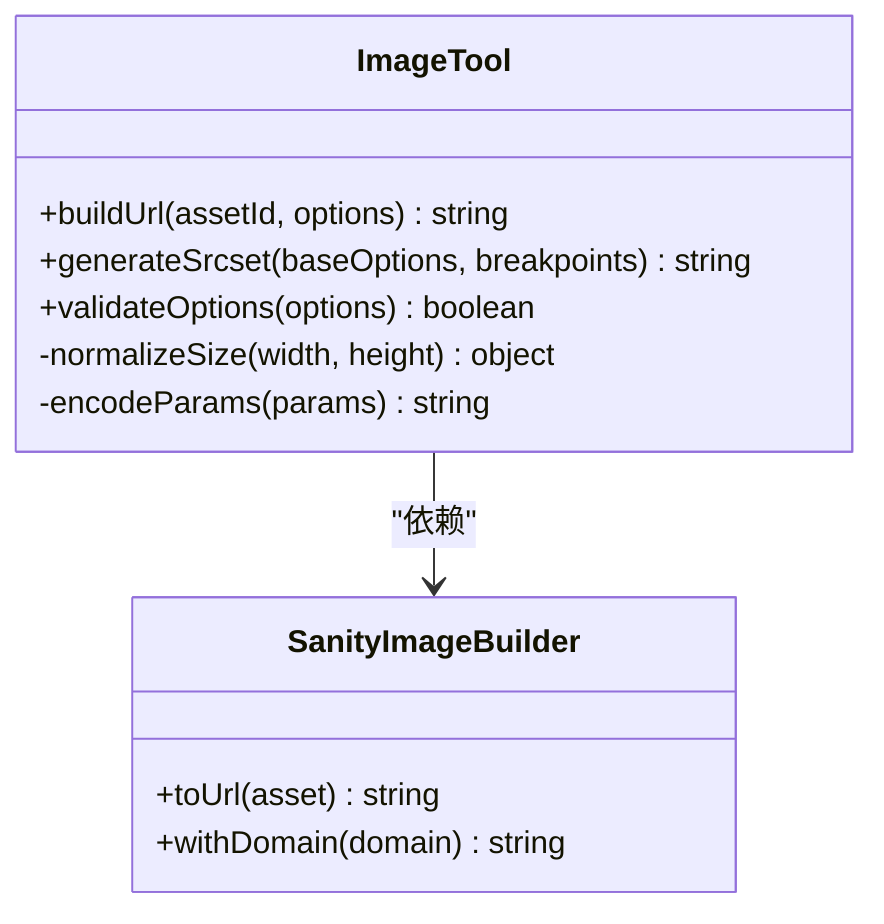
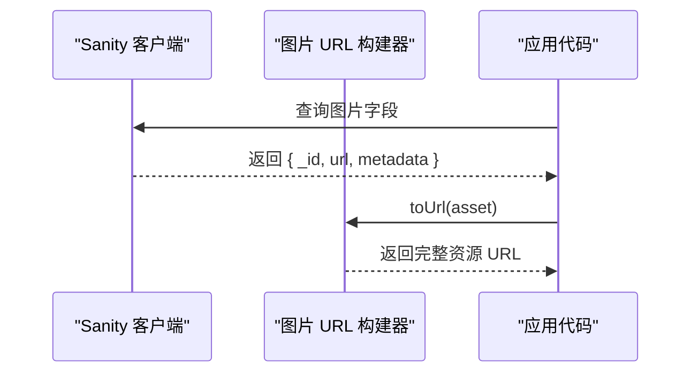
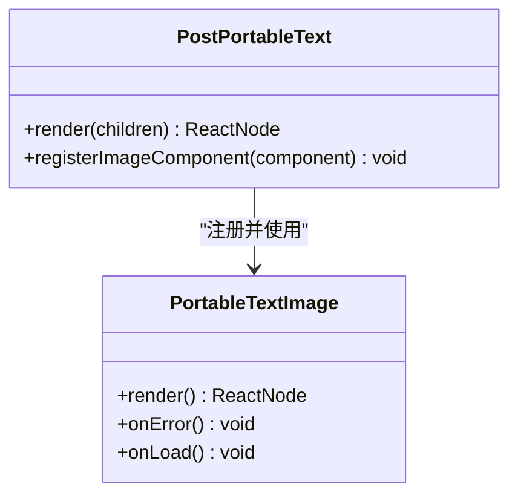
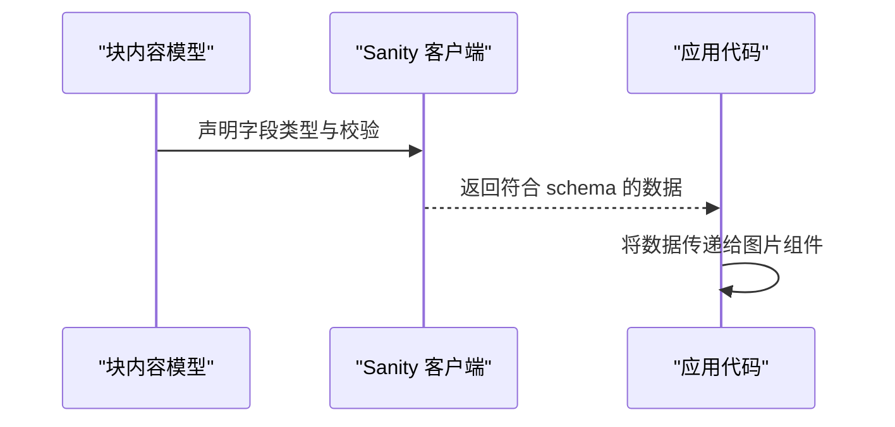
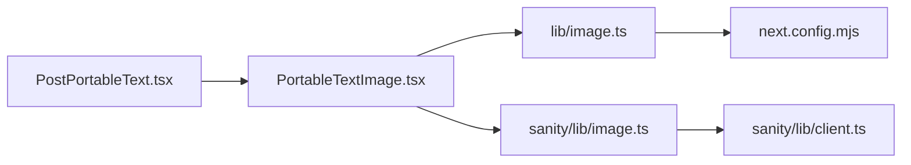

# 媒体内容渲染

<cite>
**本文引用的文件**
- [PortableTextImage.tsx](file://components/portable-text/PortableTextImage.tsx)
- [image.ts](file://lib/image.ts)
- [client.ts](file://sanity/lib/client.ts)
- [image.ts](file://sanity/lib/image.ts)
- [blockContent.ts](file://sanity/schemas/blockContent.ts)
- [PostPortableText.tsx](file://components/PostPortableText.tsx)
- [next.config.mjs](file://next.config.mjs)
</cite>

## 目录
1. [简介](#简介)
2. [项目结构](#项目结构)
3. [核心组件](#核心组件)
4. [架构总览](#架构总览)
5. [详细组件分析](#详细组件分析)
6. [依赖关系分析](#依赖关系分析)
7. [性能考量](#性能考量)
8. [故障排查指南](#故障排查指南)
9. [结论](#结论)
10. [附录](#附录)

## 简介
本文件面向“媒体内容渲染系统”，聚焦图片懒加载、响应式图片与图片优化机制，说明图片格式支持、尺寸适配与 CDN 集成策略，并给出压缩策略、缓存机制与错误处理方案。文档还包含配置示例与自定义媒体类型的开发指南，解释与 Sanity Image API 的集成方式及性能优化技巧。

## 项目结构
本项目采用 Next.js + Sanity 的内容生态：
- 前端渲染层通过 Portable Text 组件树解析富文本中的图片节点，并使用封装的图片组件进行渲染。
- 图片资源经由 lib 层的 image 工具生成带尺寸的 URL，结合 Next.js 的图像优化能力（或外部 CDN）完成按需缩放、裁剪与格式转换。
- Sanity 侧提供客户端与图片 URL 构建器，确保从内容模型到最终资源的端到端一致性。

图表来源
- [PortableTextImage.tsx:1-200](file://components/portable-text/PortableTextImage.tsx#L1-L200)
- [image.ts](file://lib/image.ts)
- [client.ts](file://sanity/lib/client.ts)
- [image.ts](file://sanity/lib/image.ts)
- [blockContent.ts](file://sanity/schemas/blockContent.ts)
- [PostPortableText.tsx](file://components/PostPortableText.tsx)
- [next.config.mjs](file://next.config.mjs)

章节来源
- [PortableTextImage.tsx:1-200](file://components/portable-text/PortableTextImage.tsx#L1-L200)
- [image.ts](file://lib/image.ts)
- [client.ts](file://sanity/lib/client.ts)
- [image.ts](file://sanity/lib/image.ts)
- [blockContent.ts](file://sanity/schemas/blockContent.ts)
- [PostPortableText.tsx](file://components/PostPortableText.tsx)
- [next.config.mjs](file://next.config.mjs)

## 核心组件
- 图片组件（PortableTextImage.tsx）
  - 负责将 Portable Text 中的图片节点渲染为可访问、响应式的图片元素。
  - 通常具备以下职责：
    - 根据容器宽度与设备像素比计算目标尺寸，生成不同分辨率的 srcset。
    - 使用占位图或骨架屏避免布局抖动。
    - 在滚动进入视口时触发加载（懒加载）。
    - 对加载失败进行降级处理（显示占位图或重试）。
- 图片工具（lib/image.ts）
  - 统一构建图片 URL，拼接尺寸、质量、格式等参数。
  - 与 Next.js 图像优化或外部 CDN 对接，实现按需转码与缓存。
- Sanity 图片 URL 构建器（sanity/lib/image.ts）
  - 基于 Sanity Asset ID 与域名，生成原始资源地址。
  - 可与 Next Image Optimization 或第三方 CDN 组合使用。
- 文章正文渲染（PostPortableText.tsx）
  - 作为富文本入口，挂载图片组件与其他扩展节点。
- 块内容模型（sanity/schemas/blockContent.ts）
  - 定义图片字段的数据结构与校验规则，确保上游数据一致。

章节来源
- [PortableTextImage.tsx:1-200](file://components/portable-text/PortableTextImage.tsx#L1-L200)
- [image.ts](file://lib/image.ts)
- [image.ts](file://sanity/lib/image.ts)
- [PostPortableText.tsx](file://components/PostPortableText.tsx)
- [blockContent.ts](file://sanity/schemas/blockContent.ts)

## 架构总览
下图展示从内容到渲染的关键路径：Sanity 内容模型 → 客户端查询 → 图片 URL 构建 → 图片组件渲染与优化。

图表来源
- [client.ts](file://sanity/lib/client.ts)
- [image.ts](file://sanity/lib/image.ts)
- [image.ts](file://lib/image.ts)
- [PortableTextImage.tsx:1-200](file://components/portable-text/PortableTextImage.tsx#L1-L200)

## 详细组件分析

### 图片组件（PortableTextImage.tsx）
- 功能要点
  - 懒加载：通过 IntersectionObserver 或原生 loading="lazy" 延迟请求，减少首屏压力。
  - 响应式：依据容器宽度与 DPR 生成多档尺寸，配合 srcset 与 sizes 提升清晰度与带宽效率。
  - 占位与骨架：在加载阶段显示低清缩略图或骨架屏，避免 CLS。
  - 错误处理：监听 onerror，回退至占位图或备用尺寸；必要时记录埋点。
  - 可访问性：设置 alt、role、aria-* 等属性，提升无障碍体验。
- 关键流程（序列图）

图表来源
- [PortableTextImage.tsx:1-200](file://components/portable-text/PortableTextImage.tsx#L1-L200)
- [image.ts](file://lib/image.ts)

章节来源
- [PortableTextImage.tsx:1-200](file://components/portable-text/PortableTextImage.tsx#L1-L200)

### 图片工具（lib/image.ts）
- 功能要点
  - 统一参数化：集中管理 width、height、format、quality、blur、fit 等参数。
  - 输出规范：生成符合 Next.js 图像优化或 CDN 规范的 URL。
  - 缓存友好：URL 中携带稳定参数，利于浏览器与 CDN 缓存命中。
  - 安全校验：限制最大宽高、白名单域名、防注入等。
- 典型调用链（类图）

图表来源
- [image.ts](file://lib/image.ts)
- [image.ts](file://sanity/lib/image.ts)

章节来源
- [image.ts](file://lib/image.ts)
- [image.ts](file://sanity/lib/image.ts)

### Sanity 图片 URL 构建器（sanity/lib/image.ts）
- 功能要点
  - 基于 Sanity 资产 ID 与域名，构造原始资源地址。
  - 与 Next Image Optimization 或外部 CDN 组合，实现后端转码与缓存。
- 与客户端协作（序列图）

图表来源
- [client.ts](file://sanity/lib/client.ts)
- [image.ts](file://sanity/lib/image.ts)

章节来源
- [client.ts](file://sanity/lib/client.ts)
- [image.ts](file://sanity/lib/image.ts)

### 文章正文渲染（PostPortableText.tsx）
- 作用
  - 作为富文本渲染入口，注册图片组件及其他扩展节点。
  - 保证图片节点在不同页面上下文下具有一致的渲染行为。
- 与图片组件的关系（类图）

图表来源
- [PostPortableText.tsx](file://components/PostPortableText.tsx)
- [PortableTextImage.tsx:1-200](file://components/portable-text/PortableTextImage.tsx#L1-L200)

章节来源
- [PostPortableText.tsx](file://components/PostPortableText.tsx)
- [PortableTextImage.tsx:1-200](file://components/portable-text/PortableTextImage.tsx#L1-L200)

### 块内容模型（sanity/schemas/blockContent.ts）
- 作用
  - 定义图片字段的数据结构、必填项与约束，确保上游数据质量。
  - 为前端组件提供稳定的类型契约。
- 与客户端交互（序列图）

图表来源
- [blockContent.ts](file://sanity/schemas/blockContent.ts)
- [client.ts](file://sanity/lib/client.ts)

章节来源
- [blockContent.ts](file://sanity/schemas/blockContent.ts)
- [client.ts](file://sanity/lib/client.ts)

## 依赖关系分析
- 组件耦合
  - 图片组件依赖图片工具与 Sanity 图片构建器，形成“渲染→URL 生成”的单向依赖。
  - 文章正文渲染仅依赖图片组件接口，保持松耦合。
- 外部依赖
  - Next.js 图像优化或 CDN 作为最终资源提供方，受 next.config.mjs 控制。
- 潜在循环依赖
  - 当前结构无直接循环依赖；建议保持工具层与组件层解耦。

图表来源
- [PostPortableText.tsx](file://components/PostPortableText.tsx)
- [PortableTextImage.tsx:1-200](file://components/portable-text/PortableTextImage.tsx#L1-L200)
- [image.ts](file://lib/image.ts)
- [image.ts](file://sanity/lib/image.ts)
- [client.ts](file://sanity/lib/client.ts)
- [next.config.mjs](file://next.config.mjs)

章节来源
- [PostPortableText.tsx](file://components/PostPortableText.tsx)
- [PortableTextImage.tsx:1-200](file://components/portable-text/PortableTextImage.tsx#L1-L200)
- [image.ts](file://lib/image.ts)
- [image.ts](file://sanity/lib/image.ts)
- [client.ts](file://sanity/lib/client.ts)
- [next.config.mjs](file://next.config.mjs)

## 性能考量
- 懒加载
  - 使用 IntersectionObserver 或原生 loading="lazy" 降低首屏请求量。
  - 对长文场景，优先加载可视区域图片，其余按需加载。
- 响应式与 DPR
  - 基于容器宽度与设备像素比生成 srcset，避免在大屏设备上下载过大资源。
  - 合理设置 sizes，帮助浏览器快速选择合适尺寸。
- 格式与压缩
  - 优先 WebP/AVIF，回退到 JPEG/PNG；通过工具层统一参数控制质量与尺寸。
  - 利用 Next.js 图像优化或 CDN 的后端转码能力，减少客户端开销。
- 缓存策略
  - URL 参数稳定且幂等，利于浏览器与 CDN 缓存命中。
  - 针对热点图片开启强缓存，非热点图片使用协商缓存。
- 占位与骨架
  - 使用低清缩略图或 SVG 骨架屏，减少布局抖动与感知等待时间。
- 错误处理
  - 捕获 onerror，回退到占位图或备用尺寸；记录错误日志以便监控。

[本节为通用指导，不直接分析具体文件]

## 故障排查指南
- 图片无法加载
  - 检查 Sanity 资产是否已发布且可公开访问。
  - 确认图片 URL 构建逻辑是否正确拼接域名与参数。
  - 验证 next.config.mjs 中允许的域名与优化配置。
- 图片模糊或失真
  - 检查生成的尺寸是否小于原图，避免过度放大。
  - 调整质量参数与格式优先级，确保清晰度与体积平衡。
- 首屏卡顿
  - 确认懒加载是否生效，是否存在大量同屏大图。
  - 引入占位图或骨架屏，减少重排重绘。
- 缓存未命中
  - 检查 URL 是否频繁变化导致缓存失效。
  - 确认 CDN 缓存头与浏览器缓存策略是否匹配。

章节来源
- [next.config.mjs](file://next.config.mjs)
- [image.ts](file://lib/image.ts)
- [image.ts](file://sanity/lib/image.ts)
- [client.ts](file://sanity/lib/client.ts)

## 结论
通过将图片组件、图片工具与 Sanity 图片构建器解耦，并结合 Next.js 图像优化或外部 CDN，可实现高效、可扩展的媒体内容渲染体系。合理的懒加载、响应式与压缩策略能显著提升性能与用户体验。完善的错误处理与缓存策略则保障稳定性与命中率。

[本节为总结性内容，不直接分析具体文件]

## 附录

### 配置示例与最佳实践
- Next.js 图像优化
  - 在 next.config.mjs 中配置允许的外部域名与优化选项，确保图片资源可被正确优化与缓存。
- 图片工具参数
  - 统一维护 width、height、format、quality、blur、fit 等参数，避免散落在各组件中。
- Sanity 域名与凭证
  - 在 sanity/lib/client.ts 中配置正确的 project id、dataset 与 token，确保查询可用。

章节来源
- [next.config.mjs](file://next.config.mjs)
- [image.ts](file://lib/image.ts)
- [client.ts](file://sanity/lib/client.ts)

### 自定义媒体类型开发指南
- 新增媒体类型步骤
  - 在 blockContent.ts 中定义新的字段类型与校验规则。
  - 在 PostPortableText.tsx 中注册对应的渲染组件。
  - 在图片工具或专用工具中实现 URL 构建与优化逻辑。
- 注意事项
  - 保持字段命名与数据结构稳定，便于前后端协同。
  - 为新类型编写单元测试与回归用例，确保兼容性。
  - 为错误路径与边界条件设计兜底渲染。

章节来源
- [blockContent.ts](file://sanity/schemas/blockContent.ts)
- [PostPortableText.tsx](file://components/PostPortableText.tsx)
- [image.ts](file://lib/image.ts)