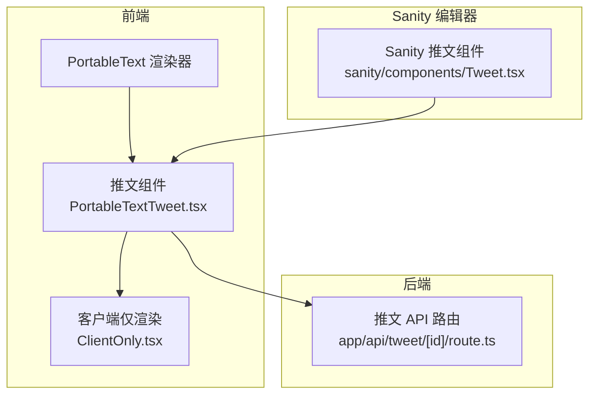
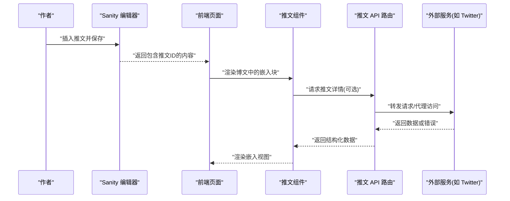
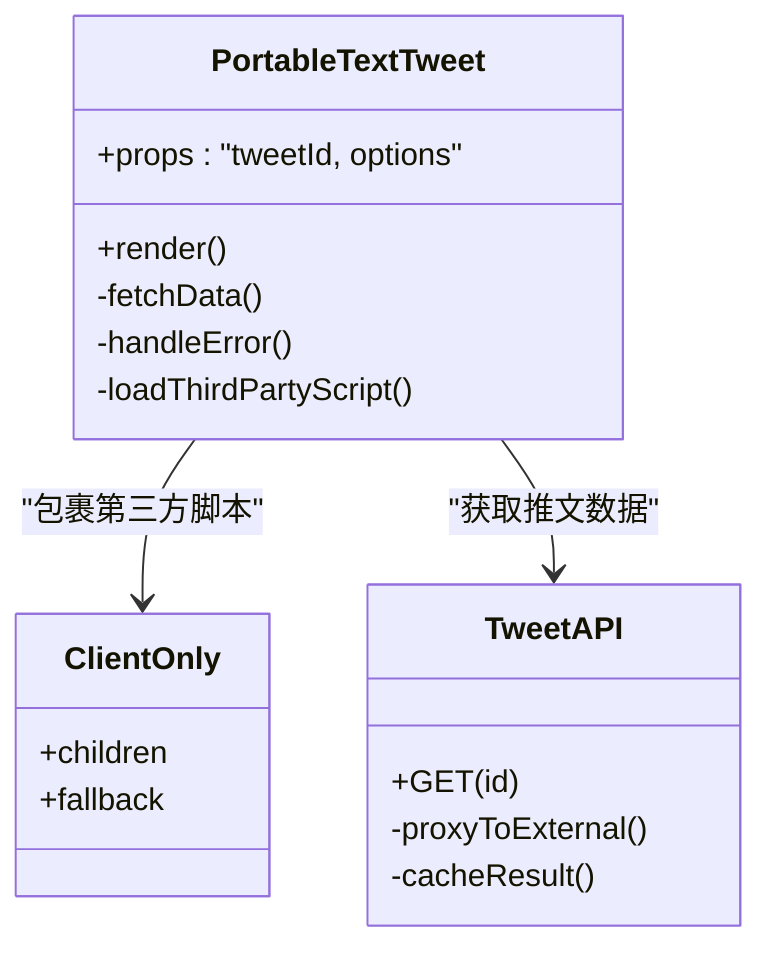
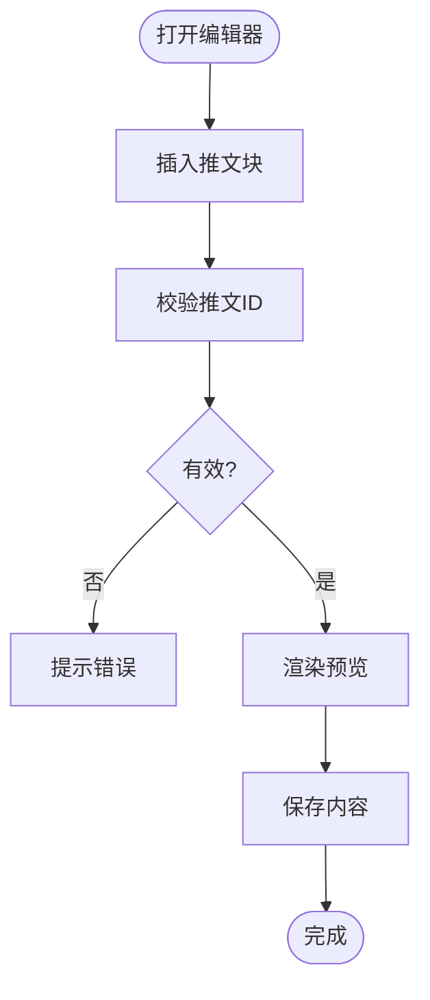
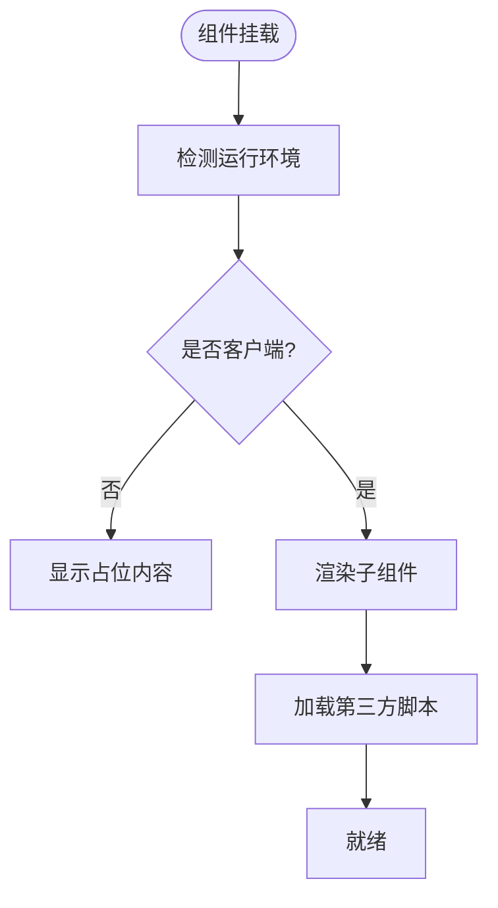
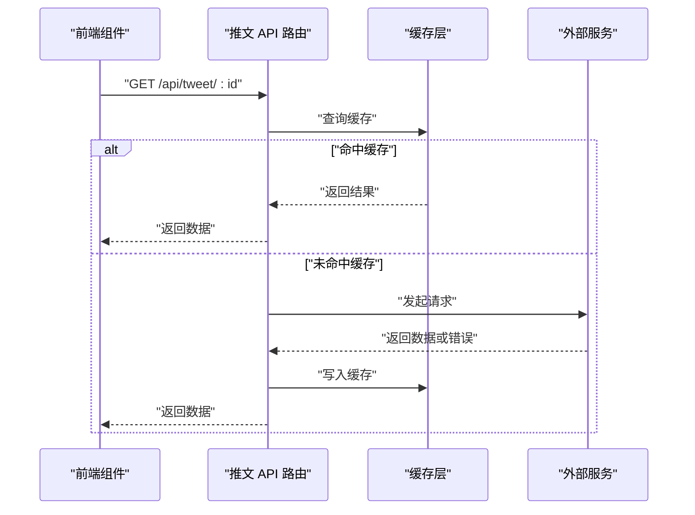
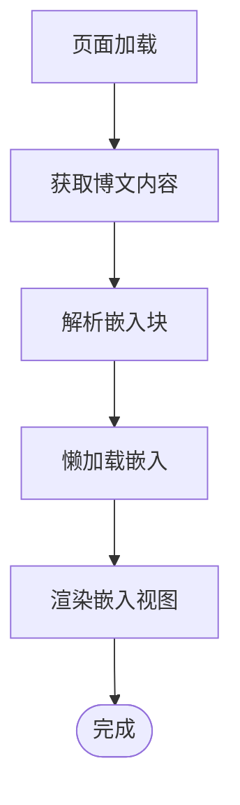
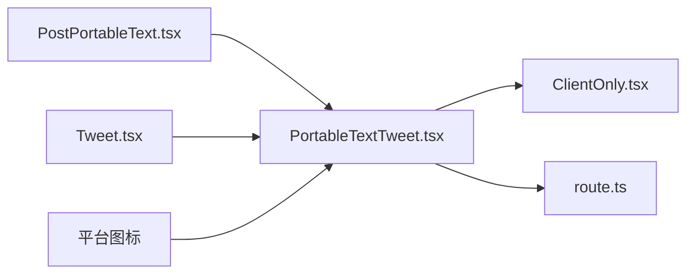

# 嵌入内容处理

<cite>
**本文引用的文件**   
- [PortableTextTweet.tsx](file://components/portable-text/PortableTextTweet.tsx)
- [Tweet.tsx](file://sanity/components/Tweet.tsx)
- [route.ts](file://app/api/tweet/[id]/route.ts)
- [PostPortableText.tsx](file://components/PostPortableText.tsx)
- [BlogPostStateLoader.tsx](file://app/(main)/blog/BlogPostStateLoader.tsx)
- [ClientOnly.tsx](file://components/ClientOnly.tsx)
- [BilibiliIcon.tsx](file://assets/icons/BilibiliIcon.tsx)
- [YouTubeIcon.tsx](file://assets/icons/YouTubeIcon.tsx)
- [TwitterIcon.tsx](file://assets/icons/TwitterIcon.tsx)
</cite>

## 目录
1. [简介](#简介)
2. [项目结构](#项目结构)
3. [核心组件](#核心组件)
4. [架构总览](#架构总览)
5. [详细组件分析](#详细组件分析)
6. [依赖关系分析](#依赖关系分析)
7. [性能考虑](#性能考虑)
8. [故障排查指南](#故障排查指南)
9. [结论](#结论)
10. [附录](#附录)

## 简介
本文件面向“嵌入内容处理系统”，聚焦第三方内容的嵌入机制，包括推文、视频及其他社交媒体的集成。文档覆盖以下方面：
- 嵌入内容的加载策略与渲染流程
- 缓存与降级方案
- 安全与隐私保护
- 性能优化建议
- 扩展新嵌入类型与自定义嵌入组件的开发方法
- 与外部 API 的交互模式与状态管理

## 项目结构
本项目采用 Next.js App Router 与 Sanity 内容源结合的方式，嵌入能力主要分布在以下位置：
- 前端渲染层：用于在博客正文中渲染嵌入式内容（如推文）
- 后端路由层：提供服务端代理或数据获取接口（例如推文详情）
- 编辑器侧组件：在 Sanity Studio 中预览或编辑嵌入内容
- 资源图标：为不同平台提供品牌标识

**图示来源**
- [PortableTextTweet.tsx](file://components/portable-text/PortableTextTweet.tsx)
- [route.ts](file://app/api/tweet/[id]/route.ts)
- [Tweet.tsx](file://sanity/components/Tweet.tsx)
- [ClientOnly.tsx](file://components/ClientOnly.tsx)

**章节来源**
- [PostPortableText.tsx](file://components/PostPortableText.tsx)
- [BlogPostStateLoader.tsx](file://app/(main)/blog/BlogPostStateLoader.tsx)
- [PortableTextTweet.tsx](file://components/portable-text/PortableTextTweet.tsx)
- [Tweet.tsx](file://sanity/components/Tweet.tsx)
- [route.ts](file://app/api/tweet/[id]/route.ts)
- [ClientOnly.tsx](file://components/ClientOnly.tsx)

## 核心组件
- PortableText 推文组件：负责将来自内容源的推文 ID 转换为可交互的嵌入视图，并在必要时通过 API 拉取数据。
- Sanity 推文组件：在编辑器中提供预览与配置能力，便于作者插入推文。
- 客户端仅渲染包装：确保需要浏览器环境的第三方脚本仅在客户端执行，避免 SSR 问题。
- 推文 API 路由：作为服务端代理或数据获取入口，统一对外部服务的调用与错误处理。

**章节来源**
- [PortableTextTweet.tsx](file://components/portable-text/PortableTextTweet.tsx)
- [Tweet.tsx](file://sanity/components/Tweet.tsx)
- [ClientOnly.tsx](file://components/ClientOnly.tsx)
- [route.ts](file://app/api/tweet/[id]/route.ts)

## 架构总览
下图展示了从内容到最终渲染的关键路径，包括服务端与客户端的职责划分以及外部服务交互点。

**图示来源**
- [Tweet.tsx](file://sanity/components/Tweet.tsx)
- [PostPortableText.tsx](file://components/PostPortableText.tsx)
- [PortableTextTweet.tsx](file://components/portable-text/PortableTextTweet.tsx)
- [route.ts](file://app/api/tweet/[id]/route.ts)

## 详细组件分析

### 推文嵌入组件（PortableTextTweet）
职责与行为：
- 接收推文 ID 并决定渲染策略（直接嵌入或先拉取数据）。
- 使用客户端仅渲染包装，避免在服务端执行第三方脚本。
- 与后端 API 交互以获取推文详情，支持错误降级与占位显示。
- 根据平台特性注入必要的样式与交互逻辑。

**图示来源**
- [PortableTextTweet.tsx](file://components/portable-text/PortableTextTweet.tsx)
- [ClientOnly.tsx](file://components/ClientOnly.tsx)
- [route.ts](file://app/api/tweet/[id]/route.ts)

**章节来源**
- [PortableTextTweet.tsx](file://components/portable-text/PortableTextTweet.tsx)
- [ClientOnly.tsx](file://components/ClientOnly.tsx)
- [route.ts](file://app/api/tweet/[id]/route.ts)

### Sanity 推文组件（编辑器侧）
职责与行为：
- 在 Sanity Studio 中提供推文插入与预览能力。
- 校验推文 ID 格式，提示无效输入。
- 生成可用于前端渲染的结构化字段（如 tweetId）。

**图示来源**
- [Tweet.tsx](file://sanity/components/Tweet.tsx)

**章节来源**
- [Tweet.tsx](file://sanity/components/Tweet.tsx)

### 客户端仅渲染包装（ClientOnly）
职责与行为：
- 确保需要浏览器环境的代码（如第三方 SDK）仅在客户端执行。
- 提供 fallback 占位，提升用户体验。
- 避免 SSR 时因全局对象缺失导致的异常。

**图示来源**
- [ClientOnly.tsx](file://components/ClientOnly.tsx)

**章节来源**
- [ClientOnly.tsx](file://components/ClientOnly.tsx)

### 推文 API 路由（后端代理）
职责与行为：
- 作为统一入口，封装对第三方服务的请求。
- 实现缓存策略以减少外部调用频率。
- 集中处理错误与超时，返回稳定数据结构。

**图示来源**
- [route.ts](file://app/api/tweet/[id]/route.ts)

**章节来源**
- [route.ts](file://app/api/tweet/[id]/route.ts)

### 博文渲染与状态加载
职责与行为：
- 在博文页面中组合多个嵌入组件，统一管理加载状态与错误边界。
- 按需加载嵌入内容，减少首屏压力。

**图示来源**
- [PostPortableText.tsx](file://components/PostPortableText.tsx)
- [BlogPostStateLoader.tsx](file://app/(main)/blog/BlogPostStateLoader.tsx)

**章节来源**
- [PostPortableText.tsx](file://components/PostPortableText.tsx)
- [BlogPostStateLoader.tsx](file://app/(main)/blog/BlogPostStateLoader.tsx)

### 平台图标资源
职责与行为：
- 为不同平台提供品牌图标，增强嵌入内容的识别度。
- 作为静态资源被嵌入组件引用。

示例图标：
- Bilibili 图标
- YouTube 图标
- Twitter 图标

**章节来源**
- [BilibiliIcon.tsx](file://assets/icons/BilibiliIcon.tsx)
- [YouTubeIcon.tsx](file://assets/icons/YouTubeIcon.tsx)
- [TwitterIcon.tsx](file://assets/icons/TwitterIcon.tsx)

## 依赖关系分析
- 前端渲染层依赖客户端仅渲染包装，以避免 SSR 问题。
- 推文组件依赖后端 API 路由进行数据获取与错误处理。
- Sanity 编辑器组件与前端组件共享相同的嵌入语义，保证一致体验。
- 平台图标作为静态资源被嵌入组件引用，不引入运行时耦合。

**图示来源**
- [PostPortableText.tsx](file://components/PostPortableText.tsx)
- [PortableTextTweet.tsx](file://components/portable-text/PortableTextTweet.tsx)
- [ClientOnly.tsx](file://components/ClientOnly.tsx)
- [route.ts](file://app/api/tweet/[id]/route.ts)
- [Tweet.tsx](file://sanity/components/Tweet.tsx)
- [BilibiliIcon.tsx](file://assets/icons/BilibiliIcon.tsx)
- [YouTubeIcon.tsx](file://assets/icons/YouTubeIcon.tsx)
- [TwitterIcon.tsx](file://assets/icons/TwitterIcon.tsx)

**章节来源**
- [PostPortableText.tsx](file://components/PostPortableText.tsx)
- [PortableTextTweet.tsx](file://components/portable-text/PortableTextTweet.tsx)
- [ClientOnly.tsx](file://components/ClientOnly.tsx)
- [route.ts](file://app/api/tweet/[id]/route.ts)
- [Tweet.tsx](file://sanity/components/Tweet.tsx)
- [BilibiliIcon.tsx](file://assets/icons/BilibiliIcon.tsx)
- [YouTubeIcon.tsx](file://assets/icons/YouTubeIcon.tsx)
- [TwitterIcon.tsx](file://assets/icons/TwitterIcon.tsx)

## 性能考虑
- 懒加载与可见性触发：仅在用户滚动到可视区域时加载嵌入内容，降低首屏压力。
- 客户端仅渲染：避免在服务端执行第三方脚本，减少不必要的计算与网络开销。
- 缓存策略：在后端对第三方响应进行缓存，缩短后续请求延迟。
- 错误降级：当外部服务不可用时，展示占位或简化视图，保障页面可用性。
- 资源隔离：为每个嵌入类型独立加载脚本，避免相互阻塞。

[本节为通用指导，无需特定文件来源]

## 故障排查指南
常见问题与定位步骤：
- 第三方脚本无法加载：检查是否在客户端环境中执行；确认客户端仅渲染包装是否正确应用。
- 数据获取失败：查看后端 API 日志，确认外部服务可达性与鉴权配置；检查缓存是否过期或损坏。
- 渲染异常：确认嵌入块的数据结构是否符合预期；检查错误边界与降级逻辑是否生效。
- 性能问题：观察懒加载触发时机；评估缓存命中率与外部服务响应时间。

**章节来源**
- [ClientOnly.tsx](file://components/ClientOnly.tsx)
- [route.ts](file://app/api/tweet/[id]/route.ts)
- [PortableTextTweet.tsx](file://components/portable-text/PortableTextTweet.tsx)

## 结论
本嵌入内容处理系统通过前后端协作与客户端仅渲染策略，实现了稳健的第三方内容嵌入能力。借助缓存与错误降级，系统在可用性与性能之间取得平衡。未来可扩展更多嵌入类型，并通过统一的组件模型与 API 模式保持良好可维护性。

[本节为总结，无需特定文件来源]

## 附录

### 嵌入类型扩展指南
- 新增嵌入类型步骤：
  - 定义新的嵌入块数据结构（如 videoId、platform）。
  - 创建对应的渲染组件，复用客户端仅渲染包装。
  - 如需数据获取，新增后端路由并实现缓存与错误处理。
  - 在编辑器中增加对应组件，提供预览与校验。
  - 更新博文渲染器以支持新嵌入块。

- 自定义嵌入组件开发方法：
  - 遵循现有组件约定：props 命名、错误回调、占位渲染。
  - 使用客户端仅渲染包装确保第三方脚本安全执行。
  - 与后端 API 保持一致的错误码与数据结构。
  - 添加平台图标与文案，提升用户体验。

[本节为概念性指导，无需特定文件来源]