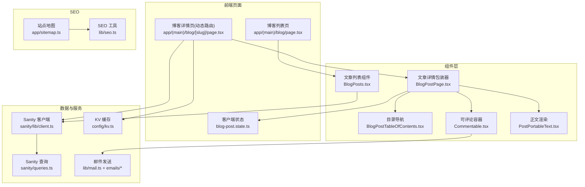
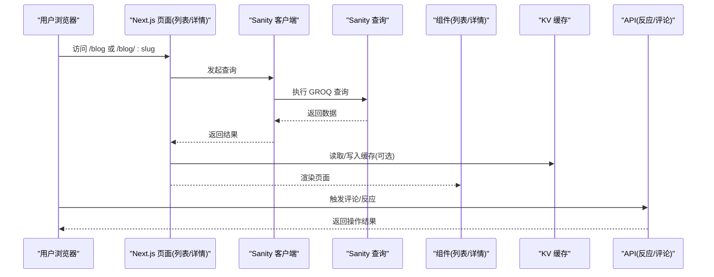
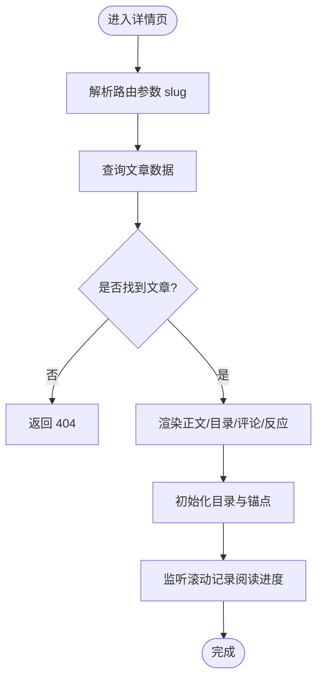
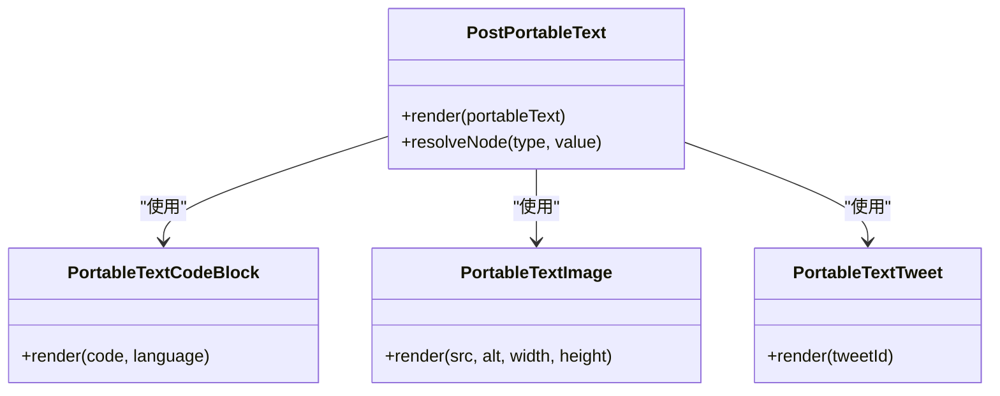
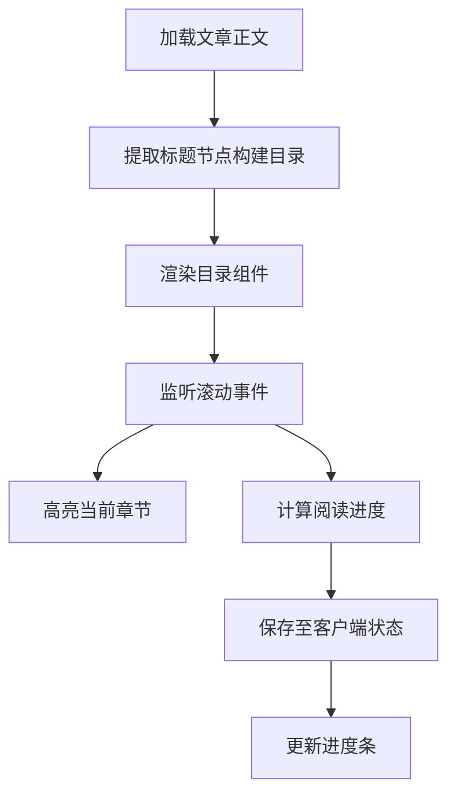
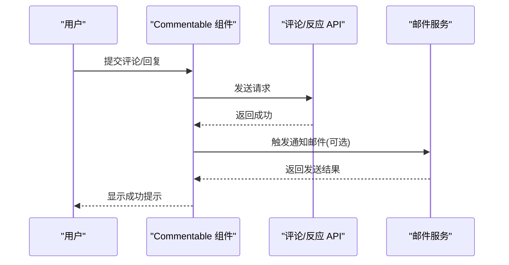
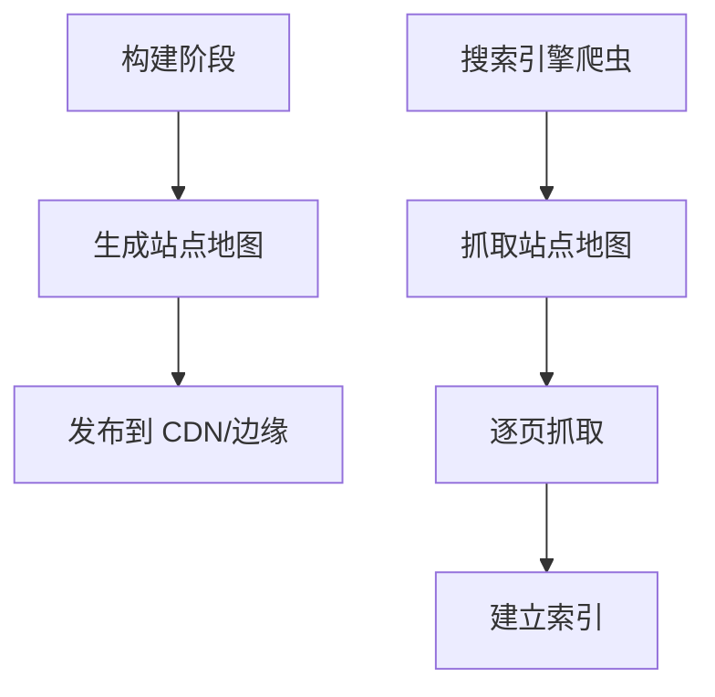
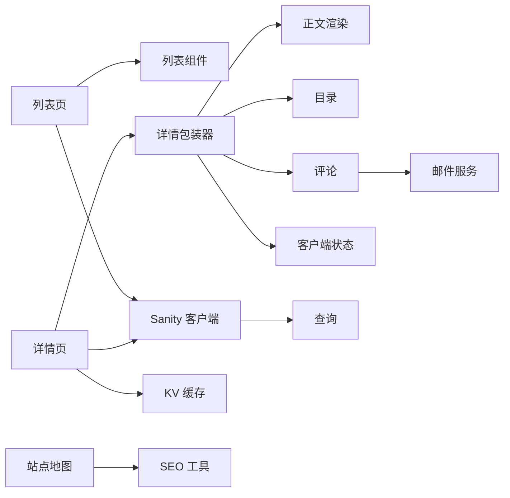

# 博客系统

<cite>
**本文引用的文件**   
- [app/(main)/blog/page.tsx](file://app/(main)/blog/page.tsx)
- [app/(main)/blog/[slug]/page.tsx](file://app/(main)/blog/[slug]/page.tsx)
- [app/(main)/blog/BlogPosts.tsx](file://app/(main)/blog/BlogPosts.tsx)
- [app/(main)/blog/BlogPostPage.tsx](file://app/(main)/blog/BlogPostPage.tsx)
- [app/(main)/blog/BlogPostTableOfContents.tsx](file://app/(main)/blog/BlogPostTableOfContents.tsx)
- [app/(main)/blog/blog-post.state.ts](file://app/(main)/blog/blog-post.state.ts)
- [sanity/queries.ts](file://sanity/queries.ts)
- [sanity/schemas/post.ts](file://sanity/schemas/post.ts)
- [sanity/lib/client.ts](file://sanity/lib/client.ts)
- [lib/seo.ts](file://lib/seo.ts)
- [app/sitemap.ts](file://app/sitemap.ts)
- [app/api/reactions/route.ts](file://app/api/reactions/route.ts)
- [components/Commentable.tsx](file://components/Commentable.tsx)
- [components/PostPortableText.tsx](file://components/PostPortableText.tsx)
- [components/portable-text/PortableTextCodeBlock.tsx](file://components/portable-text/PortableTextCodeBlock.tsx)
- [components/portable-text/PortableTextImage.tsx](file://components/portable-text/PortableTextImage.tsx)
- [components/portable-text/PortableTextTweet.tsx](file://components/portable-text/PortableTextTweet.tsx)
- [config/kv.ts](file://config/kv.ts)
- [lib/mail.ts](file://lib/mail.ts)
- [emails/index.tsx](file://emails/index.tsx)
- [emails/NewReplyComment.tsx](file://emails/NewReplyComment.tsx)
- [next-sitemap.config.js](file://next-sitemap.config.js)
</cite>

## 目录
1. [简介](#简介)
2. [项目结构](#项目结构)
3. [核心组件](#核心组件)
4. [架构总览](#架构总览)
5. [详细组件分析](#详细组件分析)
6. [依赖关系分析](#依赖关系分析)
7. [性能考量](#性能考量)
8. [故障排查指南](#故障排查指南)
9. [结论](#结论)
10. [附录](#附录)

## 简介
本文件为 cali.so 博客系统的功能与实现文档，覆盖文章管理、Markdown/Portable Text 渲染、目录导航、阅读进度跟踪、SEO 优化策略、Sanity CMS 内容模型与查询优化、动态路由与客户端状态管理、社交分享与评论集成、邮件通知等。文档同时提供架构图、数据流图与流程图，帮助读者快速理解系统设计与落地细节。

## 项目结构
本项目基于 Next.js App Router，前后端一体化：
- 页面层：位于 app/(main)/blog 下的列表页与详情页（含动态路由）
- 业务组件：文章卡片、正文渲染、目录、反应计数、可评论容器等
- 数据层：Sanity 客户端与查询、本地 KV 缓存、数据库与邮件服务
- SEO 与站点地图：生成 sitemap 与站点元信息
- 管理后台：Sanity Studio 与自定义管理页面



图表来源
- [app/(main)/blog/page.tsx](file://app/(main)/blog/page.tsx)
- [app/(main)/blog/[slug]/page.tsx](file://app/(main)/blog/[slug]/page.tsx)
- [app/(main)/blog/BlogPosts.tsx](file://app/(main)/blog/BlogPosts.tsx)
- [app/(main)/blog/BlogPostPage.tsx](file://app/(main)/blog/BlogPostPage.tsx)
- [app/(main)/blog/BlogPostTableOfContents.tsx](file://app/(main)/blog/BlogPostTableOfContents.tsx)
- [app/(main)/blog/blog-post.state.ts](file://app/(main)/blog/blog-post.state.ts)
- [sanity/lib/client.ts](file://sanity/lib/client.ts)
- [sanity/queries.ts](file://sanity/queries.ts)
- [config/kv.ts](file://config/kv.ts)
- [lib/mail.ts](file://lib/mail.ts)
- [emails/index.tsx](file://emails/index.tsx)
- [emails/NewReplyComment.tsx](file://emails/NewReplyComment.tsx)
- [app/sitemap.ts](file://app/sitemap.ts)
- [lib/seo.ts](file://lib/seo.ts)

章节来源
- [app/(main)/blog/page.tsx](file://app/(main)/blog/page.tsx)
- [app/(main)/blog/[slug]/page.tsx](file://app/(main)/blog/[slug]/page.tsx)
- [sanity/queries.ts](file://sanity/queries.ts)
- [sanity/lib/client.ts](file://sanity/lib/client.ts)
- [app/sitemap.ts](file://app/sitemap.ts)
- [lib/seo.ts](file://lib/seo.ts)

## 核心组件
- 文章列表页与组件
  - 列表页负责加载文章集合并渲染列表组件
  - 列表组件通过 Sanity 查询获取文章摘要、封面、标签等信息
- 文章详情页与包装器
  - 详情页根据动态路由 slug 拉取单篇文章
  - 包装器组合正文渲染、目录、评论、反应等子模块
- 正文渲染
  - 使用 Portable Text 渲染器，支持代码块、图片、推文等扩展节点
- 目录导航
  - 解析文章标题节点构建目录树，支持滚动高亮与锚点跳转
- 客户端状态管理
  - 使用轻量状态库维护阅读进度、展开/折叠、交互反馈等
- 评论与互动
  - 可评论容器聚合评论展示、提交、点赞/表情等能力
- 邮件通知
  - 订阅确认、新留言、回复提醒等模板化邮件发送

章节来源
- [app/(main)/blog/BlogPosts.tsx](file://app/(main)/blog/BlogPosts.tsx)
- [app/(main)/blog/BlogPostPage.tsx](file://app/(main)/blog/BlogPostPage.tsx)
- [components/PostPortableText.tsx](file://components/PostPortableText.tsx)
- [app/(main)/blog/BlogPostTableOfContents.tsx](file://app/(main)/blog/BlogPostTableOfContents.tsx)
- [app/(main)/blog/blog-post.state.ts](file://app/(main)/blog/blog-post.state.ts)
- [components/Commentable.tsx](file://components/Commentable.tsx)
- [lib/mail.ts](file://lib/mail.ts)
- [emails/index.tsx](file://emails/index.tsx)

## 架构总览
整体采用“服务端渲染 + 客户端交互”的混合模式：
- 服务端：Next.js 页面在请求时从 Sanity 拉取数据，进行 SSR/SSG 渲染
- 客户端：目录导航、阅读进度、评论与反应等通过客户端状态与 API 完成
- 数据源：Sanity CMS 作为唯一事实源；可选 KV 缓存热点数据
- SEO：自动生成站点地图与元信息，利于搜索引擎收录



图表来源
- [app/(main)/blog/page.tsx](file://app/(main)/blog/page.tsx)
- [app/(main)/blog/[slug]/page.tsx](file://app/(main)/blog/[slug]/page.tsx)
- [sanity/lib/client.ts](file://sanity/lib/client.ts)
- [sanity/queries.ts](file://sanity/queries.ts)
- [config/kv.ts](file://config/kv.ts)
- [app/api/reactions/route.ts](file://app/api/reactions/route.ts)
- [components/Commentable.tsx](file://components/Commentable.tsx)

## 详细组件分析

### 文章列表页与文章卡片
- 职责
  - 列表页：组装查询参数、分页、排序，调用 Sanity 获取文章集合
  - 列表组件：将文章数据映射为卡片，包含封面、标题、摘要、标签、发布时间等
- 关键流程
  - 页面加载时触发查询
  - 若启用缓存，优先读取 KV 缓存，未命中再回源
  - 渲染完成后更新缓存
- 优化建议
  - 对高频查询增加短期缓存
  - 按需加载封面图，避免首屏阻塞

章节来源
- [app/(main)/blog/page.tsx](file://app/(main)/blog/page.tsx)
- [app/(main)/blog/BlogPosts.tsx](file://app/(main)/blog/BlogPosts.tsx)
- [sanity/queries.ts](file://sanity/queries.ts)
- [config/kv.ts](file://config/kv.ts)

### 文章详情页与动态路由
- 职责
  - 根据 URL 中的 slug 精确查询单篇文章
  - 组合正文渲染、目录、评论、反应、阅读进度等模块
- 关键流程
  - 解析路由参数
  - 查询文章与关联数据（分类、标签、作者等）
  - 渲染后初始化目录与阅读进度
- 错误处理
  - 文章不存在时返回 404
  - 网络异常时降级显示占位或重试提示



图表来源
- [app/(main)/blog/[slug]/page.tsx](file://app/(main)/blog/[slug]/page.tsx)
- [sanity/queries.ts](file://sanity/queries.ts)

章节来源
- [app/(main)/blog/[slug]/page.tsx](file://app/(main)/blog/[slug]/page.tsx)
- [sanity/queries.ts](file://sanity/queries.ts)

### Markdown/Portable Text 渲染
- 设计要点
  - 使用 Portable Text 渲染器，统一结构化内容
  - 扩展节点：代码块、图片、推文等
- 渲染流程
  - 将 Sanity 返回的 Portable Text 数组转换为 React 组件树
  - 针对特殊节点选择对应组件（如代码高亮、图片懒加载、推文嵌入）
- 性能与安全
  - 代码块按需加载语法高亮资源
  - 外链图片使用懒加载与尺寸裁剪



图表来源
- [components/PostPortableText.tsx](file://components/PostPortableText.tsx)
- [components/portable-text/PortableTextCodeBlock.tsx](file://components/portable-text/PortableTextCodeBlock.tsx)
- [components/portable-text/PortableTextImage.tsx](file://components/portable-text/PortableTextImage.tsx)
- [components/portable-text/PortableTextTweet.tsx](file://components/portable-text/PortableTextTweet.tsx)

章节来源
- [components/PostPortableText.tsx](file://components/PostPortableText.tsx)
- [components/portable-text/PortableTextCodeBlock.tsx](file://components/portable-text/PortableTextCodeBlock.tsx)
- [components/portable-text/PortableTextImage.tsx](file://components/portable-text/PortableTextImage.tsx)
- [components/portable-text/PortableTextTweet.tsx](file://components/portable-text/PortableTextTweet.tsx)

### 目录导航与阅读进度
- 目录导航
  - 扫描正文中各级标题节点，构建目录树
  - 点击目录项平滑滚动到对应锚点
  - 滚动时高亮当前可见章节
- 阅读进度
  - 监听滚动事件计算已读比例
  - 持久化到客户端状态，刷新后可恢复



图表来源
- [app/(main)/blog/BlogPostTableOfContents.tsx](file://app/(main)/blog/BlogPostTableOfContents.tsx)
- [app/(main)/blog/blog-post.state.ts](file://app/(main)/blog/blog-post.state.ts)

章节来源
- [app/(main)/blog/BlogPostTableOfContents.tsx](file://app/(main)/blog/BlogPostTableOfContents.tsx)
- [app/(main)/blog/blog-post.state.ts](file://app/(main)/blog/blog-post.state.ts)

### 评论系统与社交分享
- 评论
  - 可评论容器封装评论列表、输入框、提交逻辑
  - 支持嵌套回复、表情、@提及等
- 社交分享
  - 通过链接预览接口获取目标链接的标题与缩略图
  - 支持一键复制链接、分享到社交平台
- 邮件通知
  - 新用户留言、回复提醒等场景触发邮件发送
  - 使用模板引擎渲染邮件内容



图表来源
- [components/Commentable.tsx](file://components/Commentable.tsx)
- [lib/mail.ts](file://lib/mail.ts)
- [emails/index.tsx](file://emails/index.tsx)
- [emails/NewReplyComment.tsx](file://emails/NewReplyComment.tsx)

章节来源
- [components/Commentable.tsx](file://components/Commentable.tsx)
- [lib/mail.ts](file://lib/mail.ts)
- [emails/index.tsx](file://emails/index.tsx)
- [emails/NewReplyComment.tsx](file://emails/NewReplyComment.tsx)

### 客户端状态管理
- 职责
  - 管理阅读进度、目录展开状态、评论草稿、表情计数等
- 设计原则
  - 轻量、易扩展、与 UI 解耦
  - 支持跨组件共享与持久化

章节来源
- [app/(main)/blog/blog-post.state.ts](file://app/(main)/blog/blog-post.state.ts)

### Sanity CMS 内容模型与查询
- 内容模型
  - 文章模型包含标题、slug、正文（Portable Text）、封面、标签、分类、阅读时长等字段
- 查询优化
  - 使用 GROQ 精准选取所需字段
  - 列表页仅拉取摘要，详情页拉取全文
  - 结合 KV 缓存减少重复查询
- 客户端配置
  - 配置项目 ID、API 版本、令牌等环境变量

```mermaid
erDiagram
POST {
string id PK
string title
string slug UK
array body PT
string coverUrl
array tags
array categories
number readingTime
timestamp createdAt
timestamp updatedAt
}
CATEGORY {
string id PK
string name
}
POST ||--o{ CATEGORY : "属于"
```

图表来源
- [sanity/schemas/post.ts](file://sanity/schemas/post.ts)
- [sanity/queries.ts](file://sanity/queries.ts)
- [sanity/lib/client.ts](file://sanity/lib/client.ts)

章节来源
- [sanity/schemas/post.ts](file://sanity/schemas/post.ts)
- [sanity/queries.ts](file://sanity/queries.ts)
- [sanity/lib/client.ts](file://sanity/lib/client.ts)

### SEO 优化策略
- 站点地图
  - 动态生成文章与静态页面的站点地图
  - 设置优先级与更新时间，提升收录效率
- 元信息
  - 为每篇文章设置标题、描述、Open Graph 与 Twitter Card
- robots 与验证
  - 提供 robots.txt 与站点验证文件



图表来源
- [app/sitemap.ts](file://app/sitemap.ts)
- [next-sitemap.config.js](file://next-sitemap.config.js)
- [lib/seo.ts](file://lib/seo.ts)

章节来源
- [app/sitemap.ts](file://app/sitemap.ts)
- [next-sitemap.config.js](file://next-sitemap.config.js)
- [lib/seo.ts](file://lib/seo.ts)

## 依赖关系分析
- 页面与组件
  - 列表页依赖列表组件与 Sanity 查询
  - 详情页依赖正文渲染、目录、评论、状态管理等组件
- 数据与服务
  - Sanity 客户端集中配置，查询按场景拆分
  - KV 缓存用于热点数据加速
  - 邮件服务用于通知场景
- SEO 与外部
  - 站点地图与元信息工具服务于搜索引擎



图表来源
- [app/(main)/blog/page.tsx](file://app/(main)/blog/page.tsx)
- [app/(main)/blog/[slug]/page.tsx](file://app/(main)/blog/[slug]/page.tsx)
- [app/(main)/blog/BlogPosts.tsx](file://app/(main)/blog/BlogPosts.tsx)
- [app/(main)/blog/BlogPostPage.tsx](file://app/(main)/blog/BlogPostPage.tsx)
- [components/PostPortableText.tsx](file://components/PostPortableText.tsx)
- [app/(main)/blog/BlogPostTableOfContents.tsx](file://app/(main)/blog/BlogPostTableOfContents.tsx)
- [app/(main)/blog/blog-post.state.ts](file://app/(main)/blog/blog-post.state.ts)
- [sanity/lib/client.ts](file://sanity/lib/client.ts)
- [sanity/queries.ts](file://sanity/queries.ts)
- [config/kv.ts](file://config/kv.ts)
- [lib/mail.ts](file://lib/mail.ts)
- [app/sitemap.ts](file://app/sitemap.ts)
- [lib/seo.ts](file://lib/seo.ts)

章节来源
- [app/(main)/blog/page.tsx](file://app/(main)/blog/page.tsx)
- [app/(main)/blog/[slug]/page.tsx](file://app/(main)/blog/[slug]/page.tsx)
- [sanity/lib/client.ts](file://sanity/lib/client.ts)
- [sanity/queries.ts](file://sanity/queries.ts)
- [config/kv.ts](file://config/kv.ts)
- [lib/mail.ts](file://lib/mail.ts)
- [app/sitemap.ts](file://app/sitemap.ts)
- [lib/seo.ts](file://lib/seo.ts)

## 性能考量
- 数据层
  - 列表与详情分离查询，减少不必要字段传输
  - 对高频查询引入短期 KV 缓存，降低回源压力
- 渲染层
  - 正文渲染按需加载高亮与第三方组件
  - 图片懒加载与尺寸裁剪
- 交互层
  - 目录与阅读进度使用节流/防抖优化滚动事件
  - 评论与反应使用乐观更新与失败重试
- SEO 层
  - 预先生成站点地图，减少运行时开销
  - 合理设置元信息与 Open Graph 提高分享质量

[本节为通用指导，不直接分析具体文件]

## 故障排查指南
- 常见问题
  - 详情页 404：检查 slug 是否正确、Sanity 数据是否存在
  - 正文渲染异常：检查 Portable Text 节点类型与对应组件
  - 目录不生效：确认标题节点存在且 DOM 结构正确
  - 评论提交失败：检查 API 权限与后端日志
  - 邮件未送达：检查 SMTP 配置与模板变量
- 定位方法
  - 查看控制台错误与网络请求
  - 开启调试日志，追踪数据流向
  - 使用浏览器开发者工具检查目录锚点与滚动事件

章节来源
- [app/(main)/blog/[slug]/page.tsx](file://app/(main)/blog/[slug]/page.tsx)
- [components/PostPortableText.tsx](file://components/PostPortableText.tsx)
- [app/(main)/blog/BlogPostTableOfContents.tsx](file://app/(main)/blog/BlogPostTableOfContents.tsx)
- [components/Commentable.tsx](file://components/Commentable.tsx)
- [lib/mail.ts](file://lib/mail.ts)

## 结论
该博客系统以 Next.js 与 Sanity CMS 为核心，结合 Portable Text 渲染、目录导航、阅读进度、评论与邮件通知等功能，形成完整的内容生产与消费闭环。通过合理的查询优化与缓存策略，兼顾了首屏性能与可扩展性。SEO 层面的站点地图与元信息配置进一步提升了可发现性与分享体验。

[本节为总结性内容，不直接分析具体文件]

## 附录
- 配置选项
  - Sanity 客户端：项目 ID、API 版本、令牌等
  - KV 缓存：键前缀、过期时间、容量限制
  - 邮件服务：SMTP 主机、端口、用户名、密码、发件人
- 使用模式
  - 新增文章：在 Sanity Studio 创建并填写字段，发布后自动同步至站点
  - 自定义渲染：扩展 Portable Text 节点类型与对应组件
  - 接入评论：在详情页挂载可评论容器并配置权限
  - 发送邮件：在合适的事件钩子中调用邮件服务

[本节为补充说明，不直接分析具体文件]