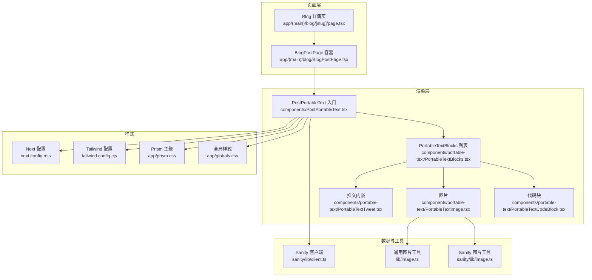
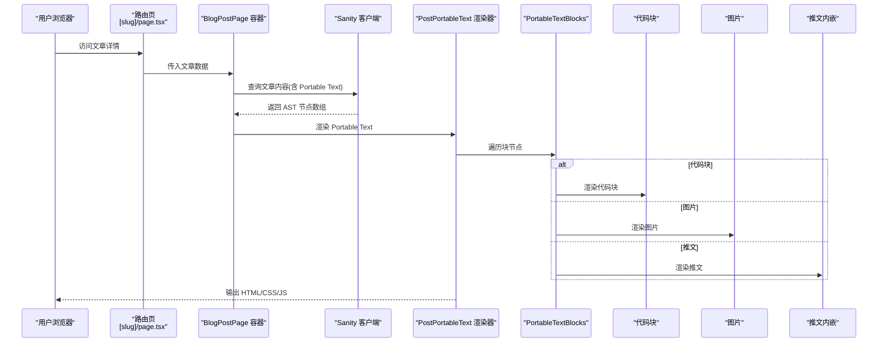
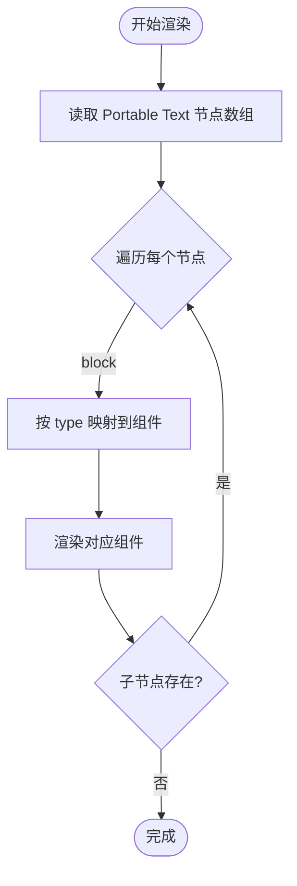
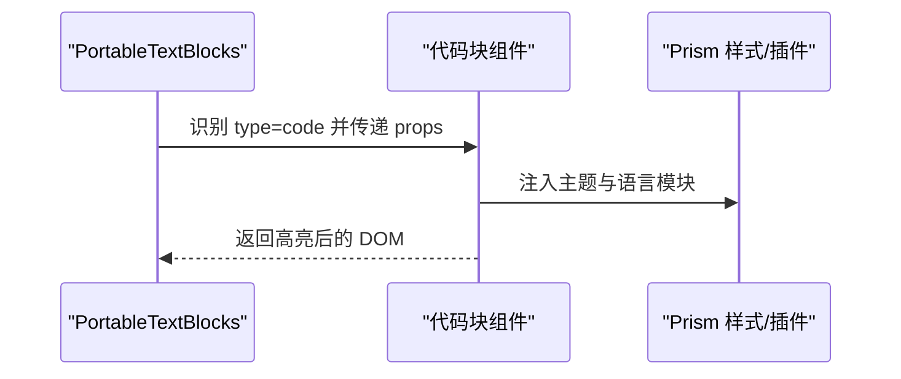
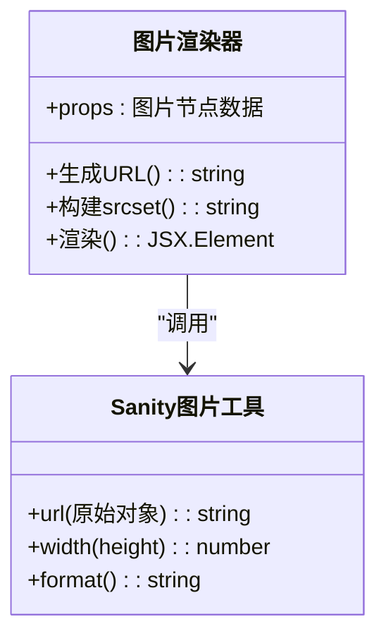
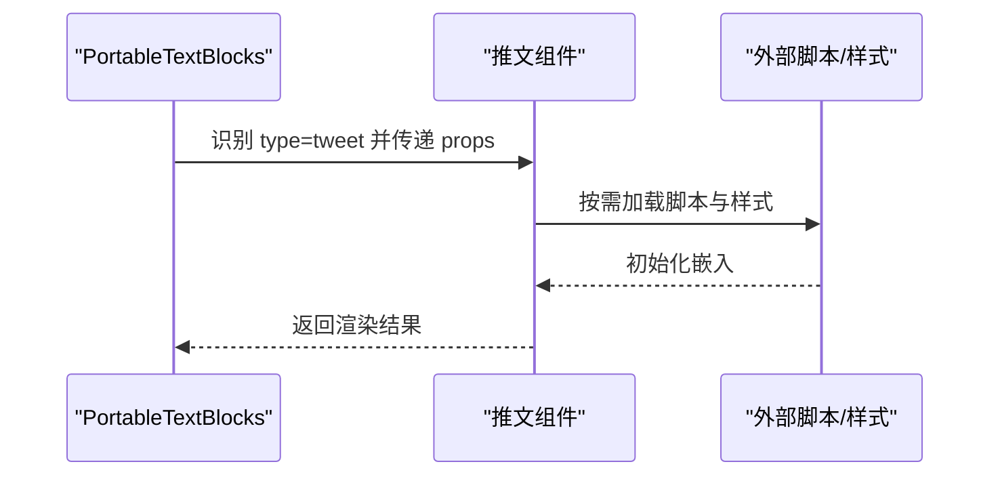
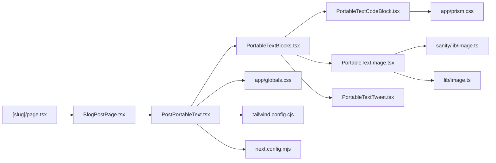

# 内容渲染系统

<cite>
**本文引用的文件**   
- [PostPortableText.tsx](file://components/PostPortableText.tsx)
- [PortableTextBlocks.tsx](file://components/portable-text/PortableTextBlocks.tsx)
- [PortableTextCodeBlock.tsx](file://components/portable-text/PortableTextCodeBlock.tsx)
- [PortableTextImage.tsx](file://components/portable-text/PortableTextImage.tsx)
- [PortableTextTweet.tsx](file://components/portable-text/PortableTextTweet.tsx)
- [prism.css](file://app/prism.css)
- [globals.css](file://app/globals.css)
- [tailwind.config.cjs](file://tailwind.config.cjs)
- [next.config.mjs](file://next.config.mjs)
- [sanity/client.ts](file://sanity/lib/client.ts)
- [sanity/image.ts](file://sanity/lib/image.ts)
- [lib/image.ts](file://lib/image.ts)
- [blog/page.tsx](file://app/(main)/blog/[slug]/page.tsx)
- [blog/BlogPostPage.tsx](file://app/(main)/blog/BlogPostPage.tsx)
- [blog/blog-post.state.ts](file://app/(main)/blog/blog-post.state.ts)
- [blog/loading.tsx](file://app/(main)/blog/[slug]/loading.tsx)
</cite>

## 目录
1. [简介](#简介)
2. [项目结构](#项目结构)
3. [核心组件](#核心组件)
4. [架构总览](#架构总览)
5. [详细组件分析](#详细组件分析)
6. [依赖关系分析](#依赖关系分析)
7. [性能考虑](#性能考虑)
8. [故障排查指南](#故障排查指南)
9. [结论](#结论)
10. [附录](#附录)

## 简介
本文件面向博客内容渲染系统，重点解释基于 Portable Text 的渲染器实现原理与扩展方式。文档涵盖：
- AST 解析与组件映射机制
- 自定义块类型（代码块、图片、内嵌内容）的处理流程
- 样式系统集成（Prism.js 代码高亮、响应式图片）
- 内容安全策略（XSS 防护与内容过滤）
- 配置示例（如何扩展新的内容类型）
- 性能优化技巧（增量渲染与缓存策略）

## 项目结构
本项目采用 Next.js App Router 组织页面与组件，Portable Text 渲染相关逻辑集中在 components/portable-text 与 components/PostPortableText.tsx；Sanity 客户端与图片工具位于 sanity/lib；全局样式与 Prism 主题在 app 目录下。

图表来源
- [blog/page.tsx:1-200](file://app/(main)/blog/[slug]/page.tsx#L1-L200)
- [blog/BlogPostPage.tsx:1-200](file://app/(main)/blog/BlogPostPage.tsx#L1-L200)
- [PostPortableText.tsx:1-200](file://components/PostPortableText.tsx#L1-L200)
- [PortableTextBlocks.tsx:1-200](file://components/portable-text/PortableTextBlocks.tsx#L1-L200)
- [PortableTextCodeBlock.tsx:1-200](file://components/portable-text/PortableTextCodeBlock.tsx#L1-L200)
- [PortableTextImage.tsx:1-200](file://components/portable-text/PortableTextImage.tsx#L1-L200)
- [PortableTextTweet.tsx:1-200](file://components/portable-text/PortableTextTweet.tsx#L1-L200)
- [sanity/client.ts:1-200](file://sanity/lib/client.ts#L1-L200)
- [sanity/image.ts:1-200](file://sanity/lib/image.ts#L1-L200)
- [lib/image.ts:1-200](file://lib/image.ts#L1-L200)
- [prism.css:1-200](file://app/prism.css#L1-L200)
- [globals.css:1-200](file://app/globals.css#L1-L200)
- [tailwind.config.cjs:1-200](file://tailwind.config.cjs#L1-200)
- [next.config.mjs:1-200](file://next.config.mjs#L1-200)

章节来源
- [blog/page.tsx:1-200](file://app/(main)/blog/[slug]/page.tsx#L1-L200)
- [blog/BlogPostPage.tsx:1-200](file://app/(main)/blog/BlogPostPage.tsx#L1-L200)
- [PostPortableText.tsx:1-200](file://components/PostPortableText.tsx#L1-L200)
- [PortableTextBlocks.tsx:1-200](file://components/portable-text/PortableTextBlocks.tsx#L1-L200)
- [PortableTextCodeBlock.tsx:1-200](file://components/portable-text/PortableTextCodeBlock.tsx#L1-L200)
- [PortableTextImage.tsx:1-200](file://components/portable-text/PortableTextImage.tsx#L1-L200)
- [PortableTextTweet.tsx:1-200](file://components/portable-text/PortableTextTweet.tsx#L1-L200)
- [sanity/client.ts:1-200](file://sanity/lib/client.ts#L1-L200)
- [sanity/image.ts:1-200](file://sanity/lib/image.ts#L1-L200)
- [lib/image.ts:1-200](file://lib/image.ts#L1-L200)
- [prism.css:1-200](file://app/prism.css#L1-L200)
- [globals.css:1-200](file://app/globals.css#L1-L200)
- [tailwind.config.cjs:1-200](file://tailwind.config.cjs#L1-200)
- [next.config.mjs:1-200](file://next.config.mjs#L1-200)

## 核心组件
- PostPortableText：Portable Text 渲染入口，负责将 Portable Text 节点树转换为 React 元素，并注入样式与第三方资源（如 Prism）。
- PortableTextBlocks：遍历块级节点，按 type 分发到具体渲染器。
- PortableTextCodeBlock：处理代码块，集成语法高亮。
- PortableTextImage：处理图片，结合 Sanity 图片工具生成响应式 URL。
- PortableTextTweet：处理推文内嵌，按需加载外部脚本与样式。

章节来源
- [PostPortableText.tsx:1-200](file://components/PostPortableText.tsx#L1-L200)
- [PortableTextBlocks.tsx:1-200](file://components/portable-text/PortableTextBlocks.tsx#L1-L200)
- [PortableTextCodeBlock.tsx:1-200](file://components/portable-text/PortableTextCodeBlock.tsx#L1-L200)
- [PortableTextImage.tsx:1-200](file://components/portable-text/PortableTextImage.tsx#L1-L200)
- [PortableTextTweet.tsx:1-200](file://components/portable-text/PortableTextTweet.tsx#L1-L200)

## 架构总览
下图展示从页面请求到最终 DOM 渲染的关键路径，包括数据获取、AST 转换、组件映射与样式注入。

图表来源
- [blog/page.tsx:1-200](file://app/(main)/blog/[slug]/page.tsx#L1-L200)
- [blog/BlogPostPage.tsx:1-200](file://app/(main)/blog/BlogPostPage.tsx#L1-L200)
- [sanity/client.ts:1-200](file://sanity/lib/client.ts#L1-L200)
- [PostPortableText.tsx:1-200](file://components/PostPortableText.tsx#L1-L200)
- [PortableTextBlocks.tsx:1-200](file://components/portable-text/PortableTextBlocks.tsx#L1-L200)
- [PortableTextCodeBlock.tsx:1-200](file://components/portable-text/PortableTextCodeBlock.tsx#L1-L200)
- [PortableTextImage.tsx:1-200](file://components/portable-text/PortableTextImage.tsx#L1-L200)
- [PortableTextTweet.tsx:1-200](file://components/portable-text/PortableTextTweet.tsx#L1-L200)

## 详细组件分析

### Portable Text 渲染器（AST 解析与组件映射）
- 输入：来自 Sanity 的 Portable Text 节点数组（包含 block、list、span 等）。
- 解析：递归遍历节点树，根据 node.type 选择对应渲染函数或组件。
- 映射：通过 type 到组件的映射表进行分发，支持扩展新类型。
- 上下文：可注入样式、主题、语言包、外链策略等。

图表来源
- [PostPortableText.tsx:1-200](file://components/PostPortableText.tsx#L1-L200)
- [PortableTextBlocks.tsx:1-200](file://components/portable-text/PortableTextBlocks.tsx#L1-L200)

章节来源
- [PostPortableText.tsx:1-200](file://components/PostPortableText.tsx#L1-L200)
- [PortableTextBlocks.tsx:1-200](file://components/portable-text/PortableTextBlocks.tsx#L1-L200)

### 自定义块类型：代码块（Syntax Highlighting）
- 触发条件：当节点 type 为代码块时，进入代码块渲染器。
- 高亮集成：引入 Prism 主题与基础样式，动态加载对应语言的语法定义。
- 输出：带类名的 pre/code 结构，便于 Tailwind 与 Prism 共同作用。

图表来源
- [PortableTextCodeBlock.tsx:1-200](file://components/portable-text/PortableTextCodeBlock.tsx#L1-L200)
- [prism.css:1-200](file://app/prism.css#L1-L200)

章节来源
- [PortableTextCodeBlock.tsx:1-200](file://components/portable-text/PortableTextCodeBlock.tsx#L1-L200)
- [prism.css:1-200](file://app/prism.css#L1-L200)

### 自定义块类型：图片（响应式与尺寸优化）
- 触发条件：当节点 type 为图片时，进入图片渲染器。
- 图片处理：使用 Sanity 图片工具生成不同尺寸与格式的 URL，结合 srcset/picture 实现响应式。
- 样式：通过 Tailwind 与全局样式控制布局与占位。

图表来源
- [PortableTextImage.tsx:1-200](file://components/portable-text/PortableTextImage.tsx#L1-L200)
- [sanity/image.ts:1-200](file://sanity/lib/image.ts#L1-L200)
- [lib/image.ts:1-200](file://lib/image.ts#L1-L200)

章节来源
- [PortableTextImage.tsx:1-200](file://components/portable-text/PortableTextImage.tsx#L1-L200)
- [sanity/image.ts:1-200](file://sanity/lib/image.ts#L1-L200)
- [lib/image.ts:1-200](file://lib/image.ts#L1-L200)

### 自定义块类型：内嵌内容（以推文为例）
- 触发条件：当节点 type 为推文时，进入内嵌渲染器。
- 行为：按需加载第三方脚本与样式，避免首屏阻塞。
- 交互：提供错误边界与降级显示。

图表来源
- [PortableTextTweet.tsx:1-200](file://components/portable-text/PortableTextTweet.tsx#L1-L200)

章节来源
- [PortableTextTweet.tsx:1-200](file://components/portable-text/PortableTextTweet.tsx#L1-L200)

### 样式系统集成（Prism 与响应式）
- 主题与基础样式：通过 prism.css 与 globals.css 统一风格。
- Tailwind 集成：在 tailwind.config.cjs 中启用必要插件与自定义主题变量。
- 运行时注入：在渲染器中按需注入 Prism 语言模块与主题。

章节来源
- [prism.css:1-200](file://app/prism.css#L1-L200)
- [globals.css:1-200](file://app/globals.css#L1-L200)
- [tailwind.config.cjs:1-200](file://tailwind.config.cjs#L1-200)

## 依赖关系分析
- 页面层依赖 BlogPostPage 容器，后者组合数据与渲染器。
- 渲染器依赖 PortableTextBlocks 分发器与各具体组件。
- 图片组件依赖 Sanity 图片工具与通用图片工具。
- 代码块组件依赖 Prism 样式与语言模块。
- 推文组件依赖外部脚本与样式。

图表来源
- [blog/page.tsx:1-200](file://app/(main)/blog/[slug]/page.tsx#L1-L200)
- [blog/BlogPostPage.tsx:1-200](file://app/(main)/blog/BlogPostPage.tsx#L1-L200)
- [PostPortableText.tsx:1-200](file://components/PostPortableText.tsx#L1-L200)
- [PortableTextBlocks.tsx:1-200](file://components/portable-text/PortableTextBlocks.tsx#L1-L200)
- [PortableTextCodeBlock.tsx:1-200](file://components/portable-text/PortableTextCodeBlock.tsx#L1-L200)
- [PortableTextImage.tsx:1-200](file://components/portable-text/PortableTextImage.tsx#L1-L200)
- [PortableTextTweet.tsx:1-200](file://components/portable-text/PortableTextTweet.tsx#L1-L200)
- [sanity/image.ts:1-200](file://sanity/lib/image.ts#L1-L200)
- [lib/image.ts:1-200](file://lib/image.ts#L1-L200)
- [prism.css:1-200](file://app/prism.css#L1-L200)
- [globals.css:1-200](file://app/globals.css#L1-L200)
- [tailwind.config.cjs:1-200](file://tailwind.config.cjs#L1-200)
- [next.config.mjs:1-200](file://next.config.mjs#L1-200)

章节来源
- [blog/page.tsx:1-200](file://app/(main)/blog/[slug]/page.tsx#L1-L200)
- [blog/BlogPostPage.tsx:1-200](file://app/(main)/blog/BlogPostPage.tsx#L1-L200)
- [PostPortableText.tsx:1-200](file://components/PostPortableText.tsx#L1-L200)
- [PortableTextBlocks.tsx:1-200](file://components/portable-text/PortableTextBlocks.tsx#L1-L200)
- [PortableTextCodeBlock.tsx:1-200](file://components/portable-text/PortableTextCodeBlock.tsx#L1-L200)
- [PortableTextImage.tsx:1-200](file://components/portable-text/PortableTextImage.tsx#L1-L200)
- [PortableTextTweet.tsx:1-200](file://components/portable-text/PortableTextTweet.tsx#L1-L200)
- [sanity/image.ts:1-200](file://sanity/lib/image.ts#L1-L200)
- [lib/image.ts:1-200](file://lib/image.ts#L1-L200)
- [prism.css:1-200](file://app/prism.css#L1-L200)
- [globals.css:1-200](file://app/globals.css#L1-L200)
- [tailwind.config.cjs:1-200](file://tailwind.config.cjs#L1-200)
- [next.config.mjs:1-200](file://next.config.mjs#L1-200)

## 性能考虑
- 增量渲染与流式：利用 Next.js 的 Suspense 与 streaming，对重型组件（如推文、代码高亮）进行延迟渲染，减少首屏阻塞。
- 懒加载与按需加载：
  - 代码高亮：仅加载当前文章所需的语言模块。
  - 推文：仅在可见区域加载外部脚本。
- 图片优化：
  - 使用 srcset/picture 与多尺寸 URL，降低带宽。
  - 预取关键图片元数据，提升 LCP。
- 缓存策略：
  - 页面级缓存：合理设置 revalidate 与 stale-while-revalidate。
  - 数据缓存：对频繁访问的文章片段进行 Redis/内存缓存。
  - 静态资源缓存：Prism 主题与语言模块通过 CDN 缓存。
- 渲染优化：
  - 避免在渲染路径中进行昂贵计算，必要时使用 useMemo/useCallback。
  - 拆分大块内容，使用虚拟滚动或分页加载。

章节来源
- [blog/loading.tsx:1-200](file://app/(main)/blog/[slug]/loading.tsx#L1-L200)
- [blog/blog-post.state.ts:1-200](file://app/(main)/blog/blog-post.state.ts#L1-200)
- [next.config.mjs:1-200](file://next.config.mjs#L1-200)

## 故障排查指南
- 代码高亮不生效：
  - 检查 Prism 主题与语言模块是否已正确注入。
  - 确认 pre/code 类名与 Prism 匹配。
- 图片模糊或尺寸异常：
  - 核对 Sanity 图片工具的参数（宽度、高度、格式）。
  - 检查 srcset 是否正确生成。
- 推文无法加载：
  - 检查外部脚本是否被 CSP 拦截。
  - 确认网络可达性与域名白名单。
- 样式错乱：
  - 检查 Tailwind 配置与全局样式冲突。
  - 确认 CSS 加载顺序。

章节来源
- [PortableTextCodeBlock.tsx:1-200](file://components/portable-text/PortableTextCodeBlock.tsx#L1-L200)
- [PortableTextImage.tsx:1-200](file://components/portable-text/PortableTextImage.tsx#L1-L200)
- [PortableTextTweet.tsx:1-200](file://components/portable-text/PortableTextTweet.tsx#L1-L200)
- [prism.css:1-200](file://app/prism.css#L1-L200)
- [globals.css:1-200](file://app/globals.css#L1-L200)
- [tailwind.config.cjs:1-200](file://tailwind.config.cjs#L1-200)

## 结论
本渲染系统以 Portable Text 为核心，通过清晰的 AST 解析与组件映射机制，实现了可扩展的内容渲染能力。借助 Prism 与响应式图片工具，兼顾了可读性与性能。通过合理的缓存与懒加载策略，进一步提升了用户体验。未来可在内容安全与可观测性方面继续完善。

## 附录

### 配置示例：扩展新的内容类型
- 步骤概览：
  - 在 PortableTextBlocks 的分发表中注册新 type 到组件的映射。
  - 新建对应组件，处理 props 与渲染逻辑。
  - 如需外部资源，按需加载脚本与样式。
  - 在页面或容器中传入必要的上下文（如主题、语言）。
- 参考位置：
  - 分发器：[PortableTextBlocks.tsx](file://components/portable-text/PortableTextBlocks.tsx)
  - 示例组件：[PortableTextCodeBlock.tsx](file://components/portable-text/PortableTextCodeBlock.tsx)、[PortableTextImage.tsx](file://components/portable-text/PortableTextImage.tsx)、[PortableTextTweet.tsx](file://components/portable-text/PortableTextTweet.tsx)

章节来源
- [PortableTextBlocks.tsx:1-200](file://components/portable-text/PortableTextBlocks.tsx#L1-L200)
- [PortableTextCodeBlock.tsx:1-200](file://components/portable-text/PortableTextCodeBlock.tsx#L1-L200)
- [PortableTextImage.tsx:1-200](file://components/portable-text/PortableTextImage.tsx#L1-L200)
- [PortableTextTweet.tsx:1-200](file://components/portable-text/PortableTextTweet.tsx#L1-L200)

### 内容安全策略（XSS 防护与内容过滤）
- 建议措施：
  - 对富文本内容进行清洗，移除危险标签与属性。
  - 对外链添加 rel="noopener noreferrer" 与 target="_blank"。
  - 使用 CSP 限制脚本与样式来源。
  - 对用户上传的资源进行校验与白名单管理。
- 参考位置：
  - 全局样式与主题：[globals.css](file://app/globals.css)、[prism.css](file://app/prism.css)
  - 平台配置：[next.config.mjs](file://next.config.mjs)

章节来源
- [globals.css:1-200](file://app/globals.css#L1-L200)
- [prism.css:1-200](file://app/prism.css#L1-L200)
- [next.config.mjs:1-200](file://next.config.mjs#L1-200)