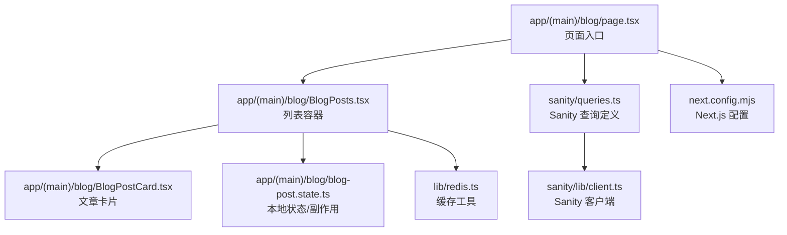
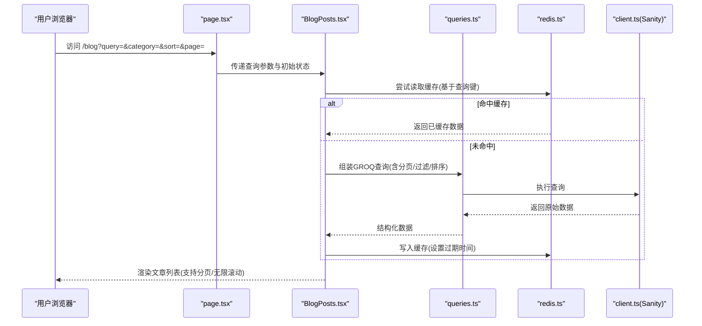
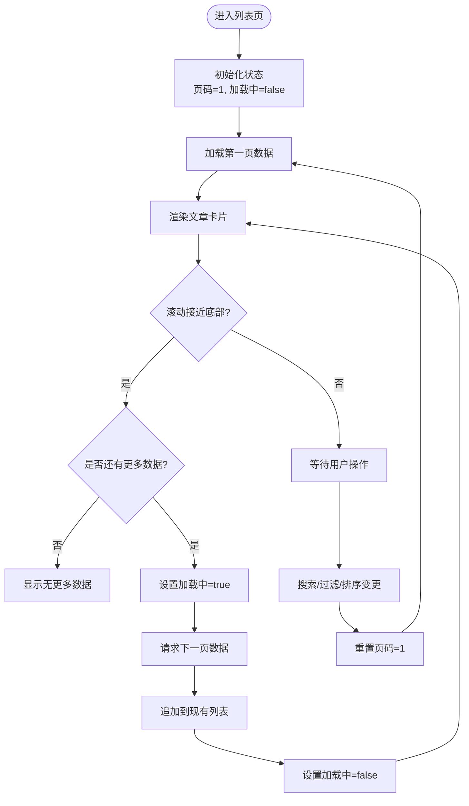
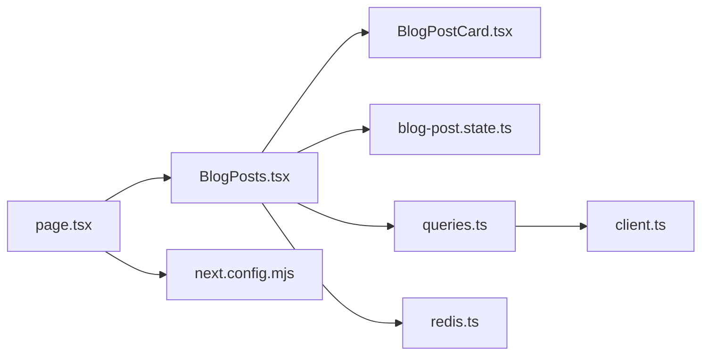

# 文章列表页面

<cite>
**本文引用的文件**   
- [app/(main)/blog/page.tsx](file://app/(main)/blog/page.tsx)
- [app/(main)/blog/BlogPosts.tsx](file://app/(main)/blog/BlogPosts.tsx)
- [app/(main)/blog/BlogPostCard.tsx](file://app/(main)/blog/BlogPostCard.tsx)
- [sanity/queries.ts](file://sanity/queries.ts)
- [sanity/lib/client.ts](file://sanity/lib/client.ts)
- [lib/redis.ts](file://lib/redis.ts)
- [next.config.mjs](file://next.config.mjs)
- [app/(main)/blog/blog-post.state.ts](file://app/(main)/blog/blog-post.state.ts)
</cite>

## 目录
1. [简介](#简介)
2. [项目结构](#项目结构)
3. [核心组件](#核心组件)
4. [架构总览](#架构总览)
5. [详细组件分析](#详细组件分析)
6. [依赖关系分析](#依赖关系分析)
7. [性能考量](#性能考量)
8. [故障排查指南](#故障排查指南)
9. [结论](#结论)
10. [附录](#附录)

## 简介
本文件面向博客文章列表页面的实现与优化，覆盖以下关键主题：
- 分页加载、搜索过滤与排序的实现策略
- 服务端数据获取与 Sanity CMS 查询优化、缓存机制
- 响应式布局与移动端适配方案
- 性能优化技巧（无限滚动、懒加载、预加载）
- 与后端 API 的交互模式与错误处理策略

## 项目结构
文章列表页面位于 app/(main)/blog 目录下，包含页面入口、列表容器、卡片组件以及状态管理相关文件；Sanity 客户端与查询定义位于 sanity 目录；Redis 缓存工具在 lib 目录。

图表来源
- [app/(main)/blog/page.tsx](file://app/(main)/blog/page.tsx)
- [app/(main)/blog/BlogPosts.tsx](file://app/(main)/blog/BlogPosts.tsx)
- [app/(main)/blog/BlogPostCard.tsx](file://app/(main)/blog/BlogPostCard.tsx)
- [sanity/queries.ts](file://sanity/queries.ts)
- [sanity/lib/client.ts](file://sanity/lib/client.ts)
- [lib/redis.ts](file://lib/redis.ts)
- [next.config.mjs](file://next.config.mjs)
- [app/(main)/blog/blog-post.state.ts](file://app/(main)/blog/blog-post.state.ts)

章节来源
- [app/(main)/blog/page.tsx](file://app/(main)/blog/page.tsx)
- [app/(main)/blog/BlogPosts.tsx](file://app/(main)/blog/BlogPosts.tsx)
- [app/(main)/blog/BlogPostCard.tsx](file://app/(main)/blog/BlogPostCard.tsx)
- [sanity/queries.ts](file://sanity/queries.ts)
- [sanity/lib/client.ts](file://sanity/lib/client.ts)
- [lib/redis.ts](file://lib/redis.ts)
- [next.config.mjs](file://next.config.mjs)
- [app/(main)/blog/blog-post.state.ts](file://app/(main)/blog/blog-post.state.ts)

## 核心组件
- 页面入口 page.tsx：负责路由渲染、初始参数解析、SEO 元信息设置、将查询参数传递给列表容器。
- 列表容器 BlogPosts.tsx：承载搜索、过滤、排序、分页/无限滚动的 UI 与逻辑，协调服务端请求与本地状态。
- 文章卡片 BlogPostCard.tsx：展示单篇文章摘要信息，支持图片懒加载与点击跳转。
- 状态与副作用 blog-post.state.ts：集中管理列表相关状态（如加载中、错误、页码、筛选条件等）。
- Sanity 查询 queries.ts：封装按时间、分类、关键词、分页等条件的 GROQ 查询。
- Sanity 客户端 client.ts：提供带鉴权与配置的客户端实例。
- Redis 缓存 redis.ts：用于对高频查询结果进行缓存，降低 CDN/边缘层压力。
- Next.js 配置 next.config.mjs：可配置图像优化、缓存头、CDN 集成等。

章节来源
- [app/(main)/blog/page.tsx](file://app/(main)/blog/page.tsx)
- [app/(main)/blog/BlogPosts.tsx](file://app/(main)/blog/BlogPosts.tsx)
- [app/(main)/blog/BlogPostCard.tsx](file://app/(main)/blog/BlogPostCard.tsx)
- [app/(main)/blog/blog-post.state.ts](file://app/(main)/blog/blog-post.state.ts)
- [sanity/queries.ts](file://sanity/queries.ts)
- [sanity/lib/client.ts](file://sanity/lib/client.ts)
- [lib/redis.ts](file://lib/redis.ts)
- [next.config.mjs](file://next.config.mjs)

## 架构总览
整体数据流从浏览器到 Sanity CMS，中间经过 Next.js 应用层与可选的 Redis 缓存层。

图表来源
- [app/(main)/blog/page.tsx](file://app/(main)/blog/page.tsx)
- [app/(main)/blog/BlogPosts.tsx](file://app/(main)/blog/BlogPosts.tsx)
- [sanity/queries.ts](file://sanity/queries.ts)
- [lib/redis.ts](file://lib/redis.ts)
- [sanity/lib/client.ts](file://sanity/lib/client.ts)

## 详细组件分析

### 页面入口 page.tsx
职责
- 解析 URL 查询参数（如 q、category、sort、page），并校验默认值。
- 设置页面标题、描述、Open Graph 等 SEO 元信息。
- 将参数透传给列表容器组件，确保 SSR/CSR 一致性。

关键点
- 使用 Next.js 的路由参数与 searchParams 获取查询字符串。
- 通过 React Server Components 或客户端组件边界控制渲染策略。
- 为 SEO 生成稳定的 meta 标签，利于搜索引擎抓取。

章节来源
- [app/(main)/blog/page.tsx](file://app/(main)/blog/page.tsx)

### 列表容器 BlogPosts.tsx
职责
- 维护搜索词、分类、排序、当前页码等状态。
- 触发数据加载（首次与翻页/无限滚动时）。
- 组合查询参数并调用数据源（优先读缓存，否则走 Sanity）。
- 处理加载态、空态、错误态与重试。

功能要点
- 分页加载：根据 page 与 pageSize 计算偏移量，向服务端请求下一页数据。
- 搜索过滤：将关键词映射为 GROQ 过滤条件（如 title/body 模糊匹配）。
- 排序：支持按发布时间、更新时间、热度等维度排序。
- 无限滚动：监听滚动位置，当接近底部时自动加载下一页。
- 预加载：在用户悬停或即将进入视口时预取下一页数据。
- 防抖与节流：搜索输入防抖，滚动事件节流，避免频繁请求。

章节来源
- [app/(main)/blog/BlogPosts.tsx](file://app/(main)/blog/BlogPosts.tsx)

#### 无限滚动与预加载流程

图表来源
- [app/(main)/blog/BlogPosts.tsx](file://app/(main)/blog/BlogPosts.tsx)

### 文章卡片 BlogPostCard.tsx
职责
- 展示文章标题、摘要、封面图、标签、阅读时长等。
- 实现图片懒加载，减少首屏资源体积。
- 点击跳转到文章详情页。

优化点
- 使用占位图与骨架屏提升感知性能。
- 对大图采用渐进式加载或低质量占位图(LQIP)。
- 链接使用 prefetch 或预连接，缩短跳转延迟。

章节来源
- [app/(main)/blog/BlogPostCard.tsx](file://app/(main)/blog/BlogPostCard.tsx)

### 状态与副作用 blog-post.state.ts
职责
- 集中管理列表相关状态（加载中、错误、数据、页码、筛选条件）。
- 提供统一的更新方法与副作用钩子（如滚动监听、网络状态监听）。
- 暴露订阅接口供组件消费，避免重复状态分散。

设计建议
- 使用轻量状态库或自定义 Hook 管理复杂状态。
- 将副作用与 UI 解耦，便于测试与维护。

章节来源
- [app/(main)/blog/blog-post.state.ts](file://app/(main)/blog/blog-post.state.ts)

### Sanity 查询与客户端
queries.ts
- 封装常用查询：按时间范围、分类、关键词、分页、排序等。
- 使用 GROQ 表达式构建高效查询，仅拉取必要字段。
- 支持聚合统计（如总数）以便前端正确计算分页。

client.ts
- 提供带环境变量的 Sanity 客户端实例。
- 统一错误处理与重试策略（如网络抖动时的指数退避）。

章节来源
- [sanity/queries.ts](file://sanity/queries.ts)
- [sanity/lib/client.ts](file://sanity/lib/client.ts)

### 缓存机制（Redis）
redis.ts
- 以“查询键”为维度缓存结果，键包含关键词、分类、排序、页码等。
- 设置合理的 TTL，保证数据新鲜度与性能平衡。
- 在写操作后主动失效相关缓存键，避免脏读。

章节来源
- [lib/redis.ts](file://lib/redis.ts)

### Next.js 配置
next.config.mjs
- 配置图像优化（格式、尺寸、占位图）。
- 设置静态资源与 API 响应的缓存头。
- 集成 CDN 与边缘缓存策略，加速全球访问。

章节来源
- [next.config.mjs](file://next.config.mjs)

## 依赖关系分析
组件与模块之间的依赖如下：

图表来源
- [app/(main)/blog/page.tsx](file://app/(main)/blog/page.tsx)
- [app/(main)/blog/BlogPosts.tsx](file://app/(main)/blog/BlogPosts.tsx)
- [app/(main)/blog/BlogPostCard.tsx](file://app/(main)/blog/BlogPostCard.tsx)
- [app/(main)/blog/blog-post.state.ts](file://app/(main)/blog/blog-post.state.ts)
- [sanity/queries.ts](file://sanity/queries.ts)
- [sanity/lib/client.ts](file://sanity/lib/client.ts)
- [lib/redis.ts](file://lib/redis.ts)
- [next.config.mjs](file://next.config.mjs)

章节来源
- [app/(main)/blog/page.tsx](file://app/(main)/blog/page.tsx)
- [app/(main)/blog/BlogPosts.tsx](file://app/(main)/blog/BlogPosts.tsx)
- [app/(main)/blog/BlogPostCard.tsx](file://app/(main)/blog/BlogPostCard.tsx)
- [app/(main)/blog/blog-post.state.ts](file://app/(main)/blog/blog-post.state.ts)
- [sanity/queries.ts](file://sanity/queries.ts)
- [sanity/lib/client.ts](file://sanity/lib/client.ts)
- [lib/redis.ts](file://lib/redis.ts)
- [next.config.mjs](file://next.config.mjs)

## 性能考量
- 服务端渲染与增量静态再生成（ISR）结合，提高首屏速度并降低冷启动成本。
- 使用只读最小字段集（投影）减少带宽与解析开销。
- 图片懒加载与自适应尺寸，避免大图片阻塞主线程。
- 搜索输入防抖、滚动节流，降低不必要的重渲染与请求。
- 预加载下一页数据，提升翻页体验。
- 合理设置 Redis 缓存 TTL，兼顾新鲜度与命中率。
- 利用 Next.js 图像优化与 CDN 缓存头，减少回源与重复传输。

[本节为通用指导，不直接分析具体文件]

## 故障排查指南
常见问题与定位方法
- 列表不更新：检查查询参数变化是否触发重新加载；确认状态更新与副作用清理是否正确。
- 无限滚动无效：验证滚动监听器绑定与移除；检查“接近底部”阈值与“是否还有更多数据”判断。
- 搜索结果不准确：核对关键词映射到 GROQ 表达式的逻辑；确认大小写与分词策略。
- 缓存命中但数据陈旧：检查缓存键是否包含所有影响结果的参数；确认写操作后是否失效相关键。
- 网络错误与重试：查看客户端错误处理与重试策略；记录失败原因与次数，必要时降级到空态提示。

章节来源
- [app/(main)/blog/BlogPosts.tsx](file://app/(main)/blog/BlogPosts.tsx)
- [sanity/lib/client.ts](file://sanity/lib/client.ts)
- [lib/redis.ts](file://lib/redis.ts)

## 结论
文章列表页面通过清晰的组件分层、健壮的查询封装与缓存策略，实现了高效的搜索、过滤、排序与分页/无限滚动体验。配合图片懒加载、预加载与 Next.js 优化能力，可在多端设备上保持流畅与稳定。建议在后续迭代中持续完善错误监控、性能指标采集与用户体验反馈闭环。

[本节为总结性内容，不直接分析具体文件]

## 附录
- 响应式布局建议
  - 使用栅格系统在不同断点下调整列数与间距。
  - 在小屏幕上隐藏次要信息（如标签），保留标题与摘要。
  - 触控友好的卡片尺寸与点击区域。
- 移动端适配方案
  - 禁用或降低动画强度，减少重排与重绘。
  - 使用更小的图片与更低分辨率的封面图。
  - 简化导航与筛选面板，提供折叠展开交互。
- 代码示例路径（参考实现位置）
  - 无限滚动与预加载：[app/(main)/blog/BlogPosts.tsx](file://app/(main)/blog/BlogPosts.tsx)
  - 图片懒加载与占位图：[app/(main)/blog/BlogPostCard.tsx](file://app/(main)/blog/BlogPostCard.tsx)
  - Sanity 查询与客户端：[sanity/queries.ts](file://sanity/queries.ts), [sanity/lib/client.ts](file://sanity/lib/client.ts)
  - 缓存与失效：[lib/redis.ts](file://lib/redis.ts)
  - 页面入口与 SEO：[app/(main)/blog/page.tsx](file://app/(main)/blog/page.tsx)
  - 全局配置与缓存头：[next.config.mjs](file://next.config.mjs)

[本节为补充说明，不直接分析具体文件]