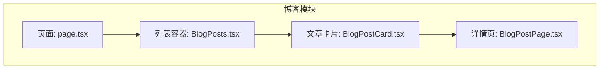
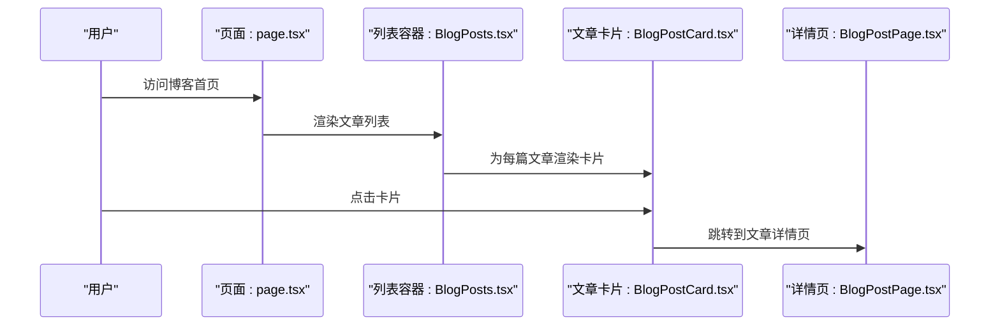
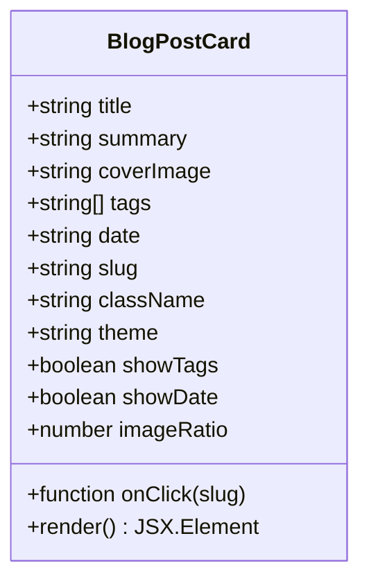
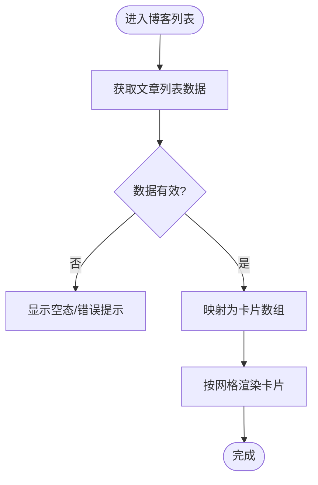
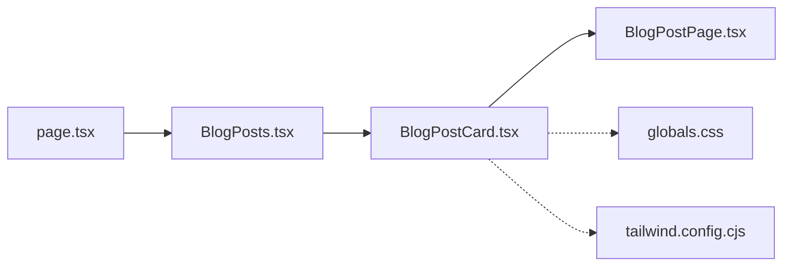

# 文章卡片组件

<cite>
**本文引用的文件**   
- [BlogPostCard.tsx](file://app/(main)/blog/BlogPostCard.tsx)
- [BlogPosts.tsx](file://app/(main)/blog/BlogPosts.tsx)
- [page.tsx](file://app/(main)/blog/page.tsx)
- [BlogPostPage.tsx](file://app/(main)/blog/BlogPostPage.tsx)
- [globals.css](file://app/globals.css)
- [tailwind.config.cjs](file://tailwind.config.cjs)
</cite>

## 目录
1. [简介](#简介)
2. [项目结构](#项目结构)
3. [核心组件](#核心组件)
4. [架构总览](#架构总览)
5. [详细组件分析](#详细组件分析)
6. [依赖分析](#依赖分析)
7. [性能考虑](#性能考虑)
8. [故障排查指南](#故障排查指南)
9. [结论](#结论)
10. [附录](#附录)

## 简介
本文档围绕“文章卡片组件”（BlogPostCard）进行系统化说明，涵盖设计模式与复用策略、Props 接口与默认值、视觉设计与响应式适配、状态管理（悬停/点击/数据绑定）、可定制性（主题/样式覆盖/扩展点）、使用示例以及性能优化策略（虚拟化与内存管理）。文档面向不同技术背景的读者，力求在保持准确性的同时提供清晰的图示与实操指引。

## 项目结构
与文章卡片相关的代码主要位于 blog 模块中：
- 页面层：展示文章列表与单篇文章详情
- 组件层：文章卡片、文章列表容器、文章详情页等
- 样式层：全局样式与 Tailwind 配置

图表来源
- [page.tsx](file://app/(main)/blog/page.tsx)
- [BlogPosts.tsx](file://app/(main)/blog/BlogPosts.tsx)
- [BlogPostCard.tsx](file://app/(main)/blog/BlogPostCard.tsx)
- [BlogPostPage.tsx](file://app/(main)/blog/BlogPostPage.tsx)

章节来源
- [page.tsx](file://app/(main)/blog/page.tsx)
- [BlogPosts.tsx](file://app/(main)/blog/BlogPosts.tsx)
- [BlogPostCard.tsx](file://app/(main)/blog/BlogPostCard.tsx)
- [BlogPostPage.tsx](file://app/(main)/blog/BlogPostPage.tsx)

## 核心组件
- 文章卡片（BlogPostCard）
  - 职责：渲染单篇文章的摘要信息，包括标题、摘要、标签、日期、封面图等；承载交互（悬停、点击跳转）与可定制能力（主题、样式覆盖）。
  - 输入：通过 Props 接收文章数据与行为回调（如点击跳转、自定义渲染钩子等）。
  - 输出：返回一个可复用的卡片 UI 节点。

- 列表容器（BlogPosts）
  - 职责：获取文章列表数据，按网格布局渲染多个 BlogPostCard，并处理分页/加载态。
  - 与卡片的关系：作为父容器向卡片传递统一的数据结构与事件处理。

- 页面入口（page.tsx）
  - 职责：组织路由与页面级布局，引入列表容器以展示文章列表。

- 详情页（BlogPostPage.tsx）
  - 职责：根据 slug 渲染单篇文章内容；卡片点击后导航至该页。

章节来源
- [BlogPostCard.tsx](file://app/(main)/blog/BlogPostCard.tsx)
- [BlogPosts.tsx](file://app/(main)/blog/BlogPosts.tsx)
- [page.tsx](file://app/(main)/blog/page.tsx)
- [BlogPostPage.tsx](file://app/(main)/blog/BlogPostPage.tsx)

## 架构总览
从页面到卡片的调用链如下：

图表来源
- [page.tsx](file://app/(main)/blog/page.tsx)
- [BlogPosts.tsx](file://app/(main)/blog/BlogPosts.tsx)
- [BlogPostCard.tsx](file://app/(main)/blog/BlogPostCard.tsx)
- [BlogPostPage.tsx](file://app/(main)/blog/BlogPostPage.tsx)

## 详细组件分析

### 组件：BlogPostCard
- 设计模式
  - 受控展示型组件：由外部传入数据与行为，内部负责呈现与基础交互。
  - 组合优先：将标题、摘要、标签、时间、封面图拆分为子元素或插槽，便于复用与扩展。
  - 主题驱动：通过 CSS 变量或 Tailwind 语义化类名实现明暗主题切换。

- Props 接口与默认值
  - 建议字段（类型与用途）
    - title: string — 文章标题
    - summary: string — 文章摘要
    - coverImage: string | null — 封面图 URL
    - tags: string[] — 标签集合
    - date: string — 发布日期（ISO 字符串或格式化后的文本）
    - slug: string — 文章唯一标识，用于路由跳转
    - onClick?: (slug: string) => void — 点击回调
    - className?: string — 外层容器类名，供外部覆盖
    - theme?: "light" | "dark" | "auto" — 主题模式
    - showTags?: boolean — 是否显示标签
    - showDate?: boolean — 是否显示日期
    - imageRatio?: number — 封面图宽高比
  - 默认值策略
    - 对可选字段设置合理默认值（如不显示标签/日期时隐藏对应区块），保证最小可用形态。
    - 主题默认跟随系统或全局主题提供者。

- 视觉设计与响应式
  - 布局
    - 桌面端：双列/三列网格，卡片等宽等高，图片与文字区域比例固定。
    - 平板端：两列网格，适当增大内边距与字号。
    - 移动端：单列堆叠，图片全宽，文字紧凑排版。
  - 交互
    - 悬停：轻微上浮 + 阴影加深，边框高亮，提升可点击感知。
    - 点击：触发 onClick 并导航至详情页。
  - 主题
    - 明暗主题下背景、文字、边框、阴影自动切换。
    - 支持通过 className 注入额外样式覆盖默认外观。

- 状态管理与事件
  - 本地状态
    - hover: boolean — 控制悬停态样式
    - loading: boolean — 封面图加载态（骨架屏或占位）
  - 事件
    - onMouseEnter/onMouseLeave 切换 hover
    - onClick 触发导航或回调
  - 数据绑定
    - 所有展示字段均通过 props 单向绑定，避免内部可变状态污染。

- 可定制性与扩展点
  - 主题支持：通过 theme 或全局主题上下文切换。
  - 样式覆盖：className 透传、CSS 变量覆盖、Tailwind 类名叠加。
  - 扩展点：
    - 自定义渲染钩子：如 renderTitle/renderSummary/renderTags，允许上层替换局部渲染逻辑。
    - 插槽：封面图、标签、日期等位置可被替换为自定义组件。

- 使用示例（场景化）
  - 基础用法：仅传入必要字段（title、summary、slug），其余按需开启。
  - 带封面与标签：传入 coverImage 与 tags，并开启 showTags。
  - 自定义点击行为：传入 onClick 执行埋点或拦截跳转。
  - 主题覆盖：通过 className 注入品牌色或圆角风格。
  - 列表复用：在 BlogPosts 中以 map 渲染多张卡片，配合网格布局。

- 错误边界与健壮性
  - 空数据保护：当缺少关键字段时降级显示占位文案。
  - 图片失败回退：onError 时显示默认占位图。
  - 链接安全：对外部链接使用 rel="noopener noreferrer"。

图表来源
- [BlogPostCard.tsx](file://app/(main)/blog/BlogPostCard.tsx)

章节来源
- [BlogPostCard.tsx](file://app/(main)/blog/BlogPostCard.tsx)

### 组件：BlogPosts（列表容器）
- 职责
  - 拉取文章列表数据（服务端/客户端均可）。
  - 将数据映射为 BlogPostCard 数组，并按网格布局渲染。
  - 处理加载态、空态与错误态。
- 与卡片关系
  - 作为父容器统一管理数据流与事件分发。
  - 通过统一的 props 结构确保卡片一致性。

图表来源
- [BlogPosts.tsx](file://app/(main)/blog/BlogPosts.tsx)

章节来源
- [BlogPosts.tsx](file://app/(main)/blog/BlogPosts.tsx)

### 页面：page.tsx（博客首页）
- 职责
  - 组织页面布局与 SEO 元信息。
  - 引入并渲染 BlogPosts 列表容器。
- 与卡片关系
  - 间接通过列表容器消费卡片组件。

章节来源
- [page.tsx](file://app/(main)/blog/page.tsx)

### 页面：BlogPostPage.tsx（文章详情）
- 职责
  - 根据 slug 渲染文章正文、目录、评论等。
- 与卡片关系
  - 卡片点击后导航至此页面，形成“列表→详情”的完整链路。

章节来源
- [BlogPostPage.tsx](file://app/(main)/blog/BlogPostPage.tsx)

## 依赖分析
- 组件耦合
  - BlogPostCard 低耦合：仅依赖 props 与基础 UI 库（如 Tailwind 类名）。
  - BlogPosts 作为聚合器，集中数据与渲染逻辑。
- 外部依赖
  - 样式：Tailwind CSS 与全局样式（globals.css）。
  - 路由：Next.js 路由机制（基于文件名与参数）。
- 可能的循环依赖
  - 当前结构清晰，未见循环引用风险。

图表来源
- [page.tsx](file://app/(main)/blog/page.tsx)
- [BlogPosts.tsx](file://app/(main)/blog/BlogPosts.tsx)
- [BlogPostCard.tsx](file://app/(main)/blog/BlogPostCard.tsx)
- [BlogPostPage.tsx](file://app/(main)/blog/BlogPostPage.tsx)
- [globals.css](file://app/globals.css)
- [tailwind.config.cjs](file://tailwind.config.cjs)

章节来源
- [page.tsx](file://app/(main)/blog/page.tsx)
- [BlogPosts.tsx](file://app/(main)/blog/BlogPosts.tsx)
- [BlogPostCard.tsx](file://app/(main)/blog/BlogPostCard.tsx)
- [BlogPostPage.tsx](file://app/(main)/blog/BlogPostPage.tsx)
- [globals.css](file://app/globals.css)
- [tailwind.config.cjs](file://tailwind.config.cjs)

## 性能考虑
- 虚拟滚动
  - 当文章数量较大时，建议使用虚拟滚动（如 react-window/virtuoso）只渲染可视区内的卡片，显著降低 DOM 节点数与重排开销。
- 懒加载与占位
  - 封面图采用懒加载与占位图，减少首屏带宽压力。
  - 长摘要可截断并在需要时展开，避免一次性渲染大量文本。
- 记忆化与稳定引用
  - 对复杂计算或昂贵子树使用 memo/useMemo/useCallback，避免不必要的重渲染。
  - 为 onClick 等回调提供稳定引用，防止子组件因函数变化而重复渲染。
- 图片优化
  - 使用合适的尺寸与格式（WebP/AVIF），结合 srcset 与 sizes 属性，提升加载速度。
- 内存管理
  - 及时清理事件监听与定时器，避免闭包泄漏。
  - 大对象缓存需设置过期策略，防止内存持续增长。

[本节为通用性能指导，无需特定文件来源]

## 故障排查指南
- 卡片无法点击
  - 检查 onClick 是否正确传入且未被阻止冒泡。
  - 确认路由 slug 正确且详情页存在。
- 主题不生效
  - 检查 theme 值与全局主题提供者是否一致。
  - 确认 Tailwind 配置包含相关颜色与变体。
- 图片加载失败
  - 添加 onError 回退逻辑，显示默认占位图。
  - 校验图片 URL 可达性与跨域策略。
- 样式覆盖无效
  - 检查 className 优先级与 !important 的使用。
  - 确认 Tailwind 类名未被构建阶段移除。

章节来源
- [BlogPostCard.tsx](file://app/(main)/blog/BlogPostCard.tsx)
- [globals.css](file://app/globals.css)
- [tailwind.config.cjs](file://tailwind.config.cjs)

## 结论
BlogPostCard 是一个低耦合、高可定制的展示型组件，适合在多种场景中复用。通过合理的 Props 设计、响应式布局与主题支持，它能够在不同屏幕尺寸与品牌风格下保持一致体验。结合虚拟滚动、懒加载与记忆化等策略，可在大数据量下维持良好性能。建议在列表容器中统一管理数据与事件，并通过扩展点满足个性化需求。

[本节为总结性内容，无需特定文件来源]

## 附录
- 最佳实践清单
  - 始终为卡片提供稳定的 key（使用 slug）。
  - 对外部链接增加安全属性。
  - 为图片提供 alt 文本以提升无障碍体验。
  - 在大型列表中启用虚拟滚动与懒加载。
  - 通过 className 与 CSS 变量进行主题与样式覆盖，避免直接修改组件源码。

[本节为补充说明，无需特定文件来源]