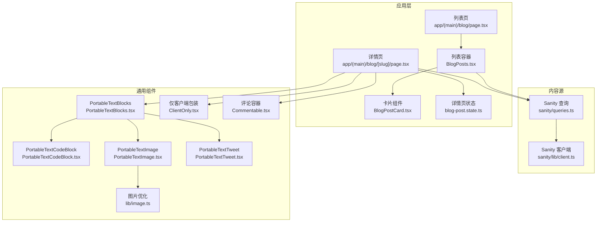
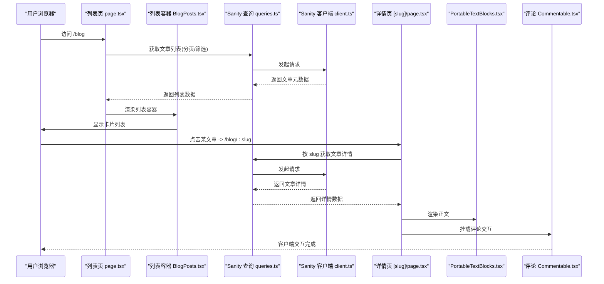
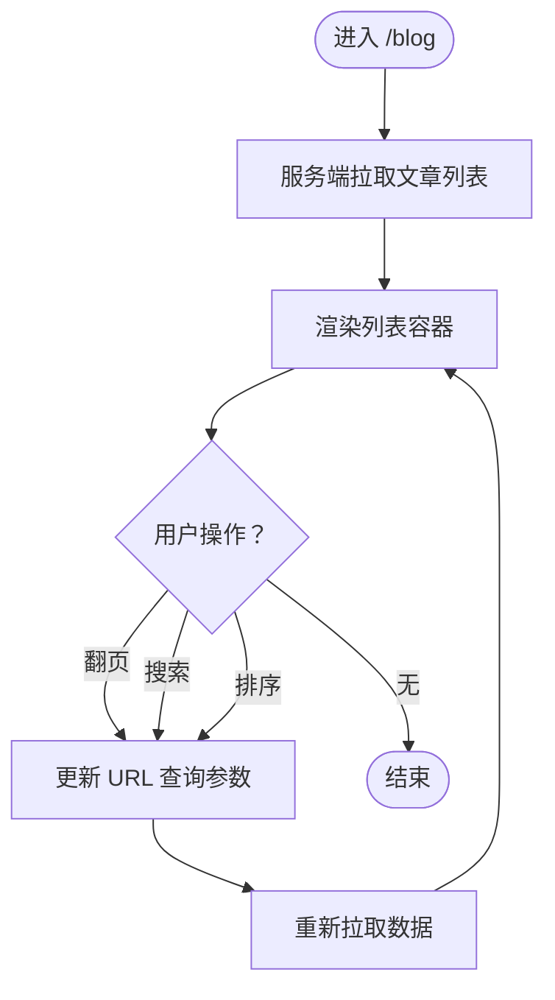
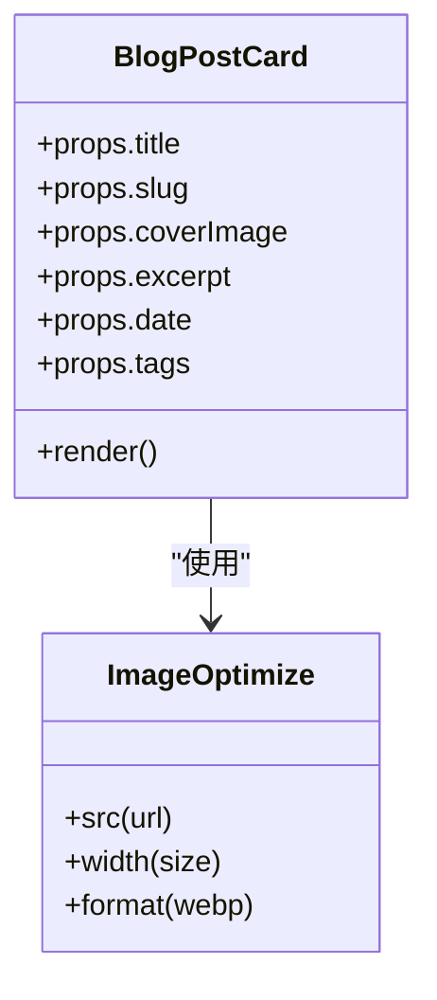
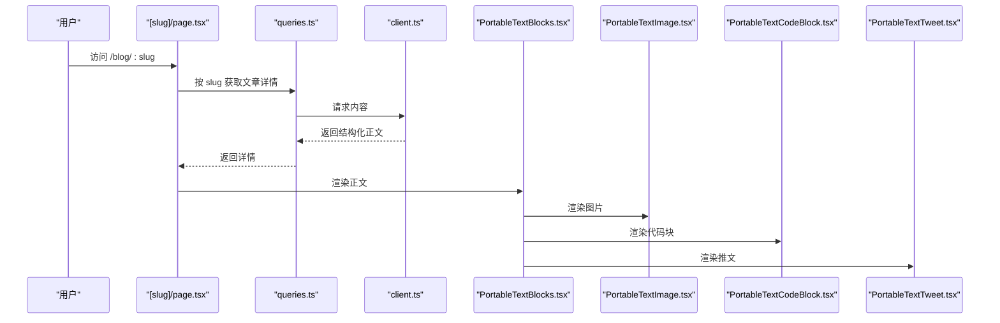
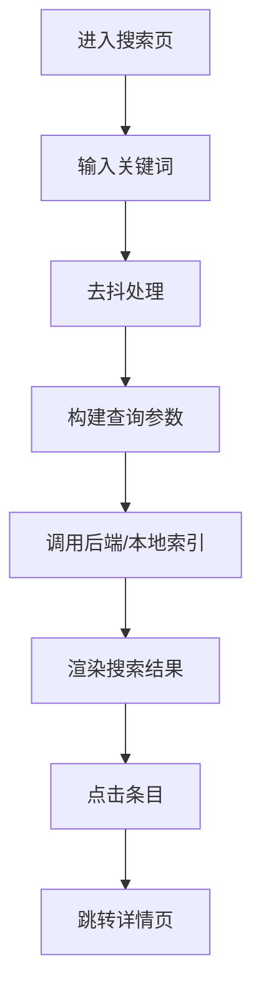
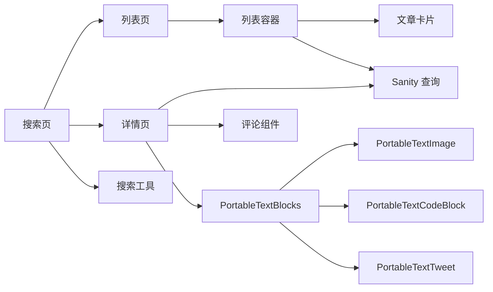

# 文章展示功能

<cite>
**本文引用的文件**   
- [app/(main)/blog/page.tsx](file://app/(main)/blog/page.tsx)
- [app/(main)/blog/BlogPosts.tsx](file://app/(main)/blog/BlogPosts.tsx)
- [app/(main)/blog/BlogPostCard.tsx](file://app/(main)/blog/BlogPostCard.tsx)
- [app/(main)/blog/[slug]/page.tsx](file://app/(main)/blog/[slug]/page.tsx)
- [app/(main)/blog/[slug]/loading.tsx](file://app/(main)/blog/[slug]/loading.tsx)
- [app/(main)/blog/blog-post.state.ts](file://app/(main)/blog/blog-post.state.ts)
- [sanity/queries.ts](file://sanity/queries.ts)
- [sanity/lib/client.ts](file://sanity/lib/client.ts)
- [lib/image.ts](file://lib/image.ts)
- [components/ClientOnly.tsx](file://components/ClientOnly.tsx)
- [components/Commentable.tsx](file://components/Commentable.tsx)
- [components/Prose.tsx](file://components/Prose.tsx)
- [components/portable-text/PortableTextBlocks.tsx](file://components/portable-text/PortableTextBlocks.tsx)
- [components/portable-text/PortableTextCodeBlock.tsx](file://components/portable-text/PortableTextCodeBlock.tsx)
- [components/portable-text/PortableTextImage.tsx](file://components/portable-text/PortableTextImage.tsx)
- [components/portable-text/PortableTextTweet.tsx](file://components/portable-text/PortableTextTweet.tsx)
- [app/(main)/serach/page.tsx](file://app/(main)/serach/page.tsx)
- [app/(main)/serach/utils.ts](file://app/(main)/serach/utils.ts)
- [app/(main)/serach/FunctionBus.ts](file://app/(main)/serach/FunctionBus.ts)
</cite>

## 目录
1. [简介](#简介)
2. [项目结构](#项目结构)
3. [核心组件](#核心组件)
4. [架构总览](#架构总览)
5. [详细组件分析](#详细组件分析)
6. [依赖关系分析](#依赖关系分析)
7. [性能与缓存](#性能与缓存)
8. [故障排查指南](#故障排查指南)
9. [结论](#结论)
10. [附录：使用模式与示例路径](#附录使用模式与示例路径)

## 简介
本文件聚焦博客系统的“文章展示”能力，覆盖以下关键目标：
- 文章列表页与详情页的实现细节
- 动态路由处理、分页加载、搜索过滤与排序
- BlogPostCard 组件的设计模式与复用策略
- 服务端渲染（SSR）与客户端交互的结合方式
- 数据获取优化与缓存策略
- 响应式设计与移动端适配方案
- 具体代码示例与组件使用模式（以源码路径引用为主）

## 项目结构
围绕“文章展示”的核心目录与职责如下：
- app/(main)/blog: 文章列表与详情页面、卡片组件、状态管理、目录等
- sanity/*: Sanity CMS 查询与客户端配置
- components/portable-text/*: 富文本渲染器（图片、代码块、推文等）
- lib/image.ts: 图片尺寸与优化参数
- components/ClientOnly.tsx: 仅客户端渲染的包装器
- components/Commentable.tsx: 评论交互容器
- app/(main)/serach/*: 全局搜索入口与工具函数

图表来源
- [app/(main)/blog/page.tsx](file://app/(main)/blog/page.tsx)
- [app/(main)/blog/BlogPosts.tsx](file://app/(main)/blog/BlogPosts.tsx)
- [app/(main)/blog/BlogPostCard.tsx](file://app/(main)/blog/BlogPostCard.tsx)
- [app/(main)/blog/[slug]/page.tsx](file://app/(main)/blog/[slug]/page.tsx)
- [app/(main)/blog/blog-post.state.ts](file://app/(main)/blog/blog-post.state.ts)
- [sanity/queries.ts](file://sanity/queries.ts)
- [sanity/lib/client.ts](file://sanity/lib/client.ts)
- [lib/image.ts](file://lib/image.ts)
- [components/ClientOnly.tsx](file://components/ClientOnly.tsx)
- [components/Commentable.tsx](file://components/Commentable.tsx)
- [components/portable-text/PortableTextBlocks.tsx](file://components/portable-text/PortableTextBlocks.tsx)
- [components/portable-text/PortableTextCodeBlock.tsx](file://components/portable-text/PortableTextCodeBlock.tsx)
- [components/portable-text/PortableTextImage.tsx](file://components/portable-text/PortableTextImage.tsx)
- [components/portable-text/PortableTextTweet.tsx](file://components/portable-text/PortableTextTweet.tsx)

章节来源
- [app/(main)/blog/page.tsx](file://app/(main)/blog/page.tsx)
- [app/(main)/blog/BlogPosts.tsx](file://app/(main)/blog/BlogPosts.tsx)
- [app/(main)/blog/BlogPostCard.tsx](file://app/(main)/blog/BlogPostCard.tsx)
- [app/(main)/blog/[slug]/page.tsx](file://app/(main)/blog/[slug]/page.tsx)
- [sanity/queries.ts](file://sanity/queries.ts)
- [sanity/lib/client.ts](file://sanity/lib/client.ts)
- [lib/image.ts](file://lib/image.ts)
- [components/ClientOnly.tsx](file://components/ClientOnly.tsx)
- [components/Commentable.tsx](file://components/Commentable.tsx)
- [components/portable-text/PortableTextBlocks.tsx](file://components/portable-text/PortableTextBlocks.tsx)
- [components/portable-text/PortableTextCodeBlock.tsx](file://components/portable-text/PortableTextCodeBlock.tsx)
- [components/portable-text/PortableTextImage.tsx](file://components/portable-text/PortableTextImage.tsx)
- [components/portable-text/PortableTextTweet.tsx](file://components/portable-text/PortableTextTweet.tsx)

## 核心组件
- 列表页（Server + Client）
  - 列表页负责从 Sanity 拉取文章元信息，并渲染列表容器。
  - 列表容器负责分页、搜索、排序等交互逻辑，并通过 URL 查询参数驱动状态。
- 卡片组件（BlogPostCard）
  - 纯展示型组件，接收文章摘要数据，输出可复用的文章卡片 UI。
  - 支持主题切换、图片懒加载、响应式布局等。
- 详情页（Server + Client）
  - 基于动态路由 [slug] 渲染单篇文章，包含标题、正文、目录、评论等。
  - 正文通过 PortableText 渲染器解析，图片走 CDN 优化。
  - 评论与部分交互在客户端执行。

章节来源
- [app/(main)/blog/page.tsx](file://app/(main)/blog/page.tsx)
- [app/(main)/blog/BlogPosts.tsx](file://app/(main)/blog/BlogPosts.tsx)
- [app/(main)/blog/BlogPostCard.tsx](file://app/(main)/blog/BlogPostCard.tsx)
- [app/(main)/blog/[slug]/page.tsx](file://app/(main)/blog/[slug]/page.tsx)
- [components/portable-text/PortableTextBlocks.tsx](file://components/portable-text/PortableTextBlocks.tsx)
- [components/portable-text/PortableTextImage.tsx](file://components/portable-text/PortableTextImage.tsx)
- [components/Commentable.tsx](file://components/Commentable.tsx)

## 架构总览
整体采用 Next.js App Router 的服务端优先渲染，结合客户端状态与交互：
- 列表页在服务端预取文章元数据，减少首屏白屏时间；分页、搜索、排序由客户端驱动。
- 详情页根据动态路由 slug 在服务端抓取完整文章内容，并在客户端挂载评论与互动。
- 所有数据请求统一通过 Sanity 客户端与查询定义，便于集中管理与缓存。

图表来源
- [app/(main)/blog/page.tsx](file://app/(main)/blog/page.tsx)
- [app/(main)/blog/BlogPosts.tsx](file://app/(main)/blog/BlogPosts.tsx)
- [sanity/queries.ts](file://sanity/queries.ts)
- [sanity/lib/client.ts](file://sanity/lib/client.ts)
- [app/(main)/blog/[slug]/page.tsx](file://app/(main)/blog/[slug]/page.tsx)
- [components/portable-text/PortableTextBlocks.tsx](file://components/portable-text/PortableTextBlocks.tsx)
- [components/Commentable.tsx](file://components/Commentable.tsx)

## 详细组件分析

### 列表页与列表容器
- 列表页（Server）
  - 负责调用 Sanity 查询获取文章列表，并将数据传递给列表容器。
  - 支持基础的分页参数（如页码、每页数量），并可透传给查询。
- 列表容器（Client）
  - 维护当前分页、搜索关键词、排序字段等状态。
  - 将状态同步到 URL 查询参数，实现可分享链接与浏览器前进后退。
  - 提供“加载更多”或“下一页”交互，按需触发数据刷新。

图表来源
- [app/(main)/blog/page.tsx](file://app/(main)/blog/page.tsx)
- [app/(main)/blog/BlogPosts.tsx](file://app/(main)/blog/BlogPosts.tsx)
- [sanity/queries.ts](file://sanity/queries.ts)

章节来源
- [app/(main)/blog/page.tsx](file://app/(main)/blog/page.tsx)
- [app/(main)/blog/BlogPosts.tsx](file://app/(main)/blog/BlogPosts.tsx)
- [sanity/queries.ts](file://sanity/queries.ts)

### 文章卡片组件（BlogPostCard）
- 设计模式
  - 受控展示：只接收 props，不持有内部业务状态，保证高内聚、低耦合。
  - 组合式：通过插槽/子组件扩展（如标签、封面图、阅读时长）。
  - 主题友好：样式类名与主题变量解耦，支持明暗主题切换。
- 复用策略
  - 在列表页中批量渲染，在搜索结果中高亮匹配片段。
  - 在推荐位、侧边栏等场景复用同一组件。
- 响应式与移动端适配
  - 使用栅格/弹性布局，在小屏幕下自动切换为单列布局。
  - 图片采用自适应尺寸与懒加载，降低移动端带宽消耗。

图表来源
- [app/(main)/blog/BlogPostCard.tsx](file://app/(main)/blog/BlogPostCard.tsx)
- [lib/image.ts](file://lib/image.ts)

章节来源
- [app/(main)/blog/BlogPostCard.tsx](file://app/(main)/blog/BlogPostCard.tsx)
- [lib/image.ts](file://lib/image.ts)

### 详情页（动态路由）
- 动态路由
  - 使用 [slug] 动态段匹配文章地址，服务端根据 slug 拉取文章详情。
- 正文渲染
  - 通过 PortableTextBlocks 解析结构化内容，图片、代码块、推文等分别由专用组件渲染。
  - 图片走 CDN 优化，按需裁剪与压缩。
- 目录与导航
  - 根据正文中的标题节点生成目录，支持锚点跳转与滚动监听。
- 评论与互动
  - 评论区域在客户端挂载，支持点赞、回复等交互。

图表来源
- [app/(main)/blog/[slug]/page.tsx](file://app/(main)/blog/[slug]/page.tsx)
- [sanity/queries.ts](file://sanity/queries.ts)
- [sanity/lib/client.ts](file://sanity/lib/client.ts)
- [components/portable-text/PortableTextBlocks.tsx](file://components/portable-text/PortableTextBlocks.tsx)
- [components/portable-text/PortableTextImage.tsx](file://components/portable-text/PortableTextImage.tsx)
- [components/portable-text/PortableTextCodeBlock.tsx](file://components/portable-text/PortableTextCodeBlock.tsx)
- [components/portable-text/PortableTextTweet.tsx](file://components/portable-text/PortableTextTweet.tsx)

章节来源
- [app/(main)/blog/[slug]/page.tsx](file://app/(main)/blog/[slug]/page.tsx)
- [sanity/queries.ts](file://sanity/queries.ts)
- [sanity/lib/client.ts](file://sanity/lib/client.ts)
- [components/portable-text/PortableTextBlocks.tsx](file://components/portable-text/PortableTextBlocks.tsx)
- [components/portable-text/PortableTextImage.tsx](file://components/portable-text/PortableTextImage.tsx)
- [components/portable-text/PortableTextCodeBlock.tsx](file://components/portable-text/PortableTextCodeBlock.tsx)
- [components/portable-text/PortableTextTweet.tsx](file://components/portable-text/PortableTextTweet.tsx)

### 搜索与过滤
- 搜索入口
  - 全局搜索页面提供关键词输入与结果展示，支持实时或提交后检索。
- 工具函数
  - 封装了搜索参数构建、去抖、结果合并等逻辑。
- 与列表页联动
  - 搜索结果可直接跳转到对应文章详情页，或在列表页中以过滤模式呈现。

图表来源
- [app/(main)/serach/page.tsx](file://app/(main)/serach/page.tsx)
- [app/(main)/serach/utils.ts](file://app/(main)/serach/utils.ts)
- [app/(main)/serach/FunctionBus.ts](file://app/(main)/serach/FunctionBus.ts)

章节来源
- [app/(main)/serach/page.tsx](file://app/(main)/serach/page.tsx)
- [app/(main)/serach/utils.ts](file://app/(main)/serach/utils.ts)
- [app/(main)/serach/FunctionBus.ts](file://app/(main)/serach/FunctionBus.ts)

## 依赖关系分析
- 列表页依赖列表容器与卡片组件，列表容器依赖 Sanity 查询。
- 详情页依赖 Sanity 查询、PortableText 渲染链与评论组件。
- 图片渲染依赖图片优化模块。
- 搜索模块独立于列表/详情，但可通过路由与它们联动。

图表来源
- [app/(main)/blog/page.tsx](file://app/(main)/blog/page.tsx)
- [app/(main)/blog/BlogPosts.tsx](file://app/(main)/blog/BlogPosts.tsx)
- [app/(main)/blog/BlogPostCard.tsx](file://app/(main)/blog/BlogPostCard.tsx)
- [app/(main)/blog/[slug]/page.tsx](file://app/(main)/blog/[slug]/page.tsx)
- [sanity/queries.ts](file://sanity/queries.ts)
- [components/portable-text/PortableTextBlocks.tsx](file://components/portable-text/PortableTextBlocks.tsx)
- [components/portable-text/PortableTextImage.tsx](file://components/portable-text/PortableTextImage.tsx)
- [components/portable-text/PortableTextCodeBlock.tsx](file://components/portable-text/PortableTextCodeBlock.tsx)
- [components/portable-text/PortableTextTweet.tsx](file://components/portable-text/PortableTextTweet.tsx)
- [components/Commentable.tsx](file://components/Commentable.tsx)
- [app/(main)/serach/page.tsx](file://app/(main)/serach/page.tsx)
- [app/(main)/serach/utils.ts](file://app/(main)/serach/utils.ts)

章节来源
- [app/(main)/blog/page.tsx](file://app/(main)/blog/page.tsx)
- [app/(main)/blog/BlogPosts.tsx](file://app/(main)/blog/BlogPosts.tsx)
- [app/(main)/blog/BlogPostCard.tsx](file://app/(main)/blog/BlogPostCard.tsx)
- [app/(main)/blog/[slug]/page.tsx](file://app/(main)/blog/[slug]/page.tsx)
- [sanity/queries.ts](file://sanity/queries.ts)
- [components/portable-text/PortableTextBlocks.tsx](file://components/portable-text/PortableTextBlocks.tsx)
- [components/portable-text/PortableTextImage.tsx](file://components/portable-text/PortableTextImage.tsx)
- [components/portable-text/PortableTextCodeBlock.tsx](file://components/portable-text/PortableTextCodeBlock.tsx)
- [components/portable-text/PortableTextTweet.tsx](file://components/portable-text/PortableTextTweet.tsx)
- [components/Commentable.tsx](file://components/Commentable.tsx)
- [app/(main)/serach/page.tsx](file://app/(main)/serach/page.tsx)
- [app/(main)/serach/utils.ts](file://app/(main)/serach/utils.ts)

## 性能与缓存
- 服务端预取
  - 列表页与详情页在服务端拉取数据，提升首屏性能与 SEO。
- 客户端交互
  - 分页、搜索、排序在客户端进行，避免整页刷新。
- 图片优化
  - 通过图片优化模块控制尺寸、格式与懒加载，显著降低移动端流量。
- 缓存策略
  - 利用 Next.js 内置缓存与 Sanity 查询缓存，减少重复请求。
  - 对热点文章详情页可使用增量静态再生成（ISR）或运行时缓存。
- 资源拆分
  - 评论与第三方嵌入（如推文）按需加载，减少主包体积。

[本节为通用指导，无需列出具体文件来源]

## 故障排查指南
- 详情页空白或正文未渲染
  - 检查动态路由 slug 是否正确传递至查询。
  - 确认 PortableTextBlocks 是否接收到有效的 content 字段。
- 图片不显示或模糊
  - 核对图片 URL 与优化参数，确保 CDN 域名与尺寸合理。
- 评论无法交互
  - 确认评论组件已正确挂载且相关 API 可用。
- 搜索无结果
  - 检查搜索工具函数的参数构建与去抖逻辑。
- 分页异常
  - 验证 URL 查询参数与列表容器的状态同步逻辑。

章节来源
- [app/(main)/blog/[slug]/page.tsx](file://app/(main)/blog/[slug]/page.tsx)
- [components/portable-text/PortableTextBlocks.tsx](file://components/portable-text/PortableTextBlocks.tsx)
- [components/portable-text/PortableTextImage.tsx](file://components/portable-text/PortableTextImage.tsx)
- [components/Commentable.tsx](file://components/Commentable.tsx)
- [app/(main)/serach/utils.ts](file://app/(main)/serach/utils.ts)
- [app/(main)/blog/BlogPosts.tsx](file://app/(main)/blog/BlogPosts.tsx)

## 结论
该博客文章展示功能采用“服务端渲染 + 客户端交互”的混合架构，兼顾首屏性能与用户体验。通过模块化组件（列表容器、卡片、PortableText 渲染链）与统一的查询层，实现了良好的可扩展性与可维护性。配合图片优化与缓存策略，可在多端设备上获得稳定流畅的阅读体验。

[本节为总结性内容，无需列出具体文件来源]

## 附录：使用模式与示例路径
- 列表页使用
  - 参考路径：[app/(main)/blog/page.tsx](file://app/(main)/blog/page.tsx)
- 列表容器与分页/搜索/排序
  - 参考路径：[app/(main)/blog/BlogPosts.tsx](file://app/(main)/blog/BlogPosts.tsx)
- 文章卡片组件
  - 参考路径：[app/(main)/blog/BlogPostCard.tsx](file://app/(main)/blog/BlogPostCard.tsx)
- 详情页与动态路由
  - 参考路径：[app/(main)/blog/[slug]/page.tsx](file://app/(main)/blog/[slug]/page.tsx)
  - 加载态占位：[app/(main)/blog/[slug]/loading.tsx](file://app/(main)/blog/[slug]/loading.tsx)
- 详情页状态管理
  - 参考路径：[app/(main)/blog/blog-post.state.ts](file://app/(main)/blog/blog-post.state.ts)
- 正文渲染与媒体
  - 参考路径：
    - [components/portable-text/PortableTextBlocks.tsx](file://components/portable-text/PortableTextBlocks.tsx)
    - [components/portable-text/PortableTextImage.tsx](file://components/portable-text/PortableTextImage.tsx)
    - [components/portable-text/PortableTextCodeBlock.tsx](file://components/portable-text/PortableTextCodeBlock.tsx)
    - [components/portable-text/PortableTextTweet.tsx](file://components/portable-text/PortableTextTweet.tsx)
- 评论与客户端交互
  - 参考路径：[components/Commentable.tsx](file://components/Commentable.tsx)
  - 仅客户端渲染包装：[components/ClientOnly.tsx](file://components/ClientOnly.tsx)
- 图片优化
  - 参考路径：[lib/image.ts](file://lib/image.ts)
- 搜索与过滤
  - 参考路径：
    - [app/(main)/serach/page.tsx](file://app/(main)/serach/page.tsx)
    - [app/(main)/serach/utils.ts](file://app/(main)/serach/utils.ts)
    - [app/(main)/serach/FunctionBus.ts](file://app/(main)/serach/FunctionBus.ts)
- 数据查询与客户端
  - 参考路径：
    - [sanity/queries.ts](file://sanity/queries.ts)
    - [sanity/lib/client.ts](file://sanity/lib/client.ts)