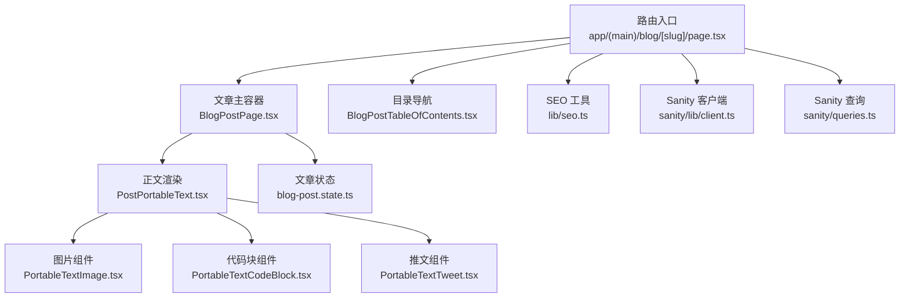
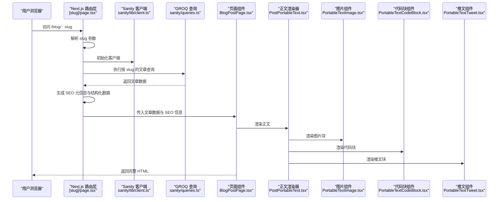
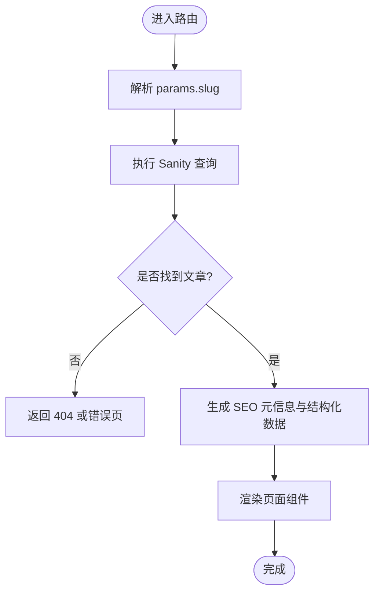
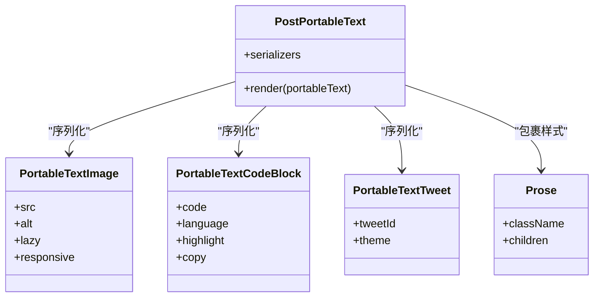
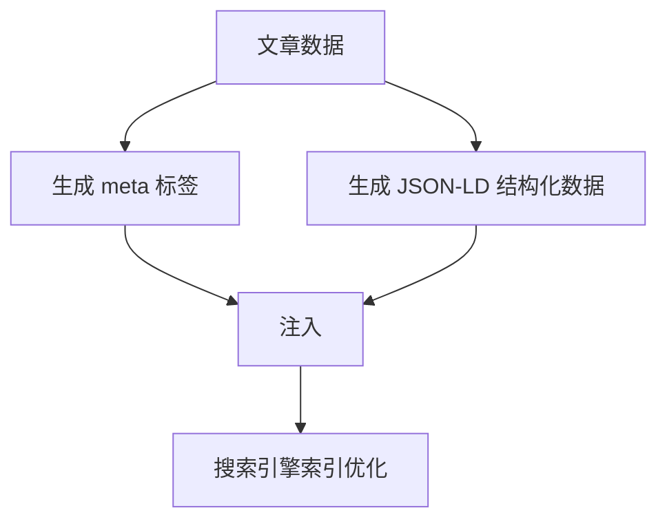
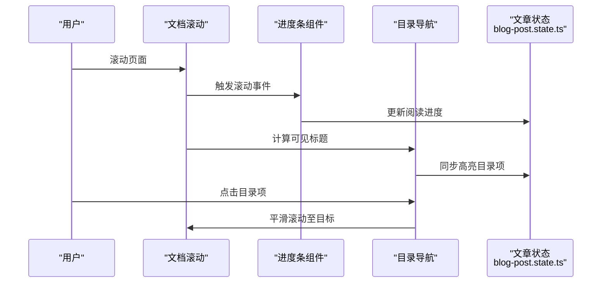
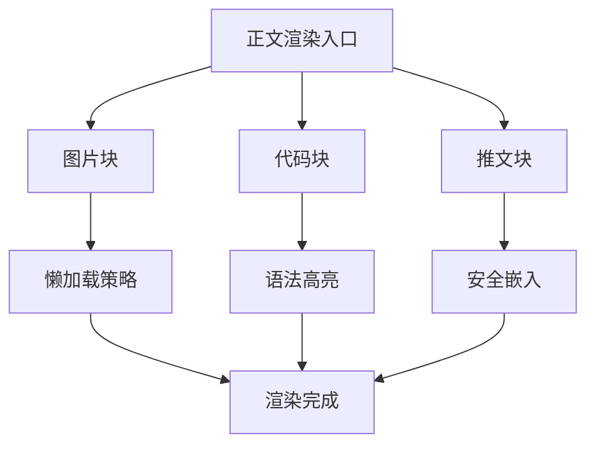
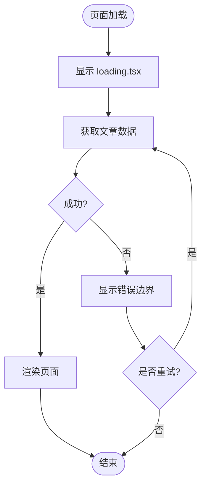
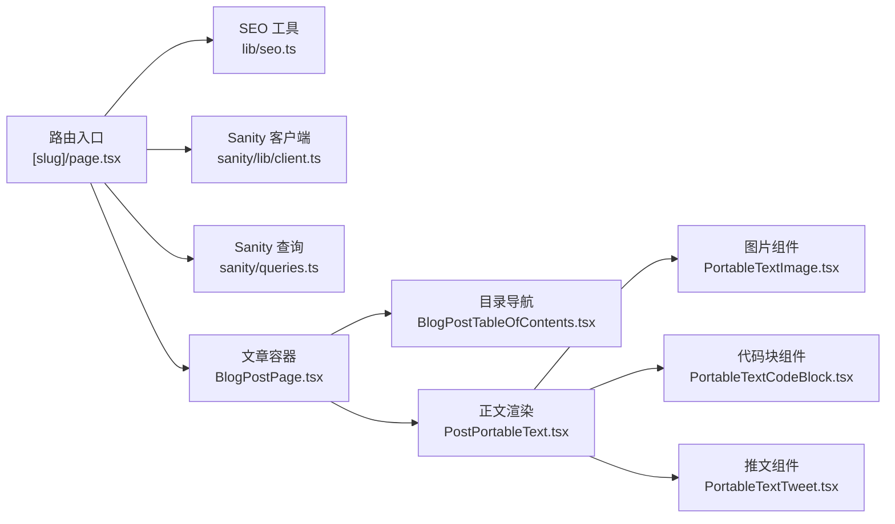

# 文章详情页面

<cite>
**本文引用的文件**   
- [app/(main)/blog/[slug]/page.tsx](file://app/(main)/blog/[slug]/page.tsx)
- [app/(main)/blog/[slug]/loading.tsx](file://app/(main)/blog/[slug]/loading.tsx)
- [app/(main)/blog/BlogPostPage.tsx](file://app/(main)/blog/BlogPostPage.tsx)
- [app/(main)/blog/BlogPostTableOfContents.tsx](file://app/(main)/blog/BlogPostTableOfContents.tsx)
- [app/(main)/blog/blog-post.state.ts](file://app/(main)/blog/blog-post.state.ts)
- [components/PostPortableText.tsx](file://components/PostPortableText.tsx)
- [components/portable-text/PortableTextImage.tsx](file://components/portable-text/PortableTextImage.tsx)
- [components/portable-text/PortableTextCodeBlock.tsx](file://components/portable-text/PortableTextCodeBlock.tsx)
- [components/portable-text/PortableTextTweet.tsx](file://components/portable-text/PortableTextTweet.tsx)
- [components/Prose.tsx](file://components/Prose.tsx)
- [lib/seo.ts](file://lib/seo.ts)
- [sanity/queries.ts](file://sanity/queries.ts)
- [sanity/lib/client.ts](file://sanity/lib/client.ts)
- [sanity/schemas/post.ts](file://sanity/schemas/post.ts)
- [next-sitemap.config.js](file://next-sitemap.config.js)
</cite>

## 目录
1. [简介](#简介)
2. [项目结构](#项目结构)
3. [核心组件](#核心组件)
4. [架构总览](#架构总览)
5. [详细组件分析](#详细组件分析)
6. [依赖关系分析](#依赖关系分析)
7. [性能考量](#性能考量)
8. [故障排查指南](#故障排查指南)
9. [结论](#结论)
10. [附录](#附录)

## 简介
本文面向博客文章详情页面的实现与优化，覆盖以下关键主题：
- 动态路由处理机制：基于 Next.js App Router 的 [slug] 参数解析与文章数据获取流程。
- Markdown/Portable Text 渲染流程：自定义组件集成、代码高亮、图片懒加载与嵌入内容（如推文）。
- SEO 优化策略：动态 meta 标签生成、结构化数据注入与站点地图配置。
- 阅读体验增强：阅读进度条、目录导航与社交分享功能。
- 错误边界与加载状态管理：服务端/客户端协同的错误处理与用户体验保障。

## 项目结构
文章详情页面位于 app/(main)/blog/[slug] 目录下，采用 Next.js App Router 的动态路由约定。核心文件包括：
- page.tsx：路由入口，负责解析 slug、拉取数据、设置元信息并渲染页面。
- loading.tsx：该路由的加载态 UI。
- BlogPostPage.tsx：文章主体布局与交互组合器。
- BlogPostTableOfContents.tsx：目录导航组件。
- blog-post.state.ts：文章页局部状态（如阅读进度、收藏等）管理。
- components/PostPortableText.tsx：将 Portable Text 转换为 React 节点，注册自定义块与内联组件。
- components/portable-text/*：具体块级组件（图片、代码块、推文等）。
- lib/seo.ts：SEO 工具函数（meta、结构化数据等）。
- sanity/*：Sanity 查询与客户端初始化、Schema 定义。

图表来源
- [app/(main)/blog/[slug]/page.tsx](file://app/(main)/blog/[slug]/page.tsx)
- [app/(main)/blog/BlogPostPage.tsx](file://app/(main)/blog/BlogPostPage.tsx)
- [app/(main)/blog/BlogPostTableOfContents.tsx](file://app/(main)/blog/BlogPostTableOfContents.tsx)
- [components/PostPortableText.tsx](file://components/PostPortableText.tsx)
- [components/portable-text/PortableTextImage.tsx](file://components/portable-text/PortableTextImage.tsx)
- [components/portable-text/PortableTextCodeBlock.tsx](file://components/portable-text/PortableTextCodeBlock.tsx)
- [components/portable-text/PortableTextTweet.tsx](file://components/portable-text/PortableTextTweet.tsx)
- [lib/seo.ts](file://lib/seo.ts)
- [sanity/lib/client.ts](file://sanity/lib/client.ts)
- [sanity/queries.ts](file://sanity/queries.ts)

章节来源
- [app/(main)/blog/[slug]/page.tsx](file://app/(main)/blog/[slug]/page.tsx)
- [app/(main)/blog/BlogPostPage.tsx](file://app/(main)/blog/BlogPostPage.tsx)
- [app/(main)/blog/BlogPostTableOfContents.tsx](file://app/(main)/blog/BlogPostTableOfContents.tsx)
- [components/PostPortableText.tsx](file://components/PostPortableText.tsx)
- [components/portable-text/PortableTextImage.tsx](file://components/portable-text/PortableTextImage.tsx)
- [components/portable-text/PortableTextCodeBlock.tsx](file://components/portable-text/PortableTextCodeBlock.tsx)
- [components/portable-text/PortableTextTweet.tsx](file://components/portable-text/PortableTextTweet.tsx)
- [lib/seo.ts](file://lib/seo.ts)
- [sanity/lib/client.ts](file://sanity/lib/client.ts)
- [sanity/queries.ts](file://sanity/queries.ts)

## 核心组件
- 路由入口 page.tsx
  - 职责：解析 [slug] 参数；调用 Sanity 查询获取文章；构建 SEO 元信息与结构化数据；组装子组件并返回页面。
  - 关键点：使用 Next.js 的 generateMetadata 或页面级元信息 API；根据文章字段动态设置 title、description、open graph 等；必要时输出 JSON-LD。
- 文章主容器 BlogPostPage.tsx
  - 职责：承载文章标题、作者、发布时间、正文、目录、社交分享、评论等区域；协调阅读进度与目录联动。
- 目录导航 BlogPostTableOfContents.tsx
  - 职责：从正文中抽取标题节点，生成可点击目录；支持滚动监听与高亮当前段落。
- 正文渲染 PostPortableText.tsx
  - 职责：将 Sanit y 的 Portable Text 转为 React 节点；注册自定义块（图片、代码块、推文等）与样式类名。
- 图片组件 PortableTextImage.tsx
  - 职责：封装图片展示，支持懒加载、占位图、响应式尺寸与焦点裁剪。
- 代码块组件 PortableTextCodeBlock.tsx
  - 职责：渲染代码块，启用语法高亮与复制按钮。
- 推文组件 PortableTextTweet.tsx
  - 职责：安全地嵌入 Twitter/X 推文卡片。
- SEO 工具 lib/seo.ts
  - 职责：提供统一的 meta 与结构化数据生成方法，便于在页面集中复用。
- Sanity 客户端与查询
  - sanity/lib/client.ts：初始化 Sanity 客户端。
  - sanity/queries.ts：按 slug 获取文章及其关联数据的 GROQ 查询。
  - sanity/schemas/post.ts：文章 Schema 定义（用于类型推断与校验）。

章节来源
- [app/(main)/blog/[slug]/page.tsx](file://app/(main)/blog/[slug]/page.tsx)
- [app/(main)/blog/BlogPostPage.tsx](file://app/(main)/blog/BlogPostPage.tsx)
- [app/(main)/blog/BlogPostTableOfContents.tsx](file://app/(main)/blog/BlogPostTableOfContents.tsx)
- [components/PostPortableText.tsx](file://components/PostPortableText.tsx)
- [components/portable-text/PortableTextImage.tsx](file://components/portable-text/PortableTextImage.tsx)
- [components/portable-text/PortableTextCodeBlock.tsx](file://components/portable-text/PortableTextCodeBlock.tsx)
- [components/portable-text/PortableTextTweet.tsx](file://components/portable-text/PortableTextTweet.tsx)
- [lib/seo.ts](file://lib/seo.ts)
- [sanity/lib/client.ts](file://sanity/lib/client.ts)
- [sanity/queries.ts](file://sanity/queries.ts)
- [sanity/schemas/post.ts](file://sanity/schemas/post.ts)

## 架构总览
下图展示了从请求到渲染的关键路径，包括动态路由解析、数据获取、SEO 注入与正文渲染。

图表来源
- [app/(main)/blog/[slug]/page.tsx](file://app/(main)/blog/[slug]/page.tsx)
- [sanity/lib/client.ts](file://sanity/lib/client.ts)
- [sanity/queries.ts](file://sanity/queries.ts)
- [app/(main)/blog/BlogPostPage.tsx](file://app/(main)/blog/BlogPostPage.tsx)
- [components/PostPortableText.tsx](file://components/PostPortableText.tsx)
- [components/portable-text/PortableTextImage.tsx](file://components/portable-text/PortableTextImage.tsx)
- [components/portable-text/PortableTextCodeBlock.tsx](file://components/portable-text/PortableTextCodeBlock.tsx)
- [components/portable-text/PortableTextTweet.tsx](file://components/portable-text/PortableTextTweet.tsx)

## 详细组件分析

### 动态路由与数据获取
- 路由解析
  - 使用 Next.js App Router 的动态段 [slug]，在页面组件中通过 params.slug 获取文章标识。
- 数据获取
  - 通过 Sanity 客户端执行 GROQ 查询，按 slug 精确匹配文章文档。
  - 建议开启缓存策略（如 revalidate），以提升首屏性能与稳定性。
- 错误处理
  - 当文章不存在时，应返回 404 或重定向至 not-found 页面。
  - 网络异常或查询失败时，需降级为友好的错误提示。

图表来源
- [app/(main)/blog/[slug]/page.tsx](file://app/(main)/blog/[slug]/page.tsx)
- [sanity/queries.ts](file://sanity/queries.ts)

章节来源
- [app/(main)/blog/[slug]/page.tsx](file://app/(main)/blog/[slug]/page.tsx)
- [sanity/queries.ts](file://sanity/queries.ts)

### Markdown/Portable Text 渲染流程
- 正文转换
  - PostPortableText.tsx 将 Portable Text 数组映射为 React 节点，并通过 serializers 注册自定义块与内联元素。
- 自定义组件集成
  - 图片：PortableTextImage.tsx 支持懒加载、占位图与响应式尺寸。
  - 代码块：PortableTextCodeBlock.tsx 启用语法高亮与复制功能。
  - 嵌入内容：PortableTextTweet.tsx 安全嵌入推文卡片。
- 样式处理
  - 通过 Prose.tsx 统一排版样式，确保可读性与一致性。
  - 针对代码块、图片、引用等块级元素应用 Tailwind 或 CSS 模块样式。

图表来源
- [components/PostPortableText.tsx](file://components/PostPortableText.tsx)
- [components/portable-text/PortableTextImage.tsx](file://components/portable-text/PortableTextImage.tsx)
- [components/portable-text/PortableTextCodeBlock.tsx](file://components/portable-text/PortableTextCodeBlock.tsx)
- [components/portable-text/PortableTextTweet.tsx](file://components/portable-text/PortableTextTweet.tsx)
- [components/Prose.tsx](file://components/Prose.tsx)

章节来源
- [components/PostPortableText.tsx](file://components/PostPortableText.tsx)
- [components/portable-text/PortableTextImage.tsx](file://components/portable-text/PortableTextImage.tsx)
- [components/portable-text/PortableTextCodeBlock.tsx](file://components/portable-text/PortableTextCodeBlock.tsx)
- [components/portable-text/PortableTextTweet.tsx](file://components/portable-text/PortableTextTweet.tsx)
- [components/Prose.tsx](file://components/Prose.tsx)

### SEO 优化策略
- 动态 meta 标签
  - 根据文章标题、摘要、封面图等字段生成 <title>、<meta name="description">、Open Graph 与 Twitter Card 信息。
- 结构化数据
  - 输出 JSON-LD 的 Article 或 BlogPosting 类型，包含作者、发布日期、修改日期、图像等。
- 站点地图
  - next-sitemap.config.js 配置文章 URL 集合，提升搜索引擎收录效率。

图表来源
- [lib/seo.ts](file://lib/seo.ts)
- [next-sitemap.config.js](file://next-sitemap.config.js)

章节来源
- [lib/seo.ts](file://lib/seo.ts)
- [next-sitemap.config.js](file://next-sitemap.config.js)

### 阅读进度条、目录导航与社交分享
- 阅读进度条
  - 通过滚动事件计算已读比例，更新顶部进度条宽度；可在 blog-post.state.ts 中维护全局状态。
- 目录导航
  - BlogPostTableOfContents.tsx 扫描正文中的标题节点，生成锚点列表；滚动时高亮当前项，点击平滑滚动至目标。
- 社交分享
  - 在页面侧边或底部提供分享按钮，链接至各平台分享接口；可结合 Open Graph 信息提升预览效果。

图表来源
- [app/(main)/blog/BlogPostTableOfContents.tsx](file://app/(main)/blog/BlogPostTableOfContents.tsx)
- [app/(main)/blog/blog-post.state.ts](file://app/(main)/blog/blog-post.state.ts)

章节来源
- [app/(main)/blog/BlogPostTableOfContents.tsx](file://app/(main)/blog/BlogPostTableOfContents.tsx)
- [app/(main)/blog/blog-post.state.ts](file://app/(main)/blog/blog-post.state.ts)

### 图片懒加载、代码高亮与嵌入内容示例
- 图片懒加载
  - 在 PortableTextImage.tsx 中使用原生 loading="lazy" 或 IntersectionObserver 实现按需加载；配合占位图与模糊效果提升感知性能。
- 代码高亮
  - 在 PortableTextCodeBlock.tsx 中引入语法高亮库（如 Prism 或 Shiki），根据 language 选择主题与语言包；提供一键复制功能。
- 嵌入内容
  - 在 PortableTextTweet.tsx 中安全渲染第三方嵌入脚本，注意 CSP 与异步加载策略，避免阻塞主线程。

图表来源
- [components/portable-text/PortableTextImage.tsx](file://components/portable-text/PortableTextImage.tsx)
- [components/portable-text/PortableTextCodeBlock.tsx](file://components/portable-text/PortableTextCodeBlock.tsx)
- [components/portable-text/PortableTextTweet.tsx](file://components/portable-text/PortableTextTweet.tsx)

章节来源
- [components/portable-text/PortableTextImage.tsx](file://components/portable-text/PortableTextImage.tsx)
- [components/portable-text/PortableTextCodeBlock.tsx](file://components/portable-text/PortableTextCodeBlock.tsx)
- [components/portable-text/PortableTextTweet.tsx](file://components/portable-text/PortableTextTweet.tsx)

### 错误边界与加载状态管理
- 加载状态
  - 使用路由级 loading.tsx 显示骨架屏或加载动画，提升等待体验。
- 错误边界
  - 对数据获取与渲染进行 try/catch 包裹，捕获异常后回退到友好错误界面；记录错误日志以便排查。
- 重试与降级
  - 对网络请求增加重试逻辑；在 CDN 或图片服务不可用时降级为静态占位图。

图表来源
- [app/(main)/blog/[slug]/loading.tsx](file://app/(main)/blog/[slug]/loading.tsx)
- [app/(main)/blog/[slug]/page.tsx](file://app/(main)/blog/[slug]/page.tsx)

章节来源
- [app/(main)/blog/[slug]/loading.tsx](file://app/(main)/blog/[slug]/loading.tsx)
- [app/(main)/blog/[slug]/page.tsx](file://app/(main)/blog/[slug]/page.tsx)

## 依赖关系分析
- 组件耦合
  - 路由入口依赖 SEO 工具与 Sanity 客户端；页面容器依赖目录导航与正文渲染器；正文渲染器依赖具体块组件。
- 外部依赖
  - Sanity 客户端与 GROQ 查询；可能的第三方嵌入（Twitter/X）与高亮库。
- 潜在循环依赖
  - 确保组件间单向依赖，避免相互导入导致打包问题。

图表来源
- [app/(main)/blog/[slug]/page.tsx](file://app/(main)/blog/[slug]/page.tsx)
- [lib/seo.ts](file://lib/seo.ts)
- [sanity/lib/client.ts](file://sanity/lib/client.ts)
- [sanity/queries.ts](file://sanity/queries.ts)
- [app/(main)/blog/BlogPostPage.tsx](file://app/(main)/blog/BlogPostPage.tsx)
- [app/(main)/blog/BlogPostTableOfContents.tsx](file://app/(main)/blog/BlogPostTableOfContents.tsx)
- [components/PostPortableText.tsx](file://components/PostPortableText.tsx)
- [components/portable-text/PortableTextImage.tsx](file://components/portable-text/PortableTextImage.tsx)
- [components/portable-text/PortableTextCodeBlock.tsx](file://components/portable-text/PortableTextCodeBlock.tsx)
- [components/portable-text/PortableTextTweet.tsx](file://components/portable-text/PortableTextTweet.tsx)

章节来源
- [app/(main)/blog/[slug]/page.tsx](file://app/(main)/blog/[slug]/page.tsx)
- [lib/seo.ts](file://lib/seo.ts)
- [sanity/lib/client.ts](file://sanity/lib/client.ts)
- [sanity/queries.ts](file://sanity/queries.ts)
- [app/(main)/blog/BlogPostPage.tsx](file://app/(main)/blog/BlogPostPage.tsx)
- [app/(main)/blog/BlogPostTableOfContents.tsx](file://app/(main)/blog/BlogPostTableOfContents.tsx)
- [components/PostPortableText.tsx](file://components/PostPortableText.tsx)
- [components/portable-text/PortableTextImage.tsx](file://components/portable-text/PortableTextImage.tsx)
- [components/portable-text/PortableTextCodeBlock.tsx](file://components/portable-text/PortableTextCodeBlock.tsx)
- [components/portable-text/PortableTextTweet.tsx](file://components/portable-text/PortableTextTweet.tsx)

## 性能考量
- 首屏优化
  - 服务端渲染文章数据，减少客户端水合开销；合理使用 revalidate 控制缓存刷新频率。
- 资源加载
  - 图片懒加载与渐进式加载；代码高亮按需加载语言包；第三方嵌入异步加载。
- 渲染优化
  - 目录导航使用节流/防抖优化滚动监听；避免频繁重排重绘。
- 可访问性
  - 为图片提供 alt 文本；为代码块提供语言说明；为目录项提供键盘导航。

## 故障排查指南
- 常见问题
  - 404 错误：检查 slug 是否与文章一致；确认查询条件与索引。
  - 图片不显示：核对图片 URL 与权限；检查懒加载与占位图配置。
  - 代码高亮缺失：确认语言包是否正确引入；检查 theme 配置。
  - 推文无法加载：检查网络与 CSP 策略；确认嵌入脚本来源。
- 调试建议
  - 在数据获取阶段打印关键变量；在渲染阶段定位具体块组件；使用浏览器开发者工具观察网络与性能面板。

章节来源
- [app/(main)/blog/[slug]/page.tsx](file://app/(main)/blog/[slug]/page.tsx)
- [components/portable-text/PortableTextImage.tsx](file://components/portable-text/PortableTextImage.tsx)
- [components/portable-text/PortableTextCodeBlock.tsx](file://components/portable-text/PortableTextCodeBlock.tsx)
- [components/portable-text/PortableTextTweet.tsx](file://components/portable-text/PortableTextTweet.tsx)

## 结论
本文系统梳理了博客文章详情页面的实现要点，涵盖动态路由、数据获取、正文渲染、SEO 优化、阅读体验增强以及错误与加载状态管理。通过模块化设计与合理的性能策略，可在保证可维护性的同时提供良好的用户体验与搜索可见性。

## 附录
- 相关 Schema 参考
  - sanity/schemas/post.ts：文章字段定义，有助于理解数据模型与查询结果。

章节来源
- [sanity/schemas/post.ts](file://sanity/schemas/post.ts)