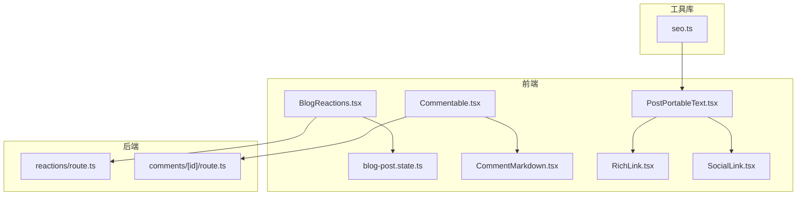
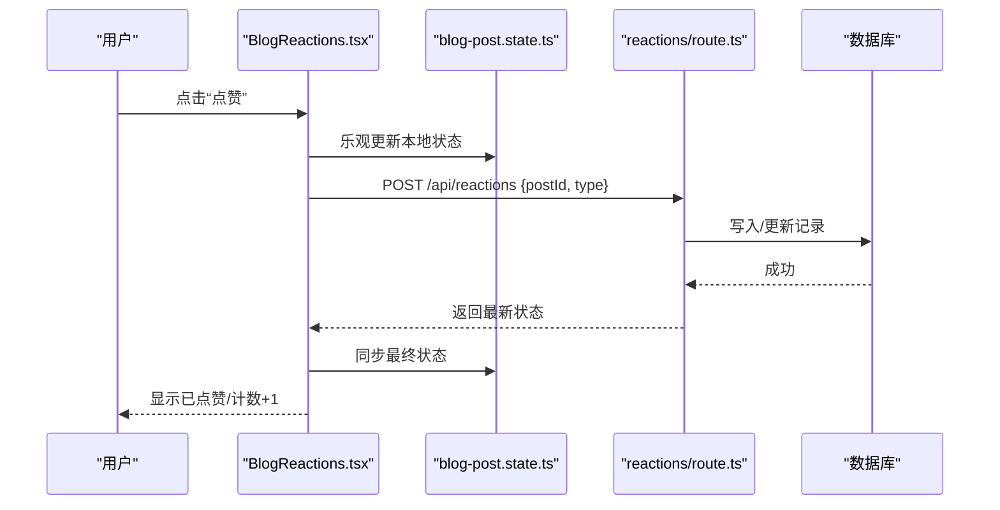
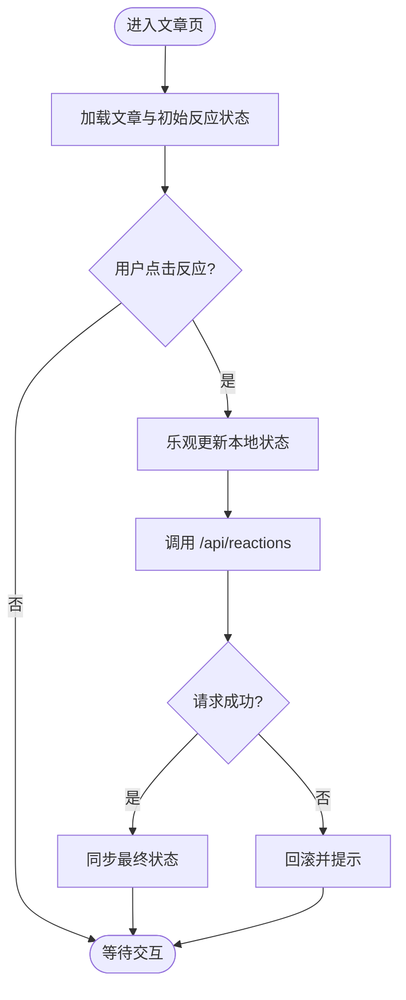
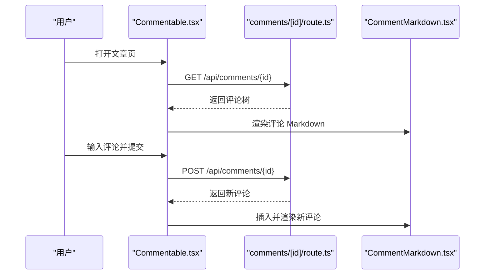
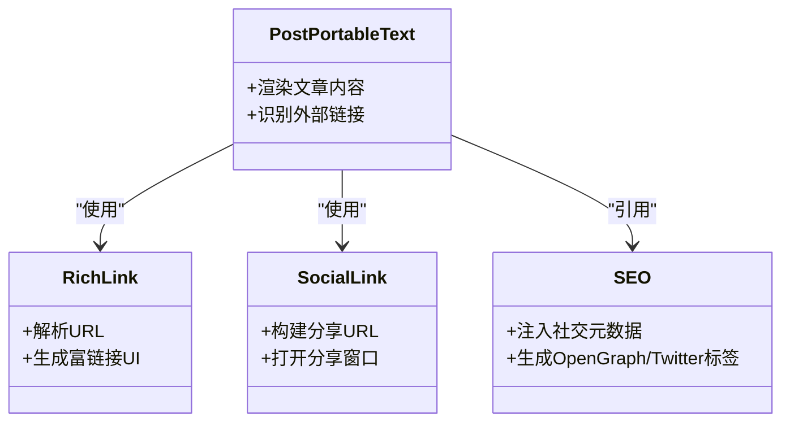
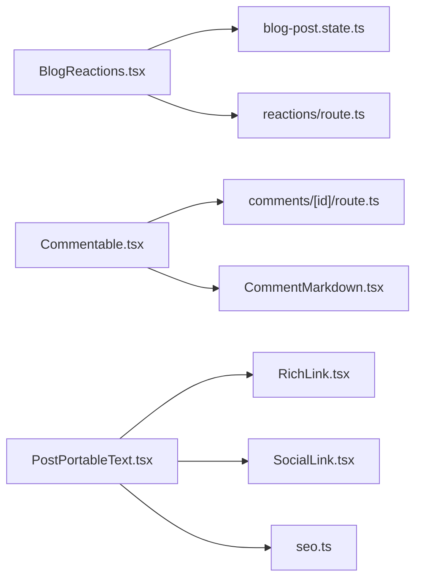

# 社交功能集成

<cite>
**本文引用的文件**   
- [BlogReactions.tsx](file://app/(main)/blog/BlogReactions.tsx)
- [blog-post.state.ts](file://app/(main)/blog/blog-post.state.ts)
- [reactions/route.ts](file://app/api/reactions/route.ts)
- [Commentable.tsx](file://components/Commentable.tsx)
- [CommentMarkdown.tsx](file://components/CommentMarkdown.tsx)
- [comments/[id]/route.ts](file://app/api/comments/[id]/route.ts)
- [seo.ts](file://lib/seo.ts)
- [PostPortableText.tsx](file://components/PostPortableText.tsx)
- [RichLink.tsx](file://components/links/RichLink.tsx)
- [SocialLink.tsx](file://components/links/SocialLink.tsx)
</cite>

## 目录
1. [简介](#简介)
2. [项目结构](#项目结构)
3. [核心组件](#核心组件)
4. [架构总览](#架构总览)
5. [详细组件分析](#详细组件分析)
6. [依赖分析](#依赖分析)
7. [性能考虑](#性能考虑)
8. [故障排查指南](#故障排查指南)
9. [结论](#结论)
10. [附录](#附录)

## 简介
本文件面向博客系统的“社交功能集成”，聚焦以下能力：
- 社交反应（点赞、收藏等）的交互与持久化，包括实时状态更新与用户反馈。
- 评论系统：评论输入、Markdown 渲染、嵌套回复。
- 第三方社交平台分享按钮集成、社交媒体元数据配置与分享统计追踪。
- API 调用示例与错误处理策略。

## 项目结构
与社交功能相关的代码主要分布在以下位置：
- 前端交互与状态管理：博客页面内的反应组件与状态模块
- 后端 API：反应与评论的接口实现
- 通用组件：可复用的评论容器与 Markdown 渲染
- SEO 与链接增强：社交元数据与富链接展示

图表来源
- [BlogReactions.tsx](file://app/(main)/blog/BlogReactions.tsx)
- [blog-post.state.ts](file://app/(main)/blog/blog-post.state.ts)
- [reactions/route.ts](file://app/api/reactions/route.ts)
- [Commentable.tsx](file://components/Commentable.tsx)
- [CommentMarkdown.tsx](file://components/CommentMarkdown.tsx)
- [PostPortableText.tsx](file://components/PostPortableText.tsx)
- [RichLink.tsx](file://components/links/RichLink.tsx)
- [SocialLink.tsx](file://components/links/SocialLink.tsx)
- [seo.ts](file://lib/seo.ts)

章节来源
- [BlogReactions.tsx](file://app/(main)/blog/BlogReactions.tsx)
- [blog-post.state.ts](file://app/(main)/blog/blog-post.state.ts)
- [reactions/route.ts](file://app/api/reactions/route.ts)
- [Commentable.tsx](file://components/Commentable.tsx)
- [CommentMarkdown.tsx](file://components/CommentMarkdown.tsx)
- [PostPortableText.tsx](file://components/PostPortableText.tsx)
- [RichLink.tsx](file://components/links/RichLink.tsx)
- [SocialLink.tsx](file://components/links/SocialLink.tsx)
- [seo.ts](file://lib/seo.ts)

## 核心组件
- 社交反应组件：提供点赞、收藏等动作的前端交互，维护本地乐观状态并同步至服务端。
- 博客文章状态模块：集中管理文章相关状态（如已点赞、已收藏），驱动 UI 实时更新。
- 评论容器组件：封装评论列表、输入框、嵌套回复与提交逻辑。
- Markdown 渲染组件：将评论文本渲染为安全的 HTML，支持基础语法与扩展。
- 后端 API：
  - 反应接口：接收并持久化用户的点赞/收藏等操作。
  - 评论接口：按文章 ID 获取/提交评论，支持嵌套结构。
- SEO 与链接增强：
  - 社交元数据注入：设置 og/twitter 等标签，提升分享预览质量。
  - 富链接与社交外链：在文章内容中自动识别并美化外部链接与社交卡片。

章节来源
- [BlogReactions.tsx](file://app/(main)/blog/BlogReactions.tsx)
- [blog-post.state.ts](file://app/(main)/blog/blog-post.state.ts)
- [Commentable.tsx](file://components/Commentable.tsx)
- [CommentMarkdown.tsx](file://components/CommentMarkdown.tsx)
- [reactions/route.ts](file://app/api/reactions/route.ts)
- [comments/[id]/route.ts](file://app/api/comments/[id]/route.ts)
- [seo.ts](file://lib/seo.ts)
- [PostPortableText.tsx](file://components/PostPortableText.tsx)
- [RichLink.tsx](file://components/links/RichLink.tsx)
- [SocialLink.tsx](file://components/links/SocialLink.tsx)

## 架构总览
整体采用前后端分离的模块化设计：前端通过 React 组件与状态模块驱动交互，调用 Next.js Route Handlers 提供的 RESTful API；后端负责校验、持久化与返回结果；SEO 与链接增强在内容渲染阶段完成。

图表来源
- [BlogReactions.tsx](file://app/(main)/blog/BlogReactions.tsx)
- [blog-post.state.ts](file://app/(main)/blog/blog-post.state.ts)
- [reactions/route.ts](file://app/api/reactions/route.ts)

## 详细组件分析

### 社交反应（点赞、收藏等）
- 交互流程
  - 用户在文章页触发反应（如点赞）。
  - 前端立即进行乐观更新，确保即时反馈。
  - 发起网络请求到后端 API 持久化。
  - 成功后保持状态一致；失败时回滚并提示。
- 状态管理
  - 使用集中状态模块维护每篇文章的反应状态与计数。
  - 组件订阅状态变化，实现无闪烁更新。
- 数据模型与复杂度
  - 典型字段：文章标识、用户标识、反应类型、时间戳。
  - 查询复杂度：O(1) 读取单条记录；批量聚合 O(n)。
- 错误处理
  - 网络异常：重试或降级为仅本地状态。
  - 业务异常：根据错误码提示用户或静默忽略。
- 优化建议
  - 防抖/节流避免重复提交。
  - 合并多次操作后统一提交。
  - 缓存最近一次操作结果，减少往返。

图表来源
- [BlogReactions.tsx](file://app/(main)/blog/BlogReactions.tsx)
- [blog-post.state.ts](file://app/(main)/blog/blog-post.state.ts)
- [reactions/route.ts](file://app/api/reactions/route.ts)

章节来源
- [BlogReactions.tsx](file://app/(main)/blog/BlogReactions.tsx)
- [blog-post.state.ts](file://app/(main)/blog/blog-post.state.ts)
- [reactions/route.ts](file://app/api/reactions/route.ts)

### 评论系统（输入、Markdown 渲染、嵌套回复）
- 评论输入
  - 提供富文本/Markdown 输入框，支持预览与快捷键。
  - 提交前进行基础校验（长度、敏感词过滤等）。
- Markdown 渲染
  - 使用专用组件将评论文本安全地渲染为 HTML。
  - 支持代码块、链接、图片等常用语法。
- 嵌套回复
  - 支持对评论进行多级回复，数据结构包含父子关系。
  - 列表渲染时按层级缩进与折叠展开。
- API 集成
  - 获取评论：按文章 ID 拉取评论树。
  - 提交评论：创建根评论或子回复。
- 错误处理
  - 网络错误：重试机制与离线提示。
  - 权限错误：未登录时引导登录。
  - 内容违规：返回具体字段级错误信息。

图表来源
- [Commentable.tsx](file://components/Commentable.tsx)
- [comments/[id]/route.ts](file://app/api/comments/[id]/route.ts)
- [CommentMarkdown.tsx](file://components/CommentMarkdown.tsx)

章节来源
- [Commentable.tsx](file://components/Commentable.tsx)
- [CommentMarkdown.tsx](file://components/CommentMarkdown.tsx)
- [comments/[id]/route.ts](file://app/api/comments/[id]/route.ts)

### 第三方社交平台分享与统计
- 分享按钮集成
  - 在文章页提供常见平台分享入口（如 Twitter/X、Telegram、GitHub 等）。
  - 点击后打开对应平台的分享窗口，携带标题、摘要与链接。
- 社交媒体元数据配置
  - 动态注入 og:title、og:description、og:image、twitter:card 等标签。
  - 基于文章内容与站点配置生成高质量预览卡片。
- 分享统计追踪
  - 在分享按钮点击处埋点，上报事件（平台、目标 URL、时间）。
  - 可选接入第三方分析服务或自定义日志收集。

图表来源
- [PostPortableText.tsx](file://components/PostPortableText.tsx)
- [RichLink.tsx](file://components/links/RichLink.tsx)
- [SocialLink.tsx](file://components/links/SocialLink.tsx)
- [seo.ts](file://lib/seo.ts)

章节来源
- [PostPortableText.tsx](file://components/PostPortableText.tsx)
- [RichLink.tsx](file://components/links/RichLink.tsx)
- [SocialLink.tsx](file://components/links/SocialLink.tsx)
- [seo.ts](file://lib/seo.ts)

## 依赖分析
- 组件耦合
  - BlogReactions 依赖 blog-post.state 与 reactions API。
  - Commentable 依赖 comments API 与 CommentMarkdown。
  - PostPortableText 组合 RichLink、SocialLink 与 SEO 工具。
- 外部依赖
  - Next.js Route Handlers 作为后端边界。
  - 可能的第三方 SDK（如分享平台 JS SDK、分析服务 SDK）。
- 潜在循环依赖
  - 当前结构以单向依赖为主，未见明显循环。
- 接口契约
  - 反应 API：入参包含文章标识与反应类型；出参为最新状态。
  - 评论 API：按文章 ID 获取/提交评论树；返回结构化评论对象。

图表来源
- [BlogReactions.tsx](file://app/(main)/blog/BlogReactions.tsx)
- [blog-post.state.ts](file://app/(main)/blog/blog-post.state.ts)
- [reactions/route.ts](file://app/api/reactions/route.ts)
- [Commentable.tsx](file://components/Commentable.tsx)
- [CommentMarkdown.tsx](file://components/CommentMarkdown.tsx)
- [comments/[id]/route.ts](file://app/api/comments/[id]/route.ts)
- [PostPortableText.tsx](file://components/PostPortableText.tsx)
- [RichLink.tsx](file://components/links/RichLink.tsx)
- [SocialLink.tsx](file://components/links/SocialLink.tsx)
- [seo.ts](file://lib/seo.ts)

章节来源
- [BlogReactions.tsx](file://app/(main)/blog/BlogReactions.tsx)
- [blog-post.state.ts](file://app/(main)/blog/blog-post.state.ts)
- [reactions/route.ts](file://app/api/reactions/route.ts)
- [Commentable.tsx](file://components/Commentable.tsx)
- [CommentMarkdown.tsx](file://components/CommentMarkdown.tsx)
- [comments/[id]/route.ts](file://app/api/comments/[id]/route.ts)
- [PostPortableText.tsx](file://components/PostPortableText.tsx)
- [RichLink.tsx](file://components/links/RichLink.tsx)
- [SocialLink.tsx](file://components/links/SocialLink.tsx)
- [seo.ts](file://lib/seo.ts)

## 性能考虑
- 前端
  - 使用乐观更新减少感知延迟。
  - 对频繁操作进行防抖/节流。
  - 按需加载评论与反应数据，避免首屏阻塞。
- 后端
  - 对热点文章的反应与评论进行缓存（如 Redis）。
  - 分页加载评论树，限制最大深度。
  - 批量聚合统计，降低数据库压力。
- 渲染
  - 对 Markdown 输出进行懒渲染与虚拟滚动。
  - 外链与社交卡片预取关键资源。

## 故障排查指南
- 反应功能
  - 现象：点击无响应或计数不更新。
  - 排查：检查浏览器控制台错误、网络请求是否成功、后端日志与数据库记录。
  - 处理：若网络失败，回滚本地状态并提示重试。
- 评论功能
  - 现象：评论无法提交或渲染异常。
  - 排查：验证输入格式、权限校验、Markdown 白名单与安全过滤。
  - 处理：返回字段级错误信息，定位具体字段问题。
- 分享与统计
  - 现象：分享卡片不正确或未上报。
  - 排查：检查页面元数据是否正确注入、分享链接参数是否完整、埋点事件是否触发。
  - 处理：修正元数据模板、确认分享 URL 构造逻辑、核对统计服务配置。

章节来源
- [BlogReactions.tsx](file://app/(main)/blog/BlogReactions.tsx)
- [reactions/route.ts](file://app/api/reactions/route.ts)
- [Commentable.tsx](file://components/Commentable.tsx)
- [CommentMarkdown.tsx](file://components/CommentMarkdown.tsx)
- [comments/[id]/route.ts](file://app/api/comments/[id]/route.ts)
- [seo.ts](file://lib/seo.ts)
- [PostPortableText.tsx](file://components/PostPortableText.tsx)
- [RichLink.tsx](file://components/links/RichLink.tsx)
- [SocialLink.tsx](file://components/links/SocialLink.tsx)

## 结论
本方案通过清晰的前后端分层与组件化设计，实现了社交反应与评论系统的稳定集成，并在分享与 SEO 方面提供了良好的用户体验。建议在后续迭代中引入更完善的缓存策略、监控告警与 A/B 测试能力，以提升性能与可观测性。

## 附录

### API 参考（概念性说明）
- 反应接口
  - 方法：POST
  - 路径：/api/reactions
  - 请求体：包含文章标识、反应类型、用户标识（可选）
  - 响应：最新反应状态与计数
  - 错误：网络错误、权限错误、业务冲突（如重复操作）
- 评论接口
  - 方法：GET/POST
  - 路径：/api/comments/{id}
  - 请求体（POST）：评论内容、父评论 ID（可选）、用户标识（可选）
  - 响应：评论树或新增评论对象
  - 错误：输入校验失败、权限不足、内容违规

章节来源
- [reactions/route.ts](file://app/api/reactions/route.ts)
- [comments/[id]/route.ts](file://app/api/comments/[id]/route.ts)