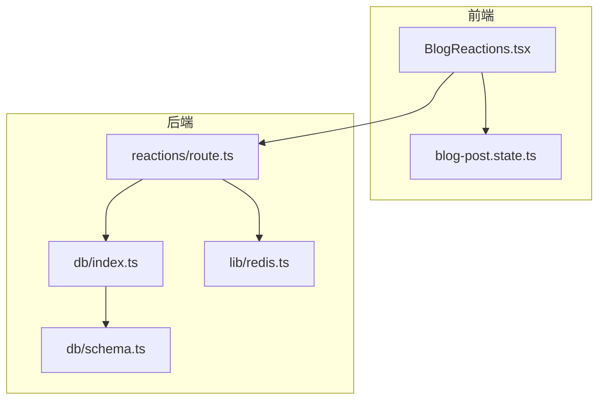
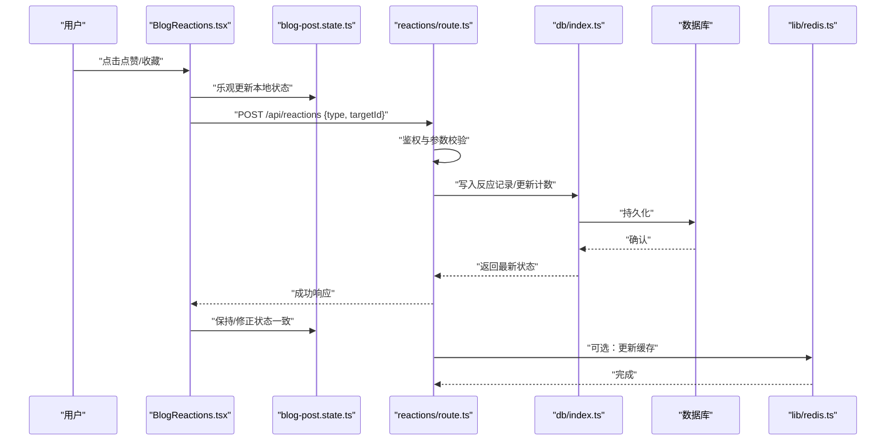
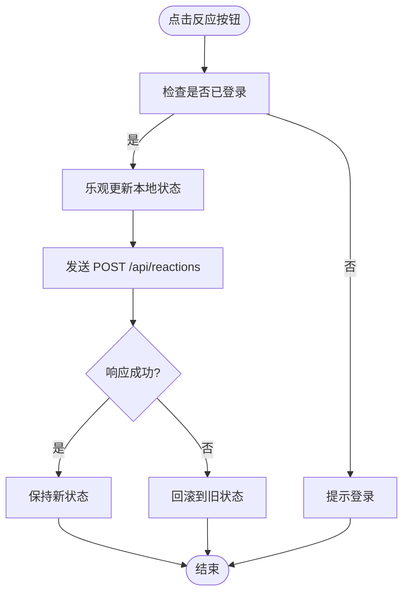
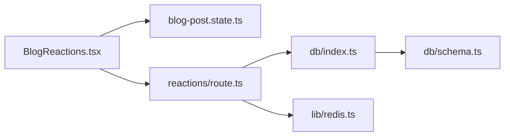

# 社交反应系统

<cite>
**本文引用的文件**
- [BlogReactions.tsx](file://app/(main)/blog/BlogReactions.tsx)
- [blog-post.state.ts](file://app/(main)/blog/blog-post.state.ts)
- [route.ts](file://app/api/reactions/route.ts)
- [schema.ts](file://db/schema.ts)
- [index.ts](file://db/index.ts)
- [redis.ts](file://lib/redis.ts)
- [clerkLocalizations.ts](file://lib/clerkLocalizations.ts)
</cite>

## 目录
1. [简介](#简介)
2. [项目结构](#项目结构)
3. [核心组件](#核心组件)
4. [架构总览](#架构总览)
5. [详细组件分析](#详细组件分析)
6. [依赖关系分析](#依赖关系分析)
7. [性能考虑](#性能考虑)
8. [故障排查指南](#故障排查指南)
9. [结论](#结论)
10. [附录](#附录)

## 简介
本文件面向“博客文章点赞、收藏等互动功能”的社交反应系统，围绕以下目标展开：
- 用户交互状态管理：前端乐观更新与回滚、防抖节流、去重提交。
- 实时反馈效果：点击即变、计数即时变化、错误提示。
- 后端数据持久化：API 路由、数据库写入、缓存同步。
- 反应类型定义：统一枚举与校验。
- API 接口设计：请求/响应契约、权限校验、幂等性。
- 错误处理策略：网络异常、业务异常、重复操作。
- 使用示例与最佳实践：组件调用方式、状态同步机制、性能优化方案。
- 一致性保障：并发安全、事务与幂等键。

## 项目结构
与社交反应相关的代码主要分布在以下位置：
- 前端组件与状态：app/(main)/blog/BlogReactions.tsx、app/(main)/blog/blog-post.state.ts
- 后端 API：app/api/reactions/route.ts
- 数据层：db/schema.ts、db/index.ts
- 缓存：lib/redis.ts
- 认证相关：lib/clerkLocalizations.ts（用于认证流程本地化）

图表来源
- [BlogReactions.tsx](file://app/(main)/blog/BlogReactions.tsx)
- [blog-post.state.ts](file://app/(main)/blog/blog-post.state.ts)
- [route.ts](file://app/api/reactions/route.ts)
- [index.ts](file://db/index.ts)
- [schema.ts](file://db/schema.ts)
- [redis.ts](file://lib/redis.ts)

章节来源
- [BlogReactions.tsx](file://app/(main)/blog/BlogReactions.tsx)
- [blog-post.state.ts](file://app/(main)/blog/blog-post.state.ts)
- [route.ts](file://app/api/reactions/route.ts)
- [schema.ts](file://db/schema.ts)
- [index.ts](file://db/index.ts)
- [redis.ts](file://lib/redis.ts)

## 核心组件
- 反应组件 BlogReactions.tsx
  - 负责渲染点赞、收藏等按钮，展示当前状态与计数。
  - 维护本地状态，执行乐观更新并在失败时回滚。
  - 触发 API 调用并处理成功/失败回调。
- 状态模块 blog-post.state.ts
  - 提供反应状态的集中式管理（如已点赞、已收藏）。
  - 暴露订阅与更新方法，供多个组件共享。
- API 路由 reactions/route.ts
  - 接收反应动作（点赞/取消点赞、收藏/取消收藏）。
  - 校验用户身份与参数，执行幂等写入，返回最新状态。
- 数据层 db/index.ts 与 schema.ts
  - 定义反应表结构与查询/写入方法。
  - 保证计数与用户-内容关联的一致性。
- 缓存 lib/redis.ts
  - 可选地缓存热点文章的计数或用户反应快照，加速读取。

章节来源
- [BlogReactions.tsx](file://app/(main)/blog/BlogReactions.tsx)
- [blog-post.state.ts](file://app/(main)/blog/blog-post.state.ts)
- [route.ts](file://app/api/reactions/route.ts)
- [schema.ts](file://db/schema.ts)
- [index.ts](file://db/index.ts)
- [redis.ts](file://lib/redis.ts)

## 架构总览
整体采用前后端分离的 REST 风格：
- 前端通过 React 组件发起请求，进行乐观更新与错误回滚。
- 后端在 API 中完成鉴权、参数校验、幂等写入与计数更新。
- 数据落库后，可选择更新缓存以加速后续读取。

图表来源
- [BlogReactions.tsx](file://app/(main)/blog/BlogReactions.tsx)
- [blog-post.state.ts](file://app/(main)/blog/blog-post.state.ts)
- [route.ts](file://app/api/reactions/route.ts)
- [index.ts](file://db/index.ts)
- [redis.ts](file://lib/redis.ts)

## 详细组件分析

### 反应类型定义与校验
- 建议将反应类型定义为受控枚举，例如：like、bookmark。
- 前端对 type 字段进行白名单校验，避免非法值进入网络请求。
- 后端对 type 进行严格校验，拒绝未知类型。

章节来源
- [BlogReactions.tsx](file://app/(main)/blog/BlogReactions.tsx)
- [route.ts](file://app/api/reactions/route.ts)

### 前端组件：BlogReactions.tsx
职责与行为
- 渲染各反应按钮，显示当前状态与计数。
- 点击时立即进行乐观更新，提升用户体验。
- 调用 API 成功后保持状态；失败则回滚到上次有效状态。
- 支持防抖/节流，防止重复提交。
- 未登录时引导用户登录。

关键流程

图表来源
- [BlogReactions.tsx](file://app/(main)/blog/BlogReactions.tsx)
- [blog-post.state.ts](file://app/(main)/blog/blog-post.state.ts)

章节来源
- [BlogReactions.tsx](file://app/(main)/blog/BlogReactions.tsx)
- [blog-post.state.ts](file://app/(main)/blog/blog-post.state.ts)

### 状态模块：blog-post.state.ts
职责与行为
- 维护文章维度的反应状态（如 isLiked、isBookmarked、counts）。
- 提供 set/get 方法与订阅通知，确保多组件间状态一致。
- 支持批量更新与局部更新，减少不必要的重渲染。

典型用法
- 组件初始化时从服务端拉取初始状态并注入到状态模块。
- 组件内订阅状态变化，自动刷新 UI。

章节来源
- [blog-post.state.ts](file://app/(main)/blog/blog-post.state.ts)

### API 路由：reactions/route.ts
职责与行为
- 接收请求体：type（反应类型）、targetId（目标文章 ID）、可选的 userId。
- 鉴权：验证当前用户身份，未登录返回 401。
- 校验：校验 type 与 targetId 合法性。
- 幂等：基于 userId + type + targetId 作为幂等键，避免重复提交。
- 写入：插入或更新反应记录，并原子更新计数。
- 返回：返回最新的状态与计数。
- 缓存：可选更新 Redis 中的计数或快照。

请求/响应契约（示例）
- 请求
  - 方法：POST
  - 路径：/api/reactions
  - 头部：Authorization（Bearer Token）
  - 主体：{ type: "like" | "bookmark", targetId: string }
- 响应
  - 成功：{ success: true, data: { liked: boolean, bookmarked: boolean, counts: { like: number, bookmark: number } } }
  - 失败：{ error: string, code: string }

错误码建议
- 401 未授权：未登录或令牌无效
- 400 参数错误：type/targetId 不合法
- 409 冲突：重复提交（可视为幂等成功，返回当前状态）
- 500 服务器错误：数据库或缓存异常

章节来源
- [route.ts](file://app/api/reactions/route.ts)
- [redis.ts](file://lib/redis.ts)

### 数据层：db/index.ts 与 db/schema.ts
职责与行为
- schema.ts 定义反应表结构（如 user_id、target_id、type、created_at），以及计数表的增量字段。
- index.ts 提供写入与查询方法，确保计数更新的原子性与一致性。
- 建议使用事务或原子更新语句，避免并发导致的计数不一致。

一致性保障
- 使用唯一约束（user_id, target_id, type）保证每个用户对每篇文章每种反应仅一条记录。
- 计数更新使用原子自增，避免丢失更新。

章节来源
- [schema.ts](file://db/schema.ts)
- [index.ts](file://db/index.ts)

### 缓存：lib/redis.ts
职责与行为
- 缓存文章维度的反应计数或用户反应快照，降低数据库压力。
- 写操作后失效或更新缓存，读操作优先命中缓存。
- 设置合理的过期时间，平衡一致性与性能。

章节来源
- [redis.ts](file://lib/redis.ts)

## 依赖关系分析
- 前端组件依赖状态模块与 API 路由。
- API 路由依赖数据层与缓存。
- 数据层依赖数据库模式定义。

图表来源
- [BlogReactions.tsx](file://app/(main)/blog/BlogReactions.tsx)
- [blog-post.state.ts](file://app/(main)/blog/blog-post.state.ts)
- [route.ts](file://app/api/reactions/route.ts)
- [index.ts](file://db/index.ts)
- [schema.ts](file://db/schema.ts)
- [redis.ts](file://lib/redis.ts)

章节来源
- [BlogReactions.tsx](file://app/(main)/blog/BlogReactions.tsx)
- [blog-post.state.ts](file://app/(main)/blog/blog-post.state.ts)
- [route.ts](file://app/api/reactions/route.ts)
- [index.ts](file://db/index.ts)
- [schema.ts](file://db/schema.ts)
- [redis.ts](file://lib/redis.ts)

## 性能考虑
- 前端
  - 乐观更新：先改 UI 再发请求，失败回滚。
  - 防抖/节流：限制高频点击带来的多余请求。
  - 局部更新：只更新受影响的状态字段，减少重渲染。
- 后端
  - 幂等键：userId+type+targetId 避免重复写入。
  - 原子计数：使用自增指令，避免竞态条件。
  - 缓存：热点文章计数走 Redis，降低数据库压力。
- 一致性
  - 读写分离时可设置较短的缓存过期时间。
  - 写操作后主动失效或更新缓存，必要时做二次校验。

[本节为通用指导，无需具体文件引用]

## 故障排查指南
常见问题与定位步骤
- 未登录导致 401
  - 检查 Authorization 头是否正确携带。
  - 确认认证中间件是否生效。
- 重复提交导致计数翻倍
  - 检查幂等键是否唯一且正确传递。
  - 查看数据库唯一约束是否生效。
- 计数不一致
  - 检查原子更新是否被覆盖。
  - 核对缓存失效策略与过期时间。
- 前端状态不同步
  - 检查乐观更新与回滚逻辑。
  - 确认状态模块订阅是否生效。

章节来源
- [route.ts](file://app/api/reactions/route.ts)
- [blog-post.state.ts](file://app/(main)/blog/blog-post.state.ts)
- [index.ts](file://db/index.ts)
- [redis.ts](file://lib/redis.ts)

## 结论
该社交反应系统通过前端乐观更新与后端幂等写入相结合，实现了流畅的用户体验与可靠的数据一致性。配合缓存与原子计数，系统在性能与一致性之间取得良好平衡。建议在后续迭代中完善错误码规范、监控指标与重试策略，进一步提升稳定性与可观测性。

[本节为总结，无需具体文件引用]

## 附录

### 组件使用示例（路径指引）
- 在文章页面引入反应组件并传入必要属性（如文章 ID、初始状态）。
- 参考路径：
  - [BlogReactions.tsx](file://app/(main)/blog/BlogReactions.tsx)
  - [blog-post.state.ts](file://app/(main)/blog/blog-post.state.ts)

### API 接口清单
- POST /api/reactions
  - 作用：提交反应（点赞/收藏）
  - 鉴权：需要登录
  - 幂等：userId+type+targetId
  - 返回：最新状态与计数

章节来源
- [route.ts](file://app/api/reactions/route.ts)

### 状态同步机制
- 初始化：从服务端拉取初始状态并注入状态模块。
- 变更：组件触发乐观更新，API 成功后保持，失败回滚。
- 订阅：多组件订阅同一状态，自动同步。

章节来源
- [blog-post.state.ts](file://app/(main)/blog/blog-post.state.ts)
- [BlogReactions.tsx](file://app/(main)/blog/BlogReactions.tsx)

### 权限验证与防重复提交
- 权限验证：后端校验用户身份，未登录返回 401。
- 防重复提交：前端防抖/节流；后端幂等键与唯一约束。

章节来源
- [route.ts](file://app/api/reactions/route.ts)
- [BlogReactions.tsx](file://app/(main)/blog/BlogReactions.tsx)

### 数据一致性保证
- 唯一约束：每个用户对每篇文章每种反应仅一条记录。
- 原子计数：使用自增指令避免丢失更新。
- 缓存策略：写后失效或更新，短过期时间提高一致性。

章节来源
- [schema.ts](file://db/schema.ts)
- [index.ts](file://db/index.ts)
- [redis.ts](file://lib/redis.ts)