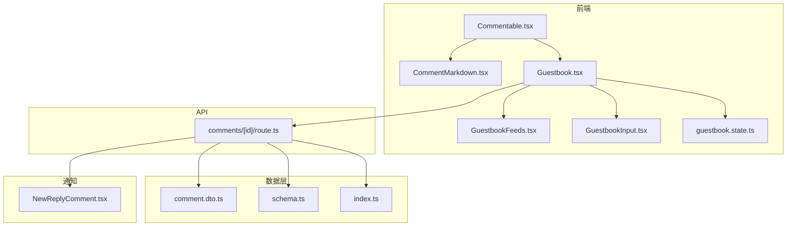
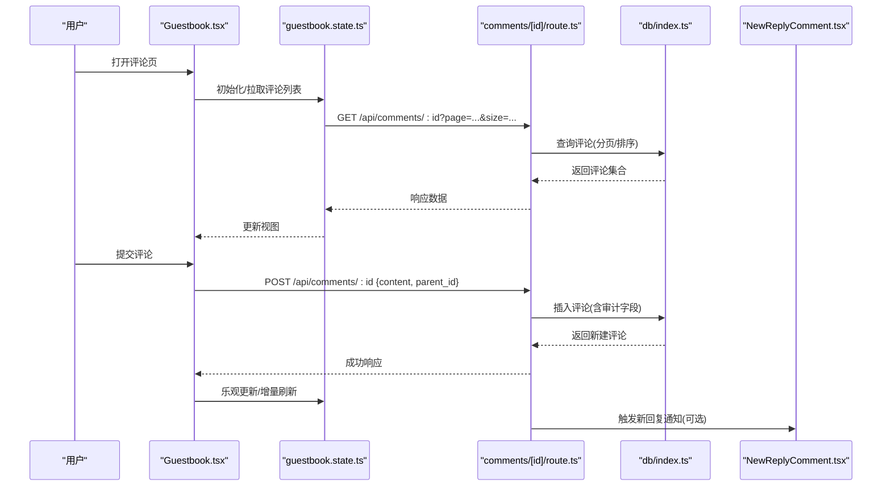
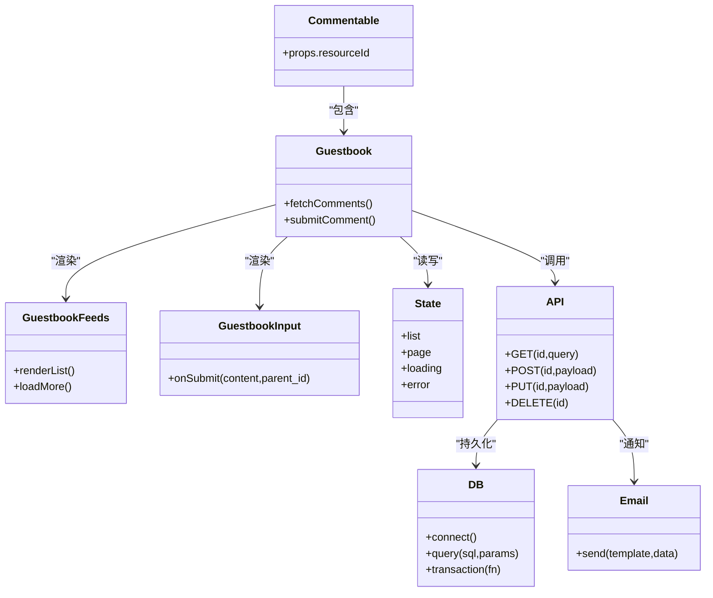

# 评论系统

<cite>
**本文引用的文件**   
- [Commentable.tsx](file://components/Commentable.tsx)
- [CommentMarkdown.tsx](file://components/CommentMarkdown.tsx)
- [Guestbook.tsx](file://app/(main)/guestbook/Guestbook.tsx)
- [GuestbookFeeds.tsx](file://app/(main)/guestbook/GuestbookFeeds.tsx)
- [GuestbookInput.tsx](file://app/(main)/guestbook/GuestbookInput.tsx)
- [guestbook.state.ts](file://app/(main)/guestbook/guestbook.state.ts)
- [route.ts](file://app/api/comments/[id]/route.ts)
- [comment.dto.ts](file://db/dto/comment.dto.ts)
- [schema.ts](file://db/schema.ts)
- [index.ts](file://db/index.ts)
- [NewReplyComment.tsx](file://emails/NewReplyComment.tsx)
</cite>

## 目录
1. [简介](#简介)
2. [项目结构](#项目结构)
3. [核心组件](#核心组件)
4. [架构总览](#架构总览)
5. [详细组件分析](#详细组件分析)
6. [依赖关系分析](#依赖关系分析)
7. [性能考虑](#性能考虑)
8. [故障排查指南](#故障排查指南)
9. [结论](#结论)
10. [附录](#附录)

## 简介
本文件为“评论系统”的完整技术文档，面向开发者与集成者，覆盖可评论组件的实现架构、评论输入框、Markdown 渲染引擎、嵌套回复、增删改查（CRUD）、实时显示更新、权限控制、安全渲染与 XSS 防护、内容过滤、分页加载、搜索与统计分析，以及集成示例、样式配置与扩展开发指南。

## 项目结构
评论相关的前端组件位于 components 与 app/(main)/guestbook 下；后端 API 路由位于 app/api/comments/[id]；数据模型与数据库访问位于 db 目录；邮件通知模板位于 emails。

图表来源
- [Commentable.tsx](file://components/Commentable.tsx)
- [CommentMarkdown.tsx](file://components/CommentMarkdown.tsx)
- [Guestbook.tsx](file://app/(main)/guestbook/Guestbook.tsx)
- [GuestbookFeeds.tsx](file://app/(main)/guestbook/GuestbookFeeds.tsx)
- [GuestbookInput.tsx](file://app/(main)/guestbook/GuestbookInput.tsx)
- [guestbook.state.ts](file://app/(main)/guestbook/guestbook.state.ts)
- [route.ts](file://app/api/comments/[id]/route.ts)
- [comment.dto.ts](file://db/dto/comment.dto.ts)
- [schema.ts](file://db/schema.ts)
- [index.ts](file://db/index.ts)
- [NewReplyComment.tsx](file://emails/NewReplyComment.tsx)

章节来源
- [Commentable.tsx](file://components/Commentable.tsx)
- [CommentMarkdown.tsx](file://components/CommentMarkdown.tsx)
- [Guestbook.tsx](file://app/(main)/guestbook/Guestbook.tsx)
- [GuestbookFeeds.tsx](file://app/(main)/guestbook/GuestbookFeeds.tsx)
- [GuestbookInput.tsx](file://app/(main)/guestbook/GuestbookInput.tsx)
- [guestbook.state.ts](file://app/(main)/guestbook/guestbook.state.ts)
- [route.ts](file://app/api/comments/[id]/route.ts)
- [comment.dto.ts](file://db/dto/comment.dto.ts)
- [schema.ts](file://db/schema.ts)
- [index.ts](file://db/index.ts)
- [NewReplyComment.tsx](file://emails/NewReplyComment.tsx)

## 核心组件
- 可评论容器 Commentable：提供“可评论区域”的挂载点与上下文，负责将目标资源标识（如文章 ID）注入到评论子树中。
- 留言板 Guestbook：聚合评论列表、输入框与状态管理，是评论系统的入口页面组件。
- 评论列表 GuestbookFeeds：展示评论集合，支持分页、排序与基础筛选。
- 评论输入框 GuestbookInput：承载 Markdown 输入、预览、提交与错误提示。
- Markdown 渲染 CommentMarkdown：对评论内容进行安全渲染，内置 XSS 防护与白名单策略。
- 状态管理 guestbook.state.ts：集中管理评论列表、分页、加载态与缓存。
- API 路由 comments/[id]/route.ts：实现评论的增删改查、权限校验与审计字段填充。
- 数据模型 comment.dto.ts 与 schema.ts：定义评论表结构与 DTO 约束。
- 数据库连接 index.ts：封装数据库客户端与事务能力。
- 邮件通知 NewReplyComment.tsx：在收到新回复时触发通知模板。

章节来源
- [Commentable.tsx](file://components/Commentable.tsx)
- [Guestbook.tsx](file://app/(main)/guestbook/Guestbook.tsx)
- [GuestbookFeeds.tsx](file://app/(main)/guestbook/GuestbookFeeds.tsx)
- [GuestbookInput.tsx](file://app/(main)/guestbook/GuestbookInput.tsx)
- [CommentMarkdown.tsx](file://components/CommentMarkdown.tsx)
- [guestbook.state.ts](file://app/(main)/guestbook/guestbook.state.ts)
- [route.ts](file://app/api/comments/[id]/route.ts)
- [comment.dto.ts](file://db/dto/comment.dto.ts)
- [schema.ts](file://db/schema.ts)
- [index.ts](file://db/index.ts)
- [NewReplyComment.tsx](file://emails/NewReplyComment.tsx)

## 架构总览
评论系统采用前后端分离的模块化设计：前端以 React 组件为核心，通过状态管理与 API 交互；后端基于 Next.js Route Handlers 暴露 RESTful 接口；数据持久化由数据库驱动；安全方面通过 Markdown 渲染白名单与输入校验共同保障。

图表来源
- [Guestbook.tsx](file://app/(main)/guestbook/Guestbook.tsx)
- [guestbook.state.ts](file://app/(main)/guestbook/guestbook.state.ts)
- [route.ts](file://app/api/comments/[id]/route.ts)
- [index.ts](file://db/index.ts)
- [NewReplyComment.tsx](file://emails/NewReplyComment.tsx)

## 详细组件分析

### 可评论组件 Commentable
- 职责：作为“可评论区域”的容器，接收目标资源标识（例如文章 slug 或 ID），并向下传递上下文给评论子树。
- 关键行为：
  - 解析并透传资源标识，确保评论与目标内容一一对应。
  - 提供统一的挂载点，便于在不同页面复用。
- 集成方式：在任意内容页面包裹该组件，传入唯一资源标识即可启用评论功能。

章节来源
- [Commentable.tsx](file://components/Commentable.tsx)

### 评论输入框 GuestbookInput
- 职责：提供 Markdown 编辑区、预览切换、提交按钮与错误反馈。
- 关键行为：
  - 本地状态维护输入内容与预览模式。
  - 调用父级提供的提交回调，携带 content 与可选 parent_id（用于回复）。
  - 处理网络异常与表单校验错误。
- 自定义：可通过 props 调整占位符、禁用态、主题色等。

章节来源
- [GuestbookInput.tsx](file://app/(main)/guestbook/GuestbookInput.tsx)

### 评论列表与分页 GuestbookFeeds
- 职责：渲染评论集合，支持分页、排序与基础筛选。
- 关键行为：
  - 根据 URL 参数或内部状态计算 page/size/sort。
  - 合并服务端返回的数据与本地缓存，避免闪烁。
  - 支持加载更多与滚动触底加载。
- 性能优化：
  - 列表项虚拟化（当数据量大时）。
  - 增量更新与去抖请求。

章节来源
- [GuestbookFeeds.tsx](file://app/(main)/guestbook/GuestbookFeeds.tsx)

### 状态管理 guestbook.state.ts
- 职责：集中管理评论列表、分页、加载态、错误态与缓存。
- 关键行为：
  - 提供 fetchComments、createComment、deleteComment 等方法。
  - 维护 optimistic 更新逻辑，提升交互体验。
  - 提供订阅机制，供多个组件共享状态。

章节来源
- [guestbook.state.ts](file://app/(main)/guestbook/guestbook.state.ts)

### Markdown 渲染引擎 CommentMarkdown
- 职责：安全地将 Markdown 文本渲染为 HTML。
- 安全策略：
  - 使用白名单策略仅允许安全的标签与属性。
  - 自动移除危险协议（如 javascript:）。
  - 对链接添加 rel="noopener noreferrer" 等安全属性。
- 可扩展性：
  - 支持自定义节点处理器（如图片、代码块、引用等）。
  - 可注入全局样式类名以实现主题定制。

章节来源
- [CommentMarkdown.tsx](file://components/CommentMarkdown.tsx)

### 留言板入口 Guestbook
- 职责：组合评论列表、输入框与状态管理，提供完整的评论交互流程。
- 关键行为：
  - 监听路由参数变化，重新拉取对应资源的评论。
  - 统一处理创建、删除、回复等操作后的状态同步。
  - 提供空态、加载态与错误态的 UI 反馈。

章节来源
- [Guestbook.tsx](file://app/(main)/guestbook/Guestbook.tsx)

### API 路由 comments/[id]/route.ts
- 职责：实现评论的增删改查、权限校验与审计字段填充。
- 主要操作：
  - GET：按资源 id 分页获取评论，支持排序与筛选。
  - POST：创建评论或回复，校验内容长度与格式，写入审计字段（创建时间、IP 等）。
  - PUT/PATCH：更新评论（需具备相应权限）。
  - DELETE：删除评论（管理员或作者）。
- 权限控制：
  - 基于会话/令牌的身份识别。
  - 角色与资源所有权双重校验。
- 安全与合规：
  - 输入校验与长度限制。
  - 敏感词过滤（可配置）。
  - 速率限制与防刷策略。

章节来源
- [route.ts](file://app/api/comments/[id]/route.ts)

### 数据模型与数据库访问
- comment.dto.ts：定义评论数据的传输对象与校验规则。
- schema.ts：定义评论表结构（字段、类型、索引、外键等）。
- index.ts：封装数据库客户端、连接池与事务方法。

章节来源
- [comment.dto.ts](file://db/dto/comment.dto.ts)
- [schema.ts](file://db/schema.ts)
- [index.ts](file://db/index.ts)

### 邮件通知 NewReplyComment.tsx
- 职责：在新回复产生时生成邮件模板并发送通知。
- 触发时机：评论创建成功后，异步触发通知任务。
- 可配置项：收件人、模板变量、附件等。

章节来源
- [NewReplyComment.tsx](file://emails/NewReplyComment.tsx)

## 依赖关系分析
评论系统各模块之间的依赖关系如下：

图表来源
- [Commentable.tsx](file://components/Commentable.tsx)
- [Guestbook.tsx](file://app/(main)/guestbook/Guestbook.tsx)
- [GuestbookFeeds.tsx](file://app/(main)/guestbook/GuestbookFeeds.tsx)
- [GuestbookInput.tsx](file://app/(main)/guestbook/GuestbookInput.tsx)
- [guestbook.state.ts](file://app/(main)/guestbook/guestbook.state.ts)
- [route.ts](file://app/api/comments/[id]/route.ts)
- [index.ts](file://db/index.ts)
- [NewReplyComment.tsx](file://emails/NewReplyComment.tsx)

## 性能考虑
- 前端
  - 列表虚拟滚动与分页加载，减少首屏渲染压力。
  - 乐观更新与增量刷新，降低二次请求。
  - 防抖/节流输入与搜索，避免频繁请求。
- 后端
  - 数据库索引优化（resource_id、parent_id、created_at）。
  - 分页游标替代偏移量，提升大数据集性能。
  - 缓存热点评论（Redis）与失效策略。
- 渲染
  - Markdown 渲染结果缓存，避免重复解析。
  - 图片懒加载与尺寸裁剪。

[本节为通用指导，不直接分析具体文件]

## 故障排查指南
- 常见问题
  - 评论无法提交：检查身份认证与会话有效性；确认输入长度与格式校验。
  - 列表不更新：确认状态订阅是否生效；检查乐观更新与服务器响应一致性。
  - Markdown 渲染异常：检查白名单配置；确认是否存在未允许的标签或属性。
  - 权限不足：核对当前用户角色与资源所有权；查看审计日志。
- 定位步骤
  - 前端：打开控制台查看网络请求与状态变更；复现问题并记录请求载荷。
  - 后端：查看 API 路由日志与数据库慢查询；验证输入校验与权限分支。
  - 数据层：检查连接池与事务回滚情况；确认迁移版本一致。
  - 通知：检查邮件服务配置与模板变量替换。

章节来源
- [route.ts](file://app/api/comments/[id]/route.ts)
- [guestbook.state.ts](file://app/(main)/guestbook/guestbook.state.ts)
- [CommentMarkdown.tsx](file://components/CommentMarkdown.tsx)
- [index.ts](file://db/index.ts)
- [NewReplyComment.tsx](file://emails/NewReplyComment.tsx)

## 结论
评论系统通过清晰的组件分层、稳健的状态管理与安全的渲染策略，提供了开箱即用的评论能力。结合分页、搜索与统计扩展，可满足大多数内容平台的互动需求。建议在生产环境开启严格的输入校验、XSS 白名单与审计日志，并根据业务需要扩展权限与通知渠道。

[本节为总结性内容，不直接分析具体文件]

## 附录

### 集成示例
- 在任意内容页面引入可评论容器，并传入资源标识：
  - 参考路径：[Commentable.tsx](file://components/Commentable.tsx)
- 在独立评论页使用留言板组件：
  - 参考路径：[Guestbook.tsx](file://app/(main)/guestbook/Guestbook.tsx)

### 自定义样式配置
- 通过 CSS 类名覆盖默认样式，或在 Markdown 渲染器中注入自定义样式。
- 参考路径：
  - [CommentMarkdown.tsx](file://components/CommentMarkdown.tsx)
  - [GuestbookFeeds.tsx](file://app/(main)/guestbook/GuestbookFeeds.tsx)

### 扩展开发指南
- 新增评论字段：
  - 修改数据模型与 DTO，并在 API 路由中适配读写逻辑。
  - 参考路径：
    - [comment.dto.ts](file://db/dto/comment.dto.ts)
    - [schema.ts](file://db/schema.ts)
    - [route.ts](file://app/api/comments/[id]/route.ts)
- 扩展 Markdown 节点：
  - 在渲染器中注册自定义节点处理器。
  - 参考路径：[CommentMarkdown.tsx](file://components/CommentMarkdown.tsx)
- 增加搜索与统计：
  - 在前端增加搜索参数与统计面板；在后端提供聚合接口。
  - 参考路径：
    - [GuestbookFeeds.tsx](file://app/(main)/guestbook/GuestbookFeeds.tsx)
    - [route.ts](file://app/api/comments/[id]/route.ts)