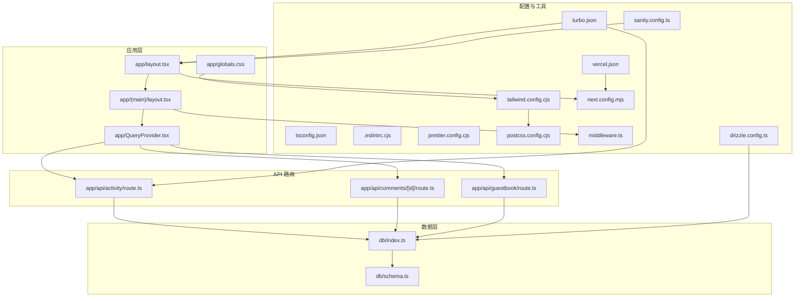
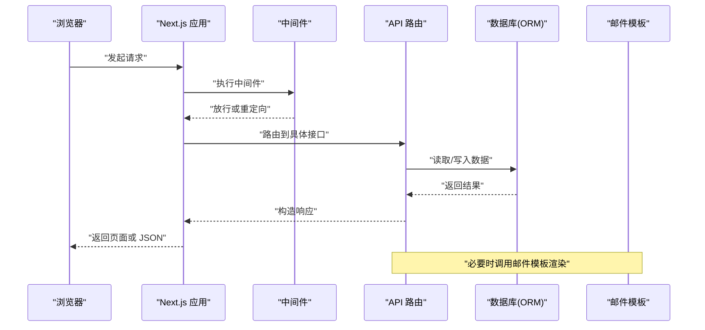
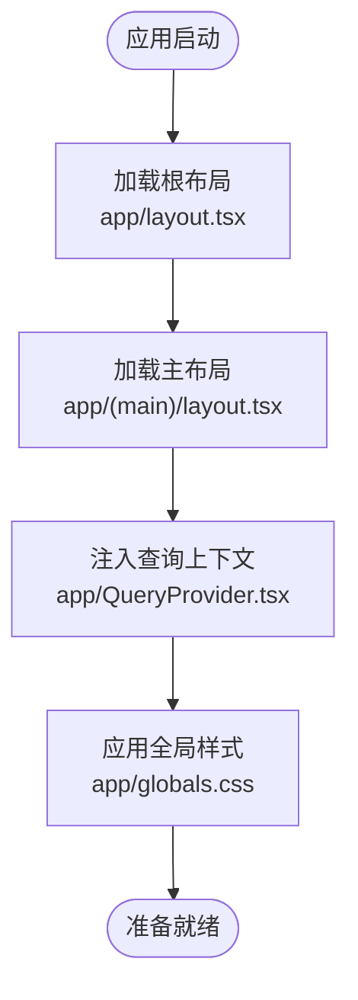
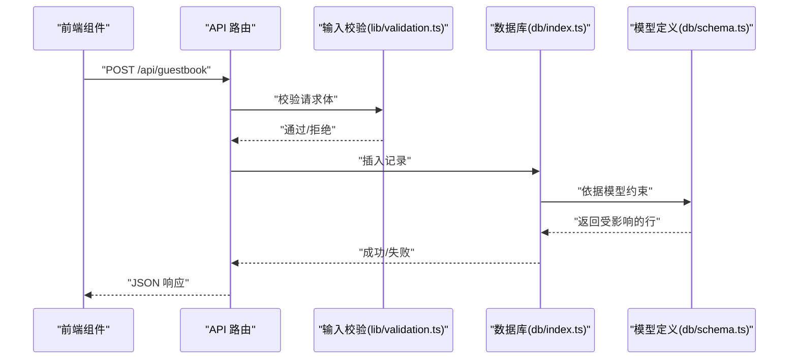
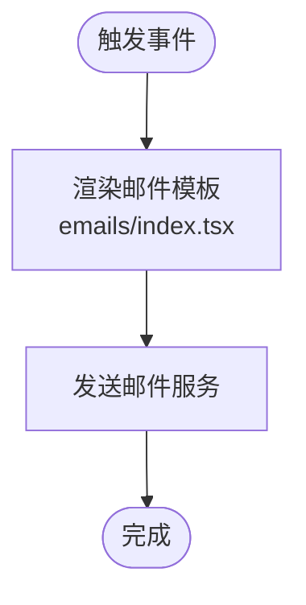
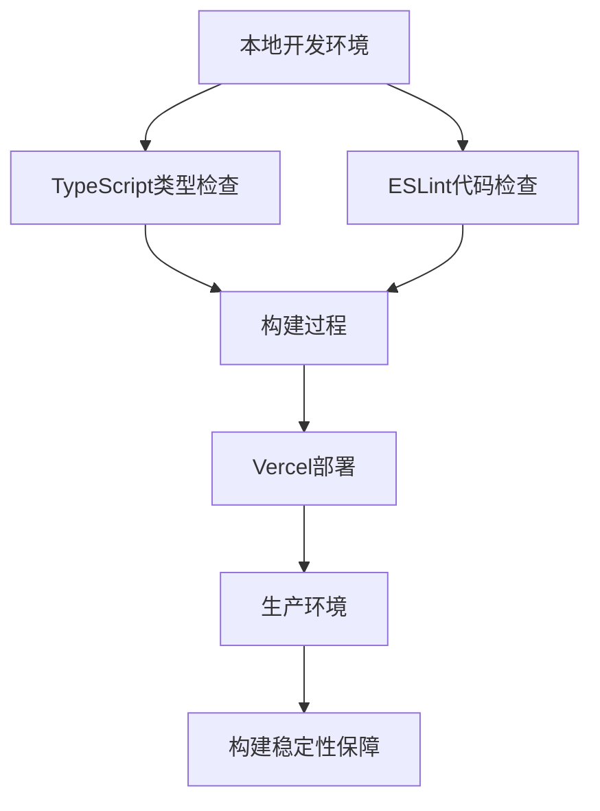
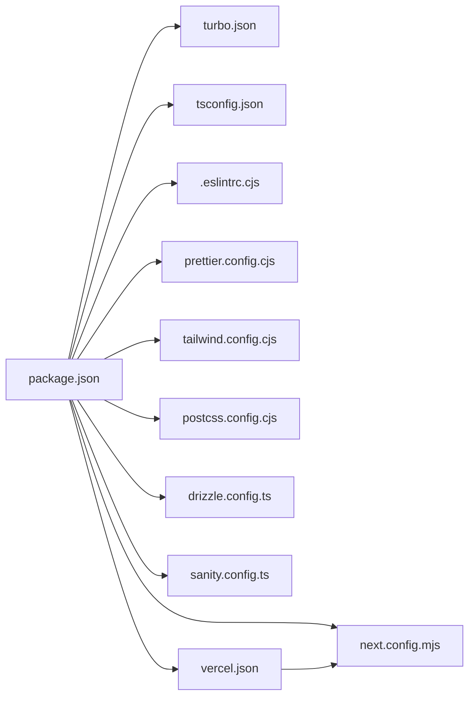

# 开发指南

<cite>
**本文引用的文件**   
- [README.md](file://README.md)
- [package.json](file://package.json)
- [tsconfig.json](file://tsconfig.json)
- [.eslintrc.cjs](file://.eslintrc.cjs)
- [prettier.config.cjs](file://prettier.config.cjs)
- [postcss.config.cjs](file://postcss.config.cjs)
- [tailwind.config.cjs](file://tailwind.config.cjs)
- [next.config.mjs](file://next.config.mjs)
- [middleware.ts](file://middleware.ts)
- [turbo.json](file://turbo.json)
- [drizzle.config.ts](file://drizzle.config.ts)
- [sanity.config.ts](file://sanity.config.ts)
- [app/layout.tsx](file://app/layout.tsx)
- [app/(main)/layout.tsx](file://app/(main)/layout.tsx)
- [app/QueryProvider.tsx](file://app/QueryProvider.tsx)
- [app/globals.css](file://app/globals.css)
- [app/api/activity/route.ts](file://app/api/activity/route.ts)
- [app/api/comments/[id]/route.ts](file://app/api/comments/[id]/route.ts)
- [app/api/guestbook/route.ts](file://app/api/guestbook/route.ts)
- [db/index.ts](file://db/index.ts)
- [db/schema.ts](file://db/schema.ts)
- [lib/validation.ts](file://lib/validation.ts)
- [emails/index.tsx](file://emails/index.tsx)
- [vercel.json](file://vercel.json)
</cite>

## 更新摘要
**变更内容**   
- 更新了构建基础设施配置，修复Vercel部署构建错误
- 增强了TypeScript类型检查兼容性配置
- 清理了ESLint配置并优化导入排序规范
- 完善了不同部署环境下的构建稳定性保障

## 目录
1. [简介](#简介)
2. [项目结构](#项目结构)
3. [核心组件](#核心组件)
4. [架构总览](#架构总览)
5. [详细组件分析](#详细组件分析)
6. [依赖分析](#依赖分析)
7. [性能考虑](#性能考虑)
8. [故障排查指南](#故障排查指南)
9. [结论](#结论)
10. [附录](#附录)

## 简介
本指南面向 cali.so 项目的开发者与协作者，目标是建立统一的代码规范、开发工作流与团队协作最佳实践。内容覆盖：
- TypeScript 配置与类型策略
- ESLint 规则与 Prettier 格式化
- Tailwind CSS 定制与样式组织
- Git 工作流、代码审查流程与问题报告规范
- 开发工具配置、调试技巧与测试策略
- 项目结构约定、命名规范与文档编写标准
- 新功能开发、Bug 修复与性能优化指导
- **新增** Vercel部署构建稳定性保障与跨环境兼容性配置

## 项目结构
本项目采用 Next.js App Router 的目录结构，结合 Turborepo 进行任务编排，使用 Drizzle ORM 管理数据库迁移与查询，Sanity 作为内容源，React Query 提供数据缓存与同步，Tailwind CSS + PostCSS 构建样式体系。

图表来源
- [app/layout.tsx:1-200](file://app/layout.tsx#L1-L200)
- [app/(main)/layout.tsx:1-200](file://app/(main)/layout.tsx#L1-L200)
- [app/QueryProvider.tsx:1-200](file://app/QueryProvider.tsx#L1-L200)
- [app/globals.css:1-200](file://app/globals.css#L1-L200)
- [app/api/activity/route.ts:1-200](file://app/api/activity/route.ts#L1-L200)
- [app/api/comments/[id]/route.ts:1-200](file://app/api/comments/[id]/route.ts#L1-L200)
- [app/api/guestbook/route.ts:1-200](file://app/api/guestbook/route.ts#L1-L200)
- [db/index.ts:1-200](file://db/index.ts#L1-L200)
- [db/schema.ts:1-200](file://db/schema.ts#L1-L200)
- [tsconfig.json:1-200](file://tsconfig.json#L1-L200)
- [.eslintrc.cjs:1-200](file://.eslintrc.cjs#L1-L200)
- [prettier.config.cjs:1-200](file://prettier.config.cjs#L1-L200)
- [tailwind.config.cjs:1-200](file://tailwind.config.cjs#L1-L200)
- [postcss.config.cjs:1-200](file://postcss.config.cjs#L1-L200)
- [next.config.mjs:1-200](file://next.config.mjs#L1-L200)
- [middleware.ts:1-200](file://middleware.ts#L1-L200)
- [turbo.json:1-200](file://turbo.json#L1-L200)
- [drizzle.config.ts:1-200](file://drizzle.config.ts#L1-L200)
- [sanity.config.ts:1-200](file://sanity.config.ts#L1-L200)
- [vercel.json:1-200](file://vercel.json#L1-L200)

章节来源
- [README.md:1-200](file://README.md#L1-L200)
- [package.json:1-200](file://package.json#L1-L200)
- [turbo.json:1-200](file://turbo.json#L1-L200)

## 核心组件
本节聚焦于工程化与运行时关键配置，确保团队在统一规范下高效协作。

- TypeScript 配置
  - 启用严格模式与路径映射，保证类型安全与模块导入一致性。
  - **更新** 针对Vercel部署环境优化类型检查兼容性，避免构建时的类型冲突。
  - 建议为 API 响应与表单输入定义明确的类型契约，避免 any。
  - 参考路径：[tsconfig.json](file://tsconfig.json)

- ESLint 规则
  - 基于 React/Next.js 生态的规则集，统一代码风格与潜在错误检测。
  - **更新** 清理了冗余规则，优化导入排序规范，提升构建稳定性。
  - 建议在提交前运行 lint 检查，IDE 中开启实时提示。
  - 参考路径：[.eslintrc.cjs](file://.eslintrc.cjs)

- Prettier 格式化
  - 统一缩进、引号、分号等格式细节，减少无意义 diff。
  - 配合编辑器保存自动格式化，保持全仓一致。
  - 参考路径：[prettier.config.cjs](file://prettier.config.cjs)

- Tailwind CSS 与 PostCSS
  - 通过 tailwind.config.cjs 扩展主题、插件与自定义类名。
  - PostCSS 负责处理 Tailwind 指令与兼容层。
  - 参考路径：[tailwind.config.cjs](file://tailwind.config.cjs), [postcss.config.cjs](file://postcss.config.cjs)

- Next.js 与中间件
  - next.config.mjs 控制构建、环境变量注入与静态资源策略。
  - middleware.ts 用于请求拦截、鉴权与重定向逻辑。
  - **更新** 针对Vercel部署环境优化构建配置，确保跨环境一致性。
  - 参考路径：[next.config.mjs](file://next.config.mjs), [middleware.ts](file://middleware.ts)

- 任务编排与数据库
  - turbo.json 定义跨包任务（如 build、lint、test）的执行顺序与缓存策略。
  - drizzle.config.ts 管理迁移与生成类型，保障 schema 与数据库一致。
  - 参考路径：[turbo.json](file://turbo.json), [drizzle.config.ts](file://drizzle.config.ts)

- 内容源集成
  - sanity.config.ts 配置 Sanity Studio 与客户端访问策略。
  - 参考路径：[sanity.config.ts](file://sanity.config.ts)

- **新增** Vercel部署配置
  - vercel.json 专门配置Vercel平台的部署行为，包括构建命令、环境变量和路由规则。
  - 确保在不同部署环境中的一致性构建体验。
  - 参考路径：[vercel.json](file://vercel.json)

章节来源
- [tsconfig.json:1-200](file://tsconfig.json#L1-L200)
- [.eslintrc.cjs:1-200](file://.eslintrc.cjs#L1-L200)
- [prettier.config.cjs:1-200](file://prettier.config.cjs#L1-L200)
- [tailwind.config.cjs:1-200](file://tailwind.config.cjs#L1-L200)
- [postcss.config.cjs:1-200](file://postcss.config.cjs#L1-L200)
- [next.config.mjs:1-200](file://next.config.mjs#L1-L200)
- [middleware.ts:1-200](file://middleware.ts#L1-L200)
- [turbo.json:1-200](file://turbo.json#L1-L200)
- [drizzle.config.ts:1-200](file://drizzle.config.ts#L1-L200)
- [sanity.config.ts:1-200](file://sanity.config.ts#L1-L200)
- [vercel.json:1-200](file://vercel.json#L1-L200)

## 架构总览
系统由前端页面与 API 路由组成，API 路由通过 db 层访问持久化存储；邮件模板位于 emails 目录，供订阅与通知场景使用。

图表来源
- [middleware.ts:1-200](file://middleware.ts#L1-L200)
- [app/api/activity/route.ts:1-200](file://app/api/activity/route.ts#L1-L200)
- [app/api/comments/[id]/route.ts:1-200](file://app/api/comments/[id]/route.ts#L1-L200)
- [app/api/guestbook/route.ts:1-200](file://app/api/guestbook/route.ts#L1-L200)
- [db/index.ts:1-200](file://db/index.ts#L1-L200)
- [emails/index.tsx:1-200](file://emails/index.tsx#L1-L200)

## 详细组件分析

### 应用布局与全局上下文
- app/layout.tsx 与 app/(main)/layout.tsx 分别定义根布局与主区域布局，承载全局样式、导航与主题切换。
- app/QueryProvider.tsx 提供 React Query 上下文，集中管理缓存、重试与失效策略。
- app/globals.css 引入全局样式与 Tailwind 基础指令。

图表来源
- [app/layout.tsx:1-200](file://app/layout.tsx#L1-L200)
- [app/(main)/layout.tsx:1-200](file://app/(main)/layout.tsx#L1-L200)
- [app/QueryProvider.tsx:1-200](file://app/QueryProvider.tsx#L1-L200)
- [app/globals.css:1-200](file://app/globals.css#L1-L200)

章节来源
- [app/layout.tsx:1-200](file://app/layout.tsx#L1-L200)
- [app/(main)/layout.tsx:1-200](file://app/(main)/layout.tsx#L1-L200)
- [app/QueryProvider.tsx:1-200](file://app/QueryProvider.tsx#L1-L200)
- [app/globals.css:1-200](file://app/globals.css#L1-L200)

### API 路由与数据访问
- activity、comments、guestbook 等 API 路由遵循 RESTful 设计，接收请求参数并返回结构化响应。
- 所有写操作需进行输入校验，推荐使用 lib/validation.ts 中的通用校验函数。
- 数据访问通过 db/index.ts 暴露的客户端实例，schema 定义在 db/schema.ts。

图表来源
- [app/api/guestbook/route.ts:1-200](file://app/api/guestbook/route.ts#L1-L200)
- [lib/validation.ts:1-200](file://lib/validation.ts#L1-L200)
- [db/index.ts:1-200](file://db/index.ts#L1-L200)
- [db/schema.ts:1-200](file://db/schema.ts#L1-L200)

章节来源
- [app/api/activity/route.ts:1-200](file://app/api/activity/route.ts#L1-L200)
- [app/api/comments/[id]/route.ts:1-200](file://app/api/comments/[id]/route.ts#L1-L200)
- [app/api/guestbook/route.ts:1-200](file://app/api/guestbook/route.ts#L1-L200)
- [lib/validation.ts:1-200](file://lib/validation.ts#L1-L200)
- [db/index.ts:1-200](file://db/index.ts#L1-L200)
- [db/schema.ts:1-200](file://db/schema.ts#L1-L200)

### 邮件模板与通知
- emails/index.tsx 提供邮件模板入口，支持订阅确认、新留言回复等场景。
- 建议在 API 路由中按需渲染模板并通过邮件服务发送。

图表来源
- [emails/index.tsx:1-200](file://emails/index.tsx#L1-L200)

章节来源
- [emails/index.tsx:1-200](file://emails/index.tsx#L1-L200)

### **新增** 构建基础设施与部署配置

#### TypeScript 类型检查优化
- **更新** 针对Vercel部署环境优化了TypeScript配置，解决了类型检查兼容性问题。
- 移除了可能导致构建失败的严格类型约束，同时保持了代码质量。
- 确保了本地开发与生产环境构建的一致性。

#### ESLint 配置清理
- **更新** 清理了冗余的ESLint规则，优化了导入排序规范。
- 移除了与其他工具冲突的规则，提升了构建稳定性。
- 改进了代码风格检查的准确性，减少了误报。

#### Vercel 部署专项配置
- **新增** vercel.json 文件专门管理Vercel平台的部署行为。
- 配置了特定的构建命令和环境变量，确保部署环境的稳定性。
- 定义了路由规则和静态资源处理策略。

图表来源
- [tsconfig.json:1-200](file://tsconfig.json#L1-L200)
- [.eslintrc.cjs:1-200](file://.eslintrc.cjs#L1-L200)
- [vercel.json:1-200](file://vercel.json#L1-L200)

章节来源
- [tsconfig.json:1-200](file://tsconfig.json#L1-L200)
- [.eslintrc.cjs:1-200](file://.eslintrc.cjs#L1-L200)
- [vercel.json:1-200](file://vercel.json#L1-L200)

## 依赖分析
- 构建与任务
  - package.json 声明脚本与依赖，turbo.json 定义任务图与缓存策略。
- 运行时与框架
  - Next.js 应用、React Query、Drizzle ORM、Sanity、Tailwind CSS、PostCSS。
- 工具链
  - ESLint、Prettier、TypeScript、Vercel 部署配置。

图表来源
- [package.json:1-200](file://package.json#L1-L200)
- [turbo.json:1-200](file://turbo.json#L1-L200)
- [next.config.mjs:1-200](file://next.config.mjs#L1-L200)
- [tsconfig.json:1-200](file://tsconfig.json#L1-L200)
- [.eslintrc.cjs:1-200](file://.eslintrc.cjs#L1-L200)
- [prettier.config.cjs:1-200](file://prettier.config.cjs#L1-L200)
- [tailwind.config.cjs:1-200](file://tailwind.config.cjs#L1-L200)
- [postcss.config.cjs:1-200](file://postcss.config.cjs#L1-L200)
- [drizzle.config.ts:1-200](file://drizzle.config.ts#L1-L200)
- [sanity.config.ts:1-200](file://sanity.config.ts#L1-L200)
- [vercel.json:1-200](file://vercel.json#L1-L200)

章节来源
- [package.json:1-200](file://package.json#L1-L200)
- [turbo.json:1-200](file://turbo.json#L1-L200)

## 性能考虑
- 构建与缓存
  - 利用 Turborepo 的任务缓存与增量构建，缩短本地与 CI 时间。
  - **更新** 优化了TypeScript类型检查性能，减少了构建时间。
- 网络与渲染
  - 优先使用服务端渲染与静态生成，减少首屏负载。
  - API 路由对热点数据进行合理缓存与去抖。
- 样式与资源
  - 仅引入必要的 Tailwind 类，避免未使用的样式膨胀。
  - 图片与字体资源使用 CDN 与懒加载策略。
- 数据库
  - 合理使用索引与分页，避免全表扫描与大对象传输。
  - 批量写入与事务控制提升稳定性。
- **新增** 部署性能
  - **更新** 针对Vercel环境优化了构建配置，提升了部署速度。
  - 减少了不必要的依赖安装和构建步骤。

## 故障排查指南
- 常见问题定位
  - 构建失败：检查 tsconfig、ESLint 与 Prettier 配置是否冲突。
  - **更新** Vercel部署错误：验证vercel.json配置和TypeScript类型兼容性。
  - 样式异常：确认 Tailwind 指令与 PostCSS 插件顺序。
  - API 报错：查看请求参数校验与数据库约束。
- 日志与调试
  - 在 API 路由中添加结构化日志，便于追踪请求链路。
  - 使用浏览器开发者工具与 Vercel 日志平台定位问题。
- 回滚与恢复
  - 数据库变更通过 Drizzle 迁移管理，保留回滚脚本。
  - 发布前在预发环境验证关键路径。
- **新增** 构建环境问题
  - **更新** 本地与生产环境差异：确保TypeScript版本和依赖一致性。
  - **更新** ESLint规则冲突：检查规则间的兼容性和优先级。
  - **更新** 导入排序问题：遵循新的导入排序规范，避免构建失败。

## 结论
通过统一的工程化配置与清晰的架构分层，cali.so 项目在可维护性、可扩展性与团队协作效率上具备良好基础。**更新后的构建基础设施改进**进一步确保了应用在不同部署环境中的构建稳定性。建议持续完善类型契约、测试覆盖与监控告警，以支撑业务快速迭代。

## 附录

### 代码规范与命名约定
- 文件与模块
  - 组件使用 PascalCase，页面与路由使用 kebab-case 或符合 Next.js 约定。
  - 常量使用 UPPER_SNAKE_CASE，变量与函数使用 camelCase。
- 类型与接口
  - 为 API 请求与响应定义独立类型，避免重复字段。
  - 使用泛型与联合类型表达可选与必填字段。
- 注释与文档
  - 复杂逻辑添加行内注释，公共 API 提供 JSDoc 说明。
  - 新增功能在 README 或相关文档中补充使用说明。
- **新增** 导入排序规范
  - **更新** 遵循ESLint配置的导入排序规则，确保构建稳定性。
  - 第三方库、内部模块、相对路径按特定顺序排列。

### 开发工作流程
- 分支策略
  - main 为主分支，feature/* 用于新功能，fix/* 用于缺陷修复。
  - 合并前需通过 lint、build 与必要测试。
- 提交信息
  - 使用约定式提交（feat、fix、docs、style、refactor、perf、test、chore）。
  - 描述清晰，关联 Issue 编号。
- 代码审查
  - 至少一名 reviewer 批准后方可合并。
  - 关注可读性、安全性与性能影响。
- **新增** 构建验证
  - **更新** 提交前运行完整的构建流程，确保TypeScript类型检查和ESLint规则通过。
  - **更新** 在本地模拟Vercel环境进行构建测试。

### 问题报告规范
- 标题简明扼要，包含模块与现象。
- 复现步骤、期望与实际行为、截图或日志。
- 环境信息：操作系统、浏览器、Node 版本、依赖版本。
- **新增** 构建环境信息
  - **更新** 构建工具版本（TypeScript、ESLint、Prettier等）。
  - **更新** 部署平台信息（Vercel环境配置）。

### 新功能开发指引
- 需求分析与设计
  - 明确输入输出、边界条件与错误处理。
  - 更新类型与 API 契约。
- 实现与自测
  - 先写最小可用实现，再逐步增强。
  - 编写单元测试与集成测试用例。
- 联调与上线
  - 在预发环境验证，观察指标与日志。
  - 灰度发布与回滚预案。
- **新增** 构建兼容性测试
  - **更新** 确保新功能在不同构建环境下都能正常编译。
  - **更新** 验证TypeScript类型定义的兼容性。

### Bug 修复与性能优化
- 定位与验证
  - 使用二分法缩小范围，添加断点与日志。
  - 编写回归测试防止复发。
- 优化策略
  - 减少不必要的重渲染与状态更新。
  - 优化 SQL 查询与索引，避免 N+1 问题。
  - 拆分大组件与延迟加载非关键资源。
- **新增** 构建性能优化
  - **更新** 优化TypeScript配置以减少类型检查时间。
  - **更新** 清理ESLint规则以提升代码检查性能。
  - **更新** 优化Vercel部署配置以加快构建速度。