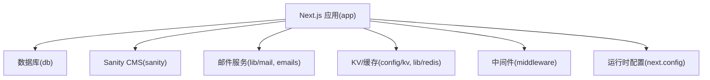
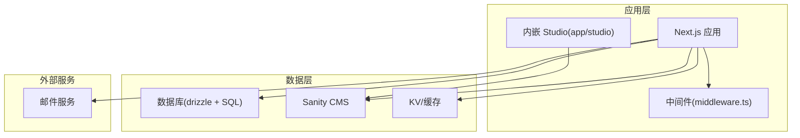
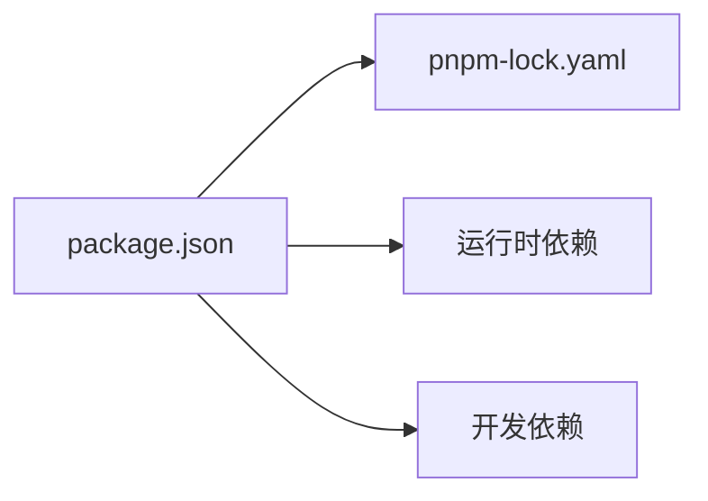

# 快速开始

<cite>
**本文引用的文件**   
- [package.json](file://package.json)
- [README.md](file://README.md)
- [env.mjs](file://env.mjs)
- [drizzle.config.ts](file://drizzle.config.ts)
- [db/index.ts](file://db/index.ts)
- [sanity.config.ts](file://sanity.config.ts)
- [sanity.cli.ts](file://sanity.cli.ts)
- [sanity/env.ts](file://sanity/env.ts)
- [sanity/lib/client.ts](file://sanity/lib/client.ts)
- [app/studio/[[...index]]/page.tsx](file://app/studio/[[...index]]/page.tsx)
- [app/studio/[[...index]]/Studio.tsx](file://app/studio/[[...index]]/Studio.tsx)
- [next.config.mjs](file://next.config.mjs)
- [middleware.ts](file://middleware.ts)
- [lib/mail.ts](file://lib/mail.ts)
- [config/kv.ts](file://config/kv.ts)
- [emails/index.tsx](file://emails/index.tsx)
</cite>

## 目录
1. [简介](#简介)
2. [项目结构](#项目结构)
3. [核心组件](#核心组件)
4. [架构总览](#架构总览)
5. [详细组件分析](#详细组件分析)
6. [依赖分析](#依赖分析)
7. [性能考虑](#性能考虑)
8. [故障排除指南](#故障排除指南)
9. [结论](#结论)
10. [附录](#附录)

## 简介
本指南面向首次接触 cali.so 项目的开发者，提供从零开始的本地开发环境搭建与运行说明。内容涵盖 Node.js 版本要求、包管理器与依赖安装、环境变量配置、数据库初始化、Sanity CMS 配置与本地 Studio 启动、邮件发送与 KV 存储等外部服务接入步骤，并附带常见问题排查建议。目标是帮助不同经验水平的开发者在尽可能短的时间内成功运行项目并进行二次开发。

## 项目结构
本项目基于 Next.js（App Router）构建，包含以下关键目录与职责：
- app：应用路由与页面、API 路由、管理后台、内嵌 Sanity Studio 入口
- db：数据库连接、Schema 定义、迁移与查询
- sanity：Sanity 客户端、CLI 与 Schema 定义
- lib：通用工具库（SEO、日期、图片、Redis/KV、邮件等）
- config：业务配置（导航、KV 等）
- emails：邮件模板与渲染
- public：静态资源

[本节为概念性概览，无需来源标注]

## 核心组件
- 运行时与脚本：通过 package.json 中的脚本命令进行开发、构建与部署；同时定义了 Node.js 版本约束与依赖项。
- 环境变量：env.mjs 集中声明与校验环境变量，供应用各模块使用。
- 数据库：drizzle.config.ts 与 db/index.ts 负责数据库连接与迁移执行。
- Sanity CMS：sanity.config.ts、sanity.cli.ts、sanity/env.ts 与 app/studio 目录共同构成本地与云端 CMS 能力。
- 邮件与 KV：lib/mail.ts、emails/index.tsx 与 config/kv.ts 提供邮件发送与键值存储能力。

章节来源
- [package.json](file://package.json)
- [env.mjs](file://env.mjs)
- [drizzle.config.ts](file://drizzle.config.ts)
- [db/index.ts](file://db/index.ts)
- [sanity.config.ts](file://sanity.config.ts)
- [sanity.cli.ts](file://sanity.cli.ts)
- [sanity/env.ts](file://sanity/env.ts)
- [app/studio/[[...index]]/page.tsx](file://app/studio/[[...index]]/page.tsx)
- [app/studio/[[...index]]/Studio.tsx](file://app/studio/[[...index]]/Studio.tsx)
- [lib/mail.ts](file://lib/mail.ts)
- [config/kv.ts](file://config/kv.ts)
- [emails/index.tsx](file://emails/index.tsx)

## 架构总览
下图展示了本地开发时的主要交互关系：Next.js 应用作为统一入口，访问数据库、Sanity CMS、邮件与 KV 服务，并通过中间件处理鉴权与请求拦截。

图表来源
- [middleware.ts](file://middleware.ts)
- [app/studio/[[...index]]/page.tsx](file://app/studio/[[...index]]/page.tsx)
- [app/studio/[[...index]]/Studio.tsx](file://app/studio/[[...index]]/Studio.tsx)
- [db/index.ts](file://db/index.ts)
- [sanity.config.ts](file://sanity.config.ts)
- [config/kv.ts](file://config/kv.ts)
- [lib/mail.ts](file://lib/mail.ts)

## 详细组件分析

### 环境与依赖准备
- Node.js 版本
  - 请根据 package.json 中指定的引擎版本安装对应 Node.js。
- 包管理器
  - 推荐使用 pnpm（仓库包含 pnpm-lock.yaml），也可使用 npm/yarn。
- 安装依赖
  - 在项目根目录执行包管理器安装命令以拉取所有依赖。
- 环境变量
  - 参考 env.mjs 中声明的环境变量，创建 .env.local 或 .env.development 文件并填入必要值。
  - 常见类别包括：数据库连接串、Sanity 项目 ID 与数据集、邮件服务凭据、KV/缓存连接信息、第三方认证等。
- 验证环境变量
  - 启动开发服务器后，若出现“缺少环境变量”或“类型校验失败”的提示，请对照 env.mjs 补齐缺失项。

章节来源
- [package.json](file://package.json)
- [env.mjs](file://env.mjs)

### 数据库初始化与迁移
- 配置文件
  - drizzle.config.ts 指定数据库驱动与迁移元数据路径。
- 连接与迁移
  - db/index.ts 暴露数据库连接对象，配合 CLI 执行迁移与生成类型。
- 常用流程
  - 生成迁移：根据 schema 变更生成 SQL 迁移文件。
  - 执行迁移：将迁移应用到本地或远程数据库。
  - 生成类型：从数据库反向生成 TypeScript 类型。
- 注意事项
  - 确保数据库实例可访问且权限正确。
  - 迁移前备份重要数据。
  - 多环境时注意区分连接串与驱动参数。

章节来源
- [drizzle.config.ts](file://drizzle.config.ts)
- [db/index.ts](file://db/index.ts)

### Sanity CMS 配置与本地 Studio
- 配置要点
  - sanity/config.ts：定义插件、主题、文档类型等。
  - sanity/cli.ts：CLI 行为与默认配置。
  - sanity/env.ts：读取 Sanity 相关环境变量（如 projectId、dataset）。
  - sanity/lib/client.ts：浏览器端 Sanity 客户端封装。
- 本地 Studio 运行
  - 通过 app/studio/[[...index]]/page.tsx 与 Studio.tsx 提供内嵌 Studio 入口。
  - 启动开发服务器后访问 /studio 即可打开本地 Studio。
- 云端 Studio
  - 使用 npx sanity 命令登录、创建/切换项目、推送 schema 与种子数据。
- 常见问题
  - 无法连接：检查 projectId/dataset 与网络代理设置。
  - 权限不足：确认当前用户具备写入权限。
  - 跨域问题：在 Sanity 控制台配置允许的域名。

章节来源
- [sanity.config.ts](file://sanity.config.ts)
- [sanity.cli.ts](file://sanity.cli.ts)
- [sanity/env.ts](file://sanity/env.ts)
- [sanity/lib/client.ts](file://sanity/lib/client.ts)
- [app/studio/[[...index]]/page.tsx](file://app/studio/[[...index]]/page.tsx)
- [app/studio/[[...index]]/Studio.tsx](file://app/studio/[[...index]]/Studio.tsx)

### 邮件发送与订阅
- 配置
  - lib/mail.ts 封装邮件发送逻辑，依赖相应环境变量（如 SMTP 或 API Key）。
  - emails/index.tsx 提供模板渲染入口。
- 使用场景
  - 订阅确认、评论通知、系统告警等。
- 注意事项
  - 生产环境建议使用专用发信域名与 DKIM/SPF 配置。
  - 避免在日志中输出敏感凭据。

章节来源
- [lib/mail.ts](file://lib/mail.ts)
- [emails/index.tsx](file://emails/index.tsx)

### KV/缓存集成
- 配置
  - config/kv.ts 提供 KV 客户端初始化与连接参数。
- 使用建议
  - 用于会话、限流、热点数据缓存等。
  - 注意 TTL 与失效策略，避免脏读。

章节来源
- [config/kv.ts](file://config/kv.ts)

### 中间件与全局配置
- 中间件
  - middleware.ts 可用于鉴权、重定向、请求头注入等。
- 运行时配置
  - next.config.mjs 控制构建与运行时行为（如环境变量注入、安全头等）。

章节来源
- [middleware.ts](file://middleware.ts)
- [next.config.mjs](file://next.config.mjs)

## 依赖分析
- 运行时依赖
  - Next.js、React、Sanity Client、Drizzle ORM、邮件与 KV SDK 等。
- 开发依赖
  - ESLint、Prettier、TypeScript、Turbo 等。
- 版本锁定
  - pnpm-lock.yaml 保证团队一致的安装结果。

图表来源
- [package.json](file://package.json)
- [pnpm-lock.yaml](file://pnpm-lock.yaml)

章节来源
- [package.json](file://package.json)
- [pnpm-lock.yaml](file://pnpm-lock.yaml)

## 性能考虑
- 按需加载与代码分割：利用 Next.js App Router 的自动分割特性。
- 静态资源优化：合理配置图片与字体，启用压缩与缓存。
- 数据库查询优化：减少 N+1 查询，合理使用索引与分页。
- 缓存策略：对热点数据使用 KV/Redis 缓存，设置合适的过期时间。
- 构建产物：开启增量构建与缓存，缩短冷启动时间。

[本节为通用指导，无需来源标注]

## 故障排除指南
- 启动失败：缺少环境变量
  - 现象：启动时报错提示未定义某环境变量。
  - 排查：对照 env.mjs 中声明的变量，确保 .env.* 文件存在且值有效。
- 数据库连接失败
  - 现象：迁移或查询报错。
  - 排查：检查 drizzle.config.ts 与 db/index.ts 的连接参数、网络可达性与账号权限。
- Sanity 无法连接
  - 现象：本地 Studio 或 API 调用失败。
  - 排查：核对 sanity/env.ts 中的 projectId/dataset，确认网络与代理设置。
- 邮件发送失败
  - 现象：订阅或通知未送达。
  - 排查：检查 lib/mail.ts 所需凭据与目标服务状态，查看错误码与重试策略。
- 端口占用
  - 现象：开发服务器无法启动。
  - 排查：更换端口或释放占用进程。
- 依赖安装异常
  - 现象：安装失败或版本冲突。
  - 排查：清理缓存后重新安装，必要时切换镜像源。

章节来源
- [env.mjs](file://env.mjs)
- [drizzle.config.ts](file://drizzle.config.ts)
- [db/index.ts](file://db/index.ts)
- [sanity/env.ts](file://sanity/env.ts)
- [lib/mail.ts](file://lib/mail.ts)

## 结论
通过以上步骤，你可以在本地完整运行 cali.so 项目，并顺利对接数据库、Sanity CMS、邮件与 KV 等服务。建议在正式部署前完成环境变量审计、数据库备份与监控告警配置，以确保稳定性与可维护性。

[本节为总结性内容，无需来源标注]

## 附录

### 从零到运行的命令清单（示例）
- 安装依赖
  - 使用 pnpm 安装：在根目录执行包管理器安装命令。
- 启动开发服务器
  - 使用 package.json 提供的开发脚本启动应用。
- 数据库迁移
  - 生成迁移：根据 schema 变更生成 SQL 文件。
  - 执行迁移：将迁移应用到本地数据库。
  - 生成类型：从数据库反向生成 TypeScript 类型。
- Sanity 本地 Studio
  - 启动开发服务器后访问 /studio 进入本地 Studio。
  - 使用 npx sanity 命令进行云端项目管理与同步。

章节来源
- [package.json](file://package.json)
- [app/studio/[[...index]]/page.tsx](file://app/studio/[[...index]]/page.tsx)
- [sanity.cli.ts](file://sanity.cli.ts)