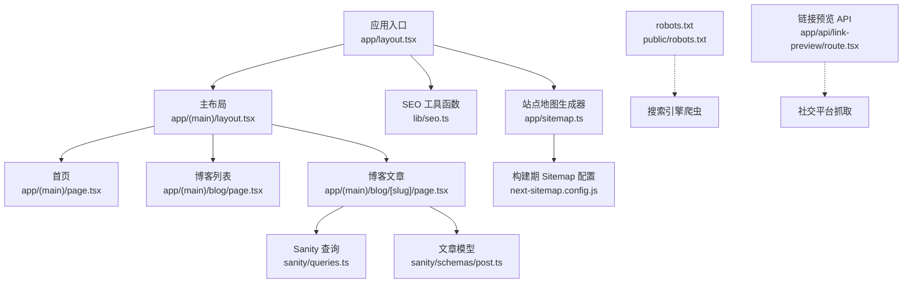
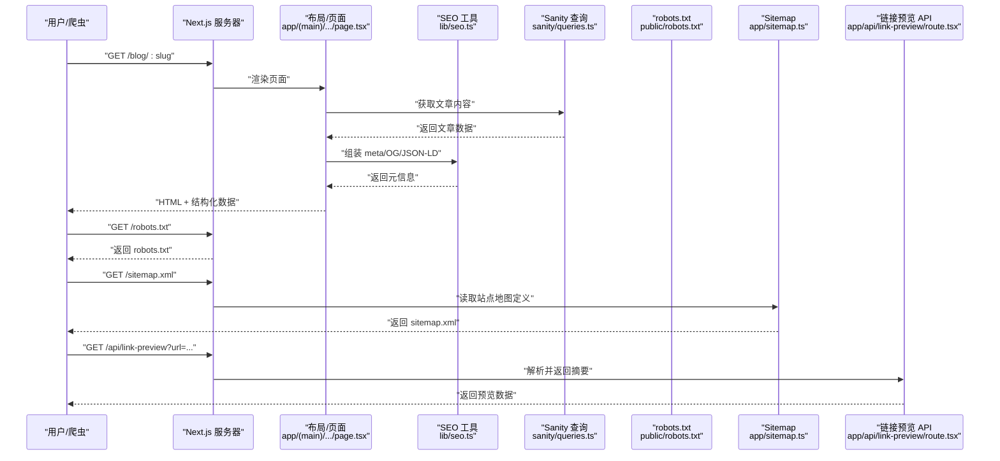
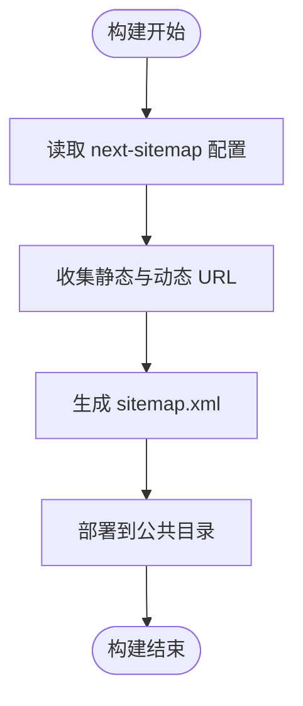
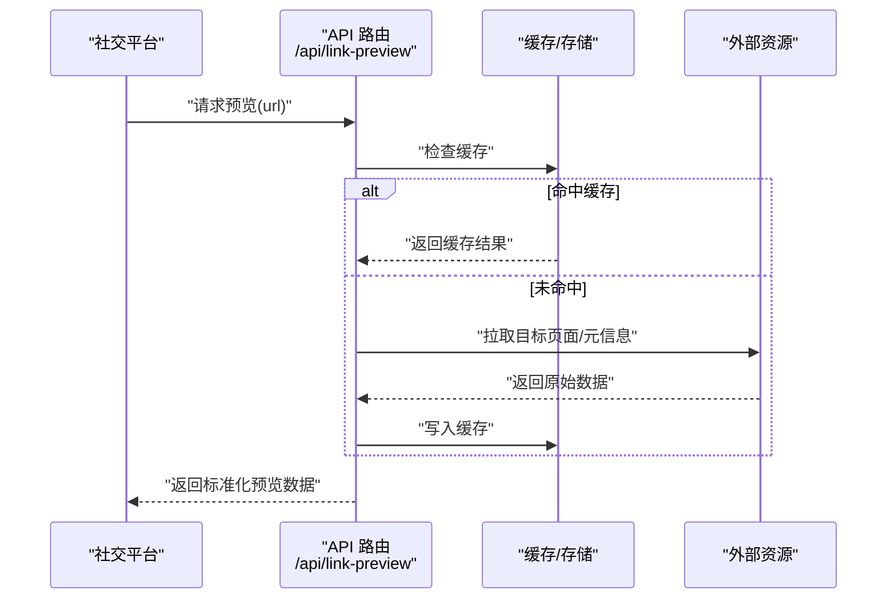
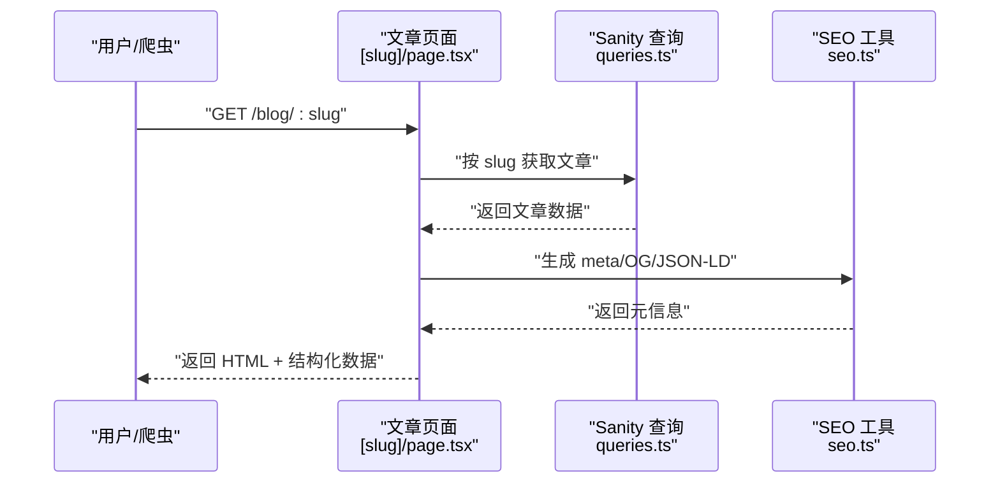
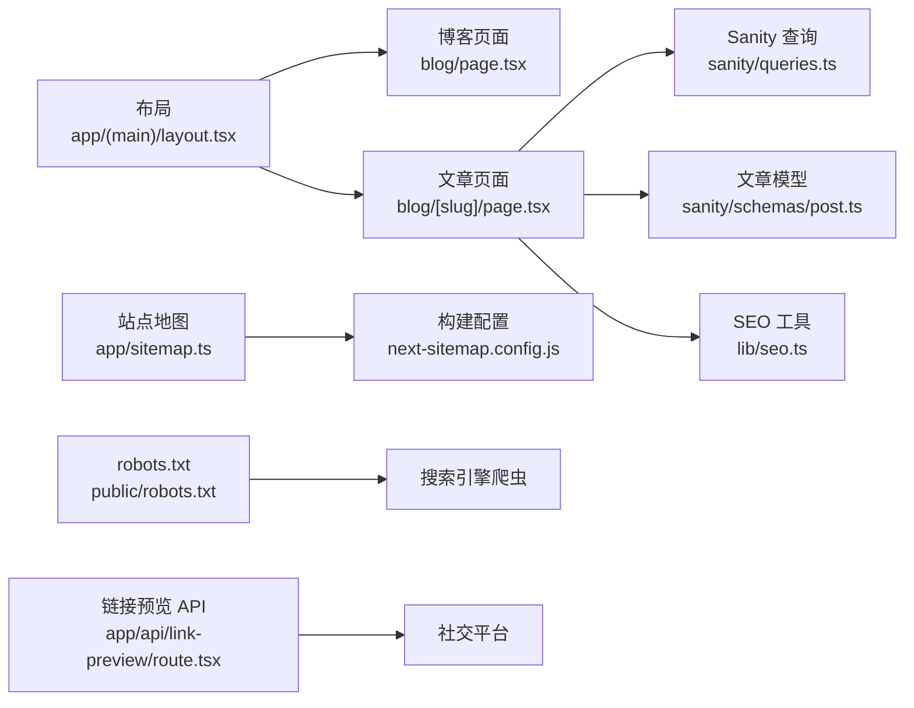

# SEO 优化

<cite>
**本文引用的文件**   
- [app/layout.tsx](file://app/layout.tsx)
- [app/(main)/layout.tsx](file://app/(main)/layout.tsx)
- [app/(main)/page.tsx](file://app/(main)/page.tsx)
- [app/(main)/blog/page.tsx](file://app/(main)/blog/page.tsx)
- [app/(main)/blog/[slug]/page.tsx](file://app/(main)/blog/[slug]/page.tsx)
- [app/sitemap.ts](file://app/sitemap.ts)
- [next-sitemap.config.js](file://next-sitemap.config.js)
- [public/robots.txt](file://public/robots.txt)
- [lib/seo.ts](file://lib/seo.ts)
- [app/api/link-preview/route.tsx](file://app/api/link-preview/route.tsx)
- [sanity/queries.ts](file://sanity/queries.ts)
- [sanity/schemas/post.ts](file://sanity/schemas/post.ts)
</cite>

## 目录
1. [简介](#简介)
2. [项目结构](#项目结构)
3. [核心组件](#核心组件)
4. [架构总览](#架构总览)
5. [详细组件分析](#详细组件分析)
6. [依赖关系分析](#依赖关系分析)
7. [性能考量](#性能考量)
8. [故障排查指南](#故障排查指南)
9. [结论](#结论)
10. [附录](#附录)

## 简介
本文件面向 cali.so 项目的搜索引擎优化（SEO）实践，覆盖动态 meta 标签生成、结构化数据标记（JSON-LD）、Open Graph/Twitter 卡片实现、站点地图自动生成与 robots.txt 配置、SSR/客户端渲染对 SEO 的影响与预渲染策略、社交媒体分享优化、SEO 工具集成与收录优化建议。文档以仓库现有实现为依据，提供可落地的最佳实践与排障指引。

## 项目结构
本项目基于 Next.js App Router，SEO 相关能力分布在以下位置：
- 全局与页面级元信息：根布局与业务布局中设置默认标题、描述、主题色等；具体页面按需覆盖。
- 结构化数据与 OG：在页面或布局中注入 JSON-LD 与 Open Graph/Twitter 元标签。
- 站点地图与 robots：通过 next-sitemap 构建期生成 sitemap.xml，并在 public 下提供 robots.txt。
- 链接预览 API：为社交分享提供统一的摘要抓取接口。
- 内容模型与查询：Sanity 的 post schema 与查询用于生成博客文章页的 SEO 元信息与结构化数据。

图表来源
- [app/layout.tsx](file://app/layout.tsx)
- [app/(main)/layout.tsx](file://app/(main)/layout.tsx)
- [app/(main)/page.tsx](file://app/(main)/page.tsx)
- [app/(main)/blog/page.tsx](file://app/(main)/blog/page.tsx)
- [app/(main)/blog/[slug]/page.tsx](file://app/(main)/blog/[slug]/page.tsx)
- [lib/seo.ts](file://lib/seo.ts)
- [app/sitemap.ts](file://app/sitemap.ts)
- [next-sitemap.config.js](file://next-sitemap.config.js)
- [public/robots.txt](file://public/robots.txt)
- [app/api/link-preview/route.tsx](file://app/api/link-preview/route.tsx)
- [sanity/queries.ts](file://sanity/queries.ts)
- [sanity/schemas/post.ts](file://sanity/schemas/post.ts)

章节来源
- [app/layout.tsx](file://app/layout.tsx)
- [app/(main)/layout.tsx](file://app/(main)/layout.tsx)
- [app/(main)/page.tsx](file://app/(main)/page.tsx)
- [app/(main)/blog/page.tsx](file://app/(main)/blog/page.tsx)
- [app/(main)/blog/[slug]/page.tsx](file://app/(main)/blog/[slug]/page.tsx)
- [lib/seo.ts](file://lib/seo.ts)
- [app/sitemap.ts](file://app/sitemap.ts)
- [next-sitemap.config.js](file://next-sitemap.config.js)
- [public/robots.txt](file://public/robots.txt)
- [app/api/link-preview/route.tsx](file://app/api/link-preview/route.tsx)
- [sanity/queries.ts](file://sanity/queries.ts)
- [sanity/schemas/post.ts](file://sanity/schemas/post.ts)

## 核心组件
- 动态 meta 标签生成
  - 使用布局与页面组合的方式，在根布局设置默认值，在页面覆盖特定页面的 title、description、canonical、open graph 等元信息。
  - 推荐将通用逻辑封装到工具模块，便于复用与测试。
- 结构化数据（JSON-LD）
  - 在页面或布局中注入 JSON-LD，标注 WebPage、Article、BreadcrumbList 等类型，提升搜索结果富摘要质量。
- Open Graph 与 Twitter 卡片
  - 统一设置 og:title、og:description、og:image、og:url、twitter:card 等字段，确保社交分享展示一致。
- 站点地图与 robots
  - 通过 next-sitemap 在构建期生成 sitemap.xml，并在 robots.txt 中允许爬取必要路径。
- 链接预览 API
  - 提供 /api/link-preview 接口，供社交平台抓取时返回标准化摘要与图片，提高分享质量。

章节来源
- [app/layout.tsx](file://app/layout.tsx)
- [app/(main)/layout.tsx](file://app/(main)/layout.tsx)
- [lib/seo.ts](file://lib/seo.ts)
- [app/sitemap.ts](file://app/sitemap.ts)
- [next-sitemap.config.js](file://next-sitemap.config.js)
- [public/robots.txt](file://public/robots.txt)
- [app/api/link-preview/route.tsx](file://app/api/link-preview/route.tsx)

## 架构总览
下图展示了从请求到 SEO 元信息输出与外部平台抓取的端到端流程。

图表来源
- [app/(main)/blog/[slug]/page.tsx](file://app/(main)/blog/[slug]/page.tsx)
- [sanity/queries.ts](file://sanity/queries.ts)
- [lib/seo.ts](file://lib/seo.ts)
- [public/robots.txt](file://public/robots.txt)
- [app/sitemap.ts](file://app/sitemap.ts)
- [app/api/link-preview/route.tsx](file://app/api/link-preview/route.tsx)

## 详细组件分析

### 动态 Meta 标签与 OG 协议
- 职责
  - 在根布局设置默认 title、description、theme-color、favicon 等。
  - 在页面层根据路由与内容覆盖特定元信息，包括 canonical、open graph、twitter card。
- 关键实现要点
  - 使用布局与页面组合模式，避免重复代码。
  - 将通用拼接逻辑抽取到工具模块，保证一致性。
  - 针对文章页补充 author、datePublished、image 等字段。
- 建议模板清单
  - 基础：title、description、canonical、lang、theme-color
  - Open Graph：og:title、og:description、og:image、og:url、og:type、og:site_name
  - Twitter：twitter:card、twitter:title、twitter:description、twitter:image
  - 其他：author、robots、alternate 语言版本（如适用）

章节来源
- [app/layout.tsx](file://app/layout.tsx)
- [app/(main)/layout.tsx](file://app/(main)/layout.tsx)
- [app/(main)/page.tsx](file://app/(main)/page.tsx)
- [app/(main)/blog/page.tsx](file://app/(main)/blog/page.tsx)
- [app/(main)/blog/[slug]/page.tsx](file://app/(main)/blog/[slug]/page.tsx)
- [lib/seo.ts](file://lib/seo.ts)

### 结构化数据（JSON-LD）
- 目标
  - 向搜索引擎明确页面类型与关键属性，提升富摘要与知识图谱匹配度。
- 常见类型
  - WebPage、Article、BreadcrumbList、Organization、Person、FAQPage（视页面而定）。
- 实现建议
  - 在页面渲染阶段注入 JSON-LD，确保首屏即可被爬虫读取。
  - 使用工具函数统一生成，减少样板代码。
  - 校验必填字段与数据类型，避免无效标记。

章节来源
- [app/(main)/blog/[slug]/page.tsx](file://app/(main)/blog/[slug]/page.tsx)
- [lib/seo.ts](file://lib/seo.ts)

### 站点地图与 robots.txt
- 站点地图
  - 通过 app/sitemap.ts 定义静态与动态 URL 集合，结合 next-sitemap 在构建期生成 sitemap.xml。
  - 建议包含：首页、博客列表、文章详情、项目页、关于页等。
- robots.txt
  - 在 public/robots.txt 中声明允许爬取的路径与规则，必要时排除管理后台或敏感路径。
- 流程图

图表来源
- [app/sitemap.ts](file://app/sitemap.ts)
- [next-sitemap.config.js](file://next-sitemap.config.js)

章节来源
- [app/sitemap.ts](file://app/sitemap.ts)
- [next-sitemap.config.js](file://next-sitemap.config.js)
- [public/robots.txt](file://public/robots.txt)

### 链接预览 API（社交分享优化）
- 目的
  - 为社交平台抓取提供稳定的摘要、标题、图片与描述，提升分享展示质量。
- 设计要点
  - 接收 url 参数，解析域名与路径，返回标准化的预览数据。
  - 缓存热门链接结果，降低后端压力。
  - 限制输入长度与非法字符，防止滥用。
- 时序图

图表来源
- [app/api/link-preview/route.tsx](file://app/api/link-preview/route.tsx)

章节来源
- [app/api/link-preview/route.tsx](file://app/api/link-preview/route.tsx)

### 博客文章页 SEO 工作流
- 步骤
  - 根据 slug 查询 Sanity 获取文章数据。
  - 组装页面元信息（title、description、canonical、OG、Twitter）。
  - 注入 JSON-LD（Article、BreadcrumbList）。
  - 渲染正文与目录、评论等交互组件。
- 序列图

图表来源
- [app/(main)/blog/[slug]/page.tsx](file://app/(main)/blog/[slug]/page.tsx)
- [sanity/queries.ts](file://sanity/queries.ts)
- [lib/seo.ts](file://lib/seo.ts)

章节来源
- [app/(main)/blog/[slug]/page.tsx](file://app/(main)/blog/[slug]/page.tsx)
- [sanity/queries.ts](file://sanity/queries.ts)
- [sanity/schemas/post.ts](file://sanity/schemas/post.ts)
- [lib/seo.ts](file://lib/seo.ts)

### SSR、客户端渲染与预渲染策略
- SSR 对 SEO 的影响
  - 服务端渲染可在首次响应中包含完整 HTML 与元信息，利于爬虫抓取与首屏加载。
- 客户端渲染的考虑
  - 若使用客户端渲染，需确保关键 SEO 元信息在服务端可用或通过预渲染注入。
- 预渲染策略
  - 静态生成（SSG）适合内容稳定、更新频率低的页面（如文章、项目页）。
  - 增量静态再生（ISR）可在保持性能的同时支持内容更新。
  - 动态路由预渲染需配合构建期或运行时生成策略。

章节来源
- [app/(main)/blog/[slug]/page.tsx](file://app/(main)/blog/[slug]/page.tsx)
- [app/(main)/blog/page.tsx](file://app/(main)/blog/page.tsx)

## 依赖关系分析
- 组件耦合
  - 页面与布局强耦合于 SEO 工具函数，便于集中维护。
  - 文章页依赖 Sanity 查询与模型定义，确保元信息与内容一致。
- 外部依赖
  - next-sitemap 负责站点地图构建。
  - 社交平台抓取依赖 robots.txt 与 link-preview API。
- 潜在循环依赖
  - 当前结构未见明显循环依赖；建议保持 SEO 工具无副作用且纯函数化。

图表来源
- [app/(main)/layout.tsx](file://app/(main)/layout.tsx)
- [app/(main)/blog/page.tsx](file://app/(main)/blog/page.tsx)
- [app/(main)/blog/[slug]/page.tsx](file://app/(main)/blog/[slug]/page.tsx)
- [sanity/queries.ts](file://sanity/queries.ts)
- [sanity/schemas/post.ts](file://sanity/schemas/post.ts)
- [lib/seo.ts](file://lib/seo.ts)
- [app/sitemap.ts](file://app/sitemap.ts)
- [next-sitemap.config.js](file://next-sitemap.config.js)
- [public/robots.txt](file://public/robots.txt)
- [app/api/link-preview/route.tsx](file://app/api/link-preview/route.tsx)

章节来源
- [app/(main)/layout.tsx](file://app/(main)/layout.tsx)
- [app/(main)/blog/page.tsx](file://app/(main)/blog/page.tsx)
- [app/(main)/blog/[slug]/page.tsx](file://app/(main)/blog/[slug]/page.tsx)
- [sanity/queries.ts](file://sanity/queries.ts)
- [sanity/schemas/post.ts](file://sanity/schemas/post.ts)
- [lib/seo.ts](file://lib/seo.ts)
- [app/sitemap.ts](file://app/sitemap.ts)
- [next-sitemap.config.js](file://next-sitemap.config.js)
- [public/robots.txt](file://public/robots.txt)
- [app/api/link-preview/route.tsx](file://app/api/link-preview/route.tsx)

## 性能考量
- 首屏与可抓取性
  - 优先在服务端渲染关键 SEO 元信息，减少客户端重绘导致的延迟。
- 缓存策略
  - 对链接预览 API 启用缓存，降低外部请求开销。
  - 对站点地图与 robots.txt 使用 CDN 缓存。
- 资源体积
  - 控制 OG 图片大小与尺寸，避免过大影响分享加载速度。
- 构建期优化
  - 合理配置 next-sitemap，仅生成必要 URL，减少构建时间。

## 故障排查指南
- 常见问题
  - 元信息缺失或不正确：检查布局与页面是否覆盖默认值；确认工具函数返回值是否正确。
  - OG 图片无法显示：确认图片 URL 可公开访问且格式受支持；检查 CORS 与防盗链设置。
  - 站点地图未生效：确认构建产物包含 sitemap.xml；检查 robots.txt 是否允许抓取。
  - 社交平台不抓取：验证 /api/link-preview 返回状态码与字段；检查域名白名单与速率限制。
- 定位步骤
  - 使用浏览器开发者工具查看网络请求与响应头。
  - 使用搜索引擎提供的“检查 URL”功能验证抓取情况。
  - 使用社交平台调试工具（如 Facebook Sharing Debugger、Twitter Card Validator）验证分享效果。

章节来源
- [app/api/link-preview/route.tsx](file://app/api/link-preview/route.tsx)
- [public/robots.txt](file://public/robots.txt)
- [app/sitemap.ts](file://app/sitemap.ts)
- [lib/seo.ts](file://lib/seo.ts)

## 结论
通过对动态 meta 标签、结构化数据、OG/Twitter 卡片、站点地图与 robots.txt 的系统化实现，并结合 SSR/预渲染策略与链接预览 API，cali.so 能够在搜索引擎与社交平台获得更高质量的展示与收录。建议在持续迭代中完善元信息模板、监控抓取与性能指标，并定期审计 SEO 配置以确保长期稳定。

## 附录
- SEO 元数据模板清单（建议）
  - 基础：title、description、canonical、lang、theme-color、author
  - Open Graph：og:title、og:description、og:image、og:url、og:type、og:site_name
  - Twitter：twitter:card、twitter:title、twitter:description、twitter:image
  - 结构化数据：WebPage、Article、BreadcrumbList、Organization/Person（视场景）
- 收录优化建议
  - 提交 sitemap 至搜索引擎控制台。
  - 使用 robots.txt 控制爬取范围，避免泄露敏感路径。
  - 保持 URL 语义化与层级清晰，合理使用内链。
  - 定期巡检外链与死链，提升用户体验与抓取效率。