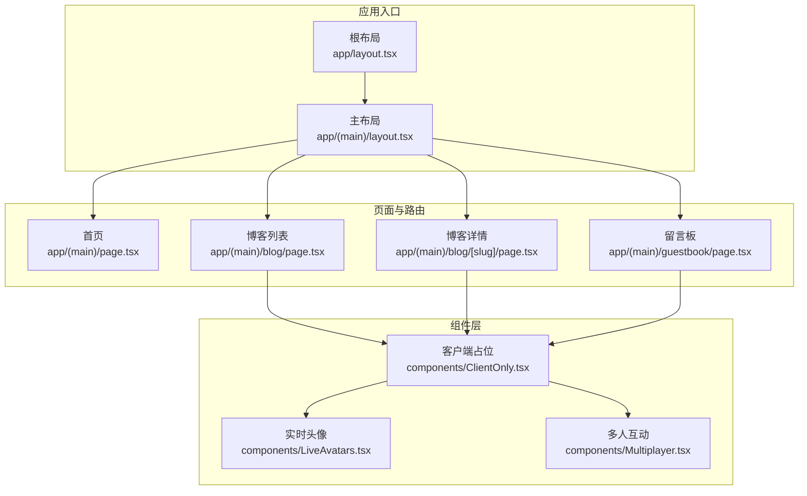
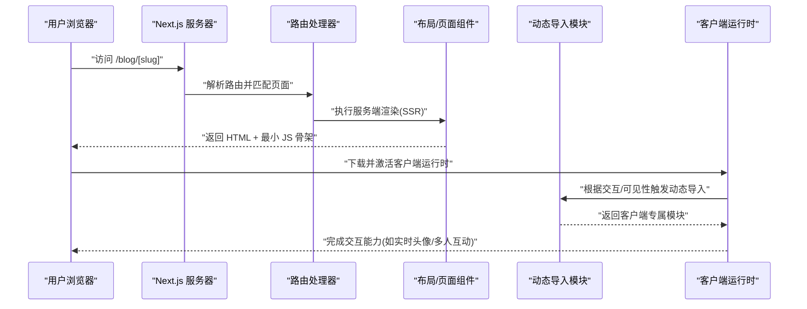
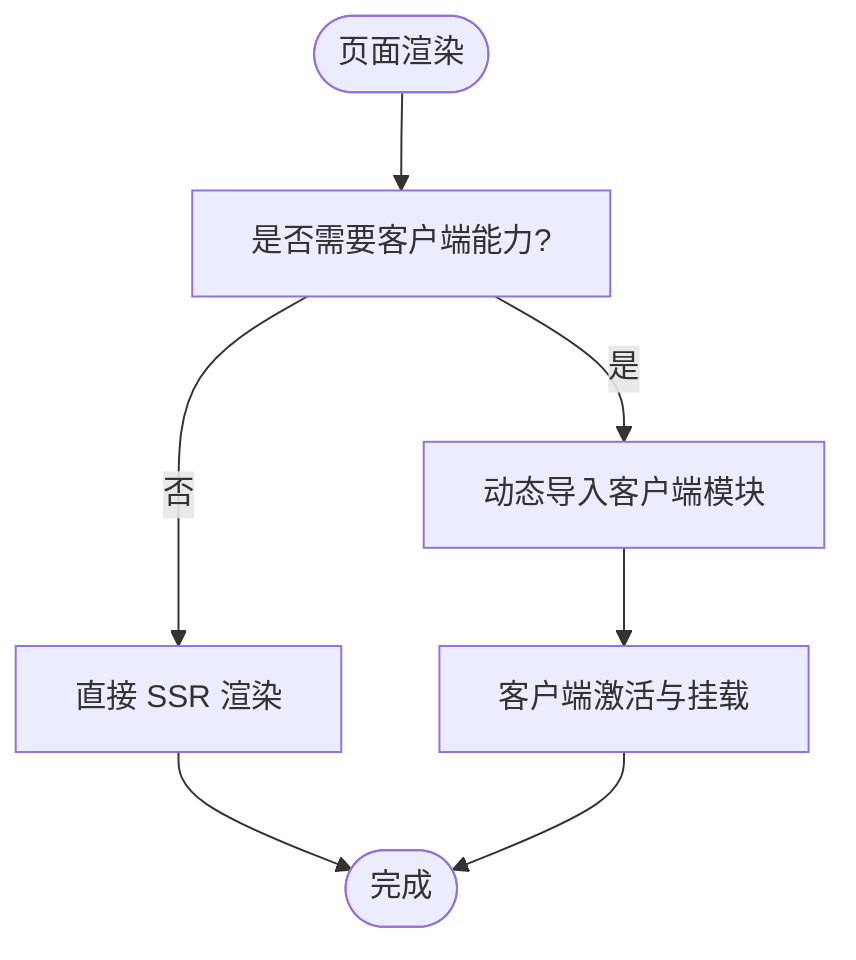
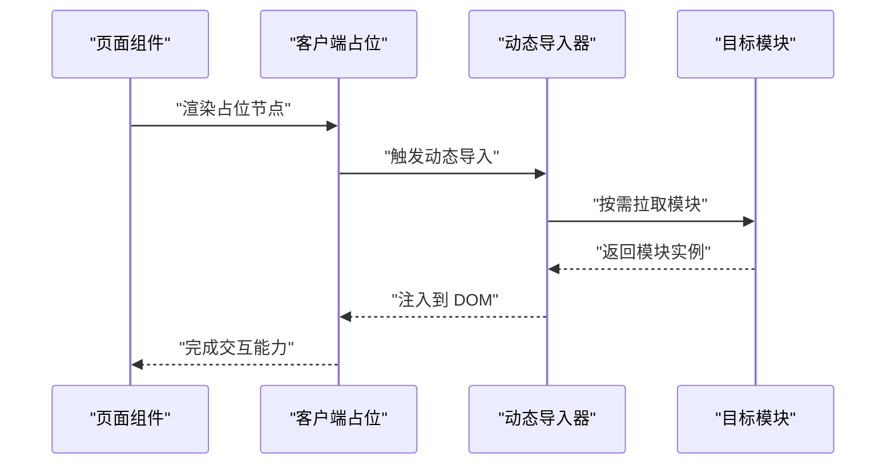
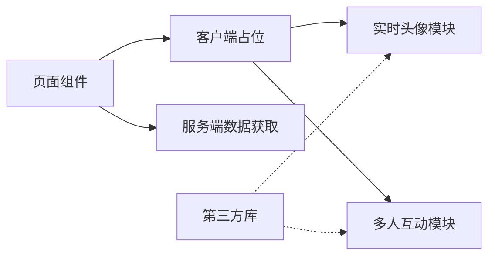

# 代码分割

<cite>
**本文引用的文件**
- [next.config.mjs](file://next.config.mjs)
- [package.json](file://package.json)
- [app/layout.tsx](file://app/layout.tsx)
- [app/(main)/layout.tsx](file://app/(main)/layout.tsx)
- [app/(main)/page.tsx](file://app/(main)/page.tsx)
- [app/(main)/blog/page.tsx](file://app/(main)/blog/page.tsx)
- [app/(main)/blog/[slug]/page.tsx](file://app/(main)/blog/[slug]/page.tsx)
- [app/(main)/blog/BlogPostPage.tsx](file://app/(main)/blog/BlogPostPage.tsx)
- [app/(main)/blog/BlogPosts.tsx](file://app/(main)/blog/BlogPosts.tsx)
- [app/(main)/guestbook/page.tsx](file://app/(main)/guestbook/page.tsx)
- [components/ClientOnly.tsx](file://components/ClientOnly.tsx)
- [components/LiveAvatars.tsx](file://components/LiveAvatars.tsx)
- [components/Multiplayer.tsx](file://components/Multiplayer.tsx)
- [middleware.ts](file://middleware.ts)
</cite>

## 目录
1. [简介](#简介)
2. [项目结构](#项目结构)
3. [核心组件](#核心组件)
4. [架构总览](#架构总览)
5. [详细组件分析](#详细组件分析)
6. [依赖关系分析](#依赖关系分析)
7. [性能考量](#性能考量)
8. [故障排查指南](#故障排查指南)
9. [结论](#结论)
10. [附录](#附录)

## 简介
本文件面向 cali.so 项目的代码分割优化，围绕 Next.js 的自动代码分割机制、动态导入与按需加载策略展开，重点说明：
- 客户端组件与服务端组件的边界与分割
- 第三方库的延迟加载与条件加载模式
- 路由级代码分割与页面级懒加载
- Bundle 分析、重复依赖消除与 Tree Shaking 优化
- 构建优化配置、开发调试与生产部署最佳实践

## 项目结构
本项目采用 App Router 组织页面与布局，结合可复用组件与工具库。关键目录与职责：
- app: 基于路由的文件系统约定，包含页面、布局、API 路由与静态资源入口
- components: 通用 UI 与业务组件，部分组件仅用于客户端交互
- lib/config/db/sanity 等: 服务端或全栈共享逻辑与数据层
- public: 静态资源（图标、清单、PWA 相关）

图表来源
- [app/layout.tsx](file://app/layout.tsx)
- [app/(main)/layout.tsx](file://app/(main)/layout.tsx)
- [app/(main)/page.tsx](file://app/(main)/page.tsx)
- [app/(main)/blog/page.tsx](file://app/(main)/blog/page.tsx)
- [app/(main)/blog/[slug]/page.tsx](file://app/(main)/blog/[slug]/page.tsx)
- [app/(main)/guestbook/page.tsx](file://app/(main)/guestbook/page.tsx)
- [components/ClientOnly.tsx](file://components/ClientOnly.tsx)
- [components/LiveAvatars.tsx](file://components/LiveAvatars.tsx)
- [components/Multiplayer.tsx](file://components/Multiplayer.tsx)

章节来源
- [app/layout.tsx](file://app/layout.tsx)
- [app/(main)/layout.tsx](file://app/(main)/layout.tsx)
- [app/(main)/page.tsx](file://app/(main)/page.tsx)
- [app/(main)/blog/page.tsx](file://app/(main)/blog/page.tsx)
- [app/(main)/blog/[slug]/page.tsx](file://app/(main)/blog/[slug]/page.tsx)
- [app/(main)/guestbook/page.tsx](file://app/(main)/guestbook/page.tsx)
- [components/ClientOnly.tsx](file://components/ClientOnly.tsx)
- [components/LiveAvatars.tsx](file://components/LiveAvatars.tsx)
- [components/Multiplayer.tsx](file://components/Multiplayer.tsx)

## 核心组件
- 客户端隔离与按需加载
  - 使用“客户端占位”组件在需要时再引入纯客户端模块，避免将浏览器运行时依赖注入到服务端渲染产物中，从而减小首屏包体积并提升 TTFB。
  - 典型用法：在页面或布局中通过动态导入方式加载仅客户端运行的功能（如实时头像、多人互动）。
- 路由级拆分
  - 每个路由页面默认被拆分为独立 chunk；详情页、管理后台、游戏页等重功能可按需加载，减少首屏负担。
- 第三方库延迟加载
  - 对体积大且非首屏必需的库（如富文本编辑器、地图、统计 SDK）建议采用动态导入与条件加载，仅在用户交互或可见时触发加载。

章节来源
- [components/ClientOnly.tsx](file://components/ClientOnly.tsx)
- [components/LiveAvatars.tsx](file://components/LiveAvatars.tsx)
- [components/Multiplayer.tsx](file://components/Multiplayer.tsx)
- [app/(main)/blog/page.tsx](file://app/(main)/blog/page.tsx)
- [app/(main)/blog/[slug]/page.tsx](file://app/(main)/blog/[slug]/page.tsx)
- [app/(main)/guestbook/page.tsx](file://app/(main)/guestbook/page.tsx)

## 架构总览
下图展示从请求到页面渲染的代码分割与加载流程，体现服务端渲染与客户端激活的边界，以及动态导入触发的按需加载时机。

图表来源
- [app/(main)/blog/[slug]/page.tsx](file://app/(main)/blog/[slug]/page.tsx)
- [components/ClientOnly.tsx](file://components/ClientOnly.tsx)
- [components/LiveAvatars.tsx](file://components/LiveAvatars.tsx)
- [components/Multiplayer.tsx](file://components/Multiplayer.tsx)

## 详细组件分析

### 客户端组件与服务端组件的分割
- 原则
  - 服务端组件负责数据获取、HTML 生成与 SEO 友好内容；客户端组件负责事件处理、状态更新与浏览器 API 调用。
  - 通过“客户端占位”组件包裹纯客户端模块，确保其不会进入 SSR 产物。
- 实现要点
  - 在页面或布局中引入“客户端占位”，再由其内部动态导入客户端模块。
  - 对于大型交互模块（如实时头像、多人互动），建议在用户滚动到可视区域或点击后再加载。

图表来源
- [components/ClientOnly.tsx](file://components/ClientOnly.tsx)
- [components/LiveAvatars.tsx](file://components/LiveAvatars.tsx)
- [components/Multiplayer.tsx](file://components/Multiplayer.tsx)

章节来源
- [components/ClientOnly.tsx](file://components/ClientOnly.tsx)
- [components/LiveAvatars.tsx](file://components/LiveAvatars.tsx)
- [components/Multiplayer.tsx](file://components/Multiplayer.tsx)

### 动态导入与按需加载策略
- 路由级懒加载
  - 博客列表与详情页各自独立打包，未访问的路由不会被预取。
- 组件级懒加载
  - 将重型组件（如图表、编辑器、广告）放入动态导入，配合“客户端占位”在必要时加载。
- 条件加载模式
  - 基于环境变量、用户权限或设备类型进行条件加载，避免为所有用户下发无用代码。

图表来源
- [components/ClientOnly.tsx](file://components/ClientOnly.tsx)
- [app/(main)/blog/page.tsx](file://app/(main)/blog/page.tsx)
- [app/(main)/blog/[slug]/page.tsx](file://app/(main)/blog/[slug]/page.tsx)

章节来源
- [app/(main)/blog/page.tsx](file://app/(main)/blog/page.tsx)
- [app/(main)/blog/[slug]/page.tsx](file://app/(main)/blog/[slug]/page.tsx)
- [components/ClientOnly.tsx](file://components/ClientOnly.tsx)

### 第三方库的延迟加载与条件加载
- 推荐做法
  - 将体积较大的第三方库（如富文本、地图、统计 SDK）放入动态导入，并在用户交互或可见时加载。
  - 使用条件判断（如是否登录、是否管理员、是否移动端）控制加载路径，进一步缩小包体。
- 示例思路
  - 在“客户端占位”中根据条件选择不同模块路径，或在页面内根据用户行为触发加载。

章节来源
- [components/ClientOnly.tsx](file://components/ClientOnly.tsx)
- [app/(main)/guestbook/page.tsx](file://app/(main)/guestbook/page.tsx)

### 路由级代码分割与页面级懒加载
- 路由即分包
  - 每个路由页面默认生成独立 chunk，未访问路由不会进入首屏。
- 子路由与嵌套路由
  - 详情页、管理后台等复杂页面保持独立，便于缓存与增量更新。
- 预取策略
  - 可在导航处按需预取相邻路由，平衡首屏与后续体验。

章节来源
- [app/(main)/blog/page.tsx](file://app/(main)/blog/page.tsx)
- [app/(main)/blog/[slug]/page.tsx](file://app/(main)/blog/[slug]/page.tsx)
- [app/(main)/page.tsx](file://app/(main)/page.tsx)

## 依赖关系分析
- 组件耦合与内聚
  - “客户端占位”作为统一入口，降低页面与具体客户端模块的耦合度，提高内聚性与可测试性。
- 外部依赖
  - 第三方库尽量延迟加载，减少初始包体；公共工具函数保持无副作用，利于 Tree Shaking。
- 潜在循环依赖
  - 避免在客户端模块中反向引用服务端数据获取逻辑，防止不必要的依赖注入。

图表来源
- [components/ClientOnly.tsx](file://components/ClientOnly.tsx)
- [components/LiveAvatars.tsx](file://components/LiveAvatars.tsx)
- [components/Multiplayer.tsx](file://components/Multiplayer.tsx)

章节来源
- [components/ClientOnly.tsx](file://components/ClientOnly.tsx)
- [components/LiveAvatars.tsx](file://components/LiveAvatars.tsx)
- [components/Multiplayer.tsx](file://components/Multiplayer.tsx)

## 性能考量
- Bundle 分析与可视化
  - 使用构建分析工具查看各路由与组件的包体大小，定位热点模块与重复依赖。
- 重复依赖消除
  - 合并相同库的不同版本；将高频使用的工具函数提取为共享模块，避免多份拷贝。
- Tree Shaking 优化
  - 优先使用 ES 模块导出；避免在顶层引入副作用；将可选功能放入动态导入。
- 网络与缓存
  - 利用浏览器缓存与 CDN 分发静态资源；合理设置长缓存与版本号。
- 监控与指标
  - 集成前端性能监控（如 Web Vitals），关注首次输入延迟、最大内容绘制等指标，持续回归验证。

[本节为通用指导，不直接分析具体文件]

## 故障排查指南
- 常见问题
  - 客户端模块在服务端报错：确认该模块是否通过“客户端占位”或动态导入隔离。
  - 首屏过大：检查是否有未拆分的重型库或全局样式/脚本被提前加载。
  - 重复依赖：通过 bundle 分析定位同一库的多版本，统一版本或提取共享模块。
- 调试技巧
  - 本地构建后运行分析命令，对比不同分支的包体差异。
  - 在生产环境开启压缩与缓存，复现线上问题。
- 中间件影响
  - 中间件在服务端执行，避免在其中引入浏览器 API 或重型客户端库。

章节来源
- [middleware.ts](file://middleware.ts)
- [components/ClientOnly.tsx](file://components/ClientOnly.tsx)

## 结论
通过合理的代码分割与按需加载策略，可以显著降低首屏体积、缩短 TTFB 并提升整体用户体验。建议以“路由级拆分 + 组件级懒加载 + 第三方库延迟加载”为核心手段，结合 Bundle 分析与性能监控持续优化。

[本节为总结性内容，不直接分析具体文件]

## 附录

### 构建优化配置建议
- 启用压缩与并行构建
  - 在构建配置中开启 JavaScript/CSS 压缩与并行任务，加速构建过程。
- 输出分析
  - 启用构建分析插件，生成可视化报告，辅助定位大包体与重复依赖。
- 环境变量与特性开关
  - 通过环境变量控制功能开关，减少不必要代码进入生产包。

章节来源
- [next.config.mjs](file://next.config.mjs)
- [package.json](file://package.json)

### 开发环境与生产环境最佳实践
- 开发环境
  - 使用快速热重载与增量编译；关闭非必要分析插件以提升开发体验。
- 生产环境
  - 开启缓存与 CDN；校验关键路由的首屏指标；定期回归分析包体变化。
- 部署
  - 使用平台原生构建缓存；对静态资源启用长缓存与版本号。

章节来源
- [next.config.mjs](file://next.config.mjs)
- [package.json](file://package.json)