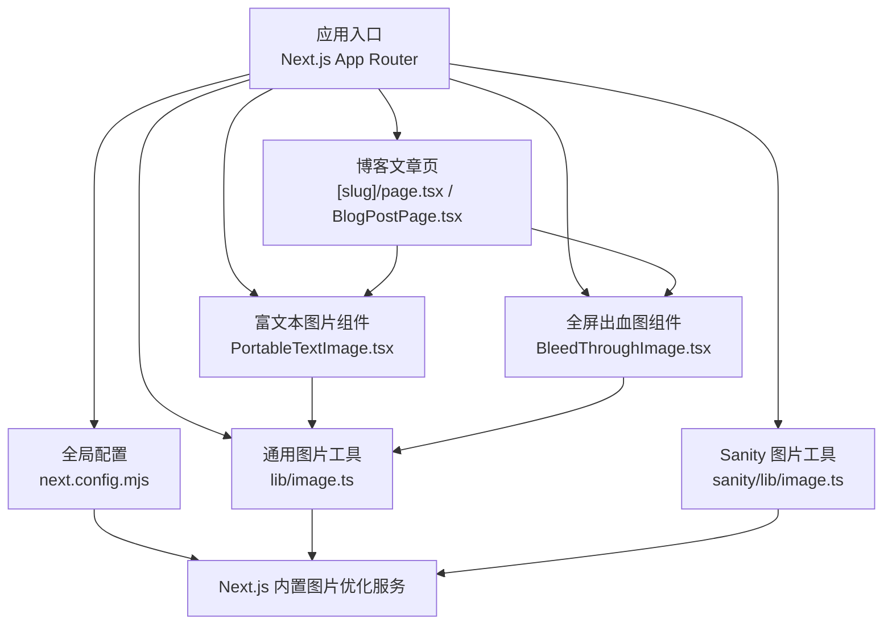
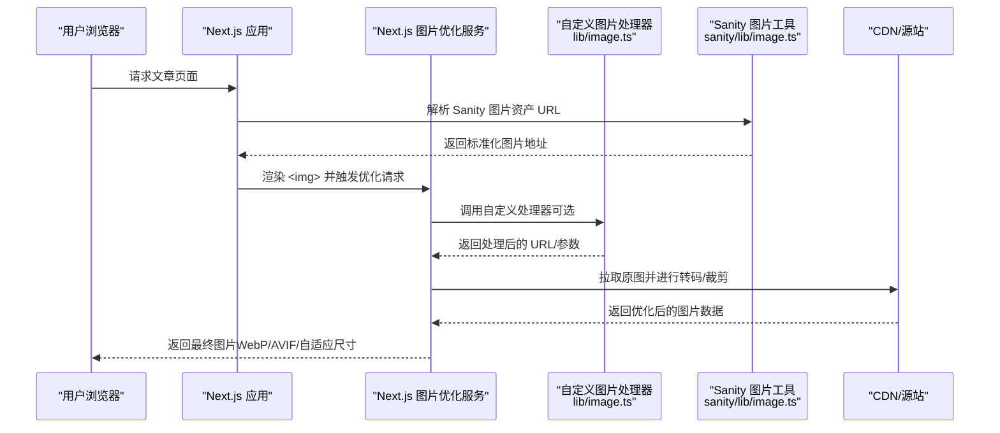
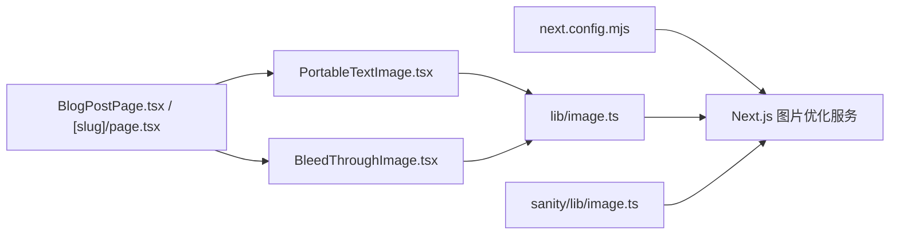

# 图片优化

<cite>
**本文引用的文件**   
- [next.config.mjs](file://next.config.mjs)
- [lib/image.ts](file://lib/image.ts)
- [sanity/lib/image.ts](file://sanity/lib/image.ts)
- [components/portable-text/PortableTextImage.tsx](file://components/portable-text/PortableTextImage.tsx)
- [components/BleedThroughImage.tsx](file://components/BleedThroughImage.tsx)
- [app/(main)/blog/[slug]/page.tsx](file://app/(main)/blog/[slug]/page.tsx)
- [app/(main)/blog/BlogPostPage.tsx](file://app/(main)/blog/BlogPostPage.tsx)
- [package.json](file://package.json)
</cite>

## 目录
1. [简介](#简介)
2. [项目结构](#项目结构)
3. [核心组件](#核心组件)
4. [架构总览](#架构总览)
5. [详细组件分析](#详细组件分析)
6. [依赖关系分析](#依赖关系分析)
7. [性能考量](#性能考量)
8. [故障排除指南](#故障排除指南)
9. [结论](#结论)
10. [附录](#附录)

## 简介
本文件面向 cali.so 项目的图片优化实践，围绕 Next.js Image Optimization 的配置与使用展开，覆盖响应式图片、懒加载、格式转换与尺寸优化；并深入讲解自定义图片处理器、CDN 集成与缓存策略。文档同时包含 WebP/AVIF 支持、渐进式加载、占位符图片与错误处理的具体方案，以及与 Sanity CMS 的图片集成最佳实践。文末提供配置示例路径、性能监控建议与常见问题排查方法，帮助读者快速落地并持续优化图片体验。

## 项目结构
本项目采用 Next.js App Router，图片相关能力主要分布在以下位置：
- 全局图片优化配置：next.config.mjs
- 通用图片工具与封装：lib/image.ts
- Sanity 图片工具：sanity/lib/image.ts
- 富文本图片渲染：components/portable-text/PortableTextImage.tsx
- 特殊布局图片组件：components/BleedThroughImage.tsx
- 博客文章页面（含图片展示）：app/(main)/blog/[slug]/page.tsx 与 app/(main)/blog/BlogPostPage.tsx
- 依赖声明：package.json

图表来源
- [next.config.mjs](file://next.config.mjs)
- [lib/image.ts](file://lib/image.ts)
- [sanity/lib/image.ts](file://sanity/lib/image.ts)
- [components/portable-text/PortableTextImage.tsx](file://components/portable-text/PortableTextImage.tsx)
- [components/BleedThroughImage.tsx](file://components/BleedThroughImage.tsx)
- [app/(main)/blog/[slug]/page.tsx](file://app/(main)/blog/[slug]/page.tsx)
- [app/(main)/blog/BlogPostPage.tsx](file://app/(main)/blog/BlogPostPage.tsx)

章节来源
- [next.config.mjs](file://next.config.mjs)
- [lib/image.ts](file://lib/image.ts)
- [sanity/lib/image.ts](file://sanity/lib/image.ts)
- [components/portable-text/PortableTextImage.tsx](file://components/portable-text/PortableTextImage.tsx)
- [components/BleedThroughImage.tsx](file://components/BleedThroughImage.tsx)
- [app/(main)/blog/[slug]/page.tsx](file://app/(main)/blog/[slug]/page.tsx)
- [app/(main)/blog/BlogPostPage.tsx](file://app/(main)/blog/BlogPostPage.tsx)

## 核心组件
- 全局图片优化配置（next.config.mjs）
  - 负责启用/调整 Next.js 内置图片优化能力，包括远程域名白名单、自定义图片处理器、格式与质量等参数。
- 通用图片工具（lib/image.ts）
  - 封装常用图片渲染逻辑，如默认尺寸、占位符、加载策略、错误回退等，供业务组件复用。
- Sanity 图片工具（sanity/lib/image.ts）
  - 将 Sanity 的 asset URL 转换为可被 Next.js 图片优化服务处理的地址，支持尺寸裁剪、格式选择与 CDN 参数。
- 富文本图片组件（PortableTextImage.tsx）
  - 在博客内容中渲染图片，结合 Sanit y 图片工具实现响应式与高质量显示。
- 全屏出血图组件（BleedThroughImage.tsx）
  - 用于全宽或溢出边距的特殊图片场景，通常配合容器断点与对象适配策略。
- 博客文章页（BlogPostPage.tsx 与 [slug]/page.tsx）
  - 聚合文章内容与图片资源，驱动图片组件进行渲染与优化。

章节来源
- [next.config.mjs](file://next.config.mjs)
- [lib/image.ts](file://lib/image.ts)
- [sanity/lib/image.ts](file://sanity/lib/image.ts)
- [components/portable-text/PortableTextImage.tsx](file://components/portable-text/PortableTextImage.tsx)
- [components/BleedThroughImage.tsx](file://components/BleedThroughImage.tsx)
- [app/(main)/blog/BlogPostPage.tsx](file://app/(main)/blog/BlogPostPage.tsx)
- [app/(main)/blog/[slug]/page.tsx](file://app/(main)/blog/[slug]/page.tsx)

## 架构总览
下图展示了从页面到图片资源的端到端流程，包括 Next.js 图片优化服务、自定义处理器与 Sanity 源站之间的交互。

图表来源
- [next.config.mjs](file://next.config.mjs)
- [lib/image.ts](file://lib/image.ts)
- [sanity/lib/image.ts](file://sanity/lib/image.ts)
- [components/portable-text/PortableTextImage.tsx](file://components/portable-text/PortableTextImage.tsx)
- [components/BleedThroughImage.tsx](file://components/BleedThroughImage.tsx)

## 详细组件分析

### 全局图片优化配置（next.config.mjs）
- 作用
  - 定义允许优化的远程图片域名，确保来自 Sanity 或其他 CDN 的图片能被安全地处理。
  - 配置自定义图片处理器，统一图片处理逻辑（如尺寸、质量、格式）。
  - 控制默认格式与质量，平衡画质与体积。
- 关键要点
  - 远程域名白名单：为 Sanity 图片域名添加信任列表，避免跨域限制。
  - 自定义处理器：集中处理图片参数拼接、格式选择与 CDN 参数注入。
  - 默认格式与质量：优先现代格式（WebP/AVIF），设置合理质量阈值。
- 常见配置项说明
  - images.remotePatterns：指定允许的远程图片模式，支持协议、主机名、端口与路径匹配。
  - images.domains：兼容旧版配置的域名白名单方式。
  - images.loader：指向自定义图片处理器函数。
  - images.formats：指定支持的输出格式（如 ["image/webp", "image/avif"]）。
  - images.quality：默认图片质量（百分比）。
  - images.minimumCacheTimeSeconds：服务端缓存时间（秒）。
  - images.deviceSizes / images.imageSizes：生成不同设备尺寸的清单。
- 参考路径
  - [next.config.mjs](file://next.config.mjs)

章节来源
- [next.config.mjs](file://next.config.mjs)

### 通用图片工具（lib/image.ts）
- 作用
  - 封装图片渲染的通用逻辑，包括默认宽高、占位符、加载策略、错误回退等。
  - 提供统一的 API，便于在不同页面与组件中复用。
- 关键特性
  - 响应式尺寸：根据容器宽度与 DPR 自动计算 srcset。
  - 懒加载：默认开启，减少首屏压力。
  - 占位符：模糊占位或骨架屏，提升感知性能。
  - 错误处理：失败时降级到原始图片或占位图。
  - 渐进式加载：通过低质量占位逐步替换为高清图。
- 典型用法
  - 在业务组件中引入该工具，传入图片 URL、期望尺寸与样式，即可得到优化后的  标签。
- 参考路径
  - [lib/image.ts](file://lib/image.ts)

章节来源
- [lib/image.ts](file://lib/image.ts)

### Sanity 图片工具（sanity/lib/image.ts）
- 作用
  - 将 Sanity 的 asset URL 转换为 Next.js 图片优化服务可识别的地址，并附加尺寸、裁剪、格式等参数。
- 关键特性
  - 自动推断宽高与 DPR，生成合适的 srcset。
  - 支持多种输出格式（WebP/AVIF），由浏览器协商决定。
  - 与 Next.js 图片优化服务无缝对接，享受 CDN 加速与缓存。
- 典型用法
  - 在富文本或页面组件中，先通过该工具生成图片 URL，再交给通用图片工具渲染。
- 参考路径
  - [sanity/lib/image.ts](file://sanity/lib/image.ts)

章节来源
- [sanity/lib/image.ts](file://sanity/lib/image.ts)

### 富文本图片组件（PortableTextImage.tsx）
- 作用
  - 在博客正文中渲染图片，结合 Sanity 图片工具与通用图片工具，实现响应式与高质量显示。
- 关键特性
  - 读取富文本节点中的图片信息（URL、宽高、alt 等）。
  - 自动应用响应式与懒加载策略。
  - 支持占位符与错误回退。
- 参考路径
  - [components/portable-text/PortableTextImage.tsx](file://components/portable-text/PortableTextImage.tsx)

章节来源
- [components/portable-text/PortableTextImage.tsx](file://components/portable-text/PortableTextImage.tsx)

### 全屏出血图组件（BleedThroughImage.tsx）
- 作用
  - 用于需要全宽或溢出边距的图片场景，常用于封面图或视觉强调区域。
- 关键特性
  - 与容器断点联动，动态计算最优尺寸。
  - 对象适配策略（object-fit）保证在不同屏幕比例下不变形。
  - 与通用图片工具协作，保持统一的优化行为。
- 参考路径
  - [components/BleedThroughImage.tsx](file://components/BleedThroughImage.tsx)

章节来源
- [components/BleedThroughImage.tsx](file://components/BleedThroughImage.tsx)

### 博客文章页（BlogPostPage.tsx 与 [slug]/page.tsx）
- 作用
  - 聚合文章内容与图片资源，驱动图片组件进行渲染与优化。
- 关键特性
  - 在服务端获取文章数据，预取图片元信息以减少客户端开销。
  - 将图片数据传递给富文本图片组件与全屏出血图组件。
- 参考路径
  - [app/(main)/blog/[slug]/page.tsx](file://app/(main)/blog/[slug]/page.tsx)
  - [app/(main)/blog/BlogPostPage.tsx](file://app/(main)/blog/BlogPostPage.tsx)

章节来源
- [app/(main)/blog/[slug]/page.tsx](file://app/(main)/blog/[slug]/page.tsx)
- [app/(main)/blog/BlogPostPage.tsx](file://app/(main)/blog/BlogPostPage.tsx)

## 依赖关系分析
- 模块耦合
  - next.config.mjs 作为全局配置，影响所有图片优化行为。
  - lib/image.ts 与 sanity/lib/image.ts 为上层组件提供统一接口，降低耦合度。
  - PortableTextImage.tsx 与 BleedThroughImage.tsx 依赖通用工具与 Sanity 工具，形成稳定的组合关系。
- 外部依赖
  - Next.js 内置图片优化服务负责转码、裁剪与缓存。
  - Sanity 作为图片源站，提供高分辨率原图与 CDN 加速。
- 潜在风险
  - 远程域名未正确配置会导致图片无法优化。
  - 自定义处理器逻辑复杂可能引入额外延迟。
  - 格式不支持时需有回退机制。

图表来源
- [next.config.mjs](file://next.config.mjs)
- [lib/image.ts](file://lib/image.ts)
- [sanity/lib/image.ts](file://sanity/lib/image.ts)
- [components/portable-text/PortableTextImage.tsx](file://components/portable-text/PortableTextImage.tsx)
- [components/BleedThroughImage.tsx](file://components/BleedThroughImage.tsx)
- [app/(main)/blog/BlogPostPage.tsx](file://app/(main)/blog/BlogPostPage.tsx)
- [app/(main)/blog/[slug]/page.tsx](file://app/(main)/blog/[slug]/page.tsx)

章节来源
- [package.json](file://package.json)

## 性能考量
- 格式选择
  - 优先使用 WebP/AVIF，利用浏览器协商获得更优压缩比。
  - 对不支持的浏览器回退到 JPEG/PNG，确保兼容性。
- 尺寸与 DPR
  - 根据设备像素比与容器宽度生成多档尺寸，避免过度下载。
- 懒加载与优先级
  - 非首屏图片默认懒加载，首屏关键图片提高优先级。
- 占位符与渐进式加载
  - 使用低质量占位图或骨架屏，提升感知性能。
- 缓存策略
  - 合理设置服务端缓存时间与 CDN 缓存头，减少重复请求。
- 监控指标
  - 关注 LCP、CLS、FID 等核心指标，评估图片优化效果。
  - 使用浏览器开发者工具的网络面板与 Performance 面板定位瓶颈。

## 故障排除指南
- 图片无法优化
  - 检查远程域名是否加入白名单或 remotePatterns。
  - 确认自定义处理器路径是否正确且可访问。
- 图片不显示或显示异常
  - 核对 Sanity 图片 URL 是否有效。
  - 检查 CORS 与防盗链设置。
- 格式不支持
  - 确认浏览器是否支持 AVIF/WebP，必要时启用回退。
- 性能问题
  - 检查图片尺寸是否过大，是否按需裁剪。
  - 查看缓存命中率与 CDN 响应时间。
- 占位符与错误回退
  - 验证占位图资源是否存在。
  - 捕获图片加载错误并降级到默认占位图。

章节来源
- [next.config.mjs](file://next.config.mjs)
- [lib/image.ts](file://lib/image.ts)
- [sanity/lib/image.ts](file://sanity/lib/image.ts)
- [components/portable-text/PortableTextImage.tsx](file://components/portable-text/PortableTextImage.tsx)
- [components/BleedThroughImage.tsx](file://components/BleedThroughImage.tsx)

## 结论
通过合理的 Next.js 图片优化配置与组件化封装，cali.so 实现了高性能、高兼容性的图片展示方案。结合 Sanity CMS 的图片能力与 CDN 加速，项目在响应式、懒加载、格式转换与缓存方面均达到良好表现。建议持续关注核心性能指标，定期评估与调优图片策略，以进一步提升用户体验。

## 附录
- 配置示例路径
  - 全局图片优化配置：[next.config.mjs](file://next.config.mjs)
  - 通用图片工具：[lib/image.ts](file://lib/image.ts)
  - Sanity 图片工具：[sanity/lib/image.ts](file://sanity/lib/image.ts)
  - 富文本图片组件：[components/portable-text/PortableTextImage.tsx](file://components/portable-text/PortableTextImage.tsx)
  - 全屏出血图组件：[components/BleedThroughImage.tsx](file://components/BleedThroughImage.tsx)
  - 博客文章页：[app/(main)/blog/[slug]/page.tsx](file://app/(main)/blog/[slug]/page.tsx)、[app/(main)/blog/BlogPostPage.tsx](file://app/(main)/blog/BlogPostPage.tsx)
- 依赖版本
  - 参见 [package.json](file://package.json) 中的 Next.js 与相关依赖版本，确保与图片优化功能兼容。