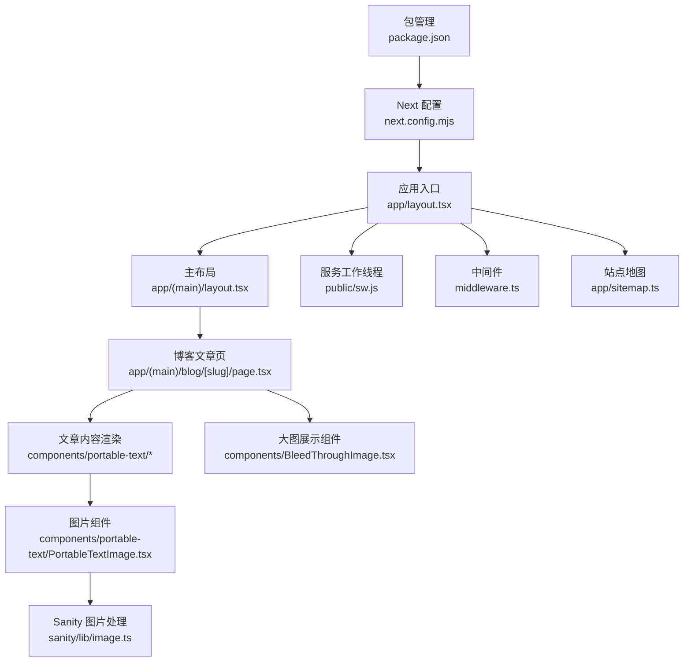
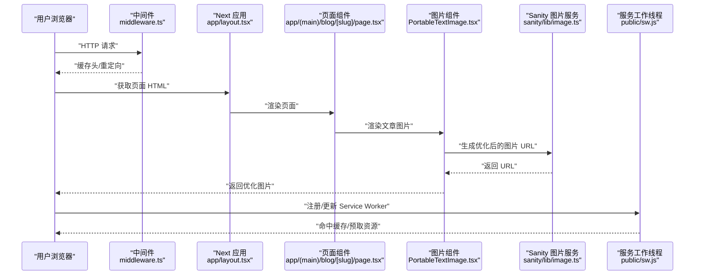
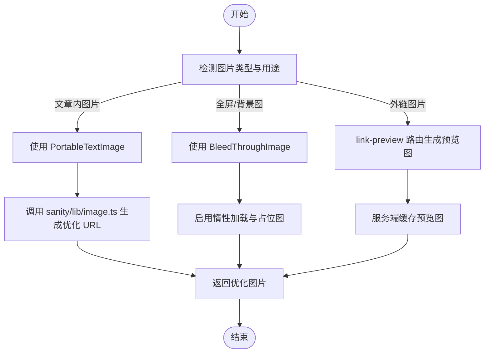
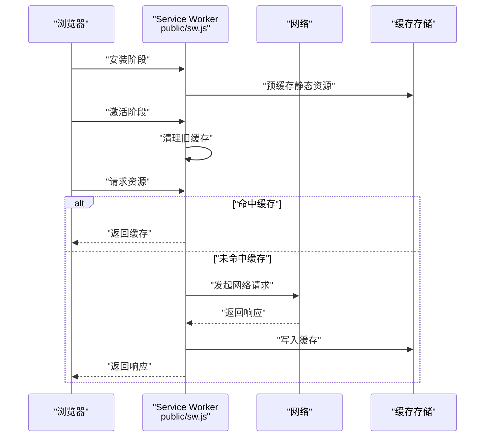
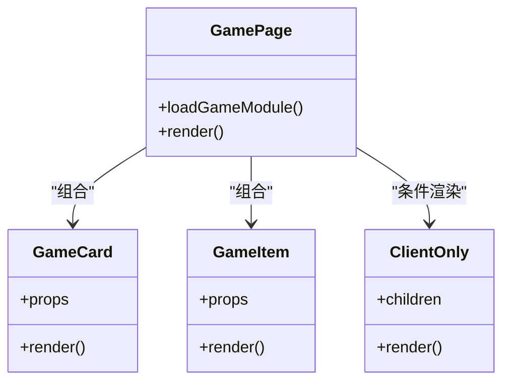
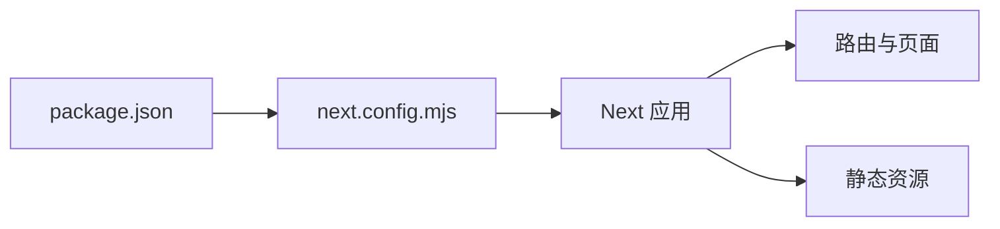

# 性能优化

<cite>
**本文引用的文件**   
- [next.config.mjs](file://next.config.mjs)
- [package.json](file://package.json)
- [public/sw.js](file://public/sw.js)
- [app/layout.tsx](file://app/layout.tsx)
- [app/(main)/layout.tsx](file://app/(main)/layout.tsx)
- [lib/image.ts](file://lib/image.ts)
- [sanity/lib/image.ts](file://sanity/lib/image.ts)
- [lib/seo.ts](file://lib/seo.ts)
- [app/sitemap.ts](file://app/sitemap.ts)
- [next-sitemap.config.js](file://next-sitemap.config.js)
- [middleware.ts](file://middleware.ts)
- [vercel.json](file://vercel.json)
- [app/(main)/blog/[slug]/page.tsx](file://app/(main)/blog/[slug]/page.tsx)
- [components/BleedThroughImage.tsx](file://components/BleedThroughImage.tsx)
- [components/portable-text/PortableTextImage.tsx](file://components/portable-text/PortableTextImage.tsx)
- [components/ClientOnly.tsx](file://components/ClientOnly.tsx)
- [components/GameUi/Page/Pagecomponent.tsx](file://components/GameUi/Page/Pagecomponent.tsx)
- [components/GameUi/Card/Card.tsx](file://components/GameUi/Card/Card.tsx)
- [components/GameUi/GameItem/GameItem.tsx](file://components/GameUi/GameItem/GameItem.tsx)
- [components/GooleAds/Home.tsx](file://components/GooleAds/Home.tsx)
- [app/api/link-preview/route.tsx](file://app/api/link-preview/route.tsx)
</cite>

## 目录
1. [简介](#简介)
2. [项目结构](#项目结构)
3. [核心组件](#核心组件)
4. [架构总览](#架构总览)
5. [详细组件分析](#详细组件分析)
6. [依赖分析](#依赖分析)
7. [性能考量](#性能考量)
8. [故障排查指南](#故障排查指南)
9. [结论](#结论)
10. [附录](#附录)

## 简介
本文件面向 cali.so 项目的性能优化，围绕图片优化、代码分割、缓存策略、SEO 优化与服务工作线程展开，并结合 Next.js 的性能特性（如 App Router、流式渲染、自动代码分割、图像优化等）给出可落地的优化方案。文档还覆盖 Web Vitals 指标优化、移动端体验提升、CDN 配置建议、渐进增强与懒加载/预取策略、基准测试与持续监控方法，以及常见问题的诊断思路。

## 项目结构
本项目基于 Next.js App Router 组织页面与路由，使用 Sanity 作为内容源，通过 API 路由提供数据接口，并在 public 目录下提供服务工作线程脚本。关键性能相关位置包括：
- 构建与运行时配置：next.config.mjs、package.json
- 站点地图与 SEO：app/sitemap.ts、next-sitemap.config.js、lib/seo.ts
- 图像优化：lib/image.ts、sanity/lib/image.ts、components/portable-text/PortableTextImage.tsx、components/BleedThroughImage.tsx
- 服务工作线程：public/sw.js
- 中间件与部署：middleware.ts、vercel.json
- 页面与组件：app/layout.tsx、app/(main)/layout.tsx、app/(main)/blog/[slug]/page.tsx 及游戏模块组件

图表来源
- [app/layout.tsx](file://app/layout.tsx)
- [app/(main)/layout.tsx](file://app/(main)/layout.tsx)
- [app/(main)/blog/[slug]/page.tsx](file://app/(main)/blog/[slug]/page.tsx)
- [components/portable-text/PortableTextImage.tsx](file://components/portable-text/PortableTextImage.tsx)
- [sanity/lib/image.ts](file://sanity/lib/image.ts)
- [components/BleedThroughImage.tsx](file://components/BleedThroughImage.tsx)
- [public/sw.js](file://public/sw.js)
- [middleware.ts](file://middleware.ts)
- [app/sitemap.ts](file://app/sitemap.ts)
- [next.config.mjs](file://next.config.mjs)
- [package.json](file://package.json)

章节来源
- [next.config.mjs](file://next.config.mjs)
- [package.json](file://package.json)
- [app/layout.tsx](file://app/layout.tsx)
- [app/(main)/layout.tsx](file://app/(main)/layout.tsx)
- [app/(main)/blog/[slug]/page.tsx](file://app/(main)/blog/[slug]/page.tsx)
- [components/portable-text/PortableTextImage.tsx](file://components/portable-text/PortableTextImage.tsx)
- [sanity/lib/image.ts](file://sanity/lib/image.ts)
- [components/BleedThroughImage.tsx](file://components/BleedThroughImage.tsx)
- [public/sw.js](file://public/sw.js)
- [middleware.ts](file://middleware.ts)
- [app/sitemap.ts](file://app/sitemap.ts)

## 核心组件
- 图像优化管线
  - 在页面中通过专用图片组件统一接入，结合 Sanity 的 URL 变换能力实现按需尺寸、格式与质量裁剪，减少首屏资源体积。
  - 对全屏或背景类大图采用专门的容器组件，配合占位图与延迟加载策略，避免阻塞首屏渲染。
- 服务工作线程
  - 在 public 下提供 sw.js，用于离线缓存、网络请求拦截与资源预取，提升二次访问速度与弱网体验。
- SEO 与站点地图
  - 通过 lib/seo.ts 集中管理元信息，app/sitemap.ts 生成站点地图，next-sitemap.config.js 控制导出行为，利于搜索引擎抓取与索引。
- 中间件与部署
  - middleware.ts 可用于请求级缓存头设置、重定向与鉴权；vercel.json 定义边缘/全局缓存策略与响应头。

章节来源
- [components/portable-text/PortableTextImage.tsx](file://components/portable-text/PortableTextImage.tsx)
- [sanity/lib/image.ts](file://sanity/lib/image.ts)
- [components/BleedThroughImage.tsx](file://components/BleedThroughImage.tsx)
- [public/sw.js](file://public/sw.js)
- [lib/seo.ts](file://lib/seo.ts)
- [app/sitemap.ts](file://app/sitemap.ts)
- [next-sitemap.config.js](file://next-sitemap.config.js)
- [middleware.ts](file://middleware.ts)
- [vercel.json](file://vercel.json)

## 架构总览
下图展示了从浏览器到服务端的关键路径与优化点：页面请求进入 Next.js 应用，经过中间件与布局渲染，按需加载组件与数据，图片经由优化管线输出，服务工作线程在客户端侧进行缓存与预取。

图表来源
- [middleware.ts](file://middleware.ts)
- [app/layout.tsx](file://app/layout.tsx)
- [app/(main)/blog/[slug]/page.tsx](file://app/(main)/blog/[slug]/page.tsx)
- [components/portable-text/PortableTextImage.tsx](file://components/portable-text/PortableTextImage.tsx)
- [sanity/lib/image.ts](file://sanity/lib/image.ts)
- [public/sw.js](file://public/sw.js)

## 详细组件分析

### 图片优化与加载策略
- 统一图片组件
  - 通过 PortableTextImage 将内容中的图片统一走优化流程，结合 Sanity 的 transform 参数实现按需尺寸、格式与质量调整，显著降低传输体积。
  - 建议为不同断点指定合适的 sizes 与 srcSet，确保移动端优先小图、桌面端高质量大图。
- 全屏/背景大图
  - BleedThroughImage 适合做全宽或沉浸式背景图，应配合低分辨率占位图与惰性加载，避免阻塞首屏。
- 第三方图片与外链
  - 对于无法直接优化的外链图片，可在 link-preview 路由中做轻量预览图生成与缓存，减少重复计算与外部依赖开销。

图表来源
- [components/portable-text/PortableTextImage.tsx](file://components/portable-text/PortableTextImage.tsx)
- [sanity/lib/image.ts](file://sanity/lib/image.ts)
- [components/BleedThroughImage.tsx](file://components/BleedThroughImage.tsx)
- [app/api/link-preview/route.tsx](file://app/api/link-preview/route.tsx)

章节来源
- [components/portable-text/PortableTextImage.tsx](file://components/portable-text/PortableTextImage.tsx)
- [sanity/lib/image.ts](file://sanity/lib/image.ts)
- [components/BleedThroughImage.tsx](file://components/BleedThroughImage.tsx)
- [app/api/link-preview/route.tsx](file://app/api/link-preview/route.tsx)

### 服务工作线程与缓存策略
- 注册与生命周期
  - 在应用启动时注册 public/sw.js，监听安装与激活事件，建立版本化缓存命名空间，避免缓存污染。
- 缓存策略
  - 静态资源（JS/CSS/字体/图标）采用强缓存 + 版本号策略；动态内容（API 响应）采用网络优先、失败回退缓存的策略。
- 预取与后台同步
  - 在空闲时段预取下一页或常用资源；在连接恢复后执行后台任务（如上报埋点、增量同步）。

图表来源
- [public/sw.js](file://public/sw.js)

章节来源
- [public/sw.js](file://public/sw.js)

### SEO 优化与站点地图
- 元信息管理
  - 通过 lib/seo.ts 集中管理标题、描述、Open Graph 与 Twitter Card 等元信息，保证一致性并便于复用。
- 站点地图与增量更新
  - app/sitemap.ts 动态生成 sitemap，next-sitemap.config.js 控制导出路径与优先级，有利于搜索引擎高效抓取。
- 结构化数据与可访问性
  - 建议在关键页面注入 JSON-LD 结构化数据，并为图片添加 alt 文本，提升可访问性与搜索可见性。

章节来源
- [lib/seo.ts](file://lib/seo.ts)
- [app/sitemap.ts](file://app/sitemap.ts)
- [next-sitemap.config.js](file://next-sitemap.config.js)

### 中间件与部署缓存
- 中间件
  - middleware.ts 可用于设置响应缓存头、重定向与鉴权逻辑，减少不必要的后端计算。
- 部署配置
  - vercel.json 可定义边缘缓存规则、响应头与路由重写，结合 CDN 提升全球访问速度。

章节来源
- [middleware.ts](file://middleware.ts)
- [vercel.json](file://vercel.json)

### 代码分割与按需加载
- 自动分割
  - Next.js 默认按路由与组件边界进行代码分割，建议将大型第三方库与重型 UI 组件拆分为独立模块，并通过动态导入按需加载。
- 客户端专属组件
  - ClientOnly 组件用于仅在客户端执行的逻辑，避免在服务端渲染时引入浏览器 API 导致的额外开销。
- 游戏模块优化
  - GameUi 下的 Page、Card、GameItem 等组件属于相对独立的业务域，建议进一步拆分与懒加载，降低首屏包体。

图表来源
- [components/ClientOnly.tsx](file://components/ClientOnly.tsx)
- [components/GameUi/Page/Pagecomponent.tsx](file://components/GameUi/Page/Pagecomponent.tsx)
- [components/GameUi/Card/Card.tsx](file://components/GameUi/Card/Card.tsx)
- [components/GameUi/GameItem/GameItem.tsx](file://components/GameUi/GameItem/GameItem.tsx)

章节来源
- [components/ClientOnly.tsx](file://components/ClientOnly.tsx)
- [components/GameUi/Page/Pagecomponent.tsx](file://components/GameUi/Page/Pagecomponent.tsx)
- [components/GameUi/Card/Card.tsx](file://components/GameUi/Card/Card.tsx)
- [components/GameUi/GameItem/GameItem.tsx](file://components/GameUi/GameItem/GameItem.tsx)

### 广告与第三方脚本优化
- 异步加载与降级
  - GooleAds/Home 应在非关键路径上异步加载，并提供降级方案（无广告时的正常浏览体验），避免阻塞主线程。
- 隔离与沙箱
  - 将第三方脚本放入 iframe 或沙箱环境，限制其对主应用的干扰，降低崩溃风险与性能抖动。

章节来源
- [components/GooleAds/Home.tsx](file://components/GooleAds/Home.tsx)

## 依赖分析
- 构建与运行依赖
  - package.json 定义了 Next.js 及相关插件的版本，确保使用稳定且具备性能改进的版本。
- 构建配置
  - next.config.mjs 控制编译选项、压缩、缓存与资源优化策略，是性能调优的核心入口。

图表来源
- [package.json](file://package.json)
- [next.config.mjs](file://next.config.mjs)

章节来源
- [package.json](file://package.json)
- [next.config.mjs](file://next.config.mjs)

## 性能考量
- Web Vitals 指标优化
  - LCP（最大内容绘制）：优化首屏图片与关键资源，减少阻塞型脚本，使用预加载提示。
  - INP（交互到下次绘制）：拆分长任务，避免在主线程执行耗时操作，使用 Web Workers 处理复杂计算。
  - CLS（累积布局偏移）：为图片与嵌入内容预留尺寸，避免动态插入导致布局跳动。
- 移动端性能提升
  - 优先加载小图与低分辨率占位图，使用现代图片格式（WebP/AVIF），减少 CSS/JS 体积，禁用不必要的动画。
- CDN 配置
  - 开启静态资源 CDN 缓存，设置合理的缓存失效策略（文件名哈希），对动态 API 使用边缘缓存与短 TTL。
- 渐进增强与预取
  - 基础功能在无 JS 环境下可用，逐步增强交互；对高频导航目标使用预取策略，缩短跳转等待时间。
- 基准测试与持续监控
  - 使用 Lighthouse CI、WebPageTest 与 RUM（真实用户监控）工具建立基线与告警，定期回归评估优化效果。

[本节为通用指导，不直接分析具体文件]

## 故障排查指南
- 服务工作线程问题
  - 检查 sw.js 的安装与激活日志，确认缓存命名空间与版本管理是否正确；验证缓存命中与网络回退逻辑。
- 图片加载异常
  - 核对 Sanity 图片 URL 变换参数是否合法；检查跨域与防盗链配置；确认浏览器是否支持目标图片格式。
- 缓存与中间件
  - 审查 middleware.ts 设置的缓存头是否与 vercel.json 一致；确认 CDN 层缓存键与失效策略是否符合预期。
- 第三方脚本
  - 定位 GooleAds/Home 的加载时机与错误回调，必要时增加超时与降级逻辑，避免影响主流程。

章节来源
- [public/sw.js](file://public/sw.js)
- [middleware.ts](file://middleware.ts)
- [vercel.json](file://vercel.json)
- [components/GooleAds/Home.tsx](file://components/GooleAds/Home.tsx)

## 结论
通过对图片优化、服务工作线程、SEO 与站点地图、中间件与部署缓存、代码分割与按需加载的系统性优化，cali.so 可以在首屏加载、交互响应与长期稳定性方面获得显著提升。建议结合 Web Vitals 指标与自动化测试持续监控，形成闭环优化机制。

[本节为总结，不直接分析具体文件]

## 附录
- 推荐工具
  - Lighthouse、WebPageTest、Chrome DevTools Performance、RUM 平台（如 Sentry、LogRocket）
- 最佳实践清单
  - 图片：统一组件、按需尺寸、现代格式、占位图与惰性加载
  - 脚本：异步加载、按需导入、隔离第三方
  - 缓存：分层缓存（浏览器/CDN/边缘/服务端）、版本化与失效策略
  - SEO：元信息集中管理、sitemap 与结构化数据
  - 监控：基线设定、告警阈值、回归测试

[本节为补充说明，不直接分析具体文件]