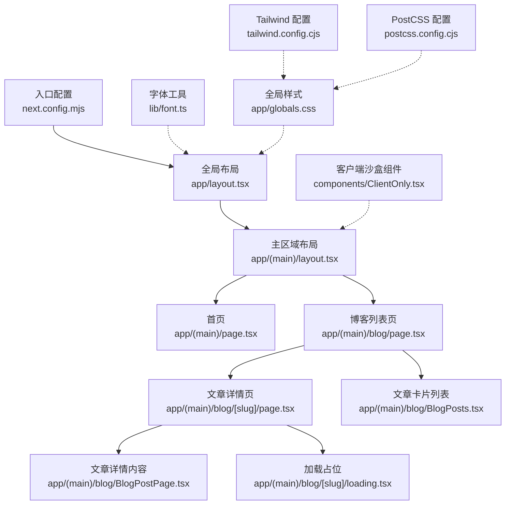
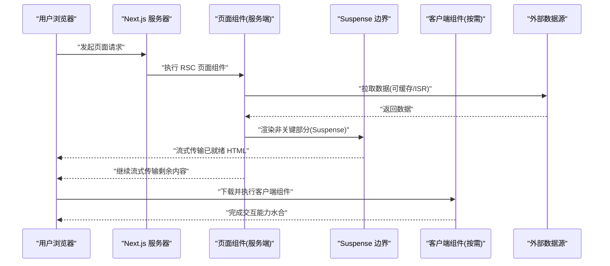
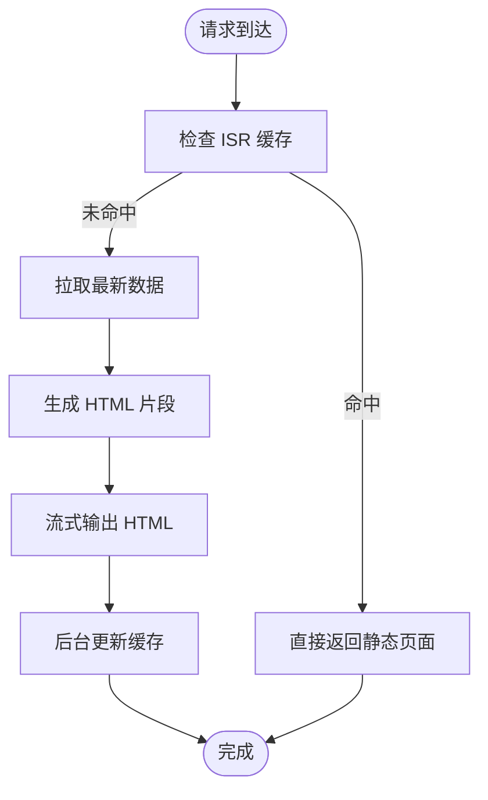
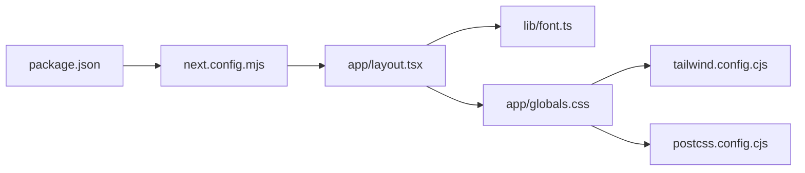

# 渲染性能

<cite>
**本文引用的文件**
- [next.config.mjs](file://next.config.mjs)
- [app/layout.tsx](file://app/layout.tsx)
- [app/(main)/layout.tsx](file://app/(main)/layout.tsx)
- [app/(main)/page.tsx](file://app/(main)/page.tsx)
- [app/(main)/blog/page.tsx](file://app/(main)/blog/page.tsx)
- [app/(main)/blog/[slug]/page.tsx](file://app/(main)/blog/[slug]/page.tsx)
- [app/(main)/blog/[slug]/loading.tsx](file://app/(main)/blog/[slug]/loading.tsx)
- [app/(main)/blog/BlogPostPage.tsx](file://app/(main)/blog/BlogPostPage.tsx)
- [app/(main)/blog/BlogPosts.tsx](file://app/(main)/blog/BlogPosts.tsx)
- [components/ClientOnly.tsx](file://components/ClientOnly.tsx)
- [lib/font.ts](file://lib/font.ts)
- [app/globals.css](file://app/globals.css)
- [postcss.config.cjs](file://postcss.config.cjs)
- [tailwind.config.cjs](file://tailwind.config.cjs)
- [package.json](file://package.json)
</cite>

## 目录
1. [简介](#简介)
2. [项目结构](#项目结构)
3. [核心组件](#核心组件)
4. [架构总览](#架构总览)
5. [详细组件分析](#详细组件分析)
6. [依赖分析](#依赖分析)
7. [性能考量](#性能考量)
8. [故障排查指南](#故障排查指南)
9. [结论](#结论)
10. [附录](#附录)

## 简介
本文件面向 cali.so 项目的渲染性能优化，聚焦于 Next.js 应用中的 React Server Components（RSC）与 Client Components 的权衡、增量静态再生成（ISR）与流式渲染策略、字体与 CSS 优化、关键渲染路径优化、重排重绘与虚拟滚动、大型列表渲染优化，以及性能指标监控、React Profiler 使用与内存泄漏检测。文档同时提供移动端首屏加载加速与交互响应性提升的实战技巧。

## 项目结构
本项目基于 Next.js App Router，采用 RSC 优先的架构：页面级组件默认在服务端执行，仅在需要时通过 "use client" 下沉为客户端组件；结合 ISR 与 Suspense 实现渐进式渲染与流式输出。样式方面使用 Tailwind + PostCSS，字体通过自定义工具进行预加载与优化。

图表来源
- [next.config.mjs](file://next.config.mjs)
- [app/layout.tsx](file://app/layout.tsx)
- [app/(main)/layout.tsx](file://app/(main)/layout.tsx)
- [app/(main)/page.tsx](file://app/(main)/page.tsx)
- [app/(main)/blog/page.tsx](file://app/(main)/blog/page.tsx)
- [app/(main)/blog/[slug]/page.tsx](file://app/(main)/blog/[slug]/page.tsx)
- [app/(main)/blog/BlogPostPage.tsx](file://app/(main)/blog/BlogPostPage.tsx)
- [app/(main)/blog/BlogPosts.tsx](file://app/(main)/blog/BlogPosts.tsx)
- [app/(main)/blog/[slug]/loading.tsx](file://app/(main)/blog/[slug]/loading.tsx)
- [components/ClientOnly.tsx](file://components/ClientOnly.tsx)
- [lib/font.ts](file://lib/font.ts)
- [app/globals.css](file://app/globals.css)
- [tailwind.config.cjs](file://tailwind.config.cjs)
- [postcss.config.cjs](file://postcss.config.cjs)

章节来源
- [next.config.mjs](file://next.config.mjs)
- [app/layout.tsx](file://app/layout.tsx)
- [app/(main)/layout.tsx](file://app/(main)/layout.tsx)
- [app/(main)/page.tsx](file://app/(main)/page.tsx)
- [app/(main)/blog/page.tsx](file://app/(main)/blog/page.tsx)
- [app/(main)/blog/[slug]/page.tsx](file://app/(main)/blog/[slug]/page.tsx)
- [app/(main)/blog/BlogPostPage.tsx](file://app/(main)/blog/BlogPostPage.tsx)
- [app/(main)/blog/BlogPosts.tsx](file://app/(main)/blog/BlogPosts.tsx)
- [app/(main)/blog/[slug]/loading.tsx](file://app/(main)/blog/[slug]/loading.tsx)
- [components/ClientOnly.tsx](file://components/ClientOnly.tsx)
- [lib/font.ts](file://lib/font.ts)
- [app/globals.css](file://app/globals.css)
- [tailwind.config.cjs](file://tailwind.config.cjs)
- [postcss.config.cjs](file://postcss.config.cjs)

## 核心组件
- 全局布局与主题提供者：负责注入全局样式、字体与主题上下文，确保首屏关键资源尽早加载。
- 主区域布局：承载导航、页脚等公共 UI，并作为 RSC 容器组织子路由。
- 博客列表与详情页：列表页支持分页与缓存策略；详情页结合 Suspense 与 loading 骨架屏实现流式渲染。
- 客户端沙盒组件：将必须运行在浏览器的逻辑隔离到客户端，避免不必要的客户端包体积。
- 字体工具：集中管理字体加载策略，减少 FOIT/FOUT 与布局偏移。

章节来源
- [app/layout.tsx](file://app/layout.tsx)
- [app/(main)/layout.tsx](file://app/(main)/layout.tsx)
- [app/(main)/blog/page.tsx](file://app/(main)/blog/page.tsx)
- [app/(main)/blog/[slug]/page.tsx](file://app/(main)/blog/[slug]/page.tsx)
- [app/(main)/blog/BlogPostPage.tsx](file://app/(main)/blog/BlogPostPage.tsx)
- [app/(main)/blog/BlogPosts.tsx](file://app/(main)/blog/BlogPosts.tsx)
- [app/(main)/blog/[slug]/loading.tsx](file://app/(main)/blog/[slug]/loading.tsx)
- [components/ClientOnly.tsx](file://components/ClientOnly.tsx)
- [lib/font.ts](file://lib/font.ts)

## 架构总览
下图展示了从请求进入至页面渲染的关键路径，包括服务端数据获取、流式输出、Suspense 边界与客户端水合过程。

图表来源
- [app/(main)/blog/[slug]/page.tsx](file://app/(main)/blog/[slug]/page.tsx)
- [app/(main)/blog/BlogPostPage.tsx](file://app/(main)/blog/BlogPostPage.tsx)
- [app/(main)/blog/[slug]/loading.tsx](file://app/(main)/blog/[slug]/loading.tsx)
- [components/ClientOnly.tsx](file://components/ClientOnly.tsx)

## 详细组件分析

### React Server Components 与 Client Components 的性能权衡
- 原则
  - 默认使用 RSC：减少客户端 JS 体积，提升首屏速度。
  - 仅对需要交互或浏览器 API 的部分使用 "use client"，并通过懒加载与动态导入控制体积。
  - 将重型第三方库放入客户端沙盒组件，避免污染服务端渲染产物。
- 实践要点
  - 在页面层保持纯函数式 RSC，数据获取尽量在服务端完成。
  - 将状态更新、事件处理、DOM 访问等逻辑下沉到客户端组件。
  - 使用 Suspense 包裹非关键 UI，配合 loading 骨架屏实现流式渲染。

章节来源
- [app/(main)/blog/[slug]/page.tsx](file://app/(main)/blog/[slug]/page.tsx)
- [app/(main)/blog/BlogPostPage.tsx](file://app/(main)/blog/BlogPostPage.tsx)
- [app/(main)/blog/[slug]/loading.tsx](file://app/(main)/blog/[slug]/loading.tsx)
- [components/ClientOnly.tsx](file://components/ClientOnly.tsx)

### 增量静态再生成（ISR）与流式渲染
- ISR 适用场景
  - 博客文章、新闻等更新频率较低但访问量高的内容。
  - 通过构建期生成静态页面，并在后台按策略重新生成，兼顾速度与新鲜度。
- 流式渲染
  - 使用 Suspense 划分可延迟渲染的区块，结合 loading.tsx 展示骨架屏，提升感知性能。
  - 将非关键数据（如评论、推荐）放入独立 Suspense 边界，避免阻塞首屏。

图表来源
- [app/(main)/blog/page.tsx](file://app/(main)/blog/page.tsx)
- [app/(main)/blog/[slug]/page.tsx](file://app/(main)/blog/[slug]/page.tsx)
- [app/(main)/blog/[slug]/loading.tsx](file://app/(main)/blog/[slug]/loading.tsx)

章节来源
- [app/(main)/blog/page.tsx](file://app/(main)/blog/page.tsx)
- [app/(main)/blog/[slug]/page.tsx](file://app/(main)/blog/[slug]/page.tsx)
- [app/(main)/blog/[slug]/loading.tsx](file://app/(main)/blog/[slug]/loading.tsx)

### 字体加载优化
- 目标
  - 消除 FOIT/FOUT，减少布局偏移（CLS），缩短首次文本绘制时间。
- 策略
  - 使用字体工具集中管理字体加载，设置合适的 display 与 preload。
  - 在布局中尽早注入字体，避免阻塞首屏。
  - 针对移动端限制字体变体数量，按需加载。

章节来源
- [lib/font.ts](file://lib/font.ts)
- [app/layout.tsx](file://app/layout.tsx)

### CSS 优化与关键渲染路径
- 去重与裁剪
  - 使用 Tailwind 的 Purge 策略，仅保留实际使用的类名，减小 CSS 体积。
  - 将全局样式拆分为关键与非关键，关键样式内联或提前加载。
- 关键渲染路径
  - 将首屏必需样式置于头部，避免阻塞渲染。
  - 非关键样式异步加载，降低首屏压力。
- 动画与过渡
  - 优先使用 transform 与 opacity，避免触发重排。
  - 合理使用 will-change，谨慎使用以避免额外内存占用。

章节来源
- [tailwind.config.cjs](file://tailwind.config.cjs)
- [postcss.config.cjs](file://postcss.config.cjs)
- [app/globals.css](file://app/globals.css)

### 重排重绘优化与虚拟滚动
- 重排重绘
  - 批量更新 DOM，避免在循环中频繁读写布局属性。
  - 使用 requestAnimationFrame 调度高优先级动画。
  - 避免强制同步布局（如读取 offsetHeight 后立即写入）。
- 虚拟滚动与大型列表
  - 对长列表使用虚拟滚动，仅渲染可视区域节点。
  - 固定行高或使用估算高度，提高滚动性能。
  - 对图片与复杂卡片做懒加载与占位，减少初始渲染成本。

章节来源
- [app/(main)/blog/BlogPosts.tsx](file://app/(main)/blog/BlogPosts.tsx)

### 客户端组件与交互优化
- 客户端沙盒
  - 将第三方 SDK、浏览器 API 调用封装在客户端组件中，避免污染服务端产物。
  - 使用动态导入与条件渲染，按需加载交互逻辑。
- 事件与状态
  - 合并多次 setState，减少不必要的重渲染。
  - 使用 memo 与 useMemo/useCallback 精准优化热点组件。

章节来源
- [components/ClientOnly.tsx](file://components/ClientOnly.tsx)

## 依赖分析
- 构建与运行时
  - next.config.mjs 控制构建行为与运行时优化开关。
  - package.json 声明依赖版本，影响打包体积与兼容性。
- 样式管线
  - tailwind.config.cjs 与 postcss.config.cjs 共同决定 CSS 生成策略与插件链。
- 资源与字体
  - lib/font.ts 与 app/layout.tsx 协作，确保字体在正确时机加载。

图表来源
- [package.json](file://package.json)
- [next.config.mjs](file://next.config.mjs)
- [app/layout.tsx](file://app/layout.tsx)
- [lib/font.ts](file://lib/font.ts)
- [app/globals.css](file://app/globals.css)
- [tailwind.config.cjs](file://tailwind.config.cjs)
- [postcss.config.cjs](file://postcss.config.cjs)

章节来源
- [package.json](file://package.json)
- [next.config.mjs](file://next.config.mjs)
- [tailwind.config.cjs](file://tailwind.config.cjs)
- [postcss.config.cjs](file://postcss.config.cjs)
- [app/layout.tsx](file://app/layout.tsx)
- [lib/font.ts](file://lib/font.ts)
- [app/globals.css](file://app/globals.css)

## 性能考量
- 指标与监控
  - 采集 Core Web Vitals（LCP、FID/INP、CLS）、FCP、TTI、TBT 等指标。
  - 在生产环境接入前端性能监控平台，按页面与设备维度聚合。
- React Profiler
  - 在开发环境启用 React Profiler，定位重渲染热点与耗时操作。
  - 结合火焰图分析组件树渲染成本，针对性优化。
- 内存泄漏检测
  - 使用浏览器 Performance 面板录制长时间交互，观察堆快照增长趋势。
  - 清理定时器、事件监听器与订阅，避免闭包引用导致无法回收。
- 移动端优化
  - 减少首屏 JS/CSS 体积，开启 HTTP/2 与缓存策略。
  - 图片与媒体资源使用现代格式与自适应尺寸，延迟加载非关键资源。
  - 避免在滚动过程中执行昂贵计算，必要时使用 Web Worker。
- 首屏加载加速
  - 关键资源预加载与预连接，优先渲染首屏内容。
  - 使用 ISR 与 CDN 缓存，缩短 TTFB。
- 交互响应性提升
  - 拆分大任务，使用 requestIdleCallback 或分片渲染。
  - 对高频事件节流/防抖，减少主线程阻塞。

[本节为通用指导，不直接分析具体文件]

## 故障排查指南
- 常见问题
  - 首屏白屏或闪烁：检查字体加载策略与关键样式是否及时注入。
  - 交互卡顿：定位客户端组件中的重渲染热点与阻塞操作。
  - 内存持续增长：排查未清理的订阅与事件监听器。
- 诊断步骤
  - 使用 React Profiler 捕获渲染时序，识别慢组件。
  - 打开浏览器 Performance 面板，查看主线程活动与长任务。
  - 对比生产与开发环境的差异，确认代码分割与缓存策略生效。
- 修复建议
  - 将重型逻辑下沉到客户端并懒加载。
  - 使用 Suspense 与 loading 骨架屏改善感知性能。
  - 优化 CSS 选择器与动画，避免强制同步布局。

章节来源
- [app/(main)/blog/[slug]/loading.tsx](file://app/(main)/blog/[slug]/loading.tsx)
- [components/ClientOnly.tsx](file://components/ClientOnly.tsx)
- [lib/font.ts](file://lib/font.ts)
- [app/globals.css](file://app/globals.css)

## 结论
通过 RSC 优先、ISR 与流式渲染的组合策略，配合字体与 CSS 优化、关键渲染路径精简、重排重绘与虚拟滚动优化，以及完善的性能监控与调试手段，cali.so 可在多端环境下获得稳定的首屏体验与流畅的交互响应。建议在持续迭代中建立性能基线与回归测试，确保优化成果长期有效。

[本节为总结性内容，不直接分析具体文件]

## 附录
- 相关配置文件与页面入口
  - 构建与运行时配置：[next.config.mjs](file://next.config.mjs)
  - 全局布局与字体注入：[app/layout.tsx](file://app/layout.tsx)、[lib/font.ts](file://lib/font.ts)
  - 主区域布局与页面：[app/(main)/layout.tsx](file://app/(main)/layout.tsx)、[app/(main)/page.tsx](file://app/(main)/page.tsx)
  - 博客模块：[app/(main)/blog/page.tsx](file://app/(main)/blog/page.tsx)、[app/(main)/blog/[slug]/page.tsx](file://app/(main)/blog/[slug]/page.tsx)、[app/(main)/blog/BlogPostPage.tsx](file://app/(main)/blog/BlogPostPage.tsx)、[app/(main)/blog/BlogPosts.tsx](file://app/(main)/blog/BlogPosts.tsx)、[app/(main)/blog/[slug]/loading.tsx](file://app/(main)/blog/[slug]/loading.tsx)
  - 客户端沙盒：[components/ClientOnly.tsx](file://components/ClientOnly.tsx)
  - 样式与构建：[app/globals.css](file://app/globals.css)、[tailwind.config.cjs](file://tailwind.config.cjs)、[postcss.config.cjs](file://postcss.config.cjs)
  - 依赖清单：[package.json](file://package.json)