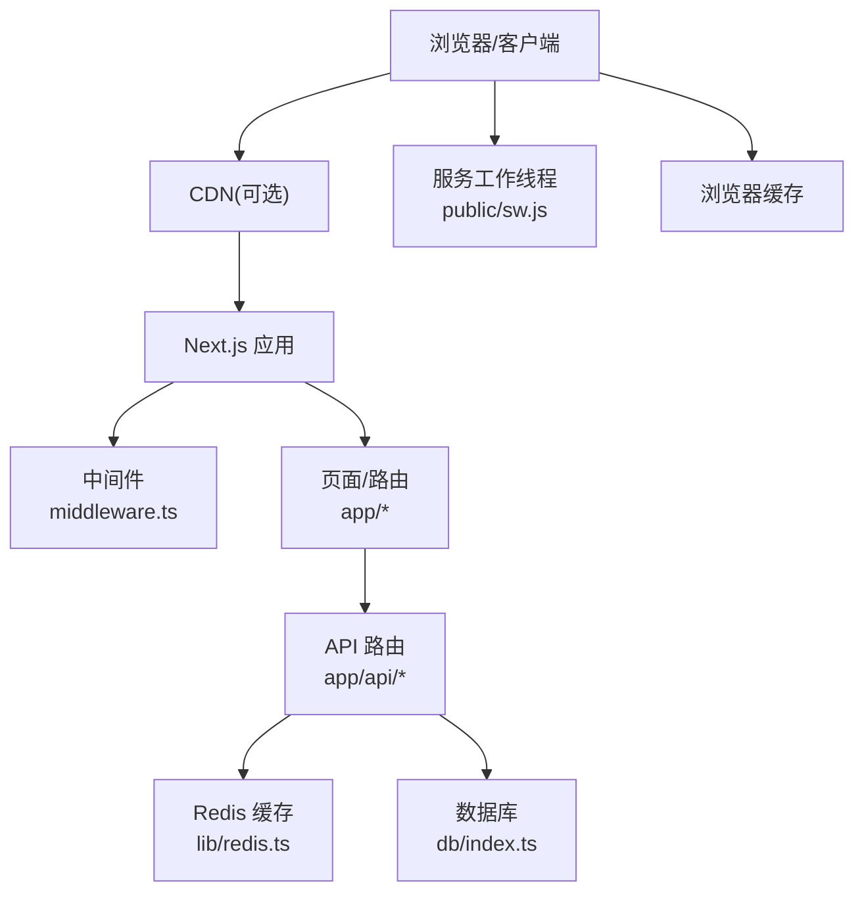
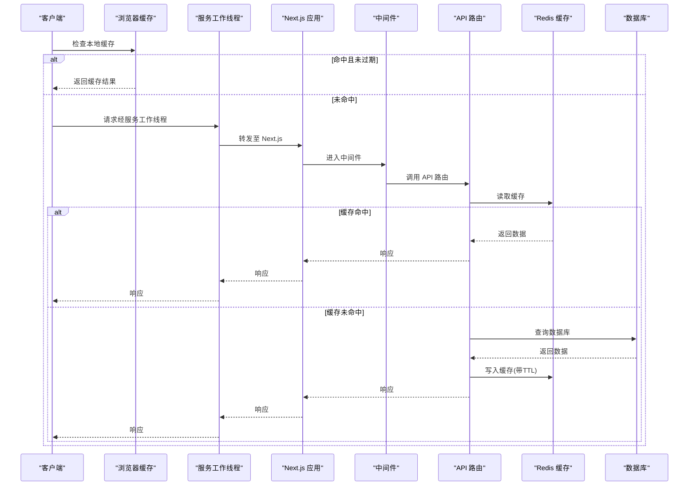
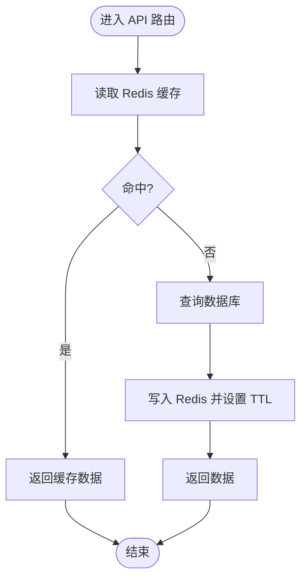
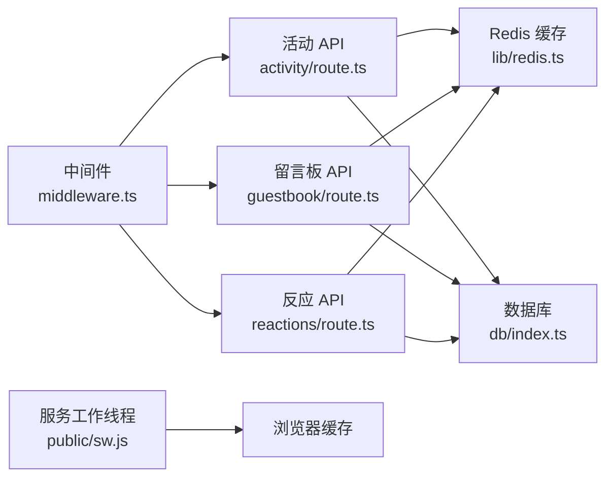

# 缓存策略

<cite>
**本文引用的文件**   
- [next.config.mjs](file://next.config.mjs)
- [middleware.ts](file://middleware.ts)
- [lib/redis.ts](file://lib/redis.ts)
- [config/kv.ts](file://config/kv.ts)
- [app/layout.tsx](file://app/layout.tsx)
- [public/sw.js](file://public/sw.js)
- [app/api/activity/route.ts](file://app/api/activity/route.ts)
- [app/api/guestbook/route.ts](file://app/api/guestbook/route.ts)
- [app/api/reactions/route.ts](file://app/api/reactions/route.ts)
- [app/(main)/blog/page.tsx](file://app/(main)/blog/page.tsx)
- [app/(main)/blog/[slug]/page.tsx](file://app/(main)/blog/[slug]/page.tsx)
- [app/(main)/guestbook/page.tsx](file://app/(main)/guestbook/page.tsx)
- [db/index.ts](file://db/index.ts)
- [package.json](file://package.json)
</cite>

## 目录
1. [简介](#简介)
2. [项目结构](#项目结构)
3. [核心组件](#核心组件)
4. [架构总览](#架构总览)
5. [详细组件分析](#详细组件分析)
6. [依赖关系分析](#依赖关系分析)
7. [性能考量](#性能考量)
8. [故障排查指南](#故障排查指南)
9. [结论](#结论)
10. [附录](#附录)

## 简介
本文件为 cali.so 项目的缓存策略文档，围绕多级缓存体系进行系统化说明：浏览器缓存、CDN 缓存、Next.js 运行时缓存、Redis 缓存与数据库查询缓存、SWR 客户端缓存以及服务工作线程（PWA）缓存。文档覆盖缓存键设计、失效策略、预热机制、中间件缓存实现、Redis 配置、PWA 缓存策略、监控与调试方法，以及一致性保障方案。目标是帮助开发者在保持数据一致性的前提下，最大化读取性能与用户体验。

## 项目结构
本项目采用 Next.js App Router 与 Server Components 为主的前后端一体化架构，结合 Redis 作为共享缓存层，并通过中间件与 API 路由统一落地缓存策略。关键目录与职责如下：
- app: 页面与 API 路由，承载服务端渲染与数据获取逻辑
- lib: 通用库，包含 Redis 客户端封装
- config: 配置项，包含 KV 存储配置
- public: 静态资源与服务工作线程 sw.js
- db: 数据库连接与迁移
- middleware.ts: 请求级中间件，用于全局缓存控制与鉴权等
- next.config.mjs: Next.js 构建与运行期配置，含图片优化与可能的缓存相关设置

图表来源
- [middleware.ts](file://middleware.ts)
- [lib/redis.ts](file://lib/redis.ts)
- [app/api/activity/route.ts](file://app/api/activity/route.ts)
- [app/api/guestbook/route.ts](file://app/api/guestbook/route.ts)
- [app/api/reactions/route.ts](file://app/api/reactions/route.ts)
- [db/index.ts](file://db/index.ts)
- [public/sw.js](file://public/sw.js)

章节来源
- [next.config.mjs](file://next.config.mjs)
- [middleware.ts](file://middleware.ts)
- [lib/redis.ts](file://lib/redis.ts)
- [config/kv.ts](file://config/kv.ts)
- [app/layout.tsx](file://app/layout.tsx)
- [public/sw.js](file://public/sw.js)
- [db/index.ts](file://db/index.ts)

## 核心组件
- 中间件缓存控制：通过中间件对响应头进行统一控制，如 Cache-Control、ETag、Vary 等，影响浏览器与 CDN 的缓存行为。
- Redis 缓存层：提供统一的读写接口，支持序列化/反序列化、过期时间、命名空间与键前缀管理。
- API 路由缓存：在高频读路径中优先从 Redis 读取，未命中时回源数据库并回填缓存；写路径触发相应键失效或更新。
- 页面级缓存：利用 Next.js 的缓存能力（如 revalidate、ISR、动态路由参数化缓存），配合 API 路由缓存提升整体性能。
- PWA 缓存：通过服务工作线程对静态资源与部分数据进行缓存，提升离线体验与首屏加载速度。
- 浏览器缓存：由响应头与 SWR 客户端缓存共同作用，减少重复请求与网络开销。

章节来源
- [middleware.ts](file://middleware.ts)
- [lib/redis.ts](file://lib/redis.ts)
- [app/api/activity/route.ts](file://app/api/activity/route.ts)
- [app/api/guestbook/route.ts](file://app/api/guestbook/route.ts)
- [app/api/reactions/route.ts](file://app/api/reactions/route.ts)
- [app/(main)/blog/page.tsx](file://app/(main)/blog/page.tsx)
- [app/(main)/blog/[slug]/page.tsx](file://app/(main)/blog/[slug]/page.tsx)
- [app/(main)/guestbook/page.tsx](file://app/(main)/guestbook/page.tsx)
- [public/sw.js](file://public/sw.js)

## 架构总览
下图展示请求从客户端到各缓存层的完整链路，包括浏览器、CDN、Next.js、Redis 与数据库的交互顺序与条件分支。

图表来源
- [middleware.ts](file://middleware.ts)
- [app/api/activity/route.ts](file://app/api/activity/route.ts)
- [app/api/guestbook/route.ts](file://app/api/guestbook/route.ts)
- [app/api/reactions/route.ts](file://app/api/reactions/route.ts)
- [lib/redis.ts](file://lib/redis.ts)
- [db/index.ts](file://db/index.ts)
- [public/sw.js](file://public/sw.js)

## 详细组件分析

### 中间件缓存控制
- 职责：统一设置响应头（如 Cache-Control、ETag、Vary），决定浏览器与 CDN 的缓存策略；可基于路径或用户状态差异化处理。
- 关键点：
  - 针对静态资源与只读 API 设置较长 TTL，提高命中率
  - 针对写操作或个性化内容禁用强缓存，确保一致性
  - 使用 Vary 避免不同用户或设备间的缓存污染
- 建议：
  - 将公共响应头集中管理，便于维护与审计
  - 对敏感接口增加 ETag 校验，降低带宽与服务器压力

章节来源
- [middleware.ts](file://middleware.ts)

### Redis 缓存层
- 职责：提供高性能共享缓存，支撑多实例部署下的数据一致性；封装序列化、键前缀、命名空间与过期时间。
- 关键点：
  - 键设计：按资源类型+标识+版本/哈希组合，避免冲突
  - 过期策略：根据数据变更频率设定合理 TTL，必要时主动失效
  - 错误降级：Redis 不可用时回退直连数据库，保证可用性
- 建议：
  - 使用批量操作减少网络往返
  - 对热点键进行分片或本地小缓存（进程内）以进一步降低延迟

章节来源
- [lib/redis.ts](file://lib/redis.ts)

### API 路由缓存模式
- 读路径：
  - 先查 Redis，命中则直接返回
  - 未命中则查询数据库，回填 Redis 并设置 TTL
- 写路径：
  - 更新数据库后，删除或更新相关缓存键，确保后续读取一致性
- 示例路由：
  - 活动流、留言板、反应计数等高频读场景适合此模式

图表来源
- [app/api/activity/route.ts](file://app/api/activity/route.ts)
- [app/api/guestbook/route.ts](file://app/api/guestbook/route.ts)
- [app/api/reactions/route.ts](file://app/api/reactions/route.ts)
- [lib/redis.ts](file://lib/redis.ts)
- [db/index.ts](file://db/index.ts)

章节来源
- [app/api/activity/route.ts](file://app/api/activity/route.ts)
- [app/api/guestbook/route.ts](file://app/api/guestbook/route.ts)
- [app/api/reactions/route.ts](file://app/api/reactions/route.ts)

### 页面级缓存与 Next.js 机制
- 动态路由与 ISR：
  - 博客列表与详情页可利用 Next.js 的 revalidate 与 ISR 能力，在后台增量更新，兼顾实时性与性能
- 页面缓存键：
  - 基于 URL 与查询参数生成唯一键，避免跨用户污染
- 建议：
  - 对静态内容启用较长的 revalidate 周期
  - 对热点内容使用预渲染与边缘缓存

章节来源
- [app/(main)/blog/page.tsx](file://app/(main)/blog/page.tsx)
- [app/(main)/blog/[slug]/page.tsx](file://app/(main)/blog/[slug]/page.tsx)

### PWA 与服务工作线程缓存
- 职责：缓存静态资源与必要数据，提升离线体验与首屏加载速度
- 关键点：
  - 缓存策略：静态资源长期缓存，动态数据短 TTL 或按需更新
  - 版本控制：通过 manifest 与资源指纹避免脏缓存
  - 更新机制：检测到新版本时提示刷新或静默更新
- 建议：
  - 对关键资源使用预缓存，非关键资源懒加载
  - 监控缓存大小，避免超出配额

章节来源
- [public/sw.js](file://public/sw.js)

### 浏览器缓存与 SWR 客户端缓存
- 浏览器缓存：
  - 由中间件设置的响应头驱动，适用于静态资源与只读 API
- SWR 客户端缓存：
  - 在客户端侧对数据进行短期缓存与去重，减少重复请求
  - 结合 revalidateOnFocus、revalidateOnReconnect 等策略提升体验
- 建议：
  - 对频繁变化的数据缩短客户端缓存时间
  - 对重要写操作后主动使客户端缓存失效

章节来源
- [middleware.ts](file://middleware.ts)
- [app/layout.tsx](file://app/layout.tsx)

## 依赖关系分析
- 中间件与 API 路由：中间件为所有请求提供统一的缓存控制入口，API 路由在此基础上实现业务级缓存逻辑。
- API 路由与 Redis：API 路由通过 Redis 客户端访问共享缓存，形成“读多写少”的高性能路径。
- API 路由与数据库：当缓存未命中时回源数据库，保证数据正确性。
- 服务工作线程与浏览器：SW 负责静态资源与数据的缓存策略，与浏览器缓存协同工作。

图表来源
- [middleware.ts](file://middleware.ts)
- [app/api/activity/route.ts](file://app/api/activity/route.ts)
- [app/api/guestbook/route.ts](file://app/api/guestbook/route.ts)
- [app/api/reactions/route.ts](file://app/api/reactions/route.ts)
- [lib/redis.ts](file://lib/redis.ts)
- [db/index.ts](file://db/index.ts)
- [public/sw.js](file://public/sw.js)

章节来源
- [middleware.ts](file://middleware.ts)
- [app/api/activity/route.ts](file://app/api/activity/route.ts)
- [app/api/guestbook/route.ts](file://app/api/guestbook/route.ts)
- [app/api/reactions/route.ts](file://app/api/reactions/route.ts)
- [lib/redis.ts](file://lib/redis.ts)
- [db/index.ts](file://db/index.ts)
- [public/sw.js](file://public/sw.js)

## 性能考量
- 缓存命中率：通过监控 Redis 命中率与数据库 QPS，评估缓存效果
- 过期策略：根据数据变更频率调整 TTL，平衡新鲜度与性能
- 热点键保护：对高并发热点键采用本地小缓存或分片策略
- 降级与容错：Redis 不可用时自动回退数据库，保证服务可用
- 带宽优化：合理使用 ETag 与压缩，减少传输体积

[本节为通用指导，不直接分析具体文件]

## 故障排查指南
- 缓存未命中：
  - 检查 Redis 连接与权限
  - 确认键设计与命名空间是否正确
  - 查看中间件响应头是否被意外覆盖
- 数据不一致：
  - 核对写路径是否删除或更新了对应缓存键
  - 检查客户端 SWR 是否主动失效
- 性能问题：
  - 分析 Redis 慢查询与内存占用
  - 评估数据库索引与查询计划
- 工具与方法：
  - 使用浏览器开发者工具检查缓存头与网络请求
  - 使用 Redis CLI 或监控面板观察命中率与键分布
  - 在服务端日志中记录缓存命中/未命中与耗时

章节来源
- [middleware.ts](file://middleware.ts)
- [lib/redis.ts](file://lib/redis.ts)
- [app/api/activity/route.ts](file://app/api/activity/route.ts)
- [app/api/guestbook/route.ts](file://app/api/guestbook/route.ts)
- [app/api/reactions/route.ts](file://app/api/reactions/route.ts)

## 结论
通过中间件、Redis、Next.js 与 PWA 的多级缓存协同，cali.so 能够在保证数据一致性的前提下显著提升读取性能与用户体验。建议在持续迭代中完善缓存键规范、失效策略与监控告警，逐步建立完善的缓存治理体系。

[本节为总结，不直接分析具体文件]

## 附录

### 缓存键设计规范
- 命名约定：资源类型_实体ID_版本_哈希
- 命名空间：按模块划分，避免冲突
- 版本控制：数据结构变更时递增版本号
- 哈希字段：对复杂查询条件生成稳定哈希，避免键爆炸

[本节为概念性说明，不直接分析具体文件]

### 缓存失效策略
- 主动失效：写操作后立即删除或更新相关键
- 被动失效：基于 TTL 自然过期，适用于低频变更数据
- 批量失效：按命名空间或前缀批量清理，适用于发布或迁移场景

[本节为概念性说明，不直接分析具体文件]

### 缓存预热机制
- 启动预热：服务启动时预加载热点数据至 Redis
- 定时预热：基于任务调度定期刷新热点键
- 事件驱动：数据变更后触发关联键的预热

[本节为概念性说明，不直接分析具体文件]

### Redis 配置要点
- 连接池与超时：合理设置连接数与超时时间
- 序列化格式：选择高效稳定的序列化方式
- 持久化策略：根据数据重要性选择 RDB/AOF
- 监控指标：命中率、内存使用、慢查询、连接数

章节来源
- [lib/redis.ts](file://lib/redis.ts)
- [config/kv.ts](file://config/kv.ts)

### Next.js 缓存与 ISR
- revalidate：按需增量更新，平衡实时性与性能
- ISR：对静态页面进行后台增量生成，提升首屏速度
- 动态路由：基于 URL 参数生成独立缓存键

章节来源
- [app/(main)/blog/page.tsx](file://app/(main)/blog/page.tsx)
- [app/(main)/blog/[slug]/page.tsx](file://app/(main)/blog/[slug]/page.tsx)

### PWA 缓存策略
- 资源指纹：文件名加入哈希，避免脏缓存
- 预缓存：关键资源在首次安装时缓存
- 按需更新：检测新版本后提示或静默更新

章节来源
- [public/sw.js](file://public/sw.js)

### 浏览器缓存与 SWR
- 响应头：Cache-Control、ETag、Vary 的统一管理
- SWR 策略：revalidateOnFocus、revalidateOnReconnect、staleTime 等

章节来源
- [middleware.ts](file://middleware.ts)
- [app/layout.tsx](file://app/layout.tsx)

### 监控与调试
- 服务端：Redis 命中率、QPS、延迟、错误率
- 客户端：网络瀑布图、缓存命中统计、SW 缓存大小
- 告警：命中率低于阈值、错误率上升、内存异常

[本节为通用指导，不直接分析具体文件]

### 一致性保证方案
- 写路径：数据库事务 + 缓存原子更新或删除
- 读路径：先读缓存，未命中再读数据库并回填
- 客户端：写操作后主动失效 SWR 缓存
- 幂等性：确保多次写入不会产生副作用

[本节为通用指导，不直接分析具体文件]

### 依赖与版本
- 包管理：使用 pnpm 锁定依赖版本，确保环境一致性
- 关键依赖：Redis 客户端、Next.js 插件、PWA 工具链

章节来源
- [package.json](file://package.json)