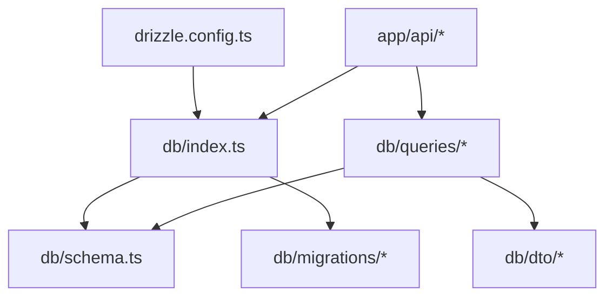
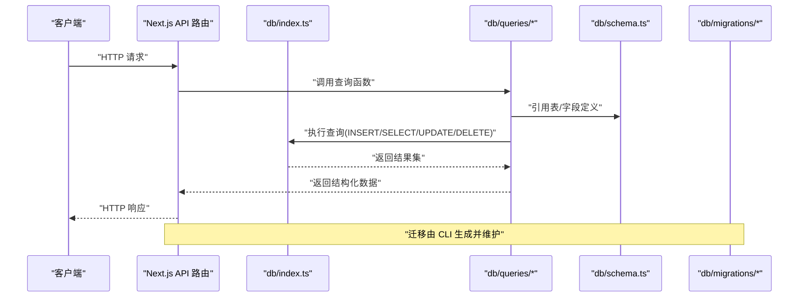
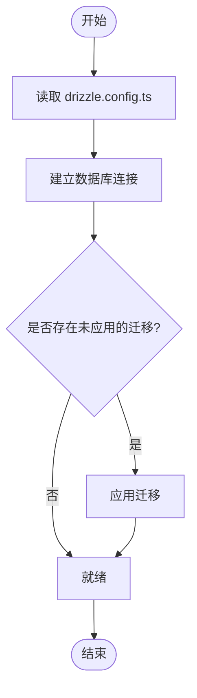
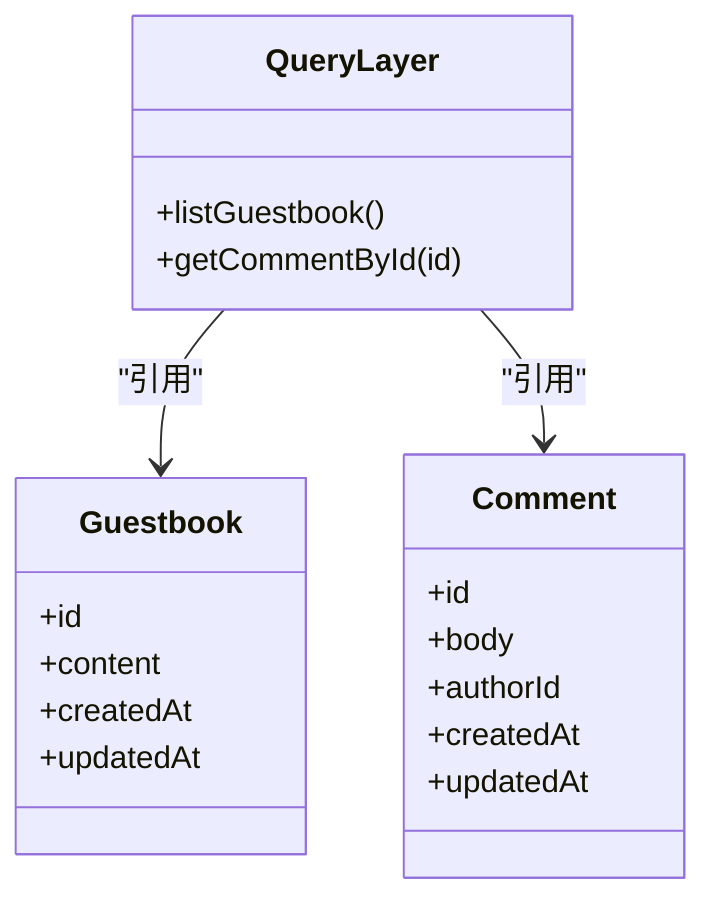
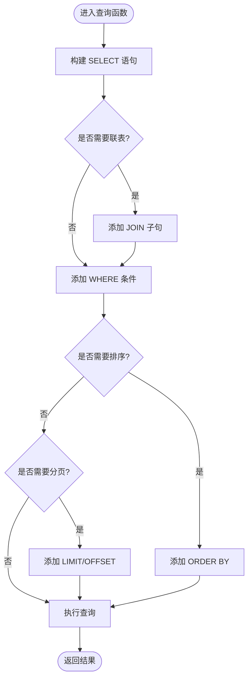
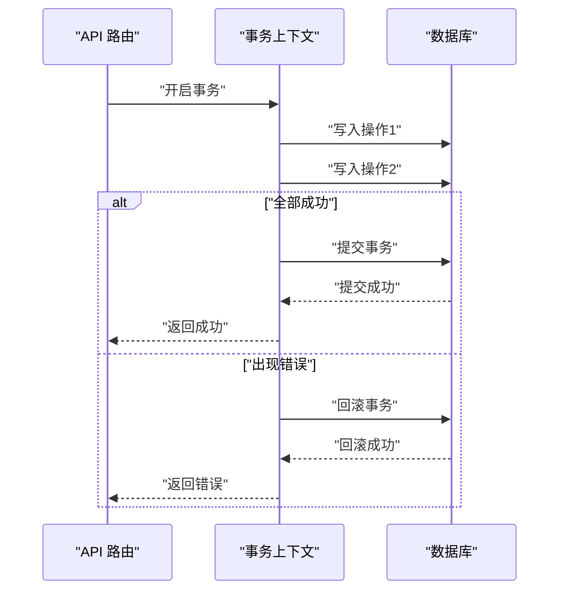
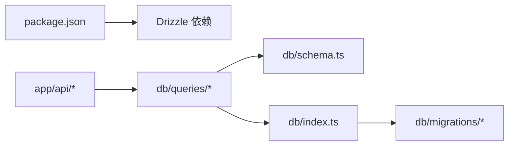

# Drizzle ORM 使用

<cite>
**本文引用的文件**   
- [drizzle.config.ts](file://drizzle.config.ts)
- [db/index.ts](file://db/index.ts)
- [db/schema.ts](file://db/schema.ts)
- [db/migrations/0000_shallow_iron_fist.sql](file://db/migrations/0000_shallow_iron_fist.sql)
- [db/migrations/meta/_journal.json](file://db/migrations/meta/_journal.json)
- [db/migrations/meta/0000_snapshot.json](file://db/migrations/meta/0000_snapshot.json)
- [db/dto/comment.dto.ts](file://db/dto/comment.dto.ts)
- [db/dto/guestbook.dto.ts](file://db/dto/guestbook.dto.ts)
- [db/queries/guestbook.ts](file://db/queries/guestbook.ts)
- [app/api/comments/[id]/route.ts](file://app/api/comments/[id]/route.ts)
- [app/api/guestbook/route.ts](file://app/api/guestbook/route.ts)
- [package.json](file://package.json)
</cite>

## 目录
1. [简介](#简介)
2. [项目结构](#项目结构)
3. [核心组件](#核心组件)
4. [架构总览](#架构总览)
5. [详细组件分析](#详细组件分析)
6. [依赖分析](#依赖分析)
7. [性能考虑](#性能考虑)
8. [故障排查指南](#故障排查指南)
9. [结论](#结论)
10. [附录](#附录)

## 简介
本指南面向在 cali.so 项目中基于 Drizzle ORM 进行数据库访问的开发者，覆盖以下主题：
- 数据库连接配置与迁移
- 类型安全的查询构建（CRUD、联表、条件过滤、分页排序）
- 事务处理
- 连接池配置与错误处理
- 性能优化技巧
- 环境适配与部署注意事项

本项目采用 Next.js App Router + Drizzle ORM，数据模型定义于 db/schema.ts，迁移位于 db/migrations，API 路由通过 app/api 下的 route.ts 调用 db 层。

## 项目结构
与 Drizzle 相关的关键目录与文件：
- drizzle.config.ts：Drizzle CLI 配置（驱动、数据库 URL、迁移输出路径等）
- db/index.ts：数据库连接实例导出
- db/schema.ts：表结构与字段类型定义
- db/migrations/*：SQL 迁移脚本与元数据
- db/dto/*：用于 API 请求/响应的数据结构
- db/queries/*：封装常用查询逻辑
- app/api/*：Next.js API 路由，调用 db 层完成业务操作

图表来源
- [drizzle.config.ts](file://drizzle.config.ts)
- [db/index.ts](file://db/index.ts)
- [db/schema.ts](file://db/schema.ts)
- [db/migrations/0000_shallow_iron_fist.sql](file://db/migrations/0000_shallow_iron_fist.sql)
- [db/queries/guestbook.ts](file://db/queries/guestbook.ts)
- [app/api/guestbook/route.ts](file://app/api/guestbook/route.ts)

章节来源
- [drizzle.config.ts](file://drizzle.config.ts)
- [db/index.ts](file://db/index.ts)
- [db/schema.ts](file://db/schema.ts)
- [db/migrations/0000_shallow_iron_fist.sql](file://db/migrations/0000_shallow_iron_fist.sql)
- [db/migrations/meta/_journal.json](file://db/migrations/meta/_journal.json)
- [db/migrations/meta/0000_snapshot.json](file://db/migrations/meta/0000_snapshot.json)
- [db/queries/guestbook.ts](file://db/queries/guestbook.ts)
- [app/api/guestbook/route.ts](file://app/api/guestbook/route.ts)

## 核心组件
- 数据库连接
  - 通过 db/index.ts 暴露连接实例，供 API 路由与查询模块复用。
- 数据模型
  - db/schema.ts 中声明表与字段，提供强类型约束，确保查询结果与 TypeScript 类型一致。
- 迁移
  - drizzle.config.ts 指定驱动与数据库地址；db/migrations 包含已生成的 SQL 与元数据。
- 查询封装
  - db/queries/guestbook.ts 封装常用查询模式（如列表、分页、排序）。
- DTO
  - db/dto/* 定义输入/输出结构，便于 API 层校验与响应序列化。
- API 路由
  - app/api/* 中的 route.ts 负责接收请求、调用 db 层并返回响应。

章节来源
- [db/index.ts](file://db/index.ts)
- [db/schema.ts](file://db/schema.ts)
- [db/migrations/0000_shallow_iron_fist.sql](file://db/migrations/0000_shallow_iron_fist.sql)
- [db/queries/guestbook.ts](file://db/queries/guestbook.ts)
- [db/dto/comment.dto.ts](file://db/dto/comment.dto.ts)
- [db/dto/guestbook.dto.ts](file://db/dto/guestbook.dto.ts)
- [app/api/guestbook/route.ts](file://app/api/guestbook/route.ts)
- [app/api/comments/[id]/route.ts](file://app/api/comments/[id]/route.ts)

## 架构总览
下图展示了从 API 路由到数据库的调用链路，以及 Drizzle 在其中的角色。

图表来源
- [app/api/guestbook/route.ts](file://app/api/guestbook/route.ts)
- [app/api/comments/[id]/route.ts](file://app/api/comments/[id]/route.ts)
- [db/queries/guestbook.ts](file://db/queries/guestbook.ts)
- [db/index.ts](file://db/index.ts)
- [db/schema.ts](file://db/schema.ts)
- [db/migrations/0000_shallow_iron_fist.sql](file://db/migrations/0000_shallow_iron_fist.sql)

## 详细组件分析

### 数据库连接与迁移配置
- 连接配置
  - 在 db/index.ts 中创建并导出数据库连接实例，供上层模块复用。
- 迁移配置
  - drizzle.config.ts 指定数据库驱动、数据库 URL、迁移输出目录等。
  - 迁移脚本与元数据位于 db/migrations，包括 SQL 与快照信息。
- 常见命令
  - 生成迁移：根据 schema 变更生成新的 SQL 文件
  - 应用迁移：将迁移应用到目标数据库
  - 回滚迁移：按需要回滚最近一次迁移（谨慎使用）

图表来源
- [drizzle.config.ts](file://drizzle.config.ts)
- [db/index.ts](file://db/index.ts)
- [db/migrations/meta/_journal.json](file://db/migrations/meta/_journal.json)
- [db/migrations/meta/0000_snapshot.json](file://db/migrations/meta/0000_snapshot.json)
- [db/migrations/0000_shallow_iron_fist.sql](file://db/migrations/0000_shallow_iron_fist.sql)

章节来源
- [drizzle.config.ts](file://drizzle.config.ts)
- [db/index.ts](file://db/index.ts)
- [db/migrations/0000_shallow_iron_fist.sql](file://db/migrations/0000_shallow_iron_fist.sql)
- [db/migrations/meta/_journal.json](file://db/migrations/meta/_journal.json)
- [db/migrations/meta/0000_snapshot.json](file://db/migrations/meta/0000_snapshot.json)

### 数据模型与类型安全
- 表与字段定义
  - 在 db/schema.ts 中声明所有表及其字段类型，Drizzle 据此生成强类型查询接口。
- 类型安全优势
  - 查询构建器返回的类型与 schema 严格对齐，避免运行时字段名错误。
  - 插入/更新时自动校验必填字段与类型匹配。

图表来源
- [db/schema.ts](file://db/schema.ts)
- [db/queries/guestbook.ts](file://db/queries/guestbook.ts)

章节来源
- [db/schema.ts](file://db/schema.ts)
- [db/queries/guestbook.ts](file://db/queries/guestbook.ts)

### CRUD 与复杂查询模式
- 基本 CRUD
  - 插入：通过 insert 向表中写入记录
  - 查询：通过 select 获取单条或多条记录
  - 更新：通过 update 修改现有记录
  - 删除：通过 delete 移除记录
- 联表查询
  - 使用 join 关联多表，结合 select 选择所需字段
- 条件过滤
  - 使用 where 子句组合多种条件（等于、不等于、包含、范围等）
- 分页与排序
  - 使用 limit/offset 实现分页
  - 使用 orderBy 对结果进行升序或降序排列
- 数据聚合
  - 使用 count、sum、avg、max、min 等聚合函数进行统计

图表来源
- [db/queries/guestbook.ts](file://db/queries/guestbook.ts)
- [db/schema.ts](file://db/schema.ts)

章节来源
- [db/queries/guestbook.ts](file://db/queries/guestbook.ts)
- [db/schema.ts](file://db/schema.ts)

### 事务处理
- 适用场景
  - 多个写操作需保证原子性（例如同时写入评论与访客留言）
- 推荐做法
  - 使用事务包裹一组写操作，任一失败则整体回滚
  - 在 API 路由中捕获异常并返回合适的错误码

图表来源
- [app/api/guestbook/route.ts](file://app/api/guestbook/route.ts)
- [app/api/comments/[id]/route.ts](file://app/api/comments/[id]/route.ts)
- [db/index.ts](file://db/index.ts)

章节来源
- [app/api/guestbook/route.ts](file://app/api/guestbook/route.ts)
- [app/api/comments/[id]/route.ts](file://app/api/comments/[id]/route.ts)
- [db/index.ts](file://db/index.ts)

### 连接池配置与错误处理
- 连接池
  - 根据运行环境与负载调整最大连接数、空闲超时等参数
  - 在 Serverless 环境中注意冷启动与连接复用策略
- 错误处理
  - 统一捕获数据库异常，转换为标准 HTTP 响应
  - 记录关键错误日志以便定位问题

章节来源
- [db/index.ts](file://db/index.ts)
- [app/api/guestbook/route.ts](file://app/api/guestbook/route.ts)
- [app/api/comments/[id]/route.ts](file://app/api/comments/[id]/route.ts)

### 环境适配与部署注意事项
- 环境变量
  - 数据库 URL、驱动相关参数应通过环境变量注入
- 迁移策略
  - 生产环境建议预先生成并验证迁移，再在部署阶段应用
- 缓存与索引
  - 为高频查询字段建立索引，必要时引入缓存层

章节来源
- [drizzle.config.ts](file://drizzle.config.ts)
- [package.json](file://package.json)

## 依赖分析
- 内部依赖
  - API 路由依赖 db 层与查询封装
  - 查询封装依赖 schema 定义
- 外部依赖
  - Drizzle ORM 与数据库驱动（由 package.json 管理）
  - 迁移工具链（CLI）

图表来源
- [package.json](file://package.json)
- [app/api/guestbook/route.ts](file://app/api/guestbook/route.ts)
- [app/api/comments/[id]/route.ts](file://app/api/comments/[id]/route.ts)
- [db/queries/guestbook.ts](file://db/queries/guestbook.ts)
- [db/schema.ts](file://db/schema.ts)
- [db/index.ts](file://db/index.ts)
- [db/migrations/0000_shallow_iron_fist.sql](file://db/migrations/0000_shallow_iron_fist.sql)

章节来源
- [package.json](file://package.json)
- [app/api/guestbook/route.ts](file://app/api/guestbook/route.ts)
- [app/api/comments/[id]/route.ts](file://app/api/comments/[id]/route.ts)
- [db/queries/guestbook.ts](file://db/queries/guestbook.ts)
- [db/schema.ts](file://db/schema.ts)
- [db/index.ts](file://db/index.ts)
- [db/migrations/0000_shallow_iron_fist.sql](file://db/migrations/0000_shallow_iron_fist.sql)

## 性能考虑
- 索引设计
  - 为频繁过滤与排序的列建立索引
- 查询优化
  - 仅选择必要字段，避免 SELECT *
  - 合理使用分页与限制返回行数
- 连接复用
  - 在长生命周期进程中复用连接，减少握手开销
- 批量操作
  - 合并多次写入为批量插入/更新，降低往返次数
- 缓存策略
  - 对热点读数据引入缓存层，减轻数据库压力

[本节为通用指导，不直接分析具体文件]

## 故障排查指南
- 常见问题
  - 迁移失败：检查数据库 URL 与权限，确认迁移元数据一致性
  - 连接超时：调整连接池参数与网络超时设置
  - 类型不匹配：核对 schema 字段类型与查询构造是否一致
- 定位方法
  - 查看迁移日志与错误堆栈
  - 在 API 路由中增加结构化日志输出
  - 使用最小复现用例隔离问题

章节来源
- [db/migrations/meta/_journal.json](file://db/migrations/meta/_journal.json)
- [db/migrations/meta/0000_snapshot.json](file://db/migrations/meta/0000_snapshot.json)
- [app/api/guestbook/route.ts](file://app/api/guestbook/route.ts)
- [app/api/comments/[id]/route.ts](file://app/api/comments/[id]/route.ts)

## 结论
通过在 db/schema.ts 中集中定义数据模型，并在 db/queries 中封装查询逻辑，项目实现了类型安全与可维护的数据库访问层。配合 drizzle.config.ts 与迁移机制，可在不同环境下稳定地演进数据库结构。建议在后续迭代中持续完善索引、事务边界与错误处理，以提升系统稳定性与性能。

[本节为总结性内容，不直接分析具体文件]

## 附录
- 参考文件清单
  - 配置与连接：drizzle.config.ts、db/index.ts
  - 数据模型：db/schema.ts
  - 迁移：db/migrations/*
  - 查询封装：db/queries/guestbook.ts
  - DTO：db/dto/*
  - API 路由：app/api/*
  - 依赖：package.json

[本节为索引性内容，不直接分析具体文件]