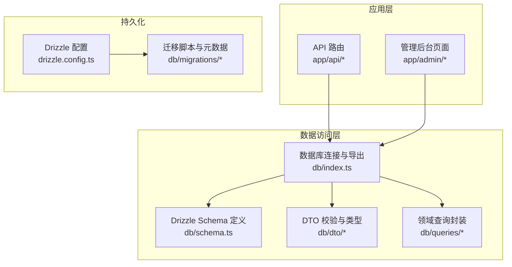
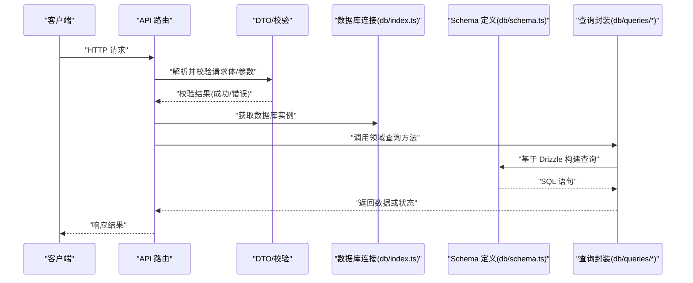
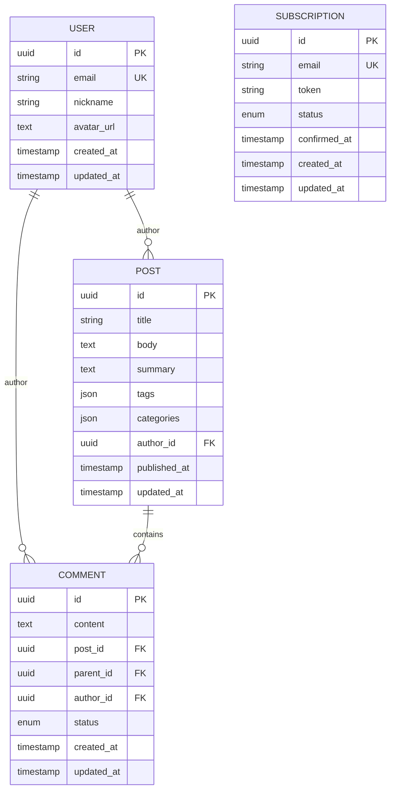
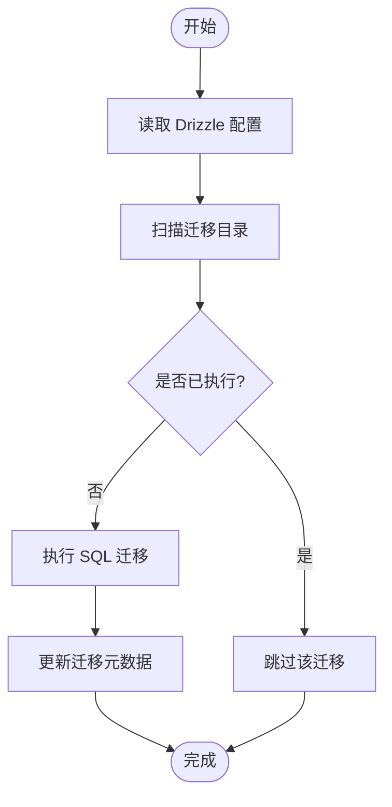
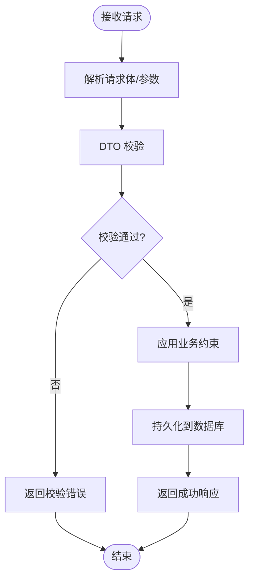
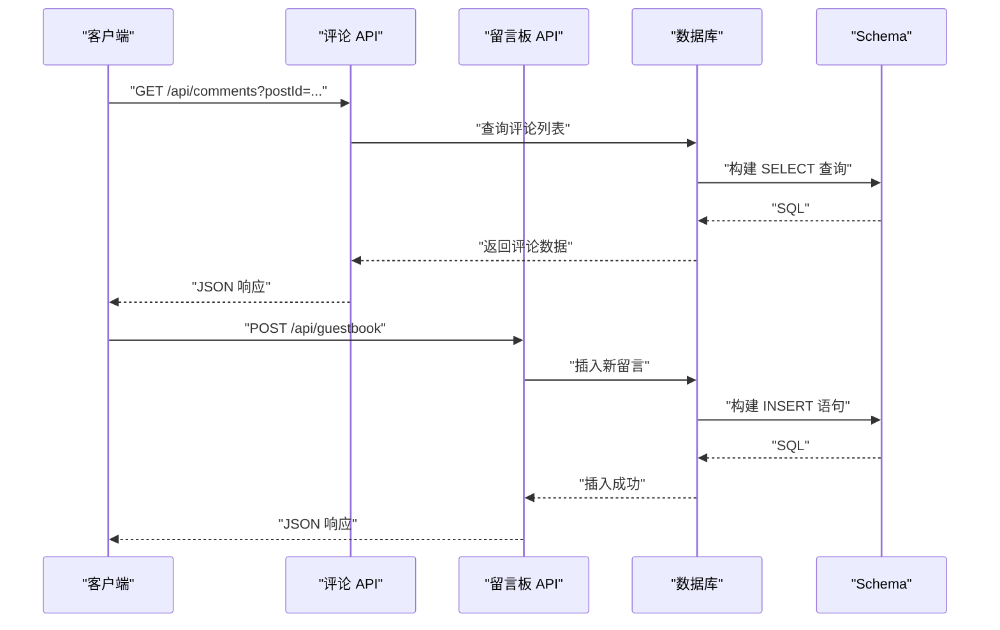
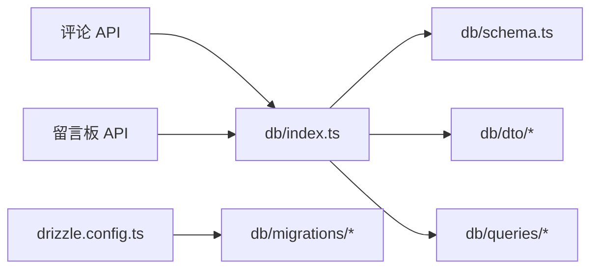

# 数据库设计

<cite>
**本文引用的文件**   
- [db/schema.ts](file://db/schema.ts)
- [db/index.ts](file://db/index.ts)
- [drizzle.config.ts](file://drizzle.config.ts)
- [db/migrations/0000_shallow_iron_fist.sql](file://db/migrations/0000_shallow_iron_fist.sql)
- [db/migrations/meta/_journal.json](file://db/migrations/meta/_journal.json)
- [db/migrations/meta/0000_snapshot.json](file://db/migrations/meta/0000_snapshot.json)
- [db/dto/comment.dto.ts](file://db/dto/comment.dto.ts)
- [db/dto/guestbook.dto.ts](file://db/dto/guestbook.dto.ts)
- [db/queries/guestbook.ts](file://db/queries/guestbook.ts)
- [app/api/comments/[id]/route.ts](file://app/api/comments/[id]/route.ts)
- [app/api/guestbook/route.ts](file://app/api/guestbook/route.ts)
- [lib/validation.ts](file://lib/validation.ts)
</cite>

## 目录
1. [简介](#简介)
2. [项目结构](#项目结构)
3. [核心组件](#核心组件)
4. [架构总览](#架构总览)
5. [详细组件分析](#详细组件分析)
6. [依赖关系分析](#依赖关系分析)
7. [性能考虑](#性能考虑)
8. [故障排查指南](#故障排查指南)
9. [结论](#结论)
10. [附录](#附录)

## 简介
本文件为 cali.so 项目的数据库设计文档，聚焦于使用 Drizzle ORM 的模型定义、实体关系与数据结构设计。文档覆盖用户数据、博客内容、评论留言、订阅信息等核心实体的设计原则，并给出 schema 图示、索引策略、查询优化与数据访问模式说明。同时包含数据验证规则、业务约束与完整性检查，以及备份恢复、性能监控与扩展性建议。

## 项目结构
本项目采用 Next.js + Drizzle ORM 的架构，数据库相关代码集中在 db 目录，API 路由位于 app/api，迁移脚本位于 db/migrations，Drizzle 配置在 drizzle.config.ts。

图表来源
- [db/index.ts:1-200](file://db/index.ts#L1-L200)
- [db/schema.ts:1-200](file://db/schema.ts#L1-L200)
- [drizzle.config.ts:1-200](file://drizzle.config.ts#L1-L200)
- [db/migrations/0000_shallow_iron_fist.sql:1-200](file://db/migrations/0000_shallow_iron_fist.sql#L1-L200)

章节来源
- [db/index.ts:1-200](file://db/index.ts#L1-L200)
- [db/schema.ts:1-200](file://db/schema.ts#L1-L200)
- [drizzle.config.ts:1-200](file://drizzle.config.ts#L1-L200)
- [db/migrations/0000_shallow_iron_fist.sql:1-200](file://db/migrations/0000_shallow_iron_fist.sql#L1-L200)

## 核心组件
- 数据库连接与导出：提供统一的数据库实例与表对象导出，供 API 与管理端复用。
- Schema 定义：以 Drizzle 风格声明式定义表结构、字段类型、约束与索引。
- DTO 与校验：对输入数据进行结构化校验与类型转换，确保写入数据的正确性。
- 查询封装：将常用查询逻辑封装到模块中，提升可维护性与一致性。
- 迁移管理：通过 Drizzle 迁移工具生成与执行 SQL 变更，保证环境一致性。

章节来源
- [db/index.ts:1-200](file://db/index.ts#L1-L200)
- [db/schema.ts:1-200](file://db/schema.ts#L1-L200)
- [db/dto/comment.dto.ts:1-200](file://db/dto/comment.dto.ts#L1-L200)
- [db/dto/guestbook.dto.ts:1-200](file://db/dto/guestbook.dto.ts#L1-L200)
- [db/queries/guestbook.ts:1-200](file://db/queries/guestbook.ts#L1-L200)
- [drizzle.config.ts:1-200](file://drizzle.config.ts#L1-L200)

## 架构总览
下图展示了从 API 请求到数据库操作的完整链路，包括参数校验、事务处理（如需要）、查询构建与结果返回。

图表来源
- [app/api/comments/[id]/route.ts:1-200](file://app/api/comments/[id]/route.ts#L1-L200)
- [app/api/guestbook/route.ts:1-200](file://app/api/guestbook/route.ts#L1-L200)
- [db/index.ts:1-200](file://db/index.ts#L1-L200)
- [db/schema.ts:1-200](file://db/schema.ts#L1-L200)
- [db/queries/guestbook.ts:1-200](file://db/queries/guestbook.ts#L1-L200)

## 详细组件分析

### 数据模型与实体关系
- 用户数据：通常包含唯一标识、认证信息、邮箱、昵称、头像等；对外暴露最小必要字段。
- 博客内容：文章标题、正文、摘要、标签、分类、发布时间、更新时间、作者关联等。
- 评论留言：评论内容、作者、所属文章、父评论（支持嵌套）、审核状态、时间戳等。
- 订阅信息：订阅者邮箱、确认令牌、订阅状态、创建与更新时间等。

图表来源
- [db/schema.ts:1-200](file://db/schema.ts#L1-L200)

章节来源
- [db/schema.ts:1-200](file://db/schema.ts#L1-L200)

### Drizzle ORM 使用模式
- 连接与导出：在统一入口初始化数据库连接并导出表对象，避免重复创建连接。
- 类型安全：通过 Drizzle 的类型推断，在查询构建时获得强类型提示，减少运行时错误。
- 查询构建：使用 select、insert、update、delete 等方法组合条件、排序与分页。
- 事务支持：对多步写操作使用事务保证一致性。

章节来源
- [db/index.ts:1-200](file://db/index.ts#L1-L200)
- [db/schema.ts:1-200](file://db/schema.ts#L1-L200)

### 数据迁移管理
- 迁移脚本：每个版本对应一个 SQL 文件，记录表结构变更。
- 元数据：迁移日志与快照用于追踪已执行迁移与当前 schema 状态。
- 配置：drizzle.config.ts 指定数据库连接与迁移路径。

图表来源
- [drizzle.config.ts:1-200](file://drizzle.config.ts#L1-L200)
- [db/migrations/0000_shallow_iron_fist.sql:1-200](file://db/migrations/0000_shallow_iron_fist.sql#L1-L200)
- [db/migrations/meta/_journal.json:1-200](file://db/migrations/meta/_journal.json#L1-L200)
- [db/migrations/meta/0000_snapshot.json:1-200](file://db/migrations/meta/0000_snapshot.json#L1-L200)

章节来源
- [drizzle.config.ts:1-200](file://drizzle.config.ts#L1-L200)
- [db/migrations/0000_shallow_iron_fist.sql:1-200](file://db/migrations/0000_shallow_iron_fist.sql#L1-L200)
- [db/migrations/meta/_journal.json:1-200](file://db/migrations/meta/_journal.json#L1-L200)
- [db/migrations/meta/0000_snapshot.json:1-200](file://db/migrations/meta/0000_snapshot.json#L1-L200)

### 数据验证与业务约束
- DTO 校验：对评论与留言板输入进行字段类型、长度、必填等校验。
- 业务约束：例如评论必须属于某篇文章、订阅邮箱唯一、状态枚举限制等。
- 完整性检查：通过数据库外键与唯一约束保障数据一致性。

图表来源
- [db/dto/comment.dto.ts:1-200](file://db/dto/comment.dto.ts#L1-L200)
- [db/dto/guestbook.dto.ts:1-200](file://db/dto/guestbook.dto.ts#L1-L200)
- [lib/validation.ts:1-200](file://lib/validation.ts#L1-L200)

章节来源
- [db/dto/comment.dto.ts:1-200](file://db/dto/comment.dto.ts#L1-L200)
- [db/dto/guestbook.dto.ts:1-200](file://db/dto/guestbook.dto.ts#L1-L200)
- [lib/validation.ts:1-200](file://lib/validation.ts#L1-L200)

### 查询优化与数据访问模式
- 索引策略：对高频查询字段建立索引，如文章 slug、评论 post_id、订阅邮箱等。
- 分页与排序：列表接口采用分页与排序，避免一次性加载大量数据。
- 缓存策略：热点数据（如首页文章列表）可使用 Redis 缓存，降低数据库压力。
- 只读副本：读多写少场景可引入只读副本分担查询负载。

章节来源
- [db/queries/guestbook.ts:1-200](file://db/queries/guestbook.ts#L1-L200)
- [app/api/guestbook/route.ts:1-200](file://app/api/guestbook/route.ts#L1-L200)

### API 集成示例：评论与留言板
- 评论接口：根据文章 ID 获取评论列表、新增评论、删除评论等。
- 留言板接口：提交留言、拉取最新留言、管理员审核等。

图表来源
- [app/api/comments/[id]/route.ts:1-200](file://app/api/comments/[id]/route.ts#L1-L200)
- [app/api/guestbook/route.ts:1-200](file://app/api/guestbook/route.ts#L1-L200)
- [db/index.ts:1-200](file://db/index.ts#L1-L200)
- [db/schema.ts:1-200](file://db/schema.ts#L1-L200)

章节来源
- [app/api/comments/[id]/route.ts:1-200](file://app/api/comments/[id]/route.ts#L1-L200)
- [app/api/guestbook/route.ts:1-200](file://app/api/guestbook/route.ts#L1-L200)

## 依赖关系分析
- 低耦合：API 路由仅依赖数据库连接与查询封装，不直接操作底层 SQL。
- 高内聚：Schema 与 DTO 集中管理数据模型与校验规则，便于演进与维护。
- 外部依赖：Drizzle 作为 ORM 抽象数据库差异，迁移工具负责版本控制。

图表来源
- [app/api/comments/[id]/route.ts:1-200](file://app/api/comments/[id]/route.ts#L1-L200)
- [app/api/guestbook/route.ts:1-200](file://app/api/guestbook/route.ts#L1-L200)
- [db/index.ts:1-200](file://db/index.ts#L1-L200)
- [db/schema.ts:1-200](file://db/schema.ts#L1-L200)
- [db/dto/comment.dto.ts:1-200](file://db/dto/comment.dto.ts#L1-L200)
- [db/dto/guestbook.dto.ts:1-200](file://db/dto/guestbook.dto.ts#L1-L200)
- [db/queries/guestbook.ts:1-200](file://db/queries/guestbook.ts#L1-L200)
- [drizzle.config.ts:1-200](file://drizzle.config.ts#L1-L200)
- [db/migrations/0000_shallow_iron_fist.sql:1-200](file://db/migrations/0000_shallow_iron_fist.sql#L1-L200)

章节来源
- [db/index.ts:1-200](file://db/index.ts#L1-L200)
- [db/schema.ts:1-200](file://db/schema.ts#L1-L200)
- [db/dto/comment.dto.ts:1-200](file://db/dto/comment.dto.ts#L1-L200)
- [db/dto/guestbook.dto.ts:1-200](file://db/dto/guestbook.dto.ts#L1-L200)
- [db/queries/guestbook.ts:1-200](file://db/queries/guestbook.ts#L1-L200)
- [drizzle.config.ts:1-200](file://drizzle.config.ts#L1-L200)
- [db/migrations/0000_shallow_iron_fist.sql:1-200](file://db/migrations/0000_shallow_iron_fist.sql#L1-L200)

## 性能考虑
- 索引设计：为外键与高频过滤字段添加索引，避免全表扫描。
- 查询裁剪：仅选择必要字段，减少网络传输与内存占用。
- 分页与游标：大数据集采用分页或基于游标的分页，提高首屏加载速度。
- 读写分离：读多写少场景引入只读副本，提升整体吞吐。
- 缓存策略：热点数据使用 Redis 缓存，设置合理过期时间与失效策略。
- 慢查询监控：开启数据库慢查询日志，定期分析与优化。

[本节为通用指导，无需特定文件来源]

## 故障排查指南
- 迁移失败：检查迁移元数据与当前数据库状态，回滚或修复后重试。
- 校验错误：定位 DTO 校验失败的具体字段，修正前端输入或后端规则。
- 外键冲突：插入或更新前检查关联记录是否存在，必要时使用级联操作。
- 连接池耗尽：调整连接池大小与超时参数，监控数据库连接数。
- 锁等待：识别长事务与热点行锁，拆分事务或优化并发策略。

章节来源
- [db/migrations/meta/_journal.json:1-200](file://db/migrations/meta/_journal.json#L1-L200)
- [db/dto/comment.dto.ts:1-200](file://db/dto/comment.dto.ts#L1-L200)
- [db/dto/guestbook.dto.ts:1-200](file://db/dto/guestbook.dto.ts#L1-L200)

## 结论
本项目通过 Drizzle ORM 实现了类型安全的数据库建模与查询构建，结合 DTO 校验与迁移管理，保证了数据一致性与可维护性。建议在后续迭代中持续完善索引策略、引入缓存与读写分离，并建立完善的监控与告警体系，以提升系统稳定性与可扩展性。

[本节为总结性内容，无需特定文件来源]

## 附录
- 备份与恢复：定期全量备份与增量备份，演练恢复流程，确保 RTO/RPO 目标达成。
- 扩展性：分库分表、水平扩展与垂直扩展策略，按业务增长逐步演进。
- 安全：敏感字段加密存储，最小权限原则，审计日志与合规要求。

[本节为通用指导，无需特定文件来源]