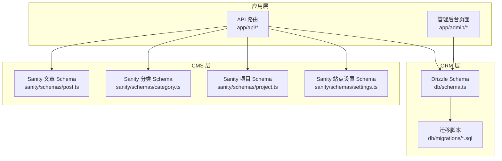
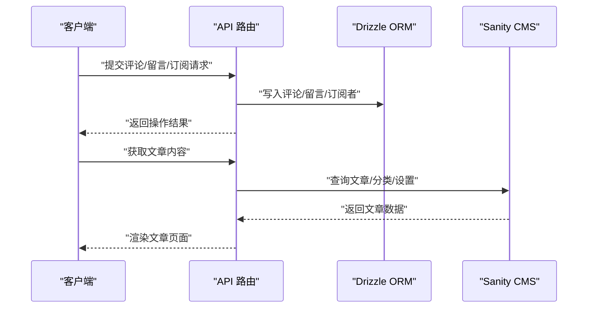
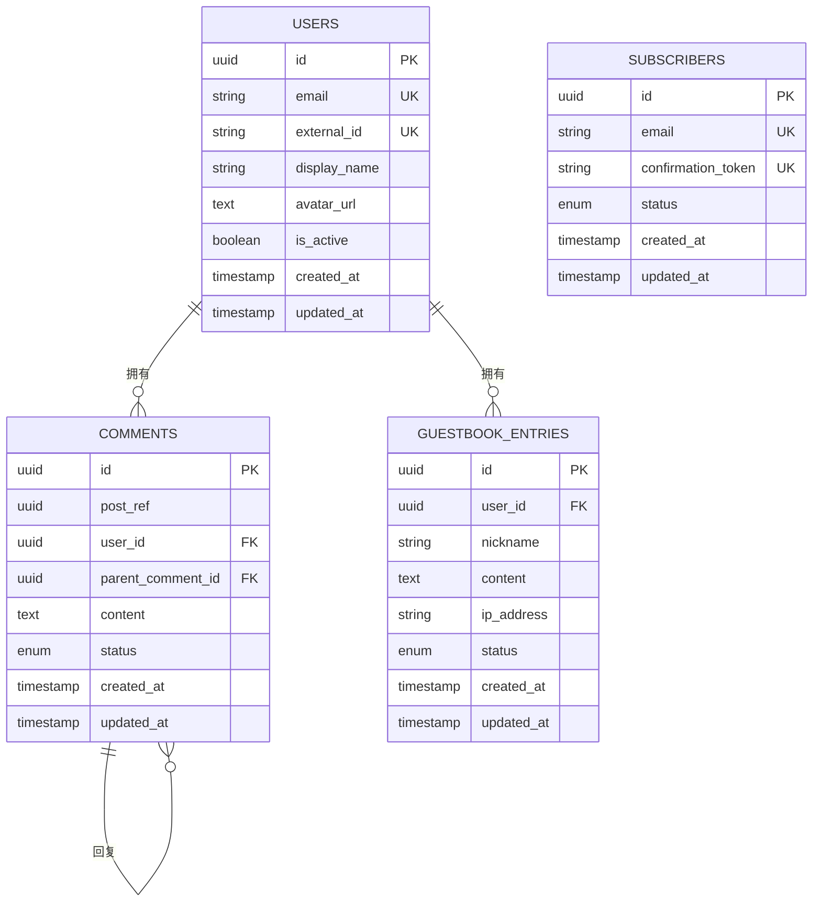
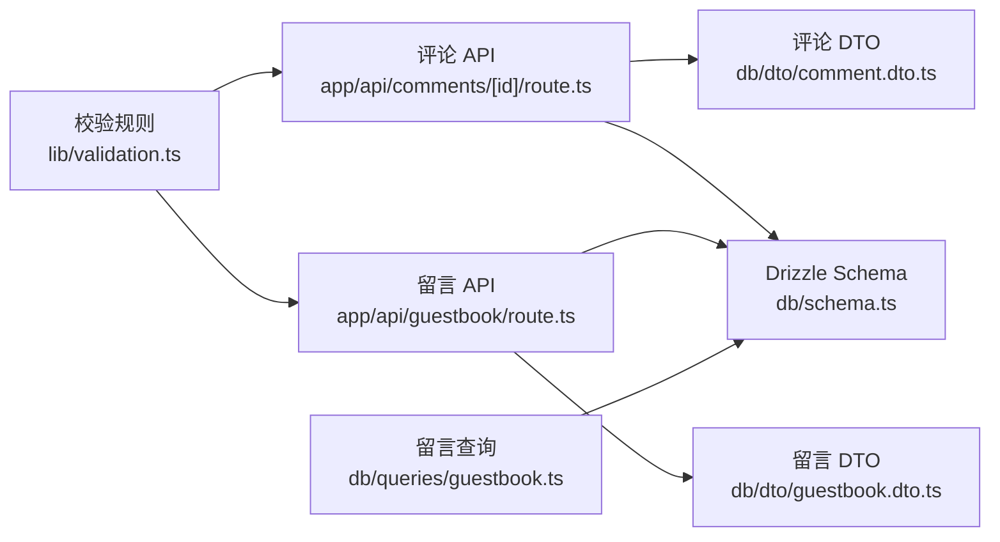

# 数据模型设计

<cite>
**本文引用的文件**   
- [db/schema.ts](file://db/schema.ts)
- [db/migrations/0000_shallow_iron_fist.sql](file://db/migrations/0000_shallow_iron_fist.sql)
- [db/dto/comment.dto.ts](file://db/dto/comment.dto.ts)
- [db/dto/guestbook.dto.ts](file://db/dto/guestbook.dto.ts)
- [db/queries/guestbook.ts](file://db/queries/guestbook.ts)
- [app/api/comments/[id]/route.ts](file://app/api/comments/[id]/route.ts)
- [app/api/guestbook/route.ts](file://app/api/guestbook/route.ts)
- [sanity/schemas/post.ts](file://sanity/schemas/post.ts)
- [sanity/schemas/category.ts](file://sanity/schemas/category.ts)
- [sanity/schemas/project.ts](file://sanity/schemas/project.ts)
- [sanity/schemas/settings.ts](file://sanity/schemas/settings.ts)
- [lib/validation.ts](file://lib/validation.ts)
</cite>

## 目录
1. [引言](#引言)
2. [项目结构](#项目结构)
3. [核心组件](#核心组件)
4. [架构总览](#架构总览)
5. [详细组件分析](#详细组件分析)
6. [依赖分析](#依赖分析)
7. [性能考虑](#性能考虑)
8. [故障排查指南](#故障排查指南)
9. [结论](#结论)
10. [附录](#附录)

## 引言
本文件面向 cali.so 项目的数据模型设计与实现，聚焦于关系型数据库（Drizzle ORM + SQLite）与内容管理系统（Sanity）两部分的数据建模。文档将：
- 梳理用户、博客文章、评论、访客留言、订阅者等核心实体的数据结构
- 说明字段定义、数据类型选择、约束条件与业务规则
- 提供实体关系图（ERD）与表结构说明
- 解释数据验证规则、默认值设置和外键关联
- 给出命名规范、索引策略与性能优化建议

## 项目结构
本项目采用“双存储”策略：
- 结构化业务数据（评论、访客留言、订阅者等）使用 Drizzle ORM 管理，迁移脚本位于 db/migrations，Schema 定义在 db/schema.ts
- 富文本内容与站点配置使用 Sanity CMS，Schema 定义在 sanity/schemas 下

图表来源
- [db/schema.ts](file://db/schema.ts)
- [db/migrations/0000_shallow_iron_fist.sql](file://db/migrations/0000_shallow_iron_fist.sql)
- [sanity/schemas/post.ts](file://sanity/schemas/post.ts)
- [sanity/schemas/category.ts](file://sanity/schemas/category.ts)
- [sanity/schemas/project.ts](file://sanity/schemas/project.ts)
- [sanity/schemas/settings.ts](file://sanity/schemas/settings.ts)

章节来源
- [db/schema.ts](file://db/schema.ts)
- [db/migrations/0000_shallow_iron_fist.sql](file://db/migrations/0000_shallow_iron_fist.sql)
- [sanity/schemas/post.ts](file://sanity/schemas/post.ts)
- [sanity/schemas/category.ts](file://sanity/schemas/category.ts)
- [sanity/schemas/project.ts](file://sanity/schemas/project.ts)
- [sanity/schemas/settings.ts](file://sanity/schemas/settings.ts)

## 核心组件
本节概述关键实体及其职责：
- 用户（User）：系统身份主体，用于评论、订阅、访客留言等场景的归属与权限控制
- 博客文章（Blog Post）：由 Sanity 管理的富文本内容实体，包含标题、正文、分类、阅读时间等
- 评论（Comment）：针对文章或页面的结构化评论，支持回复与审核流程
- 访客留言（Guestbook Entry）：匿名或登录用户的公开留言
- 订阅者（Subscriber）：订阅邮件列表的用户记录，含确认令牌与状态

章节来源
- [db/schema.ts](file://db/schema.ts)
- [db/dto/comment.dto.ts](file://db/dto/comment.dto.ts)
- [db/dto/guestbook.dto.ts](file://db/dto/guestbook.dto.ts)
- [sanity/schemas/post.ts](file://sanity/schemas/post.ts)
- [sanity/schemas/category.ts](file://sanity/schemas/category.ts)
- [sanity/schemas/project.ts](file://sanity/schemas/project.ts)
- [sanity/schemas/settings.ts](file://sanity/schemas/settings.ts)

## 架构总览
下图展示从前端到后端再到数据存储的整体数据流，以及 Sanity 与关系型数据库的协作方式。

图表来源
- [app/api/comments/[id]/route.ts](file://app/api/comments/[id]/route.ts)
- [app/api/guestbook/route.ts](file://app/api/guestbook/route.ts)
- [db/schema.ts](file://db/schema.ts)
- [sanity/schemas/post.ts](file://sanity/schemas/post.ts)

## 详细组件分析

### 关系型数据库实体（Drizzle）
本节基于 db/schema.ts 与迁移脚本，梳理核心表结构与字段语义。

#### 用户（users）
- 用途：作为评论、订阅、访客留言等实体的所有者与权限主体
- 关键字段（概念性描述）：唯一标识、外部身份提供者 ID、邮箱、显示名、头像 URL、创建与更新时间戳、软删除标记等
- 约束与默认值：主键自增；邮箱唯一；创建时间默认当前时间；软删除默认 false
- 索引策略：对邮箱、外部身份 ID 建立唯一索引；常用查询字段（如是否活跃）可建普通索引

章节来源
- [db/schema.ts](file://db/schema.ts)

#### 博客文章（posts）
- 说明：文章内容由 Sanity 管理，不在关系型数据库中持久化；此处仅列出与评论/互动相关的引用字段（如文章 slug 或 Sanity 文档 ID），用于外键关联
- 注意：若存在本地缓存或摘要表，应包含 slug、标题、封面图、发布时间、阅读时间等字段，并建立 slug 唯一索引

章节来源
- [sanity/schemas/post.ts](file://sanity/schemas/post.ts)

#### 评论（comments）
- 用途：对文章或页面进行结构化评论，支持嵌套回复
- 关键字段（概念性描述）：主键、所属文章 ID（或 Sanity 文档 ID）、作者用户 ID（可为空表示匿名）、父评论 ID（用于回复）、内容、状态（待审/通过/拒绝）、创建与更新时间戳
- 约束与默认值：状态默认“待审”；父评论为可选外键；内容非空
- 索引策略：按文章 ID 与创建时间排序查询频繁，建议建立复合索引（文章 ID, 创建时间）；状态字段可建普通索引以支持审核筛选

章节来源
- [db/schema.ts](file://db/schema.ts)
- [db/dto/comment.dto.ts](file://db/dto/comment.dto.ts)
- [app/api/comments/[id]/route.ts](file://app/api/comments/[id]/route.ts)

#### 访客留言（guestbook_entries）
- 用途：公开留言板条目，支持匿名或登录用户
- 关键字段（概念性描述）：主键、作者用户 ID（可选）、昵称、内容、IP 地址（脱敏存储）、状态（待审/通过/拒绝）、创建与更新时间戳
- 约束与默认值：状态默认“待审”；内容非空；IP 长度限制
- 索引策略：按创建时间倒序分页；可按状态筛选，建议建立状态与时间的复合索引

章节来源
- [db/schema.ts](file://db/schema.ts)
- [db/dto/guestbook.dto.ts](file://db/dto/guestbook.dto.ts)
- [db/queries/guestbook.ts](file://db/queries/guestbook.ts)
- [app/api/guestbook/route.ts](file://app/api/guestbook/route.ts)

#### 订阅者（subscribers）
- 用途：邮件订阅列表，包含确认令牌与状态
- 关键字段（概念性描述）：主键、邮箱、确认令牌、状态（未确认/已确认/退订）、创建与更新时间戳
- 约束与默认值：邮箱唯一；状态默认“未确认”；令牌唯一且不可为空
- 索引策略：邮箱与令牌需唯一索引；按状态筛选常见，建议建立状态索引

章节来源
- [db/schema.ts](file://db/schema.ts)

#### 迁移脚本概览
- 目的：确保数据库结构与代码一致，便于版本管理与回滚
- 内容：包含上述表的 DDL 语句、索引与约束定义

章节来源
- [db/migrations/0000_shallow_iron_fist.sql](file://db/migrations/0000_shallow_iron_fist.sql)

### Sanity 内容模型（CMS）
Sanity 负责富文本与站点配置，以下为关键类型：

#### 文章（post）
- 字段（概念性描述）：标题、正文（Portable Text）、封面图、分类引用、标签、阅读时间估算、发布状态、创建与更新时间戳
- 规则：标题必填；正文为 Portable Text 块；分类为多对一引用；发布状态控制可见性

章节来源
- [sanity/schemas/post.ts](file://sanity/schemas/post.ts)

#### 分类（category）
- 字段（概念性描述）：名称、slug、描述
- 规则：slug 唯一，用于 URL 友好路径

章节来源
- [sanity/schemas/category.ts](file://sanity/schemas/category.ts)

#### 项目（project）
- 字段（概念性描述）：名称、描述、链接、技术栈、封面图、状态
- 用途：展示个人项目集合

章节来源
- [sanity/schemas/project.ts](file://sanity/schemas/project.ts)

#### 站点设置（settings）
- 字段（概念性描述）：站点标题、描述、社交链接、SEO 元信息
- 用途：全局配置项

章节来源
- [sanity/schemas/settings.ts](file://sanity/schemas/settings.ts)

### 数据验证与业务规则
- 输入校验：统一在 lib/validation.ts 中定义校验规则，包括必填、长度、格式、枚举值等
- 默认值：在 Schema 层设置默认值（如状态、时间戳），减少业务逻辑负担
- 外键关联：评论与访客留言可关联用户（可选），评论支持自引用（父评论）形成树形结构
- 状态机：评论与留言采用“待审/通过/拒绝”三态；订阅者采用“未确认/已确认/退订”三态

章节来源
- [lib/validation.ts](file://lib/validation.ts)
- [db/dto/comment.dto.ts](file://db/dto/comment.dto.ts)
- [db/dto/guestbook.dto.ts](file://db/dto/guestbook.dto.ts)

### ERD（实体关系图）

图表来源
- [db/schema.ts](file://db/schema.ts)

## 依赖分析
- 模块耦合
  - API 路由依赖 DTO 与 Schema，完成参数校验与持久化
  - 查询层（queries）封装复杂检索逻辑，提升可读性与复用性
  - Sanity 与关系型数据库解耦，分别服务于富文本与结构化数据
- 外部依赖
  - Drizzle ORM 负责 SQL 生成与迁移
  - Sanity SDK 负责内容读写
  - 验证库（如 zod）在 lib/validation.ts 中集中管理校验规则

图表来源
- [app/api/comments/[id]/route.ts](file://app/api/comments/[id]/route.ts)
- [app/api/guestbook/route.ts](file://app/api/guestbook/route.ts)
- [db/dto/comment.dto.ts](file://db/dto/comment.dto.ts)
- [db/dto/guestbook.dto.ts](file://db/dto/guestbook.dto.ts)
- [db/queries/guestbook.ts](file://db/queries/guestbook.ts)
- [db/schema.ts](file://db/schema.ts)
- [lib/validation.ts](file://lib/validation.ts)

章节来源
- [app/api/comments/[id]/route.ts](file://app/api/comments/[id]/route.ts)
- [app/api/guestbook/route.ts](file://app/api/guestbook/route.ts)
- [db/dto/comment.dto.ts](file://db/dto/comment.dto.ts)
- [db/dto/guestbook.dto.ts](file://db/dto/guestbook.dto.ts)
- [db/queries/guestbook.ts](file://db/queries/guestbook.ts)
- [db/schema.ts](file://db/schema.ts)
- [lib/validation.ts](file://lib/validation.ts)

## 性能考虑
- 索引策略
  - 高频查询字段建立索引：评论与留言按文章/时间与状态组合查询，建议复合索引
  - 唯一性字段建立唯一索引：邮箱、令牌、slug 等
- 分页与排序
  - 使用游标或基于时间戳的分页，避免深度偏移带来的性能问题
- 缓存与降级
  - 对热点文章与静态配置引入缓存层（如 Redis），降低 CMS 与数据库压力
- 数据裁剪
  - 按需返回字段，避免大对象（如正文）在列表接口中传输
- 事务与一致性
  - 涉及多表写入时启用事务，保证数据一致性

[本节为通用指导，不直接分析具体文件]

## 故障排查指南
- 常见问题
  - 重复插入：检查唯一约束（邮箱、令牌、slug）
  - 外键失败：确认关联实体是否存在，或允许空值的字段是否正确处理
  - 状态不一致：核对状态机转换逻辑与默认值设置
- 定位方法
  - 查看迁移脚本与实际表结构差异
  - 检查 API 路由中的校验与错误处理分支
  - 审查 DTO 与 Schema 字段映射是否一致

章节来源
- [db/migrations/0000_shallow_iron_fist.sql](file://db/migrations/0000_shallow_iron_fist.sql)
- [app/api/comments/[id]/route.ts](file://app/api/comments/[id]/route.ts)
- [app/api/guestbook/route.ts](file://app/api/guestbook/route.ts)

## 结论
本项目采用“CMS + 关系型数据库”的双存储架构，既满足富文本内容的灵活编辑，又保障结构化数据的强一致与高性能查询。通过清晰的 Schema 定义、严格的校验规则与合理的索引策略，系统在可扩展性与可维护性方面具备良好基础。后续可在缓存、审计日志与国际化等方面持续完善。

[本节为总结性内容，不直接分析具体文件]

## 附录

### 命名规范
- 表名与字段名使用小写下划线风格（snake_case）
- 主键统一命名为 id，类型为 UUID
- 时间戳字段统一为 created_at、updated_at
- 状态字段使用枚举类型，并在注释中明确取值范围

### 索引策略清单
- 唯一索引：邮箱、令牌、slug
- 复合索引：（文章 ID, 创建时间）、（状态, 创建时间）
- 普通索引：用户 ID、父评论 ID（用于快速查找子评论）

### 默认值与约束
- 状态默认值：评论/留言“待审”，订阅者“未确认”
- 时间戳默认值：created_at 为当前时间
- 非空约束：内容、邮箱、令牌等关键字段

[本节为通用指导，不直接分析具体文件]