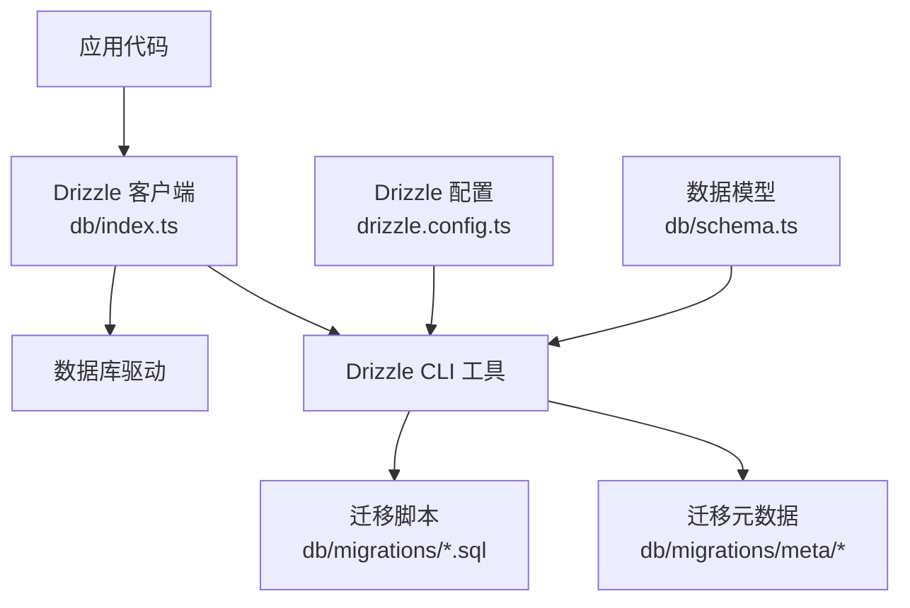
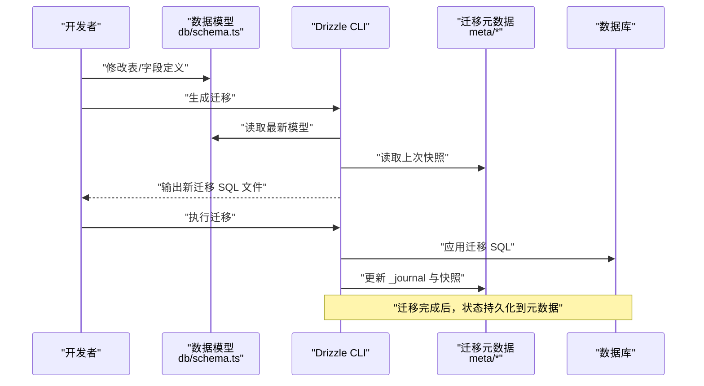
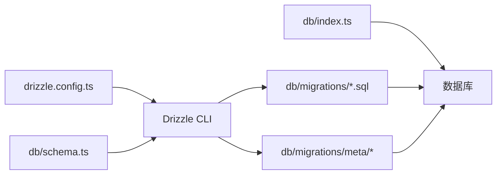
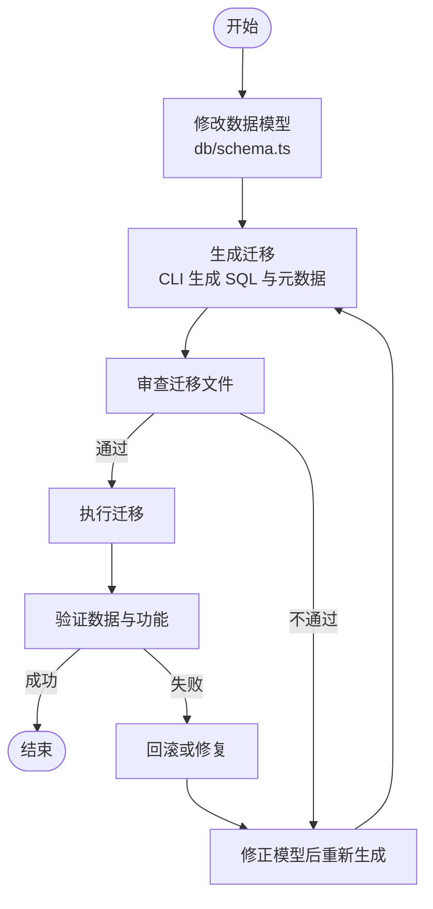

# 数据迁移管理

<cite>
**本文引用的文件**
- [drizzle.config.ts](file://drizzle.config.ts)
- [db/index.ts](file://db/index.ts)
- [db/schema.ts](file://db/schema.ts)
- [db/migrations/meta/_journal.json](file://db/migrations/meta/_journal.json)
- [db/migrations/meta/0000_snapshot.json](file://db/migrations/meta/0000_snapshot.json)
- [db/migrations/0000_shallow_iron_fist.sql](file://db/migrations/0000_shallow_iron_fist.sql)
- [package.json](file://package.json)
</cite>

## 目录
1. [简介](#简介)
2. [项目结构](#项目结构)
3. [核心组件](#核心组件)
4. [架构总览](#架构总览)
5. [详细组件分析](#详细组件分析)
6. [依赖关系分析](#依赖关系分析)
7. [性能考虑](#性能考虑)
8. [故障排查指南](#故障排查指南)
9. [结论](#结论)
10. [附录](#附录)

## 简介
本文件面向 cali.so 项目的数据库迁移管理，聚焦 Drizzle Migration 的工作原理与使用方法。内容涵盖：
- 如何创建、执行和管理迁移文件
- 迁移版本控制与元数据机制
- 回滚策略与冲突解决
- 向后兼容性、数据备份与测试策略
- 生产环境部署流程与故障恢复方案

## 项目结构
本项目使用 Drizzle ORM 进行数据库建模与迁移，相关代码集中在 db 目录与根级配置文件 drizzle.config.ts 中。关键位置如下：
- 配置与驱动：drizzle.config.ts
- 运行时连接与客户端：db/index.ts
- 数据模型定义：db/schema.ts
- 迁移脚本与元数据：db/migrations/*

图表来源
- [drizzle.config.ts](file://drizzle.config.ts)
- [db/index.ts](file://db/index.ts)
- [db/schema.ts](file://db/schema.ts)
- [db/migrations/meta/_journal.json](file://db/migrations/meta/_journal.json)
- [db/migrations/meta/0000_snapshot.json](file://db/migrations/meta/0000_snapshot.json)
- [db/migrations/0000_shallow_iron_fist.sql](file://db/migrations/0000_shallow_iron_fist.sql)

章节来源
- [drizzle.config.ts](file://drizzle.config.ts)
- [db/index.ts](file://db/index.ts)
- [db/schema.ts](file://db/schema.ts)
- [db/migrations/meta/_journal.json](file://db/migrations/meta/_journal.json)
- [db/migrations/meta/0000_snapshot.json](file://db/migrations/meta/0000_snapshot.json)
- [db/migrations/0000_shallow_iron_fist.sql](file://db/migrations/0000_shallow_iron_fist.sql)

## 核心组件
- Drizzle 配置（drizzle.config.ts）
  - 负责指定数据库连接信息、迁移目录、快照生成等。CLI 命令读取该配置以定位迁移与目标数据库。
- 运行时连接（db/index.ts）
  - 提供 Drizzle 客户端实例，供业务代码访问数据库；通常不直接执行迁移，但需确保运行环境与迁移一致。
- 数据模型（db/schema.ts）
  - 声明式定义表、字段、索引等；用于生成迁移 SQL 与类型推导。
- 迁移脚本与元数据（db/migrations/*）
  - SQL 迁移脚本：实际变更数据库结构的语句。
  - 元数据：记录已应用的迁移顺序、快照对比等，保证幂等与一致性。

章节来源
- [drizzle.config.ts](file://drizzle.config.ts)
- [db/index.ts](file://db/index.ts)
- [db/schema.ts](file://db/schema.ts)
- [db/migrations/meta/_journal.json](file://db/migrations/meta/_journal.json)
- [db/migrations/meta/0000_snapshot.json](file://db/migrations/meta/0000_snapshot.json)
- [db/migrations/0000_shallow_iron_fist.sql](file://db/migrations/0000_shallow_iron_fist.sql)

## 架构总览
下图展示了从“修改 schema”到“生成并执行迁移”的端到端流程，以及运行时对迁移状态的校验。

图表来源
- [db/schema.ts](file://db/schema.ts)
- [db/migrations/meta/_journal.json](file://db/migrations/meta/_journal.json)
- [db/migrations/meta/0000_snapshot.json](file://db/migrations/meta/0000_snapshot.json)
- [db/migrations/0000_shallow_iron_fist.sql](file://db/migrations/0000_shallow_iron_fist.sql)

## 详细组件分析

### 迁移配置与入口（drizzle.config.ts）
- 作用
  - 定义数据库连接参数、迁移目录、快照行为等，是 Drizzle CLI 的统一入口。
- 关键点
  - 迁移目录指向 db/migrations，确保生成的 SQL 与元数据落盘路径正确。
  - 连接信息与驱动选择应与运行时 db/index.ts 保持一致，避免环境差异导致迁移失败。
- 建议
  - 将敏感信息通过环境变量注入，不在仓库中硬编码。
  - 为不同环境（开发/预发/生产）维护独立配置或环境变量前缀。

章节来源
- [drizzle.config.ts](file://drizzle.config.ts)

### 运行时数据库客户端（db/index.ts）
- 作用
  - 初始化并导出 Drizzle 客户端，供 API、页面与服务逻辑访问数据库。
- 关键点
  - 连接池、超时、重试等参数应结合生产负载调优。
  - 不建议在请求路径中执行迁移，迁移应在部署阶段完成。
- 建议
  - 在容器启动或部署脚本中执行迁移，确保服务可用后再暴露流量。

章节来源
- [db/index.ts](file://db/index.ts)

### 数据模型（db/schema.ts）
- 作用
  - 以 TypeScript 声明式定义表结构与约束，作为迁移生成的唯一事实源。
- 关键点
  - 新增字段优先默认值与非空兼容策略，避免破坏性变更。
  - 复杂变更拆分为多步迁移，降低锁表与长事务风险。
- 建议
  - 为重要表添加注释与命名规范，便于后续维护。
  - 使用索引与约束提升查询性能与数据一致性。

章节来源
- [db/schema.ts](file://db/schema.ts)

### 迁移脚本与元数据（db/migrations/*）
- 迁移脚本（SQL）
  - 由 CLI 根据 schema 差异生成，包含建表、增删改列、索引等语句。
  - 文件名带有序号前缀，体现迁移顺序。
- 元数据
  - _journal.json：记录迁移执行顺序与状态。
  - *_snapshot.json：保存某次迁移后的完整模型快照，用于差异计算。
- 关键点
  - 迁移必须幂等且可重放，避免重复执行造成错误。
  - 大表变更采用分步策略，减少锁竞争与停机时间。

章节来源
- [db/migrations/meta/_journal.json](file://db/migrations/meta/_journal.json)
- [db/migrations/meta/0000_snapshot.json](file://db/migrations/meta/0000_snapshot.json)
- [db/migrations/0000_shallow_iron_fist.sql](file://db/migrations/0000_shallow_iron_fist.sql)

### 命令行与脚本集成（package.json）
- 作用
  - 封装常用迁移命令（如生成、执行、状态查看），统一团队工作流。
- 建议
  - 在 CI/CD 中加入迁移检查与执行步骤，确保发布流水线安全可控。
  - 为不同环境提供不同的脚本别名与环境变量。

章节来源
- [package.json](file://package.json)

## 依赖关系分析
- 组件耦合
  - CLI 依赖 drizzle.config.ts 与 db/schema.ts 生成迁移；运行时依赖 db/index.ts 提供的客户端。
  - 迁移元数据与 SQL 脚本共同构成迁移的可追溯性与幂等性基础。
- 外部依赖
  - 数据库驱动与连接参数由配置决定，需与目标环境一致。
- 潜在循环依赖
  - 迁移生成与执行属于构建/部署期任务，不应在运行时导入，避免循环依赖。

图表来源
- [drizzle.config.ts](file://drizzle.config.ts)
- [db/schema.ts](file://db/schema.ts)
- [db/index.ts](file://db/index.ts)
- [db/migrations/0000_shallow_iron_fist.sql](file://db/migrations/0000_shallow_iron_fist.sql)
- [db/migrations/meta/_journal.json](file://db/migrations/meta/_journal.json)
- [db/migrations/meta/0000_snapshot.json](file://db/migrations/meta/0000_snapshot.json)

## 性能考虑
- 大表变更
  - 分步迁移：先加列/索引，再回填数据，最后删除旧列/索引。
  - 批量更新：分批提交，避免长事务与锁表。
- 索引策略
  - 仅在高频查询条件上建立索引，定期评估无用索引。
- 连接与并发
  - 调整连接池大小与超时，匹配数据库容量与应用负载。
- 迁移窗口
  - 低峰期执行，配合灰度发布与快速回滚预案。

## 故障排查指南
- 常见错误
  - 迁移未执行或重复执行：检查 _journal.json 与数据库中的迁移记录。
  - 连接失败：核对 drizzle.config.ts 的连接参数与网络权限。
  - 锁等待/超时：拆分大事务，优化 SQL，增加重试与退避。
- 诊断步骤
  - 查看最近一次迁移日志与错误堆栈。
  - 比对本地 schema 与线上快照，确认差异是否被正确生成。
  - 在只读副本验证迁移影响面。
- 回滚策略
  - 优先通过反向迁移修复；若不可逆，则从备份恢复并重新应用后续迁移。
  - 保持每次迁移最小化变更范围，提高回滚成功率。

## 结论
通过统一的配置、声明式模型与可追踪的迁移元数据，Drizzle Migration 为 cali.so 提供了可靠的数据库演进能力。遵循分步变更、幂等设计与完善的回滚预案，可在保障稳定性的前提下持续迭代数据结构。

## 附录

### 迁移生命周期流程图

[本图为概念性流程，无需源码映射]

### 最佳实践清单
- 向后兼容
  - 新增字段设置默认值，避免非空突变；删除字段前先下线读取逻辑。
- 数据备份
  - 执行迁移前自动备份关键表或全库快照。
- 测试策略
  - 在隔离环境中回放迁移，覆盖读写路径与边界用例。
- 发布流程
  - 将迁移纳入 CI/CD，按“生成→审查→执行→验证”的顺序自动化。
- 冲突解决
  - 多人协作时合并 schema 后重新生成迁移，保留历史迁移文件，不编辑已应用迁移。