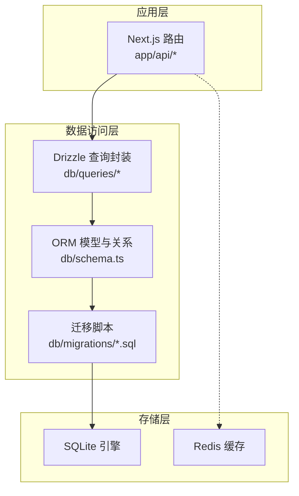
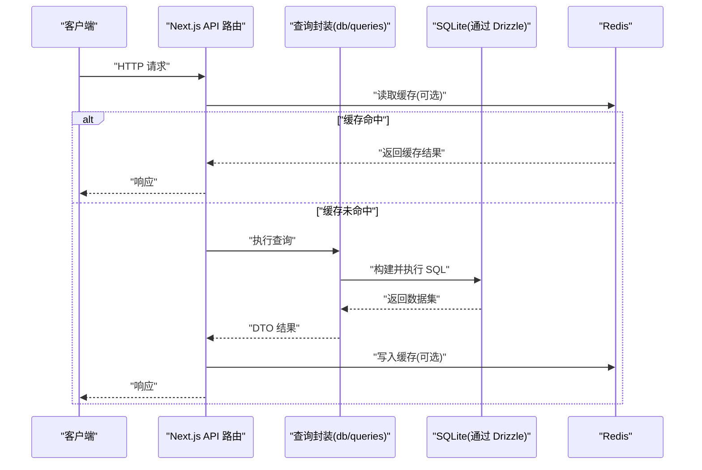
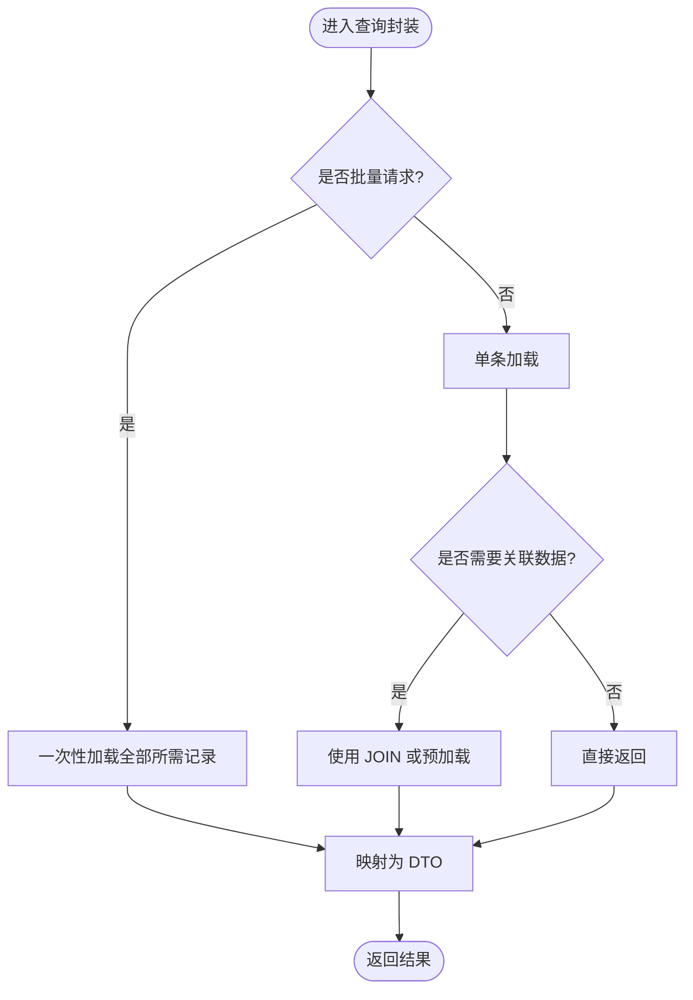
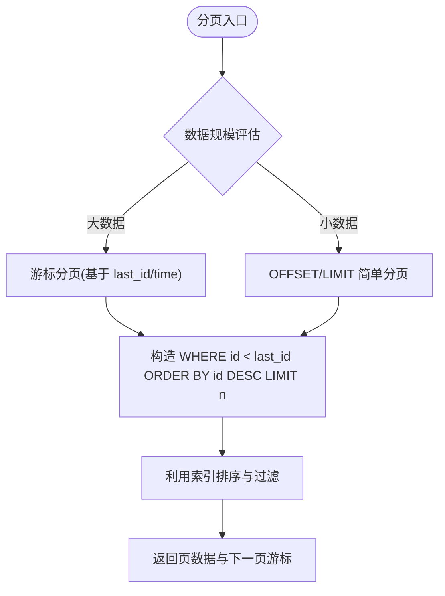
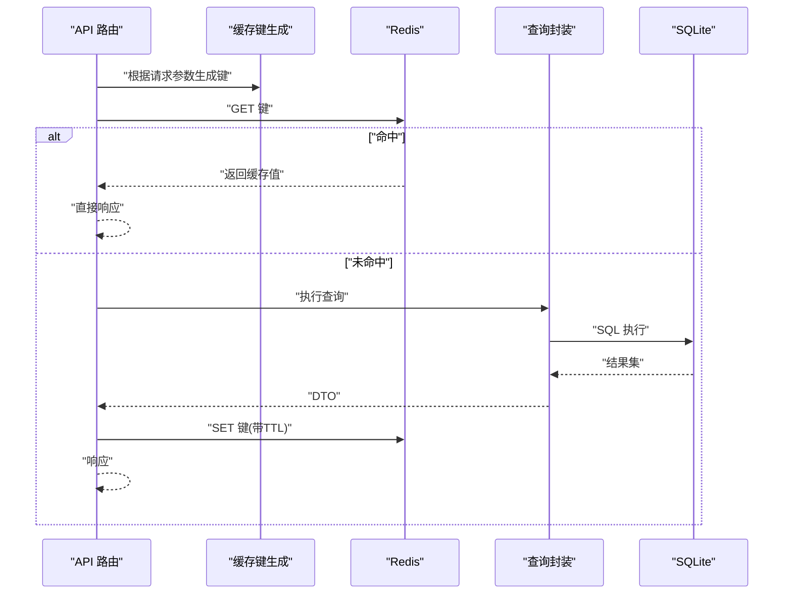
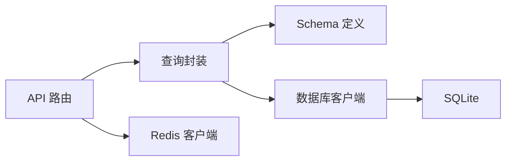

# 查询优化策略

<cite>
**本文引用的文件**   
- [db/index.ts](file://db/index.ts)
- [db/schema.ts](file://db/schema.ts)
- [db/migrations/0000_shallow_iron_fist.sql](file://db/migrations/0000_shallow_iron_fist.sql)
- [db/queries/guestbook.ts](file://db/queries/guestbook.ts)
- [db/dto/comment.dto.ts](file://db/dto/comment.dto.ts)
- [db/dto/guestbook.dto.ts](file://db/dto/guestbook.dto.ts)
- [app/api/comments/[id]/route.ts](file://app/api/comments/[id]/route.ts)
- [app/api/guestbook/route.ts](file://app/api/guestbook/route.ts)
- [lib/redis.ts](file://lib/redis.ts)
- [drizzle.config.ts](file://drizzle.config.ts)
</cite>

## 目录
1. [简介](#简介)
2. [项目结构](#项目结构)
3. [核心组件](#核心组件)
4. [架构总览](#架构总览)
5. [详细组件分析](#详细组件分析)
6. [依赖分析](#依赖分析)
7. [性能考虑](#性能考虑)
8. [故障排查指南](#故障排查指南)
9. [结论](#结论)
10. [附录](#附录)

## 简介
本文件面向 cali.so 项目的数据库查询优化，聚焦于：
- 使用 EXPLAIN 进行查询计划分析与瓶颈定位
- 索引设计与选择策略
- 常见查询模式的重写技巧（N+1、大数据量分页、复杂联表）
- 缓存策略与连接池调优
- 监控指标配置建议
- 读写分离与分库分表的扩展性考量

文档基于仓库中现有的数据库定义、迁移脚本、查询实现与 API 路由进行分析，并提供可落地的优化清单与图示。

## 项目结构
本项目采用 Next.js + Drizzle ORM + SQLite（通过 drizzle-kit 管理迁移）的架构。数据库相关代码集中在 db 目录，API 层在 app/api 下调用数据访问逻辑，Redis 作为可选缓存层位于 lib/redis.ts。

图表来源
- [db/index.ts:1-200](file://db/index.ts#L1-L200)
- [db/schema.ts:1-200](file://db/schema.ts#L1-L200)
- [db/migrations/0000_shallow_iron_fist.sql:1-200](file://db/migrations/0000_shallow_iron_fist.sql#L1-L200)
- [app/api/comments/[id]/route.ts:1-200](file://app/api/comments/[id]/route.ts#L1-L200)
- [app/api/guestbook/route.ts:1-200](file://app/api/guestbook/route.ts#L1-L200)
- [lib/redis.ts:1-200](file://lib/redis.ts#L1-L200)

章节来源
- [db/index.ts:1-200](file://db/index.ts#L1-L200)
- [db/schema.ts:1-200](file://db/schema.ts#L1-L200)
- [db/migrations/0000_shallow_iron_fist.sql:1-200](file://db/migrations/0000_shallow_iron_fist.sql#L1-L200)
- [app/api/comments/[id]/route.ts:1-200](file://app/api/comments/[id]/route.ts#L1-L200)
- [app/api/guestbook/route.ts:1-200](file://app/api/guestbook/route.ts#L1-L200)
- [lib/redis.ts:1-200](file://lib/redis.ts#L1-L200)

## 核心组件
- 数据库连接与驱动初始化：负责创建并暴露数据库客户端实例，供上层模块复用。
- 数据模型与关系定义：集中声明表结构、字段类型、主键与外键约束，便于生成迁移与查询。
- 迁移脚本：将 schema 变更持久化为 SQL，确保环境一致性。
- 查询封装：按领域组织查询方法，统一返回 DTO，减少重复 SQL 拼装。
- API 路由：接收请求参数，调用查询封装，必要时结合 Redis 缓存。
- 缓存层：提供统一的 Redis 存取接口，用于热点数据缓存。

章节来源
- [db/index.ts:1-200](file://db/index.ts#L1-L200)
- [db/schema.ts:1-200](file://db/schema.ts#L1-L200)
- [db/migrations/0000_shallow_iron_fist.sql:1-200](file://db/migrations/0000_shallow_iron_fist.sql#L1-L200)
- [db/queries/guestbook.ts:1-200](file://db/queries/guestbook.ts#L1-L200)
- [db/dto/comment.dto.ts:1-200](file://db/dto/comment.dto.ts#L1-L200)
- [db/dto/guestbook.dto.ts:1-200](file://db/dto/guestbook.dto.ts#L1-L200)
- [app/api/comments/[id]/route.ts:1-200](file://app/api/comments/[id]/route.ts#L1-L200)
- [app/api/guestbook/route.ts:1-200](file://app/api/guestbook/route.ts#L1-L200)
- [lib/redis.ts:1-200](file://lib/redis.ts#L1-L200)

## 架构总览
下图展示从 API 到数据库与缓存的关键路径，以及查询优化的切入点。

图表来源
- [app/api/comments/[id]/route.ts:1-200](file://app/api/comments/[id]/route.ts#L1-L200)
- [app/api/guestbook/route.ts:1-200](file://app/api/guestbook/route.ts#L1-L200)
- [db/queries/guestbook.ts:1-200](file://db/queries/guestbook.ts#L1-L200)
- [db/index.ts:1-200](file://db/index.ts#L1-L200)
- [lib/redis.ts:1-200](file://lib/redis.ts#L1-L200)

## 详细组件分析

### 数据模型与索引设计
- 表结构与字段类型：在 schema 中定义主键、唯一键、外键与默认值，确保数据完整性与查询语义清晰。
- 索引策略：
  - 为高频过滤列建立单列索引（如时间戳、状态、分类）。
  - 对多条件组合查询建立复合索引，遵循“等值优先、范围靠后”的顺序原则。
  - 避免过度索引，关注写入放大与空间占用。
- 迁移同步：所有索引变更需通过迁移脚本落地，保证多环境一致。

章节来源
- [db/schema.ts:1-200](file://db/schema.ts#L1-L200)
- [db/migrations/0000_shallow_iron_fist.sql:1-200](file://db/migrations/0000_shallow_iron_fist.sql#L1-L200)

### 查询封装与 N+1 问题治理
- 批量加载：对外提供批量获取接口，避免在循环中逐条查询。
- 预加载关联：在需要关联数据的场景，使用 JOIN 或二次批量查询回填，消除 N+1。
- DTO 映射：统一返回结构，减少前端多次请求聚合。

图表来源
- [db/queries/guestbook.ts:1-200](file://db/queries/guestbook.ts#L1-L200)
- [db/dto/comment.dto.ts:1-200](file://db/dto/comment.dto.ts#L1-L200)
- [db/dto/guestbook.dto.ts:1-200](file://db/dto/guestbook.dto.ts#L1-L200)

章节来源
- [db/queries/guestbook.ts:1-200](file://db/queries/guestbook.ts#L1-L200)
- [db/dto/comment.dto.ts:1-200](file://db/dto/comment.dto.ts#L1-L200)
- [db/dto/guestbook.dto.ts:1-200](file://db/dto/guestbook.dto.ts#L1-L200)

### 大数据量分页优化
- 游标分页：基于有序字段（如时间戳、自增 ID）的游标方式，避免深分页导致的扫描放大。
- 限制返回列：仅 SELECT 必要字段，减少网络与序列化开销。
- 覆盖索引：尽量让分页查询走覆盖索引，避免回表。

图表来源
- [db/queries/guestbook.ts:1-200](file://db/queries/guestbook.ts#L1-L200)
- [db/schema.ts:1-200](file://db/schema.ts#L1-L200)

章节来源
- [db/queries/guestbook.ts:1-200](file://db/queries/guestbook.ts#L1-L200)
- [db/schema.ts:1-200](file://db/schema.ts#L1-L200)

### 复杂联表查询优化
- 明确 JOIN 条件：确保 ON 条件有索引支持，避免全表扫描。
- 控制 JOIN 数量：优先拆分查询或使用物化视图/冗余字段降低复杂度。
- 选择性投影：只取需要的列，减少中间结果集大小。

章节来源
- [db/schema.ts:1-200](file://db/schema.ts#L1-L200)
- [db/queries/guestbook.ts:1-200](file://db/queries/guestbook.ts#L1-L200)

### API 路由与缓存集成
- 路由职责：解析参数、鉴权、调用查询封装、处理错误与响应。
- 缓存策略：
  - 读多写少接口启用缓存，设置合理 TTL。
  - 写操作后失效相关缓存键，避免脏读。
  - 对热点列表采用增量更新或版本号策略。

图表来源
- [app/api/comments/[id]/route.ts:1-200](file://app/api/comments/[id]/route.ts#L1-L200)
- [app/api/guestbook/route.ts:1-200](file://app/api/guestbook/route.ts#L1-L200)
- [lib/redis.ts:1-200](file://lib/redis.ts#L1-L200)
- [db/queries/guestbook.ts:1-200](file://db/queries/guestbook.ts#L1-L200)

章节来源
- [app/api/comments/[id]/route.ts:1-200](file://app/api/comments/[id]/route.ts#L1-L200)
- [app/api/guestbook/route.ts:1-200](file://app/api/guestbook/route.ts#L1-L200)
- [lib/redis.ts:1-200](file://lib/redis.ts#L1-L200)

## 依赖分析
- 模块耦合：
  - API 路由依赖查询封装与缓存层，保持薄控制器职责。
  - 查询封装依赖 schema 与数据库客户端，屏蔽底层 SQL 细节。
- 外部依赖：
  - Drizzle ORM 与 SQLite 驱动。
  - Redis 客户端用于缓存。
- 潜在风险：
  - 跨模块共享全局数据库实例需注意并发与生命周期。
  - 缓存键命名规范需统一，避免冲突与误删。

图表来源
- [app/api/comments/[id]/route.ts:1-200](file://app/api/comments/[id]/route.ts#L1-L200)
- [app/api/guestbook/route.ts:1-200](file://app/api/guestbook/route.ts#L1-L200)
- [db/queries/guestbook.ts:1-200](file://db/queries/guestbook.ts#L1-L200)
- [db/schema.ts:1-200](file://db/schema.ts#L1-L200)
- [db/index.ts:1-200](file://db/index.ts#L1-L200)
- [lib/redis.ts:1-200](file://lib/redis.ts#L1-L200)

章节来源
- [app/api/comments/[id]/route.ts:1-200](file://app/api/comments/[id]/route.ts#L1-L200)
- [app/api/guestbook/route.ts:1-200](file://app/api/guestbook/route.ts#L1-L200)
- [db/queries/guestbook.ts:1-200](file://db/queries/guestbook.ts#L1-L200)
- [db/schema.ts:1-200](file://db/schema.ts#L1-L200)
- [db/index.ts:1-200](file://db/index.ts#L1-L200)
- [lib/redis.ts:1-200](file://lib/redis.ts#L1-L200)

## 性能考虑
- 连接池调优：
  - 针对高并发读场景适当增大连接数，但需评估 SQLite 并发写入限制。
  - 设置合理的超时与重试策略，避免雪崩。
- 查询重写技巧：
  - 用 EXISTS 替代 IN 子查询，减少中间结果集。
  - 将 OR 条件拆分为 UNION ALL，提升索引利用率。
  - 避免在 WHERE 中对列进行函数计算，保持列值直比较。
- 监控指标：
  - 慢查询日志、QPS、P95/P99 延迟、缓存命中率、连接池使用率。
  - 结合业务埋点，追踪关键接口的端到端耗时。

[本节为通用指导，不直接分析具体文件]

## 故障排查指南
- 使用 EXPLAIN 分析查询计划：
  - 识别全表扫描、临时表、文件排序等低效操作。
  - 检查索引选择性与覆盖情况，调整索引顺序或增加复合索引。
- 常见问题定位：
  - N+1 现象：统计每个请求的 SQL 次数，定位循环内查询。
  - 深分页：观察 OFFSET 过大时的扫描行数与排序成本。
  - 锁等待：在高并发写场景下关注锁竞争与事务粒度。
- 回归验证：
  - 每次索引或查询变更后，对比 EXPLAIN 输出与基准测试。
  - 压测验证 P95/P99 延迟与吞吐变化。

章节来源
- [db/migrations/0000_shallow_iron_fist.sql:1-200](file://db/migrations/0000_shallow_iron_fist.sql#L1-L200)
- [db/queries/guestbook.ts:1-200](file://db/queries/guestbook.ts#L1-L200)

## 结论
通过对数据模型、查询封装与 API 层的系统性优化，结合 EXPLAIN 驱动的索引设计与查询重写，可有效降低延迟、提升吞吐。配合缓存与连接池调优，可在现有架构下获得显著的性能收益。后续可按业务增长逐步引入读写分离与分库分表，以支撑更大规模的数据与流量。

[本节为总结，不直接分析具体文件]

## 附录
- 配置参考：
  - Drizzle 配置与迁移命令见配置文件。
- 迁移管理：
  - 所有索引与结构变更应通过迁移脚本提交与评审，确保可回溯。

章节来源
- [drizzle.config.ts:1-200](file://drizzle.config.ts#L1-L200)
- [db/migrations/0000_shallow_iron_fist.sql:1-200](file://db/migrations/0000_shallow_iron_fist.sql#L1-L200)