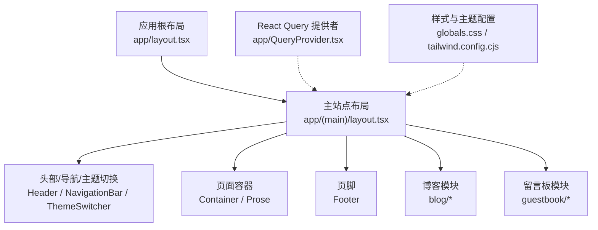
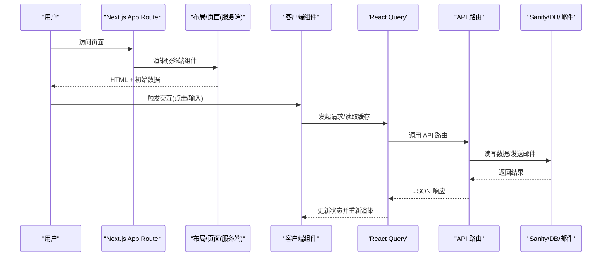
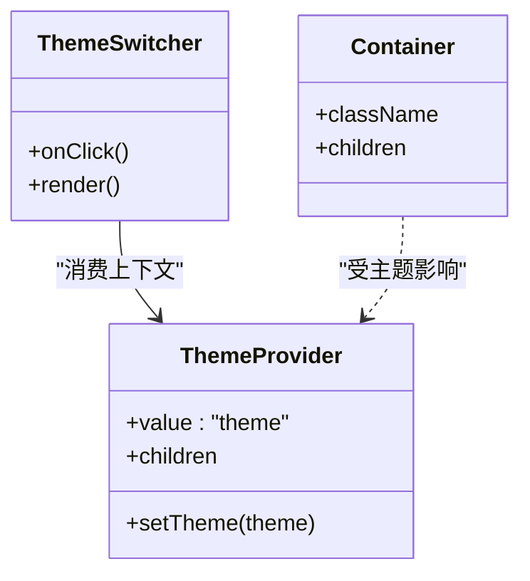
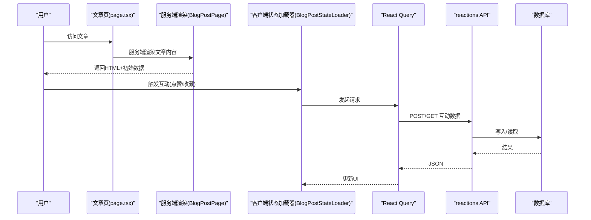
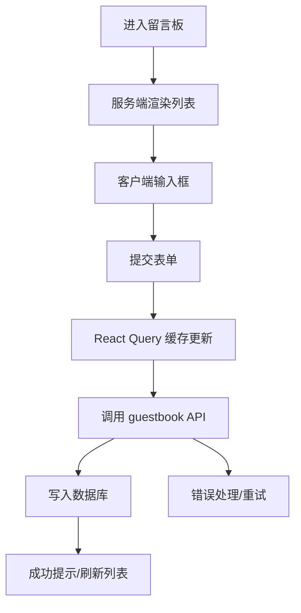
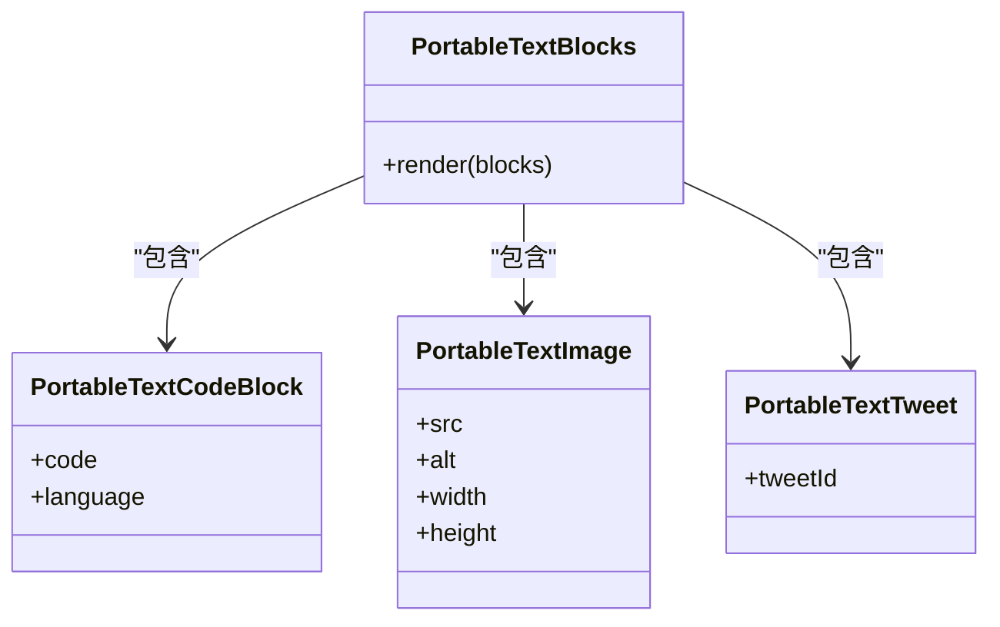
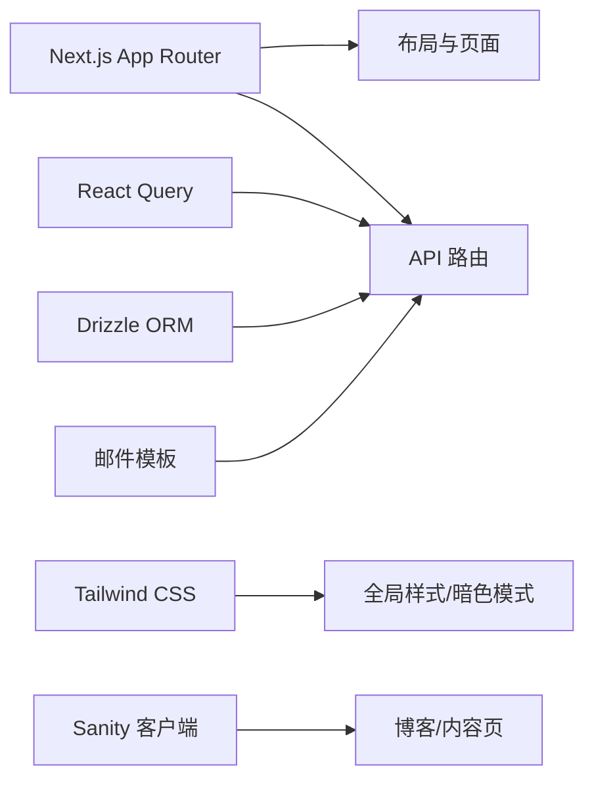

# 前端架构

<cite>
**本文引用的文件**   
- [app/layout.tsx](file://app/layout.tsx)
- [app/(main)/layout.tsx](file://app/(main)/layout.tsx)
- [app/(main)/page.tsx](file://app/(main)/page.tsx)
- [app/(main)/Header.tsx](file://app/(main)/Header.tsx)
- [app/(main)/Footer.tsx](file://app/(main)/Footer.tsx)
- [app/(main)/NavigationBar.tsx](file://app/(main)/NavigationBar.tsx)
- [app/(main)/ThemeSwitcher.tsx](file://app/(main)/ThemeSwitcher.tsx)
- [app/(main)/ThemeProvider.tsx](file://app/(main)/ThemeProvider.tsx)
- [app/QueryProvider.tsx](file://app/QueryProvider.tsx)
- [app/globals.css](file://app/globals.css)
- [tailwind.config.cjs](file://tailwind.config.cjs)
- [next.config.mjs](file://next.config.mjs)
- [middleware.ts](file://middleware.ts)
- [app/(main)/blog/page.tsx](file://app/(main)/blog/page.tsx)
- [app/(main)/blog/[slug]/page.tsx](file://app/(main)/blog/[slug]/page.tsx)
- [app/(main)/blog/BlogPostPage.tsx](file://app/(main)/blog/BlogPostPage.tsx)
- [app/(main)/blog/BlogPostStateLoader.tsx](file://app/(main)/blog/BlogPostStateLoader.tsx)
- [app/(main)/blog/blog-post.state.ts](file://app/(main)/blog/blog-post.state.ts)
- [app/(main)/guestbook/page.tsx](file://app/(main)/guestbook/page.tsx)
- [app/(main)/guestbook/Guestbook.tsx](file://app/(main)/guestbook/Guestbook.tsx)
- [app/(main)/guestbook/GuestbookFeeds.tsx](file://app/(main)/guestbook/GuestbookFeeds.tsx)
- [app/(main)/guestbook/GuestbookInput.tsx](file://app/(main)/guestbook/GuestbookInput.tsx)
- [app/(main)/guestbook/guestbook.state.ts](file://app/(main)/guestbook/guestbook.state.ts)
- [components/ui/Button.tsx](file://components/ui/Button.tsx)
- [components/ui/Card.tsx](file://components/ui/Card.tsx)
- [components/ui/Container.tsx](file://components/ui/Container.tsx)
- [components/ui/Dialog.tsx](file://components/ui/Dialog.tsx)
- [components/ui/HoverCard.tsx](file://components/ui/HoverCard.tsx)
- [components/ui/Tooltip.tsx](file://components/ui/Tooltip.tsx)
- [components/ClientOnly.tsx](file://components/ClientOnly.tsx)
- [components/Commentable.tsx](file://components/Commentable.tsx)
- [components/Prose.tsx](file://components/Prose.tsx)
- [components/links/RichLink.tsx](file://components/links/RichLink.tsx)
- [components/links/SocialLink.tsx](file://components/links/SocialLink.tsx)
- [components/links/PeekabooLink.tsx](file://components/links/PeekabooLink.tsx)
- [components/portable-text/PortableTextBlocks.tsx](file://components/portable-text/PortableTextBlocks.tsx)
- [components/portable-text/PortableTextCodeBlock.tsx](file://components/portable-text/PortableTextCodeBlock.tsx)
- [components/portable-text/PortableTextImage.tsx](file://components/portable-text/PortableTextImage.tsx)
- [components/portable-text/PortableTextTweet.tsx](file://components/portable-text/PortableTextTweet.tsx)
- [lib/font.ts](file://lib/font.ts)
- [lib/image.ts](file://lib/image.ts)
- [sanity/lib/client.ts](file://sanity/lib/client.ts)
- [sanity/queries.ts](file://sanity/queries.ts)
- [db/index.ts](file://db/index.ts)
- [db/schema.ts](file://db/schema.ts)
- [db/queries/guestbook.ts](file://db/queries/guestbook.ts)
- [app/api/activity/route.ts](file://app/api/activity/route.ts)
- [app/api/reactions/route.ts](file://app/api/reactions/route.ts)
- [app/api/newsletter/route.ts](file://app/api/newsletter/route.ts)
- [emails/index.tsx](file://emails/index.tsx)
</cite>

## 目录
1. [简介](#简介)
2. [项目结构](#项目结构)
3. [核心组件](#核心组件)
4. [架构总览](#架构总览)
5. [详细组件分析](#详细组件分析)
6. [依赖关系分析](#依赖关系分析)
7. [性能考量](#性能考量)
8. [故障排查指南](#故障排查指南)
9. [结论](#结论)
10. [附录](#附录)

## 简介
本文件面向 cali.so 的前端开发者，系统化梳理基于 Next.js App Router 的架构与实现。重点覆盖：
- App Router 路由组织、布局与页面拆分
- Server Components 与 Client Components 的混合渲染策略
- 主题系统与响应式模式
- 导航机制与可访问性
- 状态管理方案（轻量客户端状态 + React Query）
- 性能优化策略与最佳实践
- 组件复用与设计原则

## 项目结构
整体采用“功能域 + 共享 UI”的分层组织方式：
- app 目录：Next.js App Router 的路由、布局、页面与 API 路由
- components 目录：跨页面复用的通用组件与业务组件
- lib 目录：工具函数、字体与图片等基础设施
- sanity 目录：内容模型与查询
- db 目录：数据库 schema 与查询
- emails 目录：邮件模板与发送入口
- public 目录：静态资源



图示来源
- [app/layout.tsx](file://app/layout.tsx)
- [app/(main)/layout.tsx](file://app/(main)/layout.tsx)
- [app/(main)/Header.tsx](file://app/(main)/Header.tsx)
- [app/(main)/NavigationBar.tsx](file://app/(main)/NavigationBar.tsx)
- [app/(main)/ThemeSwitcher.tsx](file://app/(main)/ThemeSwitcher.tsx)
- [app/(main)/Footer.tsx](file://app/(main)/Footer.tsx)
- [components/ui/Container.tsx](file://components/ui/Container.tsx)
- [components/Prose.tsx](file://components/Prose.tsx)
- [app/QueryProvider.tsx](file://app/QueryProvider.tsx)
- [app/globals.css](file://app/globals.css)
- [tailwind.config.cjs](file://tailwind.config.cjs)

章节来源
- [app/layout.tsx](file://app/layout.tsx)
- [app/(main)/layout.tsx](file://app/(main)/layout.tsx)
- [app/(main)/page.tsx](file://app/(main)/page.tsx)
- [app/globals.css](file://app/globals.css)
- [tailwind.config.cjs](file://tailwind.config.cjs)

## 核心组件
- 布局与导航
  - 根布局负责全局元信息、字体加载、主题初始化与错误边界
  - 主布局承载 Header、NavigationBar、Footer 与页面内容区
  - 导航栏提供站点内跳转与移动端菜单交互
- 主题系统
  - 通过 Provider 注入主题上下文，支持明暗切换与持久化
  - 使用 Tailwind 的 dark 模式与 CSS 变量驱动
- 数据获取与缓存
  - 服务端直接调用 Sanity/DB 获取数据
  - 客户端使用 React Query 进行二次请求、缓存与增量更新
- 通用 UI
  - Button、Card、Container、Dialog、HoverCard、Tooltip 等原子组件
  - 链接增强组件 RichLink、SocialLink、PeekabooLink 统一外链行为与预览
- 富文本与博客
  - Portable Text 渲染器将结构化内容映射为可组合的块级组件
  - 博客文章页采用“服务端渲染 + 客户端状态”的混合模式

章节来源
- [app/(main)/Header.tsx](file://app/(main)/Header.tsx)
- [app/(main)/NavigationBar.tsx](file://app/(main)/NavigationBar.tsx)
- [app/(main)/ThemeSwitcher.tsx](file://app/(main)/ThemeSwitcher.tsx)
- [app/(main)/ThemeProvider.tsx](file://app/(main)/ThemeProvider.tsx)
- [components/ui/Button.tsx](file://components/ui/Button.tsx)
- [components/ui/Card.tsx](file://components/ui/Card.tsx)
- [components/ui/Container.tsx](file://components/ui/Container.tsx)
- [components/ui/Dialog.tsx](file://components/ui/Dialog.tsx)
- [components/ui/HoverCard.tsx](file://components/ui/HoverCard.tsx)
- [components/ui/Tooltip.tsx](file://components/ui/Tooltip.tsx)
- [components/links/RichLink.tsx](file://components/links/RichLink.tsx)
- [components/links/SocialLink.tsx](file://components/links/SocialLink.tsx)
- [components/links/PeekabooLink.tsx](file://components/links/PeekabooLink.tsx)
- [components/portable-text/PortableTextBlocks.tsx](file://components/portable-text/PortableTextBlocks.tsx)
- [components/portable-text/PortableTextCodeBlock.tsx](file://components/portable-text/PortableTextCodeBlock.tsx)
- [components/portable-text/PortableTextImage.tsx](file://components/portable-text/PortableTextImage.tsx)
- [components/portable-text/PortableTextTweet.tsx](file://components/portable-text/PortableTextTweet.tsx)

## 架构总览
下图展示从浏览器到后端的关键路径：App Router 路由解析 -> 服务端组件渲染 -> 客户端组件交互 -> API 路由 -> 外部服务（Sanity/DB/邮件）。



图示来源
- [app/(main)/blog/[slug]/page.tsx](file://app/(main)/blog/[slug]/page.tsx)
- [app/(main)/blog/BlogPostPage.tsx](file://app/(main)/blog/BlogPostPage.tsx)
- [app/(main)/blog/BlogPostStateLoader.tsx](file://app/(main)/blog/BlogPostStateLoader.tsx)
- [app/api/reactions/route.ts](file://app/api/reactions/route.ts)
- [sanity/lib/client.ts](file://sanity/lib/client.ts)
- [db/index.ts](file://db/index.ts)
- [emails/index.tsx](file://emails/index.tsx)

## 详细组件分析

### 主题系统与响应式设计
- 主题上下文
  - 通过 Provider 在应用启动时注入主题值，并在客户端切换后持久化到本地存储
  - 使用 data-theme 或 CSS 变量控制全局样式
- 明暗切换
  - ThemeSwitcher 作为客户端组件，监听用户操作并更新上下文
- 响应式
  - 基于 Tailwind 断点与容器组件 Container 控制内容宽度
  - 头部与导航在小屏下折叠为抽屉/下拉菜单



图示来源
- [app/(main)/ThemeProvider.tsx](file://app/(main)/ThemeProvider.tsx)
- [app/(main)/ThemeSwitcher.tsx](file://app/(main)/ThemeSwitcher.tsx)
- [components/ui/Container.tsx](file://components/ui/Container.tsx)
- [tailwind.config.cjs](file://tailwind.config.cjs)
- [app/globals.css](file://app/globals.css)

章节来源
- [app/(main)/ThemeProvider.tsx](file://app/(main)/ThemeProvider.tsx)
- [app/(main)/ThemeSwitcher.tsx](file://app/(main)/ThemeSwitcher.tsx)
- [components/ui/Container.tsx](file://components/ui/Container.tsx)
- [tailwind.config.cjs](file://tailwind.config.cjs)
- [app/globals.css](file://app/globals.css)

### 路由组织与导航机制
- 路由分组
  - (main) 用于公共站点布局与导航
  - admin 用于后台管理
  - studio 用于内容编辑
- 动态路由
  - blog/[slug] 渲染单篇文章
  - newsletters/[id] 渲染通讯详情
- 导航
  - NavigationBar 提供站点内跳转与高亮当前项
  - RichLink 统一处理外链、新窗口打开与 SEO 属性

```mermaid
flowchart TD
Start(["进入站点"]) --> MainLayout["加载主布局<br/>app/(main)/layout.tsx"]
MainLayout --> Nav["渲染导航<br/>NavigationBar"]
Nav --> Route{"匹配路由?"}
Route --> |blog/[slug]| BlogPage["渲染文章页<br/>[slug]/page.tsx"]
Route --> |guestbook| GuestbookPage["渲染留言板<br/>guestbook/page.tsx"]
Route --> |其他| DefaultPage["默认首页<br/>page.tsx"]
```

图示来源
- [app/(main)/layout.tsx](file://app/(main)/layout.tsx)
- [app/(main)/NavigationBar.tsx](file://app/(main)/NavigationBar.tsx)
- [app/(main)/blog/[slug]/page.tsx](file://app/(main)/blog/[slug]/page.tsx)
- [app/(main)/guestbook/page.tsx](file://app/(main)/guestbook/page.tsx)
- [app/(main)/page.tsx](file://app/(main)/page.tsx)

章节来源
- [app/(main)/NavigationBar.tsx](file://app/(main)/NavigationBar.tsx)
- [app/(main)/blog/[slug]/page.tsx](file://app/(main)/blog/[slug]/page.tsx)
- [app/(main)/guestbook/page.tsx](file://app/(main)/guestbook/page.tsx)
- [app/(main)/page.tsx](file://app/(main)/page.tsx)

### 博客模块：服务端渲染 + 客户端状态
- 服务端渲染
  - 文章列表与文章详情在服务端拉取内容，减少首屏时间
- 客户端状态
  - 点赞、评论等交互通过 React Query 与 API 路由协作
  - 使用轻量状态库管理局部 UI 状态（如展开/收起）
- 富文本
  - Portable Text 渲染器将结构化内容转换为可组合的块级组件



图示来源
- [app/(main)/blog/[slug]/page.tsx](file://app/(main)/blog/[slug]/page.tsx)
- [app/(main)/blog/BlogPostPage.tsx](file://app/(main)/blog/BlogPostPage.tsx)
- [app/(main)/blog/BlogPostStateLoader.tsx](file://app/(main)/blog/BlogPostStateLoader.tsx)
- [app/(main)/blog/blog-post.state.ts](file://app/(main)/blog/blog-post.state.ts)
- [app/api/reactions/route.ts](file://app/api/reactions/route.ts)
- [db/index.ts](file://db/index.ts)

章节来源
- [app/(main)/blog/[slug]/page.tsx](file://app/(main)/blog/[slug]/page.tsx)
- [app/(main)/blog/BlogPostPage.tsx](file://app/(main)/blog/BlogPostPage.tsx)
- [app/(main)/blog/BlogPostStateLoader.tsx](file://app/(main)/blog/BlogPostStateLoader.tsx)
- [app/(main)/blog/blog-post.state.ts](file://app/(main)/blog/blog-post.state.ts)
- [app/api/reactions/route.ts](file://app/api/reactions/route.ts)
- [db/index.ts](file://db/index.ts)

### 留言板模块：表单与实时反馈
- 服务端渲染留言列表
- 客户端提交表单，使用 React Query 进行乐观更新与失败回滚
- 使用 Dialog/Tooltip 提升交互体验



图示来源
- [app/(main)/guestbook/page.tsx](file://app/(main)/guestbook/page.tsx)
- [app/(main)/guestbook/Guestbook.tsx](file://app/(main)/guestbook/Guestbook.tsx)
- [app/(main)/guestbook/GuestbookFeeds.tsx](file://app/(main)/guestbook/GuestbookFeeds.tsx)
- [app/(main)/guestbook/GuestbookInput.tsx](file://app/(main)/guestbook/GuestbookInput.tsx)
- [app/(main)/guestbook/guestbook.state.ts](file://app/(main)/guestbook/guestbook.state.ts)
- [db/queries/guestbook.ts](file://db/queries/guestbook.ts)

章节来源
- [app/(main)/guestbook/page.tsx](file://app/(main)/guestbook/page.tsx)
- [app/(main)/guestbook/Guestbook.tsx](file://app/(main)/guestbook/Guestbook.tsx)
- [app/(main)/guestbook/GuestbookFeeds.tsx](file://app/(main)/guestbook/GuestbookFeeds.tsx)
- [app/(main)/guestbook/GuestbookInput.tsx](file://app/(main)/guestbook/GuestbookInput.tsx)
- [app/(main)/guestbook/guestbook.state.ts](file://app/(main)/guestbook/guestbook.state.ts)
- [db/queries/guestbook.ts](file://db/queries/guestbook.ts)

### 富文本与博客渲染
- Portable Text 渲染器将结构化内容映射为多种块级组件（段落、代码块、图片、推文等）
- 通过自定义渲染器扩展外链、图片尺寸与代码高亮



图示来源
- [components/portable-text/PortableTextBlocks.tsx](file://components/portable-text/PortableTextBlocks.tsx)
- [components/portable-text/PortableTextCodeBlock.tsx](file://components/portable-text/PortableTextCodeBlock.tsx)
- [components/portable-text/PortableTextImage.tsx](file://components/portable-text/PortableTextImage.tsx)
- [components/portable-text/PortableTextTweet.tsx](file://components/portable-text/PortableTextTweet.tsx)

章节来源
- [components/portable-text/PortableTextBlocks.tsx](file://components/portable-text/PortableTextBlocks.tsx)
- [components/portable-text/PortableTextCodeBlock.tsx](file://components/portable-text/PortableTextCodeBlock.tsx)
- [components/portable-text/PortableTextImage.tsx](file://components/portable-text/PortableTextImage.tsx)
- [components/portable-text/PortableTextTweet.tsx](file://components/portable-text/PortableTextTweet.tsx)

### 通用 UI 组件设计原则
- 单一职责：每个组件只负责一个明确的职责
- 可组合：通过 props 与 children 组合复杂界面
- 可访问性：提供语义化标签、aria-* 属性与键盘交互
- 主题适配：遵循 Tailwind 的 dark 模式与 CSS 变量
- 类型安全：使用 TypeScript 定义 props 接口

章节来源
- [components/ui/Button.tsx](file://components/ui/Button.tsx)
- [components/ui/Card.tsx](file://components/ui/Card.tsx)
- [components/ui/Container.tsx](file://components/ui/Container.tsx)
- [components/ui/Dialog.tsx](file://components/ui/Dialog.tsx)
- [components/ui/HoverCard.tsx](file://components/ui/HoverCard.tsx)
- [components/ui/Tooltip.tsx](file://components/ui/Tooltip.tsx)

### 链接与社交分享
- RichLink 统一外链行为、SEO 属性与目标窗口
- SocialLink 封装社交平台图标与跳转
- PeekabooLink 提供悬停预览能力

章节来源
- [components/links/RichLink.tsx](file://components/links/RichLink.tsx)
- [components/links/SocialLink.tsx](file://components/links/SocialLink.tsx)
- [components/links/PeekabooLink.tsx](file://components/links/PeekabooLink.tsx)

## 依赖关系分析
- 前端依赖
  - Next.js App Router 提供路由与 SSR/SSG
  - Tailwind CSS 提供原子化样式与暗色模式
  - React Query 提供数据缓存与同步
  - Sanity 客户端用于内容获取
  - Drizzle ORM 用于数据库访问
- 关键耦合点
  - 主题与样式：ThemeProvider/Tailwind/globals.css
  - 数据流：页面 -> API 路由 -> DB/Sanity
  - 富文本：Portable Text -> 渲染组件



图示来源
- [next.config.mjs](file://next.config.mjs)
- [tailwind.config.cjs](file://tailwind.config.cjs)
- [app/QueryProvider.tsx](file://app/QueryProvider.tsx)
- [sanity/lib/client.ts](file://sanity/lib/client.ts)
- [sanity/queries.ts](file://sanity/queries.ts)
- [db/index.ts](file://db/index.ts)
- [db/schema.ts](file://db/schema.ts)
- [app/api/activity/route.ts](file://app/api/activity/route.ts)
- [app/api/reactions/route.ts](file://app/api/reactions/route.ts)
- [app/api/newsletter/route.ts](file://app/api/newsletter/route.ts)
- [emails/index.tsx](file://emails/index.tsx)

章节来源
- [next.config.mjs](file://next.config.mjs)
- [tailwind.config.cjs](file://tailwind.config.cjs)
- [app/QueryProvider.tsx](file://app/QueryProvider.tsx)
- [sanity/lib/client.ts](file://sanity/lib/client.ts)
- [sanity/queries.ts](file://sanity/queries.ts)
- [db/index.ts](file://db/index.ts)
- [db/schema.ts](file://db/schema.ts)
- [app/api/activity/route.ts](file://app/api/activity/route.ts)
- [app/api/reactions/route.ts](file://app/api/reactions/route.ts)
- [app/api/newsletter/route.ts](file://app/api/newsletter/route.ts)
- [emails/index.tsx](file://emails/index.tsx)

## 性能考量
- 服务端优先
  - 文章列表与详情在服务端渲染，减少首屏时间
  - 使用 Next.js 内置的图片优化与字体加载
- 客户端优化
  - 仅对需要交互的部分使用 Client Components
  - 使用 React Query 的缓存与增量更新避免重复请求
- 资源加载
  - 按需导入第三方库与图标
  - 使用 Suspense 与 loading.tsx 提升用户体验
- 构建与部署
  - 合理配置 next.config.mjs 与 Tailwind 以减小包体积
  - 启用静态生成与增量再生成（ISR）

章节来源
- [next.config.mjs](file://next.config.mjs)
- [lib/font.ts](file://lib/font.ts)
- [lib/image.ts](file://lib/image.ts)
- [app/(main)/blog/[slug]/loading.tsx](file://app/(main)/blog/[slug]/loading.tsx)

## 故障排查指南
- 常见问题
  - 主题未生效：检查 Provider 是否包裹根布局与 CSS 变量是否正确
  - 路由不匹配：确认路由分组与动态段命名一致
  - 数据为空：核对 Sanity/DB 连接与环境变量
  - 表单提交失败：查看 API 路由日志与网络请求
- 调试建议
  - 使用浏览器开发者工具的网络面板定位 API 问题
  - 在服务端打印关键参数与错误堆栈
  - 对关键路径添加埋点与指标收集

章节来源
- [app/(main)/ThemeProvider.tsx](file://app/(main)/ThemeProvider.tsx)
- [app/(main)/NavigationBar.tsx](file://app/(main)/NavigationBar.tsx)
- [sanity/lib/client.ts](file://sanity/lib/client.ts)
- [db/index.ts](file://db/index.ts)
- [app/api/reactions/route.ts](file://app/api/reactions/route.ts)

## 结论
本项目基于 Next.js App Router 实现了清晰的服务端渲染与客户端交互分层，结合 Tailwind 的主题与响应式能力，提供了良好的用户体验与可维护性。通过 React Query 与 API 路由解耦前后端数据流，配合 Portable Text 的富文本渲染与通用 UI 组件，形成了可扩展的前端架构。建议在后续迭代中继续强化错误边界、监控与测试覆盖率，进一步提升稳定性与开发效率。

## 附录
- 环境变量与中间件
  - middleware.ts 可用于鉴权、重定向与请求拦截
- 站点地图与 SEO
  - sitemap.ts 与 meta 信息配置有助于搜索引擎收录
- 邮件通知
  - 订阅确认与评论回复可通过邮件模板发送

章节来源
- [middleware.ts](file://middleware.ts)
- [app/sitemap.ts](file://app/sitemap.ts)
- [emails/index.tsx](file://emails/index.tsx)