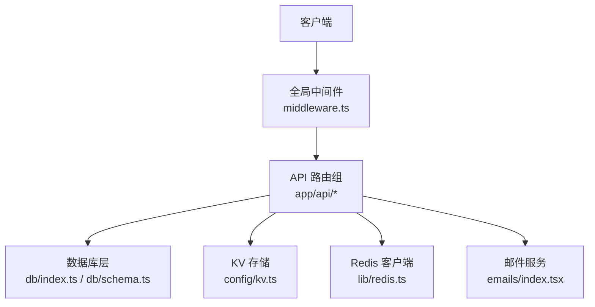
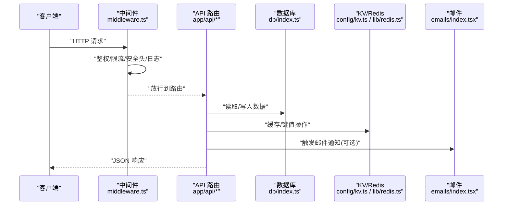
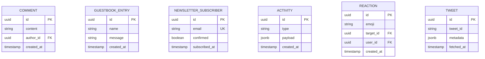
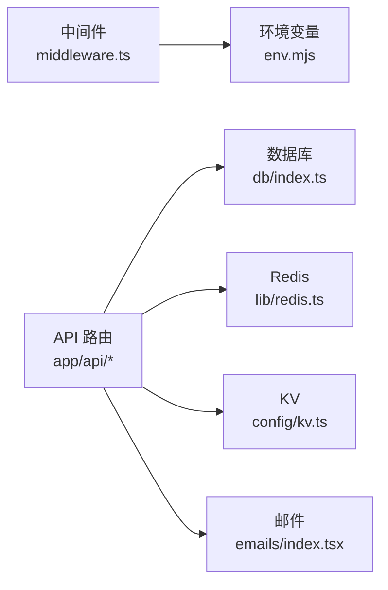

# 后端架构

<cite>
**本文引用的文件**   
- [middleware.ts](file://middleware.ts)
- [app/api/activity/route.ts](file://app/api/activity/route.ts)
- [app/api/comments/[id]/route.ts](file://app/api/comments/[id]/route.ts)
- [app/api/guestbook/route.ts](file://app/api/guestbook/route.ts)
- [app/api/newsletter/route.ts](file://app/api/newsletter/route.ts)
- [app/api/reactions/route.ts](file://app/api/reactions/route.ts)
- [app/api/tweet/[id]/route.ts](file://app/api/tweet/[id]/route.ts)
- [lib/validation.ts](file://lib/validation.ts)
- [db/schema.ts](file://db/schema.ts)
- [db/index.ts](file://db/index.ts)
- [config/kv.ts](file://config/kv.ts)
- [lib/redis.ts](file://lib/redis.ts)
- [emails/index.tsx](file://emails/index.tsx)
- [env.mjs](file://env.mjs)
</cite>

## 目录
1. [简介](#简介)
2. [项目结构](#项目结构)
3. [核心组件](#核心组件)
4. [架构总览](#架构总览)
5. [详细组件分析](#详细组件分析)
6. [依赖关系分析](#依赖关系分析)
7. [性能与缓存](#性能与缓存)
8. [限流与安全](#限流与安全)
9. [监控与日志](#监控与日志)
10. [API 规范与版本管理](#api-规范与版本管理)
11. [请求验证与数据序列化](#请求验证与数据序列化)
12. [错误处理策略](#错误处理策略)
13. [集成指南与示例](#集成指南与示例)
14. [故障排查](#故障排查)
15. [结论](#结论)

## 简介
本文件为 cali.so 项目的后端架构文档，聚焦于基于 Next.js App Router 的 API 路由组织、中间件处理流程、认证授权机制、错误处理策略、RESTful 设计规范、请求验证、数据序列化格式、安全防护、API 版本管理、缓存策略、限流机制与监控日志。文档同时提供面向开发者的集成指南与调用示例路径，帮助快速理解并扩展系统能力。

## 项目结构
本项目采用 Next.js App Router 的“按功能域”组织方式：
- app/api 下以资源为单位划分路由（如 activity、comments、guestbook、newsletter、reactions、tweet），每个路由对应一个 route.ts 文件，实现 RESTful 风格接口。
- lib 提供通用工具库（如 validation 校验、redis 客户端等）。
- db 层封装数据库 schema 与连接。
- config 提供 KV 配置。
- emails 负责邮件模板与发送入口。
- middleware.ts 作为全局中间件入口，统一鉴权、安全头、限流等横切逻辑。

图表来源
- [middleware.ts](file://middleware.ts)
- [app/api/activity/route.ts](file://app/api/activity/route.ts)
- [app/api/comments/[id]/route.ts](file://app/api/comments/[id]/route.ts)
- [app/api/guestbook/route.ts](file://app/api/guestbook/route.ts)
- [app/api/newsletter/route.ts](file://app/api/newsletter/route.ts)
- [app/api/reactions/route.ts](file://app/api/reactions/route.ts)
- [app/api/tweet/[id]/route.ts](file://app/api/tweet/[id]/route.ts)
- [db/index.ts](file://db/index.ts)
- [db/schema.ts](file://db/schema.ts)
- [config/kv.ts](file://config/kv.ts)
- [lib/redis.ts](file://lib/redis.ts)
- [emails/index.tsx](file://emails/index.tsx)

章节来源
- [middleware.ts](file://middleware.ts)
- [app/api/activity/route.ts](file://app/api/activity/route.ts)
- [app/api/comments/[id]/route.ts](file://app/api/comments/[id]/route.ts)
- [app/api/guestbook/route.ts](file://app/api/guestbook/route.ts)
- [app/api/newsletter/route.ts](file://app/api/newsletter/route.ts)
- [app/api/reactions/route.ts](file://app/api/reactions/route.ts)
- [app/api/tweet/[id]/route.ts](file://app/api/tweet/[id]/route.ts)
- [db/index.ts](file://db/index.ts)
- [db/schema.ts](file://db/schema.ts)
- [config/kv.ts](file://config/kv.ts)
- [lib/redis.ts](file://lib/redis.ts)
- [emails/index.tsx](file://emails/index.tsx)

## 核心组件
- 全局中间件：集中处理鉴权、安全响应头、跨域、限流、日志埋点等横切关注点。
- API 路由：按资源命名，遵循 RESTful 语义，内部再根据 HTTP 方法区分行为。
- 数据访问层：通过 db/index.ts 暴露数据库连接与查询能力，schema.ts 定义表结构。
- 缓存与 KV：使用 lib/redis.ts 与 config/kv.ts 提供高性能读写与键值存储。
- 邮件服务：通过 emails/index.tsx 统一发送邮件通知。
- 校验工具：lib/validation.ts 提供请求体与参数校验函数。

章节来源
- [middleware.ts](file://middleware.ts)
- [lib/validation.ts](file://lib/validation.ts)
- [db/index.ts](file://db/index.ts)
- [db/schema.ts](file://db/schema.ts)
- [config/kv.ts](file://config/kv.ts)
- [lib/redis.ts](file://lib/redis.ts)
- [emails/index.tsx](file://emails/index.tsx)

## 架构总览
整体采用“中间件前置 + 路由后置”的分层模式：
- 中间件层：统一鉴权、安全头、限流、日志。
- 路由层：按资源拆分，职责单一，仅处理业务编排与数据转换。
- 数据层：DB/KV/Redis/Email 等外部依赖通过模块导入解耦。

图表来源
- [middleware.ts](file://middleware.ts)
- [app/api/activity/route.ts](file://app/api/activity/route.ts)
- [app/api/comments/[id]/route.ts](file://app/api/comments/[id]/route.ts)
- [app/api/guestbook/route.ts](file://app/api/guestbook/route.ts)
- [app/api/newsletter/route.ts](file://app/api/newsletter/route.ts)
- [app/api/reactions/route.ts](file://app/api/reactions/route.ts)
- [app/api/tweet/[id]/route.ts](file://app/api/tweet/[id]/route.ts)
- [db/index.ts](file://db/index.ts)
- [db/schema.ts](file://db/schema.ts)
- [config/kv.ts](file://config/kv.ts)
- [lib/redis.ts](file://lib/redis.ts)
- [emails/index.tsx](file://emails/index.tsx)

## 详细组件分析

### 全局中间件（鉴权、安全、限流、日志）
- 职责：
  - 鉴权：解析会话或令牌，注入用户上下文。
  - 安全：设置 CSP、HSTS、X-Frame-Options 等响应头。
  - 限流：基于 IP 或用户维度进行速率限制。
  - 日志：记录请求 ID、方法、路径、耗时、状态码等。
- 设计要点：
  - 对公开与受保护路由分别处理，避免不必要的鉴权开销。
  - 限流策略可配置化，支持白名单与阈值调整。
  - 日志异步落盘或上报，避免阻塞主流程。

章节来源
- [middleware.ts](file://middleware.ts)

### API 路由组织与 RESTful 规范
- 路由组织：
  - 按资源命名：activity、comments、guestbook、newsletter、reactions、tweet。
  - 动态段：comments/[id]、tweet/[id] 表示单条资源操作。
- RESTful 约定：
  - GET 列表/详情、POST 创建、PUT/PATCH 更新、DELETE 删除。
  - 返回 JSON 结构一致，包含 data、error、meta 等字段。
  - 分页、排序、过滤通过查询参数表达。
- 示例路径参考：
  - 活动列表：[app/api/activity/route.ts](file://app/api/activity/route.ts)
  - 评论详情：[app/api/comments/[id]/route.ts](file://app/api/comments/[id]/route.ts)
  - 留言板：[app/api/guestbook/route.ts](file://app/api/guestbook/route.ts)
  - 订阅：[app/api/newsletter/route.ts](file://app/api/newsletter/route.ts)
  - 反应：[app/api/reactions/route.ts](file://app/api/reactions/route.ts)
  - 推文详情：[app/api/tweet/[id]/route.ts](file://app/api/tweet/[id]/route.ts)

章节来源
- [app/api/activity/route.ts](file://app/api/activity/route.ts)
- [app/api/comments/[id]/route.ts](file://app/api/comments/[id]/route.ts)
- [app/api/guestbook/route.ts](file://app/api/guestbook/route.ts)
- [app/api/newsletter/route.ts](file://app/api/newsletter/route.ts)
- [app/api/reactions/route.ts](file://app/api/reactions/route.ts)
- [app/api/tweet/[id]/route.ts](file://app/api/tweet/[id]/route.ts)

### 认证与授权机制
- 认证：
  - 通过中间件解析会话或令牌，识别用户身份。
  - 支持匿名与已登录两种上下文。
- 授权：
  - 在路由内检查角色或资源归属，确保最小权限原则。
  - 敏感操作需二次确认或额外签名。

章节来源
- [middleware.ts](file://middleware.ts)
- [app/api/comments/[id]/route.ts](file://app/api/comments/[id]/route.ts)
- [app/api/newsletter/route.ts](file://app/api/newsletter/route.ts)

### 数据模型与持久化
- Schema 定义：
  - 使用 db/schema.ts 描述表结构与约束。
- 连接与查询：
  - 通过 db/index.ts 暴露连接与常用查询方法。
- 典型实体：
  - 评论、留言、订阅者、活动、反应、推文等。

图表来源
- [db/schema.ts](file://db/schema.ts)

章节来源
- [db/schema.ts](file://db/schema.ts)
- [db/index.ts](file://db/index.ts)

### 缓存与 KV 策略
- Redis 缓存：
  - 热点数据（如首页聚合、推文元信息）短期缓存。
  - 使用 lib/redis.ts 封装 get/set/del 等操作。
- KV 存储：
  - 用于轻量级配置与分布式锁，见 config/kv.ts。
- 失效策略：
  - 写后失效或 TTL 过期；批量更新时采用版本号或前缀清理。

章节来源
- [lib/redis.ts](file://lib/redis.ts)
- [config/kv.ts](file://config/kv.ts)

### 邮件通知
- 入口：
  - emails/index.tsx 提供统一发送接口。
- 场景：
  - 订阅确认、新留言提醒、回复通知等。
- 模板：
  - 使用 Markdown 或 JSX 模板渲染内容。

章节来源
- [emails/index.tsx](file://emails/index.tsx)

## 依赖关系分析
- 中间件依赖环境配置与第三方服务（如限流、日志）。
- 路由依赖数据层、缓存层与邮件服务。
- 数据层依赖数据库驱动与连接池。
- 缓存层依赖 Redis 客户端与 KV 适配器。

图表来源
- [middleware.ts](file://middleware.ts)
- [app/api/activity/route.ts](file://app/api/activity/route.ts)
- [app/api/comments/[id]/route.ts](file://app/api/comments/[id]/route.ts)
- [app/api/guestbook/route.ts](file://app/api/guestbook/route.ts)
- [app/api/newsletter/route.ts](file://app/api/newsletter/route.ts)
- [app/api/reactions/route.ts](file://app/api/reactions/route.ts)
- [app/api/tweet/[id]/route.ts](file://app/api/tweet/[id]/route.ts)
- [db/index.ts](file://db/index.ts)
- [lib/redis.ts](file://lib/redis.ts)
- [config/kv.ts](file://config/kv.ts)
- [emails/index.tsx](file://emails/index.tsx)
- [env.mjs](file://env.mjs)

章节来源
- [middleware.ts](file://middleware.ts)
- [env.mjs](file://env.mjs)
- [db/index.ts](file://db/index.ts)
- [lib/redis.ts](file://lib/redis.ts)
- [config/kv.ts](file://config/kv.ts)
- [emails/index.tsx](file://emails/index.tsx)

## 性能与缓存
- 缓存分层：
  - 内存缓存（进程内）+ Redis 缓存（分布式）+ KV（轻量配置）。
- 热点优化：
  - 列表页聚合结果缓存，详情页短 TTL。
  - 写扩散改为读扩散，减少重复计算。
- 数据库优化：
  - 合理索引、分页游标、只取必要字段。
- 并发控制：
  - 使用队列或信号量限制高负载下的并发度。

[本节为通用指导，不直接分析具体文件]

## 限流与安全
- 限流：
  - 基于 IP 或用户维度的滑动窗口计数，防止滥用。
  - 关键接口（如订阅、发帖）更严格限制。
- 安全：
  - 强制 HTTPS、CSP、HSTS、X-Content-Type-Options。
  - 输入校验与输出转义，防 XSS/SQL 注入。
  - 敏感信息不落盘，密钥通过环境变量管理。

章节来源
- [middleware.ts](file://middleware.ts)
- [lib/validation.ts](file://lib/validation.ts)
- [env.mjs](file://env.mjs)

## 监控与日志
- 结构化日志：
  - 记录请求 ID、方法、路径、耗时、状态码、用户标识。
- 指标采集：
  - QPS、P95/P99 延迟、错误率、缓存命中率。
- 告警：
  - 错误率突增、慢查询、限流触发阈值告警。

章节来源
- [middleware.ts](file://middleware.ts)

## API 规范与版本管理
- 版本管理：
  - URL 前缀 v1/v2 或 Accept 头协商，向后兼容优先。
- 命名规范：
  - 名词复数、小写连字符分隔，避免动词。
- 状态码：
  - 2xx 成功、4xx 客户端错误、5xx 服务端错误。
- 分页：
  - cursor/page+limit，返回 meta.total、next_cursor。
- 错误体：
  - { code, message, details } 三件套。

章节来源
- [app/api/activity/route.ts](file://app/api/activity/route.ts)
- [app/api/comments/[id]/route.ts](file://app/api/comments/[id]/route.ts)
- [app/api/guestbook/route.ts](file://app/api/guestbook/route.ts)
- [app/api/newsletter/route.ts](file://app/api/newsletter/route.ts)
- [app/api/reactions/route.ts](file://app/api/reactions/route.ts)
- [app/api/tweet/[id]/route.ts](file://app/api/tweet/[id]/route.ts)

## 请求验证与数据序列化
- 校验：
  - 使用 lib/validation.ts 提供的校验函数，对请求体与路径参数进行强类型校验。
- 序列化：
  - 统一 JSON 响应格式，时间戳 ISO 8601，金额使用整数分。
- 反序列化：
  - 严格类型断言，失败返回 400 并附带字段级错误。

章节来源
- [lib/validation.ts](file://lib/validation.ts)
- [app/api/newsletter/route.ts](file://app/api/newsletter/route.ts)
- [app/api/guestbook/route.ts](file://app/api/guestbook/route.ts)

## 错误处理策略
- 分类：
  - 参数错误（400）、未授权（401）、无权限（403）、资源不存在（404）、冲突（409）、服务器错误（500）。
- 统一包装：
  - 所有异常转换为标准错误体，便于前端处理。
- 重试与降级：
  - 外部依赖失败时回退到缓存或默认值，保障可用性。

章节来源
- [middleware.ts](file://middleware.ts)
- [app/api/comments/[id]/route.ts](file://app/api/comments/[id]/route.ts)
- [app/api/newsletter/route.ts](file://app/api/newsletter/route.ts)

## 集成指南与示例
- 获取活动列表：
  - 方法：GET
  - 路径：/api/activity
  - 说明：返回最近活动列表，支持分页与过滤
  - 参考实现：[app/api/activity/route.ts](file://app/api/activity/route.ts)
- 获取评论详情：
  - 方法：GET
  - 路径：/api/comments/:id
  - 说明：根据 ID 返回评论详情
  - 参考实现：[app/api/comments/[id]/route.ts](file://app/api/comments/[id]/route.ts)
- 提交留言：
  - 方法：POST
  - 路径：/api/guestbook
  - 说明：提交姓名与消息，成功后返回条目 ID
  - 参考实现：[app/api/guestbook/route.ts](file://app/api/guestbook/route.ts)
- 订阅通讯：
  - 方法：POST
  - 路径：/api/newsletter
  - 说明：提交邮箱，发送确认邮件
  - 参考实现：[app/api/newsletter/route.ts](file://app/api/newsletter/route.ts)
- 添加反应：
  - 方法：POST
  - 路径：/api/reactions
  - 说明：为目标资源添加表情反应
  - 参考实现：[app/api/reactions/route.ts](file://app/api/reactions/route.ts)
- 获取推文详情：
  - 方法：GET
  - 路径：/api/tweet/:id
  - 说明：根据推文 ID 拉取元数据
  - 参考实现：[app/api/tweet/[id]/route.ts](file://app/api/tweet/[id]/route.ts)

章节来源
- [app/api/activity/route.ts](file://app/api/activity/route.ts)
- [app/api/comments/[id]/route.ts](file://app/api/comments/[id]/route.ts)
- [app/api/guestbook/route.ts](file://app/api/guestbook/route.ts)
- [app/api/newsletter/route.ts](file://app/api/newsletter/route.ts)
- [app/api/reactions/route.ts](file://app/api/reactions/route.ts)
- [app/api/tweet/[id]/route.ts](file://app/api/tweet/[id]/route.ts)

## 故障排查
- 常见问题：
  - 鉴权失败：检查中间件是否放行、令牌是否有效。
  - 限流触发：查看限流计数器与阈值配置。
  - 缓存不一致：核对缓存键与失效策略。
  - 邮件未送达：检查邮件服务凭证与模板渲染。
- 定位步骤：
  - 从中间件日志中获取请求 ID，追踪完整链路。
  - 检查数据库慢查询与索引命中。
  - 观察 Redis/KV 命中率与错误码。

章节来源
- [middleware.ts](file://middleware.ts)
- [lib/redis.ts](file://lib/redis.ts)
- [config/kv.ts](file://config/kv.ts)
- [emails/index.tsx](file://emails/index.tsx)

## 结论
本项目通过中间件前置与路由后置的分层架构，实现了清晰的鉴权、安全、限流与日志能力；API 路由按资源组织，遵循 RESTful 规范；数据层与缓存层解耦，具备良好的可扩展性与性能表现。建议后续持续完善版本管理、指标采集与自动化测试，进一步提升系统的稳定性与可观测性。