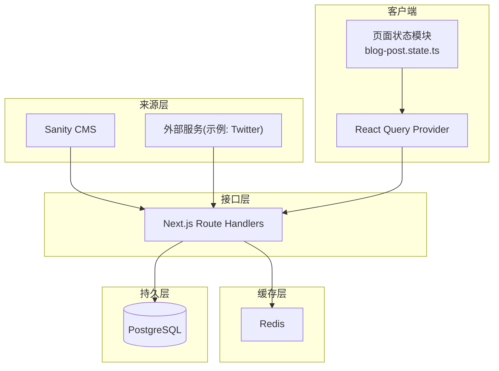
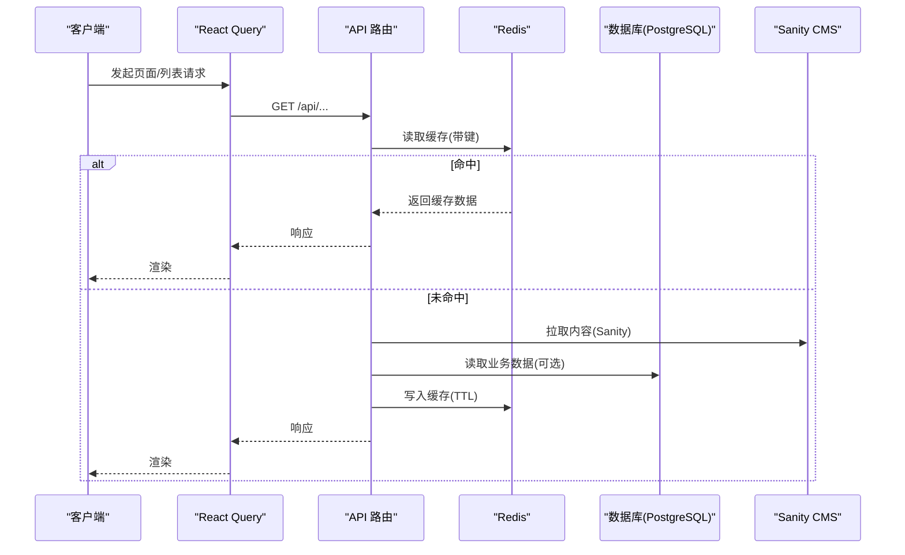
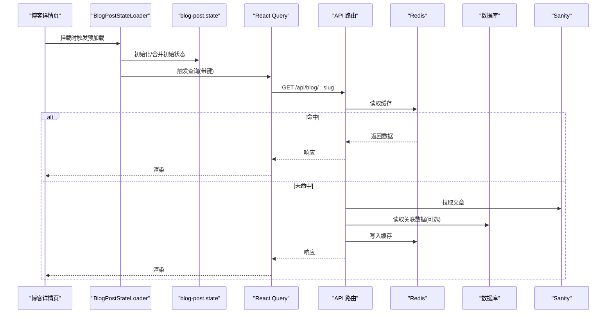
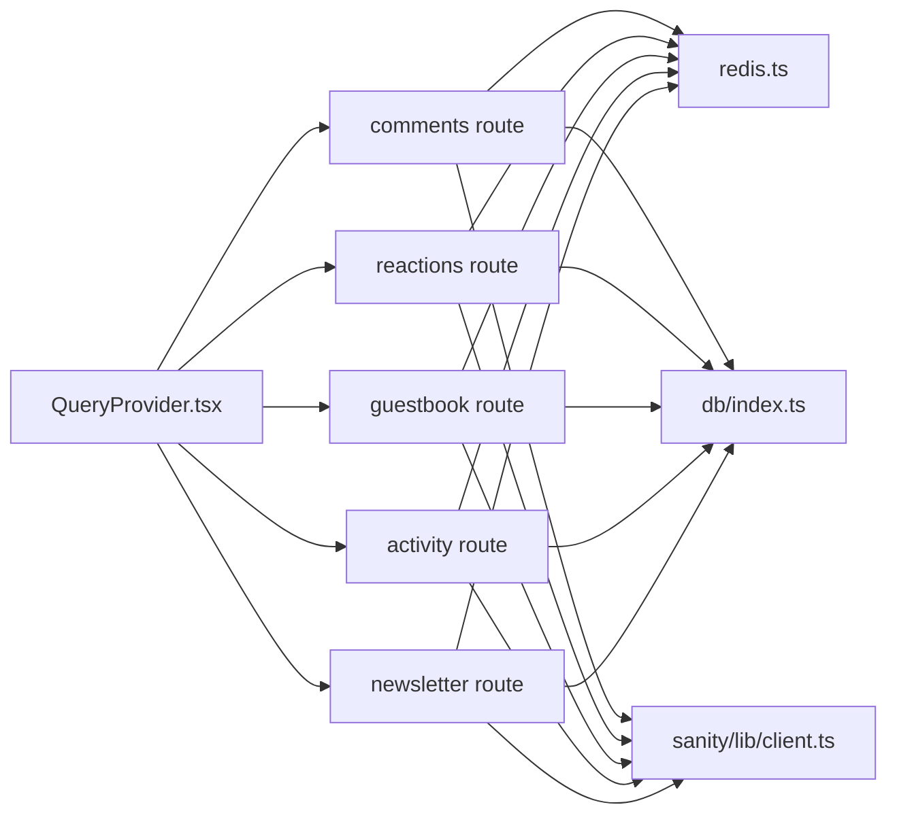

# 数据流设计

<cite>
**本文引用的文件**   
- [app/(main)/blog/BlogPostStateLoader.tsx](file://app/(main)/blog/BlogPostStateLoader.tsx)
- [app/(main)/blog/blog-post.state.ts](file://app/(main)/blog/blog-post.state.ts)
- [sanity/lib/client.ts](file://sanity/lib/client.ts)
- [sanity/queries.ts](file://sanity/queries.ts)
- [lib/redis.ts](file://lib/redis.ts)
- [db/index.ts](file://db/index.ts)
- [db/schema.ts](file://db/schema.ts)
- [db/queries/guestbook.ts](file://db/queries/guestbook.ts)
- [app/api/comments/[id]/route.ts](file://app/api/comments/[id]/route.ts)
- [app/api/reactions/route.ts](file://app/api/reactions/route.ts)
- [app/api/guestbook/route.ts](file://app/api/guestbook/route.ts)
- [app/api/activity/route.ts](file://app/api/activity/route.ts)
- [app/api/newsletter/route.ts](file://app/api/newsletter/route.ts)
- [config/kv.ts](file://config/kv.ts)
- [app/QueryProvider.tsx](file://app/QueryProvider.tsx)
- [public/sw.js](file://public/sw.js)
</cite>

## 目录
1. [引言](#引言)
2. [项目结构](#项目结构)
3. [核心组件](#核心组件)
4. [架构总览](#架构总览)
5. [详细组件分析](#详细组件分析)
6. [依赖关系分析](#依赖关系分析)
7. [性能考量](#性能考量)
8. [故障排查指南](#故障排查指南)
9. [结论](#结论)
10. [附录](#附录)

## 引言
本文件面向 cali.so 的数据流设计与实现，聚焦以下目标：
- 数据获取策略：Sanity CMS、数据库与 API 的读取路径与优先级
- 缓存机制：Redis 缓存键空间、失效策略与读写穿透防护
- 状态同步与一致性：服务端渲染（SSR）预取、客户端状态管理与增量更新
- 离线支持：Service Worker 缓存策略与回退
- 数据迁移：Drizzle ORM 迁移流程与版本管理

## 项目结构
从数据流视角，项目按“来源层—缓存层—持久层—接口层—客户端状态”分层组织：
- 来源层：Sanity CMS（内容）、外部服务（如 Twitter/X）
- 缓存层：Redis（KV 存储）
- 持久层：PostgreSQL（通过 Drizzle ORM）
- 接口层：Next.js Route Handlers（API 路由）
- 客户端状态：React Query + 页面级状态模块

图表来源
- [sanity/lib/client.ts](file://sanity/lib/client.ts)
- [lib/redis.ts](file://lib/redis.ts)
- [db/index.ts](file://db/index.ts)
- [app/api/comments/[id]/route.ts](file://app/api/comments/[id]/route.ts)
- [app/api/reactions/route.ts](file://app/api/reactions/route.ts)
- [app/api/guestbook/route.ts](file://app/api/guestbook/route.ts)
- [app/api/activity/route.ts](file://app/api/activity/route.ts)
- [app/api/newsletter/route.ts](file://app/api/newsletter/route.ts)
- [app/QueryProvider.tsx](file://app/QueryProvider.tsx)
- [app/(main)/blog/blog-post.state.ts](file://app/(main)/blog/blog-post.state.ts)

章节来源
- [sanity/lib/client.ts](file://sanity/lib/client.ts)
- [lib/redis.ts](file://lib/redis.ts)
- [db/index.ts](file://db/index.ts)
- [app/QueryProvider.tsx](file://app/QueryProvider.tsx)
- [app/(main)/blog/blog-post.state.ts](file://app/(main)/blog/blog-post.state.ts)

## 核心组件
- Sanity 客户端与查询
  - 负责连接 Sanity 并执行查询，提供统一入口。
  - 参考路径：[sanity/lib/client.ts](file://sanity/lib/client.ts)、[sanity/queries.ts](file://sanity/queries.ts)
- Redis 缓存
  - 提供 KV 存取能力，用于热点数据与跨请求共享。
  - 参考路径：[lib/redis.ts](file://lib/redis.ts)
- 数据库访问
  - 使用 Drizzle ORM 连接 PostgreSQL，定义 schema 并提供查询封装。
  - 参考路径：[db/index.ts](file://db/index.ts)、[db/schema.ts](file://db/schema.ts)、[db/queries/guestbook.ts](file://db/queries/guestbook.ts)
- API 路由
  - 聚合来源层、缓存层与持久层，暴露给前端调用。
  - 参考路径：
    - [app/api/comments/[id]/route.ts](file://app/api/comments/[id]/route.ts)
    - [app/api/reactions/route.ts](file://app/api/reactions/route.ts)
    - [app/api/guestbook/route.ts](file://app/api/guestbook/route.ts)
    - [app/api/activity/route.ts](file://app/api/activity/route.ts)
    - [app/api/newsletter/route.ts](file://app/api/newsletter/route.ts)
- 客户端状态与预加载
  - React Query Provider 统一管理请求生命周期；页面级状态模块维护局部 UI 状态。
  - 参考路径：[app/QueryProvider.tsx](file://app/QueryProvider.tsx)、[app/(main)/blog/BlogPostStateLoader.tsx](file://app/(main)/blog/BlogPostStateLoader.tsx)、[app/(main)/blog/blog-post.state.ts](file://app/(main)/blog/blog-post.state.ts)

章节来源
- [sanity/lib/client.ts](file://sanity/lib/client.ts)
- [sanity/queries.ts](file://sanity/queries.ts)
- [lib/redis.ts](file://lib/redis.ts)
- [db/index.ts](file://db/index.ts)
- [db/schema.ts](file://db/schema.ts)
- [db/queries/guestbook.ts](file://db/queries/guestbook.ts)
- [app/api/comments/[id]/route.ts](file://app/api/comments/[id]/route.ts)
- [app/api/reactions/route.ts](file://app/api/reactions/route.ts)
- [app/api/guestbook/route.ts](file://app/api/guestbook/route.ts)
- [app/api/activity/route.ts](file://app/api/activity/route.ts)
- [app/api/newsletter/route.ts](file://app/api/newsletter/route.ts)
- [app/QueryProvider.tsx](file://app/QueryProvider.tsx)
- [app/(main)/blog/BlogPostStateLoader.tsx](file://app/(main)/blog/BlogPostStateLoader.tsx)
- [app/(main)/blog/blog-post.state.ts](file://app/(main)/blog/blog-post.state.ts)

## 架构总览
整体数据流遵循“先缓存后源站”的读取路径，写操作走 API 路由，随后更新缓存与数据库，必要时触发失效或增量刷新。

图表来源
- [app/api/comments/[id]/route.ts](file://app/api/comments/[id]/route.ts)
- [app/api/reactions/route.ts](file://app/api/reactions/route.ts)
- [app/api/guestbook/route.ts](file://app/api/guestbook/route.ts)
- [app/api/activity/route.ts](file://app/api/activity/route.ts)
- [app/api/newsletter/route.ts](file://app/api/newsletter/route.ts)
- [sanity/lib/client.ts](file://sanity/lib/client.ts)
- [lib/redis.ts](file://lib/redis.ts)
- [db/index.ts](file://db/index.ts)

## 详细组件分析

### Sanity CMS 集成与查询
- 客户端初始化
  - 在 [sanity/lib/client.ts](file://sanity/lib/client.ts) 中完成 Sanity 客户端配置与导出，供上层查询复用。
- 查询封装
  - 在 [sanity/queries.ts](file://sanity/queries.ts) 中集中定义常用查询（如文章、分类、设置等），便于统一维护与测试。
- 典型用法
  - 在 API 路由或服务端函数中调用上述查询，结合 Redis 做缓存，降低对 Sanity 的频繁访问。

章节来源
- [sanity/lib/client.ts](file://sanity/lib/client.ts)
- [sanity/queries.ts](file://sanity/queries.ts)

### Redis 缓存策略
- 读写模型
  - 读：优先从 Redis 获取，未命中再回源（Sanity/DB），回填缓存并设置过期时间。
  - 写：更新数据库后，删除或更新相关缓存键，保证一致性。
- 键空间设计建议
  - 命名规范：资源类型:主键:过滤条件哈希
  - TTL 分级：静态内容较长、动态内容较短；热点条目可单独设置更短 TTL 以平衡新鲜度。
- 防穿透
  - 对空结果也写入短 TTL 占位值，避免雪崩到后端。
- 参考实现位置
  - [lib/redis.ts](file://lib/redis.ts)

章节来源
- [lib/redis.ts](file://lib/redis.ts)

### 数据库操作模式（Drizzle ORM）
- 连接与实例
  - 在 [db/index.ts](file://db/index.ts) 中建立数据库连接并导出驱动实例。
- Schema 定义
  - 在 [db/schema.ts](file://db/schema.ts) 中声明表结构与约束，作为迁移与查询的基础。
- 查询封装
  - 在 [db/queries/guestbook.ts](file://db/queries/guestbook.ts) 中封装常用 CRUD，提高可读性与复用性。
- 迁移管理
  - 使用 Drizzle 迁移脚本进行版本化演进，确保多环境一致。

章节来源
- [db/index.ts](file://db/index.ts)
- [db/schema.ts](file://db/schema.ts)
- [db/queries/guestbook.ts](file://db/queries/guestbook.ts)

### API 路由与数据聚合
- 评论接口
  - 路径：[app/api/comments/[id]/route.ts](file://app/api/comments/[id]/route.ts)
  - 职责：根据 ID 获取评论，结合 Redis 缓存与数据库读写，处理权限校验与错误码。
- 反应接口
  - 路径：[app/api/reactions/route.ts](file://app/api/reactions/route.ts)
  - 职责：统计与提交用户反应，更新缓存与数据库，保证幂等与并发安全。
- 留言板接口
  - 路径：[app/api/guestbook/route.ts](file://app/api/guestbook/route.ts)
  - 职责：留言列表与新增，包含输入校验、反垃圾策略与缓存失效。
- 活动流接口
  - 路径：[app/api/activity/route.ts](file://app/api/activity/route.ts)
  - 职责：聚合多来源活动事件，分页与过滤，缓存热点页。
- 订阅/通讯接口
  - 路径：[app/api/newsletter/route.ts](file://app/api/newsletter/route.ts)
  - 职责：订阅确认、取消与发送通知，涉及邮件与 KV 配置。

章节来源
- [app/api/comments/[id]/route.ts](file://app/api/comments/[id]/route.ts)
- [app/api/reactions/route.ts](file://app/api/reactions/route.ts)
- [app/api/guestbook/route.ts](file://app/api/guestbook/route.ts)
- [app/api/activity/route.ts](file://app/api/activity/route.ts)
- [app/api/newsletter/route.ts](file://app/api/newsletter/route.ts)

### 客户端状态管理与预加载
- React Query Provider
  - 在 [app/QueryProvider.tsx](file://app/QueryProvider.tsx) 中注入全局配置（重试、去抖、默认超时等）。
- 页面级状态
  - 在 [app/(main)/blog/blog-post.state.ts](file://app/(main)/blog/blog-post.state.ts) 中维护文章详情相关的本地状态（如展开目录、点赞态等）。
- 预加载器
  - 在 [app/(main)/blog/BlogPostStateLoader.tsx](file://app/(main)/blog/BlogPostStateLoader.tsx) 中在服务端或首屏阶段预取关键数据，减少交互延迟。

图表来源
- [app/(main)/blog/BlogPostStateLoader.tsx](file://app/(main)/blog/BlogPostStateLoader.tsx)
- [app/(main)/blog/blog-post.state.ts](file://app/(main)/blog/blog-post.state.ts)
- [app/QueryProvider.tsx](file://app/QueryProvider.tsx)
- [app/api/comments/[id]/route.ts](file://app/api/comments/[id]/route.ts)
- [lib/redis.ts](file://lib/redis.ts)
- [db/index.ts](file://db/index.ts)
- [sanity/lib/client.ts](file://sanity/lib/client.ts)

章节来源
- [app/QueryProvider.tsx](file://app/QueryProvider.tsx)
- [app/(main)/blog/BlogPostStateLoader.tsx](file://app/(main)/blog/BlogPostStateLoader.tsx)
- [app/(main)/blog/blog-post.state.ts](file://app/(main)/blog/blog-post.state.ts)

### 增量更新与实时性
- 基于缓存失效的增量更新
  - 写操作完成后删除或缩短相关缓存键的 TTL，促使下次读取回源刷新。
- 基于轮询/长连接的实时性（可选）
  - 对于需要近实时的场景，可在客户端侧使用 React Query 的 refetchInterval 或 WebSocket 推送。
- 幂等与冲突解决
  - 为写接口引入幂等键（如用户ID+资源ID+时间戳哈希），避免重复提交导致数据不一致。

章节来源
- [lib/redis.ts](file://lib/redis.ts)
- [app/api/reactions/route.ts](file://app/api/reactions/route.ts)
- [app/api/guestbook/route.ts](file://app/api/guestbook/route.ts)

### 离线支持与缓存回退
- Service Worker
  - 在 [public/sw.js](file://public/sw.js) 中注册 SW，对静态资源与部分 API 响应进行缓存，提升弱网体验。
- 回退策略
  - 网络不可用时展示最近一次成功渲染的页面或骨架屏；关键数据失败时降级显示摘要信息。

章节来源
- [public/sw.js](file://public/sw.js)

### 数据迁移方案
- 迁移脚本
  - 位于 [db/migrations](file://db/migrations) 下，使用 Drizzle 生成 SQL 脚本，配合配置文件执行。
- 版本控制
  - 每次变更 schema 后生成新迁移，确保开发、测试、生产环境一致。
- 回滚策略
  - 保留历史快照，必要时通过反向迁移恢复。

章节来源
- [db/migrations/meta/_journal.json](file://db/migrations/meta/_journal.json)
- [db/migrations/meta/0000_snapshot.json](file://db/migrations/meta/0000_snapshot.json)
- [db/migrations/0000_shallow_iron_fist.sql](file://db/migrations/0000_shallow_iron_fist.sql)

## 依赖关系分析
- 组件耦合
  - API 路由强依赖 Redis 与数据库，同时可选择性依赖 Sanity。
  - 客户端通过 React Query 间接依赖 API 路由，页面状态模块仅关注 UI 状态。
- 外部依赖
  - Sanity SDK、Redis 客户端、Drizzle ORM、PostgreSQL 驱动。
- 潜在循环依赖
  - 当前分层清晰，未发现直接循环导入；建议在新增模块时保持单向依赖。

图表来源
- [app/QueryProvider.tsx](file://app/QueryProvider.tsx)
- [app/api/comments/[id]/route.ts](file://app/api/comments/[id]/route.ts)
- [app/api/reactions/route.ts](file://app/api/reactions/route.ts)
- [app/api/guestbook/route.ts](file://app/api/guestbook/route.ts)
- [app/api/activity/route.ts](file://app/api/activity/route.ts)
- [app/api/newsletter/route.ts](file://app/api/newsletter/route.ts)
- [lib/redis.ts](file://lib/redis.ts)
- [db/index.ts](file://db/index.ts)
- [sanity/lib/client.ts](file://sanity/lib/client.ts)

章节来源
- [app/QueryProvider.tsx](file://app/QueryProvider.tsx)
- [lib/redis.ts](file://lib/redis.ts)
- [db/index.ts](file://db/index.ts)
- [sanity/lib/client.ts](file://sanity/lib/client.ts)
- [app/api/comments/[id]/route.ts](file://app/api/comments/[id]/route.ts)
- [app/api/reactions/route.ts](file://app/api/reactions/route.ts)
- [app/api/guestbook/route.ts](file://app/api/guestbook/route.ts)
- [app/api/activity/route.ts](file://app/api/activity/route.ts)
- [app/api/newsletter/route.ts](file://app/api/newsletter/route.ts)

## 性能考量
- 缓存命中率优化
  - 合理设计缓存键与 TTL，热点数据采用更长 TTL，动态数据采用短 TTL 或主动失效。
- 批量与分页
  - 列表接口采用分页与字段裁剪，减少传输体积与解析开销。
- 并发与锁
  - 高并发写场景使用分布式锁或原子操作，避免脏写。
- 冷启动预热
  - 部署后对首页与高频页面进行预热，填充缓存，降低首次请求延迟。

## 故障排查指南
- 常见问题定位
  - 缓存未命中：检查键空间命名与 TTL 设置，确认是否被误删。
  - 源站限流：观察 Sanity 与外部服务的速率限制，增加缓存层级或降频。
  - 数据库慢查询：使用 Drizzle 日志与数据库监控定位瓶颈。
  - 客户端重复请求：检查 React Query 的去抖与重试策略。
- 日志与追踪
  - 在 API 路由中记录关键步骤耗时与错误堆栈，便于快速定位。
- 回滚与恢复
  - 针对错误迁移，使用 Drizzle 提供的回滚脚本；对异常缓存数据，清理对应键后重建。

章节来源
- [lib/redis.ts](file://lib/redis.ts)
- [db/index.ts](file://db/index.ts)
- [app/api/comments/[id]/route.ts](file://app/api/comments/[id]/route.ts)
- [app/api/reactions/route.ts](file://app/api/reactions/route.ts)
- [app/api/guestbook/route.ts](file://app/api/guestbook/route.ts)
- [app/api/activity/route.ts](file://app/api/activity/route.ts)
- [app/api/newsletter/route.ts](file://app/api/newsletter/route.ts)

## 结论
本项目采用“缓存优先、源站兜底”的数据流设计，结合 Sanity CMS、Redis 与 PostgreSQL，实现了高性能与可扩展的数据获取与更新路径。通过 React Query 与页面级状态模块，客户端获得良好的用户体验与可控的状态管理。配合 Service Worker 与迁移体系，系统在稳定性与可维护性方面具备良好基础。

## 附录
- 配置项参考
  - KV 配置：[config/kv.ts](file://config/kv.ts)
- 数据模型参考
  - Schema 定义：[db/schema.ts](file://db/schema.ts)
- 迁移脚本参考
  - 迁移元数据与 SQL：见 [db/migrations](file://db/migrations)