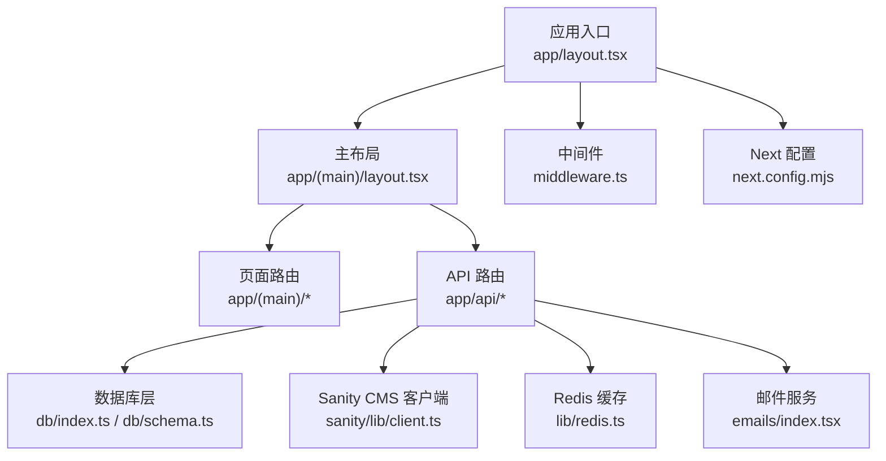
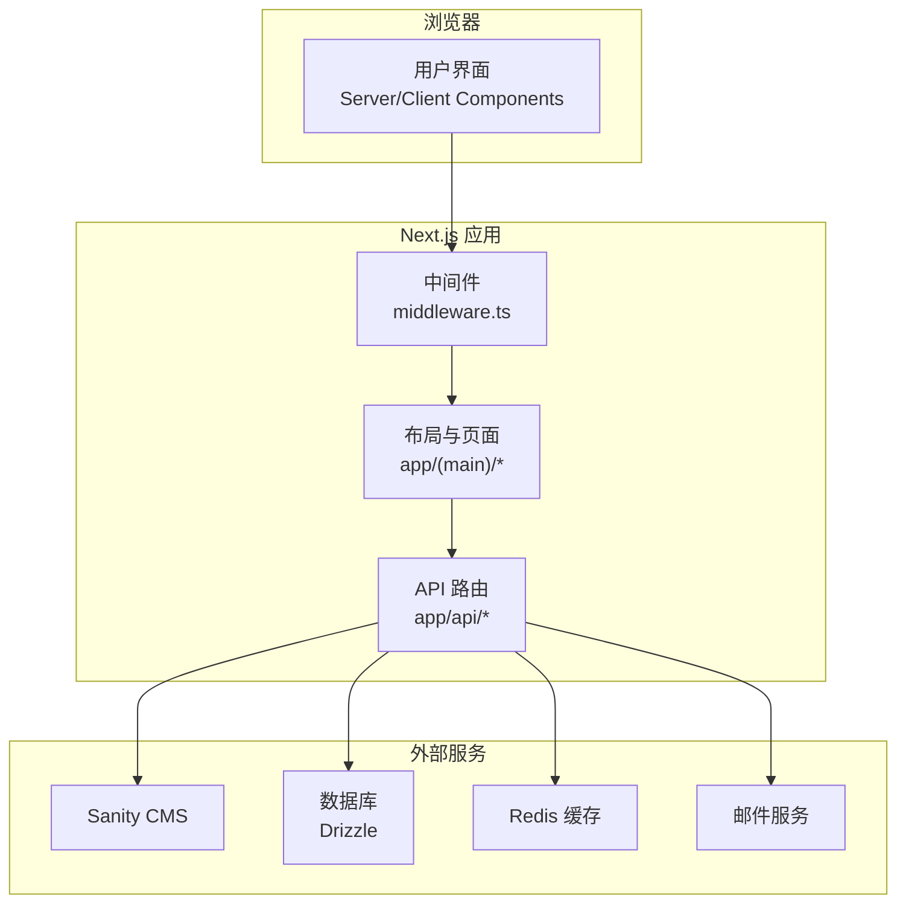
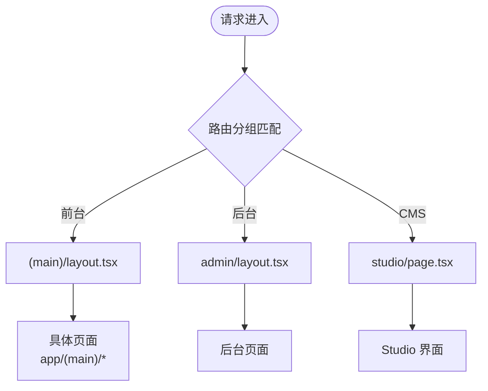
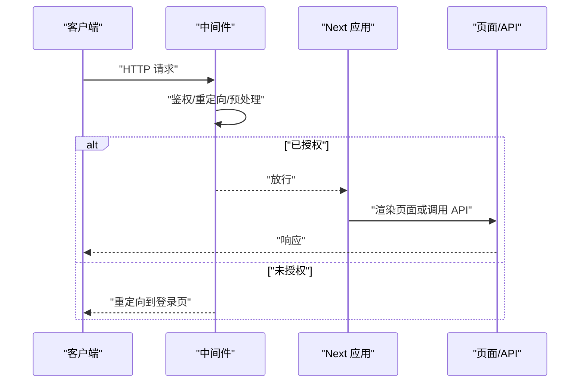
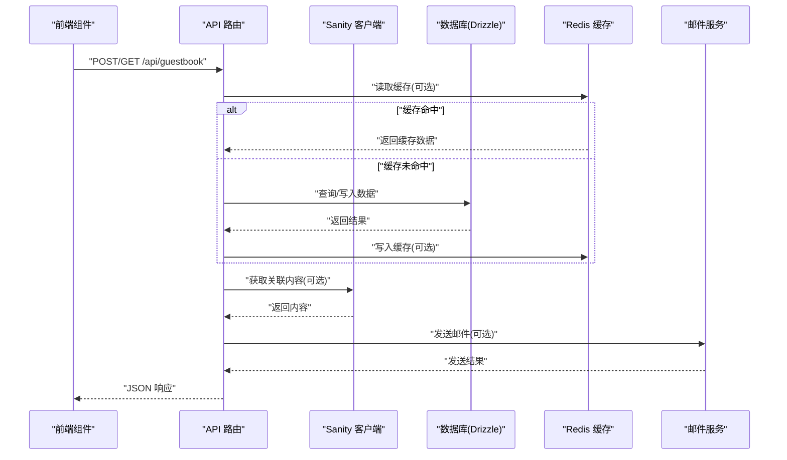
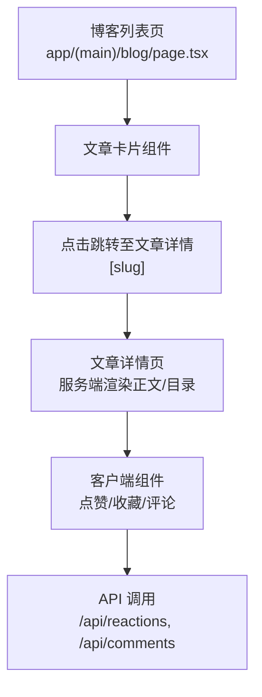
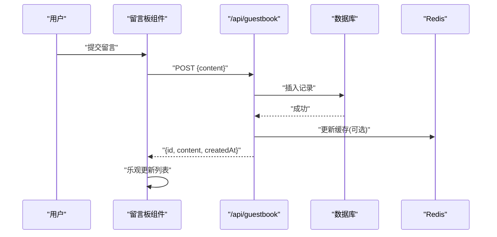
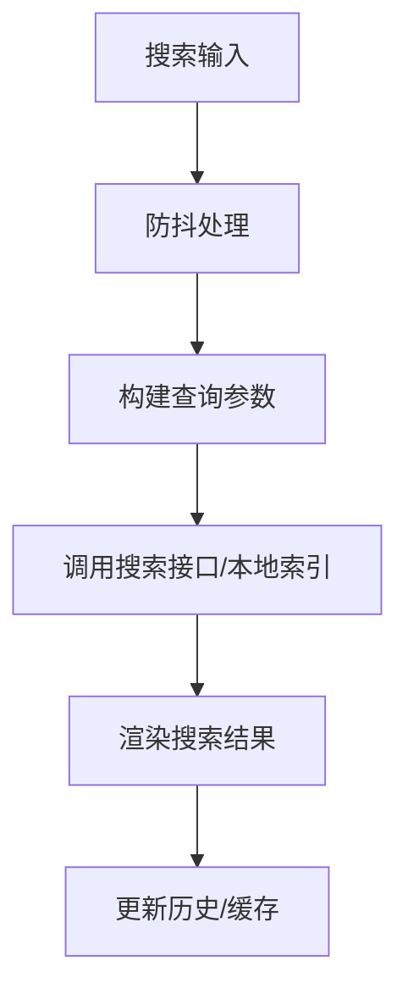
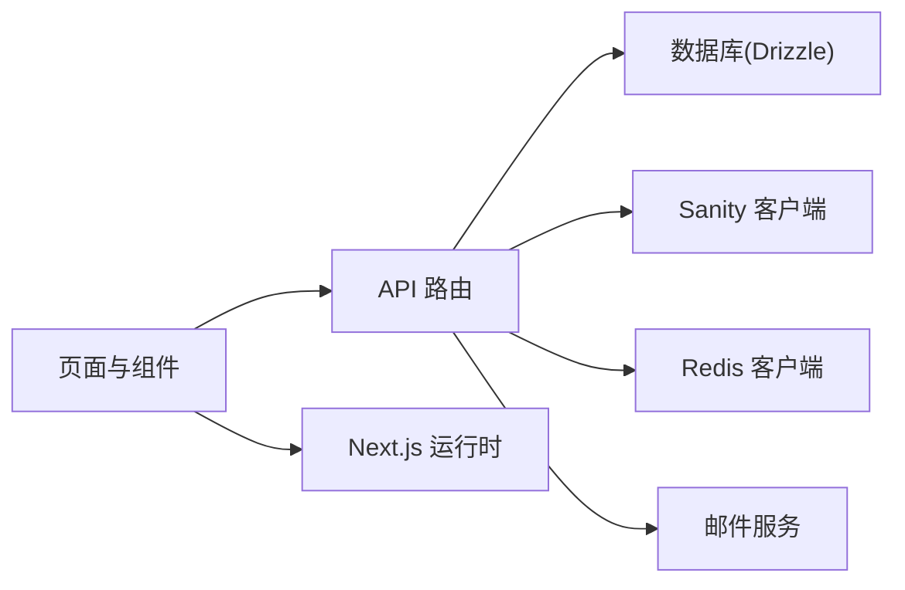

# 架构设计

<cite>
**本文引用的文件**   
- [app/layout.tsx](file://app/layout.tsx)
- [app/(main)/layout.tsx](file://app/(main)/layout.tsx)
- [middleware.ts](file://middleware.ts)
- [next.config.mjs](file://next.config.mjs)
- [package.json](file://package.json)
- [app/api/activity/route.ts](file://app/api/activity/route.ts)
- [app/api/guestbook/route.ts](file://app/api/guestbook/route.ts)
- [app/api/newsletter/route.ts](file://app/api/newsletter/route.ts)
- [app/api/reactions/route.ts](file://app/api/reactions/route.ts)
- [db/index.ts](file://db/index.ts)
- [db/schema.ts](file://db/schema.ts)
- [sanity/lib/client.ts](file://sanity/lib/client.ts)
- [lib/redis.ts](file://lib/redis.ts)
- [emails/index.tsx](file://emails/index.tsx)
- [app/(main)/blog/page.tsx](file://app/(main)/blog/page.tsx)
- [app/(main)/blog/[slug]/page.tsx](file://app/(main)/blog/[slug]/page.tsx)
- [app/(main)/guestbook/page.tsx](file://app/(main)/guestbook/page.tsx)
- [app/(main)/serach/page.tsx](file://app/(main)/serach/page.tsx)
</cite>

## 目录
1. [简介](#简介)
2. [项目结构](#项目结构)
3. [核心组件](#核心组件)
4. [架构总览](#架构总览)
5. [详细组件分析](#详细组件分析)
6. [依赖关系分析](#依赖关系分析)
7. [性能考量](#性能考量)
8. [故障排查指南](#故障排查指南)
9. [结论](#结论)
10. [附录](#附录)

## 简介
本架构设计文档面向架构师与高级开发者，系统性阐述 cali.so 项目的整体架构、设计模式与组件交互。重点覆盖：
- Next.js App Router 的组织结构与路由策略
- Server Components 与 Client Components 的混合渲染策略
- 状态管理与数据流设计（含服务端缓存与客户端状态）
- 系统边界、技术决策权衡、扩展点与集成模式
- 前后端分离、API 路由组织、中间件处理流程与缓存策略
- 关键流程图与架构图，帮助快速理解与演进

## 项目结构
项目采用基于功能域与层级的目录组织方式：
- app 目录：Next.js App Router 根目录，包含页面、布局、API 路由、全局样式与提供者
- components：可复用 UI 与业务组件
- db：数据库连接、Schema 定义与迁移
- sanity：内容管理系统（CMS）客户端与 Schema
- lib：通用工具库（Redis、SEO、日期、图片等）
- emails：邮件模板与发送逻辑
- config：配置项（导航、KV、邮件等）
- public：静态资源

图表来源
- [app/layout.tsx](file://app/layout.tsx)
- [app/(main)/layout.tsx](file://app/(main)/layout.tsx)
- [middleware.ts](file://middleware.ts)
- [next.config.mjs](file://next.config.mjs)
- [app/api/activity/route.ts](file://app/api/activity/route.ts)
- [db/index.ts](file://db/index.ts)
- [db/schema.ts](file://db/schema.ts)
- [sanity/lib/client.ts](file://sanity/lib/client.ts)
- [lib/redis.ts](file://lib/redis.ts)
- [emails/index.tsx](file://emails/index.tsx)

章节来源
- [app/layout.tsx](file://app/layout.tsx)
- [app/(main)/layout.tsx](file://app/(main)/layout.tsx)
- [middleware.ts](file://middleware.ts)
- [next.config.mjs](file://next.config.mjs)
- [package.json](file://package.json)

## 核心组件
- 应用壳与布局
  - 顶层 layout 负责全局 HTML 骨架、字体、主题与全局上下文注入
  - (main) 布局承载站点级导航、页眉页脚、主题切换与公共 UI 容器
- 认证与安全
  - 通过中间件统一鉴权与访问控制，保护受保护路由与 API
- 数据源
  - 博客与内容：Sanity CMS 客户端
  - 结构化数据：Drizzle ORM + SQLite/其他后端
  - 缓存：Redis
  - 邮件：模板化邮件发送
- 前端交互
  - 页面内状态：React 状态管理（如 Zustand/Context），结合 Suspense 与流式渲染
  - 跨页面状态：URL 参数、查询字符串与轻量持久化

章节来源
- [app/layout.tsx](file://app/layout.tsx)
- [app/(main)/layout.tsx](file://app/(main)/layout.tsx)
- [middleware.ts](file://middleware.ts)
- [sanity/lib/client.ts](file://sanity/lib/client.ts)
- [db/index.ts](file://db/index.ts)
- [db/schema.ts](file://db/schema.ts)
- [lib/redis.ts](file://lib/redis.ts)
- [emails/index.tsx](file://emails/index.tsx)

## 架构总览
系统采用前后端分离的 Next.js 全栈方案：
- 前端：App Router 的 Server Components 负责首屏与 SEO，Client Components 负责交互
- 后端：Route Handlers 提供 RESTful API，聚合多数据源并返回 JSON
- 数据层：Sanity（非结构化内容）、Drizzle（结构化数据）、Redis（缓存）、邮件服务
- 安全：中间件在请求进入前完成鉴权、重定向与限流

图表来源
- [middleware.ts](file://middleware.ts)
- [app/(main)/layout.tsx](file://app/(main)/layout.tsx)
- [app/api/activity/route.ts](file://app/api/activity/route.ts)
- [sanity/lib/client.ts](file://sanity/lib/client.ts)
- [db/index.ts](file://db/index.ts)
- [lib/redis.ts](file://lib/redis.ts)
- [emails/index.tsx](file://emails/index.tsx)

## 详细组件分析

### 路由与布局体系（App Router）
- 路由分组
  - (main)：前台站点路由组，包含首页、博客、留言板、项目等
  - admin：后台管理路由组
  - studio：CMS 管理面板
- 布局层级
  - 顶层 layout 注入全局样式、字体、主题 Provider
  - (main)/layout 注入导航栏、页脚、主题开关与公共容器
- 动态路由
  - 博客文章详情使用 [slug] 动态段
  - 订阅确认使用 [token] 动态段

图表来源
- [app/(main)/layout.tsx](file://app/(main)/layout.tsx)
- [app/studio/page.tsx](file://app/studio/page.tsx)
- [app/(main)/blog/[slug]/page.tsx](file://app/(main)/blog/[slug]/page.tsx)

章节来源
- [app/(main)/layout.tsx](file://app/(main)/layout.tsx)
- [app/(main)/blog/[slug]/page.tsx](file://app/(main)/blog/[slug]/page.tsx)

### 中间件与安全
- 职责
  - 鉴权校验：识别登录态，未登录时重定向到登录页
  - 访问控制：对受保护路径进行白名单/黑名单判断
  - 请求预处理：设置响应头、国际化语言、UA 解析等
- 执行顺序
  - 请求进入 -> 中间件 -> 路由处理器/页面 -> 响应返回

图表来源
- [middleware.ts](file://middleware.ts)

章节来源
- [middleware.ts](file://middleware.ts)

### API 路由与数据流
- 路由组织
  - 按领域划分：activity、guestbook、newsletter、reactions、tweet 等
  - 每个 route.ts 对应一个 REST 端点，接收请求、执行业务逻辑、返回 JSON
- 数据源聚合
  - 从 Sanity 获取文章内容与元信息
  - 从 Drizzle 读写评论、留言、订阅者等结构化数据
  - 使用 Redis 做热点数据缓存与速率限制
  - 触发邮件通知（新留言、回复、订阅确认等）

图表来源
- [app/api/guestbook/route.ts](file://app/api/guestbook/route.ts)
- [app/api/activity/route.ts](file://app/api/activity/route.ts)
- [app/api/newsletter/route.ts](file://app/api/newsletter/route.ts)
- [app/api/reactions/route.ts](file://app/api/reactions/route.ts)
- [db/index.ts](file://db/index.ts)
- [db/schema.ts](file://db/schema.ts)
- [sanity/lib/client.ts](file://sanity/lib/client.ts)
- [lib/redis.ts](file://lib/redis.ts)
- [emails/index.tsx](file://emails/index.tsx)

章节来源
- [app/api/guestbook/route.ts](file://app/api/guestbook/route.ts)
- [app/api/activity/route.ts](file://app/api/activity/route.ts)
- [app/api/newsletter/route.ts](file://app/api/newsletter/route.ts)
- [app/api/reactions/route.ts](file://app/api/reactions/route.ts)
- [db/index.ts](file://db/index.ts)
- [db/schema.ts](file://db/schema.ts)
- [sanity/lib/client.ts](file://sanity/lib/client.ts)
- [lib/redis.ts](file://lib/redis.ts)
- [emails/index.tsx](file://emails/index.tsx)

### 博客模块（Server/Client 混合渲染）
- 列表页
  - 使用 Server Component 拉取文章列表与摘要，提升首屏性能与 SEO
- 详情页
  - 服务端渲染文章正文与目录，客户端组件处理点赞、收藏、评论等交互
- 状态管理
  - 页面内状态使用 React 状态；跨组件共享可使用 Context 或轻量状态库

图表来源
- [app/(main)/blog/page.tsx](file://app/(main)/blog/page.tsx)
- [app/(main)/blog/[slug]/page.tsx](file://app/(main)/blog/[slug]/page.tsx)
- [app/api/reactions/route.ts](file://app/api/reactions/route.ts)

章节来源
- [app/(main)/blog/page.tsx](file://app/(main)/blog/page.tsx)
- [app/(main)/blog/[slug]/page.tsx](file://app/(main)/blog/[slug]/page.tsx)
- [app/api/reactions/route.ts](file://app/api/reactions/route.ts)

### 留言板模块（实时与离线优化）
- 提交留言
  - 客户端表单收集输入，调用 /api/guestbook 写入数据库
  - 成功后更新本地状态并刷新列表
- 列表加载
  - 服务端分页加载，客户端增量更新
- 错误处理
  - 网络异常重试、乐观更新回滚、用户提示

图表来源
- [app/(main)/guestbook/page.tsx](file://app/(main)/guestbook/page.tsx)
- [app/api/guestbook/route.ts](file://app/api/guestbook/route.ts)
- [db/index.ts](file://db/index.ts)
- [lib/redis.ts](file://lib/redis.ts)

章节来源
- [app/(main)/guestbook/page.tsx](file://app/(main)/guestbook/page.tsx)
- [app/api/guestbook/route.ts](file://app/api/guestbook/route.ts)
- [db/index.ts](file://db/index.ts)
- [lib/redis.ts](file://lib/redis.ts)

### 搜索模块（函数总线与工具）
- 搜索页
  - 使用函数总线协调搜索动作与结果展示
  - 工具函数封装 URL 参数解析、防抖与去重
- 交互流程
  - 输入变更 -> 防抖 -> 发起搜索 -> 渲染结果 -> 历史记录

图表来源
- [app/(main)/serach/page.tsx](file://app/(main)/serach/page.tsx)

章节来源
- [app/(main)/serach/page.tsx](file://app/(main)/serach/page.tsx)

### 邮件与通知
- 模板驱动
  - 使用模板引擎生成邮件内容（订阅确认、新留言、回复等）
- 触发时机
  - 用户在 API 中触发相应事件后异步发送邮件
- 可靠性
  - 失败重试与日志记录，避免阻塞主流程

章节来源
- [emails/index.tsx](file://emails/index.tsx)

## 依赖关系分析
- 内部依赖
  - 页面与组件依赖布局与提供者
  - API 路由依赖数据库、Sanity、Redis、邮件服务
- 外部依赖
  - Next.js 运行时与插件
  - Sanity CMS SDK
  - Drizzle ORM 与数据库驱动
  - Redis 客户端
  - 邮件服务 SDK

图表来源
- [app/(main)/blog/page.tsx](file://app/(main)/blog/page.tsx)
- [app/api/guestbook/route.ts](file://app/api/guestbook/route.ts)
- [db/index.ts](file://db/index.ts)
- [sanity/lib/client.ts](file://sanity/lib/client.ts)
- [lib/redis.ts](file://lib/redis.ts)
- [emails/index.tsx](file://emails/index.tsx)

章节来源
- [package.json](file://package.json)
- [next.config.mjs](file://next.config.mjs)

## 性能考量
- 渲染策略
  - 优先使用 Server Components 渲染静态与半静态内容，减少客户端 JS 体积
  - 将高交互区域拆分为 Client Components，按需加载
- 缓存策略
  - 使用 Redis 缓存热点数据（文章列表、评论分页、活动统计）
  - 合理设置缓存失效策略（时间戳、版本号、事件驱动失效）
- 数据获取
  - 在服务端批量拉取数据，减少往返次数
  - 使用流式渲染与 Suspense 提升首屏体验
- 资源优化
  - 图片懒加载与自适应尺寸
  - 字体与样式预加载
  - 静态资源 CDN 加速

## 故障排查指南
- 常见问题定位
  - 鉴权失败：检查中间件重定向逻辑与 Cookie/Token 有效性
  - API 超时：查看 Redis 连接与数据库慢查询
  - 邮件发送失败：检查模板变量与服务端凭据
- 日志与监控
  - 在 API 路由中记录关键步骤与异常堆栈
  - 为外部服务调用增加超时与重试上限
- 恢复策略
  - 降级：当外部服务不可用时返回默认数据或空集合
  - 熔断：对频繁失败的依赖进行短期熔断，避免雪崩

章节来源
- [middleware.ts](file://middleware.ts)
- [app/api/guestbook/route.ts](file://app/api/guestbook/route.ts)
- [emails/index.tsx](file://emails/index.tsx)

## 结论
本项目以 Next.js App Router 为核心，结合 Server/Client 混合渲染、多数据源聚合与缓存策略，构建了高性能、可扩展的前后端一体化应用。通过清晰的模块化与分层设计，系统在安全性、可维护性与可观测性方面具备良好基础。未来可在以下方向持续演进：
- 引入更细粒度的缓存键与失效策略
- 增强 API 层的幂等性与事务一致性
- 完善错误码与标准化响应体
- 建立端到端监控与告警体系

## 附录
- 术语
  - Server Components：在服务端渲染的 React 组件，适合 SEO 与首屏性能
  - Client Components：在客户端执行的 React 组件，适合交互与状态管理
  - Route Handlers：Next.js 提供的 API 路由实现方式
  - Drizzle ORM：类型安全的数据库操作库
  - Sanity CMS：无头内容管理系统