# 组件系统设计

<cite>
**本文引用的文件**   
- [components/ui/Button.tsx](file://components/ui/Button.tsx)
- [components/ui/Card.tsx](file://components/ui/Card.tsx)
- [components/ui/Container.tsx](file://components/ui/Container.tsx)
- [components/ui/Dialog.tsx](file://components/ui/Dialog.tsx)
- [components/ui/HoverCard.tsx](file://components/ui/HoverCard.tsx)
- [components/ui/Tooltip.tsx](file://components/ui/Tooltip.tsx)
- [components/GameUi/Card/Card.tsx](file://components/GameUi/Card/Card.tsx)
- [components/GameUi/GameItem/GameItem.tsx](file://components/GameUi/GameItem/GameItem.tsx)
- [components/GameUi/Page/Pagecomponent.tsx](file://components/GameUi/Page/Pagecomponent.tsx)
- [components/Avatar.tsx](file://components/Avatar.tsx)
- [components/ClientOnly.tsx](file://components/ClientOnly.tsx)
- [components/Commentable.tsx](file://components/Commentable.tsx)
- [components/DomainAnnouncementDialog.tsx](file://components/DomainAnnouncementDialog.tsx)
- [components/LiveAvatars.tsx](file://components/LiveAvatars.tsx)
- [components/Multiplayer.tsx](file://components/Multiplayer.tsx)
- [components/PostPortableText.tsx](file://components/PostPortableText.tsx)
- [components/Prose.tsx](file://components/Prose.tsx)
- [components/links/RichLink.tsx](file://components/links/RichLink.tsx)
- [components/links/SocialLink.tsx](file://components/links/SocialLink.tsx)
- [components/portable-text/PortableTextBlocks.tsx](file://components/portable-text/PortableTextBlocks.tsx)
- [components/portable-text/PortableTextCodeBlock.tsx](file://components/portable-text/PortableTextCodeBlock.tsx)
- [components/portable-text/PortableTextImage.tsx](file://components/portable-text/PortableTextImage.tsx)
- [components/portable-text/PortableTextTweet.tsx](file://components/portable-text/PortableTextTweet.tsx)
- [app/(main)/blog/BlogPostCard.tsx](file://app/(main)/blog/BlogPostCard.tsx)
- [app/(main)/blog/BlogPosts.tsx](file://app/(main)/blog/BlogPosts.tsx)
- [app/(main)/blog/BlogPostPage.tsx](file://app/(main)/blog/BlogPostPage.tsx)
- [app/(main)/blog/BlogPostTableOfContents.tsx](file://app/(main)/blog/BlogPostTableOfContents.tsx)
- [app/(main)/blog/BlogReactions.tsx](file://app/(main)/blog/BlogReactions.tsx)
- [app/(main)/blog/blog-post.state.ts](file://app/(main)/blog/blog-post.state.ts)
- [app/(main)/guestbook/Guestbook.tsx](file://app/(main)/guestbook/Guestbook.tsx)
- [app/(main)/guestbook/GuestbookFeeds.tsx](file://app/(main)/guestbook/GuestbookFeeds.tsx)
- [app/(main)/guestbook/GuestbookInput.tsx](file://app/(main)/guestbook/GuestbookInput.tsx)
- [app/(main)/guestbook/guestbook.state.ts](file://app/(main)/guestbook/guestbook.state.ts)
- [app/(main)/projects/ProjectCard.tsx](file://app/(main)/projects/ProjectCard.tsx)
- [app/(main)/projects/Projects.tsx](file://app/(main)/projects/Projects.tsx)
- [app/(main)/Header.tsx](file://app/(main)/Header.tsx)
- [app/(main)/NavigationBar.tsx](file://app/(main)/NavigationBar.tsx)
- [app/(main)/ThemeSwitcher.tsx](file://app/(main)/ThemeSwitcher.tsx)
- [app/(main)/ThemeProvider.tsx](file://app/(main)/ThemeProvider.tsx)
- [app/(main)/layout.tsx](file://app/(main)/layout.tsx)
- [app/layout.tsx](file://app/layout.tsx)
- [lib/index.ts](file://lib/index.ts)
- [package.json](file://package.json)
</cite>

## 目录
1. [简介](#简介)
2. [项目结构](#项目结构)
3. [核心组件](#核心组件)
4. [架构总览](#架构总览)
5. [详细组件分析](#详细组件分析)
6. [依赖关系分析](#依赖关系分析)
7. [性能考量](#性能考量)
8. [故障排查指南](#故障排查指南)
9. [结论](#结论)
10. [附录](#附录)

## 简介
本文件为 cali.so 项目的 UI 组件系统设计与开发指南，聚焦于：
- 组件库的架构原则与分层策略
- 基础组件与业务组件的分类体系、属性接口规范与事件处理机制
- 组合使用方式与扩展机制（主题、国际化、数据层）
- 组件测试策略、文档生成、版本管理与发布流程建议
- 面向开发者的高质量示例与最佳实践

目标读者包括前端工程师、UI 工程师与内容创作者，帮助团队在 Next.js + React 技术栈下构建一致、可复用、可维护的组件生态。

## 项目结构
本项目采用“功能域 + 组件层”的组织方式：
- components/ui：通用基础组件（按钮、卡片、容器、对话框、悬浮卡片、提示框等）
- components/GameUi：游戏相关领域组件（卡片、游戏项、页面容器）
- components/links：链接类组件（富链接、社交链接）
- components/portable-text：Sanity Portable Text 渲染器（块、代码块、图片、推文）
- app/(main)：页面级业务组件与页面布局（博客、留言板、项目展示、导航、主题切换等）
- lib：工具函数与公共能力（SEO、日期、字符串、验证等）

```mermaid
graph TB
subgraph "基础组件"
ui_btn["Button"]
ui_card["Card"]
ui_container["Container"]
ui_dialog["Dialog"]
ui_hovercard["HoverCard"]
ui_tooltip["Tooltip"]
end
subgraph "领域组件"
game_card["GameUi/Card"]
game_item["GameUi/GameItem"]
game_page["GameUi/Page"]
end
subgraph "业务页面组件"
blog_card["BlogPostCard"]
blog_posts["BlogPosts"]
blog_page["BlogPostPage"]
blog_toc["BlogPostTableOfContents"]
blog_reactions["BlogReactions"]
guestbook["Guestbook"]
guestbook_feeds["GuestbookFeeds"]
guestbook_input["GuestbookInput"]
project_card["ProjectCard"]
projects["Projects"]
header["Header"]
nav["NavigationBar"]
theme_switcher["ThemeSwitcher"]
end
subgraph "基础设施"
client_only["ClientOnly"]
avatar["Avatar"]
prose["Prose"]
rich_link["RichLink"]
social_link["SocialLink"]
portable_text_blocks["PortableTextBlocks"]
portable_text_code["PortableTextCodeBlock"]
portable_text_image["PortableTextImage"]
portable_text_tweet["PortableTextTweet"]
post_portable_text["PostPortableText"]
end
blog_card --> ui_card
blog_posts --> blog_card
blog_page --> blog_posts
blog_toc --> ui_container
blog_reactions --> ui_button["ui/Button"]
guestbook --> guestbook_feeds
guestbook --> guestbook_input
projects --> project_card
header --> nav
theme_switcher --> ui_container
rich_link --> ui_tooltip
social_link --> ui_button
post_portable_text --> portable_text_blocks
post_portable_text --> portable_text_code
post_portable_text --> portable_text_image
post_portable_text --> portable_text_tweet
game_item --> game_card
game_page --> ui_container
```

图表来源
- [components/ui/Button.tsx](file://components/ui/Button.tsx)
- [components/ui/Card.tsx](file://components/ui/Card.tsx)
- [components/ui/Container.tsx](file://components/ui/Container.tsx)
- [components/ui/Dialog.tsx](file://components/ui/Dialog.tsx)
- [components/ui/HoverCard.tsx](file://components/ui/HoverCard.tsx)
- [components/ui/Tooltip.tsx](file://components/ui/Tooltip.tsx)
- [components/GameUi/Card/Card.tsx](file://components/GameUi/Card/Card.tsx)
- [components/GameUi/GameItem/GameItem.tsx](file://components/GameUi/GameItem/GameItem.tsx)
- [components/GameUi/Page/Pagecomponent.tsx](file://components/GameUi/Page/Pagecomponent.tsx)
- [components/links/RichLink.tsx](file://components/links/RichLink.tsx)
- [components/links/SocialLink.tsx](file://components/links/SocialLink.tsx)
- [components/portable-text/PortableTextBlocks.tsx](file://components/portable-text/PortableTextBlocks.tsx)
- [components/portable-text/PortableTextCodeBlock.tsx](file://components/portable-text/PortableTextCodeBlock.tsx)
- [components/portable-text/PortableTextImage.tsx](file://components/portable-text/PortableTextImage.tsx)
- [components/portable-text/PortableTextTweet.tsx](file://components/portable-text/PortableTextTweet.tsx)
- [components/PostPortableText.tsx](file://components/PostPortableText.tsx)
- [app/(main)/blog/BlogPostCard.tsx](file://app/(main)/blog/BlogPostCard.tsx)
- [app/(main)/blog/BlogPosts.tsx](file://app/(main)/blog/BlogPosts.tsx)
- [app/(main)/blog/BlogPostPage.tsx](file://app/(main)/blog/BlogPostPage.tsx)
- [app/(main)/blog/BlogPostTableOfContents.tsx](file://app/(main)/blog/BlogPostTableOfContents.tsx)
- [app/(main)/blog/BlogReactions.tsx](file://app/(main)/blog/BlogReactions.tsx)
- [app/(main)/guestbook/Guestbook.tsx](file://app/(main)/guestbook/Guestbook.tsx)
- [app/(main)/guestbook/GuestbookFeeds.tsx](file://app/(main)/guestbook/GuestbookFeeds.tsx)
- [app/(main)/guestbook/GuestbookInput.tsx](file://app/(main)/guestbook/GuestbookInput.tsx)
- [app/(main)/projects/ProjectCard.tsx](file://app/(main)/projects/ProjectCard.tsx)
- [app/(main)/projects/Projects.tsx](file://app/(main)/projects/Projects.tsx)
- [app/(main)/Header.tsx](file://app/(main)/Header.tsx)
- [app/(main)/NavigationBar.tsx](file://app/(main)/NavigationBar.tsx)
- [app/(main)/ThemeSwitcher.tsx](file://app/(main)/ThemeSwitcher.tsx)

章节来源
- [app/(main)/layout.tsx](file://app/(main)/layout.tsx)
- [app/layout.tsx](file://app/layout.tsx)
- [components/ui/Button.tsx](file://components/ui/Button.tsx)
- [components/ui/Card.tsx](file://components/ui/Card.tsx)
- [components/ui/Container.tsx](file://components/ui/Container.tsx)
- [components/ui/Dialog.tsx](file://components/ui/Dialog.tsx)
- [components/ui/HoverCard.tsx](file://components/ui/HoverCard.tsx)
- [components/ui/Tooltip.tsx](file://components/ui/Tooltip.tsx)
- [components/GameUi/Card/Card.tsx](file://components/GameUi/Card/Card.tsx)
- [components/GameUi/GameItem/GameItem.tsx](file://components/GameUi/GameItem/GameItem.tsx)
- [components/GameUi/Page/Pagecomponent.tsx](file://components/GameUi/Page/Pagecomponent.tsx)
- [components/links/RichLink.tsx](file://components/links/RichLink.tsx)
- [components/links/SocialLink.tsx](file://components/links/SocialLink.tsx)
- [components/portable-text/PortableTextBlocks.tsx](file://components/portable-text/PortableTextBlocks.tsx)
- [components/portable-text/PortableTextCodeBlock.tsx](file://components/portable-text/PortableTextCodeBlock.tsx)
- [components/portable-text/PortableTextImage.tsx](file://components/portable-text/PortableTextImage.tsx)
- [components/portable-text/PortableTextTweet.tsx](file://components/portable-text/PortableTextTweet.tsx)
- [components/PostPortableText.tsx](file://components/PostPortableText.tsx)
- [app/(main)/blog/BlogPostCard.tsx](file://app/(main)/blog/BlogPostCard.tsx)
- [app/(main)/blog/BlogPosts.tsx](file://app/(main)/blog/BlogPosts.tsx)
- [app/(main)/blog/BlogPostPage.tsx](file://app/(main)/blog/BlogPostPage.tsx)
- [app/(main)/blog/BlogPostTableOfContents.tsx](file://app/(main)/blog/BlogPostTableOfContents.tsx)
- [app/(main)/blog/BlogReactions.tsx](file://app/(main)/blog/BlogReactions.tsx)
- [app/(main)/guestbook/Guestbook.tsx](file://app/(main)/guestbook/Guestbook.tsx)
- [app/(main)/guestbook/GuestbookFeeds.tsx](file://app/(main)/guestbook/GuestbookFeeds.tsx)
- [app/(main)/guestbook/GuestbookInput.tsx](file://app/(main)/guestbook/GuestbookInput.tsx)
- [app/(main)/projects/ProjectCard.tsx](file://app/(main)/projects/ProjectCard.tsx)
- [app/(main)/projects/Projects.tsx](file://app/(main)/projects/Projects.tsx)
- [app/(main)/Header.tsx](file://app/(main)/Header.tsx)
- [app/(main)/NavigationBar.tsx](file://app/(main)/NavigationBar.tsx)
- [app/(main)/ThemeSwitcher.tsx](file://app/(main)/ThemeSwitcher.tsx)

## 核心组件
本节梳理基础组件的职责边界、属性接口约定与事件处理模式，并给出组合与扩展建议。

- Button（按钮）
  - 职责：提供统一的交互入口，支持多种变体（如主按钮、次按钮、危险按钮）、尺寸与禁用态。
  - 属性约定：类型 variant、尺寸 size、是否 disabled、是否 loading、样式覆盖 className、子节点 children、点击事件 onClick。
  - 事件处理：onClick 回调；loading 时阻止默认行为或触发异步操作。
  - 组合：常与 Tooltip、Icon 组合使用；在表单中作为提交/重置按钮。
  - 扩展：通过 variant/size 枚举扩展新样式；通过 context 注入全局主题色。

- Card（卡片）
  - 职责：承载一组相关内容与操作，提供一致的视觉层级与间距。
  - 属性约定：标题 title、副标题 subtitle、描述 description、操作区 actions、是否可点击 clickable、点击回调 onClick、样式覆盖 className。
  - 事件处理：clickable 为真时透传 onClick；内部可包含多个子组件。
  - 组合：与 Avatar、Tag、Button 组合形成信息卡片。

- Container（容器）
  - 职责：统一页面内容宽度与边距，适配不同屏幕尺寸。
  - 属性约定：最大宽度 maxWidth、内边距 padding、对齐方式 align、样式覆盖 className。
  - 事件处理：无直接交互事件，主要作为布局容器。
  - 组合：包裹所有页面主要内容区域。

- Dialog（对话框）
  - 职责：模态窗口，用于确认、输入或展示重要信息。
  - 属性约定：打开状态 open、关闭回调 onClose、标题 title、内容 content、是否可点击外部关闭 canCloseOnOverlay、键盘 ESC 关闭 onEscape。
  - 事件处理：onClose、onEscape；内部焦点管理需保证无障碍访问。
  - 组合：与 Form、Alert、List 组合完成复杂交互。

- HoverCard（悬浮卡片）
  - 职责：鼠标悬停显示附加信息，常用于预览详情。
  - 属性约定：触发元素 trigger、弹出内容 content、定位策略 placement、延迟 showDelay/hideDelay、样式覆盖 className。
  - 事件处理：mouseenter/mouseleave 控制显隐；focus 时也可触发以增强可访问性。
  - 组合：与 RichLink、Tooltip 组合实现更丰富的悬停体验。

- Tooltip（提示框）
  - 职责：轻量提示文本，提升可用性。
  - 属性约定：文本 text、位置 placement、延迟 delay、样式覆盖 className。
  - 事件处理：hover/focus 触发显示；blur/离开隐藏。
  - 组合：与 Icon、Button 组合提供上下文说明。

章节来源
- [components/ui/Button.tsx](file://components/ui/Button.tsx)
- [components/ui/Card.tsx](file://components/ui/Card.tsx)
- [components/ui/Container.tsx](file://components/ui/Container.tsx)
- [components/ui/Dialog.tsx](file://components/ui/Dialog.tsx)
- [components/ui/HoverCard.tsx](file://components/ui/HoverCard.tsx)
- [components/ui/Tooltip.tsx](file://components/ui/Tooltip.tsx)

## 架构总览
组件系统遵循以下设计原则：
- 单一职责：每个组件只负责一个明确的职责，便于测试与维护。
- 组合优于继承：通过 props 组合与插槽式 children 组织复杂界面。
- 受控与非受控并存：对状态型组件（如 Dialog）提供受控模式，同时支持非受控简化用法。
- 主题与样式隔离：通过 Tailwind 与 CSS Modules/CSS 文件结合，确保样式可控且可覆盖。
- 数据流清晰：页面组件持有状态，基础组件仅暴露最小必要 API。

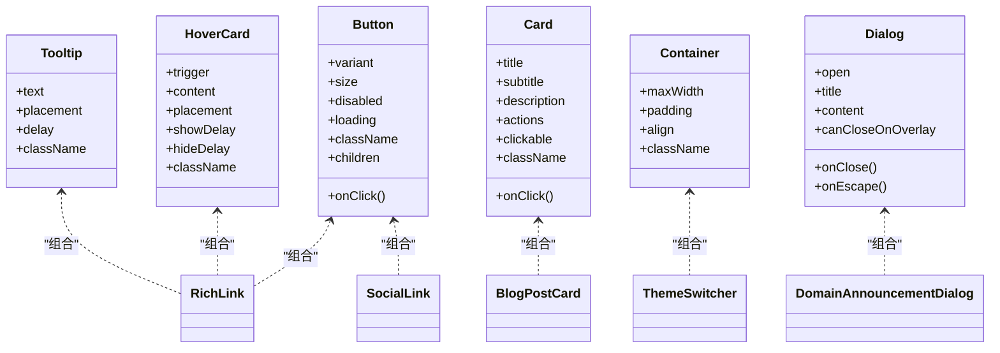

图表来源
- [components/ui/Button.tsx](file://components/ui/Button.tsx)
- [components/ui/Card.tsx](file://components/ui/Card.tsx)
- [components/ui/Container.tsx](file://components/ui/Container.tsx)
- [components/ui/Dialog.tsx](file://components/ui/Dialog.tsx)
- [components/ui/HoverCard.tsx](file://components/ui/HoverCard.tsx)
- [components/ui/Tooltip.tsx](file://components/ui/Tooltip.tsx)
- [components/links/RichLink.tsx](file://components/links/RichLink.tsx)
- [components/links/SocialLink.tsx](file://components/links/SocialLink.tsx)
- [components/DomainAnnouncementDialog.tsx](file://components/DomainAnnouncementDialog.tsx)
- [app/(main)/blog/BlogPostCard.tsx](file://app/(main)/blog/BlogPostCard.tsx)
- [app/(main)/ThemeSwitcher.tsx](file://app/(main)/ThemeSwitcher.tsx)

## 详细组件分析

### 基础组件：Button
- 设计要点
  - 通过 variant 与 size 控制外观，避免多分支 if/else 导致复杂度爆炸。
  - loading 状态应阻止重复点击，必要时配合全局请求拦截。
  - 无障碍：支持键盘 Tab 聚焦与 Enter/Space 激活。
- 属性接口规范
  - 必填：children
  - 可选：variant、size、disabled、loading、className、onClick
- 事件处理机制
  - onClick 回调由调用方处理副作用（如路由跳转、表单提交）。
  - 当 loading 为真时，内部应忽略多次点击。
- 组合与扩展
  - 与 Icon 组合：左侧图标+文案。
  - 与 Tooltip 组合：提供操作说明。
  - 通过 CSS 变量或 Tailwind 配置扩展新变体。

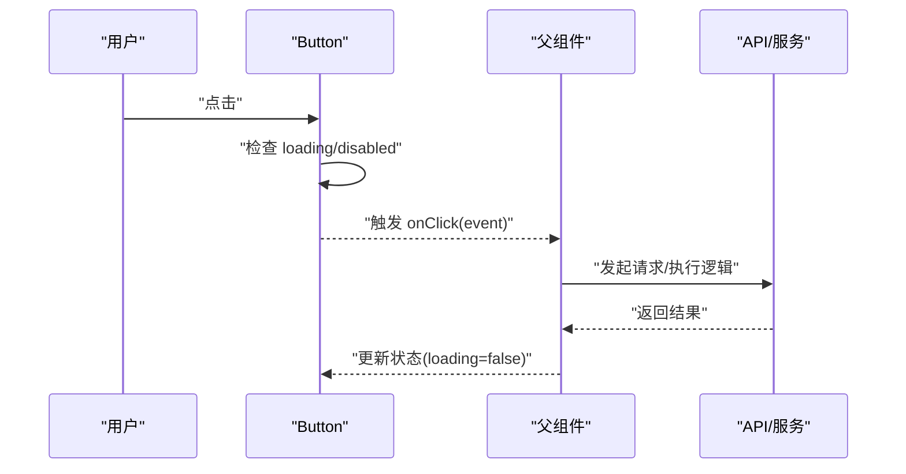

图表来源
- [components/ui/Button.tsx](file://components/ui/Button.tsx)
- [app/(main)/blog/BlogReactions.tsx](file://app/(main)/blog/BlogReactions.tsx)

章节来源
- [components/ui/Button.tsx](file://components/ui/Button.tsx)
- [app/(main)/blog/BlogReactions.tsx](file://app/(main)/blog/BlogReactions.tsx)

### 基础组件：Card
- 设计要点
  - 将内容、元信息与操作分离到不同区域，保持视觉层次清晰。
  - clickable 模式用于列表项或导航卡片。
- 属性接口规范
  - 可选：title、subtitle、description、actions、clickable、onClick、className
- 组合与扩展
  - 与 Avatar、Tag、Button 组合形成信息卡片。
  - 在 BlogPostCard 中作为外层容器承载文章摘要与操作。

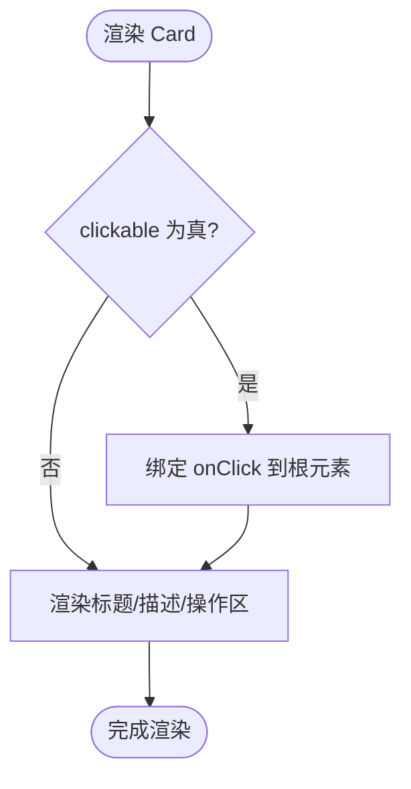

图表来源
- [components/ui/Card.tsx](file://components/ui/Card.tsx)
- [app/(main)/blog/BlogPostCard.tsx](file://app/(main)/blog/BlogPostCard.tsx)

章节来源
- [components/ui/Card.tsx](file://components/ui/Card.tsx)
- [app/(main)/blog/BlogPostCard.tsx](file://app/(main)/blog/BlogPostCard.tsx)

### 基础组件：Dialog
- 设计要点
  - 受控模式：open 由父组件控制，内部不自行维护可见性。
  - 焦点管理：打开时聚焦到第一个可聚焦元素，关闭后恢复焦点。
  - 遮罩与 ESC：支持点击遮罩与 ESC 关闭，可通过 canCloseOnOverlay 控制。
- 属性接口规范
  - 必填：open、onClose
  - 可选：title、content、canCloseOnOverlay、onEscape、className
- 事件处理机制
  - onClose 由父组件处理关闭逻辑（如重置表单、清理状态）。
  - onEscape 用于自定义 ESC 行为。

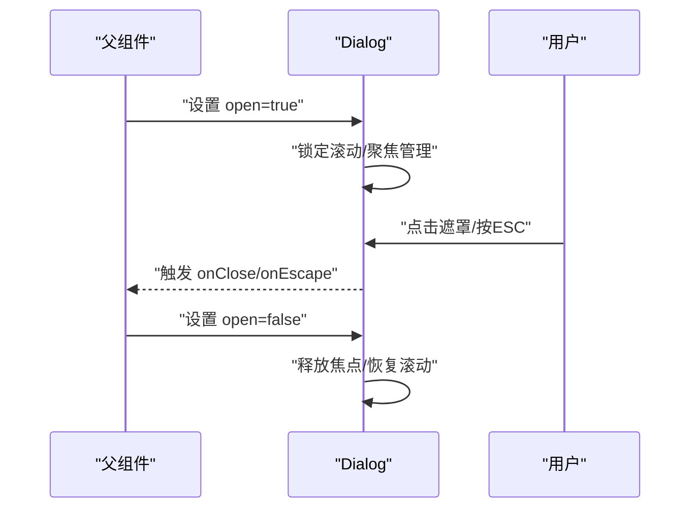

图表来源
- [components/ui/Dialog.tsx](file://components/ui/Dialog.tsx)
- [components/DomainAnnouncementDialog.tsx](file://components/DomainAnnouncementDialog.tsx)

章节来源
- [components/ui/Dialog.tsx](file://components/ui/Dialog.tsx)
- [components/DomainAnnouncementDialog.tsx](file://components/DomainAnnouncementDialog.tsx)

### 基础组件：HoverCard 与 Tooltip
- 设计要点
  - 延迟显示/隐藏以提升体验，避免抖动。
  - 定位策略 placement 支持 top/bottom/left/right。
  - 可访问性：支持 focus 触发与键盘导航。
- 属性接口规范
  - HoverCard：trigger、content、placement、showDelay、hideDelay、className
  - Tooltip：text、placement、delay、className
- 组合与扩展
  - RichLink 可同时使用 HoverCard 与 Tooltip 提供链接预览与说明。

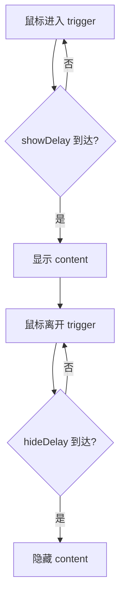

图表来源
- [components/ui/HoverCard.tsx](file://components/ui/HoverCard.tsx)
- [components/ui/Tooltip.tsx](file://components/ui/Tooltip.tsx)
- [components/links/RichLink.tsx](file://components/links/RichLink.tsx)

章节来源
- [components/ui/HoverCard.tsx](file://components/ui/HoverCard.tsx)
- [components/ui/Tooltip.tsx](file://components/ui/Tooltip.tsx)
- [components/links/RichLink.tsx](file://components/links/RichLink.tsx)

### 领域组件：GameUi
- GameUi/Card
  - 职责：游戏场景中的卡片展示，通常包含标题、缩略图与操作。
  - 组合：与 Button、Avatar 组合。
- GameUi/GameItem
  - 职责：单个游戏条目，封装数据与交互（如选择、收藏）。
  - 数据流：从 data.ts 获取静态数据或通过 props 注入。
- GameUi/Page
  - 职责：游戏页面的容器，统一布局与背景。
  - 组合：与 Container 组合，确保响应式布局。

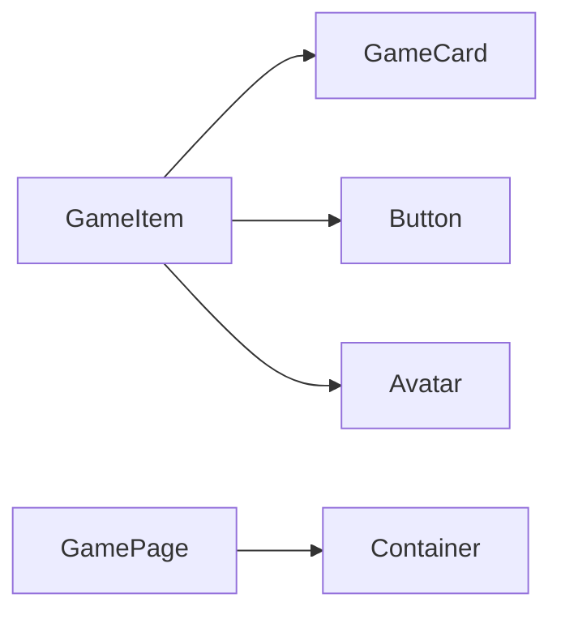

图表来源
- [components/GameUi/GameItem/GameItem.tsx](file://components/GameUi/GameItem/GameItem.tsx)
- [components/GameUi/Card/Card.tsx](file://components/GameUi/Card/Card.tsx)
- [components/GameUi/Page/Pagecomponent.tsx](file://components/GameUi/Page/Pagecomponent.tsx)
- [components/ui/Container.tsx](file://components/ui/Container.tsx)
- [components/ui/Button.tsx](file://components/ui/Button.tsx)
- [components/Avatar.tsx](file://components/Avatar.tsx)

章节来源
- [components/GameUi/GameItem/GameItem.tsx](file://components/GameUi/GameItem/GameItem.tsx)
- [components/GameUi/Card/Card.tsx](file://components/GameUi/Card/Card.tsx)
- [components/GameUi/Page/Pagecomponent.tsx](file://components/GameUi/Page/Pagecomponent.tsx)

### 业务组件：博客模块
- BlogPostCard
  - 职责：展示文章摘要、封面与操作（阅读、反应）。
  - 组合：Card、Button、Avatar。
- BlogPosts
  - 职责：聚合多篇 BlogPostCard，提供分页或筛选。
- BlogPostPage
  - 职责：文章详情页，整合正文、目录、评论与反应。
- BlogPostTableOfContents
  - 职责：根据文章内容生成目录，支持锚点跳转。
- BlogReactions
  - 职责：点赞/表情反馈，与后端 API 交互。

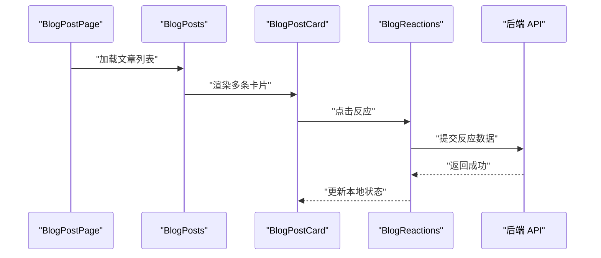

图表来源
- [app/(main)/blog/BlogPostPage.tsx](file://app/(main)/blog/BlogPostPage.tsx)
- [app/(main)/blog/BlogPosts.tsx](file://app/(main)/blog/BlogPosts.tsx)
- [app/(main)/blog/BlogPostCard.tsx](file://app/(main)/blog/BlogPostCard.tsx)
- [app/(main)/blog/BlogReactions.tsx](file://app/(main)/blog/BlogReactions.tsx)

章节来源
- [app/(main)/blog/BlogPostPage.tsx](file://app/(main)/blog/BlogPostPage.tsx)
- [app/(main)/blog/BlogPosts.tsx](file://app/(main)/blog/BlogPosts.tsx)
- [app/(main)/blog/BlogPostCard.tsx](file://app/(main)/blog/BlogPostCard.tsx)
- [app/(main)/blog/BlogReactions.tsx](file://app/(main)/blog/BlogReactions.tsx)

### 业务组件：留言板模块
- Guestbook
  - 职责：留言板入口，集成输入与列表。
- GuestbookFeeds
  - 职责：展示留言列表，支持分页与加载更多。
- GuestbookInput
  - 职责：留言输入表单，含校验与提交。
- 状态管理
  - guestbook.state.ts：集中管理留言列表、加载状态与错误。

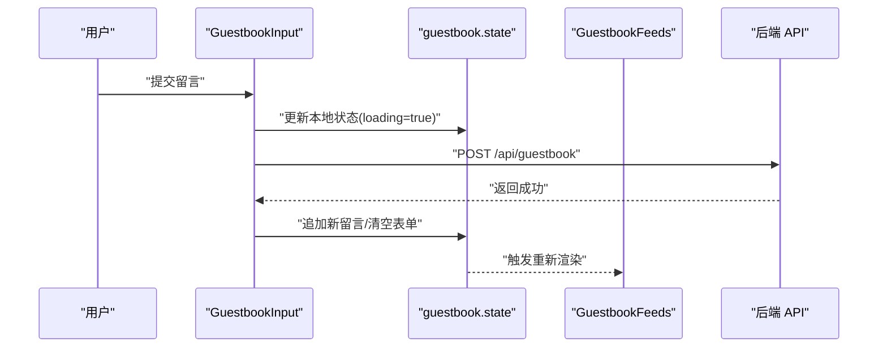

图表来源
- [app/(main)/guestbook/GuestbookInput.tsx](file://app/(main)/guestbook/GuestbookInput.tsx)
- [app/(main)/guestbook/guestbook.state.ts](file://app/(main)/guestbook/guestbook.state.ts)
- [app/(main)/guestbook/GuestbookFeeds.tsx](file://app/(main)/guestbook/GuestbookFeeds.tsx)
- [app/(main)/guestbook/Guestbook.tsx](file://app/(main)/guestbook/Guestbook.tsx)

章节来源
- [app/(main)/guestbook/Guestbook.tsx](file://app/(main)/guestbook/Guestbook.tsx)
- [app/(main)/guestbook/GuestbookFeeds.tsx](file://app/(main)/guestbook/GuestbookFeeds.tsx)
- [app/(main)/guestbook/GuestbookInput.tsx](file://app/(main)/guestbook/GuestbookInput.tsx)
- [app/(main)/guestbook/guestbook.state.ts](file://app/(main)/guestbook/guestbook.state.ts)

### 业务组件：项目展示模块
- ProjectCard
  - 职责：单个项目卡片，包含标题、描述、标签与外链。
- Projects
  - 职责：项目列表聚合，支持筛选与排序。

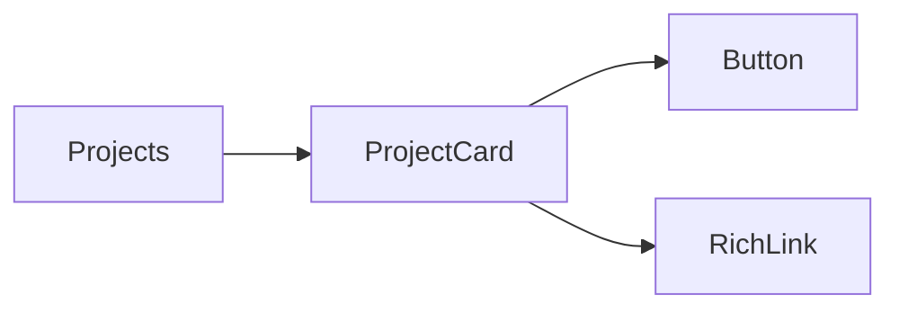

图表来源
- [app/(main)/projects/Projects.tsx](file://app/(main)/projects/Projects.tsx)
- [app/(main)/projects/ProjectCard.tsx](file://app/(main)/projects/ProjectCard.tsx)
- [components/links/RichLink.tsx](file://components/links/RichLink.tsx)
- [components/ui/Button.tsx](file://components/ui/Button.tsx)

章节来源
- [app/(main)/projects/Projects.tsx](file://app/(main)/projects/Projects.tsx)
- [app/(main)/projects/ProjectCard.tsx](file://app/(main)/projects/ProjectCard.tsx)

### 导航与主题
- Header 与 NavigationBar
  - 职责：顶部导航与菜单，支持移动端折叠与主题切换入口。
- ThemeSwitcher 与 ThemeProvider
  - 职责：主题切换开关与全局主题上下文提供者。
- 组合
  - Header 包含 NavigationBar 与 ThemeSwitcher。
  - ThemeProvider 包裹应用根布局，使所有组件可读取主题。

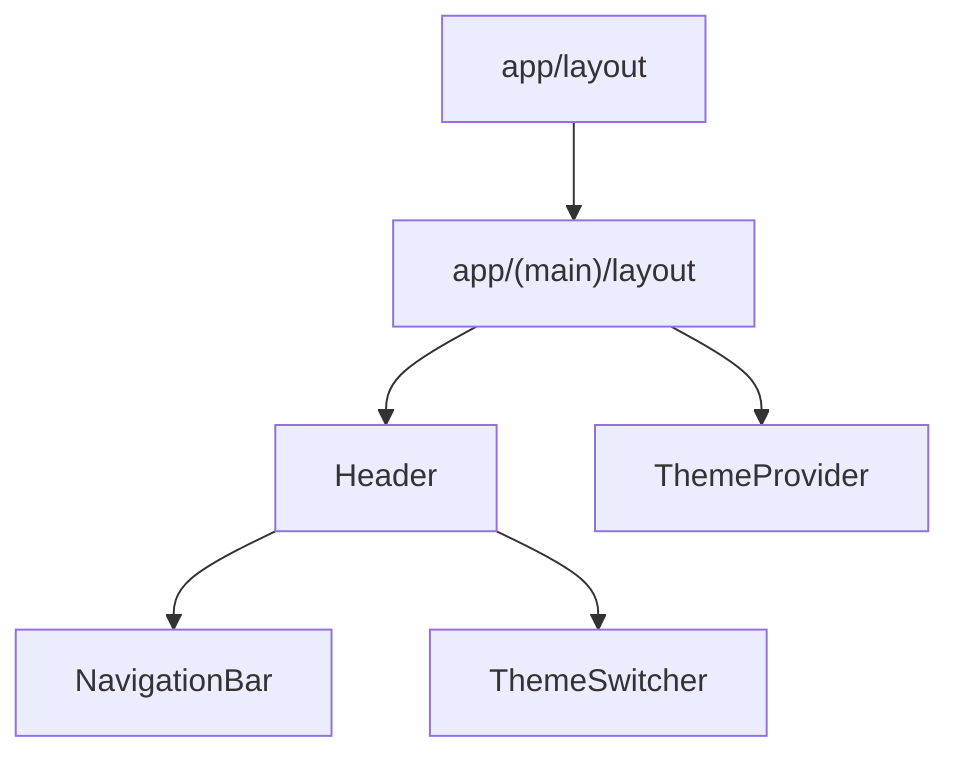

图表来源
- [app/layout.tsx](file://app/layout.tsx)
- [app/(main)/layout.tsx](file://app/(main)/layout.tsx)
- [app/(main)/Header.tsx](file://app/(main)/Header.tsx)
- [app/(main)/NavigationBar.tsx](file://app/(main)/NavigationBar.tsx)
- [app/(main)/ThemeSwitcher.tsx](file://app/(main)/ThemeSwitcher.tsx)
- [app/(main)/ThemeProvider.tsx](file://app/(main)/ThemeProvider.tsx)

章节来源
- [app/layout.tsx](file://app/layout.tsx)
- [app/(main)/layout.tsx](file://app/(main)/layout.tsx)
- [app/(main)/Header.tsx](file://app/(main)/Header.tsx)
- [app/(main)/NavigationBar.tsx](file://app/(main)/NavigationBar.tsx)
- [app/(main)/ThemeSwitcher.tsx](file://app/(main)/ThemeSwitcher.tsx)
- [app/(main)/ThemeProvider.tsx](file://app/(main)/ThemeProvider.tsx)

### 富文本与内容渲染
- PostPortableText
  - 职责：将 Sanity Portable Text 转换为 React 节点。
  - 组合：PortableTextBlocks、PortableTextCodeBlock、PortableTextImage、PortableTextTweet。
- PortableTextBlocks
  - 职责：段落、列表、引用等块级元素渲染。
- PortableTextCodeBlock
  - 职责：代码块高亮与复制。
- PortableTextImage
  - 职责：图片懒加载与占位。
- PortableTextTweet
  - 职责：嵌入推文卡片。

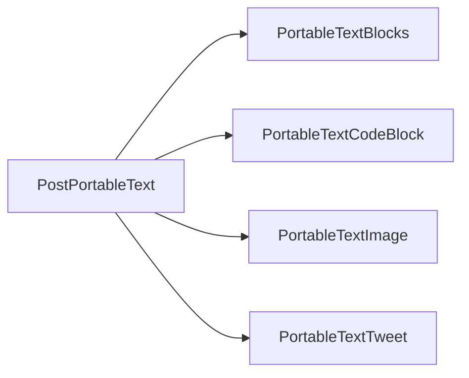

图表来源
- [components/PostPortableText.tsx](file://components/PostPortableText.tsx)
- [components/portable-text/PortableTextBlocks.tsx](file://components/portable-text/PortableTextBlocks.tsx)
- [components/portable-text/PortableTextCodeBlock.tsx](file://components/portable-text/PortableTextCodeBlock.tsx)
- [components/portable-text/PortableTextImage.tsx](file://components/portable-text/PortableTextImage.tsx)
- [components/portable-text/PortableTextTweet.tsx](file://components/portable-text/PortableTextTweet.tsx)

章节来源
- [components/PostPortableText.tsx](file://components/PostPortableText.tsx)
- [components/portable-text/PortableTextBlocks.tsx](file://components/portable-text/PortableTextBlocks.tsx)
- [components/portable-text/PortableTextCodeBlock.tsx](file://components/portable-text/PortableTextCodeBlock.tsx)
- [components/portable-text/PortableTextImage.tsx](file://components/portable-text/PortableTextImage.tsx)
- [components/portable-text/PortableTextTweet.tsx](file://components/portable-text/PortableTextTweet.tsx)

## 依赖关系分析
- 组件耦合度
  - 基础组件低耦合，业务组件通过组合使用基础组件，降低变更影响面。
- 外部依赖
  - Tailwind 样式框架、Next.js 路由与 API 路由、Sanity 内容模型。
- 潜在循环依赖
  - 避免业务组件反向导入基础组件之外的其他业务组件，防止环状依赖。
- 接口契约
  - 基础组件对外暴露稳定 props 与事件，业务组件不应修改其内部实现细节。

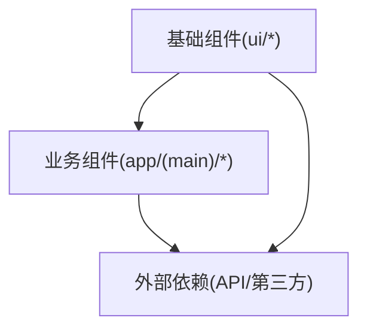

图表来源
- [components/ui/Button.tsx](file://components/ui/Button.tsx)
- [components/ui/Card.tsx](file://components/ui/Card.tsx)
- [components/ui/Container.tsx](file://components/ui/Container.tsx)
- [components/ui/Dialog.tsx](file://components/ui/Dialog.tsx)
- [components/ui/HoverCard.tsx](file://components/ui/HoverCard.tsx)
- [components/ui/Tooltip.tsx](file://components/ui/Tooltip.tsx)
- [app/(main)/blog/BlogPostCard.tsx](file://app/(main)/blog/BlogPostCard.tsx)
- [app/(main)/guestbook/Guestbook.tsx](file://app/(main)/guestbook/Guestbook.tsx)
- [app/(main)/projects/Projects.tsx](file://app/(main)/projects/Projects.tsx)

章节来源
- [components/ui/Button.tsx](file://components/ui/Button.tsx)
- [components/ui/Card.tsx](file://components/ui/Card.tsx)
- [components/ui/Container.tsx](file://components/ui/Container.tsx)
- [components/ui/Dialog.tsx](file://components/ui/Dialog.tsx)
- [components/ui/HoverCard.tsx](file://components/ui/HoverCard.tsx)
- [components/ui/Tooltip.tsx](file://components/ui/Tooltip.tsx)
- [app/(main)/blog/BlogPostCard.tsx](file://app/(main)/blog/BlogPostCard.tsx)
- [app/(main)/guestbook/Guestbook.tsx](file://app/(main)/guestbook/Guestbook.tsx)
- [app/(main)/projects/Projects.tsx](file://app/(main)/projects/Projects.tsx)

## 性能考量
- 渲染优化
  - 使用 memo/useMemo/useCallback 减少不必要的重渲染。
  - 列表渲染使用稳定 key，避免 DOM 重建。
- 资源加载
  - 图片懒加载与占位，视频与第三方脚本按需加载（ClientOnly）。
- 交互优化
  - 防抖/节流处理高频事件（搜索、滚动）。
  - 大列表虚拟滚动（如 react-window）提升长列表性能。
- 网络优化
  - 请求去重与缓存（React Query 或 SWR），失败重试与超时控制。
- 可访问性与 SEO
  - 语义化标签与 ARIA 属性，结构化数据与 meta 优化。

[本节为通用指导，无需具体文件来源]

## 故障排查指南
- 常见问题
  - 主题未生效：检查 ThemeProvider 是否包裹根布局，CSS 变量是否正确注入。
  - 对话框无法关闭：确认 open 状态由父组件控制，onClose 是否被正确调用。
  - 富文本渲染异常：检查 Portable Text 数据结构与对应渲染器映射。
  - 富链接悬停错位：调整 HoverCard placement 与延迟参数。
- 调试建议
  - 使用浏览器开发者工具检查组件树与 props。
  - 在关键事件处添加日志，观察状态变化。
  - 针对网络请求，查看 API 路由返回码与错误信息。

章节来源
- [app/(main)/ThemeProvider.tsx](file://app/(main)/ThemeProvider.tsx)
- [components/ui/Dialog.tsx](file://components/ui/Dialog.tsx)
- [components/PostPortableText.tsx](file://components/PostPortableText.tsx)
- [components/ui/HoverCard.tsx](file://components/ui/HoverCard.tsx)
- [components/links/RichLink.tsx](file://components/links/RichLink.tsx)

## 结论
本组件系统以基础组件为核心，通过组合与扩展满足多样化业务需求。遵循单一职责、受控模式与可访问性原则，确保组件的可维护性与可扩展性。建议在后续迭代中完善测试覆盖率、文档站点与自动化发布流程，进一步提升团队协作效率与产品质量。

[本节为总结，无需具体文件来源]

## 附录

### 组件开发示例与设计规范
- 新增基础组件步骤
  - 定义 props 接口与默认值，明确受控/非受控模式。
  - 实现最小可用功能，编写单元测试与交互用例。
  - 在 Storybook 中添加故事，展示不同变体与状态。
  - 在 README 中补充使用说明与示例路径。
- 命名与导出
  - 组件文件名与导出名保持一致，使用 PascalCase。
  - 优先默认导出组件，按需导出类型与常量。
- 样式与主题
  - 使用 Tailwind 原子类，必要时引入 CSS Modules/CSS 文件。
  - 通过 CSS 变量或 Tailwind 配置实现主题化。
- 事件与副作用
  - 事件回调命名以 on 开头，参数简洁明确。
  - 副作用尽量下沉至业务层，基础组件保持纯函数风格。

章节来源
- [components/ui/Button.tsx](file://components/ui/Button.tsx)
- [components/ui/Card.tsx](file://components/ui/Card.tsx)
- [components/ui/Container.tsx](file://components/ui/Container.tsx)
- [components/ui/Dialog.tsx](file://components/ui/Dialog.tsx)
- [components/ui/HoverCard.tsx](file://components/ui/HoverCard.tsx)
- [components/ui/Tooltip.tsx](file://components/ui/Tooltip.tsx)

### 组件测试策略
- 单元与交互测试
  - 使用 Jest + React Testing Library 进行断言与模拟用户交互。
  - 覆盖关键路径：点击、键盘、悬停、焦点管理。
- 快照测试
  - 对稳定 UI 输出进行快照比对，注意合理拆分以避免过度敏感。
- 端到端测试
  - 使用 Playwright/Cypress 验证跨组件工作流（如留言提交、文章阅读）。

章节来源
- [components/ui/Button.tsx](file://components/ui/Button.tsx)
- [components/ui/Dialog.tsx](file://components/ui/Dialog.tsx)
- [app/(main)/guestbook/GuestbookInput.tsx](file://app/(main)/guestbook/GuestbookInput.tsx)

### 文档生成与示例
- 文档站点
  - 使用 Storybook 或 Docusaurus 生成组件文档与示例。
  - 在 README 中提供快速上手与常用组合示例。
- 示例路径
  - 博客卡片示例：[app/(main)/blog/BlogPostCard.tsx](file://app/(main)/blog/BlogPostCard.tsx)
  - 留言板示例：[app/(main)/guestbook/Guestbook.tsx](file://app/(main)/guestbook/Guestbook.tsx)
  - 项目展示示例：[app/(main)/projects/Projects.tsx](file://app/(main)/projects/Projects.tsx)

章节来源
- [app/(main)/blog/BlogPostCard.tsx](file://app/(main)/blog/BlogPostCard.tsx)
- [app/(main)/guestbook/Guestbook.tsx](file://app/(main)/guestbook/Guestbook.tsx)
- [app/(main)/projects/Projects.tsx](file://app/(main)/projects/Projects.tsx)

### 版本管理与发布流程
- 版本管理
  - 使用语义化版本（SemVer），在 package.json 中维护版本号。
  - 通过 Git Tag 标记发布版本，记录变更日志。
- 发布流程
  - 构建与测试通过后，打包并发布到私有仓库或 CDN。
  - 在文档站点同步更新组件版本与迁移指南。
- 回滚策略
  - 保留历史版本包，支持快速回滚与热修复。

章节来源
- [package.json](file://package.json)