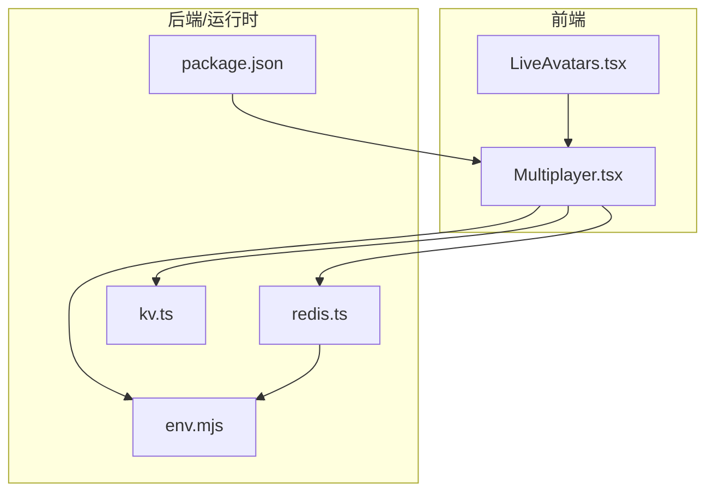
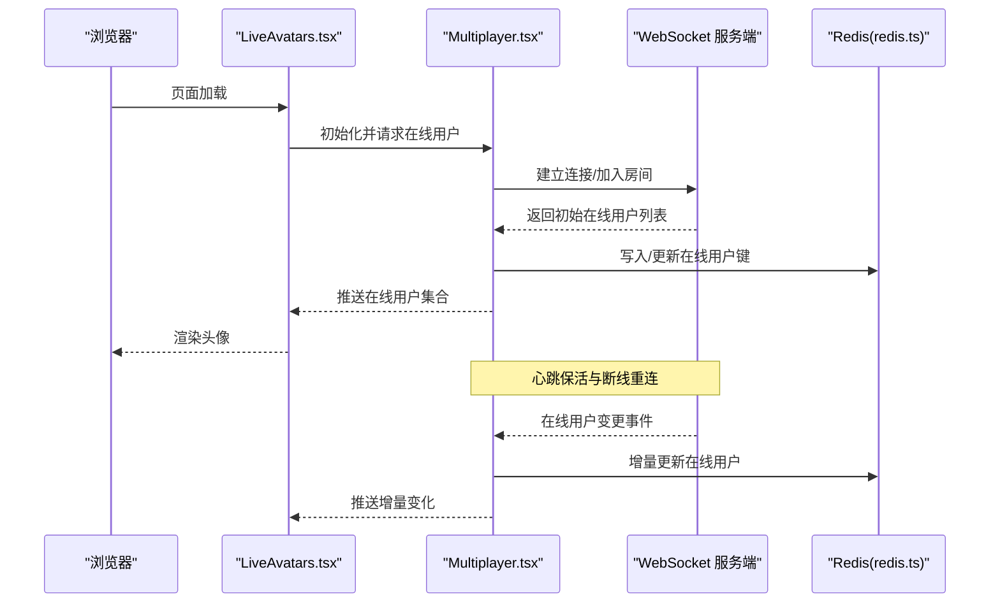
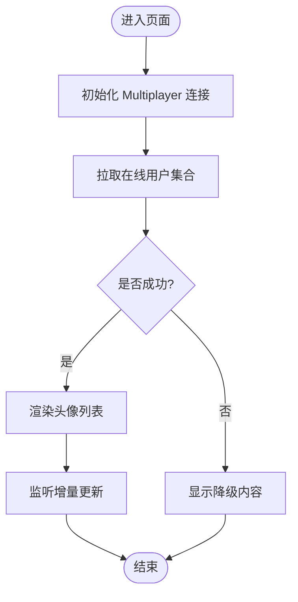
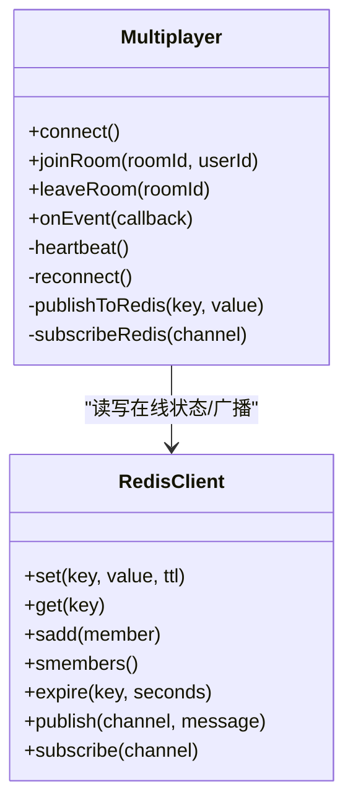
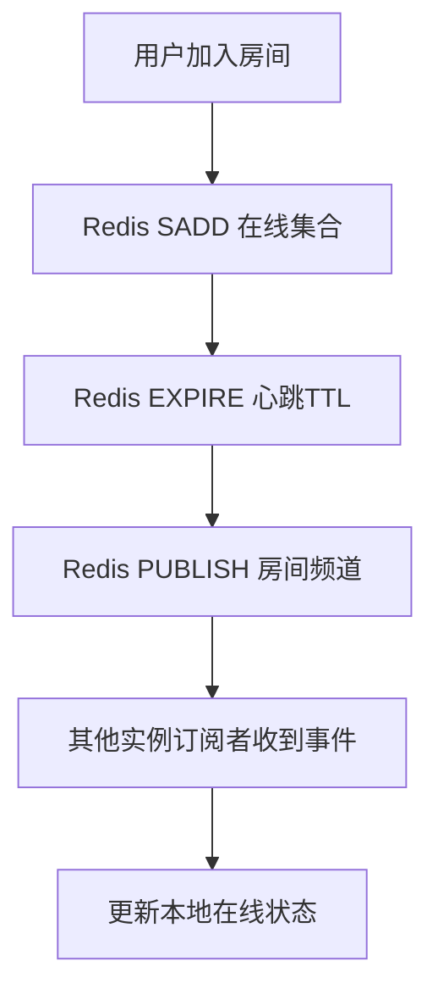
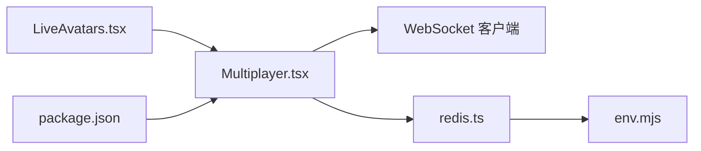

# 实时功能

<cite>
**本文引用的文件**   
- [LiveAvatars.tsx](file://components/LiveAvatars.tsx)
- [Multiplayer.tsx](file://components/Multiplayer.tsx)
- [redis.ts](file://lib/redis.ts)
- [kv.ts](file://config/kv.ts)
- [env.mjs](file://env.mjs)
- [package.json](file://package.json)
</cite>

## 目录
1. [简介](#简介)
2. [项目结构](#项目结构)
3. [核心组件](#核心组件)
4. [架构总览](#架构总览)
5. [详细组件分析](#详细组件分析)
6. [依赖关系分析](#依赖关系分析)
7. [性能考虑](#性能考虑)
8. [故障恢复与一致性](#故障恢复与一致性)
9. [监控、调试与排障指南](#监控调试与排障指南)
10. [结论](#结论)
11. [附录：配置与示例](#附录配置与示例)

## 简介
本技术文档聚焦 cali.so 的“实时功能”，围绕以下目标展开：
- 实时头像显示（LiveAvatars）与多人协作（Multiplayer）的实现架构
- Redis 缓存层设计、WebSocket 连接管理与实时数据同步机制
- 用户在线状态跟踪、房间管理机制与消息广播模式
- 启用实时功能的配置示例、自定义连接参数与性能优化建议
- 故障恢复、连接重连与数据一致性保证策略
- 实时监控、调试工具与性能分析最佳实践

## 项目结构
实时功能主要涉及前端组件与后端缓存/配置模块，关键文件如下：
- 前端组件
  - components/LiveAvatars.tsx：展示实时在线头像列表
  - components/Multiplayer.tsx：多人协作能力入口与编排
- 后端/运行时
  - lib/redis.ts：Redis 客户端封装与常用操作
  - config/kv.ts：KV/缓存相关配置
  - env.mjs：环境变量加载与校验
  - package.json：运行时依赖声明（含 WebSocket 相关库）

图表来源
- [LiveAvatars.tsx](file://components/LiveAvatars.tsx)
- [Multiplayer.tsx](file://components/Multiplayer.tsx)
- [redis.ts](file://lib/redis.ts)
- [kv.ts](file://config/kv.ts)
- [env.mjs](file://env.mjs)
- [package.json](file://package.json)

章节来源
- [LiveAvatars.tsx](file://components/LiveAvatars.tsx)
- [Multiplayer.tsx](file://components/Multiplayer.tsx)
- [redis.ts](file://lib/redis.ts)
- [kv.ts](file://config/kv.ts)
- [env.mjs](file://env.mjs)
- [package.json](file://package.json)

## 核心组件
- LiveAvatars（实时头像）
  - 职责：订阅在线用户集合，渲染当前在线用户的头像缩略图；支持最小化视图与悬浮提示。
  - 交互：通过 Multiplayer 提供的连接通道获取在线用户列表增量更新。
- Multiplayer（多人协作）
  - 职责：管理 WebSocket 生命周期（连接、心跳、重连）、房间加入/离开、消息路由与广播、在线状态维护。
  - 集成：读取环境配置（如 Redis 地址、端口、鉴权信息），调用 redis.ts 进行状态持久化或跨实例广播。

章节来源
- [LiveAvatars.tsx](file://components/LiveAvatars.tsx)
- [Multiplayer.tsx](file://components/Multiplayer.tsx)

## 架构总览
整体采用“前端组件 + 后端缓存”的轻量实时方案：
- 前端通过 Multiplayer 建立 WebSocket 长连接，订阅房间事件（在线用户变更、协作动作等）。
- 后端使用 Redis 作为在线用户索引与房间状态存储，实现跨进程/实例的状态共享与广播。
- LiveAvatars 消费在线用户集合，以头像形式呈现。

图表来源
- [Multiplayer.tsx](file://components/Multiplayer.tsx)
- [redis.ts](file://lib/redis.ts)

## 详细组件分析

### LiveAvatars 组件
- 数据源：从 Multiplayer 暴露的在线用户集合中订阅最新状态。
- 渲染策略：仅展示前 N 个头像，超出部分以“+N”聚合显示，避免 UI 拥挤。
- 交互细节：悬浮显示用户名/状态；点击可跳转至用户主页（若可用）。
- 错误处理：当无法获取在线用户时降级为静态占位或隐藏。

图表来源
- [LiveAvatars.tsx](file://components/LiveAvatars.tsx)
- [Multiplayer.tsx](file://components/Multiplayer.tsx)

章节来源
- [LiveAvatars.tsx](file://components/LiveAvatars.tsx)
- [Multiplayer.tsx](file://components/Multiplayer.tsx)

### Multiplayer 组件
- 连接管理
  - 建立 WebSocket 连接，携带房间标识与用户标识。
  - 心跳机制：周期性发送 ping，超时未收到 pong 则触发重连。
  - 指数退避重连：在失败后按指数退避策略重试，避免雪崩。
- 房间管理
  - 加入房间：服务端将用户加入对应房间，并返回初始在线用户集合。
  - 离开房间：清理本地状态，通知服务端移除用户。
- 消息广播
  - 订阅房间内事件（如在线用户变更、协作动作），转发给订阅者（如 LiveAvatars）。
- 与 Redis 的协同
  - 使用 Redis 维护在线用户集合与房间成员索引，确保多实例一致性。
  - 利用过期键或 TTL 辅助心跳检测与离线清理。

图表来源
- [Multiplayer.tsx](file://components/Multiplayer.tsx)
- [redis.ts](file://lib/redis.ts)

章节来源
- [Multiplayer.tsx](file://components/Multiplayer.tsx)
- [redis.ts](file://lib/redis.ts)

### Redis 缓存层
- 角色定位
  - 在线用户集合：以 Set 结构维护每个房间的在线用户 ID。
  - 心跳与存活：结合 TTL 或定期续期，用于快速识别离线用户。
  - 跨实例广播：通过 Pub/Sub 将在线状态变更分发到所有实例。
- 关键操作
  - 加入房间：向房间集合添加用户，设置心跳 TTL。
  - 离开房间：从集合移除用户，取消 TTL。
  - 查询在线用户：返回集合成员。
  - 订阅变更：订阅房间频道，接收在线用户增删事件。

图表来源
- [redis.ts](file://lib/redis.ts)

章节来源
- [redis.ts](file://lib/redis.ts)

## 依赖关系分析
- 前端依赖
  - LiveAvatars 依赖 Multiplayer 暴露的在线用户接口。
  - Multiplayer 依赖 WebSocket 客户端与服务端通信。
- 后端/运行时依赖
  - Multiplayer 依赖 Redis 客户端进行状态持久化与广播。
  - Redis 客户端依赖环境变量（地址、端口、密码、数据库号等）。
  - package.json 声明了 WebSocket 与 Redis 客户端库版本。

图表来源
- [LiveAvatars.tsx](file://components/LiveAvatars.tsx)
- [Multiplayer.tsx](file://components/Multiplayer.tsx)
- [redis.ts](file://lib/redis.ts)
- [env.mjs](file://env.mjs)
- [package.json](file://package.json)

章节来源
- [LiveAvatars.tsx](file://components/LiveAvatars.tsx)
- [Multiplayer.tsx](file://components/Multiplayer.tsx)
- [redis.ts](file://lib/redis.ts)
- [env.mjs](file://env.mjs)
- [package.json](file://package.json)

## 性能考虑
- 连接复用与池化
  - 复用 WebSocket 连接，减少握手开销。
  - 合理设置心跳间隔与超时阈值，平衡实时性与资源消耗。
- 数据精简
  - 仅传输必要字段（如用户 ID、头像 URL），避免大对象。
  - 对在线用户集合做分页或限制数量展示。
- 缓存与去抖
  - 对频繁更新的在线状态做去抖合并，降低渲染压力。
  - 使用 Redis 的 TTL 与批量操作减少 IO 次数。
- 前端渲染优化
  - 虚拟列表或懒加载头像，避免首屏阻塞。
  - 图片预加载与缓存策略，提升二次访问速度。

[本节为通用性能建议，不直接分析具体文件]

## 故障恢复与一致性
- 连接重连
  - 指数退避重连，避免风暴式重试。
  - 断线期间缓冲消息，重连后补发或丢弃过期消息。
- 心跳与离线清理
  - 基于 TTL 的心跳检测，服务端定时清理过期用户。
  - 客户端在收到离线事件后更新本地状态。
- 数据一致性
  - 以 Redis 为权威状态源，客户端状态为副本。
  - 使用房间级有序事件或版本号，避免乱序导致的覆盖问题。
- 幂等性
  - 对加入/离开房间与状态更新操作设计幂等逻辑，防止重复应用导致不一致。

[本节为通用可靠性建议，不直接分析具体文件]

## 监控、调试与排障指南
- 监控指标
  - WebSocket 连接数、重连次数、平均延迟、丢包率。
  - Redis 在线用户集合大小、TTL 命中率、Pub/Sub 吞吐。
- 日志与追踪
  - 记录连接建立、加入/离开房间、心跳超时、重连事件。
  - 为每条消息附加房间与用户标识，便于链路追踪。
- 常见问题排查
  - 连接失败：检查网络连通性、防火墙与代理设置。
  - 在线状态不同步：核对 Redis 键空间与 TTL 配置。
  - 头像不更新：确认事件订阅与增量更新逻辑。
- 调试工具
  - 浏览器开发者工具的 Network/WebSocket 面板。
  - Redis CLI 查看集合成员与 TTL。
  - 服务端日志聚合与告警规则。

[本节为通用运维建议，不直接分析具体文件]

## 结论
通过将 WebSocket 与 Redis 结合，cali.so 实现了轻量而高效的实时功能：
- LiveAvatars 提供直观的在线用户可视化。
- Multiplayer 负责连接管理、房间与会话状态。
- Redis 作为统一状态源，保障多实例一致性与可扩展性。
配合合理的性能优化与监控排障策略，可在高并发场景下稳定运行。

[本节为总结性内容，不直接分析具体文件]

## 附录：配置与示例
- 启用实时功能
  - 在环境变量中配置 Redis 连接参数（地址、端口、密码、数据库号等）。
  - 在 Multiplayer 初始化时传入房间标识与用户标识。
- 自定义连接参数
  - 调整心跳间隔、超时阈值与重连退避策略。
  - 设置最大在线头像展示数量与去抖时间。
- 性能优化示例
  - 开启 Redis 连接池与批量操作。
  - 对在线用户集合进行分页与增量更新。
- 安全与鉴权
  - 在 WebSocket 握手阶段验证用户身份。
  - 对房间访问权限进行校验，防止越权。

章节来源
- [env.mjs](file://env.mjs)
- [kv.ts](file://config/kv.ts)
- [package.json](file://package.json)