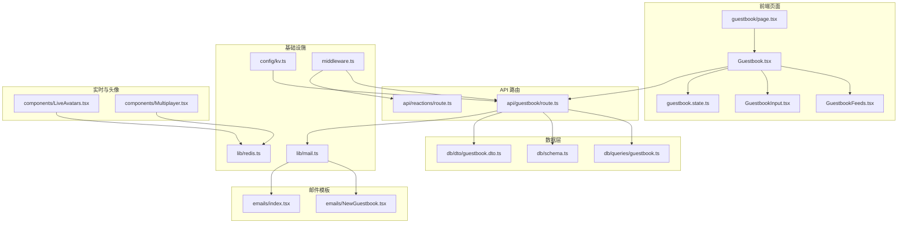
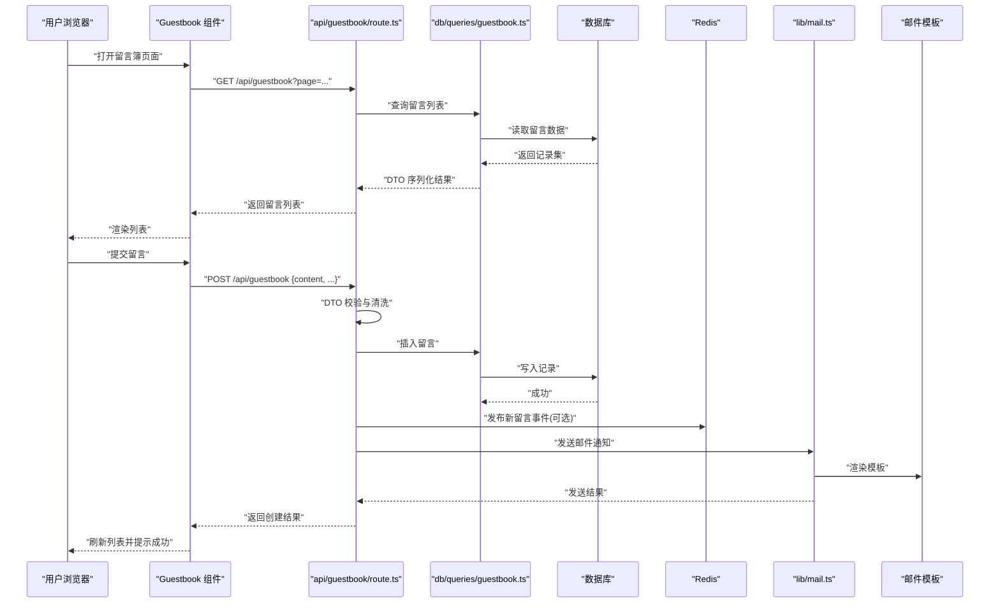
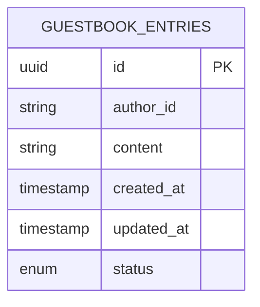
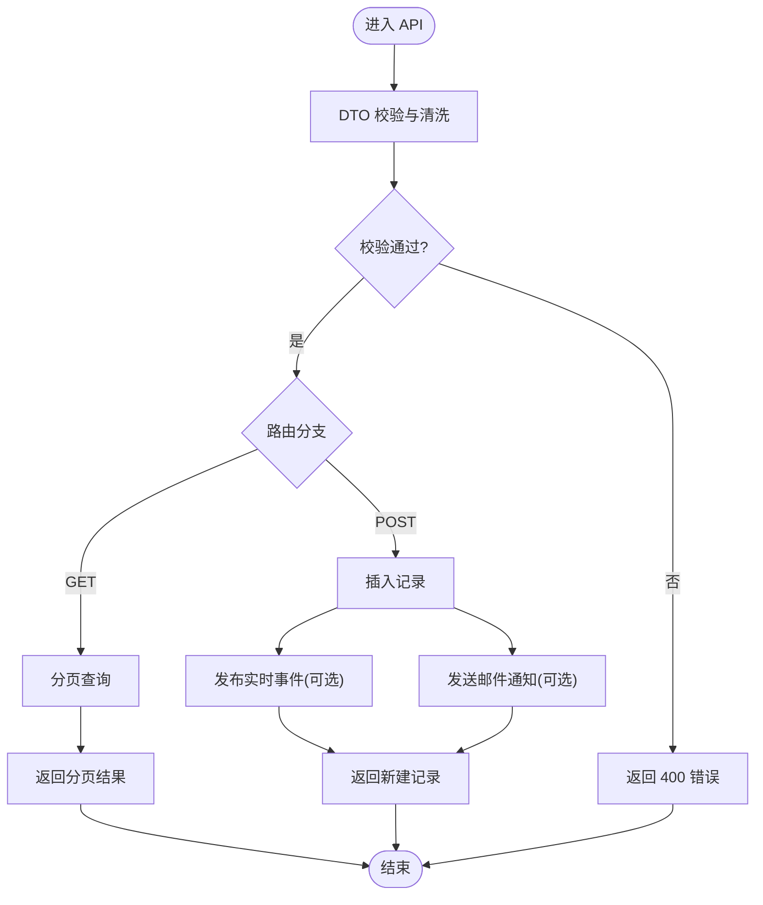
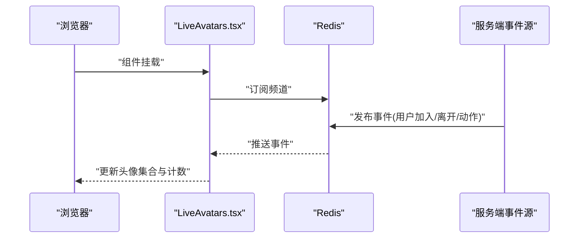
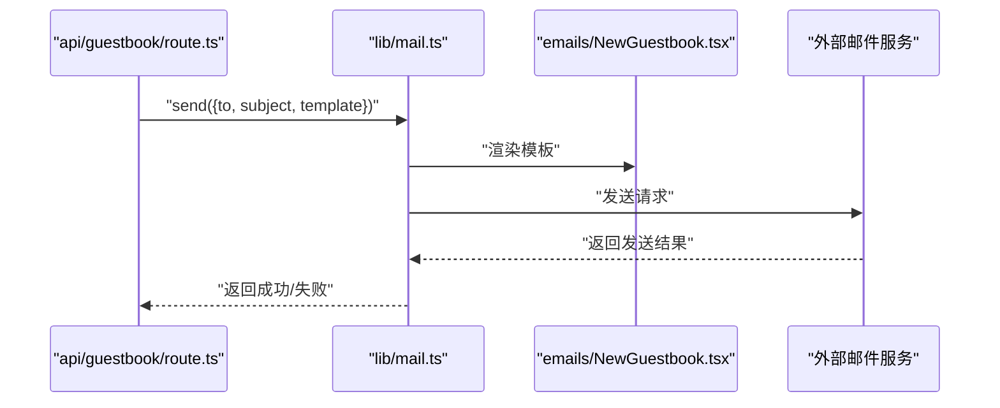
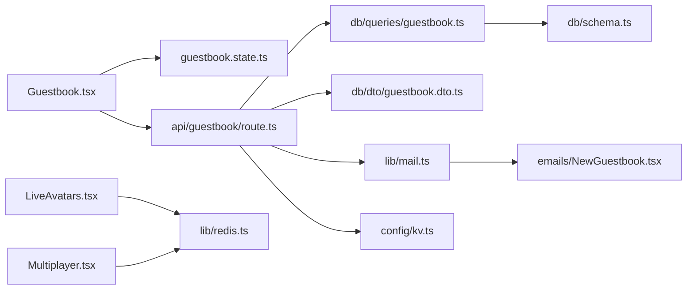

# 用户互动系统

<cite>
**本文引用的文件**   
- [app/(main)/guestbook/page.tsx](file://app/(main)/guestbook/page.tsx)
- [app/(main)/guestbook/Guestbook.tsx](file://app/(main)/guestbook/Guestbook.tsx)
- [app/(main)/guestbook/GuestbookFeeds.tsx](file://app/(main)/guestbook/GuestbookFeeds.tsx)
- [app/(main)/guestbook/GuestbookInput.tsx](file://app/(main)/guestbook/GuestbookInput.tsx)
- [app/(main)/guestbook/guestbook.state.ts](file://app/(main)/guestbook/guestbook.state.ts)
- [app/api/guestbook/route.ts](file://app/api/guestbook/route.ts)
- [db/schema.ts](file://db/schema.ts)
- [db/dto/guestbook.dto.ts](file://db/dto/guestbook.dto.ts)
- [db/queries/guestbook.ts](file://db/queries/guestbook.ts)
- [components/LiveAvatars.tsx](file://components/LiveAvatars.tsx)
- [components/Multiplayer.tsx](file://components/Multiplayer.tsx)
- [lib/redis.ts](file://lib/redis.ts)
- [middleware.ts](file://middleware.ts)
- [config/kv.ts](file://config/kv.ts)
- [emails/NewGuestbook.tsx](file://emails/NewGuestbook.tsx)
- [emails/index.tsx](file://emails/index.tsx)
- [lib/mail.ts](file://lib/mail.ts)
- [app/(main)/blog/BlogReactions.tsx](file://app/(main)/blog/BlogReactions.tsx)
- [app/api/reactions/route.ts](file://app/api/reactions/route.ts)
- [app/admin/comments/page.tsx](file://app/admin/comments/page.tsx)
</cite>

## 目录
1. [简介](#简介)
2. [项目结构](#项目结构)
3. [核心组件](#核心组件)
4. [架构总览](#架构总览)
5. [详细组件分析](#详细组件分析)
6. [依赖关系分析](#依赖关系分析)
7. [性能考虑](#性能考虑)
8. [故障排除指南](#故障排除指南)
9. [结论](#结论)
10. [附录](#附录)

## 简介
本文件为 cali.so 用户互动系统的全面功能文档，覆盖以下能力：
- 访客留言簿：提交、展示、分页与状态管理
- 评论系统：博客评论的交互与后端处理（含管理员审核入口）
- 实时头像显示：基于 Redis Pub/Sub 的在线访客头像聚合
- 邮件通知：新留言与订阅确认等模板化邮件发送
- 认证与权限：集成外部身份服务，控制访问与操作权限
- 安全与防护：输入校验、速率限制、敏感信息保护
- 性能优化：缓存、去重、批量写入与前端渲染优化
- 故障排查：常见问题定位与恢复建议

## 项目结构
用户互动相关代码主要分布在以下模块：
- 页面与组件：app/(main)/guestbook 下的页面与 UI 组件；components 中的 LiveAvatars、Multiplayer 等
- API 路由：app/api/guestbook/route.ts 提供留言簿接口；app/api/reactions/route.ts 提供点赞/反应接口
- 数据层：db/schema.ts 定义表结构；db/queries/guestbook.ts 封装查询；db/dto/guestbook.dto.ts 定义请求/响应 DTO
- 配置与工具：config/kv.ts 键值存储配置；lib/redis.ts Redis 客户端；lib/mail.ts 邮件发送封装
- 邮件模板：emails/* 下模板文件与统一入口
- 中间件：middleware.ts 用于全局鉴权与路由拦截
- 管理后台：app/admin/comments/page.tsx 提供评论管理入口

图表来源
- [app/(main)/guestbook/page.tsx](file://app/(main)/guestbook/page.tsx)
- [app/(main)/guestbook/Guestbook.tsx](file://app/(main)/guestbook/Guestbook.tsx)
- [app/(main)/guestbook/GuestbookFeeds.tsx](file://app/(main)/guestbook/GuestbookFeeds.tsx)
- [app/(main)/guestbook/GuestbookInput.tsx](file://app/(main)/guestbook/GuestbookInput.tsx)
- [app/(main)/guestbook/guestbook.state.ts](file://app/(main)/guestbook/guestbook.state.ts)
- [app/api/guestbook/route.ts](file://app/api/guestbook/route.ts)
- [db/schema.ts](file://db/schema.ts)
- [db/queries/guestbook.ts](file://db/queries/guestbook.ts)
- [db/dto/guestbook.dto.ts](file://db/dto/guestbook.dto.ts)
- [lib/redis.ts](file://lib/redis.ts)
- [config/kv.ts](file://config/kv.ts)
- [emails/NewGuestbook.tsx](file://emails/NewGuestbook.tsx)
- [emails/index.tsx](file://emails/index.tsx)
- [lib/mail.ts](file://lib/mail.ts)
- [components/LiveAvatars.tsx](file://components/LiveAvatars.tsx)
- [components/Multiplayer.tsx](file://components/Multiplayer.tsx)
- [middleware.ts](file://middleware.ts)

章节来源
- [app/(main)/guestbook/page.tsx](file://app/(main)/guestbook/page.tsx)
- [app/(main)/guestbook/Guestbook.tsx](file://app/(main)/guestbook/Guestbook.tsx)
- [app/(main)/guestbook/GuestbookFeeds.tsx](file://app/(main)/guestbook/GuestbookFeeds.tsx)
- [app/(main)/guestbook/GuestbookInput.tsx](file://app/(main)/guestbook/GuestbookInput.tsx)
- [app/(main)/guestbook/guestbook.state.ts](file://app/(main)/guestbook/guestbook.state.ts)
- [app/api/guestbook/route.ts](file://app/api/guestbook/route.ts)
- [db/schema.ts](file://db/schema.ts)
- [db/queries/guestbook.ts](file://db/queries/guestbook.ts)
- [db/dto/guestbook.dto.ts](file://db/dto/guestbook.dto.ts)
- [lib/redis.ts](file://lib/redis.ts)
- [config/kv.ts](file://config/kv.ts)
- [emails/NewGuestbook.tsx](file://emails/NewGuestbook.tsx)
- [emails/index.tsx](file://emails/index.tsx)
- [lib/mail.ts](file://lib/mail.ts)
- [components/LiveAvatars.tsx](file://components/LiveAvatars.tsx)
- [components/Multiplayer.tsx](file://components/Multiplayer.tsx)
- [middleware.ts](file://middleware.ts)

## 核心组件
- 留言簿页面与组件
  - 页面入口负责加载与布局，组合 Guestbook 主组件
  - Guestbook 负责整体状态、表单提交、列表刷新与错误提示
  - GuestbookFeeds 负责渲染留言列表与分页
  - GuestbookInput 负责表单输入、本地校验与提交
  - guestbook.state.ts 集中管理留言列表、加载态、错误态与分页参数
- API 路由
  - api/guestbook/route.ts 提供 GET/POST 接口，分别用于获取留言列表与新增留言
  - 使用 DTO 进行入参校验与出参序列化
  - 调用 db/queries/guestbook.ts 执行数据库读写
  - 可选触发邮件通知（通过 lib/mail.ts）
- 实时头像与多人协作
  - components/LiveAvatars.tsx 订阅 Redis 频道，聚合当前在线访客头像
  - components/Multiplayer.tsx 提供通用多人事件通道（可复用至其他场景）
  - lib/redis.ts 封装连接、发布/订阅与键空间操作
- 邮件通知
  - emails/NewGuestbook.tsx 为新留言邮件模板
  - emails/index.tsx 作为模板导出入口
  - lib/mail.ts 封装邮件发送逻辑（对接 Resend 或同类服务）
- 认证与权限
  - middleware.ts 在路由级别进行鉴权与访问控制
  - 结合外部身份服务（如 Clack Auth）完成登录、会话与角色判断

章节来源
- [app/(main)/guestbook/Guestbook.tsx](file://app/(main)/guestbook/Guestbook.tsx)
- [app/(main)/guestbook/GuestbookFeeds.tsx](file://app/(main)/guestbook/GuestbookFeeds.tsx)
- [app/(main)/guestbook/GuestbookInput.tsx](file://app/(main)/guestbook/GuestbookInput.tsx)
- [app/(main)/guestbook/guestbook.state.ts](file://app/(main)/guestbook/guestbook.state.ts)
- [app/api/guestbook/route.ts](file://app/api/guestbook/route.ts)
- [db/queries/guestbook.ts](file://db/queries/guestbook.ts)
- [db/dto/guestbook.dto.ts](file://db/dto/guestbook.dto.ts)
- [components/LiveAvatars.tsx](file://components/LiveAvatars.tsx)
- [components/Multiplayer.tsx](file://components/Multiplayer.tsx)
- [lib/redis.ts](file://lib/redis.ts)
- [emails/NewGuestbook.tsx](file://emails/NewGuestbook.tsx)
- [emails/index.tsx](file://emails/index.tsx)
- [lib/mail.ts](file://lib/mail.ts)
- [middleware.ts](file://middleware.ts)

## 架构总览
留言簿与评论系统采用前后端分离的 Next.js App Router 架构。前端通过 React 组件与状态管理驱动交互，后端通过 API 路由处理业务逻辑，数据持久化到数据库并通过 Redis 实现实时能力，邮件通过模板化服务异步发送。

图表来源
- [app/(main)/guestbook/Guestbook.tsx](file://app/(main)/guestbook/Guestbook.tsx)
- [app/api/guestbook/route.ts](file://app/api/guestbook/route.ts)
- [db/queries/guestbook.ts](file://db/queries/guestbook.ts)
- [db/schema.ts](file://db/schema.ts)
- [db/dto/guestbook.dto.ts](file://db/dto/guestbook.dto.ts)
- [lib/redis.ts](file://lib/redis.ts)
- [lib/mail.ts](file://lib/mail.ts)
- [emails/NewGuestbook.tsx](file://emails/NewGuestbook.tsx)
- [emails/index.tsx](file://emails/index.tsx)

## 详细组件分析

### 留言簿数据模型设计
- 表结构定义位于 db/schema.ts，包含留言内容、作者标识、时间戳、状态字段等
- DTO 定义位于 db/dto/guestbook.dto.ts，约束请求体与响应体的字段类型与必填项
- 查询封装位于 db/queries/guestbook.ts，提供分页、过滤与排序逻辑

图表来源
- [db/schema.ts](file://db/schema.ts)
- [db/dto/guestbook.dto.ts](file://db/dto/guestbook.dto.ts)
- [db/queries/guestbook.ts](file://db/queries/guestbook.ts)

章节来源
- [db/schema.ts](file://db/schema.ts)
- [db/dto/guestbook.dto.ts](file://db/dto/guestbook.dto.ts)
- [db/queries/guestbook.ts](file://db/queries/guestbook.ts)

### 留言簿 API 接口规范
- 基础路径：/api/guestbook
- 方法
  - GET：获取留言列表
    - 查询参数：page、pageSize、sort、filter（如有）
    - 响应：分页对象，包含 records、total、page、pageSize
  - POST：新增留言
    - 请求体：遵循 DTO 定义，包含 content、author_id 等
    - 响应：新建记录的 DTO
- 错误码
  - 400：参数校验失败
  - 401/403：未认证或无权限
  - 429：频率限制触发
  - 500：服务器内部错误

图表来源
- [app/api/guestbook/route.ts](file://app/api/guestbook/route.ts)
- [db/dto/guestbook.dto.ts](file://db/dto/guestbook.dto.ts)
- [db/queries/guestbook.ts](file://db/queries/guestbook.ts)
- [lib/redis.ts](file://lib/redis.ts)
- [lib/mail.ts](file://lib/mail.ts)

章节来源
- [app/api/guestbook/route.ts](file://app/api/guestbook/route.ts)
- [db/dto/guestbook.dto.ts](file://db/dto/guestbook.dto.ts)
- [db/queries/guestbook.ts](file://db/queries/guestbook.ts)

### 实时头像显示与多人协作
- 实时能力基于 Redis Pub/Sub
  - 客户端在页面挂载时订阅特定频道
  - 服务端在关键事件（如新留言、用户进出）时发布消息
  - 客户端接收消息后更新头像集合与在线人数
- 组件职责
  - LiveAvatars.tsx：订阅频道、维护头像集合、防抖合并
  - Multiplayer.tsx：通用多人事件通道，支持扩展到其他功能

图表来源
- [components/LiveAvatars.tsx](file://components/LiveAvatars.tsx)
- [components/Multiplayer.tsx](file://components/Multiplayer.tsx)
- [lib/redis.ts](file://lib/redis.ts)

章节来源
- [components/LiveAvatars.tsx](file://components/LiveAvatars.tsx)
- [components/Multiplayer.tsx](file://components/Multiplayer.tsx)
- [lib/redis.ts](file://lib/redis.ts)

### 邮件通知与模板定制
- 模板文件
  - NewGuestbook.tsx：新留言通知模板
  - index.tsx：模板导出入口，便于统一注册与管理
- 发送流程
  - API 路由在创建成功后调用 lib/mail.ts
  - mail.ts 渲染模板并调用外部邮件服务（如 Resend）
  - 支持主题、收件人、正文 HTML 与文本双格式

图表来源
- [emails/NewGuestbook.tsx](file://emails/NewGuestbook.tsx)
- [emails/index.tsx](file://emails/index.tsx)
- [lib/mail.ts](file://lib/mail.ts)
- [app/api/guestbook/route.ts](file://app/api/guestbook/route.ts)

章节来源
- [emails/NewGuestbook.tsx](file://emails/NewGuestbook.tsx)
- [emails/index.tsx](file://emails/index.tsx)
- [lib/mail.ts](file://lib/mail.ts)
- [app/api/guestbook/route.ts](file://app/api/guestbook/route.ts)

### 用户认证机制、权限控制与安全防护
- 认证
  - 通过中间件 middleware.ts 对受保护路由进行鉴权
  - 结合外部身份服务（如 Clack Auth）完成登录与会话验证
- 权限
  - 根据用户角色决定是否允许访问管理后台或执行写操作
  - 针对敏感操作（删除、批量操作）增加二次校验
- 安全防护
  - 输入校验：使用 DTO 严格约束字段类型与长度
  - 输出清理：避免 XSS，对富文本内容进行白名单过滤
  - 速率限制：对高频接口设置限流策略
  - 密钥管理：将敏感配置放入环境变量，禁止硬编码

章节来源
- [middleware.ts](file://middleware.ts)
- [db/dto/guestbook.dto.ts](file://db/dto/guestbook.dto.ts)
- [app/api/guestbook/route.ts](file://app/api/guestbook/route.ts)

### 评论系统与管理员审核
- 评论交互
  - 博客页面通过 BlogReactions.tsx 与 api/reactions/route.ts 实现点赞/反应
  - 评论列表与提交可通过类似留言簿的模式实现（参考 guestbook 组件结构）
- 管理员审核
  - app/admin/comments/page.tsx 提供评论管理界面，支持查看、删除、置顶等操作
  - 管理路由需通过中间件鉴权，仅允许管理员访问

章节来源
- [app/(main)/blog/BlogReactions.tsx](file://app/(main)/blog/BlogReactions.tsx)
- [app/api/reactions/route.ts](file://app/api/reactions/route.ts)
- [app/admin/comments/page.tsx](file://app/admin/comments/page.tsx)
- [middleware.ts](file://middleware.ts)

## 依赖关系分析
- 组件耦合
  - Guestbook 组件强依赖 guestbook.state.ts 的状态管理
  - GuestbookFeeds 与 GuestbookInput 弱耦合于 Guestbook 提供的回调与 props
- API 与数据层
  - api/guestbook/route.ts 依赖 db/queries/guestbook.ts 与 db/dto/guestbook.dto.ts
  - 查询层依赖 db/schema.ts 定义的表结构
- 实时与缓存
  - LiveAvatars 与 Multiplayer 依赖 lib/redis.ts 的发布/订阅能力
  - config/kv.ts 提供键值存储配置，供 API 路由进行缓存或限流
- 邮件服务
  - lib/mail.ts 依赖 emails/* 模板与外部邮件服务

图表来源
- [app/(main)/guestbook/Guestbook.tsx](file://app/(main)/guestbook/Guestbook.tsx)
- [app/(main)/guestbook/guestbook.state.ts](file://app/(main)/guestbook/guestbook.state.ts)
- [app/api/guestbook/route.ts](file://app/api/guestbook/route.ts)
- [db/queries/guestbook.ts](file://db/queries/guestbook.ts)
- [db/dto/guestbook.dto.ts](file://db/dto/guestbook.dto.ts)
- [db/schema.ts](file://db/schema.ts)
- [lib/mail.ts](file://lib/mail.ts)
- [emails/NewGuestbook.tsx](file://emails/NewGuestbook.tsx)
- [components/LiveAvatars.tsx](file://components/LiveAvatars.tsx)
- [components/Multiplayer.tsx](file://components/Multiplayer.tsx)
- [lib/redis.ts](file://lib/redis.ts)
- [config/kv.ts](file://config/kv.ts)

章节来源
- [app/(main)/guestbook/Guestbook.tsx](file://app/(main)/guestbook/Guestbook.tsx)
- [app/(main)/guestbook/guestbook.state.ts](file://app/(main)/guestbook/guestbook.state.ts)
- [app/api/guestbook/route.ts](file://app/api/guestbook/route.ts)
- [db/queries/guestbook.ts](file://db/queries/guestbook.ts)
- [db/dto/guestbook.dto.ts](file://db/dto/guestbook.dto.ts)
- [db/schema.ts](file://db/schema.ts)
- [lib/mail.ts](file://lib/mail.ts)
- [emails/NewGuestbook.tsx](file://emails/NewGuestbook.tsx)
- [components/LiveAvatars.tsx](file://components/LiveAvatars.tsx)
- [components/Multiplayer.tsx](file://components/Multiplayer.tsx)
- [lib/redis.ts](file://lib/redis.ts)
- [config/kv.ts](file://config/kv.ts)

## 性能考虑
- 前端
  - 使用状态集中管理减少重复请求
  - 列表渲染采用虚拟滚动或分页加载
  - 图片与头像启用懒加载与缓存
- 后端
  - 对热点数据使用 Redis 缓存（如首页留言列表）
  - 批量写入与事务保证一致性
  - 合理索引与分页查询，避免全表扫描
- 实时
  - 对频繁事件进行合并与节流
  - 使用短生命周期键避免内存泄漏
- 邮件
  - 异步队列发送，避免阻塞主流程
  - 模板预编译与最小化 HTML

[本节为通用指导，不直接分析具体文件]

## 故障排除指南
- 常见错误
  - 400 参数校验失败：检查 DTO 字段与必填项
  - 401/403 鉴权失败：确认中间件配置与用户角色
  - 429 频率限制：降低请求频率或调整限流阈值
  - 500 服务器错误：查看日志与数据库连接状态
- 调试建议
  - 在 API 路由中打印关键变量与耗时
  - 使用 Redis CLI 检查频道与键空间
  - 检查邮件服务的 API Key 与域名配置
- 恢复措施
  - 回滚最近变更并重启服务
  - 清理过期缓存与临时键
  - 重试失败的邮件发送任务

章节来源
- [app/api/guestbook/route.ts](file://app/api/guestbook/route.ts)
- [middleware.ts](file://middleware.ts)
- [lib/redis.ts](file://lib/redis.ts)
- [lib/mail.ts](file://lib/mail.ts)

## 结论
本系统以模块化与分层架构为基础，实现了留言簿、评论、实时头像与邮件通知等核心能力。通过严格的 DTO 校验、中间件鉴权与外部服务集成，保障了安全性与可扩展性。建议在后续迭代中持续优化缓存策略、完善监控告警与提升用户体验。

[本节为总结，不直接分析具体文件]

## 附录
- 配置选项
  - Redis：host、port、password、channel 名称
  - 邮件服务：API Key、发件人地址、模板路径
  - 键值存储：命名空间与 TTL
- 集成模式
  - 外部身份服务：Clack Auth（示例），通过中间件注入用户上下文
  - 外部邮件服务：Resend API（示例），通过 lib/mail.ts 统一封装

[本节为补充说明，不直接分析具体文件]